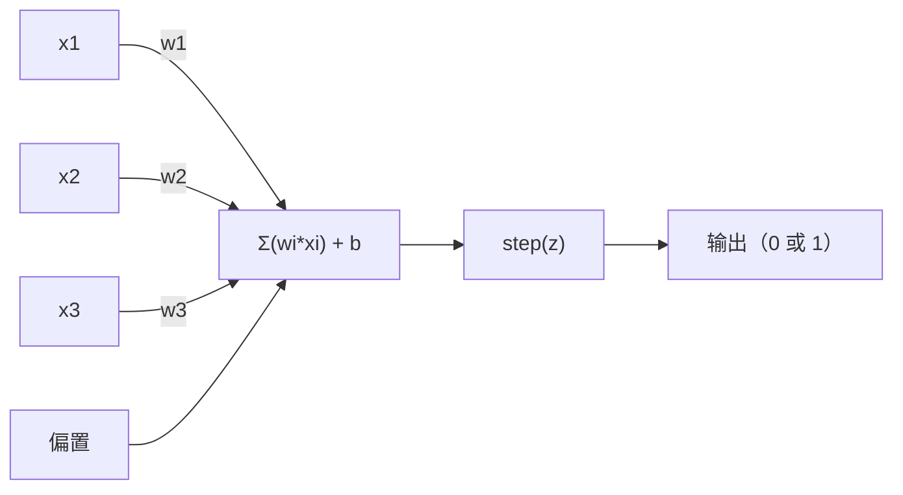
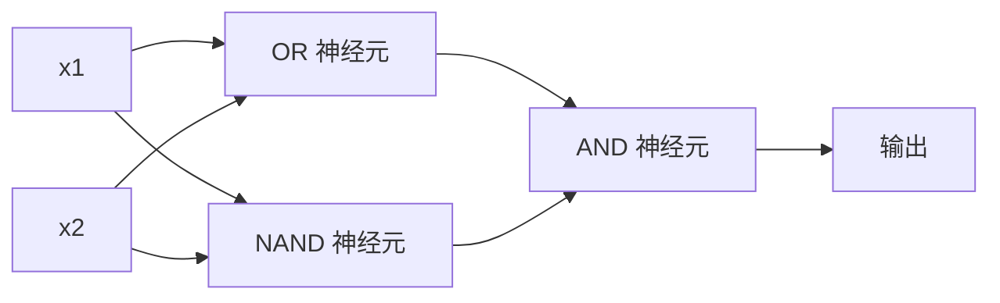

# 感知机（The Perceptron）

> 译注：本文译自同目录 [`en.md`](./en.md)。术语遵循仓根 [TRANSLATION_GUIDE.md](../../../../TRANSLATION_GUIDE.md)。

> 感知机是神经网络的原子。把它劈开，你会看到 weight（权重）、bias（偏置），以及一个决策。

**Type:** Build
**Languages:** Python
**Prerequisites:** Phase 1 (Linear Algebra Intuition)
**Time:** ~60 minutes

## 学习目标（Learning Objectives）

- 用 Python 从零实现一个感知机，包括权重更新规则和阶跃激活函数
- 解释为什么单个感知机只能解决线性可分问题，并演示 XOR 这个失败案例
- 通过组合 OR、NAND、AND 门来构造一个多层感知机（multi-layer perceptron），用它解决 XOR
- 用 sigmoid 激活函数和反向传播（backpropagation）训练一个两层网络，让它自动学会 XOR

## 问题（The Problem）

你已经懂向量和点积了。你也知道矩阵把输入变换成输出。但是机器到底是怎么*学*出该用哪种变换的？

感知机给出了答案。它是最简单的学习机器：拿一些输入，乘上 weight，加上 bias，然后做一个二值决策。然后调整。就这样。所有神经网络说到底，都是把这个想法层层堆起来。

理解感知机，就是理解代码里「学习」到底是什么意思：调整数字，直到输出和真实情况对上。

## 概念（The Concept）

### 一个神经元，一个决策（One Neuron, One Decision）

感知机接收 n 个输入，每个乘上一个 weight，求和后加上 bias，然后把结果送进一个激活函数。



阶跃函数（step function）很粗暴：如果加权和加 bias 大于等于 0，输出 1；否则输出 0。

```
step(z) = 1  if z >= 0
           0  if z < 0
```

这是一个线性分类器。weight 和 bias 定义了一条直线（在更高维度里就是超平面），把输入空间切成两块。

### 决策边界（The Decision Boundary）

对于两个输入，感知机在 2D 空间里画一条线：

```
  x2
  ┤
  │  Class 1        /
  │    (0)          /
  │                /
  │               / w1·x1 + w2·x2 + b = 0
  │              /
  │             /     Class 2
  │            /        (1)
  ┼───────────/──────────── x1
```

线一侧的所有点输出 0，另一侧输出 1。训练就是在挪这条线，直到它把两类正确地分开。

### 学习规则（The Learning Rule）

感知机的学习规则很简单：

```
For each training example (x, y_true):
    y_pred = predict(x)
    error = y_true - y_pred

    For each weight:
        w_i = w_i + learning_rate * error * x_i
    bias = bias + learning_rate * error
```

预测对了，error = 0，什么都不变。该输出 1 却预测成了 0，weight 增大；该输出 0 却预测成了 1，weight 减小。learning rate 控制每次调整的幅度。

### XOR 问题（The XOR Problem）

问题就出在这里。看看下面这些逻辑门：

```
AND gate:           OR gate:            XOR gate:
x1  x2  out         x1  x2  out         x1  x2  out
0   0   0           0   0   0           0   0   0
0   1   0           0   1   1           0   1   1
1   0   0           1   0   1           1   0   1
1   1   1           1   1   1           1   1   0
```

AND 和 OR 是线性可分的：你可以画一条直线把 0 和 1 分开。XOR 不行。没有任何一条直线能把 [0,1] 和 [1,0] 与 [0,0] 和 [1,1] 分开。

```
AND (separable):        XOR (not separable):

  x2                      x2
  1 ┤  0     1            1 ┤  1     0
    │     /                 │
  0 ┤  0 / 0              0 ┤  0     1
    ┼──/──────── x1         ┼──────────── x1
       line works!          no single line works!
```

这是个根本性的限制。单个感知机只能解决线性可分问题。Minsky 和 Papert 在 1969 年证明了这一点，几乎一手把神经网络研究打入冷宫长达十年。

补救办法是：把感知机堆成多层。多层感知机可以把两个线性决策组合成一个非线性决策，从而解决 XOR。

## 动手实现（Build It）

### 第 1 步：Perceptron 类（Step 1: The Perceptron class）

```python
class Perceptron:
    def __init__(self, n_inputs, learning_rate=0.1):
        self.weights = [0.0] * n_inputs
        self.bias = 0.0
        self.lr = learning_rate

    def predict(self, inputs):
        total = sum(w * x for w, x in zip(self.weights, inputs))
        total += self.bias
        return 1 if total >= 0 else 0

    def train(self, training_data, epochs=100):
        for epoch in range(epochs):
            errors = 0
            for inputs, target in training_data:
                prediction = self.predict(inputs)
                error = target - prediction
                if error != 0:
                    errors += 1
                    for i in range(len(self.weights)):
                        self.weights[i] += self.lr * error * inputs[i]
                    self.bias += self.lr * error
            if errors == 0:
                print(f"Converged at epoch {epoch + 1}")
                return
        print(f"Did not converge after {epochs} epochs")
```

### 第 2 步：在逻辑门上训练（Step 2: Train on logic gates）

```python
and_data = [
    ([0, 0], 0),
    ([0, 1], 0),
    ([1, 0], 0),
    ([1, 1], 1),
]

or_data = [
    ([0, 0], 0),
    ([0, 1], 1),
    ([1, 0], 1),
    ([1, 1], 1),
]

not_data = [
    ([0], 1),
    ([1], 0),
]

print("=== AND Gate ===")
p_and = Perceptron(2)
p_and.train(and_data)
for inputs, _ in and_data:
    print(f"  {inputs} -> {p_and.predict(inputs)}")

print("\n=== OR Gate ===")
p_or = Perceptron(2)
p_or.train(or_data)
for inputs, _ in or_data:
    print(f"  {inputs} -> {p_or.predict(inputs)}")

print("\n=== NOT Gate ===")
p_not = Perceptron(1)
p_not.train(not_data)
for inputs, _ in not_data:
    print(f"  {inputs} -> {p_not.predict(inputs)}")
```

### 第 3 步：眼睁睁看着 XOR 失败（Step 3: Watch XOR fail）

```python
xor_data = [
    ([0, 0], 0),
    ([0, 1], 1),
    ([1, 0], 1),
    ([1, 1], 0),
]

print("\n=== XOR Gate (single perceptron) ===")
p_xor = Perceptron(2)
p_xor.train(xor_data, epochs=1000)
for inputs, expected in xor_data:
    result = p_xor.predict(inputs)
    status = "OK" if result == expected else "WRONG"
    print(f"  {inputs} -> {result} (expected {expected}) {status}")
```

它永远不会收敛。这就是「单个感知机无法学习 XOR」的硬证据。

### 第 4 步：用两层结构解决 XOR（Step 4: Solve XOR with two layers）

诀窍是：XOR = (x1 OR x2) AND NOT (x1 AND x2)。把三个感知机组合起来：



```python
def xor_network(x1, x2):
    or_neuron = Perceptron(2)
    or_neuron.weights = [1.0, 1.0]
    or_neuron.bias = -0.5

    nand_neuron = Perceptron(2)
    nand_neuron.weights = [-1.0, -1.0]
    nand_neuron.bias = 1.5

    and_neuron = Perceptron(2)
    and_neuron.weights = [1.0, 1.0]
    and_neuron.bias = -1.5

    hidden1 = or_neuron.predict([x1, x2])
    hidden2 = nand_neuron.predict([x1, x2])
    output = and_neuron.predict([hidden1, hidden2])
    return output


print("\n=== XOR Gate (multi-layer network) ===")
for inputs, expected in xor_data:
    result = xor_network(inputs[0], inputs[1])
    print(f"  {inputs} -> {result} (expected {expected})")
```

四种情况全部正确。把感知机堆成多层之后，就能造出任何单层感知机都画不出来的决策边界。

### 第 5 步：训练一个两层网络（Step 5: Train a Two-Layer Network）

第 4 步是手工把 weight 写死的。XOR 这种小问题这样可以，但真实问题里你根本不知道正确的 weight 长什么样。补救办法是：把阶跃函数换成 sigmoid，然后通过反向传播自动学出 weight。

```python
class TwoLayerNetwork:
    def __init__(self, learning_rate=0.5):
        import random
        random.seed(0)
        self.w_hidden = [[random.uniform(-1, 1), random.uniform(-1, 1)] for _ in range(2)]
        self.b_hidden = [random.uniform(-1, 1), random.uniform(-1, 1)]
        self.w_output = [random.uniform(-1, 1), random.uniform(-1, 1)]
        self.b_output = random.uniform(-1, 1)
        self.lr = learning_rate

    def sigmoid(self, x):
        import math
        x = max(-500, min(500, x))
        return 1.0 / (1.0 + math.exp(-x))

    def forward(self, inputs):
        self.inputs = inputs
        self.hidden_outputs = []
        for i in range(2):
            z = sum(w * x for w, x in zip(self.w_hidden[i], inputs)) + self.b_hidden[i]
            self.hidden_outputs.append(self.sigmoid(z))
        z_out = sum(w * h for w, h in zip(self.w_output, self.hidden_outputs)) + self.b_output
        self.output = self.sigmoid(z_out)
        return self.output

    def train(self, training_data, epochs=10000):
        for epoch in range(epochs):
            total_error = 0
            for inputs, target in training_data:
                output = self.forward(inputs)
                error = target - output
                total_error += error ** 2

                d_output = error * output * (1 - output)

                saved_w_output = self.w_output[:]
                hidden_deltas = []
                for i in range(2):
                    h = self.hidden_outputs[i]
                    hd = d_output * saved_w_output[i] * h * (1 - h)
                    hidden_deltas.append(hd)

                for i in range(2):
                    self.w_output[i] += self.lr * d_output * self.hidden_outputs[i]
                self.b_output += self.lr * d_output

                for i in range(2):
                    for j in range(len(inputs)):
                        self.w_hidden[i][j] += self.lr * hidden_deltas[i] * inputs[j]
                    self.b_hidden[i] += self.lr * hidden_deltas[i]
```

```python
net = TwoLayerNetwork(learning_rate=2.0)
net.train(xor_data, epochs=10000)
for inputs, expected in xor_data:
    result = net.forward(inputs)
    predicted = 1 if result >= 0.5 else 0
    print(f"  {inputs} -> {result:.4f} (rounded: {predicted}, expected {expected})")
```

和第 4 步有两点关键区别。第一，sigmoid 取代了阶跃函数——它是平滑的，所以梯度存在。第二，`train` 方法把误差从输出层往回传到隐藏层，按每个 weight 对误差的贡献比例来调整它。这就是 20 行代码里的反向传播。

这是通往 Lesson 03 的桥梁。`d_output` 和 `hidden_deltas` 背后的数学，就是把链式法则套用到网络图上。我们会在那一课里把它推导清楚。

## 用起来（Use It）

你刚才从零搭出来的所有东西，其实一行 import 就能拿到：

```python
from sklearn.linear_model import Perceptron as SkPerceptron
import numpy as np

X = np.array([[0,0],[0,1],[1,0],[1,1]])
y = np.array([0, 0, 0, 1])

clf = SkPerceptron(max_iter=100, tol=1e-3)
clf.fit(X, y)
print([clf.predict([x])[0] for x in X])
```

五行。你那 30 行的 `Perceptron` 类做的是同一件事。sklearn 版多了收敛检查、多种损失函数、稀疏输入支持——但核心循环一模一样：加权和、阶跃函数、根据 error 更新 weight。

真正的差距出现在规模上。生产级网络里改变的是这些：

- 阶跃函数变成 sigmoid、ReLU 或其他平滑激活函数
- weight 通过反向传播自动学出来（Lesson 03）
- 层数变深：3、10、100+ 层
- 同一原理依然成立：每一层用上一层的输出造出新的特征

单个感知机只能画直线。把它们堆起来，你就能画出任何形状。

## 上线部署（Ship It）

本课产出：
- `outputs/skill-perceptron.md` —— 一份 skill，讲清楚什么时候需要单层、什么时候需要多层架构

## 练习（Exercises）

1. 在 NAND 门上训练一个感知机（NAND 是通用门——任何逻辑电路都能由 NAND 搭出来）。验证它的 weight 和 bias 形成了一条合法的决策边界。
2. 改造 Perceptron 类，让它在每个 epoch 都记录决策边界（w1*x1 + w2*x2 + b = 0）。打印出在 AND 门训练过程中这条线是怎么挪动的。
3. 构造一个 3 输入的感知机：当 3 个输入里至少有 2 个为 1 时输出 1（一个多数投票函数）。这线性可分吗？为什么？

## 关键术语（Key Terms）

| 术语 | 大家嘴上说的 | 它实际指什么 |
|------|----------------|----------------------|
| Perceptron（感知机） | 「假神经元」 | 一个线性分类器：输入和 weight 的点积，加上 bias，再过一个阶跃函数 |
| Weight（权重） | 「某个输入有多重要」 | 一个乘子，缩放每个输入对决策的贡献 |
| Bias（偏置） | 「阈值」 | 一个常数，平移决策边界，让感知机即使在零输入时也可能激活 |
| Activation function（激活函数） | 「把数值挤一挤的东西」 | 加权和之后施加的函数——感知机用阶跃函数，现代网络用 sigmoid/ReLU |
| Linearly separable（线性可分） | 「可以画一条线把它们分开」 | 一个数据集，存在一个超平面能把不同类别完美分开 |
| XOR problem（XOR 问题） | 「感知机搞不定的那个事」 | 单层网络无法学习非线性可分函数的证据 |
| Decision boundary（决策边界） | 「分类器切换的地方」 | 把输入空间切成两类的超平面 w*x + b = 0 |
| Multi-layer perceptron（多层感知机） | 「真正的神经网络」 | 一层层堆起来的感知机，每一层的输出喂给下一层的输入 |

## 延伸阅读（Further Reading）

- Frank Rosenblatt, "The Perceptron: A Probabilistic Model for Information Storage and Organization in the Brain" (1958) —— 一切的源头那篇原始论文
- Minsky & Papert, "Perceptrons" (1969) —— 这本书证明了 XOR 无法被单层网络解决，把感知机研究打入冷宫十年
- Michael Nielsen, "Neural Networks and Deep Learning", Chapter 1 (http://neuralnetworksanddeeplearning.com/) —— 免费在线书，对感知机如何组合成网络给出了最好的可视化解释
