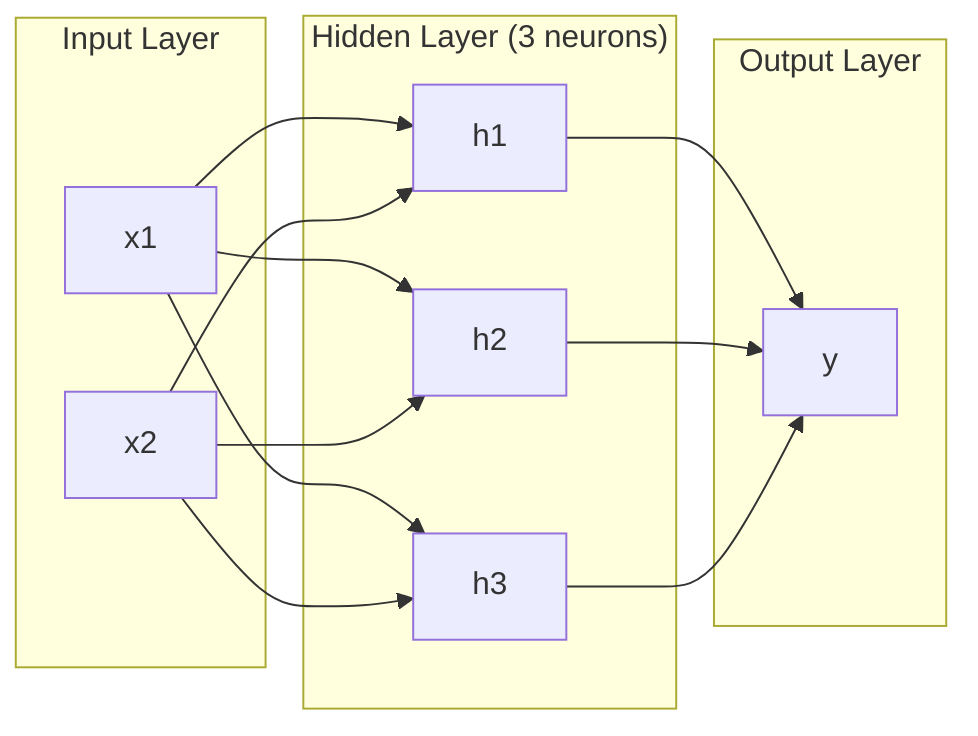
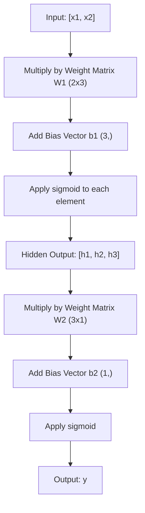
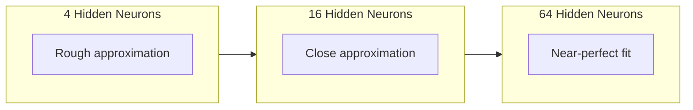

# 多層ネットワークとフォワードパス

> 1つのニューロンが引けるのは1本の直線です。積み重ねれば、どんな形でも描けます。

**種類:** Build
**言語:** Python
**前提条件:** Phase 01 (Math Foundations), Lesson 03.01 (The Perceptron)
**所要時間:** 約90分

## 学習目標

- 完全なフォワードパスを実行するLayerクラスとNetworkクラスを使い、多層ネットワークをゼロから作る
- ネットワークの各層を通る行列次元を追跡し、shapeの不一致を見つける
- 非線形な活性化関数を積み重ねることで、ネットワークが曲線の決定境界を学習できる理由を説明する
- 手で調整したsigmoidの重みを使い、2-2-1アーキテクチャでXOR問題を解く

## 問題

単一のニューロンは直線を引く機械です。それだけです。データの中に1本の直線を引きます。AIにおける現実の問題、つまり画像認識、言語理解、囲碁のプレイには、どれも曲線が必要です。ニューロンを層として積み重ねることで、曲線を得られます。

1969年、MinskyとPapertはこの限界が致命的であることを証明しました。単層ネットワークはXORを学習できません。「学習しにくい」のではありません。数学的に不可能です。XORの真理値表では [0,1] と [1,0] が一方に、[0,0] と [1,1] がもう一方にあります。これらを分ける1本の直線は存在しません。

この結果により、ニューラルネットワークへの資金は10年以上にわたって冷え込みました。振り返れば解決策は明らかです。1層だけを使うのをやめればよいのです。ニューロンを層として積み重ねます。最初の層に入力空間を新しい特徴へ切り分けさせ、2番目の層にその特徴を組み合わせさせることで、1本の直線ではできない判断を可能にします。

その積み重ねが多層ネットワークです。これは現在本番で使われているすべての深層学習モデルの基礎です。フォワードパス、つまり入力から隠れ層を通って出力へデータが流れる処理は、ほかのすべてが機能する前に最初に作るべきものです。

## 概念

### 層: 入力、隠れ、出力

多層ネットワークには3種類の層があります。

**入力層** -- 厳密には層ではありません。生データを保持します。特徴量が2つなら入力ノードは2つです。ここでは計算は起きません。

**隠れ層** -- 実際の仕事が行われる場所です。各ニューロンは前の層のすべての出力を受け取り、重みとバイアスを適用し、その結果を活性化関数に通します。訓練データの中でこれらの値を直接見ることはないため「隠れ」と呼ばれます。

**出力層** -- 最終的な答えです。二値分類ではsigmoidを持つ1つのニューロンを使います。多クラス分類では、クラスごとに1つのニューロンを使います。



これは2-3-1ネットワークです。入力が2つ、隠れニューロンが3つ、出力が1つです。すべての接続には重みがあります。入力を除くすべてのニューロンにはバイアスがあります。

各層は、隠れ状態と呼ばれる数値ベクトルを生成します。テキストでは、隠れ状態は次元を増やします。たとえば単語を768個の数値として符号化し、意味を捉えます。画像では、隠れ状態は次元を減らします。数百万ピクセルを扱いやすい表現へ圧縮します。学習が宿る場所は、この隠れ状態です。

### ニューロンと活性化関数

各ニューロンは3つのことを行います。

1. 各入力に対応する重みを掛ける
2. すべての積を合計し、バイアスを足す
3. その合計を活性化関数に通す

ここでは活性化関数としてsigmoidを使います。

```
sigmoid(z) = 1 / (1 + e^(-z))
```

sigmoidはどんな数値も (0, 1) の範囲へ押し込みます。大きな正の入力は1へ近づきます。大きな負の入力は0へ近づきます。0は0.5に写されます。この滑らかな曲線が学習を可能にします。パーセプトロンの硬いステップ関数と違い、sigmoidにはどこでも勾配があります。

### フォワードパス: データの流れ

フォワードパスは、入力データをネットワークの層から層へ押し流し、出力に到達させます。フォワードパス中には学習は起きません。これは純粋な計算です。掛ける、足す、活性化する、を繰り返します。



各層では、3つの操作が順番に起きます。

```
z = W * input + b       (linear transformation)
a = sigmoid(z)           (activation)
```

ある層の出力が、次の層の入力になります。これがフォワードパスのすべてです。

### 行列の次元

次元を追跡することは、深層学習で最も重要なデバッグ技術です。2-3-1ネットワークを見てみましょう。

| ステップ | 操作 | 次元 | 結果のshape |
|----------|------|------|-------------|
| 入力 | x | -- | (2,) |
| 隠れ層の線形変換 | W1 * x + b1 | W1: (3, 2), b1: (3,) | (3,) |
| 隠れ層の活性化 | sigmoid(z1) | -- | (3,) |
| 出力層の線形変換 | W2 * h + b2 | W2: (1, 3), b2: (1,) | (1,) |
| 出力層の活性化 | sigmoid(z2) | -- | (1,) |

ルールはこうです。層kの重み行列Wは (neurons_in_layer_k, neurons_in_layer_k_minus_1) というshapeを持ちます。行は現在の層に対応します。列は前の層に対応します。shapeが合わなければ、そこにバグがあります。

### 普遍近似定理

1989年、George Cybenkoは驚くべきことを証明しました。1つの隠れ層と十分な数のニューロンを持つニューラルネットワークは、任意の連続関数を任意の精度で近似できます。

これは、隠れ層が1つのネットワークが常に最良だという意味ではありません。アーキテクチャとして理論上は可能だという意味です。実際には、より深いネットワーク（層が多く、各層のニューロンが少ないネットワーク）のほうが、浅く広いネットワークよりもはるかに少ない総パラメータ数で同じ関数を学習できます。これが深層学習が機能する理由です。

直感的には、隠れ層の各ニューロンが1つの「こぶ」や特徴を学習します。十分な数のこぶを適切な位置に置けば、どんな滑らかな曲線でも近似できます。ニューロンが増えれば、こぶが増え、近似は良くなります。



### 合成可能性

ニューラルネットワークは合成できます。積み重ねたり、連結したり、並列に実行したりできます。Whisperモデルは音声を処理するエンコーダネットワークと、テキストを生成する別のデコーダネットワークを使います。現代のLLMはdecoder-onlyです。BERTはencoder-onlyです。T5はencoder-decoderです。どのアーキテクチャを選ぶかによって、モデルができることが決まります。

## 作ってみる

純粋なPythonです。numpyは使いません。すべての行列操作をゼロから書きます。

### Step 1: Sigmoid活性化関数

```python
import math

def sigmoid(x):
    x = max(-500.0, min(500.0, x))
    return 1.0 / (1.0 + math.exp(-x))
```

[-500, 500] にクランプすることでオーバーフローを防ぎます。`math.exp(500)` は大きいですが有限です。`math.exp(1000)` は無限大になります。

### Step 2: Layerクラス

深層学習で最も重要な操作は行列乗算です。すべての層、すべてのattention head、すべてのフォワードパスは、突き詰めれば行列乗算です。線形層は入力ベクトルを受け取り、重み行列を掛け、バイアスベクトルを足します。y = Wx + b。この1本の式が、ニューラルネットワークの計算量の90%を占めます。

Layerは重み行列とバイアスベクトルを保持します。forwardメソッドは入力ベクトルを受け取り、活性化後の出力を返します。

```python
class Layer:
    def __init__(self, n_inputs, n_neurons, weights=None, biases=None):
        if weights is not None:
            self.weights = weights
        else:
            import random
            self.weights = [
                [random.uniform(-1, 1) for _ in range(n_inputs)]
                for _ in range(n_neurons)
            ]
        if biases is not None:
            self.biases = biases
        else:
            self.biases = [0.0] * n_neurons

    def forward(self, inputs):
        self.last_input = inputs
        self.last_output = []
        for neuron_idx in range(len(self.weights)):
            z = sum(
                w * x for w, x in zip(self.weights[neuron_idx], inputs)
            )
            z += self.biases[neuron_idx]
            self.last_output.append(sigmoid(z))
        return self.last_output
```

重み行列のshapeは (n_neurons, n_inputs) です。各行が、1つのニューロンについて全入力に対する重みを表します。forwardメソッドはニューロンを順番に処理し、重み付き和にバイアスを足し、sigmoidを適用して、結果を集めます。

### Step 3: Networkクラス

Networkは層のリストです。フォワードパスではそれらをつなぎます。層kの出力が層k+1へ入力されます。

```python
class Network:
    def __init__(self, layers):
        self.layers = layers

    def forward(self, inputs):
        current = inputs
        for layer in self.layers:
            current = layer.forward(current)
        return current
```

これがフォワードパス全体です。ロジックは4行です。データが入り、すべての層を流れ、反対側から出てきます。

### Step 4: 手で調整した重みによるXOR

Lesson 01では、OR、NAND、ANDパーセプトロンを組み合わせてXORを解きました。ここでは同じことをLayerクラスとNetworkクラスで行います。2-2-1アーキテクチャです。入力が2つ、隠れニューロンが2つ、出力が1つです。

```python
hidden = Layer(
    n_inputs=2,
    n_neurons=2,
    weights=[[20.0, 20.0], [-20.0, -20.0]],
    biases=[-10.0, 30.0],
)

output = Layer(
    n_inputs=2,
    n_neurons=1,
    weights=[[20.0, 20.0]],
    biases=[-30.0],
)

xor_net = Network([hidden, output])

xor_data = [
    ([0, 0], 0),
    ([0, 1], 1),
    ([1, 0], 1),
    ([1, 1], 0),
]

for inputs, expected in xor_data:
    result = xor_net.forward(inputs)
    predicted = 1 if result[0] >= 0.5 else 0
    print(f"  {inputs} -> {result[0]:.6f} (rounded: {predicted}, expected: {expected})")
```

大きな重み（20、-20）によって、sigmoidはステップ関数のように振る舞います。最初の隠れニューロンはORを近似します。2番目はNANDを近似します。出力ニューロンはそれらをANDにまとめます。これがXORです。

### Step 5: 円の分類

より難しい問題です。原点を中心とする半径0.5の円の内側か外側かで、2D点を分類します。これには曲線の決定境界が必要です。単一のパーセプトロンでは不可能です。

```python
import random
import math

random.seed(42)

data = []
for _ in range(200):
    x = random.uniform(-1, 1)
    y = random.uniform(-1, 1)
    label = 1 if (x * x + y * y) < 0.25 else 0
    data.append(([x, y], label))

circle_net = Network([
    Layer(n_inputs=2, n_neurons=8),
    Layer(n_inputs=8, n_neurons=1),
])
```

ランダムな重みでは、このネットワークはうまく分類できません。それでもフォワードパスは動きます。ここが重要です。フォワードパスはただの計算です。正しい重みを学習するのがバックプロパゲーションで、それはLesson 03で扱います。

```python
correct = 0
for inputs, expected in data:
    result = circle_net.forward(inputs)
    predicted = 1 if result[0] >= 0.5 else 0
    if predicted == expected:
        correct += 1

print(f"Accuracy with random weights: {correct}/{len(data)} ({100*correct/len(data):.1f}%)")
```

ランダムな重みでは精度は低く、多数派クラスを当てるだけより悪いこともよくあります。訓練後（Lesson 03）には、この同じアーキテクチャが8個の隠れニューロンで内側と外側を分ける曲線境界を描くようになります。

## 使ってみる

PyTorchでは、ここまでのすべてを4行で行えます。

```python
import torch
import torch.nn as nn

model = nn.Sequential(
    nn.Linear(2, 8),
    nn.Sigmoid(),
    nn.Linear(8, 1),
    nn.Sigmoid(),
)

x = torch.tensor([[0.0, 0.0], [0.0, 1.0], [1.0, 0.0], [1.0, 1.0]])
output = model(x)
print(output)
```

`nn.Linear(2, 8)` はあなたのLayerクラスです。shapeが (8, 2) の重み行列と、shapeが (8,) のバイアスベクトルを持ちます。`nn.Sigmoid()` は要素ごとに適用されるsigmoid関数です。`nn.Sequential` はあなたのNetworkクラスです。層を順番につなぎます。

違いは速度と規模です。PyTorchはGPUで動き、何百万ものサンプルのバッチを扱い、バックプロパゲーションのための勾配を自動的に計算します。それでもフォワードパスのロジックは、ここでゼロから作ったものと同じです。

## 成果物

このレッスンでは、ネットワークアーキテクチャを設計するための再利用可能なプロンプトを作ります。

- `outputs/prompt-network-architect.md`

与えられた問題に対して、層の数、各層のニューロン数、使う活性化関数を決める必要があるときに使ってください。

## 演習

1. 2-4-2-1ネットワーク（2つの隠れ層）を作り、ランダムな重みでXORデータにフォワードパスを実行してください。各層で表現がどう変換されるかを見るために、中間の隠れ層出力を出力しましょう。

2. 円分類器の隠れ層サイズを8から2へ、次に32へ変更してください。毎回ランダムな重みでフォワードパスを実行します。隠れニューロン数は出力範囲や分布を変えますか。なぜですか。

3. Networkクラスに `count_parameters` メソッドを実装し、訓練可能な重みとバイアスの総数を返すようにしてください。784-256-128-10ネットワーク（古典的なMNISTアーキテクチャ）でテストします。パラメータはいくつありますか。

4. 3-4-4-2ネットワークのフォワードパスを作ってください。RGBの色値（0-1に正規化）を入力し、2つの出力を観察します。これは2クラスの簡単な色分類器のアーキテクチャです。

5. sigmoidを「leaky step」関数に置き換えてください。z < 0 なら 0.01 * z を返し、それ以外なら 1.0 を返します。Step 4と同じ手で調整した重みでXORにフォワードパスを実行します。まだ動きますか。硬いしきい値より滑らかなsigmoidが好まれるのはなぜですか。

## 重要用語

| 用語 | よくある言い方 | 実際の意味 |
|------|----------------|------------|
| フォワードパス | 「モデルを実行する」 | 入力をすべての層へ通し、重みを掛け、バイアスを足し、活性化して出力を生成すること |
| 隠れ層 | 「真ん中の部分」 | 入力と出力の間にあり、値がデータ内で直接観測されない層 |
| 多層ネットワーク | 「深層ニューラルネットワーク」 | ニューロンの層を順番に積み重ね、各層の出力を次の層の入力にする構造 |
| 活性化関数 | 「非線形性」 | 線形変換の後に適用され、決定境界に曲線を導入する関数 |
| Sigmoid | 「S字カーブ」 | sigma(z) = 1/(1+e^(-z))。任意の実数を (0,1) に押し込み、滑らかでどこでも微分可能 |
| 重み行列 | 「パラメータ」 | shapeが (current_layer_neurons, previous_layer_neurons) の行列W。学習可能な接続強度を含む |
| バイアスベクトル | 「オフセット」 | 行列乗算の後に足されるベクトル。すべての入力がゼロでもニューロンが活性化できるようにする |
| 普遍近似 | 「ニューラルネットは何でも学習できる」 | 十分なニューロンを持つ1つの隠れ層は任意の連続関数を近似できる。ただし「十分」が数十億を意味することもある |
| 線形変換 | 「行列乗算のステップ」 | z = W * x + b。活性化前の計算で、入力を新しい空間へ写す |
| 決定境界 | 「分類器が切り替わる場所」 | ネットワーク出力が分類しきい値をまたぐ入力空間上の面 |

## 参考資料

- Michael Nielsen, "Neural Networks and Deep Learning", Chapter 1-2 (http://neuralnetworksanddeeplearning.com/) -- フォワードパスとネットワーク構造について、インタラクティブな可視化を交えた最も分かりやすい無料解説の一つ
- Cybenko, "Approximation by Superpositions of a Sigmoidal Function" (1989) -- 普遍近似定理の原論文。意外なほど読みやすい
- 3Blue1Brown, "But what is a neural network?" (https://www.youtube.com/watch?v=aircAruvnKk) -- 層、重み、フォワードパスを20分で視覚的に説明し、正しいメンタルモデルを作る動画
- Goodfellow, Bengio, Courville, "Deep Learning", Chapter 6 (https://www.deeplearningbook.org/) -- 多層ネットワークの標準的な参考文献。オンラインで無料公開
