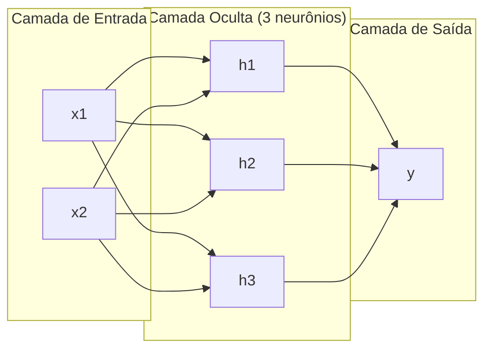
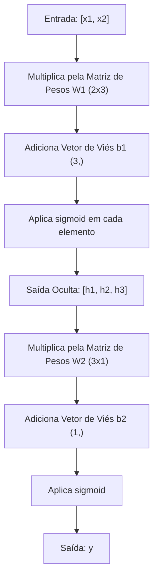
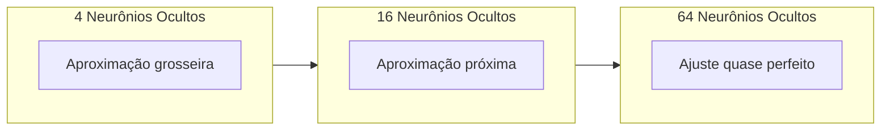

# Redes Multicamada e Passo Direto

> Um neurônio desenha uma reta. Empilhe eles e você desenha qualquer coisa.

**Tipo:** Construção
**Linguagens:** Python
**Pré-requisitos:** Fase 01 (Fundamentos Matemáticos), Aula 03.01 (O Perceptron)
**Tempo:** ~90 minutos

## Objetivos de Aprendizado

- Construir uma rede multicamada do zero com classes Layer e Network que executam um passo direto completo
- Rastrear as dimensões de matrizes através de cada camada da rede e identificar incompatibilidades de forma
- Explicar como empilhar ativações não lineares permite que a rede aprenda limites de decisão curvos
- Resolver o problema do XOR usando uma arquitetura 2-2-1 com pesos sigmoid ajustados manualmente

## O Problema

Um único neurônio é um desenhador de retas. É isso. Uma reta reta nos seus dados. Todo problema real em IA — reconhecimento de imagem, compreensão de linguagem, jogar Go — requer curvas. Empilhar neurônios em camadas é como você consegue curvas.

Em 1969, Minsky e Papert provaram que essa limitação era fatal: uma rede de uma camada não consegue aprender XOR. Não "tem dificuldade pra aprender" — matematicamente não consegue. A tabela-verdade do XOR coloca [0,1] e [1,0] de um lado, [0,0] e [1,1] do outro. Nenhuma reta separa eles.

Isso matou o financiamento de redes neurais por mais de uma década. A solução era óbvia em retroespecificaçãoto: pare de usar uma camada. Empilhe neurônios em camadas. Deixe a primeira camada esculpir o espaço de entrada em novas features, e deixe a segunda camada combinar essas features em decisões que nenhuma reta poderia tomar.

Esse empilhamento é a rede multicamada. Ela é a fundação de todo modelo de deep learning em produção hoje. O passo direto — dados fluindo da entrada pelas camadas ocultas até a saída — é a primeira coisa que você precisa construir antes que qualquer coisa funcione.

## O Conceito

### Camadas: Entrada, Oculta, Saída

Uma rede multicamada tem três tipos de camadas:

**Camada de entrada** — não é realmente uma camada. Segura seus dados brutos. Duas features significam dois nós de entrada. Nenhuma computação acontece aqui.

**Camadas ocultas** — onde o trabalho acontece. Cada neurônio pega toda saída da camada anterior, aplica pesos e um viés, e passa o resultado por uma função de ativação. "Oculta" porque você nunca vê esses valores diretamente nos dados de treino.

**Camada de saída** — a resposta final. Para classificação binária, um neurônio com sigmoid. Para múltiplas classes, um neurônio por classe.



Essa é uma rede 2-3-1. Duas entradas, três neurônios ocultos, uma saída. Cada conexão carrega um peso. Cada neurônio (exceto entrada) carrega um viés.

Cada camada produz um vetor de números chamado estado oculta. Para texto, estados ocultos aumentam a dimensionalidade — codificam uma palavra em 768 números pra capturar significado semântico. Para imagens, eles reduzem a dimensionalidade — comprimem milhões de pixels numa representação gerenciável. O estado oculta é onde o aprendizado mora.

### Neurônios e Ativações

Cada neurônio faz três coisas:

1. Multiplica cada entrada pelo seu peso correspondente
2. Soma todos os produtos e adiciona um viés
3. Passa a soma por uma função de ativação

Por enquanto, a ativação é sigmoid:

```
sigmoid(z) = 1 / (1 + e^(-z))
```

A sigmoid comprime qualquer número no intervalo (0, 1). Entradas positivas grandes empurram pra 1. Entradas negativas grandes empurram pra 0. Zero vai pra 0.5. Essa curva suave é o que torna o aprendizado possível — ao contrário do degrau duro do perceptron, a sigmoid tem gradiente em todo lugar.

### Passo Direto: Como os Dados Fluem

O passo direto empurra os dados de entrada pela rede, camada por camada, até chegar na saída. Nenhum aprendizado acontece durante o passo direto. É pura computação: multiplicar, somar, ativar, repetir.



Em cada camada, três operações acontecem em sequência:

```
z = W * input + b       (transformação linear)
a = sigmoid(z)           (ativação)
```

A saída de uma camada vira a entrada da outra. Isso é o passo direto inteiro.

### Dimensões das Matrizes

Rastrear dimensões é a habilidade de debug mais importante do deep learning. Aqui está a rede 2-3-1:

| Passo | Operação | Dimensões | Forma do Resultado |
|-------|----------|-----------|---------------------|
| Entrada | x | -- | (2,) |
| Linear oculta | W1 * x + b1 | W1: (3, 2), b1: (3,) | (3,) |
| Ativação oculta | sigmoid(z1) | -- | (3,) |
| Linear saída | W2 * h + b2 | W2: (1, 3), b2: (1,) | (1,) |
| Ativação saída | sigmoid(z2) | -- | (1,) |

A regra: a matriz de pesos W na camada k tem forma (neurônios_camada_k, neurônios_camada_k_menos_1). Linhas correspondem à camada atual. Colunas correspondem à camada anterior. Se as formas não alinharem, você tem um bug.

### Teorema de Aproximação Universal

Em 1989, George Cybenko provou algo notável: uma rede neural com uma camada oculta e neurônios suficientes pode aproximar qualquer função contínua com qualquer precisão desejada.

Isso não significa que uma camada oculta é sempre a melhor. Significa que a arquitetura é teoricamente capaz. Na prática, redes mais profundas (mais camadas, menos neurônios por camada) aprendem as mesmas funções com muito menos parâmetros totais que redes rasas e largas. É por que o deep learning funciona.

A intuição: cada neurônio na camada oculta aprende um "bump" ou feature. Bump suficientes colocados nos locais certos podem aproximar qualquer curva suave. Mais neurônios, mais bumps, melhor aproximação.



### Componibilidade

Redes neurais são componíveis. Você pode empilhar, encadear, rodar em paralelo. Um modelo Whisper usa uma rede encoder pra processar áudio e uma rede decoder separada pra gerar texto. LLMs modernos são só decoder. BERT é só encoder. T5 é encoder-decoder. A escolha da arquitetura define o que o modelo consegue fazer.

## Construa

Puro Python. Sem numpy. Cada operação de matriz escrita do zero.

### Passo 1: Função de Ativação Sigmoid

```python
import math

def sigmoid(x):
    x = max(-500.0, min(500.0, x))
    return 1.0 / (1.0 + math.exp(-x))
```

O clamp pra [-500, 500] previne overflow. `math.exp(500)` é grande mas finito. `math.exp(1000)` é infinito.

### Passo 2: Classe Layer

A operação mais importante de todo o deep learning é multiplicação de matriz. Cada camada, cada head de attention, cada passo direto — são matmuls até o fim. Uma camada linear pega um vetor de entrada, multiplica por uma matriz de pesos e adiciona um vetor de viés: y = Wx + b. Essa única equação é 90% da computação numa rede neural.

Uma camada segura uma matriz de pesos e um vetor de viés. Seu método forward pega um vetor de entrada e retorna a saída ativada.

```python
class Layer:
    def __init__(self, n_inputs, n_neurons, weights=None, biases=None):
        if weights is not None:
            self.weights = weights
        else:
            import random
            self.weights = [
                [random.uniform(-1, 1) for _ in range(n_inputs)]
                for _ in range(n_neurons)
            ]
        if biases is not None:
            self.biases = biases
        else:
            self.biases = [0.0] * n_neurons

    def forward(self, inputs):
        self.last_input = inputs
        self.last_output = []
        for neuron_idx in range(len(self.weights)):
            z = sum(
                w * x for w, x in zip(self.weights[neuron_idx], inputs)
            )
            z += self.biases[neuron_idx]
            self.last_output.append(sigmoid(z))
        return self.last_output
```

A matriz de pesos tem forma (n_neurons, n_inputs). Cada linha são os pesos de um neurônio em todas as entradas. O método forward itera pelos neurônios, calcula a soma ponderada mais viés, aplica sigmoid e coleta os resultados.

### Passo 3: Classe Network

Uma rede é uma lista de camadas. O passo direto encadeia elas: a saída da camada k alimenta a camada k+1.

```python
class Network:
    def __init__(self, layers):
        self.layers = layers

    def forward(self, inputs):
        current = inputs
        for layer in self.layers:
            current = layer.forward(current)
        return current
```

Isso é o passo direto inteiro. Quatro linhas de lógica. Dados entram, passam por cada camada, saem do outro lado.

### Passo 4: XOR com Pesos Ajustados Manualmente

Na Aula 01, resolvemos XOR combinando perceptrons OR, NAND e AGORA. Agora fazemos a mesma coisa com nossas classes Layer e Network. Arquitetura 2-2-1: duas entradas, dois neurônios ocultos, uma saída.

```python
hidden = Layer(
    n_inputs=2,
    n_neurons=2,
    weights=[[20.0, 20.0], [-20.0, -20.0]],
    biases=[-10.0, 30.0],
)

output = Layer(
    n_inputs=2,
    n_neurons=1,
    weights=[[20.0, 20.0]],
    biases=[-30.0],
)

xor_net = Network([hidden, output])

xor_data = [
    ([0, 0], 0),
    ([0, 1], 1),
    ([1, 0], 1),
    ([1, 1], 0),
]

for inputs, expected in xor_data:
    result = xor_net.forward(inputs)
    predicted = 1 if result[0] >= 0.5 else 0
    print(f"  {inputs} -> {result[0]:.6f} (rounded: {predicted}, expected: {expected})")
```

Os pesos grandes (20, -20) fazem a sigmoid agir como uma função degrau. O primeiro neurônio oculto aproxima OR. O segundo aproxima NAND. O neurônio de saída combina os dois em AND, que é XOR.

### Passo 5: Classificação de Círculo

Um problema mais difícil: classificar pontos 2D como dentro ou fora de um círculo de raio 0.5 centrado na origem. Isso requer um limite de decisão curvo — impossível pra um único perceptron.

```python
import random
import math

random.seed(42)

data = []
for _ in range(200):
    x = random.uniform(-1, 1)
    y = random.uniform(-1, 1)
    label = 1 if (x * x + y * y) < 0.25 else 0
    data.append(([x, y], label))

circle_net = Network([
    Layer(n_inputs=2, n_neurons=8),
    Layer(n_inputs=8, n_neurons=1),
])
```

Com pesos aleatórios, a rede não vai classificar bem. Mas o passo direto ainda roda. Esse é o ponto — o passo direto é só computação. Aprender os pesos certos é retropropagação, que vem na Aula 03.

```python
correct = 0
for inputs, expected in data:
    result = circle_net.forward(inputs)
    predicted = 1 if result[0] >= 0.5 else 0
    if predicted == expected:
        correct += 1

print(f"Accuracy with random weights: {correct}/{len(data)} ({100*correct/len(data):.1f}%)")
```

Pesos aleatórios dão acurácia ruim — frequentemente pior que adivinhar a classe majoritária. Depois do treino (Aula 03), essa mesma arquitetura com 8 neurônios ocultos vai desenhar um limite curvo que separa dentro de fora.

## Use

PyTorch faz tudo acima em quatro linhas:

```python
import torch
import torch.nn as nn

model = nn.Sequential(
    nn.Linear(2, 8),
    nn.Sigmoid(),
    nn.Linear(8, 1),
    nn.Sigmoid(),
)

x = torch.tensor([[0.0, 0.0], [0.0, 1.0], [1.0, 0.0], [1.0, 1.0]])
output = model(x)
print(output)
```

`nn.Linear(2, 8)` é sua classe Layer: matriz de pesos de forma (8, 2), vetor de viés de forma (8,). `nn.Sigmoid()` é sua função sigmoid aplicada elemento por elemento. `nn.Sequential` é sua classe Network: encadear camadas em ordem.

A diferença é velocidade e escala. PyTorch roda em GPUs, lida com lotes de milhões de amostras e computa gradientes automaticamente pra retropropagação. Mas a lógica do passo direto é idêntica ao que você construiu do zero.

## Entregue

Esta aula produz um prompt reutilizável pra projetar arquiteturas de rede:

- `outputs/prompt-network-architect.md`

Use quando precisar decidir quantas camadas, quantos neurônios por camada e quais funções de ativação usar pra um dado problema.

## Exercícios

1. Construa uma rede 2-4-2-1 (duas camadas ocultas) e execute o passo direto nos dados de XOR com pesos aleatórios. Imprima as saídas intermediárias das camadas ocultas pra ver como a representação se transforma em cada camada.

2. Altere o tamanho da camada oculta no classificador de círculo de 8 pra 2, depois pra 32. Execute o passo direto com pesos aleatórios cada vez. O número de neurônios ocultos muda a faixa ou distribuição da saída? Por quê?

3. Implemente um método `count_parameters` na classe Network que retorne o total de pesos e vieses treináveis. Teste numa rede 784-256-128-10 (a arquitetura clássica do MNIST). Quantos parâmetros ela tem?

4. Construa um passo direto pra uma rede 3-4-4-2. Alimente com valores de cores RGB (normalizados entre 0-1) e observe as duas saídas. Essa é a arquitetura pra um classificador simples de cores com duas classes.

5. Substitua a sigmoid por uma função "degrau com vazamento": retorne 0.01 * z se z < 0, senão 1.0. Execute o passo direto no XOR com os mesmos pesos ajustados manualmente do passo 4. Ainda funciona? Por que a sigmoid suave é preferida em vez de cortes duros?

## Termos-Chave

| Termo | O que o pessoal diz | O que realmente significa |
|-------|---------------------|--------------------------|
| Passo direto | "Rodar o modelo" | Empurrar a entrada por cada camada — multiplicar por pesos, somar viés, ativar — pra produzir uma saída |
| Camada oculta | "A parte do meio" | Qualquer camada entre entrada e saída cujos valores não são observados diretamente nos dados |
| Rede multicamada | "Uma rede neural profunda" | Camadas de neurônios empilhadas sequencialmente, onde a saída de cada camada alimenta a entrada da próxima |
| Função de ativação | "A não linearidade" | Uma função aplicada após a transformação linear que introduz curvas no limite de decisão |
| Sigmoid | "A curva S" | sigma(z) = 1/(1+e^(-z)), comprime qualquer número real em (0,1), suave e diferenciável em todo lugar |
| Matriz de pesos | "Os parâmetros" | Uma matriz W de forma (neurônios_camada_atual, neurônios_camada_anterior) contendo intensidades de conexão aprendíveis |
| Vetor de viés | "O offset" | Um vetor adicionado após a multiplicação de matriz que permite neurônios se ativarem mesmo quando todas entradas são zero |
| Aproximação universal | "Redes neurais aprendem qualquer coisa" | Uma única camada oculta com neurônios suficientes pode aproximar qualquer função contínua — mas "suficientes" pode significar bilhões |
| Transformação linear | "O passo de multiplicação de matriz" | z = W * x + b, a computação antes da ativação, que mapeia entradas pra um novo espaço |
| Limite de decisão | "Onde o classificador troca" | A superfície no espaço de entrada onde a saída da rede cruza o limiar de classificação |

## Leituras Complementares

- Michael Nielsen, "Neural Networks and Deep Learning", Capítulos 1-2 (http://neuralnetworksanddeeplearning.com/) — a explicação gratuita mais clara de passos diretos e estrutura de rede, com visualizações interativas
- Cybenko, "Approximation by Superpositions of a Sigmoidal Function" (1989) — o artigo original do teorema de aproximação universal, surpreendentemente legível
- 3Blue1Brown, "But what is a neural network?" (https://www.youtube.com/watch?v=aircAruvnKk) — caminhada visual de 20 minutos sobre camadas, pesos e passos diretos que constrói o modelo mental certo
- Goodfellow, Bengio, Courville, "Deep Learning", Capítulo 6 (https://www.deeplearningbook.org/) — a referência padrão pra redes multicamada, gratuito online
