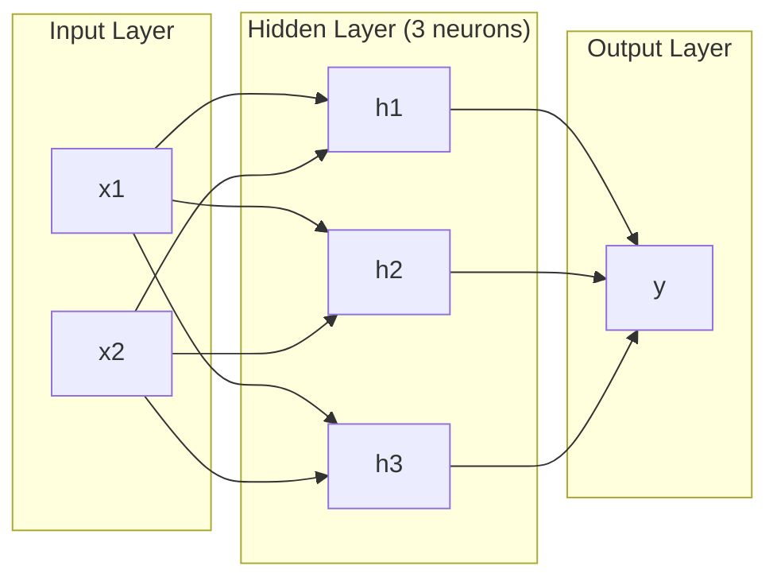
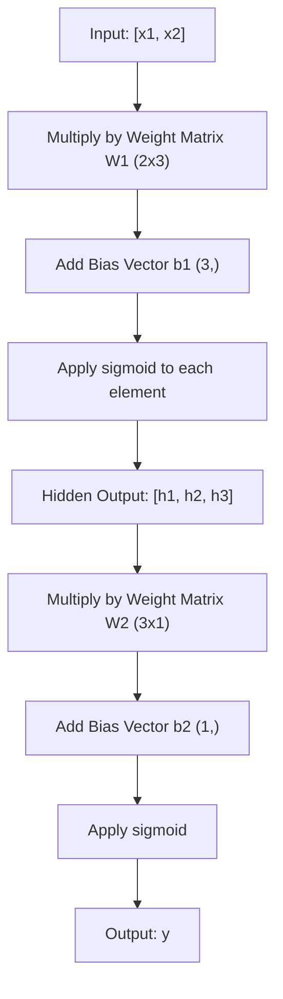
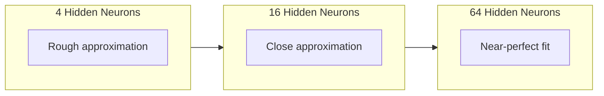

# Çok Katmanlı Ağlar ve İleri Geçiş

> Bir nöron bir çizgi çizer. Onları istifleyin ve her şeyi çizebilirsiniz.

**Tür:** Yapım
**Diller:** Python
**Önkoşullar:** Aşama 01 (Matematik Temelleri), Ders 03.01 (Perceptron)
**Süre:** ~90 dakika

## Öğrenme Hedefleri

- Tam bir ileri geçiş gerçekleştiren Katman ve Ağ sınıflarıyla sıfırdan çok katmanlı bir ağ oluşturun
- Bir ağın her katmanı boyunca matris boyutlarını izleyin ve şekil uyumsuzluklarını belirleyin
- Doğrusal olmayan aktivasyonların istiflenmesinin bir ağın kavisli karar sınırlarını öğrenmesini nasıl sağladığını açıklayın
- Elle ayarlanmış sigmoid ağırlıklara sahip 2-2-1 mimarisini kullanarak XOR problemini çözün

## Sorun

Tek bir nöron bir çizgi çekmecesidir. İşte bu. Verileriniz boyunca tek bir düz çizgi. Yapay zekadaki her gerçek problem (görüntü tanıma, dil anlama, Go oynama) eğriler gerektirir. Nöronları katmanlara istifleyerek eğriler elde edersiniz.

1969'da Minsky ve Papert bu sınırlamanın ölümcül olduğunu kanıtladı: tek katmanlı bir ağ XOR'u öğrenemez. "Öğrenme mücadelesi" değil; matematiksel olarak yapamaz. XOR doğruluk tablosu [0,1] ve [1,0]'ı bir tarafa, [0,0] ve [1,1]'i diğer tarafa yerleştirir. Onları ayıran tek bir çizgi yok.

Bu, on yıldan fazla bir süre boyunca neural network fonunu öldürdü. Geriye dönüp bakıldığında düzeltme açıktı: tek katmanı kullanmayı bırakın. Nöronları katmanlara ayırın. İlk katmanın girdi alanını yeni özelliklere ayırmasına izin verin ve ikinci katmanın bu özellikleri hiçbir satırın veremeyeceği kararlarla birleştirmesine izin verin.

Bu yığın çok katmanlı ağdır. Bugün üretimde olan her deep learning modelinin temelidir. İleri geçiş (verilerin girdiden gizli katmanlara ve çıktıya doğru akması), başka herhangi bir şeyin işe yaramasından önce oluşturmanız gereken ilk şeydir.

## Konsept

### Katmanlar: Giriş, Gizli, Çıkış

Çok katmanlı bir ağda üç tür katman bulunur:

**Giriş katmanı** -- aslında bir katman değil. Ham verilerinizi tutar. İki özellik, iki giriş düğümü anlamına gelir. Burada hiçbir hesaplama yapılmaz.

**Gizli katmanlar** -- işin gerçekleştiği yer. Her nöron bir önceki katmandaki tüm çıktıları alır, ağırlıklar ve bir sapma uygular ve ardından sonucu bir aktivasyon fonksiyonundan geçirir. "Gizli" çünkü bu değerleri hiçbir zaman doğrudan eğitim verilerinde görmezsiniz.

**Çıktı katmanı** -- son yanıt. İkili sınıflandırma için sigmoidli bir nöron. Çoklu sınıf için sınıf başına bir nöron.



Bu 2-3-1 ağıdır. İki giriş, üç gizli nöron, bir çıkış. Her bağlantının bir ağırlığı vardır. Her nöron (giriş hariç) bir önyargı taşır.

Her katman, gizli durum adı verilen bir sayı vektörü üretir. Metin için, gizli durumlar boyutluluğu artırır; anlamsal anlamı yakalamak için bir kelimeyi 768 sayı olarak kodlar. Görüntüler için, milyonlarca pikseli yönetilebilir bir gösterime sıkıştırarak boyutluluğu azaltırlar. Gizli durum öğrenmenin yaşadığı yerdir.

### Nöronlar ve Aktivasyonlar

Her nöron üç şey yapar:

1. Her girdiyi karşılık gelen ağırlıkla çarpın
2. Tüm çarpımları toplayın ve bir önyargı ekleyin
3. Toplamı bir aktivasyon fonksiyonundan geçirin

Şimdilik aktivasyon sigmoid:

```
sigmoid(z) = 1 / (1 + e^(-z))
```

Sigmoid herhangi bir sayıyı (0, 1) aralığına sıkıştırır. Büyük pozitif girdiler 1'e doğru iter. Büyük negatif girdiler 0'a doğru iter. Sıfır, 0,5'e eşleşir. Bu düzgün eğri, öğrenmeyi mümkün kılan şeydir; algılayıcının sert adımının aksine, sigmoid'in her yerinde bir gradient vardır.

### İleri Geçiş: Veri Akışı

İleri geçiş, giriş verilerini çıkışa ulaşana kadar ağ üzerinden katman katman iletir. İleri geçiş sırasında hiçbir öğrenme gerçekleşmez. Bu saf bir hesaplamadır: çarpın, ekleyin, etkinleştirin, tekrarlayın.



Her katmanda sırayla üç işlem gerçekleşir:

```
z = W * input + b       (linear transformation)
a = sigmoid(z)           (activation)
```

Bir katmanın çıktısı bir sonraki katmanın girdisi olur. İleri pasın tamamı budur.

### Matris Boyutları

Boyutları izleme, deep learning'deki en önemli hata ayıklama becerisidir. İşte 2-3-1 ağı:

| Adım | Operasyon | Boyutlar | Sonuç Şekli |
|------|-----------|------------|-------------|
| Giriş | x | -- | (2,) |
| Gizli doğrusal | W1 * x + b1 | W1: (3, 2), b1: (3,) | (3,) |
| Gizli etkinleştirme | sigmoid(z1) | -- | (3,) |
| Çıkış doğrusal | W2 * sa + b2 | W2: (1, 3), b2: (1,) | (1,) |
| Çıkış aktivasyonu | sigmoid(z2) | -- | (1,) |

Kural: k katmanındaki ağırlık matrisi W'nin şekli vardır (katmandaki_k nöronlar, katmandaki_k_minus_1 nöronlar). Satırlar geçerli katmanla eşleşir. Sütunlar önceki katmanla eşleşir. Şekiller sıralanmıyorsa, bir hatanız var demektir.

### Evrensel Yaklaşım Teoremi

1989'da George Cybenko dikkate değer bir şeyi kanıtladı: Tek bir gizli katmana ve yeterli sayıda nörona sahip bir neural network, herhangi bir sürekli fonksiyonu istenen herhangi bir doğruluğa yaklaştırabilir.

Bu, tek bir gizli katmanın her zaman en iyisi olduğu anlamına gelmez. Bu, mimarinin teorik olarak yetenekli olduğu anlamına gelir. Uygulamada, daha derin ağlar (daha fazla katman, katman başına daha az nöron), sığ geniş ağlara göre çok daha az toplam parametreyle aynı işlevleri öğrenir. deep learning'nin işe yaramasının nedeni budur.

Sezgi: Gizli katmandaki her nöron bir "çarpma" veya özelliği öğrenir. Doğru yerlere yerleştirilen yeterli tümsekler herhangi bir düzgün eğriye yaklaşabilir. Daha fazla nöron, daha fazla darbe, daha iyi yaklaşım.



### Şekillendirilebilirlik

Neural network'ler birleştirilebilir. Bunları istifleyebilir, zincirleyebilir, paralel çalıştırabilirsiniz. Whisper modeli, sesi işlemek için bir kodlayıcı ağı ve metin oluşturmak için ayrı bir kod çözücü ağı kullanır. Modern LLM'ler yalnızca kod çözücüdür. BERT yalnızca kodlayıcıdır. T5 kodlayıcı-kod çözücüdür. Mimari seçimi modelin ne yapabileceğini tanımlar.

```figure
mlp-forward
```

## İnşa Et

Saf Python. Uyuşukluk yok. Her matris işlemi sıfırdan yazılmıştır.

### Adım 1: Sigmoid Aktivasyonu

```python
import math

def sigmoid(x):
    x = max(-500.0, min(500.0, x))
    return 1.0 / (1.0 + math.exp(-x))
```

[-500, 500]'e kelepçe taşmayı önler. `math.exp(500)` büyük ama sonludur. `math.exp(1000)` sonsuzluktur.

### Adım 2: Katman Sınıfı

deep learning'nin tamamındaki en önemli işlem matris çarpımıdır. Her katman, her dikkat, her ileri geçiş, baştan aşağı matmuls. Doğrusal katman bir giriş vektörünü alır, bunu bir ağırlık matrisiyle çarpar ve bir eğilim vektörü ekler: y = Wx + b. Bu tek denklem neural network'deki hesaplamanın %90'ını oluşturur.

Bir katman bir ağırlık matrisini ve bir önyargı vektörünü içerir. İleri yöntemi bir giriş vektörünü alır ve etkinleştirilmiş çıktıyı döndürür.

```python
class Layer:
    def __init__(self, n_inputs, n_neurons, weights=None, biases=None):
        if weights is not None:
            self.weights = weights
        else:
            import random
            self.weights = [
                [random.uniform(-1, 1) for _ in range(n_inputs)]
                for _ in range(n_neurons)
            ]
        if biases is not None:
            self.biases = biases
        else:
            self.biases = [0.0] * n_neurons

    def forward(self, inputs):
        self.last_input = inputs
        self.last_output = []
        for neuron_idx in range(len(self.weights)):
            z = sum(
                w * x for w, x in zip(self.weights[neuron_idx], inputs)
            )
            z += self.biases[neuron_idx]
            self.last_output.append(sigmoid(z))
        return self.last_output
```

Ağırlık matrisinin şekli vardır (n_neurons, n_inputs). Her satır, bir nöronun tüm girdilerdeki ağırlıklarıdır. İleri yöntem, nöronlar arasında döngü yapar, ağırlıklı toplam artı sapmayı hesaplar, sigmoid uygular ve sonuçları toplar.

### Adım 3: Ağ Sınıfı

Ağ, katmanların bir listesidir. İleri geçiş onları zincirler: k katmanının çıktısı k+1 katmanına beslenir.

```python
class Network:
    def __init__(self, layers):
        self.layers = layers

    def forward(self, inputs):
        current = inputs
        for layer in self.layers:
            current = layer.forward(current)
        return current
```

İleri pasın tamamı budur. Dört satırlık mantık. Veri içeri giriyor, her katmandan akıyor ve diğer taraftan çıkıyor.

### Adım 4: Elle Ayarlanmış Ağırlıklarla XOR

Ders 01'de OR, NAND ve AND algılayıcılarını birleştirerek XOR'u çözdük. Şimdi aynı şeyi Katman ve Ağ sınıflarımızla da yapın. 2-2-1 mimarisi: iki giriş, iki gizli nöron, bir çıkış.

```python
hidden = Layer(
    n_inputs=2,
    n_neurons=2,
    weights=[[20.0, 20.0], [-20.0, -20.0]],
    biases=[-10.0, 30.0],
)

output = Layer(
    n_inputs=2,
    n_neurons=1,
    weights=[[20.0, 20.0]],
    biases=[-30.0],
)

xor_net = Network([hidden, output])

xor_data = [
    ([0, 0], 0),
    ([0, 1], 1),
    ([1, 0], 1),
    ([1, 1], 0),
]

for inputs, expected in xor_data:
    result = xor_net.forward(inputs)
    predicted = 1 if result[0] >= 0.5 else 0
    print(f"  {inputs} -> {result[0]:.6f} (rounded: {predicted}, expected: {expected})")
```

Büyük ağırlıklar (20, -20) sigmoidin bir adım fonksiyonu gibi hareket etmesini sağlar. İlk gizli nöron VEYA'ya yakındır. İkincisi NAND'a yakındır. Çıkış nöronu bunları XOR olan AND'e birleştirir.

### Adım 5: Daire Sınıflandırması

Daha zor bir problem: 2 boyutlu noktaları, orijin merkezli 0,5 yarıçaplı bir dairenin içinde veya dışında olarak sınıflandırmak. Bu, kavisli bir karar sınırı gerektirir; tek bir algılayıcı için imkansızdır.

```python
import random
import math

random.seed(42)

data = []
for _ in range(200):
    x = random.uniform(-1, 1)
    y = random.uniform(-1, 1)
    label = 1 if (x * x + y * y) < 0.25 else 0
    data.append(([x, y], label))

circle_net = Network([
    Layer(n_inputs=2, n_neurons=8),
    Layer(n_inputs=8, n_neurons=1),
])
```

Rastgele ağırlıklarla ağ iyi bir şekilde sınıflandırılmayacaktır. Ancak ileri pas hala çalışıyor. Önemli olan bu; ileri pas sadece hesaplamadır. Doğru ağırlıkları öğrenmek, Ders 03'te gelen backpropagation'dir.

```python
correct = 0
for inputs, expected in data:
    result = circle_net.forward(inputs)
    predicted = 1 if result[0] >= 0.5 else 0
    if predicted == expected:
        correct += 1

print(f"Accuracy with random weights: {correct}/{len(data)} ({100*correct/len(data):.1f}%)")
```

Rastgele ağırlıklar zayıf doğruluk sağlar; çoğu zaman çoğunluk sınıfını tahmin etmekten daha kötüdür. Eğitimden sonra (Ders 03), 8 gizli nörona sahip aynı mimari, içeriyi dışarıdan ayıran kavisli bir sınır çizecektir.

## Kullan onu

PyTorch yukarıdaki her şeyi dört satırda yapar:

```python
import torch
import torch.nn as nn

model = nn.Sequential(
    nn.Linear(2, 8),
    nn.Sigmoid(),
    nn.Linear(8, 1),
    nn.Sigmoid(),
)

x = torch.tensor([[0.0, 0.0], [0.0, 1.0], [1.0, 0.0], [1.0, 1.0]])
output = model(x)
print(output)
```

`nn.Linear(2, 8)`, Katman sınıfınızdır: şeklin ağırlık matrisi (8, 2), şeklin önyargı vektörü (8,). `nn.Sigmoid()`, eleman bazında uygulanan sigmoid fonksiyonunuzdur. `nn.Sequential`, Ağ sınıfınızdır: katmanları sırayla zincirleyin.

Aradaki fark hız ve ölçektir. PyTorch, GPU'lar üzerinde çalışır, milyonlarca örnek grubunu işler ve backpropagation için gradient'leri otomatik olarak hesaplar. Ancak ileri geçiş mantığı, sıfırdan oluşturduğunuzla aynıdır.

## Gönderin

Bu ders, ağ mimarilerini tasarlamak için yeniden kullanılabilir bir prompt üretir:

- `outputs/prompt-network-architect.md`

Belirli bir problem için kaç katmana, katman başına kaç nörona ve hangi aktivasyon fonksiyonlarının kullanılacağına karar vermeniz gerektiğinde bunu kullanın.

## Egzersizler

1. Bir 2-4-2-1 ağı (iki gizli katman) oluşturun ve XOR verileri üzerinde rastgele ağırlıklarla ileri geçişi çalıştırın. Gösterimin her katmanda nasıl dönüştüğünü görmek için ara gizli katman çıktılarını yazdırın.

2. Daire sınıflandırıcıdaki gizli katman boyutunu 8'den 2'ye, ardından 32'ye değiştirin. Her seferinde rastgele ağırlıklarla ileri geçişi çalıştırın. Gizli nöronların sayısı çıktı aralığını veya dağılımını değiştirir mi? Neden?

3. Ağ sınıfı üzerinde, eğitilebilir ağırlıkların ve sapmaların toplam sayısını döndüren bir `count_parameters` yöntemini uygulayın. 784-256-128-10 ağında (klasik MNIST mimarisi) test edin. Kaç parametresi var?

4. 3-4-4-2 ağı için ileri geçiş oluşturun. RGB renk değerlerini (0-1'e normalleştirilmiş) besleyin ve iki çıkışı gözlemleyin. Bu, iki sınıfa sahip basit bir renk sınıflandırıcının mimarisidir.

5. Sigmoid'i "sızdıran adım" işleviyle değiştirin: z < 0 ise 0,01 * z, aksi takdirde 1,0 değerini döndürün. XOR'da ileri pası 4. Adımdaki aynı elle ayarlanmış ağırlıklarla çalıştırın. Hâlâ çalışıyor mu? Pürüzsüz sigmoid neden sert kesimlere tercih ediliyor?

## Anahtar Terimler

| Dönem | İnsanlar ne diyor | Aslında ne anlama geliyor |
|------|----------------|----------------------|
| İleri pas | "Modeli çalıştırma" | Bir çıktı üretmek için girdiyi her katmana itmek - ağırlıklarla çarpmak, önyargı eklemek, etkinleştirmek - |
| Gizli katman | "Orta kısım" | Değerleri verilerde doğrudan gözlemlenmeyen girdi ve çıktı arasındaki herhangi bir katman |
| Çok katmanlı ağ | "Derin bir neural network" | Her katmanın çıktısının bir sonraki katmanın girişini beslediği nöron katmanları sırayla istiflenir |
| Etkinleştirme işlevi | "Doğrusal olmama" | Karar sınırına eğriler getiren doğrusal dönüşümden sonra uygulanan bir fonksiyon |
| Sigmoid | "S eğrisi" | sigma(z) = 1/(1+e^(-z)) herhangi bir gerçek sayıyı (0,1)'e sıkıştırır, düzgün ve her yerde türevlenebilir |
| Ağırlık matrisi | "Parametreler" | Öğrenilebilir bağlantı güçlerini içeren W şeklinde bir matris (current_layer_neurons, other_layer_neurons) |
| önyargı vektörü | "Ofset" | Tüm girdiler sıfır olduğunda bile nöronların etkinleşmesini sağlayan, matris çarpımından sonra eklenen bir vektör |
| Evrensel yaklaşım | "Sinir ağları her şeyi öğrenebilir" | Yeterli nörona sahip tek bir gizli katman, herhangi bir sürekli fonksiyona yaklaşabilir - ancak "yeterli" milyarlarca anlamına gelebilir |
| Doğrusal dönüşüm | "Matris çarpma adımı" | z = W * x + b, girdileri yeni bir alana eşleyen aktivasyon öncesi hesaplama |
| Karar sınırı | "Sınıflandırıcının değiştiği yer" | Ağ çıkışının sınıflandırma eşiğini geçtiği giriş alanındaki yüzey |

## Daha Fazla Okuma

- Michael Nielsen, "Neural Networks ve Deep Learning", Bölüm 1-2 (http://neuralnetworksanddeeplearning.com/) -- etkileşimli görselleştirmelerle ileri geçişlerin ve ağ yapısının en net ücretsiz açıklaması
- Cybenko, "Sigmoidal Fonksiyonun Süperpozisyonlarıyla Yaklaşım" (1989) -- orijinal evrensel yaklaşım teoremi makalesi, şaşırtıcı derecede okunabilir
- 3Blue1Brown, "Peki neural network nedir?" (https://www.youtube.com/watch?v=aircAruvnKk) -- Doğru zihinsel modeli oluşturan katmanların, ağırlıkların ve ileri pasların 20 dakikalık görsel anlatımı
- Goodfellow, Bengio, Courville, "Deep Learning", Bölüm 6 (https://www.deeplearningbook.org/) -- çok katmanlı ağlar için standart referans, ücretsiz çevrimiçi
