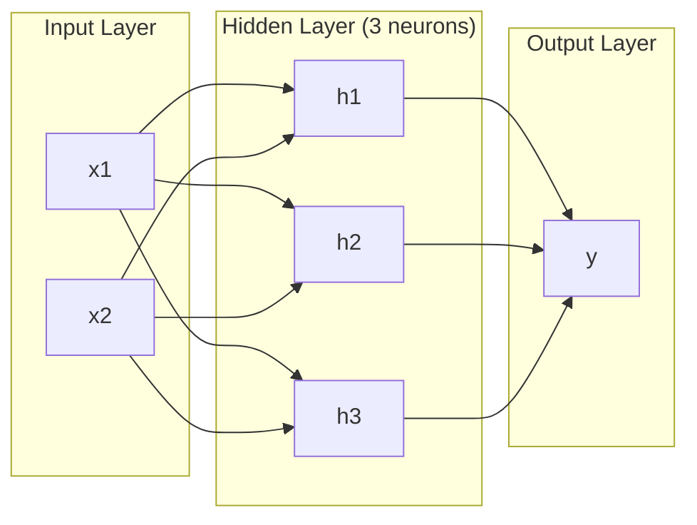
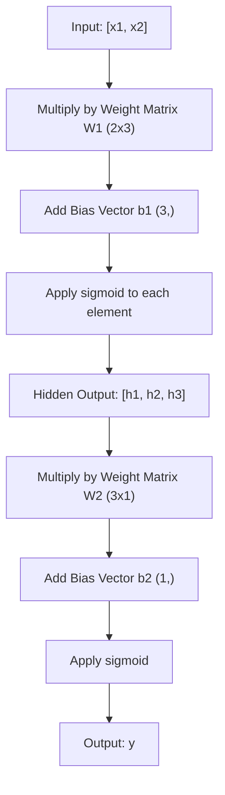
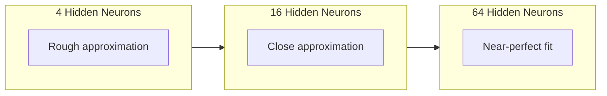

# 02 · 多层网络与前向传播

> 一个神经元只能画一条直线。把它们堆叠起来，你就能画出任何东西。

**类型：** 构建
**语言：** Python
**前置：** 阶段 01（数学基础）、课程 03.01（感知机）
**时长：** 约 90 分钟

## 学习目标

- 从零构建一个多层网络，用 Layer 与 Network 类实现完整的前向传播（forward pass）
- 追踪矩阵维度在网络各层之间的变化，并识别形状不匹配的问题
- 解释堆叠非线性激活函数为何能让网络学到弯曲的决策边界
- 用手工调好的 sigmoid 权重，以 2-2-1 架构求解 XOR 问题

## 问题所在

单个神经元就是一个画线工具，仅此而已：在你的数据中画出一条直线。AI 中的每一个真实问题——图像识别、语言理解、下围棋——都需要曲线。把神经元堆叠成层，正是获得曲线的方式。

1969 年，Minsky 与 Papert 证明了这一局限是致命的：单层网络无法学习 XOR。不是「难以学习」，而是数学上根本做不到。XOR 真值表把 [0,1] 和 [1,0] 放在一侧，把 [0,0] 和 [1,1] 放在另一侧，没有任何一条直线能把它们分开。

这让神经网络的研究经费枯竭了十多年。事后看来，修复方法显而易见：别再只用一层。把神经元堆叠成多层。让第一层把输入空间切分成新的特征，再让第二层把这些特征组合成单条直线无法做出的决策。

这种堆叠就是多层网络（multi-layer network）。它是当今生产环境中每一个深度学习模型的基础。前向传播——数据从输入流经隐藏层直到输出——是你在其他一切能够运转之前首先需要构建的东西。

## 核心概念

### 层：输入层、隐藏层、输出层

一个多层网络有三种类型的层：

**输入层（input layer）**——其实算不上一个层。它存放你的原始数据。两个特征意味着两个输入节点。这里不发生任何计算。

**隐藏层（hidden layer）**——真正干活的地方。每个神经元接收上一层的所有输出，施加权重和一个偏置，然后把结果送过一个激活函数。之所以叫「隐藏」，是因为你在训练数据中永远看不到这些值。

**输出层（output layer）**——最终答案。对于二分类，用一个带 sigmoid 的神经元。对于多分类，每个类别用一个神经元。



这是一个 2-3-1 网络：两个输入、三个隐藏神经元、一个输出。每条连接都带一个权重。每个神经元（输入节点除外）都带一个偏置。

每一层都产生一个数字向量，称为隐藏状态（hidden state）。对于文本，隐藏状态会提升维度——把一个词编码成 768 个数字以捕捉语义。对于图像，它会降低维度——把数百万像素压缩成一个易于处理的表示。隐藏状态是学习真正发生的地方。

### 神经元与激活函数

每个神经元做三件事：

1. 把每个输入乘以它对应的权重
2. 把所有乘积求和，再加上一个偏置
3. 把这个和送过一个激活函数

目前我们用的激活函数是 sigmoid：

```
sigmoid(z) = 1 / (1 + e^(-z))
```

Sigmoid 把任意数字压缩到 (0, 1) 区间。很大的正输入会被推向 1，很大的负输入会被推向 0，零映射到 0.5。正是这条平滑的曲线让学习成为可能——不同于感知机那种硬性的阶跃，sigmoid 处处都有梯度。

### 前向传播：数据如何流动

前向传播把输入数据逐层推过网络，直到抵达输出。前向传播过程中不发生任何学习。它是纯粹的计算：乘、加、激活，再重复。



在每一层，三个操作依次发生：

```
z = W * input + b       (linear transformation)
a = sigmoid(z)           (activation)
```

一层的输出成为下一层的输入。这就是整个前向传播。

### 矩阵维度

追踪维度是深度学习中最重要的单项调试技能。下面是这个 2-3-1 网络：

| 步骤 | 操作 | 维度 | 结果形状 |
|------|-----------|------------|-------------|
| 输入 | x | -- | (2,) |
| 隐藏层线性变换 | W1 * x + b1 | W1: (3, 2), b1: (3,) | (3,) |
| 隐藏层激活 | sigmoid(z1) | -- | (3,) |
| 输出层线性变换 | W2 * h + b2 | W2: (1, 3), b2: (1,) | (1,) |
| 输出层激活 | sigmoid(z2) | -- | (1,) |

规则是：第 k 层的权重矩阵 W 的形状为 (neurons_in_layer_k, neurons_in_layer_k_minus_1)。行数对应当前层，列数对应上一层。如果形状对不上，那就是有 bug。

### 通用逼近定理

1989 年，George Cybenko 证明了一件了不起的事：一个只有单个隐藏层、且神经元足够多的神经网络，可以以任意期望的精度逼近任何连续函数。

这并不意味着单个隐藏层总是最优的。它的意思是这种架构在理论上有这种能力。在实践中，更深的网络（更多的层、每层更少的神经元）能用远少于浅而宽网络的总参数量学到同样的函数。这正是深度学习有效的原因。

直觉上是这样的：隐藏层中的每个神经元学到一个「凸包」或一个特征。足够多的凸包放在合适的位置，就能逼近任何平滑曲线。神经元越多，凸包越多，逼近越好。



### 可组合性

神经网络是可组合的（composable）。你可以把它们堆叠、串联、并行运行。Whisper 模型用一个编码器（encoder）网络处理音频，用一个独立的解码器（decoder）网络生成文本。现代大语言模型是纯解码器（decoder-only）的。BERT 是纯编码器（encoder-only）的。T5 是编码器-解码器（encoder-decoder）的。架构的选择决定了模型能做什么。

## 动手构建

纯 Python，不用 numpy。每一个矩阵运算都从零写起。

### 第 1 步：Sigmoid 激活函数

```python
import math

def sigmoid(x):
    x = max(-500.0, min(500.0, x))
    return 1.0 / (1.0 + math.exp(-x))
```

把输入钳制到 [-500, 500] 是为了防止溢出。`math.exp(500)` 很大但仍是有限值，`math.exp(1000)` 则是无穷大。

### 第 2 步：Layer 类

整个深度学习中最重要的操作是矩阵乘法。每一层、每一个注意力头、每一次前向传播——从头到尾都是矩阵乘法（matmul）。一个线性层接收一个输入向量，把它乘以一个权重矩阵，再加上一个偏置向量：y = Wx + b。这一个等式占了神经网络中 90% 的计算量。

一个层持有一个权重矩阵和一个偏置向量。它的 forward 方法接收一个输入向量，返回激活后的输出。

```python
class Layer:
    def __init__(self, n_inputs, n_neurons, weights=None, biases=None):
        if weights is not None:
            self.weights = weights
        else:
            import random
            self.weights = [
                [random.uniform(-1, 1) for _ in range(n_inputs)]
                for _ in range(n_neurons)
            ]
        if biases is not None:
            self.biases = biases
        else:
            self.biases = [0.0] * n_neurons

    def forward(self, inputs):
        self.last_input = inputs
        self.last_output = []
        for neuron_idx in range(len(self.weights)):
            z = sum(
                w * x for w, x in zip(self.weights[neuron_idx], inputs)
            )
            z += self.biases[neuron_idx]
            self.last_output.append(sigmoid(z))
        return self.last_output
```

权重矩阵的形状是 (n_neurons, n_inputs)。每一行是一个神经元在所有输入上的权重。forward 方法遍历各个神经元，计算加权和加偏置，施加 sigmoid，并收集结果。

### 第 3 步：Network 类

一个网络就是一个层的列表。前向传播把它们串联起来：第 k 层的输出喂给第 k+1 层。

```python
class Network:
    def __init__(self, layers):
        self.layers = layers

    def forward(self, inputs):
        current = inputs
        for layer in self.layers:
            current = layer.forward(current)
        return current
```

这就是整个前向传播。逻辑只有四行。数据进来，流经每一层，从另一端出来。

### 第 4 步：用手工调好的权重求解 XOR

在课程 01 中，我们通过组合 OR、NAND 和 AND 感知机来求解 XOR。现在用我们的 Layer 和 Network 类做同样的事。2-2-1 架构：两个输入、两个隐藏神经元、一个输出。

```python
hidden = Layer(
    n_inputs=2,
    n_neurons=2,
    weights=[[20.0, 20.0], [-20.0, -20.0]],
    biases=[-10.0, 30.0],
)

output = Layer(
    n_inputs=2,
    n_neurons=1,
    weights=[[20.0, 20.0]],
    biases=[-30.0],
)

xor_net = Network([hidden, output])

xor_data = [
    ([0, 0], 0),
    ([0, 1], 1),
    ([1, 0], 1),
    ([1, 1], 0),
]

for inputs, expected in xor_data:
    result = xor_net.forward(inputs)
    predicted = 1 if result[0] >= 0.5 else 0
    print(f"  {inputs} -> {result[0]:.6f} (rounded: {predicted}, expected: {expected})")
```

很大的权重（20、-20）让 sigmoid 表现得像一个阶跃函数。第一个隐藏神经元近似 OR，第二个近似 NAND。输出神经元把它们组合成 AND，整体就实现了 XOR。

### 第 5 步：圆形分类

一个更难的问题：把 2D 点分类为位于以原点为中心、半径 0.5 的圆内还是圆外。这需要一个弯曲的决策边界——单个感知机做不到。

```python
import random
import math

random.seed(42)

data = []
for _ in range(200):
    x = random.uniform(-1, 1)
    y = random.uniform(-1, 1)
    label = 1 if (x * x + y * y) < 0.25 else 0
    data.append(([x, y], label))

circle_net = Network([
    Layer(n_inputs=2, n_neurons=8),
    Layer(n_inputs=8, n_neurons=1),
])
```

用随机权重，网络无法分类得很好。但前向传播仍然能跑起来。这正是关键所在——前向传播只是计算。学到正确的权重靠的是反向传播（backpropagation），那是课程 03 的内容。

```python
correct = 0
for inputs, expected in data:
    result = circle_net.forward(inputs)
    predicted = 1 if result[0] >= 0.5 else 0
    if predicted == expected:
        correct += 1

print(f"Accuracy with random weights: {correct}/{len(data)} ({100*correct/len(data):.1f}%)")
```

随机权重的准确率很差——往往比直接猜多数类还糟。经过训练之后（课程 03），同样这个带 8 个隐藏神经元的架构将画出一条弯曲的边界，把圆内和圆外区分开来。

## 实际应用

PyTorch 用四行代码就能做到上面的全部内容：

```python
import torch
import torch.nn as nn

model = nn.Sequential(
    nn.Linear(2, 8),
    nn.Sigmoid(),
    nn.Linear(8, 1),
    nn.Sigmoid(),
)

x = torch.tensor([[0.0, 0.0], [0.0, 1.0], [1.0, 0.0], [1.0, 1.0]])
output = model(x)
print(output)
```

`nn.Linear(2, 8)` 就是你的 Layer 类：形状为 (8, 2) 的权重矩阵，形状为 (8,) 的偏置向量。`nn.Sigmoid()` 就是你的 sigmoid 函数逐元素施加。`nn.Sequential` 就是你的 Network 类：按顺序串联各层。

区别在于速度和规模。PyTorch 在 GPU 上运行，能处理数百万样本的批次，并为反向传播自动计算梯度。但前向传播的逻辑，和你刚刚从零构建出来的完全一致。

## 交付产物

本课产出一个可复用的提示词（prompt），用于设计网络架构：

- `outputs/prompt-network-architect.md`

当你需要为某个给定问题决定用多少层、每层多少神经元、以及用哪些激活函数时，就可以用它。

## 练习

1. 构建一个 2-4-2-1 网络（两个隐藏层），用随机权重在 XOR 数据上跑一次前向传播。打印中间隐藏层的输出，观察表示在每一层如何被变换。

2. 把圆形分类器的隐藏层大小从 8 改成 2，再改成 32。每次都用随机权重跑前向传播。隐藏神经元的数量会改变输出的范围或分布吗？为什么？

3. 在 Network 类上实现一个 `count_parameters` 方法，返回可训练权重和偏置的总数量。在一个 784-256-128-10 的网络（经典的 MNIST 架构）上测试它。它有多少个参数？

4. 为一个 3-4-4-2 网络构建前向传播。给它喂 RGB 颜色值（归一化到 0-1），观察两个输出。这就是一个简单的双类别颜色分类器的架构。

5. 把 sigmoid 替换成一个「带泄漏的阶跃」函数：当 z < 0 时返回 0.01 * z，否则返回 1.0。用第 4 步中同样手工调好的权重在 XOR 上跑前向传播。它还能正常工作吗？为什么平滑的 sigmoid 比硬性的截断更受青睐？

## 关键术语

| 术语 | 人们怎么说 | 它实际的含义 |
|------|----------------|----------------------|
| 前向传播（Forward pass） | 「跑模型」 | 把输入推过每一层——乘以权重、加偏置、激活——以产生一个输出 |
| 隐藏层（Hidden layer） | 「中间那部分」 | 介于输入和输出之间、其值无法在数据中直接观测到的任何层 |
| 多层网络（Multi-layer network） | 「一个深度神经网络」 | 顺序堆叠的若干层神经元，每一层的输出喂给下一层的输入 |
| 激活函数（Activation function） | 「那个非线性」 | 在线性变换之后施加的一个函数，它把曲线引入决策边界 |
| Sigmoid | 「那条 S 曲线」 | sigma(z) = 1/(1+e^(-z))，把任意实数压缩到 (0,1)，处处平滑且可微 |
| 权重矩阵（Weight matrix） | 「那些参数」 | 一个形状为 (current_layer_neurons, previous_layer_neurons) 的矩阵 W，包含可学习的连接强度 |
| 偏置向量（Bias vector） | 「那个偏移量」 | 在矩阵乘法之后加上的一个向量，它让神经元即便在所有输入都为零时也能被激活 |
| 通用逼近（Universal approximation） | 「神经网络能学会任何东西」 | 一个神经元足够多的单隐藏层可以逼近任何连续函数——但「足够多」可能意味着数十亿个 |
| 线性变换（Linear transformation） | 「那个矩阵乘法步骤」 | z = W * x + b，激活之前的计算，它把输入映射到一个新空间 |
| 决策边界（Decision boundary） | 「分类器切换的地方」 | 输入空间中网络输出跨越分类阈值的那个面 |

## 延伸阅读

- Michael Nielsen，《Neural Networks and Deep Learning》，第 1-2 章（http://neuralnetworksanddeeplearning.com/）——对前向传播和网络结构最清晰的免费讲解，配有交互式可视化
- Cybenko，《Approximation by Superpositions of a Sigmoidal Function》（1989）——通用逼近定理的原始论文，意外地易读
- 3Blue1Brown，《But what is a neural network?》（https://www.youtube.com/watch?v=aircAruvnKk）——20 分钟的可视化讲解，带你走一遍层、权重和前向传播，帮你建立正确的心智模型
- Goodfellow、Bengio、Courville，《Deep Learning》，第 6 章（https://www.deeplearningbook.org/）——多层网络的标准参考资料，可在线免费阅读
