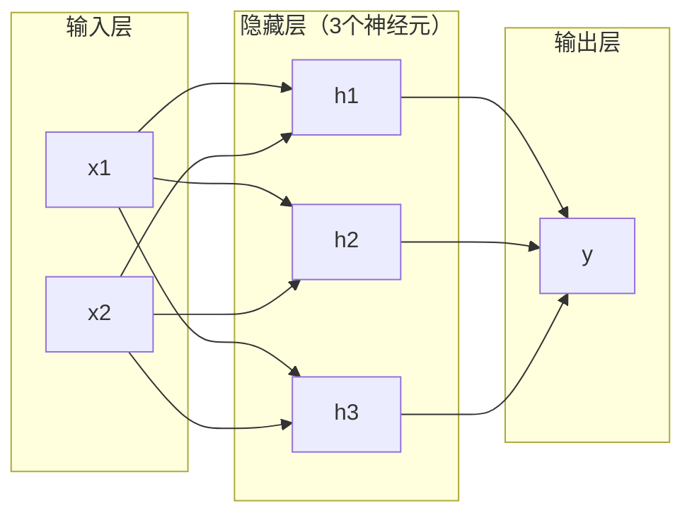
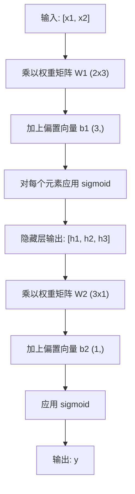

# 多层网络与前向传播（Forward Pass）

> 一个神经元画一条直线。把它们堆叠起来，你就能画出任何形状。

**类型：** 构建
**语言：** Python
**前置条件：** 阶段01（数学基础），第03.01课（感知机）
**时长：** 约90分钟

## 学习目标

- 从零构建一个包含 Layer 和 Network 类的多层网络，并完成完整的前向传播
- 在网络中的每一层追踪矩阵维度，识别形状不匹配
- 解释堆叠非线性激活函数如何让网络学习弯曲的决策边界
- 使用 2-2-1 架构和手动调整的 sigmoid 权重解决 XOR 问题

## 问题

单个神经元是个画线器。仅此而已。一条穿过数据的直线。AI 中每个真实问题——图像识别、语言理解、下围棋——都需要曲线。将神经元堆叠成层，就能得到曲线。

1969 年，Minsky 和 Papert 证明了这种局限是致命的：单层网络无法学习 XOR。不是“难以学习”——数学上就不可能。XOR 真值表将 [0,1] 和 [1,0] 放在一侧，[0,0] 和 [1,1] 放在另一侧。没有一条直线能分开它们。

这导致神经网络研究资金中断了十多年。事后看来，解决方案显而易见：别再使用单层。将神经元堆叠成层。让第一层将输入空间雕刻成新的特征，让第二层将这些特征组合成单条直线无法做出的决策。

这种堆叠就是多层网络。它是当今生产环境中所有深度学习模型的基础。前向传播——数据从输入流经隐藏层到输出——是实现其他一切之前首先需要构建的东西。

## 概念

### 层：输入、隐藏、输出

多层网络有三种类型的层：

**输入层**——其实不算一层。它保存原始数据。两个特征意味着两个输入节点。这里不进行计算。

**隐藏层**——实际工作发生的地方。每个神经元接收上一层的每个输出，应用权重和偏置，然后将结果通过激活函数。“隐藏”是因为在训练数据中你永远不会直接看到这些值。

**输出层**——最终答案。对于二分类，一个神经元使用 sigmoid。对于多分类，每个类别一个神经元。



这是一个 2-3-1 网络。两个输入，三个隐藏神经元，一个输出。每条连接都有一个权重。每个神经元（除了输入层）都有一个偏置。

每一层产生一个数字向量，称为隐藏状态（hidden state）。对于文本，隐藏状态增加维度——将一个词编码为 768 个数字以捕获语义含义。对于图像，它们减少维度——将数百万像素压缩成一个可管理的表示。隐藏状态就是学习存在的地方。

### 神经元与激活函数

每个神经元做三件事：

1. 将每个输入乘以其对应权重
2. 将所有乘积求和并加上偏置
3. 将总和通过激活函数

目前，激活函数是 sigmoid：

```
sigmoid(z) = 1 / (1 + e^(-z))
```

Sigmoid 将任意数压缩到 (0, 1) 范围内。大的正输入推向 1。大的负输入推向 0。零映射到 0.5。这种平滑曲线使得学习成为可能——与感知机的硬阶跃不同，sigmoid 处处都有梯度。

### 前向传播：数据如何流动

前向传播将输入数据逐层推向网络，直到到达输出。前向传播过程中不进行学习。纯计算：乘、加、激活、重复。



在每一层，三个操作依次发生：

```
z = W * input + b       (线性变换)
a = sigmoid(z)          (激活)
```

一层的输出成为下一层的输入。这就是整个前向传播。

### 矩阵维度

在深度学习中，追踪维度是最重要的调试技能。以下是 2-3-1 网络：

| 步骤 | 操作 | 维度 | 结果形状 |
|------|------|------|---------|
| 输入 | x | -- | (2,) |
| 隐藏层线性 | W1 * x + b1 | W1: (3, 2), b1: (3,) | (3,) |
| 隐藏层激活 | sigmoid(z1) | -- | (3,) |
| 输出层线性 | W2 * h + b2 | W2: (1, 3), b2: (1,) | (1,) |
| 输出层激活 | sigmoid(z2) | -- | (1,) |

规则：第 k 层的权重矩阵 W 的形状为 (neurons_in_layer_k, neurons_in_layer_k_minus_1)。行对应当前层。列对应前一层。如果形状不匹配，说明有 bug。

### 万能近似定理（Universal Approximation Theorem）

1989 年，George Cybenko 证明了一个非凡的结论：一个具有单个隐藏层和足够神经元的神经网络可以以任意精度近似任何连续函数。

这并不意味着一个隐藏层总是最好的。它意味着这种架构在理论上是可行的。在实践中，更深的网络（更多层，每层更少的神经元）用远少于浅宽网络的总参数来学习相同函数。这就是深度学习有效的原因。

直观理解：隐藏层中的每个神经元学习一个“凸起”或特征。足够多的凸起放在正确的位置，就能近似任何平滑曲线。更多的神经元，更多的凸起，更好的近似。


### 可组合性

神经网络是可组合的。你可以堆叠它们、链接它们、并行运行它们。Whisper 模型使用编码器网络处理音频，并使用单独的解码器网络生成文本。现代 LLM 是纯解码器。BERT 是纯编码器。T5 是编码器-解码器。架构选择定义了模型的能力。

## 构建它

纯 Python。没有 numpy。从头编写每个矩阵操作。

### 步骤 1：Sigmoid 激活函数

```python
import math

def sigmoid(x):
    x = max(-500.0, min(500.0, x))
    return 1.0 / (1.0 + math.exp(-x))
```

将 x 钳制到 [-500, 500] 以防止溢出。`math.exp(500)` 很大但有限。`math.exp(1000)` 是无穷大。

### 步骤 2：Layer 类

深度学习中最重要的是矩阵乘法。每个层、每个注意力头、每个前向传播——归根结底都是矩阵乘法。线性层接收输入向量，乘以权重矩阵，再加上偏置向量：y = Wx + b。这个单一方程占据了神经网络 90% 的计算量。

一个层持有一个权重矩阵和一个偏置向量。它的 forward 方法接收输入向量，返回激活后的输出。

```python
class Layer:
    def __init__(self, n_inputs, n_neurons, weights=None, biases=None):
        if weights is not None:
            self.weights = weights
        else:
            import random
            self.weights = [
                [random.uniform(-1, 1) for _ in range(n_inputs)]
                for _ in range(n_neurons)
            ]
        if biases is not None:
            self.biases = biases
        else:
            self.biases = [0.0] * n_neurons

    def forward(self, inputs):
        self.last_input = inputs
        self.last_output = []
        for neuron_idx in range(len(self.weights)):
            z = sum(
                w * x for w, x in zip(self.weights[neuron_idx], inputs)
            )
            z += self.biases[neuron_idx]
            self.last_output.append(sigmoid(z))
        return self.last_output
```

权重矩阵的形状是 (n_neurons, n_inputs)。每一行是一个神经元在所有输入上的权重。forward 方法遍历神经元，计算加权和加偏置，应用 sigmoid，并收集结果。

### 步骤 3：Network 类

网络是一个层列表。前向传播将它们链接起来：第 k 层的输出输入到第 k+1 层。

```python
class Network:
    def __init__(self, layers):
        self.layers = layers

    def forward(self, inputs):
        current = inputs
        for layer in self.layers:
            current = layer.forward(current)
        return current
```

这就是整个前向传播。四行逻辑。数据进去，流经每一层，从另一端出来。

### 步骤 4：使用手动调整权重的 XOR

在课程 01 中，我们通过组合 OR、NAND 和 AND 感知机解决了 XOR。现在用我们的 Layer 和 Network 类做同样的事情。2-2-1 架构：两个输入，两个隐藏神经元，一个输出。

```python
hidden = Layer(
    n_inputs=2,
    n_neurons=2,
    weights=[[20.0, 20.0], [-20.0, -20.0]],
    biases=[-10.0, 30.0],
)

output = Layer(
    n_inputs=2,
    n_neurons=1,
    weights=[[20.0, 20.0]],
    biases=[-30.0],
)

xor_net = Network([hidden, output])

xor_data = [
    ([0, 0], 0),
    ([0, 1], 1),
    ([1, 0], 1),
    ([1, 1], 0),
]

for inputs, expected in xor_data:
    result = xor_net.forward(inputs)
    predicted = 1 if result[0] >= 0.5 else 0
    print(f"  {inputs} -> {result[0]:.6f} (rounded: {predicted}, expected: {expected})")
```

大权重（20, -20）使 sigmoid 表现得像阶跃函数。第一个隐藏神经元近似 OR。第二个近似 NAND。输出神经元将它们组合成 AND，即 XOR。

### 步骤 5：圆分类

一个更难的问题：将二维点分类为以原点为中心、半径 0.5 的圆内部或外部。这需要弯曲的决策边界——单个感知机不可能做到。

```python
import random
import math

random.seed(42)

data = []
for _ in range(200):
    x = random.uniform(-1, 1)
    y = random.uniform(-1, 1)
    label = 1 if (x * x + y * y) < 0.25 else 0
    data.append(([x, y], label))

circle_net = Network([
    Layer(n_inputs=2, n_neurons=8),
    Layer(n_inputs=8, n_neurons=1),
])
```

随机权重下，网络分类效果不佳。但前向传播仍然可以运行。这就是重点——前向传播只是计算。学习正确的权重是反向传播（Backpropagation），将在课程 03 中介绍。

```python
correct = 0
for inputs, expected in data:
    result = circle_net.forward(inputs)
    predicted = 1 if result[0] >= 0.5 else 0
    if predicted == expected:
        correct += 1

print(f"Accuracy with random weights: {correct}/{len(data)} ({100*correct/len(data):.1f}%)")
```

随机权重的准确率很低——通常比猜多数类还差。经过训练（课程 03）后，这个相同的架构（8 个隐藏神经元）将绘制出将内部与外部区分开来的弯曲边界。

## 使用它

PyTorch 用四行代码完成上述所有操作：

```python
import torch
import torch.nn as nn

model = nn.Sequential(
    nn.Linear(2, 8),
    nn.Sigmoid(),
    nn.Linear(8, 1),
    nn.Sigmoid(),
)

x = torch.tensor([[0.0, 0.0], [0.0, 1.0], [1.0, 0.0], [1.0, 1.0]])
output = model(x)
print(output)
```

`nn.Linear(2, 8)` 就是你的 Layer 类：形状为 (8, 2) 的权重矩阵，形状为 (8,) 的偏置向量。`nn.Sigmoid()` 是逐元素应用的 sigmoid 函数。`nn.Sequential` 是你的 Network 类：按顺序链接层。

区别在于速度和规模。PyTorch 在 GPU 上运行，处理数百万样本的批次，并自动计算反向传播的梯度。但前向传播逻辑与你刚刚从头构建的逻辑完全相同。

## 发布它

本课程产生一个可复用的提示，用于设计网络架构：

- `outputs/prompt-network-architect.md`

当你需要决定给定问题中应该使用多少层、每层多少神经元以及哪些激活函数时，请使用它。

## 练习

1. 构建一个 2-4-2-1 网络（两个隐藏层），用随机权重在 XOR 数据上运行前向传播。打印中间隐藏层的输出，观察表示在每一层如何变换。

2. 将圆分类器中的隐藏层大小从 8 改为 2，再改为 32。每次用随机权重运行前向传播。隐藏神经元数量会改变输出的范围或分布吗？为什么？

3. 在 Network 类上实现一个 `count_parameters` 方法，返回可训练权重和偏置的总数。在 784-256-128-10 网络（经典的 MNIST 架构）上测试它。它有多少参数？

4. 为 3-4-4-2 网络构建前向传播。向其输入 RGB 颜色值（归一化到 0-1），观察两个输出。这是具有两个类别的简单颜色分类器的架构。

5. 用“带泄漏的阶跃函数”替换 sigmoid：如果 z < 0 则返回 0.01 * z，否则返回 1.0。用步骤 4 中相同的手动调整权重在 XOR 上运行前向传播。它仍然有效吗？为什么平滑的 sigmoid 优于硬截断？

## 关键术语

| 术语 | 别人怎么说 | 实际含义 |
|------|-----------|---------|
| 前向传播（Forward pass） | "运行模型" | 将输入推过每一层——乘以权重、加偏置、激活——以产生输出 |
| 隐藏层（Hidden layer） | "中间部分" | 输入和输出之间的任何层，其值在数据中不直接可见 |
| 多层网络（Multi-layer network） | "深度神经网络" | 顺序堆叠的神经元层，每层的输出作为下一层的输入 |
| 激活函数（Activation function） | "非线性" | 在线性变换后应用的函数，向决策边界引入曲线 |
| Sigmoid | "S 形曲线" | sigma(z) = 1/(1+e^(-z))，将任意实数压缩到 (0,1)，光滑且处处可微 |
| 权重矩阵（Weight matrix） | "参数" | 形状为 (当前层神经元数, 前一层神经元数) 的矩阵 W，包含可学习的连接强度 |
| 偏置向量（Bias vector） | "偏移" | 矩阵乘法后添加的向量，使得即使所有输入为零时神经元也能激活 |
| 万能近似（Universal approximation） | "神经网络可以学习任何东西" | 具有足够神经元的单个隐藏层可以近似任何连续函数——但“足够”可能意味着数十亿 |
| 线性变换（Linear transformation） | "矩阵乘法步骤" | z = W * x + b，激活之前的计算，将输入映射到新空间 |
| 决策边界（Decision boundary） | "分类器切换的地方" | 输入空间中网络输出跨越分类阈值的表面 |

## 进一步阅读

- Michael Nielsen, "Neural Networks and Deep Learning", 第1-2章 (http://neuralnetworksanddeeplearning.com/) —— 关于前向传播和网络结构最清晰的免费解释，带有交互式可视化
- Cybenko, "Approximation by Superpositions of a Sigmoidal Function" (1989) —— 原始的万能近似定理论文，出乎意料地易读
- 3Blue1Brown, "But what is a neural network?" (https://www.youtube.com/watch?v=aircAruvnkK) —— 20分钟的可视化讲解，带你了解层、权重和前向传播，构建正确的思维模型
- Goodfellow, Bengio, Courville, "Deep Learning", 第6章 (https://www.deeplearningbook.org/) —— 多层网络的标准参考资料，免费在线阅读