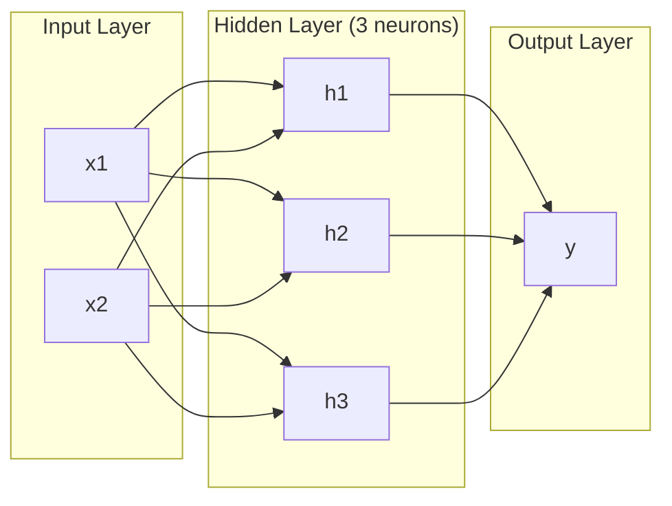
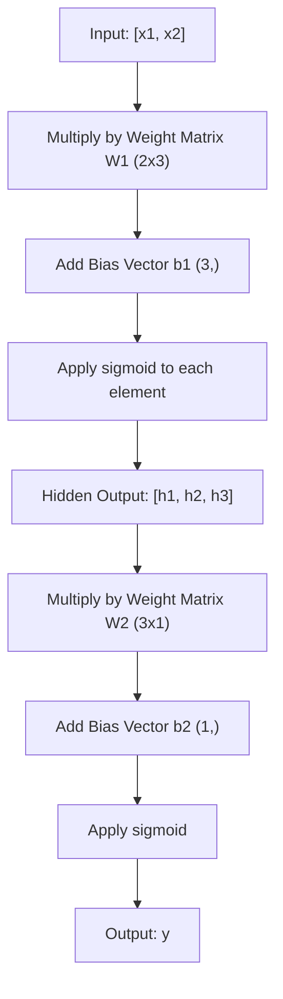
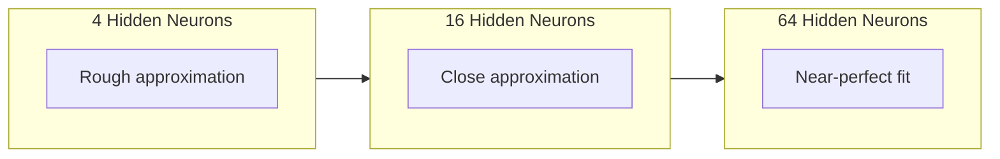

# 多层网络和前向传递

> 一个神经元画了一条线。将它们堆叠起来，你就可以画任何东西。

** 类型：** 构建
** 语言：** Python
** 先决条件：** 阶段01（数学基础），第03.01课（感知器）
** 时间：** ~90分钟

## 学习目标

- 使用执行完整前向传递的Layer和Network类从头开始构建多层网络
- 通过网络的每个层跟踪矩阵维度并识别形状不匹配
- 解释堆叠非线性激活如何使网络能够学习弯曲的决策边界
- 使用具有手动调整的sigmoid权重的2-2-1架构解决XOR问题

## 问题

单个神经元就是一个抽屉。就是这样。数据中的一条直线。人工智能中的每个真正问题--图像识别、语言理解、下围棋--都需要曲线。将神经元分层是获得曲线的方法。

1969年，Minsky和Papert证明了这个限制是致命的：单层网络无法学习XOR。不是“努力学习”--数学上不能。异或真值表将[0，1]和[1，0]放在一边，[0，0]和[1，1]放在另一边。没有一条线把他们分开。

这扼杀了十多年来的神经网络资金。事后看来，解决办法是显而易见的：停止使用一层。将神经元堆叠到层中。让第一层将输入空间划分为新的特征，让第二层将这些特征组合为单行无法做出的决策。

该堆栈是多层网络。它是当今生产中每个深度学习模型的基础。正向传递--数据从输入通过隐藏层流到输出--是在其他任何工作开始之前您需要构建的第一件事。

## 概念

### 层：输入、隐藏、输出

多层网络有三种类型的层：

** 输入层 ** --不是真正的层。它保存您的原始数据。两个特征意味着两个输入节点。这里不发生计算。

** 隐藏层 **-工作发生的地方。每个神经元获取前一层的每个输出，应用权重和偏差，然后将结果传递给激活函数。“隐藏”是因为您永远不会在训练数据中直接看到这些值。

** 输出层 ** --最终答案。对于二进制分类，一个带有S形的神经元。对于多类，每个类一个神经元。



这是一个2-3-1网络。两个输入，三个隐藏神经元，一个输出。每一个联系都有分量。每个神经元（输入除外）都带有偏差。

每个层都会产生一个称为隐藏状态的数字载体。对于文本来说，隐藏状态增加了维度--将一个词编码为768个数字以捕获语义含义。对于图像来说，它们降低了维度--将数百万个像素压缩成可管理的表示形式。隐藏的状态是学习所在的地方。

### 神经元和激活

每个神经元做三件事：

1. 将每个输入乘以其相应的权重
2. 将所有产品相加并添加偏见
3. 通过激活函数传递总和

目前，激活是Sigmoid：

```
sigmoid(z) = 1 / (1 + e^(-z))
```

Sigmoid将任何数字压缩到范围（0，1）中。大量的积极投入推动1。大量负输入推向0。零映射为0.5。这种平滑的曲线使学习成为可能--与感知器的艰难步骤不同，Sigmoid到处都有梯度。

### 向前传递：数据如何流动

正向传递将输入数据逐层推送通过网络，直到到达输出。向前传球过程中不会发生任何学习。这是纯粹的计算：相乘、相加、激活、重复。



在每一层，三个操作顺序发生：

```
z = W * input + b       (linear transformation)
a = sigmoid(z)           (activation)
```

一层的输出成为下一层的输入。这就是整个向前传球。

### 矩阵维度

跟踪维度是深度学习中最重要的调试技能。这是2-3-1网络：

| 步骤 | 操作 | 尺寸 | 结果形状 |
|------|-----------|------------|-------------|
| 输入 | X | -- | （2，） |
| 隐藏线性 | W1 * x + b1 | W1：（3，2），b1：（3，） | （3，） |
| 隐藏激活 | 乙状结肠（z1） | -- | （3，） |
| 输出线性 | W2 * h + b2 | W2：（1，3），b2：（1，） | （1，） |
| 输出激活 | 乙状结肠（z2） | -- | （1，） |

规则：k层的权重矩阵W具有形状（neurons_in_Layer_k，neurons_in_layer_k_minus_1）。收件箱匹配当前层。列与前一层匹配。如果形状不对齐，则存在错误。

### 万能逼近定理

1989年，George Cybenko证明了一件了不起的事情：具有单个隐藏层和足够多神经元的神经网络可以以任何期望的精度逼近任何连续函数。

这并不意味着一个隐藏层总是最好的。这意味着该架构理论上是有能力的。在实践中，更深层次的网络（层越多，每层神经元越少）学习相同的功能，总参数远少于浅层网络。这就是深度学习有效的原因。

直觉：隐藏层中的每个神经元都学习一个“肿块”或特征。在正确的位置放置足够的凹凸可以逼近任何光滑的曲线。更多的神经元，更多的肿块，更好的逼近。



### 组合性

神经网络是可组合的。您可以堆叠它们、链接它们、并行运行它们。Whisper模型使用编码器网络来处理音频，并使用单独的解码器网络来生成文本。现代LLM仅限解码器。BERT仅限编码器。T5是编码器-解码器。架构选择定义了模型可以做什么。

## 建设党

纯粹的Python。没有麻木。每个矩阵操作都从头开始编写。

### 第1步：乙状结肠激活

```python
import math

def sigmoid(x):
    x = max(-500.0, min(500.0, x))
    return 1.0 / (1.0 + math.exp(-x))
```

钳位至[-500，500]可防止溢出。' math. BEP（500）'很大但有限。' math. BEP（1000）'是无限大。

### 第2步：分层类

所有深度学习中最重要的操作是矩阵相乘。每一层、每一个注意力、每一次向前传球--都是一路往下的母鹿。线性层获取输入载体，将其乘以权重矩阵，并添加偏置载体：y = Wx + b。这个方程占神经网络中90%的计算量。

一个层包含权重矩阵和偏置载体。它的forward方法接受输入载体并返回激活的输出。

```python
class Layer:
    def __init__(self, n_inputs, n_neurons, weights=None, biases=None):
        if weights is not None:
            self.weights = weights
        else:
            import random
            self.weights = [
                [random.uniform(-1, 1) for _ in range(n_inputs)]
                for _ in range(n_neurons)
            ]
        if biases is not None:
            self.biases = biases
        else:
            self.biases = [0.0] * n_neurons

    def forward(self, inputs):
        self.last_input = inputs
        self.last_output = []
        for neuron_idx in range(len(self.weights)):
            z = sum(
                w * x for w, x in zip(self.weights[neuron_idx], inputs)
            )
            z += self.biases[neuron_idx]
            self.last_output.append(sigmoid(z))
        return self.last_output
```

权重矩阵具有形状（n_neurons，n_inputs）。每行是一个神经元在所有输入上的权重。前向方法循环遍历神经元，计算加权和加偏差，应用sigmoid，并收集结果。

### 第3步：网络课程

网络是一系列层。正向传递将它们链接起来：k层的输出输入k+1层。

```python
class Network:
    def __init__(self, layers):
        self.layers = layers

    def forward(self, inputs):
        current = inputs
        for layer in self.layers:
            current = layer.forward(current)
        return current
```

这就是整个向前传球。四行逻辑。数据进入，流经每一层，从另一面出来。

### 第4步：使用手动调整权重进行异或

在第01课中，我们通过组合OR、AND和AND感知器来解决异或问题。现在对我们的层和网络类执行同样的操作。2-2-1架构：两个输入、两个隐藏神经元、一个输出。

```python
hidden = Layer(
    n_inputs=2,
    n_neurons=2,
    weights=[[20.0, 20.0], [-20.0, -20.0]],
    biases=[-10.0, 30.0],
)

output = Layer(
    n_inputs=2,
    n_neurons=1,
    weights=[[20.0, 20.0]],
    biases=[-30.0],
)

xor_net = Network([hidden, output])

xor_data = [
    ([0, 0], 0),
    ([0, 1], 1),
    ([1, 0], 1),
    ([1, 1], 0),
]

for inputs, expected in xor_data:
    result = xor_net.forward(inputs)
    predicted = 1 if result[0] >= 0.5 else 0
    print(f"  {inputs} -> {result[0]:.6f} (rounded: {predicted}, expected: {expected})")
```

大的权重（20，-20）使sigmoid像一个阶跃函数。第一个隐藏的神经元近似于OR。第二个近似NAND。输出神经元将它们组合成AND，即XOR。

### 第5步：圆圈分类

一个更难的问题：将2D点分类为以原点为中心的半径0.5的圆内部或外部。这需要弯曲的决策边界--这对于单个感知器来说是不可能的。

```python
import random
import math

random.seed(42)

data = []
for _ in range(200):
    x = random.uniform(-1, 1)
    y = random.uniform(-1, 1)
    label = 1 if (x * x + y * y) < 0.25 else 0
    data.append(([x, y], label))

circle_net = Network([
    Layer(n_inputs=2, n_neurons=8),
    Layer(n_inputs=8, n_neurons=1),
])
```

使用随机权重，网络将无法很好地分类。但向前传球仍然有效。这就是重点--向前传递只是计算。学习正确的权重是反向传播，将在第03课中介绍。

```python
correct = 0
for inputs, expected in data:
    result = circle_net.forward(inputs)
    predicted = 1 if result[0] >= 0.5 else 0
    if predicted == expected:
        correct += 1

print(f"Accuracy with random weights: {correct}/{len(data)} ({100*correct/len(data):.1f}%)")
```

随机权重的准确性很差--通常比猜测多数类别更差。训练后（第03课），这个具有8个隐藏神经元的相同架构将绘制一个弧形边界，将内部与外部分开。

## 使用它

PyTorch用四行字完成了上述所有工作：

```python
import torch
import torch.nn as nn

model = nn.Sequential(
    nn.Linear(2, 8),
    nn.Sigmoid(),
    nn.Linear(8, 1),
    nn.Sigmoid(),
)

x = torch.tensor([[0.0, 0.0], [0.0, 1.0], [1.0, 0.0], [1.0, 1.0]])
output = model(x)
print(output)
```

`nn.Linear（2，8）`是你的Layer类：形状的权重矩阵（8，2），形状的偏置向量（8，）。`nn.Sigmoid（）`是应用于元素的sigmoid函数。`nn.Sequential`是你的网络类：按顺序链层。

区别在于速度和规模。PyTorch在图形处理器上运行，处理数百万个样本的批量，并自动计算反向传播的梯度。但向前传递逻辑与您刚刚从头开始构建的逻辑相同。

## 把它运

本课为设计网络架构提供了可重复使用的提示：

- '输出/prompt-network-architect.md '

当您需要决定指定问题有多少层、每层有多少神经元以及使用哪种激活功能时，请使用它。

## 演习

1. 构建2-4-2-1网络（两个隐藏层）并对具有随机权重的异或数据运行前向传递。打印中间隐藏层输出，以查看每个层的表达方式如何转换。

2. 将圆形分类器中的隐藏层大小从8更改为2，然后更改为32。每次以随机权重运行向前传递。隐藏神经元的数量是否会改变输出范围或分布？为什么？

3. 在Network类上实现一个`count_parameters`方法，返回可训练权重和偏差的总数。在784-256-128-10网络（经典的MNIST架构）上进行测试。它有多少个参数？

4. 为3-4-4-2网络构建前向通行证。向它输入Ruby颜色值（标准化为0-1）并观察两个输出。这是具有两个类的简单颜色分类器的架构。

5. 将sigmoid替换为“leaky Step”函数：如果z < 0，则返回0.01 * z，否则返回1.0。使用步骤4中相同的手动调整权重在异或上运行正向传递。它还有效吗？为什么光滑的乙状结肠比硬的切割更受欢迎？

## 关键术语

| Term | 别人怎么说 | 它实际上意味着什么 |
|------|----------------|----------------------|
| 向前传球 | “运行模型” | 将输入推入每一层--乘以权重、添加偏差、激活--以产生输出 |
| 隐藏层 | “中间部分” | 输入和输出之间的任何层，其值在数据中不直接观察 |
| 多层网络 | “深度神经网络” | 神经元层顺序堆叠，每层的输出输入下一层的输入 |
| 激活函数 | “非线性” | 线性变换后应用的函数，将曲线引入决策边界 |
| 乙状 | “S曲线” | 西格玛（z）= 1/（1+e '（-z）），将任何实数压缩为（0，1），到处光滑且可微 |
| 权重矩阵 | “参数” | 包含可学习的连接强度的形状矩阵W（当前_层_神经元，前一层_神经元） |
| 偏置向量 | “抵消” | 矩阵相乘后添加的一个载体，即使所有输入都为零，也可以让神经元激活 |
| 通用逼近性 | “神经网络可以学习任何东西” | 具有足够神经元的单个隐藏层可以逼近任何连续功能--但“足够”可能意味着数十亿 |
| 线性变换 | “矩阵相乘步骤” | z = W * x + b，激活前的计算，将输入映射到新空间 |
| 决策边界 | “分类器在哪里切换” | 输入空间中网络输出超过分类阈值的表面 |

## 进一步阅读

- Michael Nielsen，“神经网络和深度学习”，第1-2章（http：//neuralnetworksanddeeplearning.com/）--前向传递和网络结构的最清晰免费解释，具有交互式可视化
- Cybenko，“Sigmoidal函数的叠加逼近”（1989）--最初的泛逼近定理论文，令人惊讶地可读
- 3 Blue 1 Brown，“但是什么是神经网络？”（https：www.youtube.com/watch? v=aircAruvnKk）--20分钟的层、重量和向前传球视觉演练，构建正确的心理模型
- Goodfellow、Bengio、Courville，“深度学习”，第6章（https：//www.deeplearningbook.org/）--多层网络的标准参考，免费在线
