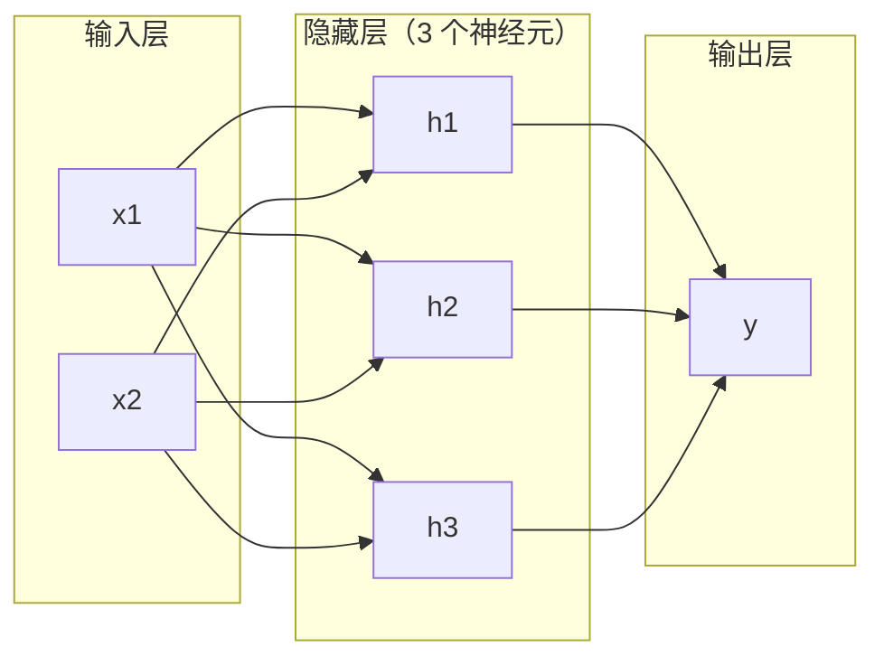
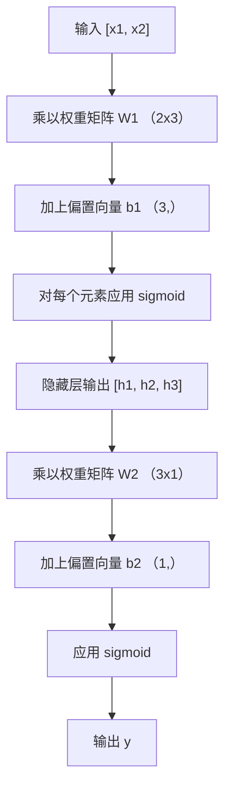

# 多层网络与前向传播（Multi-Layer Networks and Forward Pass）

> 译注：本文译自同目录 [`en.md`](./en.md)。术语遵循仓根 [TRANSLATION_GUIDE.md](../../../../TRANSLATION_GUIDE.md)。

> 一个神经元能画一条线。把它们叠起来，你就能画出任何东西。

**Type:** Build
**Languages:** Python
**Prerequisites:** Phase 01 (Math Foundations), Lesson 03.01 (The Perceptron)
**Time:** ~90 minutes

## 学习目标（Learning Objectives）

- 从零搭建一个多层网络，用 Layer 和 Network 两个类完成一次完整的前向传播（forward pass）
- 追踪矩阵维度在网络每一层的变化，并能识别 shape 不匹配问题
- 解释为什么把非线性激活函数（activation function）一层层叠起来，网络就能学到弯曲的决策边界
- 用一个 2-2-1 架构、手工调好的 sigmoid 权重，解决 XOR 问题

## 问题（Problem）

单个神经元只是个画线工具。仅此而已。在你的数据上画一条直线。AI 里所有真实问题——图像识别、语言理解、下围棋——都需要曲线。把神经元叠成一层层的网络，就是你拿到曲线的方式。

1969 年，Minsky 和 Papert 证明了这个局限是致命的：单层网络学不会 XOR。不是「学起来吃力」——是数学上做不到。XOR 真值表把 [0,1] 和 [1,0] 放在一边，[0,0] 和 [1,1] 放在另一边。没有任何一条直线能把它们分开。

这件事让神经网络的研究经费冰封了十多年。事后看修法很显然：别只用一层。把神经元叠成多层。让第一层把输入空间切分出新的特征（feature），让第二层把这些特征组合成单条直线做不到的决策。

这一叠就是多层网络。它是今天每一个生产环境深度学习模型的根基。前向传播——数据从输入流经隐藏层到达输出——是你在做任何其他事之前，第一个必须搭出来的东西。

## 概念（Concept）

### 层：输入层、隐藏层、输出层（Layers: Input, Hidden, Output）

一个多层网络有三类层：

**输入层（Input layer）**——其实算不上一层。它只装你的原始数据。两个特征就是两个输入节点。这里不做任何计算。

**隐藏层（Hidden layers）**——干活的地方。每个神经元接收上一层的所有输出，乘上权重（weight）加上偏置（bias），再把结果送进一个激活函数。叫「隐藏」是因为你在训练数据里永远不会直接看到这些值。

**输出层（Output layer）**——最终答案。二分类用一个 sigmoid 神经元。多分类则每个类一个神经元。



这是一个 2-3-1 网络。两个输入、三个隐藏神经元、一个输出。每一条连接都有一个 weight。每一个神经元（除了输入）都有一个 bias。

每一层会产出一个由数字组成的向量，叫做 hidden state（隐状态）。对文本来说，hidden state 通常会**升维**——把一个词编码成 768 个数字，用来承载语义。对图像来说，hidden state 通常会**降维**——把上百万的像素压缩成可控的表示。学习就发生在 hidden state 里。

### 神经元与激活（Neurons and Activations）

每个神经元做三件事：

1. 把每个输入乘上对应的 weight
2. 把所有乘积加起来，再加上 bias
3. 把这个和送进激活函数

目前我们用 sigmoid：

```
sigmoid(z) = 1 / (1 + e^(-z))
```

sigmoid 把任何数字挤压到 (0, 1) 区间。大正数被推向 1。大负数被推向 0。零映射到 0.5。这条平滑曲线正是学习能发生的关键——和感知机（perceptron）的硬阶跃函数不同，sigmoid 在每一处都有 gradient（梯度）。

### 前向传播：数据如何流动（Forward Pass: How Data Flows）

前向传播把输入数据沿着网络一层接一层往前推，直到到达输出。前向传播过程中没有学习发生。它是纯计算：乘、加、激活，循环往复。



每一层依次发生三步操作：

```
z = W * input + b       (linear transformation)
a = sigmoid(z)           (activation)
```

上一层的输出就是下一层的输入。这就是整个前向传播。

### 矩阵维度（Matrix Dimensions）

追踪维度是深度学习里最重要的单一调试技能。下面是这个 2-3-1 网络：

| 步骤 | 运算 | 维度 | 结果 shape |
|------|-----------|------------|-------------|
| 输入 | x | -- | (2,) |
| 隐藏层线性 | W1 * x + b1 | W1: (3, 2), b1: (3,) | (3,) |
| 隐藏层激活 | sigmoid(z1) | -- | (3,) |
| 输出层线性 | W2 * h + b2 | W2: (1, 3), b2: (1,) | (1,) |
| 输出层激活 | sigmoid(z2) | -- | (1,) |

规律：第 k 层的权重矩阵 W 形状是 (neurons_in_layer_k, neurons_in_layer_k_minus_1)。行数对应当前层。列数对应前一层。如果 shape 对不上，那就是有 bug。

### 通用近似定理（Universal Approximation Theorem）

1989 年，George Cybenko 证明了一个了不起的结论：一个只有单个隐藏层、足够多神经元的神经网络，可以以任意精度近似任意连续函数。

这并不意味着单隐藏层永远是最好的。它只是说这种架构在理论上是有能力的。在实践中，**更深**的网络（层更多、每层神经元更少）能用比**浅而宽**的网络少得多的总参数学到同样的函数。这就是深度学习行得通的原因。

直觉上的理解：隐藏层里每个神经元学到一个「凸包」或者特征。在合适位置摆上足够多的凸包，就能近似任意光滑曲线。神经元越多，凸包越多，近似越好。


### 可组合性（Composability）

神经网络是可组合的。你可以把它们叠起来、串起来、并行跑。Whisper 模型用一个 encoder 网络处理音频，再用一个独立的 decoder 网络生成文本。现代 LLM 是 decoder-only。BERT 是 encoder-only。T5 是 encoder-decoder。架构的选择决定了模型能干什么。

## 动手实现（Build It）

纯 Python。不用 numpy。每一个矩阵运算都从零写。

### 第 1 步：Sigmoid 激活（Step 1: Sigmoid Activation）

```python
import math

def sigmoid(x):
    x = max(-500.0, min(500.0, x))
    return 1.0 / (1.0 + math.exp(-x))
```

夹到 [-500, 500] 是为了防止溢出。`math.exp(500)` 大但有限。`math.exp(1000)` 就是无穷了。

### 第 2 步：Layer 类（Step 2: Layer Class）

整个深度学习里最重要的运算就是矩阵乘法。每一层、每一个 attention head、每一次前向传播——一路 matmul 到底。一个线性层接收一个输入向量，乘上一个权重矩阵，加上一个偏置向量：y = Wx + b。这一个等式承担了神经网络里 90% 的计算量。

一个 layer 持有一个权重矩阵和一个偏置向量。它的 forward 方法接收一个输入向量，返回激活后的输出。

```python
class Layer:
    def __init__(self, n_inputs, n_neurons, weights=None, biases=None):
        if weights is not None:
            self.weights = weights
        else:
            import random
            self.weights = [
                [random.uniform(-1, 1) for _ in range(n_inputs)]
                for _ in range(n_neurons)
            ]
        if biases is not None:
            self.biases = biases
        else:
            self.biases = [0.0] * n_neurons

    def forward(self, inputs):
        self.last_input = inputs
        self.last_output = []
        for neuron_idx in range(len(self.weights)):
            z = sum(
                w * x for w, x in zip(self.weights[neuron_idx], inputs)
            )
            z += self.biases[neuron_idx]
            self.last_output.append(sigmoid(z))
        return self.last_output
```

权重矩阵的 shape 是 (n_neurons, n_inputs)。每一行是一个神经元在所有输入上的权重。forward 方法循环每个神经元，算出加权和加偏置，过一遍 sigmoid，把结果收集起来。

### 第 3 步：Network 类（Step 3: Network Class）

一个 network 就是一串 layer。前向传播把它们串起来：第 k 层的输出喂给第 k+1 层。

```python
class Network:
    def __init__(self, layers):
        self.layers = layers

    def forward(self, inputs):
        current = inputs
        for layer in self.layers:
            current = layer.forward(current)
        return current
```

这就是整个前向传播。四行逻辑。数据进去，流过每一层，从另一头出来。

### 第 4 步：用手调权重做 XOR（Step 4: XOR with Hand-Tuned Weights）

在 Lesson 01 里，我们靠组合 OR、NAND、AND 三个 perceptron 解决了 XOR。现在用我们的 Layer 和 Network 类做同样的事。架构是 2-2-1：两个输入、两个隐藏神经元、一个输出。

```python
hidden = Layer(
    n_inputs=2,
    n_neurons=2,
    weights=[[20.0, 20.0], [-20.0, -20.0]],
    biases=[-10.0, 30.0],
)

output = Layer(
    n_inputs=2,
    n_neurons=1,
    weights=[[20.0, 20.0]],
    biases=[-30.0],
)

xor_net = Network([hidden, output])

xor_data = [
    ([0, 0], 0),
    ([0, 1], 1),
    ([1, 0], 1),
    ([1, 1], 0),
]

for inputs, expected in xor_data:
    result = xor_net.forward(inputs)
    predicted = 1 if result[0] >= 0.5 else 0
    print(f"  {inputs} -> {result[0]:.6f} (rounded: {predicted}, expected: {expected})")
```

很大的权重（20、-20）会让 sigmoid 表现得近乎一个阶跃函数。第一个隐藏神经元近似 OR。第二个近似 NAND。输出神经元把它们组合成 AND，也就是 XOR。

### 第 5 步：圆形分类（Step 5: Circle Classification）

更难一点的问题：把 2D 平面上的点按是否落在以原点为圆心、半径 0.5 的圆内做分类。这需要一条弯曲的决策边界——单个 perceptron 做不到。

```python
import random
import math

random.seed(42)

data = []
for _ in range(200):
    x = random.uniform(-1, 1)
    y = random.uniform(-1, 1)
    label = 1 if (x * x + y * y) < 0.25 else 0
    data.append(([x, y], label))

circle_net = Network([
    Layer(n_inputs=2, n_neurons=8),
    Layer(n_inputs=8, n_neurons=1),
])
```

随机权重下，网络分类效果不会好。但前向传播照样能跑。重点就在这——前向传播只是计算。学到正确的权重靠的是反向传播（backpropagation），下一节 Lesson 03 见。

```python
correct = 0
for inputs, expected in data:
    result = circle_net.forward(inputs)
    predicted = 1 if result[0] >= 0.5 else 0
    if predicted == expected:
        correct += 1

print(f"Accuracy with random weights: {correct}/{len(data)} ({100*correct/len(data):.1f}%)")
```

随机权重的精度很差——经常比直接猜「多数类」还差。等到 Lesson 03 训练完，同样这个 8 个隐藏神经元的架构就能画出一条把圆内和圆外分开的曲线边界。

## 用起来（Use It）

PyTorch 把上面这一切用四行代码搞定：

```python
import torch
import torch.nn as nn

model = nn.Sequential(
    nn.Linear(2, 8),
    nn.Sigmoid(),
    nn.Linear(8, 1),
    nn.Sigmoid(),
)

x = torch.tensor([[0.0, 0.0], [0.0, 1.0], [1.0, 0.0], [1.0, 1.0]])
output = model(x)
print(output)
```

`nn.Linear(2, 8)` 就是你的 Layer 类：shape 为 (8, 2) 的权重矩阵，shape 为 (8,) 的偏置向量。`nn.Sigmoid()` 就是你的 sigmoid 函数，逐元素作用。`nn.Sequential` 就是你的 Network 类：按顺序串起所有层。

差别在速度和规模。PyTorch 跑在 GPU 上，能处理上百万样本的 batch，还能为反向传播自动计算 gradient。但前向传播的逻辑和你刚刚从零搭出来的一模一样。

## 上线部署（Ship It）

本节产出一份可复用的 prompt，用来设计网络架构：

- `outputs/prompt-network-architect.md`

当你需要决定一个具体问题该用多少层、每层多少神经元、用哪种激活函数时，就用它。

## 练习（Exercises）

1. 搭一个 2-4-2-1 网络（两个隐藏层），用随机权重在 XOR 数据上跑一次前向传播。把中间隐藏层的输出打印出来，看看表示在每一层是怎么变形的。

2. 把圆形分类器的隐藏层大小从 8 改成 2，再改成 32。每次都用随机权重跑一次前向传播。隐藏神经元的数量会改变输出的取值范围或分布吗？为什么？

3. 给 Network 类加一个 `count_parameters` 方法，返回所有可训练的权重和偏置总数。在一个 784-256-128-10 网络上测试它（这是经典的 MNIST 架构）。它有多少参数？

4. 为一个 3-4-4-2 网络写一个前向传播。把 RGB 颜色值（归一化到 0-1）喂进去，观察两个输出。这正是一个简单的两类颜色分类器的架构。

5. 把 sigmoid 换成一个「leaky 阶跃」函数：z < 0 时返回 0.01 * z，否则返回 1.0。用第 4 步那组手工调好的权重，在 XOR 上跑前向传播。它还能 work 吗？为什么平滑的 sigmoid 比硬截断更受欢迎？

## 关键术语（Key Terms）

| 术语 | 大家怎么说 | 它实际是什么 |
|------|----------------|----------------------|
| Forward pass（前向传播） | "Running the model" | 把输入沿着每一层往前推——乘权重、加偏置、过激活——产出一个输出 |
| Hidden layer（隐藏层） | "The middle part" | 输入和输出之间的任意层，其值在数据里不会被直接观测到 |
| Multi-layer network（多层网络） | "A deep neural network" | 顺序堆叠的多层神经元，每一层的输出喂给下一层的输入 |
| Activation function（激活函数） | "The nonlinearity" | 在线性变换之后施加的函数，给决策边界引入曲率 |
| Sigmoid | "The S-curve" | sigma(z) = 1/(1+e^(-z))，把任何实数挤到 (0,1)，处处平滑可微 |
| Weight matrix（权重矩阵） | "The parameters" | shape 为 (current_layer_neurons, previous_layer_neurons) 的矩阵 W，装着可学习的连接强度 |
| Bias vector（偏置向量） | "The offset" | 在矩阵乘法之后加上的向量，让神经元在所有输入都为零时也能激活 |
| Universal approximation（通用近似） | "Neural nets can learn anything" | 单个隐藏层只要神经元够多，就能近似任意连续函数——但「够多」可能意味着上十亿 |
| Linear transformation（线性变换） | "The matrix multiply step" | z = W * x + b，激活之前的那步运算，把输入映射到一个新空间 |
| Decision boundary（决策边界） | "Where the classifier switches" | 输入空间中网络输出穿过分类阈值的那个曲面 |

## 延伸阅读（Further Reading）

- Michael Nielsen, "Neural Networks and Deep Learning", Chapter 1-2 (http://neuralnetworksanddeeplearning.com/) —— 关于前向传播和网络结构最清晰的免费讲解，配有交互式可视化
- Cybenko, "Approximation by Superpositions of a Sigmoidal Function" (1989) —— 通用近似定理的原始论文，意外地好读
- 3Blue1Brown, "But what is a neural network?" (https://www.youtube.com/watch?v=aircAruvnKk) —— 20 分钟的可视化讲解，覆盖层、权重、前向传播，能帮你建立正确的心智模型
- Goodfellow, Bengio, Courville, "Deep Learning", Chapter 6 (https://www.deeplearningbook.org/) —— 多层网络的标准参考书，免费在线
