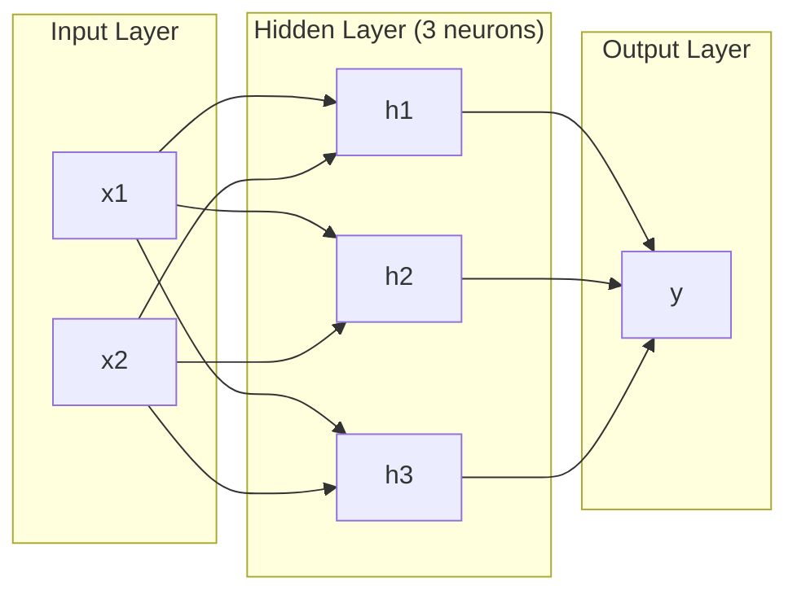
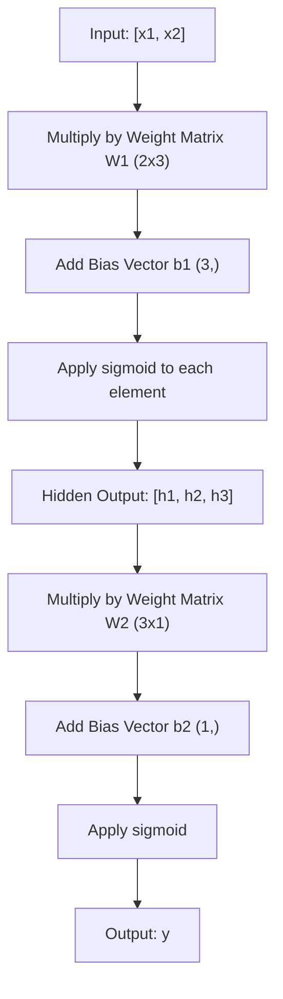
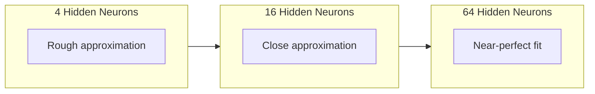

# 多层网络与前向传播 (Multi-Layer Networks and Forward Pass)

> 一个神经元画一条直线。堆叠它们，你能画出任何形状。

**类型：** 动手构建
**语言：** Python
**前置知识：** 阶段 01（数学基础），第 03.01 课（感知机）
**时长：** ~90 分钟

## 学习目标

- 用 Layer 和 Network 类从零构建一个多层网络，完成完整的前向传播
- 跟踪矩阵维度在网络各层中的变化，识别形状不匹配问题
- 解释堆叠非线性激活函数如何使网络学习弯曲的决策边界
- 使用 2-2-1 架构和手工调优的 sigmoid 权重解决 XOR 问题

## 问题

单个神经元就是一条直线绘制器。仅此而已。数据中的一条直线。AI 中的每一个实际问题——图像识别、语言理解、下围棋——都需要曲线。将神经元堆叠成层，就是你获得曲线的方式。

1969 年，Minsky 和 Papert 证明了这一限制是致命的：单层网络无法学习 XOR。不是"学起来困难"——而是数学上不可能。XOR 真值表将 [0,1] 和 [1,0] 放在一侧，[0,0] 和 [1,1] 放在另一侧。没有一条直线可以分离它们。

这导致神经网络研究资金中断了十多年。事后看来，解决办法显而易见：不要只使用一层。将神经元堆叠成层。让第一层将输入空间雕刻成新的特征，然后让第二层将这些特征组合成单一直线无法做出的决策。

这个堆叠就是多层网络。它是当今生产中每个深度学习模型的基础。前向传播——数据从输入通过隐藏层流向输出——是在其他一切工作之前需要构建的第一件事。

## 概念

### 层：输入、隐藏、输出

一个多层网络有三种类型的层：

**输入层**——并非真正的"层"。它保存你的原始数据。两个特征意味着两个输入节点。这里不进行计算。

**隐藏层**——工作发生的地方。每个神经元接收前一层的每个输出，应用权重和偏置，然后将结果通过一个激活函数传递。"隐藏"是因为你在训练数据中从未直接看到这些值。

**输出层**——最终答案。对于二分类任务，使用一个带 sigmoid 的神经元。对于多分类任务，每个类别一个神经元。


```mermaid
graph LR
    subgraph Input["Input Layer"]
        x1["x1"]
        x2["x2"]
    end
    subgraph Hidden["Hidden Layer (3 neurons)"]
        h1["h1"]
        h2["h2"]
        h3["h3"]
    end
    subgraph Output["Output Layer"]
        y["y"]
    end
    x1 --> h1
    x1 --> h2
    x1 --> h3
    x2 --> h1
    x2 --> h2
    x2 --> h3
    h1 --> y
    h2 --> y
    h3 --> y
```

这是一个 2-3-1 网络。两个输入，三个隐藏神经元，一个输出。每个连接都有一个权重。每个神经元（除输入层外）都有一个偏置。

每一层产生一个称为 hidden state (隐藏状态) 的数字向量。对于文本，隐藏状态增加维度——将一个词编码为 768 个数字以捕获语义信息。对于图像，它们降低维度——将数百万像素压缩为可管理的表示。隐藏状态是学习发生的地方。

### 神经元与激活函数

每个神经元做三件事：

1. 将每个输入乘以对应的权重
2. 对所有乘积求和并加上偏置
3. 将总和通过一个激活函数传递

目前，激活函数是 sigmoid：

```
sigmoid(z) = 1 / (1 + e^(-z))
```

Sigmoid 将任何数字压缩到 (0, 1) 范围内。大的正数输入推向 1。大的负数输入推向 0。零映射到 0.5。这个平滑曲线使得学习成为可能——与感知机的硬阶跃不同，sigmoid 在任何地方都有梯度。

### 前向传播：数据如何流动

前向传播将输入数据逐层推过网络，直到到达输出。前向传播过程中不发生学习。它纯粹是计算：乘、加、激活、重复。


```mermaid
graph TD
    X["Input: [x1, x2]"] --> WH["Multiply by Weight Matrix W1 (2x3)"]
    WH --> BH["Add Bias Vector b1 (3,)"]
    BH --> AH["Apply sigmoid to each element"]
    AH --> H["Hidden Output: [h1, h2, h3]"]
    H --> WO["Multiply by Weight Matrix W2 (3x1)"]
    WO --> BO["Add Bias Vector b2 (1,)"]
    BO --> AO["Apply sigmoid"]
    AO --> Y["Output: y"]
```

在每一层，三个操作依次发生：

```
z = W * input + b       (linear transformation)
a = sigmoid(z)           (activation)
```

一层的输出成为下一层的输入。这就是整个前向传播。

### 矩阵维度

跟踪维度是深度学习中最重要的调试技能。以下是 2-3-1 网络：

| 步骤 | 操作 | 维度 | 结果形状 |
|------|------|------|---------|
| 输入 | x | -- | (2,) |
| 隐藏层线性变换 | W1 * x + b1 | W1: (3, 2), b1: (3,) | (3,) |
| 隐藏层激活 | sigmoid(z1) | -- | (3,) |
| 输出层线性变换 | W2 * h + b2 | W2: (1, 3), b2: (1,) | (1,) |
| 输出层激活 | sigmoid(z2) | -- | (1,) |

规则：第 k 层的权重矩阵 W 的形状为 (neurons_in_layer_k, neurons_in_layer_k_minus_1)。行匹配当前层。列匹配前一层。如果形状对不上，你就有一个 bug。

### 通用近似定理 (Universal Approximation Theorem)

1989 年，George Cybenko 证明了一个非凡的结论：具有一个隐藏层和足够多神经元的神经网络可以以任意精度逼近任何连续函数。

这并不意味着一个隐藏层总是最好的。它意味着该架构在理论上是可行的。在实践中，深度网络（更多层、每层更少神经元）可以用比浅宽网络少得多的总参数来学习相同的函数。这就是深度学习有效的原因。

直觉：隐藏层中的每个神经元学习一个"凸起"或特征。足够多的凸起放置在正确的位置可以逼近任何光滑曲线。更多神经元，更多凸起，更好的逼近。


```mermaid
graph LR
    subgraph FewNeurons["4 Hidden Neurons"]
        A["Rough approximation"]
    end
    subgraph MoreNeurons["16 Hidden Neurons"]
        B["Close approximation"]
    end
    subgraph ManyNeurons["64 Hidden Neurons"]
        C["Near-perfect fit"]
    end
    FewNeurons --> MoreNeurons --> ManyNeurons
```

### 可组合性 (Composability)

神经网络是可组合的。你可以堆叠它们、串联它们、并行运行它们。Whisper 模型使用一个 encoder 网络处理音频和一个单独的 decoder 网络生成文本。现代 LLM 是 decoder-only。BERT 是 encoder-only。T5 是 encoder-decoder。架构选择定义了模型能做什么。

```figure
mlp-forward
```

## 动手构建

纯 Python。不使用 numpy。每个矩阵操作都从头编写。

### 第 1 步：Sigmoid 激活函数

```python
import math

def sigmoid(x):
    x = max(-500.0, min(500.0, x))
    return 1.0 / (1.0 + math.exp(-x))
```

限制到 [-500, 500] 是为了防止溢出。`math.exp(500)` 很大但有限。`math.exp(1000)` 是无穷大。

### 第 2 步：Layer 类

深度学习中最重要的操作是矩阵乘法。每一层、每个 attention head、每次前向传播——底层都是 matmul (矩阵乘法)。一个线性层接收一个输入向量，乘以一个权重矩阵，再加上一个偏置向量：y = Wx + b。这个单一的方程占了神经网络中 90% 的计算量。

一个层持有一个权重矩阵和一个偏置向量。它的 forward 方法接收一个输入向量并返回激活后的输出。

```python
class Layer:
    def __init__(self, n_inputs, n_neurons, weights=None, biases=None):
        if weights is not None:
            self.weights = weights
        else:
            import random
            self.weights = [
                [random.uniform(-1, 1) for _ in range(n_inputs)]
                for _ in range(n_neurons)
            ]
        if biases is not None:
            self.biases = biases
        else:
            self.biases = [0.0] * n_neurons

    def forward(self, inputs):
        self.last_input = inputs
        self.last_output = []
        for neuron_idx in range(len(self.weights)):
            z = sum(
                w * x for w, x in zip(self.weights[neuron_idx], inputs)
            )
            z += self.biases[neuron_idx]
            self.last_output.append(sigmoid(z))
        return self.last_output
```

权重矩阵的形状是 (n_neurons, n_inputs)。每一行是一个神经元在所有输入上的权重。forward 方法遍历神经元，计算加权和加上偏置，应用 sigmoid，并收集结果。

### 第 3 步：Network 类

一个网络是一个层的列表。前向传播将它们串联起来：第 k 层的输出送入第 k+1 层。

```python
class Network:
    def __init__(self, layers):
        self.layers = layers

    def forward(self, inputs):
        current = inputs
        for layer in self.layers:
            current = layer.forward(current)
        return current
```

这就是整个前向传播。四行逻辑。数据进入，流经每一层，从另一端出来。

### 第 4 步：用手工调优的权重解决 XOR

在第 01 课中，我们通过组合 OR、NAND 和 AND 感知机解决了 XOR。现在用我们的 Layer 和 Network 类做同样的事。2-2-1 架构：两个输入，两个隐藏神经元，一个输出。

```python
hidden = Layer(
    n_inputs=2,
    n_neurons=2,
    weights=[[20.0, 20.0], [-20.0, -20.0]],
    biases=[-10.0, 30.0],
)

output = Layer(
    n_inputs=2,
    n_neurons=1,
    weights=[[20.0, 20.0]],
    biases=[-30.0],
)

xor_net = Network([hidden, output])

xor_data = [
    ([0, 0], 0),
    ([0, 1], 1),
    ([1, 0], 1),
    ([1, 1], 0),
]

for inputs, expected in xor_data:
    result = xor_net.forward(inputs)
    predicted = 1 if result[0] >= 0.5 else 0
    print(f"  {inputs} -> {result[0]:.6f} (rounded: {predicted}, expected: {expected})")
```

大的权重 (20, -20) 使 sigmoid 表现得像 step 函数。第一个隐藏神经元近似 OR。第二个近似 NAND。输出神经元将它们组合成 AND，这就是 XOR。

### 第 5 步：圆形分类

一个更难的问题：将 2D 点分类为在以原点为中心、半径 0.5 的圆内部或外部。这需要一个弯曲的决策边界——对单个感知机是不可能的。

```python
import random
import math

random.seed(42)

data = []
for _ in range(200):
    x = random.uniform(-1, 1)
    y = random.uniform(-1, 1)
    label = 1 if (x * x + y * y) < 0.25 else 0
    data.append(([x, y], label))

circle_net = Network([
    Layer(n_inputs=2, n_neurons=8),
    Layer(n_inputs=8, n_neurons=1),
])
```

用随机权重，网络分类效果不好。但前向传播仍然可以运行。这就是关键——前向传播只是计算。学习正确的权重是反向传播，将在第 03 课中介绍。

```python
correct = 0
for inputs, expected in data:
    result = circle_net.forward(inputs)
    predicted = 1 if result[0] >= 0.5 else 0
    if predicted == expected:
        correct += 1

print(f"Accuracy with random weights: {correct}/{len(data)} ({100*correct/len(data):.1f}%)")
```

随机权重的准确率很低——通常比猜测多数类还差。经过训练后（第 03 课），这个具有 8 个隐藏神经元的相同架构将画出一条弯曲的边界，将圆内与圆外分开。

## 使用它

PyTorch 用四行代码完成了上述所有工作：

```python
import torch
import torch.nn as nn

model = nn.Sequential(
    nn.Linear(2, 8),
    nn.Sigmoid(),
    nn.Linear(8, 1),
    nn.Sigmoid(),
)

x = torch.tensor([[0.0, 0.0], [0.0, 1.0], [1.0, 0.0], [1.0, 1.0]])
output = model(x)
print(output)
```

`nn.Linear(2, 8)` 就是你的 Layer 类：形状为 (8, 2) 的权重矩阵，形状为 (8,) 的偏置向量。`nn.Sigmoid()` 是你的逐元素 sigmoid 函数。`nn.Sequential` 是你的 Network 类：按顺序串联层。

区别在于速度和规模。PyTorch 在 GPU 上运行，处理数百万样本的批次，并自动计算用于反向传播的梯度。但前向传播的逻辑与你刚刚从零构建的完全相同。

## 交付物

本课程产出一个可复用的网络架构设计提示词：

- `outputs/prompt-network-architect.md`

当你需要决定给定问题使用多少层、每层多少神经元以及使用哪些激活函数时，可以使用它。

## 练习

1. 构建一个 2-4-2-1 网络（两个隐藏层），在 XOR 数据上使用随机权重运行前向传播。打印中间隐藏层的输出，观察表示在各层之间如何变换。

2. 将圆形分类器的隐藏层大小从 8 改为 2，再改为 32。每次用随机权重运行前向传播。隐藏神经元的数量会改变输出范围或分布吗？为什么？

3. 在 Network 类上实现一个 `count_parameters` 方法，返回可训练权重和偏置的总数。在 784-256-128-10 网络（经典的 MNIST 架构）上测试它。它有多少个参数？

4. 为 3-4-4-2 网络构建前向传播。输入 RGB 颜色值（归一化到 0-1）并观察两个输出。这是一个具有两个类别的简单颜色分类器的架构。

5. 用"渗漏阶跃"函数替换 sigmoid：如果 z < 0 返回 0.01 * z，否则返回 1.0。使用第 4 步中相同的手工调优权重在 XOR 上运行前向传播。它还能工作吗？为什么平滑的 sigmoid 比硬截断更受欢迎？

## 关键术语

| 术语 | 人们怎么说 | 实际含义 |
|------|-----------|---------|
| Forward pass | "运行模型" | 将输入推过每一层——乘以权重、加偏置、激活——产生输出 |
| Hidden layer | "中间部分" | 输入和输出之间的任何层，其值在数据中不能直接观察到 |
| Multi-layer network | "一个深度神经网络" | 按顺序堆叠的神经元层，每层的输出作为下一层的输入 |
| Activation function | "非线性函数" | 在线性变换之后应用的函数，为决策边界引入曲线 |
| Sigmoid | "S 形曲线" | σ(z) = 1/(1+e^(-z))，将任何实数压缩到 (0,1)，平滑且处处可微 |
| Weight matrix | "参数" | 形状为 (当前层神经元数, 前一层神经元数) 的矩阵 W，包含可学习的连接强度 |
| Bias vector | "偏移量" | 矩阵乘法后添加的向量，使神经元即使在所有输入为零时也能激活 |
| Universal approximation | "神经网络能学任何东西" | 一个具有足够神经元的隐藏层可以逼近任何连续函数——但"足够"可能意味着数十亿 |
| Linear transformation | "矩阵乘法步骤" | z = W * x + b，激活之前的计算，将输入映射到一个新空间 |
| Decision boundary | "分类器切换的地方" | 输入空间中网络输出越过分类阈值处的曲面 |

## 延伸阅读

- Michael Nielsen, "Neural Networks and Deep Learning", 第 1-2 章 (http://neuralnetworksanddeeplearning.com/) —— 关于前向传播和网络结构的最清晰的免费解释，配有交互式可视化
- Cybenko, "Approximation by Superpositions of a Sigmoidal Function" (1989) —— 通用近似定理的原始论文，出人意料地可读
- 3Blue1Brown, "But what is a neural network?" (https://www.youtube.com/watch?v=aircAruvnKk) —— 20 分钟的关于层、权重和前向传播的可视化讲解，构建正确的思维模型
- Goodfellow, Bengio, Courville, "Deep Learning", 第 6 章 (https://www.deeplearningbook.org/) —— 多层网络的标准参考书，免费在线
