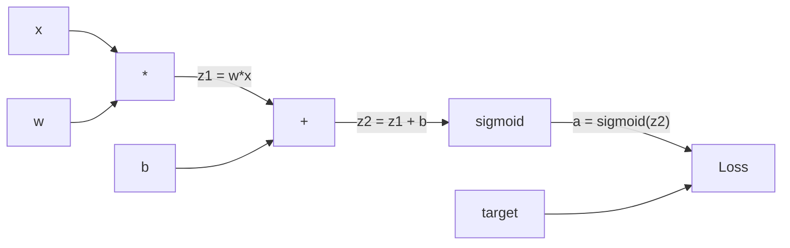
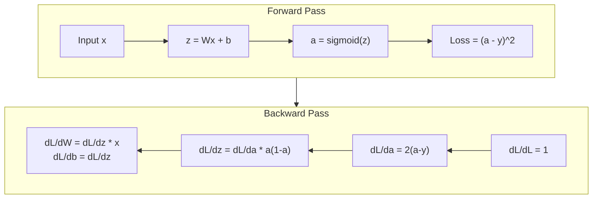
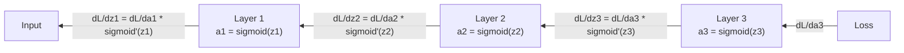

# バックプロパゲーションをゼロから作る

> バックプロパゲーションは学習を可能にするアルゴリズムです。これがなければ、ニューラルネットワークは高価な乱数生成器にすぎません。

**種類:** Build
**言語:** Python
**前提条件:** Lesson 03.02 (Multi-Layer Networks)
**所要時間:** 約120分

## 学習目標

- 計算グラフを構築し、トポロジカルソートで勾配を計算するValueベースのautogradエンジンを実装する
- 連鎖律を使って、加算、乗算、sigmoidのバックワードパスを導出する
- ゼロから作ったバックプロパゲーションエンジンだけを使い、XORと円分類で多層ネットワークを訓練する
- 深いsigmoidネットワークで起きる勾配消失問題を特定し、勾配が指数的に小さくなる理由を説明する

## 問題

あなたのネットワークには、入力768、出力3072の単一の隠れ層があります。重みは2,359,296個です。ネットワークが誤った予測をしました。どの重みが誤差を引き起こしたのでしょうか。各重みを個別に試すなら、230万回のフォワードパスが必要です。バックプロパゲーションなら、1回のバックワードパスで230万個すべての勾配を計算できます。これは単なる最適化ではありません。訓練可能か不可能かの違いです。

素朴な方法はこうです。重みを1つ取り、ほんの少し動かし、もう一度フォワードパスを実行して、損失が上がったか下がったかを測ります。これでその重みに対する勾配が得られます。次に、ネットワーク内のすべての重みで同じことをします。さらにそれを、何千回もの訓練ステップと何百万ものデータ点に掛け合わせます。有用なものを訓練するには地質学的な時間が必要になります。

バックプロパゲーションはこれを解決します。1回のフォワードパス、1回のバックワードパス、すべての勾配を計算。コツは微積分の連鎖律を、計算グラフに体系的に適用することです。これこそが深層学習を実用化したアルゴリズムです。これがなければ、私たちは今でもおもちゃの問題で足止めされていたでしょう。

## 概念

### 連鎖律をネットワークに適用する

Phase 01, Lesson 05で連鎖律を見ました。簡単に復習します。y = f(g(x)) なら、dy/dx = f'(g(x)) * g'(x) です。連鎖に沿って導関数を掛け合わせます。

ニューラルネットワークでは、この「連鎖」は入力から損失までの操作列です。各層は重みを適用し、バイアスを足し、活性化関数に通します。損失関数は最終出力をターゲットと比較します。バックプロパゲーションはこの連鎖を逆向きにたどり、各操作が誤差にどれだけ寄与したかを計算します。

### 計算グラフ

すべてのフォワードパスはグラフを構築します。各ノードは操作（乗算、加算、sigmoid）です。各エッジは値を前向きに運び、勾配を後ろ向きに運びます。



フォワードパスでは、値が左から右へ流れます。xとwから z1 = w*x が作られます。bを足してz2を得ます。sigmoidで活性化aを得ます。損失関数を使ってaをターゲットyと比較します。

バックワードパスでは、勾配が右から左へ流れます。dL/da（活性化が変わると損失がどう変わるか）から始めます。これに da/dz2（sigmoidの導関数）を掛けます。すると dL/dz2 が得られます。z2 = z1 + b なので、これは dL/db（dL/dz2と等しい）と dL/dz1 に分かれます。さらに dL/dw = dL/dz1 * x、dL/dx = dL/dz1 * w です。

グラフ内の各ノードがバックワードパスで行う仕事は1つだけです。上流から来た勾配を受け取り、局所的な導関数を掛けて、下流へ渡します。

### フォワードとバックワード



フォワードパスはすべての中間値を保存します。z、a、各層への入力などです。バックワードパスでは、勾配を計算するためにこれらの保存済みの値が必要です。これがバックプロパゲーションの中心にあるメモリと計算のトレードオフです。メモリ（活性化の保存）を使う代わりに速度（何百万回ではなく1回のパス）を得ます。

### ネットワーク内の勾配の流れ

3層ネットワークでは、勾配はすべての層を通って連鎖します。



各層で、勾配はsigmoidの導関数で掛けられます。sigmoidの導関数は a * (1 - a) で、最大でも0.25です（a = 0.5のとき）。3層深くなると、勾配は最大でも 0.25^3 = 0.0156 倍されています。10層なら 0.25^10 = 0.000001 です。

### 勾配消失

これが勾配消失問題です。sigmoidは出力を0から1の間に押し込みます。導関数は常に0.25未満です。sigmoid層を十分に積み重ねると、勾配はほとんどゼロになります。初期層はほぼゼロの勾配しか受け取れないため、ほとんど学習しません。

```
sigmoid(z):     Output range [0, 1]
sigmoid'(z):    Max value 0.25 (at z = 0)

After 5 layers:   gradient * 0.25^5 = 0.001x original
After 10 layers:  gradient * 0.25^10 = 0.000001x original
```

これが、深いsigmoidネットワークを訓練するのがほぼ不可能な理由です。解決策であるReLUとその変種はLesson 04の主題です。ここでは、バックプロパゲーションそのものは完全に機能していることを理解してください。問題は、それが何を通って働いているかです。

### 2層ネットワークの勾配を導出する

入力x、sigmoidを持つ隠れ層、sigmoidを持つ出力層、MSE損失を持つネットワークについて、具体的に数式を見ます。

フォワードパス:
```
z1 = W1 * x + b1
a1 = sigmoid(z1)
z2 = W2 * a1 + b2
a2 = sigmoid(z2)
L = (a2 - y)^2
```

バックワードパス（連鎖律を一歩ずつ適用）:
```
dL/da2 = 2(a2 - y)
da2/dz2 = a2 * (1 - a2)
dL/dz2 = dL/da2 * da2/dz2 = 2(a2 - y) * a2 * (1 - a2)

dL/dW2 = dL/dz2 * a1
dL/db2 = dL/dz2

dL/da1 = dL/dz2 * W2
da1/dz1 = a1 * (1 - a1)
dL/dz1 = dL/da1 * da1/dz1

dL/dW1 = dL/dz1 * x
dL/db1 = dL/dz1
```

すべての勾配は、損失からさかのぼって局所的な導関数を掛け合わせたものです。バックプロパゲーションとは、それだけです。

## 作ってみる

### Step 1: Valueノード

この計算に現れるすべての数値をValueにします。Valueはデータ、勾配、そしてどのように作られたかを保存します。そうすることで、逆向きに勾配を計算できるようになります。

```python
class Value:
    def __init__(self, data, children=(), op=''):
        self.data = data
        self.grad = 0.0
        self._backward = lambda: None
        self._children = set(children)
        self._op = op

    def __repr__(self):
        return f"Value(data={self.data:.4f}, grad={self.grad:.4f})"
```

まだ勾配はありません（0.0）。まだbackward関数もありません（no-op）。`_children` は、このValueを作ったValueたちを追跡します。あとでグラフをトポロジカルソートするためです。

### Step 2: backward関数を持つ演算

各演算は新しいValueを作り、その演算を通って勾配がどのように逆向きへ流れるかを定義します。

```python
def __add__(self, other):
    other = other if isinstance(other, Value) else Value(other)
    out = Value(self.data + other.data, (self, other), '+')

    def _backward():
        self.grad += out.grad
        other.grad += out.grad

    out._backward = _backward
    return out

def __mul__(self, other):
    other = other if isinstance(other, Value) else Value(other)
    out = Value(self.data * other.data, (self, other), '*')

    def _backward():
        self.grad += other.data * out.grad
        other.grad += self.data * out.grad

    out._backward = _backward
    return out
```

加算では d(a+b)/da = 1、d(a+b)/db = 1 です。したがって、両方の入力は出力の勾配をそのまま受け取ります。

乗算では d(a*b)/da = b、d(a*b)/db = a です。各入力は、もう一方の値に出力勾配を掛けたものを受け取ります。

`+=` は重要です。1つのValueが複数の演算で使われることがあります。その勾配は、すべての経路から来る勾配の合計です。

### Step 3: Sigmoidと損失

```python
import math

def sigmoid(self):
    x = self.data
    x = max(-500, min(500, x))
    s = 1.0 / (1.0 + math.exp(-x))
    out = Value(s, (self,), 'sigmoid')

    def _backward():
        self.grad += (s * (1 - s)) * out.grad

    out._backward = _backward
    return out
```

sigmoidの導関数は sigmoid(x) * (1 - sigmoid(x)) です。フォワードパスで sigmoid(x) = s を計算済みです。再利用しましょう。追加の計算は不要です。

```python
def mse_loss(predicted, target):
    diff = predicted + Value(-target)
    return diff * diff
```

単一出力に対するMSEは (predicted - target)^2 です。ここでは、引き算を負のValueとの足し算として表しています。

### Step 4: バックワードパス

トポロジカルソートにより、ノードを正しい順序で処理できます。つまり、あるノードを通って勾配を伝播する前に、そのノードの勾配が完全に蓄積されるようにします。

```python
def backward(self):
    topo = []
    visited = set()

    def build_topo(v):
        if v not in visited:
            visited.add(v)
            for child in v._children:
                build_topo(child)
            topo.append(v)

    build_topo(self)
    self.grad = 1.0
    for v in reversed(topo):
        v._backward()
```

損失から始めます（dL/dL = 1 なので gradient = 1.0）。ソート済みのグラフを逆向きにたどります。各ノードの `_backward` が、その子へ勾配を押し戻します。

### Step 5: LayerとNetwork

```python
import random

class Neuron:
    def __init__(self, n_inputs):
        scale = (2.0 / n_inputs) ** 0.5
        self.weights = [Value(random.uniform(-scale, scale)) for _ in range(n_inputs)]
        self.bias = Value(0.0)

    def __call__(self, x):
        act = sum((wi * xi for wi, xi in zip(self.weights, x)), self.bias)
        return act.sigmoid()

    def parameters(self):
        return self.weights + [self.bias]


class Layer:
    def __init__(self, n_inputs, n_outputs):
        self.neurons = [Neuron(n_inputs) for _ in range(n_outputs)]

    def __call__(self, x):
        out = [n(x) for n in self.neurons]
        return out[0] if len(out) == 1 else out

    def parameters(self):
        params = []
        for n in self.neurons:
            params.extend(n.parameters())
        return params


class Network:
    def __init__(self, sizes):
        self.layers = []
        for i in range(len(sizes) - 1):
            self.layers.append(Layer(sizes[i], sizes[i + 1]))

    def __call__(self, x):
        for layer in self.layers:
            x = layer(x)
            if not isinstance(x, list):
                x = [x]
        return x[0] if len(x) == 1 else x

    def parameters(self):
        params = []
        for layer in self.layers:
            params.extend(layer.parameters())
        return params

    def zero_grad(self):
        for p in self.parameters():
            p.grad = 0.0
```

Neuronは入力を受け取り、重み付き和にバイアスを足し、sigmoidを適用します。重みの初期化は sqrt(2/n_inputs) でスケールし、深いネットワークでsigmoidが飽和するのを防ぎます。LayerはNeuronのリストです。NetworkはLayerのリストです。`parameters()` メソッドは学習可能なValueをすべて集めるので、それらを更新できます。

### Step 6: XORで訓練する

```python
random.seed(42)
net = Network([2, 4, 1])

xor_data = [
    ([0.0, 0.0], 0.0),
    ([0.0, 1.0], 1.0),
    ([1.0, 0.0], 1.0),
    ([1.0, 1.0], 0.0),
]

learning_rate = 1.0

for epoch in range(1000):
    total_loss = Value(0.0)
    for inputs, target in xor_data:
        x = [Value(i) for i in inputs]
        pred = net(x)
        loss = mse_loss(pred, target)
        total_loss = total_loss + loss

    net.zero_grad()
    total_loss.backward()

    for p in net.parameters():
        p.data -= learning_rate * p.grad

    if epoch % 100 == 0:
        print(f"Epoch {epoch:4d} | Loss: {total_loss.data:.6f}")

print("\nXOR Results:")
for inputs, target in xor_data:
    x = [Value(i) for i in inputs]
    pred = net(x)
    print(f"  {inputs} -> {pred.data:.4f} (expected {target})")
```

損失が下がっていく様子を見てください。ランダムな予測から正しいXOR出力へ向かいます。そのすべては、バックプロパゲーションが勾配を計算し、重みを正しい方向へ少しずつ動かすことで起きています。

### Step 7: 円分類

Lesson 02では円分類の重みを手で調整しました。ここではネットワークに学習させます。

```python
random.seed(7)

def generate_circle_data(n=100):
    data = []
    for _ in range(n):
        x1 = random.uniform(-1.5, 1.5)
        x2 = random.uniform(-1.5, 1.5)
        label = 1.0 if x1 * x1 + x2 * x2 < 1.0 else 0.0
        data.append(([x1, x2], label))
    return data

circle_data = generate_circle_data(80)

circle_net = Network([2, 8, 1])
learning_rate = 0.5

for epoch in range(2000):
    random.shuffle(circle_data)
    total_loss_val = 0.0
    for inputs, target in circle_data:
        x = [Value(i) for i in inputs]
        pred = circle_net(x)
        loss = mse_loss(pred, target)
        circle_net.zero_grad()
        loss.backward()
        for p in circle_net.parameters():
            p.data -= learning_rate * p.grad
        total_loss_val += loss.data

    if epoch % 200 == 0:
        correct = 0
        for inputs, target in circle_data:
            x = [Value(i) for i in inputs]
            pred = circle_net(x)
            predicted_class = 1.0 if pred.data > 0.5 else 0.0
            if predicted_class == target:
                correct += 1
        accuracy = correct / len(circle_data) * 100
        print(f"Epoch {epoch:4d} | Loss: {total_loss_val:.4f} | Accuracy: {accuracy:.1f}%")
```

ここではonline SGDを使います。フルバッチを蓄積するのではなく、各サンプルの後に重みを更新します。これにより対称性がより速く崩れ、全損失地形上でsigmoidが飽和することを避けやすくなります。各epochでデータをシャッフルすると、ネットワークが順序を記憶するのを防げます。

手作業の調整は不要です。ネットワークは円形の決定境界を自力で発見します。これがバックプロパゲーションの力です。あなたはアーキテクチャ、損失関数、データを定義します。重みはアルゴリズムが見つけます。

## 使ってみる

PyTorchでは、ここまでのすべてを数行で行えます。中心の考え方は同じです。autogradはフォワードパス中に計算グラフを構築し、それを逆向きにたどって勾配を計算します。

```python
import torch
import torch.nn as nn

model = nn.Sequential(
    nn.Linear(2, 4),
    nn.Sigmoid(),
    nn.Linear(4, 1),
    nn.Sigmoid(),
)
optimizer = torch.optim.SGD(model.parameters(), lr=1.0)
criterion = nn.MSELoss()

X = torch.tensor([[0,0],[0,1],[1,0],[1,1]], dtype=torch.float32)
y = torch.tensor([[0],[1],[1],[0]], dtype=torch.float32)

for epoch in range(1000):
    pred = model(X)
    loss = criterion(pred, y)
    optimizer.zero_grad()
    loss.backward()
    optimizer.step()

print("PyTorch XOR Results:")
with torch.no_grad():
    for i in range(4):
        pred = model(X[i])
        print(f"  {X[i].tolist()} -> {pred.item():.4f} (expected {y[i].item()})")
```

`loss.backward()` はあなたの `total_loss.backward()` です。`optimizer.step()` は手で書いた `p.data -= lr * p.grad` です。`optimizer.zero_grad()` は `net.zero_grad()` です。同じアルゴリズムの、産業レベルの実装です。PyTorchはGPUアクセラレーション、mixed precision、gradient checkpointing、何百種類もの層を扱います。それでもバックワードパスは、同じ計算グラフに同じ連鎖律を適用しているだけです。

訓練では、フォワードパスを実行し、次にバックワードパスを実行し、重みを更新します。推論ではフォワードパスだけを実行します。勾配も更新もありません。この区別は、本番で起きるのが推論だから重要です。ClaudeやGPTのようなAPIを呼び出すとき、あなたは推論を実行しています。プロンプトがネットワークを前向きに流れ、反対側からトークンが出てきます。重みは変わりません。バックプロパゲーションを理解することが重要なのは、そのネットワーク内のすべての重みがバックプロパゲーションによって形作られているからです。

## 成果物

このレッスンでは次を作ります。
- `outputs/prompt-gradient-debugger.md` -- 任意のニューラルネットワークで勾配問題（勾配消失、勾配爆発、NaN）を診断するための再利用可能なプロンプト

## 演習

1. Valueクラスに `__sub__` メソッドを追加してください（a - b = a + (-1 * b)）。次に `__neg__` メソッドを実装します。(a - b)^2 のような単純な式について手計算と比較し、勾配が正しいことを確認してください。

2. Valueに `relu` メソッドを追加してください（出力は max(0, x)、導関数は x > 0 なら1、それ以外なら0）。隠れ層のsigmoidをreluに置き換え、XORでもう一度訓練します。収束速度を比較してください。より速い訓練が見えるはずです。これはLesson 04の予告です。

3. Valueに整数べき乗のための `__pow__` メソッドを実装してください。それを使って `mse_loss` を本来の `(predicted - target) ** 2` という式に置き換えます。勾配が元の実装と一致することを確認してください。

4. 訓練ループに勾配クリッピングを追加してください。`backward()` を呼んだ後、すべての勾配を [-1, 1] にクリップします。sigmoidを持つより深いネットワーク（4層以上）を訓練し、クリッピングありとなしの損失曲線を比較してください。これは勾配爆発に対する最初の防御策です。

5. 可視化を作ってください。XORで訓練した後、ネットワーク内のすべてのパラメータの勾配を出力します。どの層の勾配が最も小さいかを特定してください。これにより、概念セクションで読んだ勾配消失問題が実演されます。

## 重要用語

| 用語 | よくある言い方 | 実際の意味 |
|------|----------------|------------|
| バックプロパゲーション | 「ネットワークが学習する」 | 計算グラフを逆向きに連鎖律でたどり、すべての重みについて dL/dw を計算するアルゴリズム |
| 計算グラフ | 「ネットワーク構造」 | ノードが演算、エッジが値（前向き）と勾配（後ろ向き）を運ぶ有向非巡回グラフ |
| 連鎖律 | 「導関数を掛ける」 | y = f(g(x)) なら dy/dx = f'(g(x)) * g'(x)。バックプロパゲーションの数学的基礎 |
| 勾配 | 「最急上昇の方向」 | パラメータに関する損失の偏導関数。損失を減らすためにそのパラメータをどう変えるべきかを示す |
| 勾配消失 | 「深いネットワークが学習しない」 | sigmoidのような飽和する活性化関数を持つ層を通ると、勾配が指数的に小さくなる現象 |
| フォワードパス | 「ネットワークを実行する」 | 各層の演算を順番に適用し、中間値を保存しながら入力から出力を計算すること |
| バックワードパス | 「勾配を計算する」 | 計算グラフを逆向きにたどり、各ノードで連鎖律を使って勾配を蓄積すること |
| learning rate | 「どれくらい速く学習するか」 | 重み更新時のステップ幅を制御するスカラー: w_new = w_old - lr * gradient |
| トポロジカルソート | 「正しい順序」 | 各ノードが依存先のすべてのノードより後に現れるグラフノードの順序。伝播前に勾配が完全に蓄積されるようにする |
| Autograd | 「自動微分」 | フォワード計算中に計算グラフを構築し、勾配を自動計算するシステム。PyTorchのエンジンが行っていること |

## 参考資料

- Rumelhart, Hinton & Williams, "Learning representations by back-propagating errors" (1986) -- バックプロパゲーションを主流にし、多層ネットワークの訓練を切り開いた論文
- 3Blue1Brown, "Neural Networks" series (https://www.youtube.com/playlist?list=PLZHQObOWTQDNU6R1_67000Dx_ZCJB-3pi) -- バックプロパゲーションとネットワーク内の勾配の流れについて、最も優れた視覚的説明の一つ
