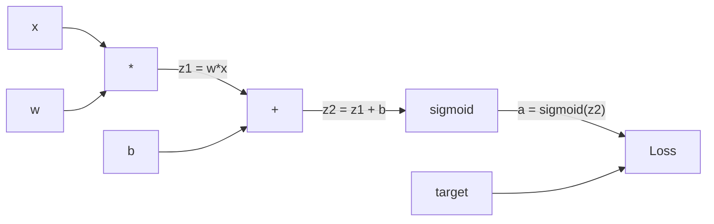
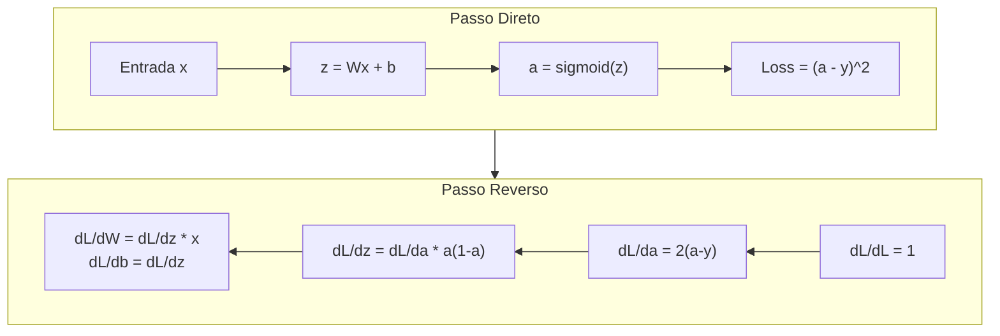
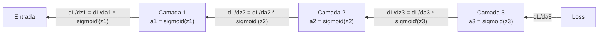

# Retropropagação do Zero

> Retropropagação é o algoritmo que torna o aprendizado possível. Sem ela, redes neurais são só geradores de números aleatórios caros.

**Tipo:** Construção
**Linguagens:** Python
**Pré-requisitos:** Aula 03.02 (Redes Multicamada)
**Tempo:** ~120 minutos

## Objetivos de Aprendizado

- Implementar um mecanismo de autograd baseado em Value que constrói um grafo computacional e computa gradientes via ordenação topológica
- Derivar o passo reverso para adição, multiplicação e sigmoid usando a regra da cadeia
- Treinar uma rede multicamada em XOR e classificação de círculo usando apenas seu mecanismo de retropropagação do zero
- Identificar o problema do gradiente desvanecimento em redes sigmoid profundas e explicar por que os gradientes diminuem exponencialmente

## O Problema

Sua rede tem uma camada oculta com 768 entradas e 3072 saídas. São 2.359.296 pesos. Ela fez uma previsão errada. Quais pesos causaram o erro? Testar cada peso individualmente significa 2,3 milhões de passos diretos. Retropropagação computa todos os 2,3 milhões de gradientes em um único passo reverso. Isso não é uma otimização. É a diferença entre treinável e impossível.

A abordagem ingênua: pegar um peso, dar um empurrãozinho, rodar o passo direto de novo, medir se a perda subiu ou desceu. Isso dá o gradiente pra aquele peso. Agora faz pra cada peso na rede. Multiplique por milhares de passos de treino e milhões de pontos de dados. Você precisaria de tempo geológico pra treinar qualquer coisa útil.

Retropropagação resolve isso. Um passo direto, um passo reverso, todos os gradientes computados. O truque é a regra da cadeia do cálculo, aplicada sistematicamente a um grafo computacional. Esse é o algoritmo que tornou o deep learning prático. Sem ele, a gente ainda estaria preso em problemas de brinquedo.

## O Conceito

### A Regra da Cadeia, Aplicada a Redes

Você viu a regra da cadeia na Fase 01, Aula 05. Recap rápido: se y = f(g(x)), então dy/dx = f'(g(x)) * g'(x). Você multiplica derivadas ao longo da cadeia.

Em uma rede neural, a "cadeia" é a sequência de operações da entrada até a perda. Cada camada aplica pesos, adiciona vieses, passa por uma ativação. A função de perda compara a saída final com o alvo. Retropropagação percorre essa cadeia pra trás, computando como cada operação contribuiu pro erro.

### Grafos Computacionais

Todo passo direto constrói um grafo. Cada nó é uma operação (multiplicar, somar, sigmoid). Cada aresta carrega um valor pra frente e um gradiente pra trás.



Passo direto: valores fluem da esquerda pra direita. x e w produzem z1 = w*x. Soma b pra pegar z2. Sigmoid dá ativação a. Compara a com o alvo y usando a função de perda.

Passo reverso: gradientes fluem da direita pra esquerda. Começa com dL/da (como a perda muda com a ativação). Multiplica por da/dz2 (derivada da sigmoid). Isso dá dL/dz2. Divide em dL/db (que é igual a dL/dz2, já que z2 = z1 + b) e dL/dz1. Então dL/dw = dL/dz1 * x e dL/dx = dL/dz1 * w.

Cada nó no grafo tem um trabalho durante o passo reverso: pegar o gradiente que vem de cima, multiplicar pela sua derivada local e passar pra baixo.

### Passo Direto vs Reverso



O passo direto armazena cada valor intermediário: z, a, as entradas de cada camada. O passo reverso precisa desses valores armazenados pra computar gradientes. Essa é a troca memória-computação no coração da retropropagação. Você troca memória (armazenar ativações) por velocidade (um passo em vez de milhões).

### Fluxo de Gradiente por uma Rede

Para uma rede de 3 camadas, os gradientes encadeiam por cada camada:



Em cada camada, o gradiente é multiplicado pela derivada da sigmoid. A derivada da sigmoid é a * (1 - a), que chega no máximo em 0.25 (quando a = 0.5). Três camadas fundo, o gradiente já foi multiplicado por no máximo 0.25^3 = 0.0156. Dez camadas: 0.25^10 = 0.000001.

### Gradientes Desvanecentes

Esse é o problema do gradiente desvanecimento. A sigmoid comprime sua saída entre 0 e 1. Sua derivada é sempre menor que 0.25. Empilhe sigmoid suficiente e os gradientes encolhem pra zero. Camadas iniciais mal aprendem porque recebem gradientes próximos de zero.

```
sigmoid(z):     Faixa de saída [0, 1]
sigmoid'(z):    Valor máximo 0.25 (em z = 0)

Após 5 camadas:  gradiente * 0.25^5 = 0.001x do original
Após 10 camadas: gradiente * 0.25^10 = 0.000001x do original
```

É por isso que redes sigmoid profundas são quase impossíveis de treinar. A solução — ReLU e suas variantes — é o assunto da Aula 04. Por enquanto, entenda que a retropropagação funciona perfeitamente. O problema é o que ela está passando.

### Derivando Gradientes pra uma Rede de 2 Camadas

Matemática concreta pra uma rede com entrada x, camada oculta com sigmoid, camada de saída com sigmoid, e perda MSE.

Passo direto:
```
z1 = W1 * x + b1
a1 = sigmoid(z1)
z2 = W2 * a1 + b2
a2 = sigmoid(z2)
L = (a2 - y)^2
```

Passo reverso (aplicando a regra da cadeia passo a passo):
```
dL/da2 = 2(a2 - y)
da2/dz2 = a2 * (1 - a2)
dL/dz2 = dL/da2 * da2/dz2 = 2(a2 - y) * a2 * (1 - a2)

dL/dW2 = dL/dz2 * a1
dL/db2 = dL/dz2

dL/da1 = dL/dz2 * W2
da1/dz1 = a1 * (1 - a1)
dL/dz1 = dL/da1 * da1/dz1

dL/dW1 = dL/dz1 * x
dL/db1 = dL/dz1
```

Cada gradiente é um produto de derivadas locais rastreado de volta da perda. É isso que retropropagação é.

## Construa

### Passo 1: O Nó Value

Cada número na nossa computação vira um Value. Ele armazena seus dados, seu gradiente e como foi criado (pra saber como computar gradientes pra trás).

```python
class Value:
    def __init__(self, data, children=(), op=''):
        self.data = data
        self.grad = 0.0
        self._backward = lambda: None
        self._children = set(children)
        self._op = op

    def __repr__(self):
        return f"Value(data={self.data:.4f}, grad={self.grad:.4f})"
```

Sem gradiente ainda (0.0). Sem função backward ainda (não-op). Os `_children` rastreiam quais Values produziram este, pra que possamos ordenar topologicamente o grafo depois.

### Passo 2: Operações com Funções Backward

Cada operação cria um Value novo e define como gradientes fluem pra trás por ele.

```python
def __add__(self, other):
    other = other if isinstance(other, Value) else Value(other)
    out = Value(self.data + other.data, (self, other), '+')

    def _backward():
        self.grad += out.grad
        other.grad += out.grad

    out._backward = _backward
    return out

def __mul__(self, other):
    other = other if isinstance(other, Value) else Value(other)
    out = Value(self.data * other.data, (self, other), '*')

    def _backward():
        self.grad += other.data * out.grad
        other.grad += self.data * out.grad

    out._backward = _backward
    return out
```

Pra adição: d(a+b)/da = 1, d(a+b)/db = 1. Então ambos recebem o gradiente da saída direto.

Pra multiplicação: d(a*b)/da = b, d(a*b)/db = a. Cada entrada recebe o valor da outra vezes o gradiente da saída.

O `+=` é crucial. Um Value pode ser usado em múltiplas operações. Seu gradiente é a soma dos gradientes de todos os caminhos.

### Passo 3: Sigmoid e Perda

```python
import math

def sigmoid(self):
    x = self.data
    x = max(-500, min(500, x))
    s = 1.0 / (1.0 + math.exp(-x))
    out = Value(s, (self,), 'sigmoid')

    def _backward():
        self.grad += (s * (1 - s)) * out.grad

    out._backward = _backward
    return out
```

Derivada da sigmoid: sigmoid(x) * (1 - sigmoid(x)). Computamos sigmoid(x) = s durante o passo direto. Reutilizamos. Sem trabalho extra.

```python
def mse_loss(predicted, target):
    diff = predicted + Value(-target)
    return diff * diff
```

MSE pra uma saída: (predicted - target)^2. Expressamos subtração como adição com um Value negado.

### Passo 4: Passo Reverso

Ordenação topológica garante que processamos os nós na ordem certa — o gradiente de um nó está totalmente acumulado antes de propagarmos por ele.

```python
def backward(self):
    topo = []
    visited = set()

    def build_topo(v):
        if v not in visited:
            visited.add(v)
            for child in v._children:
                build_topo(child)
            topo.append(v)

    build_topo(self)
    self.grad = 1.0
    for v in reversed(topo):
        v._backward()
```

Começa na perda (gradiente = 1.0, já que dL/dL = 1). Caminha pra trás pelo grafo ordenado. O `_backward` de cada nó empurra gradientes pros seus filhos.

### Passo 5: Layer e Network

```python
import random

class Neuron:
    def __init__(self, n_inputs):
        scale = (2.0 / n_inputs) ** 0.5
        self.weights = [Value(random.uniform(-scale, scale)) for _ in range(n_inputs)]
        self.bias = Value(0.0)

    def __call__(self, x):
        act = sum((wi * xi for wi, xi in zip(self.weights, x)), self.bias)
        return act.sigmoid()

    def parameters(self):
        return self.weights + [self.bias]


class Layer:
    def __init__(self, n_inputs, n_outputs):
        self.neurons = [Neuron(n_inputs) for _ in range(n_outputs)]

    def __call__(self, x):
        out = [n(x) for n in self.neurons]
        return out[0] if len(out) == 1 else out

    def parameters(self):
        params = []
        for n in self.neurons:
            params.extend(n.parameters())
        return params


class Network:
    def __init__(self, sizes):
        self.layers = []
        for i in range(len(sizes) - 1):
            self.layers.append(Layer(sizes[i], sizes[i + 1]))

    def __call__(self, x):
        for layer in self.layers:
            x = layer(x)
            if not isinstance(x, list):
                x = [x]
        return x[0] if len(x) == 1 else x

    def parameters(self):
        params = []
        for layer in self.layers:
            params.extend(layer.parameters())
        return params

    def zero_grad(self):
        for p in self.parameters():
            p.grad = 0.0
```

Um Neuron pega entradas, computa soma ponderada + viés e aplica sigmoid. A inicialização de pesos escala por sqrt(2/n_inputs) pra prevenir saturação da sigmoid em redes mais profundas. Um Layer é uma lista de Neurons. Um Network é uma lista de Layers. O método `parameters()` coleta todos os Values treináveis pra que possamos atualizá-los.

### Passo 6: Treinar no XOR

```python
random.seed(42)
net = Network([2, 4, 1])

xor_data = [
    ([0.0, 0.0], 0.0),
    ([0.0, 1.0], 1.0),
    ([1.0, 0.0], 1.0),
    ([1.0, 1.0], 0.0),
]

learning_rate = 1.0

for epoch in range(1000):
    total_loss = Value(0.0)
    for inputs, target in xor_data:
        x = [Value(i) for i in inputs]
        pred = net(x)
        loss = mse_loss(pred, target)
        total_loss = total_loss + loss

    net.zero_grad()
    total_loss.backward()

    for p in net.parameters():
        p.data -= learning_rate * p.grad

    if epoch % 100 == 0:
        print(f"Epoch {epoch:4d} | Loss: {total_loss.data:.6f}")

print("\nXOR Results:")
for inputs, target in xor_data:
    x = [Value(i) for i in inputs]
    pred = net(x)
    print(f"  {inputs} -> {pred.data:.4f} (expected {target})")
```

Observe a perda diminuindo. De previsões aleatórias pra saídas XOR corretas, impulsionado inteiramente por retropropagação computando gradientes e empurrando pesos na direção certa.

### Passo 7: Classificação de Círculo

Na Aula 02, você ajustou pesos manualmente pra classificação de círculo. Agora deixe a rede aprender eles.

```python
random.seed(7)

def generate_circle_data(n=100):
    data = []
    for _ in range(n):
        x1 = random.uniform(-1.5, 1.5)
        x2 = random.uniform(-1.5, 1.5)
        label = 1.0 if x1 * x1 + x2 * x2 < 1.0 else 0.0
        data.append(([x1, x2], label))
    return data

circle_data = generate_circle_data(80)

circle_net = Network([2, 8, 1])
learning_rate = 0.5

for epoch in range(2000):
    random.shuffle(circle_data)
    total_loss_val = 0.0
    for inputs, target in circle_data:
        x = [Value(i) for i in inputs]
        pred = circle_net(x)
        loss = mse_loss(pred, target)
        circle_net.zero_grad()
        loss.backward()
        for p in circle_net.parameters():
            p.data -= learning_rate * p.grad
        total_loss_val += loss.data

    if epoch % 200 == 0:
        correct = 0
        for inputs, target in circle_data:
            x = [Value(i) for i in inputs]
            pred = circle_net(x)
            predicted_class = 1.0 if pred.data > 0.5 else 0.0
            if predicted_class == target:
                correct += 1
        accuracy = correct / len(circle_data) * 100
        print(f"Epoch {epoch:4d} | Loss: {total_loss_val:.4f} | Accuracy: {accuracy:.1f}%")
```

Usamos SGD online aqui — atualizamos pesos após cada amostra em vez de acumular o lote inteiro. Isso quebra a simetria mais rápido e evita saturação da sigmoid na paisagem de perda completa. Embaralhar os dados a cada época evita que a rede memorize a ordem.

Sem ajuste manual. A rede descobre o limite de decisão circular sozinha. Esse é o poder da retropropagação: você define a arquitetura, a função de perda e os dados. O algoritmo descobre os pesos.

## Use

PyTorch faz tudo acima em poucas linhas. A ideia central é idêntica — autograd constrói um grafo computacional durante o passo direto e o percorre pra trás pra computar gradientes.

```python
import torch
import torch.nn as nn

model = nn.Sequential(
    nn.Linear(2, 4),
    nn.Sigmoid(),
    nn.Linear(4, 1),
    nn.Sigmoid(),
)
optimizer = torch.optim.SGD(model.parameters(), lr=1.0)
criterion = nn.MSELoss()

X = torch.tensor([[0,0],[0,1],[1,0],[1,1]], dtype=torch.float32)
y = torch.tensor([[0],[1],[1],[0]], dtype=torch.float32)

for epoch in range(1000):
    pred = model(X)
    loss = criterion(pred, y)
    optimizer.zero_grad()
    loss.backward()
    optimizer.step()

print("PyTorch XOR Results:")
with torch.no_grad():
    for i in range(4):
        pred = model(X[i])
        print(f"  {X[i].tolist()} -> {pred.item():.4f} (expected {y[i].item()})")
```

`loss.backward()` é seu `total_loss.backward()`. `optimizer.step()` é seu `p.data -= lr * p.grad` manual. `optimizer.zero_grad()` é seu `net.zero_grad()`. Mesmo algoritmo, implementação industrial. PyTorch lida com aceleração de GPU, precisão mista, checkpointing de gradiente e centenas de tipos de camadas. Mas o passo reverso é a mesma regra da cadeia aplicada ao mesmo grafo computacional.

Treino roda o passo direto, depois o reverso, depois atualiza pesos. Inferência roda só o passo direto. Sem gradientes, sem atualizações. Essa distinção importa porque inferência é o que acontece em produção. Quando você chama uma API como Claude ou GPT, você está rodando inferência — seu prompt flui pra frente pela rede e tokens surgem do outro lado. Nenhum peso muda. Entender retropropagação importa porque ela moldou cada peso nessa rede.

## Entregue

Esta aula produz:
- `outputs/prompt-gradient-debugger.md` — um prompt reutilizável pra diagnosticar problemas de gradiente (desvanecimento, explosão, NaN) em qualquer rede neural

## Exercícios

1. Adicione um método `__sub__` à classe Value (a - b = a + (-1 * b)). Então implemente um método `__neg__`. Verifique que os gradientes estão corretos comparando com cálculo manual pra uma expressão simples como (a - b)^2.

2. Adicione um método `relu` ao Value (saída max(0, x), derivada é 1 se x > 0, senão 0). Substitua a sigmoid por relu nas camadas ocultas e treine no XOR de novo. Compare a velocidade de convergência. Você deve ver treino mais rápido — isso antecipa a Aula 04.

3. Implemente um método `__pow__` no Value pra potências inteiras. Use ele pra substituir `mse_loss` por uma expressão adequada `(predicted - target) ** 2`. Verifique que os gradientes batem com a implementação original.

4. Adicione clipping de gradiente ao loop de treino: depois de chamar `backward()`, corte todos os gradientes pra [-1, 1]. Treine uma rede mais profunda (4+ camadas com sigmoid) e compare curvas de perda com e sem clipping. Essa é sua primeira defesa contra gradientes explosivos.

5. Construa uma visualização: depois de treinar no XOR, imprima o gradiente de cada parâmetro na rede. Identifique qual camada tem os menores gradientes. Isso demonstra o problema do gradiente desvanecimento que você leu na seção Conceito.

## Termos-Chave

| Termo | O que o pessoal diz | O que realmente significa |
|-------|---------------------|--------------------------|
| Retropropagação | "A rede aprende" | Um algoritmo que computa dL/dw pra cada peso aplicando a regra da cadeia pra trás no grafo computacional |
| Grafo computacional | "A estrutura da rede" | Um grafo acíclico direcionado onde nós são operações e arestas carregam valores (frente) e gradientes (trás) |
| Regra da cadeia | "Multiplicar as derivadas" | Se y = f(g(x)), então dy/dx = f'(g(x)) * g'(x) — a base matemática da retropropagação |
| Gradiente | "A direção da subida mais íngreme" | A derivada parcial da perda em relação a um parâmetro — diz como mudar esse parâmetro pra reduzir a perda |
| Gradiente desvanecente | "Redes profundas não aprendem" | Gradientees diminuem exponencialmente à medida que propagam por camadas com ativações saturantes como sigmoid |
| Passo direto | "Rodar a rede" | Computar a saída das entradas aplicando sequencialmente as operações de cada camada e armazenando valores intermediários |
| Passo reverso | "Computar gradientes" | Percorrer o grafo computacional ao contrário, acumulando gradientes em cada nó usando a regra da cadeia |
| Taxa de aprendizado | "Como rápido aprende" | Um escalar que controla o tamanho do passo ao atualizar pesos: w_new = w_old - lr * gradiente |
| Ordenação topológica | "A ordem certa" | Uma ordenação de nós do grafo onde cada nó aparece depois de todos os nós de que depende — garante que gradientes estejam totalmente acumulados antes da propagação |
| Autograd | "Diferenciação automática" | Um sistema que constrói grafos computacionais durante o cálculo direto e computa gradientes automaticamente — o que o motor do PyTorch faz |

## Leituras Complementares

- Rumelhart, Hinton & Williams, "Learning representations by back-propagating errors" (1986) — o artigo que popularizou retropropagação e desbloqueou treino de redes multicamada
- 3Blue1Brown, série "Neural Networks" (https://www.youtube.com/playlist?list=PLZHQObOWTQDNU6R1_67000Dx_ZCJB-3pi) — a melhor explicação visual de retropropagação e fluxo de gradiente por redes
