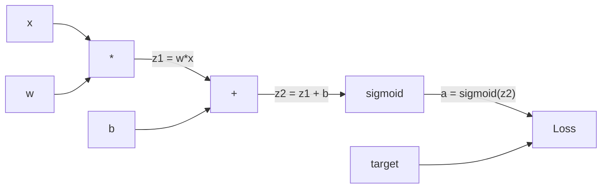
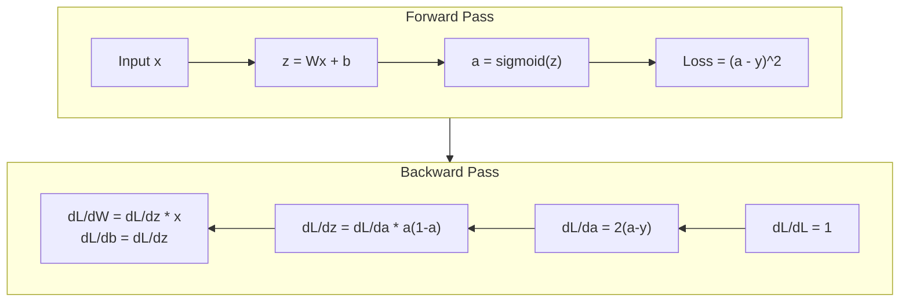
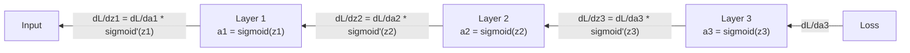

# Sıfırdan Backpropagation

> Backpropagation öğrenmeyi mümkün kılan algoritmadır. O olmadan, neural network'ler yalnızca pahalı rastgele sayı üreteçleridir.

**Tür:** Yapım
**Diller:** Python
**Önkoşullar:** Ders 03.02 (Çok Katmanlı Ağlar)
**Süre:** ~120 dakika

## Öğrenme Hedefleri

- Hesaplamalı bir grafik oluşturan ve gradient'leri topolojik sıralama yoluyla hesaplayan, Değer tabanlı bir otomatik derecelendirme motoru uygulayın
- Zincir kuralını kullanarak toplama, çarpma ve sigmoid için geriye doğru geçişi türetin
- Yalnızca sıfırdan backpropagation motorunuzu kullanarak XOR ve daire sınıflandırması konusunda çok katmanlı bir ağ eğitin
- Derin sigmoid ağlarda ortadan kaybolan gradient sorununu tanımlayın ve gradient'lerin neden katlanarak küçüldüğünü açıklayın

## Sorun

Ağınızda 768 giriş ve 3072 çıkıştan oluşan tek bir gizli katman bulunur. Bu 2.359.296 ağırlıktır. Yanlış tahminde bulundu. Hangi ağırlıklar hataya neden oldu? Her ağırlığı ayrı ayrı test etmek, 2,3 milyon ileri geçiş anlamına gelir. Backpropagation, 2,3 milyon gradient'nin tamamını tek bir geriye geçişte hesaplar. Bu bir optimizasyon değil. Eğitilebilir ile imkansız arasındaki fark budur.

Naif yaklaşım: Bir ağırlık alın, onu küçük bir miktar dürtün, ileri pası tekrar çalıştırın, kaybın arttığını mı yoksa azaldığını mı ölçün. Bu size söz konusu ağırlık için gradient değerini verir. Şimdi bunu ağdaki her ağırlık için yapın. Binlerce eğitim adımı ve milyonlarca veri noktasıyla çarpın. Yararlı bir şeyi eğitmek için jeolojik zamana ihtiyacınız var.

Backpropagation bunu çözer. Bir ileri pas, bir geri pas, tüm gradient'ler hesaplandı. İşin püf noktası, hesaplamalı bir grafiğe sistematik olarak uygulanan, analizden elde edilen zincir kuralıdır. deep learning'yi pratik hale getiren algoritma budur. O olmasaydı hâlâ oyuncak sorunlarına takılıp kalırdık.

## Konsept

### Ağlara Uygulanan Zincir Kuralı

Zincir kuralını Aşama 01, Ders 05'te gördünüz. Kısa özet: eğer y = f(g(x)) ise dy/dx = f'(g(x)) * g'(x). Türevleri zincir boyunca çarparsınız.

Bir neural network'de "zincir", girişten kayba kadar olan işlemlerin sırasıdır. Her katman ağırlıklar uygular, önyargılar ekler, bir aktivasyondan geçer. loss function nihai çıktıyı hedefle karşılaştırır. Backpropagation bu zinciri geriye doğru izleyerek her bir işlemin hataya nasıl katkıda bulunduğunu hesaplar.

### Hesaplamalı Grafikler

Her ileri geçiş bir grafik oluşturur. Her düğüm bir işlemdir (çarpma, toplama, sigmoid). Her kenar ileriye doğru bir değer ve geriye doğru bir gradient taşır.



İleri geçiş: değerler soldan sağa doğru akar. x ve w z1 = w*x sonucunu verir. Z2'yi elde etmek için b ekleyin. Sigmoid a aktivasyonunu verir. loss function'yi kullanarak a'yı hedef y ile karşılaştırın.

Geriye doğru geçiş: gradient'ler sağdan sola doğru akar. dL/da ile başlayın (aktivasyonla kaybın nasıl değiştiği). da/dz2 (sigmoid türevi) ile çarpın. Bu dL/dz2'yi verir. dL/db (z2 = z1 + b olduğundan dL/dz2'ye eşittir) ve dL/dz1'e bölün. O halde dL/dw = dL/dz1 * x ve dL/dx = dL/dz1 * w.

Grafikteki her düğümün geri geçiş sırasında bir işi vardır: yukarıdan gelen gradient'yi alın, yerel türeviyle çarpın ve aşağı aktarın.

### İleri ve Geri



İleri geçiş her ara değeri saklar: z, a, her katmanın girdileri. Geriye doğru geçiş, gradient'leri hesaplamak için bu saklanan değerlere ihtiyaç duyar. Bu, backprop'un kalbindeki bellek hesaplama değiş tokuşudur. Hız için (milyonlarca yerine bir geçiş) hafızayı (aktivasyonları depolamak) değiştirirsiniz.

### Gradient Ağ Üzerinden Akış

3 katmanlı bir ağ için gradient'ler her katmanda zincir oluşturur:



Her katmanda gradient sigmoid türevi ile çarpılır. Sigmoid türevi bir * (1 - a) olup, maksimum değeri 0,25'tir (a = 0,5 olduğunda). Üç katman derinliğindeki gradient en fazla 0,25^3 = 0,0156 ile çarpılmıştır. On katman derinliği: 0,25^10 = 0,000001.

### Gradient'lerin kaybolması

Bu, ortadan kaybolan gradient sorunudur. Sigmoid çıktısını 0 ile 1 arasında sıkıştırır. Türevi her zaman 0,25'ten küçüktür. Yeterli sigmoid katmanı istifleyin ve gradient'ler küçülerek sıfıra insin. İlk katmanlar zar zor öğreniyor çünkü sıfıra yakın gradient alıyorlar.

```
sigmoid(z):     Output range [0, 1]
sigmoid'(z):    Max value 0.25 (at z = 0)

After 5 layers:   gradient * 0.25^5 = 0.001x original
After 10 layers:  gradient * 0.25^10 = 0.000001x original
```

Bu nedenle derin sigmoid ağların eğitilmesi neredeyse imkansızdır. Düzeltme - ReLU ve çeşitleri - Ders 04'ün konusudur. Şimdilik, backprop'un mükemmel çalıştığını anlayın. Sorun onun üzerinde çalıştığı şey.

### 2 Katmanlı Ağ için Gradient'leri Türetme

Giriş x, sigmoid ile gizli katman, sigmoid ile çıkış katmanı ve MSE kaybı olan bir ağ için somut matematik.

İleri pas:
```
z1 = W1 * x + b1
a1 = sigmoid(z1)
z2 = W2 * a1 + b2
a2 = sigmoid(z2)
L = (a2 - y)^2
```

Geriye doğru pas (zincir kuralının adım adım uygulanması):
```
dL/da2 = 2(a2 - y)
da2/dz2 = a2 * (1 - a2)
dL/dz2 = dL/da2 * da2/dz2 = 2(a2 - y) * a2 * (1 - a2)

dL/dW2 = dL/dz2 * a1
dL/db2 = dL/dz2

dL/da1 = dL/dz2 * W2
da1/dz1 = a1 * (1 - a1)
dL/dz1 = dL/da1 * da1/dz1

dL/dW1 = dL/dz1 * x
dL/db1 = dL/dz1
```

Her gradient, kayıptan geriye doğru takip edilen yerel türevlerin bir ürünüdür. backpropagation'nin hepsi bu.

```figure
backprop-vanishing
```

## İnşa Et

### Adım 1: Değer Düğümü

Hesaplamamızdaki her sayı bir Değer haline gelir. Verilerini, gradient'sini ve nasıl oluşturulduğunu saklar (böylece gradient'lerin geriye doğru nasıl hesaplanacağını bilir).

```python
class Value:
    def __init__(self, data, children=(), op=''):
        self.data = data
        self.grad = 0.0
        self._backward = lambda: None
        self._children = set(children)
        self._op = op

    def __repr__(self):
        return f"Value(data={self.data:.4f}, grad={self.grad:.4f})"
```

Henüz gradient yok (0,0). Henüz geriye doğru işlev yok (işlem yok). Values'un bunu ürettiği `_children` izi, böylece grafiği daha sonra topolojik olarak sıralayabiliriz.

### Adım 2: Geriye Dönük İşlevlerle İşlemler

Her işlem yeni bir Değer yaratır ve gradient'lerin bunun içinden nasıl geriye doğru aktığını tanımlar.

```python
def __add__(self, other):
    other = other if isinstance(other, Value) else Value(other)
    out = Value(self.data + other.data, (self, other), '+')

    def _backward():
        self.grad += out.grad
        other.grad += out.grad

    out._backward = _backward
    return out

def __mul__(self, other):
    other = other if isinstance(other, Value) else Value(other)
    out = Value(self.data * other.data, (self, other), '*')

    def _backward():
        self.grad += other.data * out.grad
        other.grad += self.data * out.grad

    out._backward = _backward
    return out
```

Toplama için: d(a+b)/da = 1, d(a+b)/db = 1. Yani her iki giriş de çıkışın gradient değerini doğrudan alır.

Çarpma için: d(a*b)/da = b, d(a*b)/db = a. Her giriş diğerinin değeri ile gradient çıkışının çarpımını alır.

`+=` kritiktir. Bir Değer birden fazla işlemde kullanılabilir. gradient'si, tüm yollardaki gradient'lerin toplamıdır.

### Adım 3: Sigmoid ve Kayıp

```python
import math

def sigmoid(self):
    x = self.data
    x = max(-500, min(500, x))
    s = 1.0 / (1.0 + math.exp(-x))
    out = Value(s, (self,), 'sigmoid')

    def _backward():
        self.grad += (s * (1 - s)) * out.grad

    out._backward = _backward
    return out
```

Sigmoid türevi: sigmoid(x) * (1 - sigmoid(x)). İleri geçiş sırasında sigmoid(x) = s'yi hesapladık. Tekrar kullanın. Ekstra çalışma yok.

```python
def mse_loss(predicted, target):
    diff = predicted + Value(-target)
    return diff * diff
```

Tek bir çıktı için MSE: (tahmin edilen - hedef)^2. Çıkarmayı, olumsuzlanmış bir değerle toplama olarak ifade ederiz.

### Adım 4: Geriye Geçiş

Topolojik sıralama, düğümleri doğru sırada işlememizi sağlar; bir düğümün gradient'si, biz onun içinde yayılmadan önce tamamen biriktirilir.

```python
def backward(self):
    topo = []
    visited = set()

    def build_topo(v):
        if v not in visited:
            visited.add(v)
            for child in v._children:
                build_topo(child)
            topo.append(v)

    build_topo(self)
    self.grad = 1.0
    for v in reversed(topo):
        v._backward()
```

Kayıpla başlayın (gradient = 1,0, çünkü dL/dL = 1). Sıralanmış grafikte geriye doğru ilerleyin. Her düğümün `_backward`'si, gradient'leri çocuklarına iter.

### Adım 5: Katman ve Ağ

```python
import random

class Neuron:
    def __init__(self, n_inputs):
        scale = (2.0 / n_inputs) ** 0.5
        self.weights = [Value(random.uniform(-scale, scale)) for _ in range(n_inputs)]
        self.bias = Value(0.0)

    def __call__(self, x):
        act = sum((wi * xi for wi, xi in zip(self.weights, x)), self.bias)
        return act.sigmoid()

    def parameters(self):
        return self.weights + [self.bias]


class Layer:
    def __init__(self, n_inputs, n_outputs):
        self.neurons = [Neuron(n_inputs) for _ in range(n_outputs)]

    def __call__(self, x):
        out = [n(x) for n in self.neurons]
        return out[0] if len(out) == 1 else out

    def parameters(self):
        params = []
        for n in self.neurons:
            params.extend(n.parameters())
        return params


class Network:
    def __init__(self, sizes):
        self.layers = []
        for i in range(len(sizes) - 1):
            self.layers.append(Layer(sizes[i], sizes[i + 1]))

    def __call__(self, x):
        for layer in self.layers:
            x = layer(x)
            if not isinstance(x, list):
                x = [x]
        return x[0] if len(x) == 1 else x

    def parameters(self):
        params = []
        for layer in self.layers:
            params.extend(layer.parameters())
        return params

    def zero_grad(self):
        for p in self.parameters():
            p.grad = 0.0
```

Bir Nöron girdileri alır, ağırlıklı toplam + sapmayı hesaplar ve sigmoid'i uygular. Daha derin ağlarda sigmoid doygunluğunu önlemek için ağırlık başlatma, sqrt(2/n_inputs) ile ölçeklenir. Katman, Nöronların bir listesidir. Ağ, Katmanların bir listesidir. `parameters()` yöntemi, onları güncelleyebilmemiz için tüm öğrenilebilir Değerleri toplar.

### Adım 6: XOR üzerinde eğitim alın

```python
random.seed(42)
net = Network([2, 4, 1])

xor_data = [
    ([0.0, 0.0], 0.0),
    ([0.0, 1.0], 1.0),
    ([1.0, 0.0], 1.0),
    ([1.0, 1.0], 0.0),
]

learning_rate = 1.0

for epoch in range(1000):
    total_loss = Value(0.0)
    for inputs, target in xor_data:
        x = [Value(i) for i in inputs]
        pred = net(x)
        loss = mse_loss(pred, target)
        total_loss = total_loss + loss

    net.zero_grad()
    total_loss.backward()

    for p in net.parameters():
        p.data -= learning_rate * p.grad

    if epoch % 100 == 0:
        print(f"Epoch {epoch:4d} | Loss: {total_loss.data:.6f}")

print("\nXOR Results:")
for inputs, target in xor_data:
    x = [Value(i) for i in inputs]
    pred = net(x)
    print(f"  {inputs} -> {pred.data:.4f} (expected {target})")
```

Kayıpların azalmasını izleyin. Tamamen backpropagation'nin gradient'leri hesaplaması ve ağırlıkları doğru yönde itmesiyle yönlendirilen rastgele tahminlerden doğru XOR çıktılarına kadar.

### Adım 7: Daire Sınıflandırması

Ders 02'de daire sınıflandırması için ağırlıkları elle ayarladınız. Şimdi ağın bunları öğrenmesine izin verin.

```python
random.seed(7)

def generate_circle_data(n=100):
    data = []
    for _ in range(n):
        x1 = random.uniform(-1.5, 1.5)
        x2 = random.uniform(-1.5, 1.5)
        label = 1.0 if x1 * x1 + x2 * x2 < 1.0 else 0.0
        data.append(([x1, x2], label))
    return data

circle_data = generate_circle_data(80)

circle_net = Network([2, 8, 1])
learning_rate = 0.5

for epoch in range(2000):
    random.shuffle(circle_data)
    total_loss_val = 0.0
    for inputs, target in circle_data:
        x = [Value(i) for i in inputs]
        pred = circle_net(x)
        loss = mse_loss(pred, target)
        circle_net.zero_grad()
        loss.backward()
        for p in circle_net.parameters():
            p.data -= learning_rate * p.grad
        total_loss_val += loss.data

    if epoch % 200 == 0:
        correct = 0
        for inputs, target in circle_data:
            x = [Value(i) for i in inputs]
            pred = circle_net(x)
            predicted_class = 1.0 if pred.data > 0.5 else 0.0
            if predicted_class == target:
                correct += 1
        accuracy = correct / len(circle_data) * 100
        print(f"Epoch {epoch:4d} | Loss: {total_loss_val:.4f} | Accuracy: {accuracy:.1f}%")
```

Burada çevrimiçi SGD'yi kullanıyoruz; tüm partiyi biriktirmek yerine her numuneden sonra ağırlıkları güncelliyoruz. Bu, simetriyi daha hızlı kırar ve tam kayıp ortamında sigmoid doygunluğunu önler. Verilerin her çağda karıştırılması ağın siparişi ezberlemesini engeller.

Elle ayarlama yok. Ağ, dairesel karar sınırını kendi başına keşfeder. backpropagation'nin gücü budur: mimariyi, loss function'yi ve verileri siz tanımlarsınız. Algoritma ağırlıkları hesaplar.

## Kullan onu

PyTorch yukarıdaki her şeyi birkaç satırda yapar. Temel fikir aynıdır; autograd ileri geçiş sırasında hesaplamalı bir grafik oluşturur ve gradient'leri hesaplamak için onu geriye doğru izler.

```python
import torch
import torch.nn as nn

model = nn.Sequential(
    nn.Linear(2, 4),
    nn.Sigmoid(),
    nn.Linear(4, 1),
    nn.Sigmoid(),
)
optimizer = torch.optim.SGD(model.parameters(), lr=1.0)
criterion = nn.MSELoss()

X = torch.tensor([[0,0],[0,1],[1,0],[1,1]], dtype=torch.float32)
y = torch.tensor([[0],[1],[1],[0]], dtype=torch.float32)

for epoch in range(1000):
    pred = model(X)
    loss = criterion(pred, y)
    optimizer.zero_grad()
    loss.backward()
    optimizer.step()

print("PyTorch XOR Results:")
with torch.no_grad():
    for i in range(4):
        pred = model(X[i])
        print(f"  {X[i].tolist()} -> {pred.item():.4f} (expected {y[i].item()})")
```

`loss.backward()` sizin `total_loss.backward()`'nizdir. `optimizer.step()`, `p.data -= lr * p.grad` kılavuzunuzdur. `optimizer.zero_grad()` sizin `net.zero_grad()`'nizdir. Aynı algoritma, endüstriyel güçte uygulama. PyTorch, GPU hızlandırmayı, karma hassasiyeti, gradient kontrol noktasını ve yüzlerce katman türünü yönetir. Ancak geriye doğru geçiş, aynı hesaplamalı grafiğe uygulanan aynı zincir kuralıdır.

Antrenman ileri pası çalıştırır, ardından geri pası çalıştırır ve ardından ağırlıkları günceller. Inference yalnızca ileri geçişi çalıştırır. gradient yok, güncelleme yok. Bu ayrım önemlidir çünkü inference üretimde olan şeydir. Claude veya GPT gibi bir API'yi çağırdığınızda, inference'yi çalıştırırsınız; prompt'niz ağ üzerinden ileri doğru akar ve token'ler diğer uçtan çıkar. Ağırlıklarda değişiklik yok. Backprop'u anlamak önemlidir çünkü bu ağdaki her ağırlığı şekillendirmiştir.

## Gönderin

Bu ders şunları üretir:
- `outputs/prompt-gradient-debugger.md` - herhangi bir neural network'deki gradient sorunlarını (kaybolan, patlayan, NaN) teşhis etmek için yeniden kullanılabilir bir prompt

## Egzersizler

1. Value sınıfına bir `__sub__` yöntemi ekleyin (a - b = a + (-1 * b)). Daha sonra bir `__neg__` yöntemini uygulayın. (a - b)^2 gibi basit bir ifade için manuel hesaplamayla karşılaştırarak gradient'lerin doğru olduğunu doğrulayın.

2. Değer'e bir `relu` yöntemi ekleyin (çıkış maksimum(0, x), x > 0 ise türev 1, aksi halde 0'dır). Gizli katmanlarda sigmoid'i relu ile değiştirin ve XOR üzerinde tekrar eğitim alın. Yakınsama hızını karşılaştırın. Daha hızlı eğitim görmelisiniz - bu Ders 04'ün önizlemesidir.

3. Tamsayı kuvvetleri için Değer üzerinde bir `__pow__` yöntemini uygulayın. `mse_loss`'yi uygun bir `(predicted - target) ** 2` ifadesiyle değiştirmek için bunu kullanın. gradient'lerin orijinal uygulamayla eşleştiğini doğrulayın.

4. gradient kırpmasını eğitim döngüsüne ekleyin: `backward()`'yi çağırdıktan sonra, tüm gradient'leri [-1, 1]'e kırpın. Daha derin bir ağ (sigmoid ile 4+ katman) eğitin ve kayıp eğrilerini kırpmalı ve kırpmasız karşılaştırın. Bu, patlayan gradient'lere karşı ilk savunmanızdır.

5. Bir görselleştirme oluşturun: XOR eğitiminden sonra ağdaki her parametrenin gradient'sini yazdırın. Hangi katmanın en küçük gradient'ye sahip olduğunu belirleyin. Bu, Konsept bölümünde okuduğunuz gradient sorununun ortadan kalkmasını göstermektedir.

## Anahtar Terimler

| Dönem | İnsanlar ne diyor | Aslında ne anlama geliyor |
|------|----------------|----------------------|
| Backpropagation | "Ağ öğreniyor" | Zincir kuralını hesaplamalı grafikte geriye doğru uygulayarak her ağırlık için dL/dw'yi hesaplayan bir algoritma |
| Hesaplamalı grafik | "Ağ yapısı" | Düğümlerin işlemler olduğu ve kenarların değerleri (ileri) ve gradient'leri (geriye) taşıdığı, yönlendirilmiş döngüsel olmayan bir grafik |
| Zincir kuralı | "Türevleri çarpın" | Eğer y = f(g(x)) ise dy/dx = f'(g(x)) * g'(x) -- backpropagation'nin matematiksel temeli |
| Gradient | "En dik yükselişin yönü" | Kaybın bir parametreye göre kısmi türevi -- kaybı azaltmak için bu parametreyi nasıl değiştireceğinizi anlatır |
| Kaybolan gradient | "Derin ağlar öğrenmiyor" | Gradient'ler, sigmoid |
| İleri pas | "Ağı çalıştırma" | Her katmanın işlemlerini sırayla uygulayarak ve ara değerleri saklayarak girdilerden elde edilen çıktıyı hesaplama |
| Geri pas | "gradient'lerin Hesaplanması" | Hesaplamalı grafiği tersten geçerek, zincir kuralını kullanarak her düğümde gradient'leri biriktirmek |
| Öğrenme oranı | "Ne kadar hızlı öğreniyor" | Ağırlıkları güncellerken adım boyutunu kontrol eden bir skaler: w_new = w_old - lr * gradient |
| Topolojik sıralama | "Doğru sıra" | Her düğümün bağlı olduğu tüm düğümlerden sonra göründüğü grafik düğümlerinin sıralaması, gradient'lerin yayılmadan önce tamamen toplanmasını sağlar |
| Otograd | "Otomatik farklılaşma" | İleri hesaplama sırasında hesaplamalı grafikler oluşturan ve gradient'leri otomatik olarak hesaplayan bir sistem - PyTorch'un motoru ne yapar |

## Daha Fazla Okuma

- Rumelhart, Hinton & Williams, "Geriye yayılma hataları ile gösterimlerin öğrenilmesi" (1986) -- backpropagation'yi ana akım haline getiren ve çok katmanlı ağ eğitiminin kilidini açan makale
- 3Blue1Brown, "Neural Networks" serisi (https://www.youtube.com/playlist?list=PLZHQObOWTQDNU6R1_67000Dx_ZCJB-3pi) -- backpropagation ve gradient'nin ağlar üzerinden akışının en iyi görsel açıklaması
