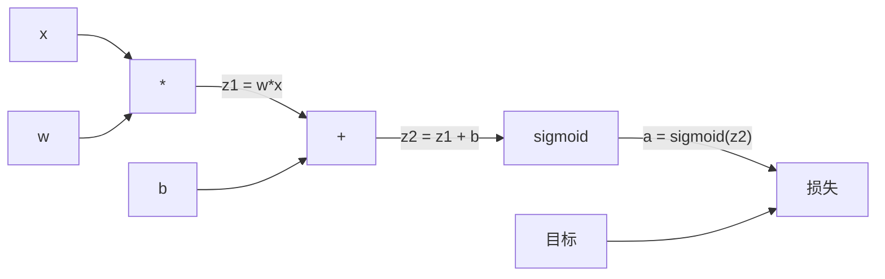
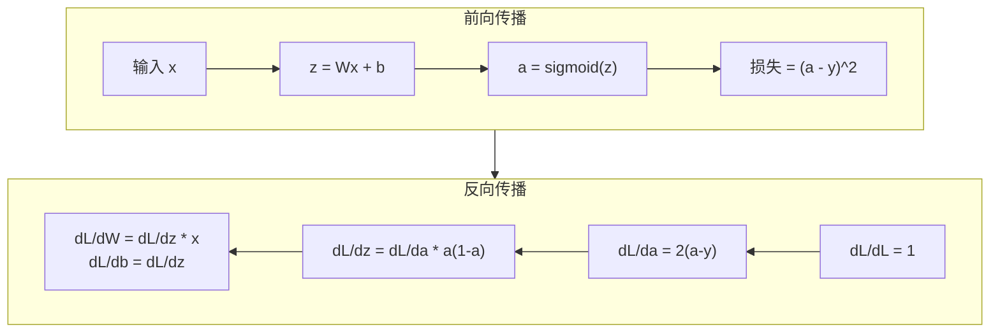

# 从零实现反向传播

> 反向传播（Backpropagation）是让学习成为可能的算法。没有它，神经网络就只是昂贵的随机数生成器。

**类型：** 构建
**语言：** Python
**前置知识：** 课程 03.02（多层网络）
**时间：** 约120分钟

## 学习目标

- 实现一个基于Value的自动求导引擎，它能构建计算图并通过拓扑排序计算梯度
- 使用链式法则推导加法、乘法和Sigmoid的反向传播过程
- 仅使用你从零实现的反向传播引擎，在XOR和圆分类任务上训练一个多层网络
- 识别深层Sigmoid网络中的梯度消失问题，并解释梯度为何指数级缩小

## 问题所在

你的网络有一个隐藏层，包含768个输入和3072个输出。也就是2,359,296个权重。它做出了错误的预测。是哪些权重导致了错误？单独测试每个权重需要进行230万次前向传播。而反向传播在单次反向传播中就能计算出全部230万个梯度。这不是优化上的改进，而是“可训练”与“不可能”之间的差别。

朴素的做法：取出一个权重，给它一个微小的扰动，再次运行前向传播，观察损失是上升还是下降。这便得到了该权重的梯度。然后对网络中每个权重重复操作。再乘以数千次训练步骤和数百万个数据点。训练出任何有用的东西都需要地质时间。

反向传播解决了这个问题。一次前向传播，一次反向传播，所有梯度全部计算完成。其诀窍是微积分中的链式法则，系统化地应用于计算图。正是这个算法让深度学习变得实用。没有它，我们至今仍只能处理玩具般的小问题。

## 概念

### 链式法则，应用于网络

你在第一阶段课程05中已经见过链式法则。快速回顾：如果 y = f(g(x))，那么 dy/dx = f'(g(x)) * g'(x)。沿着链条将导数相乘。

在神经网络中，“链条”就是从输入到损失的运算序列。每一层都会应用权重、加上偏置、通过激活函数。损失函数将最终输出与目标进行比较。反向传播逆向追踪这条链条，计算每个运算对误差的贡献。

### 计算图

每次前向传播都会构建一个图。每个节点是一个运算（乘法、加法、Sigmoid）。每条边向前传递数值，向后传递梯度。



前向传播：数值从左向右流动。x 和 w 产生 z1 = w*x。加上 b 得到 z2。Sigmoid 给出激活值 a。使用损失函数将 a 与目标 y 进行比较。

反向传播：梯度从右向左流动。从 dL/da（损失随激活值的变化）开始。乘以 da/dz2（Sigmoid导数）。得到 dL/dz2。拆分为 dL/db（等于 dL/dz2，因为 z2 = z1 + b）和 dL/dz1。然后 dL/dw = dL/dz1 * x，dL/dx = dL/dz1 * w。

图中的每个节点在反向传播时只有一个任务：接收来自上方的梯度，乘以其局部导数，然后向下传递。

### 前向与反向



前向传播会存储每一个中间值：z、a、以及每层的输入。反向传播需要这些存储的值来计算梯度。这就是反向传播核心的内存-计算权衡。你用内存（存储激活值）换取速度（一次传播而非数百万次）。

### 梯度在网络中的流动

对于一个3层网络，梯度会逐层链式传递：


每一层，梯度都会被乘以Sigmoid的导数。Sigmoid的导数是 a * (1 - a)，最大值在0.25（当 a = 0.5时）。三层之后，梯度最多被乘以 0.25^3 = 0.0156。十层之后：0.25^10 = 0.000001。

### 梯度消失

这就是梯度消失问题。Sigmoid将其输出压缩在0和1之间。其导数始终小于0.25。堆叠足够多的Sigmoid层后，梯度会缩小到几乎为零。早期层几乎学不到东西，因为它们接收到的梯度接近于零。

```
sigmoid(z):     输出范围 [0, 1]
sigmoid'(z):    最大值 0.25 (在 z = 0 处)

5层之后:   梯度 * 0.25^5 = 原始梯度的 0.001x
10层之后:  梯度 * 0.25^10 = 原始梯度的 0.000001x
```

这就是为什么深度Sigmoid网络几乎无法训练。解决方案——ReLU及其变体——是课程04的主题。现在，要理解反向传播本身工作完美。问题出在它需要穿越的路径上。

### 推导2层网络的梯度

对于输入为 x，隐藏层用Sigmoid，输出层用Sigmoid，损失为MSE的网络，具体数学如下：

前向传播：
```
z1 = W1 * x + b1
a1 = sigmoid(z1)
z2 = W2 * a1 + b2
a2 = sigmoid(z2)
L = (a2 - y)^2
```

反向传播（逐步应用链式法则）：
```
dL/da2 = 2(a2 - y)
da2/dz2 = a2 * (1 - a2)
dL/dz2 = dL/da2 * da2/dz2 = 2(a2 - y) * a2 * (1 - a2)

dL/dW2 = dL/dz2 * a1
dL/db2 = dL/dz2

dL/da1 = dL/dz2 * W2
da1/dz1 = a1 * (1 - a1)
dL/dz1 = dL/da1 * da1/dz1

dL/dW1 = dL/dz1 * x
dL/db1 = dL/dz1
```

每个梯度都是从损失开始逆向追溯的局部导数乘积。反向传播的全部内容就是这些。

## 动手构建

### 第1步：Value节点

我们计算中的每个数字都变成一个Value。它存储着它的数据、梯度以及创建方式（以便知道如何反向计算梯度）。

```python
class Value:
    def __init__(self, data, children=(), op=''):
        self.data = data
        self.grad = 0.0
        self._backward = lambda: None
        self._children = set(children)
        self._op = op

    def __repr__(self):
        return f"Value(data={self.data:.4f}, grad={self.grad:.4f})"
```

目前还没有梯度（0.0）。没有反向函数（无操作）。`_children` 跟踪哪些Value产生了这个Value，以便后续对图进行拓扑排序。

### 第2步：带反向函数的运算

每个运算创建一个新的Value，并定义梯度如何反向流过它。

```python
def __add__(self, other):
    other = other if isinstance(other, Value) else Value(other)
    out = Value(self.data + other.data, (self, other), '+')

    def _backward():
        self.grad += out.grad
        other.grad += out.grad

    out._backward = _backward
    return out

def __mul__(self, other):
    other = other if isinstance(other, Value) else Value(other)
    out = Value(self.data * other.data, (self, other), '*')

    def _backward():
        self.grad += other.data * out.grad
        other.grad += self.data * out.grad

    out._backward = _backward
    return out
```

对于加法：d(a+b)/da = 1，d(a+b)/db = 1。所以两个输入都直接得到输出梯度。

对于乘法：d(a*b)/da = b，d(a*b)/db = a。每个输入得到另一个输入的值乘以输出梯度。

`+=` 是关键的。一个Value可能被用于多个运算。它的梯度是所有路径梯度的总和。

### 第3步：Sigmoid与损失

```python
import math

def sigmoid(self):
    x = self.data
    x = max(-500, min(500, x))
    s = 1.0 / (1.0 + math.exp(-x))
    out = Value(s, (self,), 'sigmoid')

    def _backward():
        self.grad += (s * (1 - s)) * out.grad

    out._backward = _backward
    return out
```

Sigmoid导数：sigmoid(x) * (1 - sigmoid(x))。我们在前向传播中计算了 sigmoid(x) = s。复用它，不需要额外的工作。

```python
def mse_loss(predicted, target):
    diff = predicted + Value(-target)
    return diff * diff
```

单输出的MSE：(predicted - target)^2。我们将减法表示为加上一个取负的Value。

### 第4步：反向传播

拓扑排序确保我们以正确的顺序处理节点——在通过节点传播之前，该节点的梯度已经累加完成。

```python
def backward(self):
    topo = []
    visited = set()

    def build_topo(v):
        if v not in visited:
            visited.add(v)
            for child in v._children:
                build_topo(child)
            topo.append(v)

    build_topo(self)
    self.grad = 1.0
    for v in reversed(topo):
        v._backward()
```

从损失开始（梯度 = 1.0，因为 dL/dL = 1）。沿排序后的图反向遍历。每个节点的 `_backward` 将梯度推送到其子节点。

### 第5步：层与网络

```python
import random

class Neuron:
    def __init__(self, n_inputs):
        scale = (2.0 / n_inputs) ** 0.5
        self.weights = [Value(random.uniform(-scale, scale)) for _ in range(n_inputs)]
        self.bias = Value(0.0)

    def __call__(self, x):
        act = sum((wi * xi for wi, xi in zip(self.weights, x)), self.bias)
        return act.sigmoid()

    def parameters(self):
        return self.weights + [self.bias]


class Layer:
    def __init__(self, n_inputs, n_outputs):
        self.neurons = [Neuron(n_inputs) for _ in range(n_outputs)]

    def __call__(self, x):
        out = [n(x) for n in self.neurons]
        return out[0] if len(out) == 1 else out

    def parameters(self):
        params = []
        for n in self.neurons:
            params.extend(n.parameters())
        return params


class Network:
    def __init__(self, sizes):
        self.layers = []
        for i in range(len(sizes) - 1):
            self.layers.append(Layer(sizes[i], sizes[i + 1]))

    def __call__(self, x):
        for layer in self.layers:
            x = layer(x)
            if not isinstance(x, list):
                x = [x]
        return x[0] if len(x) == 1 else x

    def parameters(self):
        params = []
        for layer in self.layers:
            params.extend(layer.parameters())
        return params

    def zero_grad(self):
        for p in self.parameters():
            p.grad = 0.0
```

一个Neuron接收输入，计算加权和加偏置，然后应用Sigmoid。权重初始化使用 sqrt(2/n_inputs) 比例，以防止在更深网络中Sigmoid饱和。Layer是一个Neuron列表。Network是一个Layer列表。`parameters()` 方法收集所有可学习的Value，以便更新它们。

### 第6步：在XOR上训练

```python
random.seed(42)
net = Network([2, 4, 1])

xor_data = [
    ([0.0, 0.0], 0.0),
    ([0.0, 1.0], 1.0),
    ([1.0, 0.0], 1.0),
    ([1.0, 1.0], 0.0),
]

learning_rate = 1.0

for epoch in range(1000):
    total_loss = Value(0.0)
    for inputs, target in xor_data:
        x = [Value(i) for i in inputs]
        pred = net(x)
        loss = mse_loss(pred, target)
        total_loss = total_loss + loss

    net.zero_grad()
    total_loss.backward()

    for p in net.parameters():
        p.data -= learning_rate * p.grad

    if epoch % 100 == 0:
        print(f"Epoch {epoch:4d} | Loss: {total_loss.data:.6f}")

print("\nXOR Results:")
for inputs, target in xor_data:
    x = [Value(i) for i in inputs]
    pred = net(x)
    print(f"  {inputs} -> {pred.data:.4f} (expected {target})")
```

观察损失下降。从随机预测到正确的XOR输出，完全由反向传播计算梯度并在正确方向上微调权重驱动。

### 第7步：圆分类

在课程02中，你手动调整了用于圆分类的权重。现在让网络自己学习它们。

```python
random.seed(7)

def generate_circle_data(n=100):
    data = []
    for _ in range(n):
        x1 = random.uniform(-1.5, 1.5)
        x2 = random.uniform(-1.5, 1.5)
        label = 1.0 if x1 * x1 + x2 * x2 < 1.0 else 0.0
        data.append(([x1, x2], label))
    return data

circle_data = generate_circle_data(80)

circle_net = Network([2, 8, 1])
learning_rate = 0.5

for epoch in range(2000):
    random.shuffle(circle_data)
    total_loss_val = 0.0
    for inputs, target in circle_data:
        x = [Value(i) for i in inputs]
        pred = circle_net(x)
        loss = mse_loss(pred, target)
        circle_net.zero_grad()
        loss.backward()
        for p in circle_net.parameters():
            p.data -= learning_rate * p.grad
        total_loss_val += loss.data

    if epoch % 200 == 0:
        correct = 0
        for inputs, target in circle_data:
            x = [Value(i) for i in inputs]
            pred = circle_net(x)
            predicted_class = 1.0 if pred.data > 0.5 else 0.0
            if predicted_class == target:
                correct += 1
        accuracy = correct / len(circle_data) * 100
        print(f"Epoch {epoch:4d} | Loss: {total_loss_val:.4f} | Accuracy: {accuracy:.1f}%")
```

我们在这里使用在线SGD——每处理一个样本就更新权重，而不是累积整个批次。这样能更快打破对称性，并避免在完整损失景观上的Sigmoid饱和。每轮打乱数据可以防止网络记忆顺序。

没有手动调参。网络自己发现了圆形决策边界。这就是反向传播的力量：你定义架构、损失函数和数据。算法计算出权重。

## 使用它

PyTorch用几行代码就完成了以上所有工作。核心思想是相同的——自动求导（autograd）在前向传播期间构建计算图，并在反向传播中逆向遍历以计算梯度。

```python
import torch
import torch.nn as nn

model = nn.Sequential(
    nn.Linear(2, 4),
   