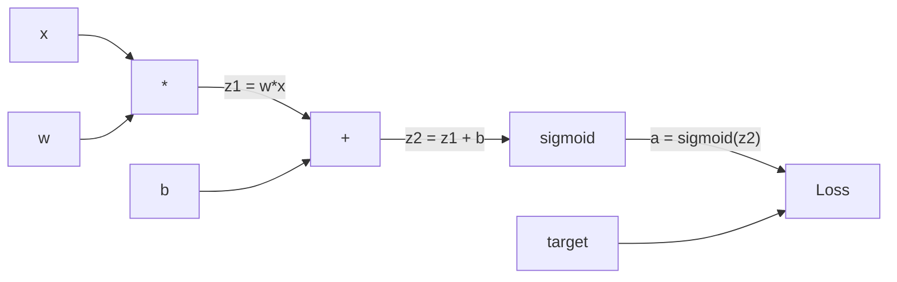
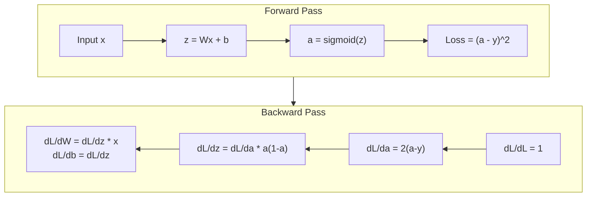
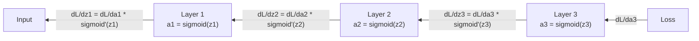

# 03 · 从零实现反向传播

> 反向传播是让学习成为可能的算法。没有它，神经网络只是昂贵的随机数生成器。

**类型：** 实战构建
**语言：** Python
**前置：** 课程 03.02（多层网络）
**时长：** 约 120 分钟

## 学习目标

- 实现一个基于 Value 的「自动求导（autograd）」引擎：构建计算图，并通过拓扑排序计算梯度
- 用链式法则推导加法、乘法和 sigmoid 的反向传播过程
- 仅使用你从零实现的反向传播引擎，在 XOR 和圆形分类任务上训练一个多层网络
- 识别深层 sigmoid 网络中的「梯度消失（vanishing gradient）」问题，并解释梯度为何会指数级衰减

## 问题所在

你的网络有一个隐藏层，768 个输入、3072 个输出。这就是 2,359,296 个权重。它做出了一个错误的预测。是哪些权重导致了误差？逐个测试每个权重意味着 230 万次前向传播。而反向传播在一次反向传播中就能算出全部 230 万个梯度。这不是一项优化，而是「可训练」与「不可能」之间的分水岭。

朴素做法是：取一个权重，把它微微推动一点，再跑一次前向传播，看看损失是上升还是下降。这样就得到了那个权重的梯度。现在对网络中的每一个权重都这么做。再乘以成千上万的训练步数和数百万的数据点。你需要地质时间尺度才能训练出任何有用的东西。

反向传播解决了这个问题。一次前向传播、一次反向传播，所有梯度全部算出。诀窍在于微积分中的链式法则，系统化地应用到一张计算图上。正是这个算法让深度学习变得可行。没有它，我们至今还会卡在玩具问题上。

## 核心概念

### 链式法则在网络中的应用

你在阶段 01 课程 05 中见过链式法则。快速回顾：若 y = f(g(x))，则 dy/dx = f'(g(x)) * g'(x)。你把链条上的各个导数相乘。

在神经网络中，这条「链」就是从输入到损失的一连串运算。每一层施加权重、加上偏置、再经过一个激活函数。损失函数把最终输出与目标进行比较。反向传播沿着这条链反向追溯，计算每一步运算对误差的贡献。

### 计算图

每一次前向传播都会构建一张图。每个节点是一个运算（乘、加、sigmoid）。每条边在前向时携带一个数值，在反向时携带一个梯度。



前向传播：数值从左流向右。x 和 w 产生 z1 = w*x。加上 b 得到 z2。Sigmoid 给出激活值 a。用损失函数把 a 与目标 y 进行比较。

反向传播：梯度从右流向左。从 dL/da（损失随激活值的变化）开始。乘以 da/dz2（sigmoid 的导数）。这就得到 dL/dz2。再拆分为 dL/db（它等于 dL/dz2，因为 z2 = z1 + b）和 dL/dz1。然后 dL/dw = dL/dz1 * x，dL/dx = dL/dz1 * w。

在反向传播过程中，图里的每个节点只有一项任务：接收来自上游的梯度，乘以它自己的局部导数，再把结果向下传递。

### 前向 vs 反向



前向传播会存下每一个中间值：z、a，以及每一层的输入。反向传播需要这些存下来的值来计算梯度。这就是反向传播核心处的「内存—计算」权衡。你用内存（存储激活值）换取速度（一次传播而非数百万次）。

### 梯度在网络中的流动

对于一个 3 层网络，梯度会贯穿每一层逐级相连：



在每一层，梯度都会乘上一个 sigmoid 导数。Sigmoid 导数是 a * (1 - a)，其最大值为 0.25（当 a = 0.5 时）。往深处走 3 层，梯度至多被乘以 0.25^3 = 0.0156。往深处走 10 层：0.25^10 = 0.000001。

### 梯度消失

这就是梯度消失问题。Sigmoid 把它的输出压缩到 0 和 1 之间。它的导数始终小于 0.25。堆叠足够多的 sigmoid 层，梯度就会衰减到几乎为零。靠前的层几乎学不到东西，因为它们接收到的梯度趋近于零。

```
sigmoid(z):     Output range [0, 1]
sigmoid'(z):    Max value 0.25 (at z = 0)

After 5 layers:   gradient * 0.25^5 = 0.001x original
After 10 layers:  gradient * 0.25^10 = 0.000001x original
```

这就是为什么深层 sigmoid 网络几乎无法训练。解决之道——ReLU 及其变体——是课程 04 的主题。眼下，请理解：反向传播本身工作得完美无缺。问题出在它所要穿过的东西上。

### 推导 2 层网络的梯度

下面给出一个具体的数学例子：网络含有输入 x、一个带 sigmoid 的隐藏层、一个带 sigmoid 的输出层，以及 MSE 损失。

前向传播：
```
z1 = W1 * x + b1
a1 = sigmoid(z1)
z2 = W2 * a1 + b2
a2 = sigmoid(z2)
L = (a2 - y)^2
```

反向传播（逐步应用链式法则）：
```
dL/da2 = 2(a2 - y)
da2/dz2 = a2 * (1 - a2)
dL/dz2 = dL/da2 * da2/dz2 = 2(a2 - y) * a2 * (1 - a2)

dL/dW2 = dL/dz2 * a1
dL/db2 = dL/dz2

dL/da1 = dL/dz2 * W2
da1/dz1 = a1 * (1 - a1)
dL/dz1 = dL/da1 * da1/dz1

dL/dW1 = dL/dz1 * x
dL/db1 = dL/dz1
```

每一个梯度都是从损失反向追溯回来的局部导数之乘积。反向传播的全部内容，就是如此。

## 动手构建

### 第 1 步：Value 节点

在我们的计算中，每个数字都会变成一个 Value。它存储自己的数据、梯度，以及它是如何被创建出来的（这样它就知道如何反向计算梯度）。

```python
class Value:
    def __init__(self, data, children=(), op=''):
        self.data = data
        self.grad = 0.0
        self._backward = lambda: None
        self._children = set(children)
        self._op = op

    def __repr__(self):
        return f"Value(data={self.data:.4f}, grad={self.grad:.4f})"
```

此时还没有梯度（0.0）。还没有反向函数（空操作）。`_children` 记录是哪些 Value 产生了当前这个，这样我们之后才能对图做拓扑排序。

### 第 2 步：带反向函数的运算

每个运算都会创建一个新的 Value，并定义梯度如何反向流经它。

```python
def __add__(self, other):
    other = other if isinstance(other, Value) else Value(other)
    out = Value(self.data + other.data, (self, other), '+')

    def _backward():
        self.grad += out.grad
        other.grad += out.grad

    out._backward = _backward
    return out

def __mul__(self, other):
    other = other if isinstance(other, Value) else Value(other)
    out = Value(self.data * other.data, (self, other), '*')

    def _backward():
        self.grad += other.data * out.grad
        other.grad += self.data * out.grad

    out._backward = _backward
    return out
```

对于加法：d(a+b)/da = 1，d(a+b)/db = 1。所以两个输入都直接拿到输出的梯度。

对于乘法：d(a*b)/da = b，d(a*b)/db = a。每个输入拿到的是「另一个输入的值」乘以输出梯度。

`+=` 至关重要。一个 Value 可能被用于多个运算。它的梯度是来自所有路径的梯度之和。

### 第 3 步：Sigmoid 与损失

```python
import math

def sigmoid(self):
    x = self.data
    x = max(-500, min(500, x))
    s = 1.0 / (1.0 + math.exp(-x))
    out = Value(s, (self,), 'sigmoid')

    def _backward():
        self.grad += (s * (1 - s)) * out.grad

    out._backward = _backward
    return out
```

Sigmoid 导数：sigmoid(x) * (1 - sigmoid(x))。我们在前向传播时已经算出了 sigmoid(x) = s。复用它即可，无需额外计算。

```python
def mse_loss(predicted, target):
    diff = predicted + Value(-target)
    return diff * diff
```

单个输出的 MSE：(predicted - target)^2。我们把减法表达为「加上一个取负的 Value」。

### 第 4 步：反向传播

拓扑排序确保我们以正确的顺序处理节点——在通过某个节点向下传播之前，它的梯度已经被完整累加。

```python
def backward(self):
    topo = []
    visited = set()

    def build_topo(v):
        if v not in visited:
            visited.add(v)
            for child in v._children:
                build_topo(child)
            topo.append(v)

    build_topo(self)
    self.grad = 1.0
    for v in reversed(topo):
        v._backward()
```

从损失节点开始（梯度 = 1.0，因为 dL/dL = 1）。沿排序后的图反向行进。每个节点的 `_backward` 都会把梯度推送给它的子节点。

### 第 5 步：层与网络

```python
import random

class Neuron:
    def __init__(self, n_inputs):
        scale = (2.0 / n_inputs) ** 0.5
        self.weights = [Value(random.uniform(-scale, scale)) for _ in range(n_inputs)]
        self.bias = Value(0.0)

    def __call__(self, x):
        act = sum((wi * xi for wi, xi in zip(self.weights, x)), self.bias)
        return act.sigmoid()

    def parameters(self):
        return self.weights + [self.bias]


class Layer:
    def __init__(self, n_inputs, n_outputs):
        self.neurons = [Neuron(n_inputs) for _ in range(n_outputs)]

    def __call__(self, x):
        out = [n(x) for n in self.neurons]
        return out[0] if len(out) == 1 else out

    def parameters(self):
        params = []
        for n in self.neurons:
            params.extend(n.parameters())
        return params


class Network:
    def __init__(self, sizes):
        self.layers = []
        for i in range(len(sizes) - 1):
            self.layers.append(Layer(sizes[i], sizes[i + 1]))

    def __call__(self, x):
        for layer in self.layers:
            x = layer(x)
            if not isinstance(x, list):
                x = [x]
        return x[0] if len(x) == 1 else x

    def parameters(self):
        params = []
        for layer in self.layers:
            params.extend(layer.parameters())
        return params

    def zero_grad(self):
        for p in self.parameters():
            p.grad = 0.0
```

一个 Neuron 接收输入，计算「加权和 + 偏置」，再施加 sigmoid。权重初始化按 sqrt(2/n_inputs) 缩放，以防止在较深的网络中出现 sigmoid 饱和。一个 Layer 是一组 Neuron。一个 Network 是一组 Layer。`parameters()` 方法收集所有可学习的 Value，方便我们更新它们。

### 第 6 步：在 XOR 上训练

```python
random.seed(42)
net = Network([2, 4, 1])

xor_data = [
    ([0.0, 0.0], 0.0),
    ([0.0, 1.0], 1.0),
    ([1.0, 0.0], 1.0),
    ([1.0, 1.0], 0.0),
]

learning_rate = 1.0

for epoch in range(1000):
    total_loss = Value(0.0)
    for inputs, target in xor_data:
        x = [Value(i) for i in inputs]
        pred = net(x)
        loss = mse_loss(pred, target)
        total_loss = total_loss + loss

    net.zero_grad()
    total_loss.backward()

    for p in net.parameters():
        p.data -= learning_rate * p.grad

    if epoch % 100 == 0:
        print(f"Epoch {epoch:4d} | Loss: {total_loss.data:.6f}")

print("\nXOR Results:")
for inputs, target in xor_data:
    x = [Value(i) for i in inputs]
    pred = net(x)
    print(f"  {inputs} -> {pred.data:.4f} (expected {target})")
```

观察损失的下降。从随机预测到正确的 XOR 输出，整个过程完全由反向传播驱动：它计算梯度，并沿着正确的方向推动权重。

### 第 7 步：圆形分类

在课程 02 中，你为圆形分类手动调过权重。现在让网络自己学出这些权重。

```python
random.seed(7)

def generate_circle_data(n=100):
    data = []
    for _ in range(n):
        x1 = random.uniform(-1.5, 1.5)
        x2 = random.uniform(-1.5, 1.5)
        label = 1.0 if x1 * x1 + x2 * x2 < 1.0 else 0.0
        data.append(([x1, x2], label))
    return data

circle_data = generate_circle_data(80)

circle_net = Network([2, 8, 1])
learning_rate = 0.5

for epoch in range(2000):
    random.shuffle(circle_data)
    total_loss_val = 0.0
    for inputs, target in circle_data:
        x = [Value(i) for i in inputs]
        pred = circle_net(x)
        loss = mse_loss(pred, target)
        circle_net.zero_grad()
        loss.backward()
        for p in circle_net.parameters():
            p.data -= learning_rate * p.grad
        total_loss_val += loss.data

    if epoch % 200 == 0:
        correct = 0
        for inputs, target in circle_data:
            x = [Value(i) for i in inputs]
            pred = circle_net(x)
            predicted_class = 1.0 if pred.data > 0.5 else 0.0
            if predicted_class == target:
                correct += 1
        accuracy = correct / len(circle_data) * 100
        print(f"Epoch {epoch:4d} | Loss: {total_loss_val:.4f} | Accuracy: {accuracy:.1f}%")
```

这里我们使用「在线随机梯度下降（online SGD）」——在每个样本之后就更新权重，而不是累积整个批次。这能更快地打破对称性，并避免在整体损失曲面上出现 sigmoid 饱和。每个 epoch 都打乱数据，可以防止网络记住样本顺序。

无需手动调参。网络自行发现了那条圆形的决策边界。这正是反向传播的威力：你定义架构、损失函数和数据，算法负责把权重算出来。

## 在实践中使用

PyTorch 用寥寥几行就完成了上面的一切。核心思想完全一致——autograd 在前向传播时构建一张计算图，再反向追溯它来计算梯度。

```python
import torch
import torch.nn as nn

model = nn.Sequential(
    nn.Linear(2, 4),
    nn.Sigmoid(),
    nn.Linear(4, 1),
    nn.Sigmoid(),
)
optimizer = torch.optim.SGD(model.parameters(), lr=1.0)
criterion = nn.MSELoss()

X = torch.tensor([[0,0],[0,1],[1,0],[1,1]], dtype=torch.float32)
y = torch.tensor([[0],[1],[1],[0]], dtype=torch.float32)

for epoch in range(1000):
    pred = model(X)
    loss = criterion(pred, y)
    optimizer.zero_grad()
    loss.backward()
    optimizer.step()

print("PyTorch XOR Results:")
with torch.no_grad():
    for i in range(4):
        pred = model(X[i])
        print(f"  {X[i].tolist()} -> {pred.item():.4f} (expected {y[i].item()})")
```

`loss.backward()` 就是你的 `total_loss.backward()`。`optimizer.step()` 就是你手写的 `p.data -= lr * p.grad`。`optimizer.zero_grad()` 就是你的 `net.zero_grad()`。同样的算法，工业级的实现。PyTorch 处理 GPU 加速、混合精度、梯度检查点（gradient checkpointing），以及上百种层类型。但反向传播依然是同一条链式法则，作用在同一张计算图上。

训练流程是：先跑前向传播，再跑反向传播，然后更新权重。推理（inference）只跑前向传播。没有梯度，没有更新。这个区别很重要，因为生产环境中发生的正是推理。当你调用 Claude 或 GPT 这样的 API 时，你运行的就是推理——你的提示词沿网络前向流动，token 从另一端输出。没有任何权重发生改变。理解反向传播之所以重要，是因为它塑造了那个网络里的每一个权重。

## 交付成果

本课产出：
- `outputs/prompt-gradient-debugger.md`——一个可复用的提示词，用于诊断任意神经网络中的梯度问题（消失、爆炸、NaN）

## 练习

1. 给 Value 类添加一个 `__sub__` 方法（a - b = a + (-1 * b)）。然后实现一个 `__neg__` 方法。对一个简单表达式（比如 (a - b)^2）用手算结果做对比，验证梯度是否正确。

2. 给 Value 添加一个 `relu` 方法（输出 max(0, x)，导数在 x > 0 时为 1，否则为 0）。在隐藏层中把 sigmoid 换成 relu，再次在 XOR 上训练。比较收敛速度。你应该会看到训练更快——这预告了课程 04 的内容。

3. 在 Value 上实现一个支持整数幂的 `__pow__` 方法。用它把 `mse_loss` 替换为一个规范的 `(predicted - target) ** 2` 表达式。验证梯度与原实现一致。

4. 给训练循环加上梯度裁剪：在调用 `backward()` 之后，把所有梯度裁剪到 [-1, 1]。训练一个更深的网络（4 层以上、使用 sigmoid），并比较加裁剪与不加裁剪时的损失曲线。这是你对抗梯度爆炸的第一道防线。

5. 做一个可视化：在 XOR 上训练完成后，打印网络中每个参数的梯度。找出哪一层的梯度最小。这印证了你在「核心概念」一节读到的梯度消失问题。

## 关键术语

| 术语 | 人们怎么说 | 它实际指什么 |
|------|----------------|----------------------|
| 反向传播（Backpropagation） | “网络在学习” | 一种算法，通过在计算图上反向应用链式法则，为每个权重计算 dL/dw |
| 计算图（Computational graph） | “网络结构” | 一张有向无环图，节点是运算，边在前向时携带数值、在反向时携带梯度 |
| 链式法则（Chain rule） | “把导数相乘” | 若 y = f(g(x))，则 dy/dx = f'(g(x)) * g'(x)——反向传播的数学基础 |
| 梯度（Gradient） | “最陡上升的方向” | 损失对某个参数的偏导数——告诉你该如何改动该参数以降低损失 |
| 梯度消失（Vanishing gradient） | “深层网络学不动” | 梯度在穿过 sigmoid 等饱和型激活函数的各层时，会指数级地衰减 |
| 前向传播（Forward pass） | “运行网络” | 通过依次施加每一层的运算、并存下中间值，从输入计算出输出 |
| 反向传播过程（Backward pass） | “计算梯度” | 反向遍历计算图，用链式法则在每个节点处累加梯度 |
| 学习率（Learning rate） | “学得多快” | 一个控制更新权重时步长的标量：w_new = w_old - lr * gradient |
| 拓扑排序（Topological sort） | “正确的顺序” | 对图节点的一种排序，每个节点都排在它所依赖的所有节点之后——确保梯度在传播前已被完整累加 |
| 自动求导（Autograd） | “自动微分” | 一个在前向计算时构建计算图、并自动计算梯度的系统——正是 PyTorch 引擎所做的事 |

## 延伸阅读

- Rumelhart, Hinton & Williams，《Learning representations by back-propagating errors》（1986）——让反向传播走向主流、并解锁了多层网络训练的那篇论文
- 3Blue1Brown，《Neural Networks》系列（https://www.youtube.com/playlist?list=PLZHQObOWTQDNU6R1_67000Dx_ZCJB-3pi）——对反向传播和梯度在网络中流动的最佳可视化讲解
