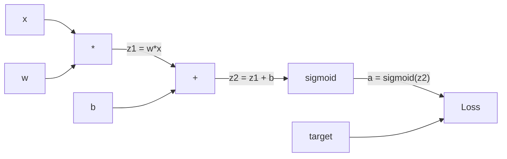
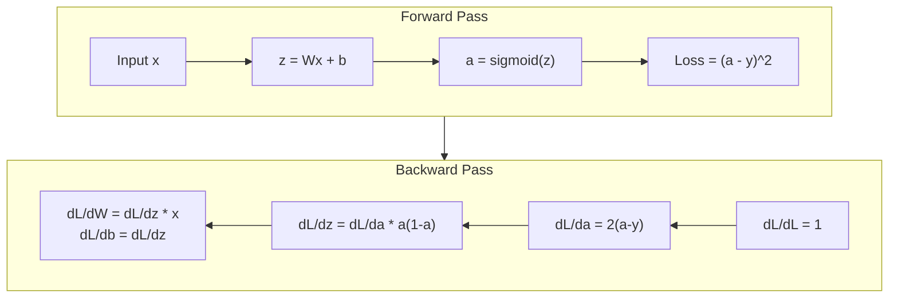
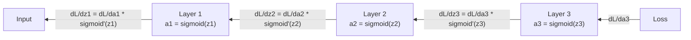

# Backpropagation from Scratch

> 反向传播是使学习成为可能的算法。如果没有它，神经网络只是昂贵的随机数生成器。

** 类型：** 构建
** 语言：** Python
** 先决条件：** 第03.02课（多层网络）
** 时间：** ~120分钟

## Learning Objectives

- 实现基于值的自动分级引擎，该引擎构建计算图并通过拓扑排序计算梯度
- 使用连锁法则推导加法、乘和Sigmoid的向后传递
- 仅使用从头开始的反向传播引擎就异或和圆分类训练多层网络
- 识别深度Sigmoid网络中消失的梯度问题并解释为什么梯度呈指数级缩小

## The Problem

您的网络有一个隐藏层，包含768个输入和3072个输出。即2，359，296个重量。它做出了错误的预测。哪些权重导致了错误？单独测试每个重量意味着230万次向前传球。反向传播只需一次反向即可计算所有230万个梯度。这不是优化。这就是可训练和不可能训练的区别。

天真的方法：拿起一个重物，轻轻推动它，再次向前传球，测量损失是上升还是下降。这将为您提供该重量的梯度。现在针对网络中的每个权重进行此操作。乘以数千个训练步骤和数百万个数据点。你需要地质时间来训练任何有用的东西。

反向传播解决了这个问题。一次向前通过，一次向后通过，计算所有梯度。诀窍是微积分中的连锁规则，系统地应用于计算图。这是使深度学习变得实用的算法。如果没有它，我们仍然会被玩具问题所困扰。

## The Concept

### The Chain Rule, Applied to Networks

您在第01阶段第05课中看到了连锁规则。快速回顾：如果y = f（g（x）），那么dy/Dx = f '（g（x））* g '（x）。你沿着链条乘以衍生品。

在神经网络中，“链”是从输入到损失的操作序列。每个层都应用权重、添加偏差、通过激活。损失函数将最终输出与目标进行比较。反向传播向后跟踪此链，计算每个操作如何导致错误。

### Computational Graphs

每次向前传递都会创建一个图表。每个节点都是一个操作（乘、加、西格玛）。每条边向前携带一个值，向后携带一个梯度。



向前传递：值从左向右流动。x和w产生z1 = w*x。添加b以获得z2。Sigmoid给出激活a。使用损失函数将a与目标y进行比较。

向后通过：梯度从右向左流动。从dL/da开始（损失如何随激活而变化）。乘以da/dz 2（S形导数）。这就是dL/dz 2。拆分为dL/分贝（等于dL/dz 2，因为z2 = z1 + b）和dL/dz 1。那么dL/dw = dL/dz 1 * x和dL/Dx = dL/dz 1 * w。

图中的每个节点在向后传递期间都有一项任务：获取来自上面的梯度，乘以其局部求导，然后向下传递。

### Forward vs Backward



正向传递存储每个中间值：z、a、每个层的输入。向后传递需要这些存储的值来计算梯度。这是backprop核心的内存计算权衡。您用内存（存储激活）换取速度（一次通过而不是数百万次）。

### Gradient Flow Through a Network

对于3层网络，梯度链贯穿每一层：



在每一层，梯度都会乘以S形求导。Sigmoid求导是a *（1 - a），最大值为0.25（当a = 0.5时）。三层深时，梯度最多乘以0.25#3 = 0.0156。十层深：0.25#10 = 0.00001。

### Vanishing Gradients

这就是消失的梯度问题。Sigmoid将其输出压缩在0和1之间。其求导始终小于0.25。堆叠足够多的Sigmoid层和渐变会缩小到零。早期的层几乎无法学习，因为它们收到的梯度接近零。

```
sigmoid(z):     Output range [0, 1]
sigmoid'(z):    Max value 0.25 (at z = 0)

After 5 layers:   gradient * 0.25^5 = 0.001x original
After 10 layers:  gradient * 0.25^10 = 0.000001x original
```

这就是为什么深度Sigmoid网络几乎不可能训练。修复方法-- ReLU及其变体--是第04课的主题。目前，请理解反推效果完美。问题在于它正在经历什么。

### Deriving Gradients for a 2-Layer Network

具有输入x、具有Sigmoid的隐藏层、具有Sigmoid的输出层和SSE损失的网络的具体数学。

向前传球：
```
z1 = W1 * x + b1
a1 = sigmoid(z1)
z2 = W2 * a1 + b2
a2 = sigmoid(z2)
L = (a2 - y)^2
```

向后传递（逐步应用连锁规则）：
```
dL/da2 = 2(a2 - y)
da2/dz2 = a2 * (1 - a2)
dL/dz2 = dL/da2 * da2/dz2 = 2(a2 - y) * a2 * (1 - a2)

dL/dW2 = dL/dz2 * a1
dL/db2 = dL/dz2

dL/da1 = dL/dz2 * W2
da1/dz1 = a1 * (1 - a1)
dL/dz1 = dL/da1 * da1/dz1

dL/dW1 = dL/dz1 * x
dL/db1 = dL/dz1
```

每个梯度都是从损失追溯到的局部衍生品的产物。这就是反向传播的全部。

## Build It

### Step 1: The Value Node

我们计算中的每个数字都成为一个值。它存储其数据、梯度以及创建方式（因此它知道如何向后计算梯度）。

```python
class Value:
    def __init__(self, data, children=(), op=''):
        self.data = data
        self.grad = 0.0
        self._backward = lambda: None
        self._children = set(children)
        self._op = op

    def __repr__(self):
        return f"Value(data={self.data:.4f}, grad={self.grad:.4f})"
```

还没有梯度（0.0）。还没有向后功能（无操作）。'_children '跟踪哪个Values产生了这个值，以便我们稍后可以对图形进行布局排序。

### Step 2: Operations with Backward Functions

每个操作都会创建一个新的值，并定义梯度如何通过它向后流动。

```python
def __add__(self, other):
    other = other if isinstance(other, Value) else Value(other)
    out = Value(self.data + other.data, (self, other), '+')

    def _backward():
        self.grad += out.grad
        other.grad += out.grad

    out._backward = _backward
    return out

def __mul__(self, other):
    other = other if isinstance(other, Value) else Value(other)
    out = Value(self.data * other.data, (self, other), '*')

    def _backward():
        self.grad += other.data * out.grad
        other.grad += self.data * out.grad

    out._backward = _backward
    return out
```

对于加法：d（a+b）/da = 1，d（a+b）/db = 1。因此，两个输入都直接获得输出的梯度。

对于相乘：d（a*b）/da = b，d（a*b）/db = a。每个输入都获得另一个输入的值乘以输出梯度。

“+=”很关键。值可能用于多个操作。它的梯度是所有路径的梯度之和。

### Step 3: Sigmoid and Loss

```python
import math

def sigmoid(self):
    x = self.data
    x = max(-500, min(500, x))
    s = 1.0 / (1.0 + math.exp(-x))
    out = Value(s, (self,), 'sigmoid')

    def _backward():
        self.grad += (s * (1 - s)) * out.grad

    out._backward = _backward
    return out
```

Sigmoid衍生物：sigmoid（x）*（1 - sigmoid（x））。我们在向前传递期间计算了sigmoid（x）= s。重复使用它。没有额外的工作。

```python
def mse_loss(predicted, target):
    diff = predicted + Value(-target)
    return diff * diff
```

单个输出的SSE：（预测-目标）#2。我们将减法表示为具有负值的加法。

### Step 4: Backward Pass

topical排序确保我们以正确的顺序处理节点--在我们传播通过它之前，节点的梯度已完全累积。

```python
def backward(self):
    topo = []
    visited = set()

    def build_topo(v):
        if v not in visited:
            visited.add(v)
            for child in v._children:
                build_topo(child)
            topo.append(v)

    build_topo(self)
    self.grad = 1.0
    for v in reversed(topo):
        v._backward()
```

从损失开始（梯度= 1.0，因为dL/dL = 1）。向后浏览排序的图表。每个节点的'_backward '将梯度推给其子节点。

### Step 5: Layer and Network

```python
import random

class Neuron:
    def __init__(self, n_inputs):
        scale = (2.0 / n_inputs) ** 0.5
        self.weights = [Value(random.uniform(-scale, scale)) for _ in range(n_inputs)]
        self.bias = Value(0.0)

    def __call__(self, x):
        act = sum((wi * xi for wi, xi in zip(self.weights, x)), self.bias)
        return act.sigmoid()

    def parameters(self):
        return self.weights + [self.bias]


class Layer:
    def __init__(self, n_inputs, n_outputs):
        self.neurons = [Neuron(n_inputs) for _ in range(n_outputs)]

    def __call__(self, x):
        out = [n(x) for n in self.neurons]
        return out[0] if len(out) == 1 else out

    def parameters(self):
        params = []
        for n in self.neurons:
            params.extend(n.parameters())
        return params


class Network:
    def __init__(self, sizes):
        self.layers = []
        for i in range(len(sizes) - 1):
            self.layers.append(Layer(sizes[i], sizes[i + 1]))

    def __call__(self, x):
        for layer in self.layers:
            x = layer(x)
            if not isinstance(x, list):
                x = [x]
        return x[0] if len(x) == 1 else x

    def parameters(self):
        params = []
        for layer in self.layers:
            params.extend(layer.parameters())
        return params

    def zero_grad(self):
        for p in self.parameters():
            p.grad = 0.0
```

神经元接受输入，计算加权和+偏差，并应用Sigmoid。权重初始化按squtt（2/n_inuts）缩放，以防止更深层次的网络中的Sigmoid饱和。层是神经元列表。网络是层列表。“parties（）”方法收集所有可学习的值，以便我们可以更新它们。

### Step 6: Train on XOR

```python
random.seed(42)
net = Network([2, 4, 1])

xor_data = [
    ([0.0, 0.0], 0.0),
    ([0.0, 1.0], 1.0),
    ([1.0, 0.0], 1.0),
    ([1.0, 1.0], 0.0),
]

learning_rate = 1.0

for epoch in range(1000):
    total_loss = Value(0.0)
    for inputs, target in xor_data:
        x = [Value(i) for i in inputs]
        pred = net(x)
        loss = mse_loss(pred, target)
        total_loss = total_loss + loss

    net.zero_grad()
    total_loss.backward()

    for p in net.parameters():
        p.data -= learning_rate * p.grad

    if epoch % 100 == 0:
        print(f"Epoch {epoch:4d} | Loss: {total_loss.data:.6f}")

print("\nXOR Results:")
for inputs, target in xor_data:
    x = [Value(i) for i in inputs]
    pred = net(x)
    print(f"  {inputs} -> {pred.data:.4f} (expected {target})")
```

看着损失减少。从随机预测到正确的异或输出，完全由反向传播计算梯度和推动权重向正确的方向驱动。

### Step 7: Circle Classification

在第02课中，您手动调整了圆分类的权重。现在让网络学习它们。

```python
random.seed(7)

def generate_circle_data(n=100):
    data = []
    for _ in range(n):
        x1 = random.uniform(-1.5, 1.5)
        x2 = random.uniform(-1.5, 1.5)
        label = 1.0 if x1 * x1 + x2 * x2 < 1.0 else 0.0
        data.append(([x1, x2], label))
    return data

circle_data = generate_circle_data(80)

circle_net = Network([2, 8, 1])
learning_rate = 0.5

for epoch in range(2000):
    random.shuffle(circle_data)
    total_loss_val = 0.0
    for inputs, target in circle_data:
        x = [Value(i) for i in inputs]
        pred = circle_net(x)
        loss = mse_loss(pred, target)
        circle_net.zero_grad()
        loss.backward()
        for p in circle_net.parameters():
            p.data -= learning_rate * p.grad
        total_loss_val += loss.data

    if epoch % 200 == 0:
        correct = 0
        for inputs, target in circle_data:
            x = [Value(i) for i in inputs]
            pred = circle_net(x)
            predicted_class = 1.0 if pred.data > 0.5 else 0.0
            if predicted_class == target:
                correct += 1
        accuracy = correct / len(circle_data) * 100
        print(f"Epoch {epoch:4d} | Loss: {total_loss_val:.4f} | Accuracy: {accuracy:.1f}%")
```

我们在这里使用在线新元--在每个样本后更新权重，而不是累积整个批次。这更快地打破了对称性，并避免了完全损失景观上的S形饱和。每个纪元对数据进行洗牌会防止网络记住顺序。

无需手动调音。网络自行发现循环决策边界。这就是反向传播的力量：您定义架构、损失函数和数据。算法计算权重。

## Use It

PyTorch用几行代码完成了上述所有工作。核心想法是相同的-- autograd在向前传递期间构建计算图，并向后跟踪它以计算梯度。

```python
import torch
import torch.nn as nn

model = nn.Sequential(
    nn.Linear(2, 4),
    nn.Sigmoid(),
    nn.Linear(4, 1),
    nn.Sigmoid(),
)
optimizer = torch.optim.SGD(model.parameters(), lr=1.0)
criterion = nn.MSELoss()

X = torch.tensor([[0,0],[0,1],[1,0],[1,1]], dtype=torch.float32)
y = torch.tensor([[0],[1],[1],[0]], dtype=torch.float32)

for epoch in range(1000):
    pred = model(X)
    loss = criterion(pred, y)
    optimizer.zero_grad()
    loss.backward()
    optimizer.step()

print("PyTorch XOR Results:")
with torch.no_grad():
    for i in range(4):
        pred = model(X[i])
        print(f"  {X[i].tolist()} -> {pred.item():.4f} (expected {y[i].item()})")
```

' loss.backward（）'是您的' tot; tall_loss.backward（）'。' optimizer.Step（）'是您的手册' p.data -= lr * p.grad '。' optimizer.zero_grad（）'是您的' net.zero_grad（）'。相同的算法，工业强度实施。PyTorch处理图形处理图形处理加速、混合精度、渐变检查点和数百种层类型。但向后传递是应用于同一计算图的相同连锁规则。

训练先向前传球，然后向后传球，然后更新重量。推理只运行向前传球。没有渐变，没有更新。这种区别很重要，因为推理就是生产中发生的事情。当您调用Claude或GPT等API时，您正在运行推理--您的提示向前流经网络，而令牌从另一端流出。重量没有变化。了解反推力很重要，因为它塑造了网络中的每一个重量。

## Ship It

本课产生：
- ' outputes/prompt-gradient-debugger.md '--用于诊断任何神经网络中的梯度问题（消失、爆炸、NaN）的可重复使用的提示

## Exercises

1. 向Value类添加一个“__sub_”方法（a - b = a +（-1 * b））。然后实现'_neg__'方法。通过与（a-b）' 2等简单公式的手动计算进行比较，验证梯度是否正确。

2. 将“relu”方法添加到Value（输出max（0，x），如果x > 0，则派生为1，否则为0）。在隐藏层中将sigmoid替换为relu，并再次进行异或训练。比较收敛速度。您应该看到更快的训练--这预览了第04课。

3. 在Value上实现一个“__pow_'方法以获取integer power。使用它将“mse_loss”替换为适当的“（预测-目标）** 2”表达。验证梯度与原始实现相匹配。

4. 将渐变剪辑添加到训练循环中：调用“backward（）”后，将所有渐变剪辑到[-1，1]。训练更深层次的网络（带Sigmoid的4层以上）并比较有和不有剪裁的损失曲线。这是您对爆炸梯度的第一次防御。

5. 构建可视化：在异或上训练后，打印网络中每个参数的梯度。识别哪个层的梯度最小。这演示了您在概念部分读到的消失梯度问题。

## Key Terms

| Term | 别人怎么说 | 它实际上意味着什么 |
|------|----------------|----------------------|
| 反向传播 | “网络学习” | 通过在计算图中向后应用连锁规则来计算每个权重的dL/DW的算法 |
| 计算图 | “网络结构” | 有向非循环图，其中节点是操作，边携带值（向前）和梯度（向后） |
| 链式法则 | “乘以衍生品” | 如果y = f（g（x）），那么dy/Dx = f '（g（x））* g '（x）--反向传播的数学基础 |
| 梯度 | “最陡上升的方向” | 损失对参数的偏导-告诉您如何更改该参数以减少损失 |
| 消失梯度 | “深度网络不会学习” | 当它们通过具有Sigmoid等饱和激活的层传播时，它们会呈指数级缩小 |
| 向前传球 | “跑网” | 通过顺序应用每个层的操作并存储中间值来计算输入的输出 |
| 向后传递 | “计算梯度” | 反向穿越计算图，使用链规则在每个节点累积梯度 |
| 学习率 | “它学习的速度有多快” | 更新权重时控制步长的标量：w_new = w_old - lr * gradient |
| 拓扑排序 | “正确的顺序” | 图节点的排序，每个节点出现在其所依赖的所有节点之后--确保在传播之前完全累积梯度 |
| Autograd | “自动微分” | 一个在正向计算期间构建计算图并自动计算梯度的系统--PyTorch的引擎所做的就是这样 |

## Further Reading

- Rumelhart、Hinton和Williams，“通过反向传播错误学习表示”（1986）--这篇论文使反向传播成为主流并解锁了多层网络训练
- 3Blue 1Brown，“神经网络”系列（https：www.youtube.com/playlist? list= PLZHQObOWTQDNU6R1_67000 Dx_ZCJB-3 pi）--反向传播和网络梯度流的最佳视觉解释
