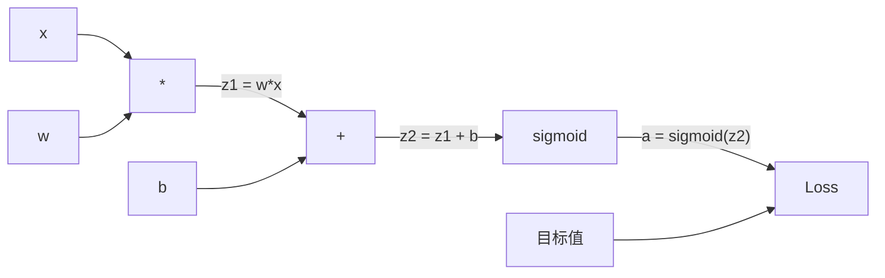
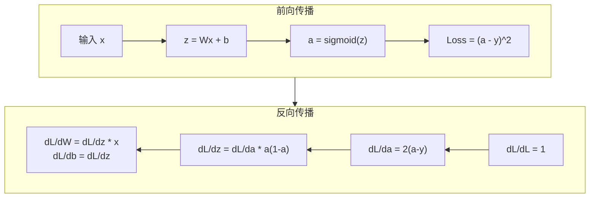
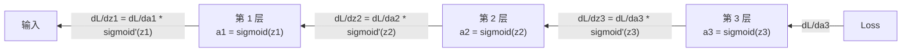

# 从零实现反向传播（Backpropagation from Scratch）

> 译注：本文译自同目录 [`en.md`](./en.md)。术语遵循仓根 [TRANSLATION_GUIDE.md](../../../../TRANSLATION_GUIDE.md)。

> backpropagation（反向传播）是让「学习」成为可能的算法。没有它，神经网络只是昂贵的随机数生成器。

**Type:** Build
**Languages:** Python
**Prerequisites:** Lesson 03.02（Multi-Layer Networks，多层网络）
**Time:** ~120 minutes

## 学习目标（Learning Objectives）

- 实现一个基于 Value 节点的 autograd 引擎，构建计算图（computational graph）并通过拓扑排序计算 gradient
- 用链式法则推导加法、乘法和 sigmoid 的反向传播
- 仅用你从零写的反向传播引擎，在 XOR 和「圆形分类」任务上训练一个多层网络
- 识别深层 sigmoid 网络中的 vanishing gradient（梯度消失）问题，并解释为什么 gradient 会指数级缩小

## 问题（The Problem）

你的网络有一个隐藏层，768 个输入、3072 个输出。这就是 2,359,296 个权重。它给出了一个错误预测——是哪些权重导致了错误？挨个测试每个权重意味着 230 万次前向传播。而 backpropagation 在一次反向传播中就能算出全部 230 万个 gradient。这不是「优化」，这是「能训练」与「不可能训练」的差别。

朴素做法：取一个权重，轻微扰动一点，重跑前向传播，看 loss 是涨了还是跌了。这样就能得到这个权重的 gradient。然后对网络里每个权重都这么做。再乘上几千次训练步骤、几百万个数据点。你需要地质纪元那么久才能训练出任何有用的东西。

backpropagation 解决了这件事。一次前向、一次反向，所有 gradient 全部算完。诀窍是把微积分里的链式法则系统化地用在计算图上。这就是让深度学习走出玩具问题的算法。没有它，我们至今仍困在玩具问题里。

## 概念（The Concept）

### 链式法则在网络中的应用（The Chain Rule, Applied to Networks）

你在 Phase 01、Lesson 05 里见过链式法则。简短回顾：若 y = f(g(x))，则 dy/dx = f'(g(x)) * g'(x)。沿着「链」把导数相乘。

在神经网络里，「链」就是从输入到 loss 的一连串运算。每一层做权重乘法、加 bias、过激活函数。loss 函数把最终输出和目标做比较。backpropagation 沿这条链反向追溯，算出每一步运算对最终误差贡献了多少。

### 计算图（Computational Graphs）

每一次前向传播都会构建一张图。每个节点是一个运算（乘、加、sigmoid）。每条边在前向时承载值，在反向时承载 gradient。



前向传播：值从左流向右。x 与 w 相乘得到 z1 = w*x。加上 b 得到 z2。过 sigmoid 得到激活 a。用 loss 函数把 a 和目标 y 比较。

反向传播：gradient 从右流向左。从 dL/da（loss 对激活的变化率）开始。乘上 da/dz2（sigmoid 的导数），得到 dL/dz2。然后拆成 dL/db（等于 dL/dz2，因为 z2 = z1 + b）和 dL/dz1。再得 dL/dw = dL/dz1 * x，dL/dx = dL/dz1 * w。

图里每个节点在反向时只干一件事：拿到上游传下来的 gradient，乘上自己的局部导数，再传给下游。

### 前向 vs 反向（Forward vs Backward）



前向传播会把每个中间值都存下来：z、a、每一层的输入。反向传播需要这些缓存值来算 gradient。这就是 backprop 的核心权衡——内存换速度：你用「保存激活值」的内存代价，换来「一次反向跑完」而不是「跑几百万次」的速度。

### gradient 在网络中的流动（Gradient Flow Through a Network）

对一个 3 层网络，gradient 会沿着每一层链式相乘：



每经过一层，gradient 都要乘上一次 sigmoid 的导数。sigmoid 的导数是 a * (1 - a)，最大值为 0.25（在 a = 0.5 时取到）。三层下来，gradient 最多被乘了 0.25^3 = 0.0156。十层下来：0.25^10 = 0.000001。

### 梯度消失（Vanishing Gradients）

这就是 vanishing gradient（梯度消失）问题。sigmoid 把输出压在 0 和 1 之间，它的导数永远小于 0.25。叠几层 sigmoid，gradient 就会缩到几乎为零。早期层几乎学不到东西，因为它们收到的 gradient 接近零。

```
sigmoid(z):     Output range [0, 1]
sigmoid'(z):    Max value 0.25 (at z = 0)

After 5 layers:   gradient * 0.25^5 = 0.001x original
After 10 layers:  gradient * 0.25^10 = 0.000001x original
```

这就是为什么深层 sigmoid 网络几乎训不起来。修复方案——ReLU 及其变种——是 Lesson 04 的主题。眼下你只需要明白：backprop 本身工作得完美无瑕，问题出在它「贯穿」的那些层身上。

### 为 2 层网络推导 gradient（Deriving Gradients for a 2-Layer Network）

给一个具体的网络写出数学：输入 x，一个带 sigmoid 的隐藏层，一个带 sigmoid 的输出层，MSE loss。

前向传播：
```
z1 = W1 * x + b1
a1 = sigmoid(z1)
z2 = W2 * a1 + b2
a2 = sigmoid(z2)
L = (a2 - y)^2
```

反向传播（一步步用链式法则）：
```
dL/da2 = 2(a2 - y)
da2/dz2 = a2 * (1 - a2)
dL/dz2 = dL/da2 * da2/dz2 = 2(a2 - y) * a2 * (1 - a2)

dL/dW2 = dL/dz2 * a1
dL/db2 = dL/dz2

dL/da1 = dL/dz2 * W2
da1/dz1 = a1 * (1 - a1)
dL/dz1 = dL/da1 * da1/dz1

dL/dW1 = dL/dz1 * x
dL/db1 = dL/dz1
```

每个 gradient 都是从 loss 一路追溯回来的「局部导数乘积」。backpropagation 的全部内容就是这些。

## 动手实现（Build It）

### 第 1 步：Value 节点（The Value Node）

把计算里的每个数都包成一个 Value。它保存自身的数值、自身的 gradient，以及它是怎么被算出来的（这样它就知道反向时怎么算 gradient）。

```python
class Value:
    def __init__(self, data, children=(), op=''):
        self.data = data
        self.grad = 0.0
        self._backward = lambda: None
        self._children = set(children)
        self._op = op

    def __repr__(self):
        return f"Value(data={self.data:.4f}, grad={self.grad:.4f})"
```

还没有 gradient（0.0）。还没有反向函数（no-op）。`_children` 记录是哪些 Value 生成了它，方便我们后面对图做拓扑排序。

### 第 2 步：带反向函数的运算（Operations with Backward Functions）

每个运算都生成一个新的 Value，并定义 gradient 反向时怎么流过它。

```python
def __add__(self, other):
    other = other if isinstance(other, Value) else Value(other)
    out = Value(self.data + other.data, (self, other), '+')

    def _backward():
        self.grad += out.grad
        other.grad += out.grad

    out._backward = _backward
    return out

def __mul__(self, other):
    other = other if isinstance(other, Value) else Value(other)
    out = Value(self.data * other.data, (self, other), '*')

    def _backward():
        self.grad += other.data * out.grad
        other.grad += self.data * out.grad

    out._backward = _backward
    return out
```

加法：d(a+b)/da = 1，d(a+b)/db = 1。所以两个输入都直接拿到输出的 gradient。

乘法：d(a*b)/da = b，d(a*b)/db = a。每个输入拿到的是「另一边的值乘上输出 gradient」。

`+=` 至关重要。一个 Value 可能被多个运算用到，它的 gradient 是所有路径上 gradient 的总和。

### 第 3 步：sigmoid 与 loss（Sigmoid and Loss）

```python
import math

def sigmoid(self):
    x = self.data
    x = max(-500, min(500, x))
    s = 1.0 / (1.0 + math.exp(-x))
    out = Value(s, (self,), 'sigmoid')

    def _backward():
        self.grad += (s * (1 - s)) * out.grad

    out._backward = _backward
    return out
```

sigmoid 的导数：sigmoid(x) * (1 - sigmoid(x))。前向时已经算过 sigmoid(x) = s，直接复用，不重复计算。

```python
def mse_loss(predicted, target):
    diff = predicted + Value(-target)
    return diff * diff
```

单输出的 MSE：(predicted - target)^2。我们把减法表达成「加上一个负值的 Value」。

### 第 4 步：反向传播（Backward Pass）

拓扑排序保证我们按正确顺序处理节点——一个节点的 gradient 完全累加好以后，才往下游传播。

```python
def backward(self):
    topo = []
    visited = set()

    def build_topo(v):
        if v not in visited:
            visited.add(v)
            for child in v._children:
                build_topo(child)
            topo.append(v)

    build_topo(self)
    self.grad = 1.0
    for v in reversed(topo):
        v._backward()
```

从 loss 开始（gradient = 1.0，因为 dL/dL = 1）。沿着排好的图反着走。每个节点的 `_backward` 把 gradient 推给它的子节点。

### 第 5 步：层与网络（Layer and Network）

```python
import random

class Neuron:
    def __init__(self, n_inputs):
        scale = (2.0 / n_inputs) ** 0.5
        self.weights = [Value(random.uniform(-scale, scale)) for _ in range(n_inputs)]
        self.bias = Value(0.0)

    def __call__(self, x):
        act = sum((wi * xi for wi, xi in zip(self.weights, x)), self.bias)
        return act.sigmoid()

    def parameters(self):
        return self.weights + [self.bias]


class Layer:
    def __init__(self, n_inputs, n_outputs):
        self.neurons = [Neuron(n_inputs) for _ in range(n_outputs)]

    def __call__(self, x):
        out = [n(x) for n in self.neurons]
        return out[0] if len(out) == 1 else out

    def parameters(self):
        params = []
        for n in self.neurons:
            params.extend(n.parameters())
        return params


class Network:
    def __init__(self, sizes):
        self.layers = []
        for i in range(len(sizes) - 1):
            self.layers.append(Layer(sizes[i], sizes[i + 1]))

    def __call__(self, x):
        for layer in self.layers:
            x = layer(x)
            if not isinstance(x, list):
                x = [x]
        return x[0] if len(x) == 1 else x

    def parameters(self):
        params = []
        for layer in self.layers:
            params.extend(layer.parameters())
        return params

    def zero_grad(self):
        for p in self.parameters():
            p.grad = 0.0
```

一个 Neuron（神经元）拿一组输入，算「加权和 + bias」，再过 sigmoid。权重初始化按 sqrt(2/n_inputs) 缩放，避免深层网络里 sigmoid 饱和。一个 Layer 是若干 Neuron 的列表。一个 Network 是若干 Layer 的列表。`parameters()` 收集所有可学习的 Value，方便我们更新它们。

### 第 6 步：在 XOR 上训练（Train on XOR）

```python
random.seed(42)
net = Network([2, 4, 1])

xor_data = [
    ([0.0, 0.0], 0.0),
    ([0.0, 1.0], 1.0),
    ([1.0, 0.0], 1.0),
    ([1.0, 1.0], 0.0),
]

learning_rate = 1.0

for epoch in range(1000):
    total_loss = Value(0.0)
    for inputs, target in xor_data:
        x = [Value(i) for i in inputs]
        pred = net(x)
        loss = mse_loss(pred, target)
        total_loss = total_loss + loss

    net.zero_grad()
    total_loss.backward()

    for p in net.parameters():
        p.data -= learning_rate * p.grad

    if epoch % 100 == 0:
        print(f"Epoch {epoch:4d} | Loss: {total_loss.data:.6f}")

print("\nXOR Results:")
for inputs, target in xor_data:
    x = [Value(i) for i in inputs]
    pred = net(x)
    print(f"  {inputs} -> {pred.data:.4f} (expected {target})")
```

看 loss 一路下降。从随机预测到正确的 XOR 输出，全部由 backpropagation 算 gradient、把权重往正确方向轻推驱动。

### 第 7 步：圆形分类（Circle Classification）

在 Lesson 02 里，你手调过权重做圆形分类。现在让网络自己学。

```python
random.seed(7)

def generate_circle_data(n=100):
    data = []
    for _ in range(n):
        x1 = random.uniform(-1.5, 1.5)
        x2 = random.uniform(-1.5, 1.5)
        label = 1.0 if x1 * x1 + x2 * x2 < 1.0 else 0.0
        data.append(([x1, x2], label))
    return data

circle_data = generate_circle_data(80)

circle_net = Network([2, 8, 1])
learning_rate = 0.5

for epoch in range(2000):
    random.shuffle(circle_data)
    total_loss_val = 0.0
    for inputs, target in circle_data:
        x = [Value(i) for i in inputs]
        pred = circle_net(x)
        loss = mse_loss(pred, target)
        circle_net.zero_grad()
        loss.backward()
        for p in circle_net.parameters():
            p.data -= learning_rate * p.grad
        total_loss_val += loss.data

    if epoch % 200 == 0:
        correct = 0
        for inputs, target in circle_data:
            x = [Value(i) for i in inputs]
            pred = circle_net(x)
            predicted_class = 1.0 if pred.data > 0.5 else 0.0
            if predicted_class == target:
                correct += 1
        accuracy = correct / len(circle_data) * 100
        print(f"Epoch {epoch:4d} | Loss: {total_loss_val:.4f} | Accuracy: {accuracy:.1f}%")
```

这里用的是 online SGD——每过一个样本就更新一次权重，而不是把整个 batch 累加完再更新。这样能更快打破对称性，也避免 sigmoid 在整体 loss 曲面上饱和。每个 epoch 打乱数据，能防止网络死记顺序。

不需要手调。网络自己发现了那个圆形决策边界。这就是 backpropagation 的威力：你定义架构、loss 函数和数据，算法自己把权重算出来。

## 用起来（Use It）

PyTorch 用几行代码就做到上面所有事。核心思路完全一致——autograd 在前向时构建计算图，反向时沿图回溯算 gradient。

```python
import torch
import torch.nn as nn

model = nn.Sequential(
    nn.Linear(2, 4),
    nn.Sigmoid(),
    nn.Linear(4, 1),
    nn.Sigmoid(),
)
optimizer = torch.optim.SGD(model.parameters(), lr=1.0)
criterion = nn.MSELoss()

X = torch.tensor([[0,0],[0,1],[1,0],[1,1]], dtype=torch.float32)
y = torch.tensor([[0],[1],[1],[0]], dtype=torch.float32)

for epoch in range(1000):
    pred = model(X)
    loss = criterion(pred, y)
    optimizer.zero_grad()
    loss.backward()
    optimizer.step()

print("PyTorch XOR Results:")
with torch.no_grad():
    for i in range(4):
        pred = model(X[i])
        print(f"  {X[i].tolist()} -> {pred.item():.4f} (expected {y[i].item()})")
```

`loss.backward()` 等同于你的 `total_loss.backward()`。`optimizer.step()` 等同于你手写的 `p.data -= lr * p.grad`。`optimizer.zero_grad()` 等同于你的 `net.zero_grad()`。同一个算法，工业级实现。PyTorch 还会处理 GPU 加速、混合精度、gradient checkpointing 以及成百上千种层类型。但反向传播仍然是同一条链式法则，作用在同一张计算图上。

训练时跑前向、再跑反向、再更新权重。推理时只跑前向，不算 gradient、不更新权重。这个区分很重要，因为生产里跑的就是推理。当你调用 Claude 或 GPT 这样的 API，运行的就是推理——你的 prompt 在网络里前向流过，token 从另一头出来，权重一动不动。理解 backprop 之所以重要，是因为那张网络里的每个权重都是它塑造出来的。

## 上线部署（Ship It）

本课产出：
- `outputs/prompt-gradient-debugger.md`——一个可复用的 prompt，用来诊断任何神经网络中的 gradient 问题（vanishing、exploding、NaN）

## 练习（Exercises）

1. 给 Value 类加一个 `__sub__` 方法（a - b = a + (-1 * b)）。再实现一个 `__neg__` 方法。用一个简单表达式，比如 (a - b)^2，把 gradient 跟手算结果做对比，验证正确性。

2. 给 Value 加一个 `relu` 方法（输出 max(0, x)，导数在 x > 0 时为 1，否则为 0）。把隐藏层的 sigmoid 换成 relu，再训一次 XOR，对比收敛速度。你应该会看到训练更快——这是 Lesson 04 的预告。

3. 给 Value 实现一个支持整数次幂的 `__pow__` 方法。用它把 `mse_loss` 改写成更地道的 `(predicted - target) ** 2`。验证 gradient 与原实现一致。

4. 在训练循环里加上 gradient clipping（梯度裁剪）：调用 `backward()` 之后，把所有 gradient 裁剪到 [-1, 1]。训练一个更深的 sigmoid 网络（4 层以上），对比加裁剪与不加裁剪的 loss 曲线。这是你对抗 gradient 爆炸的第一道防线。

5. 做一个可视化：在 XOR 训完后，打印网络里每个参数的 gradient。找出哪一层 gradient 最小。这能直观演示你在「概念」一节里读到的 vanishing gradient 问题。

## 关键术语（Key Terms）

| 术语 | 大家嘴里说的 | 实际含义 |
|------|----------------|----------------------|
| Backpropagation（反向传播） | 「网络在学习」 | 一种通过在计算图上反向应用链式法则、为每个权重计算 dL/dw 的算法 |
| Computational graph（计算图） | 「网络结构」 | 一个有向无环图，节点是运算，边在前向时承载值、在反向时承载 gradient |
| Chain rule（链式法则） | 「把导数乘起来」 | 若 y = f(g(x))，则 dy/dx = f'(g(x)) * g'(x)——backpropagation 的数学基础 |
| Gradient | 「最陡上升方向」 | loss 对某个参数的偏导数——告诉你怎么调这个参数能让 loss 变小 |
| Vanishing gradient（梯度消失） | 「深层网络学不动」 | gradient 在经过 sigmoid 这类饱和激活的多层时，按指数缩小 |
| Forward pass（前向传播） | 「跑一遍网络」 | 从输入开始按层依次计算输出，并保存中间值 |
| Backward pass（反向传播） | 「算 gradient」 | 反向遍历计算图，按链式法则在每个节点累加 gradient |
| Learning rate（学习率） | 「学得多快」 | 更新权重时的步长标量：w_new = w_old - lr * gradient |
| Topological sort（拓扑排序） | 「按正确顺序」 | 一种图节点排序，每个节点都排在它依赖的节点之后——保证 gradient 在传播前已被完整累加 |
| Autograd | 「自动微分」 | 一套在前向计算时构建计算图、自动算 gradient 的系统——PyTorch 引擎做的就是这件事 |

## 延伸阅读（Further Reading）

- Rumelhart、Hinton & Williams，《Learning representations by back-propagating errors》(1986)——把 backpropagation 推向主流、解锁多层网络训练的论文
- 3Blue1Brown，《Neural Networks》系列（https://www.youtube.com/playlist?list=PLZHQObOWTQDNU6R1_67000Dx_ZCJB-3pi）——关于 backpropagation 与 gradient 在网络中流动的最佳可视化讲解
