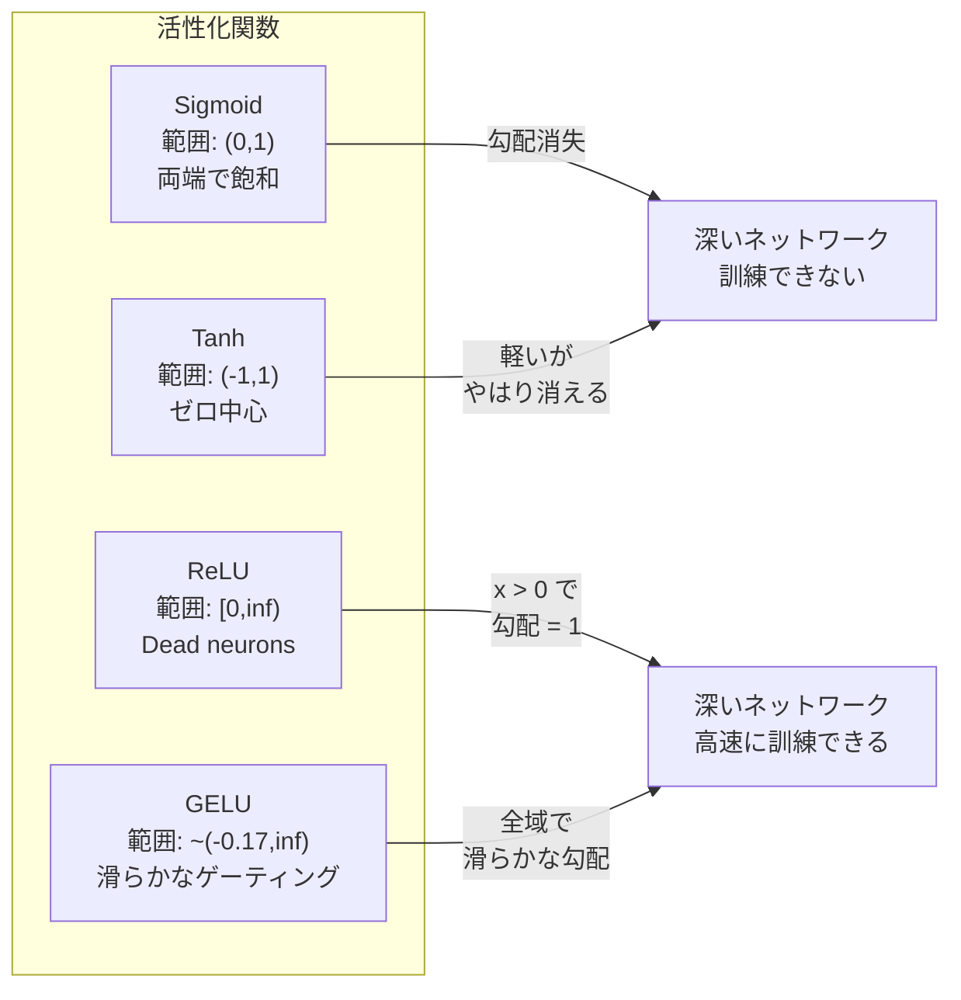
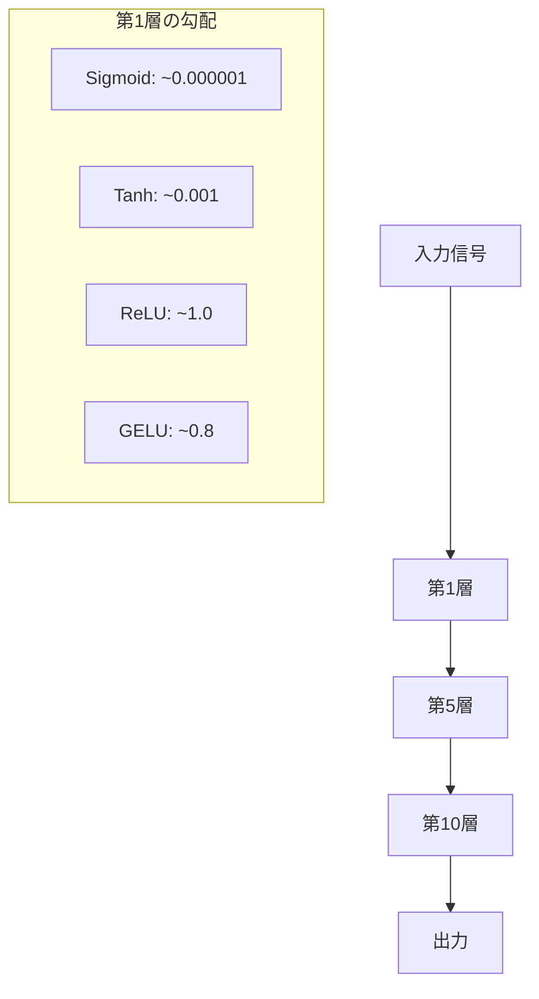
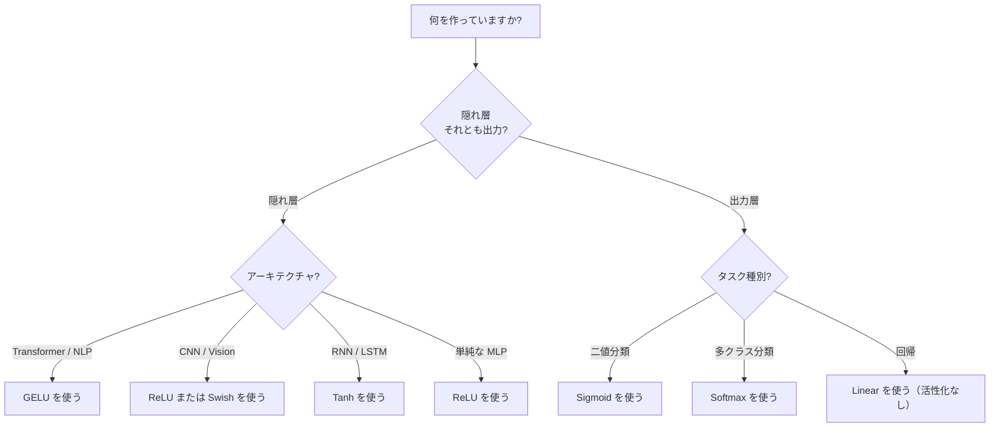

# 活性化関数

> 非線形性がなければ、100層のネットワークも凝った行列乗算にすぎません。活性化関数は、ニューラルネットワークが曲線で考えるためのゲートです。

**種類:** Build
**言語:** Python
**前提:** レッスン 03.03（Backpropagation）
**時間:** 約75分

## 学習目標

- sigmoid、tanh、ReLU、Leaky ReLU、GELU、Swish、softmax とそれぞれの導関数をゼロから実装する
- 異なる活性化関数で10層以上を通したときの活性値の大きさを測定し、勾配消失問題を診断する
- ReLU ネットワーク内の dead neuron を検出し、GELU がこの故障モードを避けられる理由を説明する
- 与えられたアーキテクチャ（transformer、CNN、RNN、出力層）に対して正しい活性化関数を選ぶ

## 問題

2つの線形変換を重ねてみます: y = W2(W1x + b1) + b2。展開すると、y = W2W1x + W2b1 + b2。これは単なる y = Ax + c、つまり1つの線形変換です。線形層を何層重ねても、結果は1回の行列乗算に潰れます。100層のネットワークでも、表現力は1層と同じです。

これは理論上の小ネタではありません。深い線形ネットワークは、文字どおり XOR を学習できず、渦巻き状のデータセットを分類できず、顔を認識できないという意味です。活性化関数がなければ、深さは錯覚です。

活性化関数は線形性を断ち切ります。各層の出力を非線形関数で歪ませることで、ネットワークは決定境界を曲げ、任意の関数を近似し、実際に学習できるようになります。ただし活性化関数の選択を誤ると、勾配がゼロへ消えたり（深いネットワークでの sigmoid）、無限大へ爆発したり（注意深い初期化を伴わない非有界な活性化）、ニューロンが永久に死んだりします（大きな負のバイアスを持つ ReLU）。活性化関数の選択は、ネットワークがそもそも学習できるかを直接決めます。

## 概念

### なぜ非線形性が必要なのか

行列乗算は合成できます。ベクトルに行列 A を掛け、次に行列 B を掛けることは、AB を掛けることと同じです。つまり線形層を10層積んでも、数学的には1つの大きな行列を持つ1つの線形層と等価です。大量のパラメータも深さも、すべて無駄になります。この連鎖を断ち切る何かが必要です。それが活性化関数です。

証明はこうです。線形層は f(x) = Wx + b を計算します。2層を重ねます。

```
Layer 1: h = W1 * x + b1
Layer 2: y = W2 * h + b2
```

代入します。

```
y = W2 * (W1 * x + b1) + b2
y = (W2 * W1) * x + (W2 * b1 + b2)
y = A * x + c
```

1層です。層の間に非線形な活性化 g() を挟みます。

```
h = g(W1 * x + b1)
y = W2 * h + b2
```

これで代入による簡約は壊れます。W2 * g(W1 * x + b1) + b2 は単一の線形変換には還元できません。ネットワークは非線形関数を表現できます。活性化を伴う層を追加するたびに表現能力が増します。

### Sigmoid

ニューラルネットワークで使われた元祖の活性化関数です。

```
sigmoid(x) = 1 / (1 + e^(-x))
```

出力範囲: (0, 1)。滑らかで微分可能で、任意の実数を確率のような値に写します。

導関数:

```
sigmoid'(x) = sigmoid(x) * (1 - sigmoid(x))
```

この導関数の最大値は x = 0 での 0.25 です。バックプロパゲーションでは、勾配は層を通るたびに掛け合わされます。sigmoid が10層あると、勾配は最大でも 0.25 を10回掛けられます。

```
0.25^10 = 0.000000953674
```

元の信号の100万分の1未満です。これが勾配消失問題です。初期層の勾配が非常に小さくなり、重みがほとんど更新されません。ネットワークは学習しているように見えます（後段の層では損失が下がる）が、最初の層は凍りついています。深い sigmoid ネットワークは、単純に訓練できません。

追加の問題として、sigmoid の出力は常に正（0から1）なので、重みに対する勾配の符号が常に同じ向きになりがちです。これにより勾配降下中にジグザグの動きが起きます。

### Tanh

sigmoid を中心化した版です。

```
tanh(x) = (e^x - e^(-x)) / (e^x + e^(-x))
```

出力範囲: (-1, 1)。ゼロ中心なので、ジグザグ問題を解消します。

導関数:

```
tanh'(x) = 1 - tanh(x)^2
```

最大の導関数は x = 0 で 1.0 です。sigmoid より4倍良い値です。ただし勾配消失問題はまだ存在します。大きな正または負の入力では、導関数はゼロに近づきます。10層あれば、sigmoid ほど激しくないにせよ、勾配はやはり押し潰されます。

### ReLU: ブレイクスルー

Rectified Linear Unit です。2010年に Nair と Hinton によって深層学習で広く使われるようになり（関数自体は Fukushima の1969年の研究まで遡ります）、状況を一変させました。

```
relu(x) = max(0, x)
```

出力範囲: [0, infinity)。導関数は非常に単純です。

```
relu'(x) = 1  if x > 0
            0  if x <= 0
```

正の入力では勾配が消えません。勾配はちょうど1で、そのまま通過します。深いネットワークが訓練可能になった理由はここにあります。ReLU は層をまたいで勾配の大きさを保ちます。

ただし故障モードがあります。dead neuron 問題です。あるニューロンの重み付き入力が常に負（大きな負のバイアスや不運な重み初期化が原因）だと、出力は常にゼロ、勾配も常にゼロになり、二度と更新されません。永久に死んだ状態です。実務では、ReLU ネットワークの10-40%のニューロンが訓練中に死ぬことがあります。

### Leaky ReLU

dead neuron への最も単純な対策です。

```
leaky_relu(x) = x        if x > 0
                alpha * x if x <= 0
```

alpha は小さな定数で、通常は 0.01 です。負側にゼロではなく小さな傾きを持たせるため、死んだニューロンにも勾配信号が届き、回復できる可能性があります。

### GELU: 現代のデフォルト

Gaussian Error Linear Unit です。Hendrycks と Gimpel が2016年に導入しました。BERT、GPT、そして現代の多くの transformer のデフォルト活性化関数です。

```
gelu(x) = x * Phi(x)
```

ここで Phi(x) は標準正規分布の累積分布関数です。実務で使われる近似は次のとおりです。

```
gelu(x) ~= 0.5 * x * (1 + tanh(sqrt(2/pi) * (x + 0.044715 * x^3)))
```

GELU は全域で滑らかで、（負値をゼロに強制的に切り落とす ReLU と異なり）小さな負の値を許し、確率的な解釈も持ちます。つまり、各入力がガウス分布の下で正であるらしさによって重み付けします。この滑らかなゲーティングは、より良い勾配の流れを与え、dead neuron 問題を完全に避けるため、transformer アーキテクチャでは ReLU を上回ります。

### Swish / SiLU

Ramachandran らが2017年に自動探索で発見した自己ゲート型の活性化関数です。

```
swish(x) = x * sigmoid(x)
```

Swish は形式的には x * sigmoid(x) です。Google は活性化関数の探索空間を自動探索してこれを見つけました。ニューラルネットワークが、ニューラルネットワークの部品を設計したわけです。

GELU と同様に、滑らかで、非単調で、小さな負の値を許します。違いは微妙です。Swish はゲーティングに sigmoid を使い、GELU はガウス CDF を使います。実務上の性能はほぼ同じです。Swish は EfficientNet や一部の vision モデルで使われます。言語モデルでは GELU が主流です。

### Softmax: 出力の活性化

隠れ層では使いません。Softmax は、生のスコア（logits）のベクトルを確率分布に変換します。

```
softmax(x_i) = e^(x_i) / sum(e^(x_j) for all j)
```

各出力は0から1の間になります。全出力の合計は1です。そのため、多クラス分類の標準的な最終活性化関数です。最大の logit が最も高い確率になりますが、argmax と異なり softmax は微分可能で、相対的な確信度の情報を保持します。

### 形状の比較



### 勾配の流れの比較



### どの活性化関数をいつ使うか



## 作ってみる

### Step 1: 導関数付きで全活性化関数を実装する

各関数は単一の float を受け取り、float を返します。各導関数も同じ入力を受け取り、勾配を返します。

```python
import math

def sigmoid(x):
    x = max(-500, min(500, x))
    return 1.0 / (1.0 + math.exp(-x))

def sigmoid_derivative(x):
    s = sigmoid(x)
    return s * (1 - s)

def tanh_act(x):
    return math.tanh(x)

def tanh_derivative(x):
    t = math.tanh(x)
    return 1 - t * t

def relu(x):
    return max(0.0, x)

def relu_derivative(x):
    return 1.0 if x > 0 else 0.0

def leaky_relu(x, alpha=0.01):
    return x if x > 0 else alpha * x

def leaky_relu_derivative(x, alpha=0.01):
    return 1.0 if x > 0 else alpha

def gelu(x):
    return 0.5 * x * (1 + math.tanh(math.sqrt(2 / math.pi) * (x + 0.044715 * x ** 3)))

def gelu_derivative(x):
    phi = 0.5 * (1 + math.erf(x / math.sqrt(2)))
    pdf = math.exp(-0.5 * x * x) / math.sqrt(2 * math.pi)
    return phi + x * pdf

def swish(x):
    return x * sigmoid(x)

def swish_derivative(x):
    s = sigmoid(x)
    return s + x * s * (1 - s)

def softmax(xs):
    max_x = max(xs)
    exps = [math.exp(x - max_x) for x in xs]
    total = sum(exps)
    return [e / total for e in exps]
```

### Step 2: 勾配がどこで死ぬかを可視化する

-5 から 5 までの等間隔な100点で勾配を計算します。各活性化関数の勾配がゼロに近い領域を、テキストのヒストグラムで表示します。

```python
def gradient_scan(name, derivative_fn, start=-5, end=5, n=100):
    step = (end - start) / n
    near_zero = 0
    healthy = 0
    for i in range(n):
        x = start + i * step
        g = derivative_fn(x)
        if abs(g) < 0.01:
            near_zero += 1
        else:
            healthy += 1
    pct_dead = near_zero / n * 100
    print(f"{name:15s}: {healthy:3d} healthy, {near_zero:3d} near-zero ({pct_dead:.0f}% dead zone)")

gradient_scan("Sigmoid", sigmoid_derivative)
gradient_scan("Tanh", tanh_derivative)
gradient_scan("ReLU", relu_derivative)
gradient_scan("Leaky ReLU", leaky_relu_derivative)
gradient_scan("GELU", gelu_derivative)
gradient_scan("Swish", swish_derivative)
```

### Step 3: 勾配消失の実験

sigmoid と ReLU を使って、信号を N 層の順伝播に通します。活性値の大きさがどう変化するかを測定します。

```python
import random

def vanishing_gradient_experiment(activation_fn, name, n_layers=10, n_inputs=5):
    random.seed(42)
    values = [random.gauss(0, 1) for _ in range(n_inputs)]

    print(f"\n{name} through {n_layers} layers:")
    for layer in range(n_layers):
        weights = [random.gauss(0, 1) for _ in range(n_inputs)]
        z = sum(w * v for w, v in zip(weights, values))
        activated = activation_fn(z)
        magnitude = abs(activated)
        bar = "#" * int(magnitude * 20)
        print(f"  Layer {layer+1:2d}: magnitude = {magnitude:.6f} {bar}")
        values = [activated] * n_inputs

vanishing_gradient_experiment(sigmoid, "Sigmoid")
vanishing_gradient_experiment(relu, "ReLU")
vanishing_gradient_experiment(gelu, "GELU")
```

### Step 4: Dead Neuron 検出器

ReLU ネットワークを作り、ランダム入力を通して、一度も発火しないニューロンの数を数えます。

```python
def dead_neuron_detector(n_inputs=5, hidden_size=20, n_samples=1000):
    random.seed(0)
    weights = [[random.gauss(0, 1) for _ in range(n_inputs)] for _ in range(hidden_size)]
    biases = [random.gauss(0, 1) for _ in range(hidden_size)]

    fire_counts = [0] * hidden_size

    for _ in range(n_samples):
        inputs = [random.gauss(0, 1) for _ in range(n_inputs)]
        for neuron_idx in range(hidden_size):
            z = sum(w * x for w, x in zip(weights[neuron_idx], inputs)) + biases[neuron_idx]
            if relu(z) > 0:
                fire_counts[neuron_idx] += 1

    dead = sum(1 for c in fire_counts if c == 0)
    rarely_fire = sum(1 for c in fire_counts if 0 < c < n_samples * 0.05)
    healthy = hidden_size - dead - rarely_fire

    print(f"\nDead Neuron Report ({hidden_size} neurons, {n_samples} samples):")
    print(f"  Dead (never fired):     {dead}")
    print(f"  Barely alive (<5%):     {rarely_fire}")
    print(f"  Healthy:                {healthy}")
    print(f"  Dead neuron rate:       {dead/hidden_size*100:.1f}%")

    for i, c in enumerate(fire_counts):
        status = "DEAD" if c == 0 else "WEAK" if c < n_samples * 0.05 else "OK"
        bar = "#" * (c * 40 // n_samples)
        print(f"  Neuron {i:2d}: {c:4d}/{n_samples} fires [{status:4s}] {bar}")

dead_neuron_detector()
```

### Step 5: 訓練比較 -- Sigmoid vs ReLU vs GELU

円データセット（円の内側の点 = class 1、外側 = class 0）で同じ2層ネットワークを3種類の活性化関数で訓練します。収束速度を比較します。

```python
def make_circle_data(n=200, seed=42):
    random.seed(seed)
    data = []
    for _ in range(n):
        x = random.uniform(-2, 2)
        y = random.uniform(-2, 2)
        label = 1.0 if x * x + y * y < 1.5 else 0.0
        data.append(([x, y], label))
    return data


class ActivationNetwork:
    def __init__(self, activation_fn, activation_deriv, hidden_size=8, lr=0.1):
        random.seed(0)
        self.act = activation_fn
        self.act_d = activation_deriv
        self.lr = lr
        self.hidden_size = hidden_size

        self.w1 = [[random.gauss(0, 0.5) for _ in range(2)] for _ in range(hidden_size)]
        self.b1 = [0.0] * hidden_size
        self.w2 = [random.gauss(0, 0.5) for _ in range(hidden_size)]
        self.b2 = 0.0

    def forward(self, x):
        self.x = x
        self.z1 = []
        self.h = []
        for i in range(self.hidden_size):
            z = self.w1[i][0] * x[0] + self.w1[i][1] * x[1] + self.b1[i]
            self.z1.append(z)
            self.h.append(self.act(z))

        self.z2 = sum(self.w2[i] * self.h[i] for i in range(self.hidden_size)) + self.b2
        self.out = sigmoid(self.z2)
        return self.out

    def backward(self, target):
        error = self.out - target
        d_out = error * self.out * (1 - self.out)

        for i in range(self.hidden_size):
            d_h = d_out * self.w2[i] * self.act_d(self.z1[i])
            self.w2[i] -= self.lr * d_out * self.h[i]
            for j in range(2):
                self.w1[i][j] -= self.lr * d_h * self.x[j]
            self.b1[i] -= self.lr * d_h
        self.b2 -= self.lr * d_out

    def train(self, data, epochs=200):
        losses = []
        for epoch in range(epochs):
            total_loss = 0
            correct = 0
            for x, y in data:
                pred = self.forward(x)
                self.backward(y)
                total_loss += (pred - y) ** 2
                if (pred >= 0.5) == (y >= 0.5):
                    correct += 1
            avg_loss = total_loss / len(data)
            accuracy = correct / len(data) * 100
            losses.append(avg_loss)
            if epoch % 50 == 0 or epoch == epochs - 1:
                print(f"    Epoch {epoch:3d}: loss={avg_loss:.4f}, accuracy={accuracy:.1f}%")
        return losses


data = make_circle_data()

configs = [
    ("Sigmoid", sigmoid, sigmoid_derivative),
    ("ReLU", relu, relu_derivative),
    ("GELU", gelu, gelu_derivative),
]

results = {}
for name, act_fn, act_d_fn in configs:
    print(f"\n=== Training with {name} ===")
    net = ActivationNetwork(act_fn, act_d_fn, hidden_size=8, lr=0.1)
    losses = net.train(data, epochs=200)
    results[name] = losses

print("\n=== Final Loss Comparison ===")
for name, losses in results.items():
    print(f"  {name:10s}: start={losses[0]:.4f} -> end={losses[-1]:.4f} (improvement: {(1 - losses[-1]/losses[0])*100:.1f}%)")
```

## 使ってみる

PyTorch は、これらすべてを functional 形式と module 形式の両方で提供しています。

```python
import torch
import torch.nn as nn
import torch.nn.functional as F

x = torch.randn(4, 10)

relu_out = F.relu(x)
gelu_out = F.gelu(x)
sigmoid_out = torch.sigmoid(x)
swish_out = F.silu(x)

logits = torch.randn(4, 5)
probs = F.softmax(logits, dim=1)

model = nn.Sequential(
    nn.Linear(10, 64),
    nn.GELU(),
    nn.Linear(64, 32),
    nn.GELU(),
    nn.Linear(32, 5),
)
```

transformer の隠れ層なら GELU。CNN の隠れ層なら ReLU。分類の出力層なら softmax。回帰の出力層ならなし（linear）。確率の出力層なら sigmoid。以上です。まずはこれらのデフォルトから始めます。証拠がある場合にだけ変更してください。

RNN や LSTM は隠れ状態に tanh、ゲートに sigmoid を使いますが、今日ゼロから作るなら、おそらく RNN は使っていないでしょう。ReLU ネットワークでニューロンが死んでいるなら、GELU に切り替えます。特別な理由がない限り Leaky ReLU に飛びつかないでください。GELU は dead neuron 問題を解決し、より良い勾配の流れを与えます。

## 成果物

このレッスンで作るもの:
- `outputs/prompt-activation-selector.md` -- 任意のアーキテクチャに適した活性化関数を選ぶための再利用可能なプロンプト

## 演習

1. 負側の傾き alpha を学習可能なパラメータにした Parametric ReLU（PReLU）を実装してください。円データセットで訓練し、固定の Leaky ReLU と比較してください。

2. 勾配消失の実験を10層ではなく50層で実行してください。sigmoid、tanh、ReLU、GELU について各層の大きさをプロットしてください。各活性化関数の信号は、どの層で実質的にゼロになりますか?

3. ELU（Exponential Linear Unit）を実装してください: elu(x) = x if x > 0, alpha * (e^x - 1) if x <= 0。同じネットワークで、dead neuron の割合を ReLU と比較してください。

4. 訓練中に動作する「勾配ヘルスモニター」を作ってください。各 epoch で各層の平均勾配の大きさを計算します。いずれかの層の勾配が 0.001 未満、または 100 を超えたら警告を出してください。

5. 訓練比較を、円ではなくレッスン01の XOR データセットで行うように変更してください。XOR で最も速く収束する活性化関数はどれですか? なぜ円の結果と異なるのでしょうか?

## 重要用語

| 用語 | よく言われること | 実際の意味 |
|------|----------------|------------|
| Activation function | 「非線形の部分」 | 各ニューロンの出力に適用される関数。線形性を破り、ネットワークが非線形写像を学習できるようにする |
| Vanishing gradient | 「深いネットワークで勾配が消える」 | 活性化関数の導関数が1未満のとき、勾配が層を通るたび指数的に小さくなり、初期層が訓練不能になること |
| Exploding gradient | 「勾配が爆発する」 | 有効な倍率が1を超えると、勾配が層を通るたび指数的に大きくなり、訓練が不安定になること |
| Dead neuron | 「学習を止めたニューロン」 | 入力が恒久的に負で、出力と勾配がゼロになる ReLU ニューロン |
| Sigmoid | 「値を0-1に潰す」 | ロジスティック関数 1/(1+e^-x)。歴史的に重要だが、深いネットワークでは勾配消失を引き起こす |
| ReLU | 「負値をゼロに切る」 | max(0, x)。勾配の大きさを保つことで深層学習を実用化した活性化関数 |
| GELU | 「transformer の活性化関数」 | Gaussian Error Linear Unit。入力が正である確率によって入力を重み付けする滑らかな活性化関数 |
| Swish/SiLU | 「自己ゲート型 ReLU」 | x * sigmoid(x)。自動探索で発見され、EfficientNet で使われる |
| Softmax | 「スコアを確率に変える」 | logits のベクトルを、すべての値が (0,1) にあり合計が1になる確率分布へ正規化する |
| Leaky ReLU | 「死なない ReLU」 | alpha が小さい値（0.01）である max(alpha*x, x)。小さな負の勾配を許して dead neuron を防ぐ |
| Saturation | 「sigmoid の平らな部分」 | 活性化関数の導関数がゼロに近づき、勾配の流れを妨げる領域 |
| Logit | 「softmax 前の生スコア」 | softmax や sigmoid を適用する前の最終層の未正規化出力 |

## 参考資料

- Nair & Hinton, "Rectified Linear Units Improve Restricted Boltzmann Machines" (2010) -- ReLU を導入し、深いネットワークの訓練を可能にした論文
- Hendrycks & Gimpel, "Gaussian Error Linear Units (GELUs)" (2016) -- transformer のデフォルトになった活性化関数を導入した論文
- Ramachandran et al., "Searching for Activation Functions" (2017) -- 自動探索を使って Swish を発見し、活性化関数の設計を自動化できることを示した論文
- Glorot & Bengio, "Understanding the difficulty of training deep feedforward neural networks" (2010) -- 勾配消失/爆発を診断し、Xavier 初期化を提案した論文
- Goodfellow, Bengio, Courville, "Deep Learning" Chapter 6.3 (https://www.deeplearningbook.org/) -- 隠れユニットと活性化関数の厳密な解説
