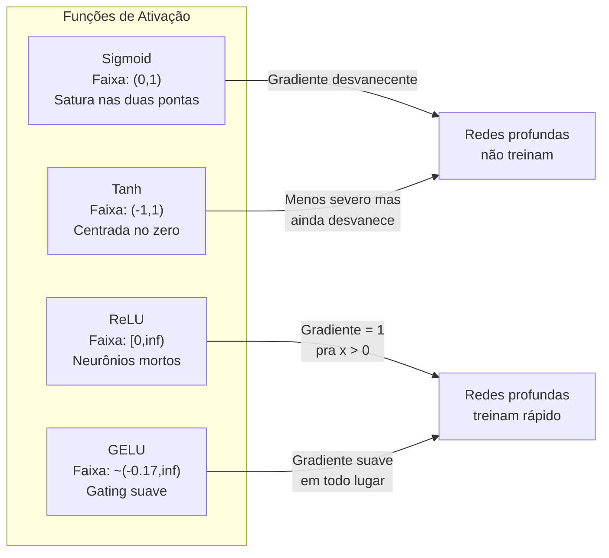
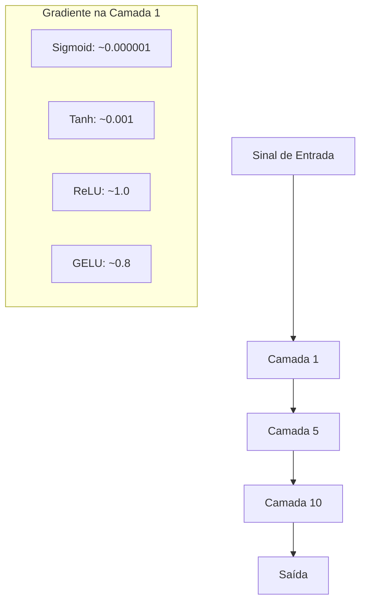
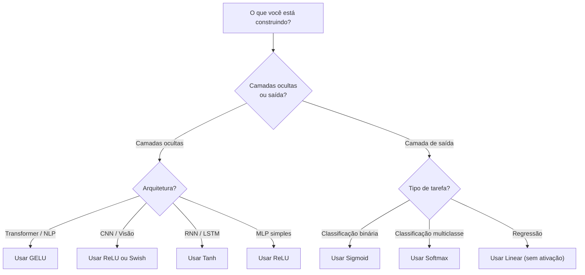

# Funções de Ativação

> Sem não linearidade, sua rede de 100 camadas é uma multiplicação de matriz chique. Ativações são os portões que deixam redes neurais pensar em curvas.

**Tipo:** Construção
**Linguagens:** Python
**Pré-requisitos:** Aula 03.03 (Retropropagação)
**Tempo:** ~75 minutos

## Objetivos de Aprendizado

- Implementar sigmoid, tanh, ReLU, Leaky ReLU, GELU, Swish e softmax com suas derivadas do zero
- Diagnosticar o problema do gradiente desvanecimento medindo magnitudes de ativação por 10+ camadas com diferentes ativações
- Detectar neurônios mortos numa rede ReLU e explicar por que GELU evita esse modo de falha
- Selecionar a função de ativação correta pra uma dada arquitetura (transformer, CNN, RNN, camada de saída)

## O Problema

Empilhe duas transformações lineares: y = W2(W1x + b1) + b2. Expanda: y = W2W1x + W2b1 + b2. Isso é só y = Ax + c — uma transformação linear única. Não importa quantas camadas lineares você empilhe, o resultado colapsa numa multiplicação de matriz. Sua rede de 100 camadas tem o mesmo poder representacional que uma camada só.

Isso não é curiosidade teórica. Significa que uma rede linear profunda literalmente não consegue aprender XOR, não consegue classificar um dataset espiral, não consegue reconhecer um rosto. Sem funções de ativação, profundidade é uma ilusão.

Funções de ativação quebram a linearidade. Elas deformam a saída de cada camada através de uma função não linear, dando à rede a capacidade de curvar limites de decisão, aproximar funções arbitrárias e realmente aprender. Mas escolha a ativação errada e seus gradientes desvanecem pra zero (sigmoid em redes profundas), explodem pra infinito (ativações sem limite sem inicialização cuidadosa), ou seus neurônios morrem permanentemente (ReLU com vieses negativos grandes). A escolha da função de ativação determina diretamente se sua rede aprende ou não.

## O Conceito

### Por que Não Linearidade é Necessária

Multiplicação de matriz é componível. Multiplicar um vetor pela matriz A depois pela B é idêntico a multiplicar por AB. Isso significa empilhar dez camadas lineares é matematicamente equivalente a uma camada linear com uma matriz grande. Todos esses parâmetros, toda essa profundidade — desperdiçados. Você precisa de algo pra quebrar a cadeia. É isso que funções de ativação fazem.

Aqui está a prova. Uma camada linear computa f(x) = Wx + b. Empilhe duas:

```
Camada 1: h = W1 * x + b1
Camada 2: y = W2 * h + b2
```

Substitua:

```
y = W2 * (W1 * x + b1) + b2
y = (W2 * W1) * x + (W2 * b1 + b2)
y = A * x + c
```

Uma camada. Insira uma ativação não linear g() entre as camadas:

```
h = g(W1 * x + b1)
y = W2 * h + b2
```

Agora a substituição quebra. W2 * g(W1 * x + b1) + b2 não pode ser reduzido a uma transformação linear única. A rede pode representar funções não lineares. Cada camada adicional com uma ativação adiciona capacidade representacional.

### Sigmoid

A função de ativação original pra redes neurais.

```
sigmoid(x) = 1 / (1 + e^(-x))
```

Faixa de saída: (0, 1). Suave, diferenciável, mapeia qualquer número real pra um valor tipo probabilidade.

A derivada:

```
sigmoid'(x) = sigmoid(x) * (1 - sigmoid(x))
```

O valor máximo dessa derivada é 0.25, ocorrendo em x = 0. Em retropropagação, gradientes se multiplicam pelas camadas. Dez camadas de sigmoid significa que o gradiente é multiplicado por no máximo 0.25 dez vezes:

```
0.25^10 = 0.000000953674
```

Menos de um milionésimo do sinal original. Esse é o problema do gradiente desvanecimento. Gradientees nas camadas iniciais ficam tão pequenos que os pesos mal se atualizam. A rede parece aprender — a perda diminui nas camadas finais — mas as primeiras camadas estão congeladas. Redes sigmoid profundas simplesmente não treinam.

Problema adicional: as saídas da sigmoid são sempre positivas (0 a 1), o que significa que gradientes nos pesos sempre têm o mesmo sinal. Isso causa ziguezague durante a descida do gradiente.

### Tanh

A versão centrada da sigmoid.

```
tanh(x) = (e^x - e^(-x)) / (e^x + e^(-x))
```

Faixa de saída: (-1, 1). Centrada no zero, o que elimina o problema do ziguezague.

A derivada:

```
tanh'(x) = 1 - tanh(x)^2
```

Derivada máxima é 1.0 em x = 0 — quatro vezes melhor que sigmoid. Mas o problema do gradiente desvanecimento ainda existe. Para entradas positivas ou negativas grandes, a derivada tende a zero. Dez camadas ainda destroem o gradiente, só menos agressivamente.

### ReLU: A Revolução

Rectified Linear Unit. Popularizada pro deep learning por Nair e Hinton em 2010 (a função em si vem do trabalho de Fukushima em 1969), mudou tudo.

```
relu(x) = max(0, x)
```

Faixa de saída: [0, infinito). A derivada é trivialmente simples:

```
relu'(x) = 1  if x > 0
            0  if x <= 0
```

Sem gradiente desvanecente pra entradas positivas. O gradiente é exatamente 1, passado direto. É por isso que redes profundas ficaram treináveis — ReLU preserva a magnitude do gradiente entre camadas.

Mas existe um modo de falha: o problema do neurônio morto. Se o peso de entrada de um neurônio é sempre negativo (devido a um viés negativo grande ou inicialização de pesos infeliz), sua saída é sempre zero, seu gradiente é sempre zero e ele nunca se atualiza. Ele está permanentemente morto. Na prática, 10-40% dos neurônios numa rede ReLU podem morrer durante o treino.

### Leaky ReLU

A correção mais simples pra neurônios mortos.

```
leaky_relu(x) = x        if x > 0
                alpha * x if x <= 0
```

Onde alpha é uma constante pequena, tipicamente 0.01. O lado negativo tem uma inclinação pequena em vez de zero, então neurônios mortos ainda recebem um sinal de gradiente e podem se recuperar.

### GELU: O Padrão Moderno

Gaussian Error Linear Unit. Introduzida por Hendrycks e Gimpel em 2016. Ativação padrão em BERT, GPT e na maioria dos transformers modernos.

```
gelu(x) = x * Phi(x)
```

Onde Phi(x) é a função de distribuição acumulada da distribuição normal padrão. A aproximação usada na prática:

```
gelu(x) ~= 0.5 * x * (1 + tanh(sqrt(2/pi) * (x + 0.044715 * x^3)))
```

GELU é suave em todo lugar, permite valores negativos pequenos (ao contrário da ReLU que corta duro pra zero), e tem uma interpretação probabilística: ela pondera cada entrada pela sua chance de ser positiva sob uma distribuição Gaussiana. Esse gating suave supera ReLU em arquiteturas transformer porque fornece melhor fluxo de gradiente e evita completamente o problema do neurônio morto.

### Swish / SiLU

Ativação auto-gateada descoberta por Ramachandran et al. em 2017 através de busca automatizada.

```
swish(x) = x * sigmoid(x)
```

Swish é formalmente x * sigmoid(x). Google descobriu através de busca automatizada no espaço de funções de ativação — uma rede neural projetando partes de redes neurais.

Como GELU, é suave, não monótona e permite valores negativos pequenos. A diferença é sutil: Swish usa sigmoid pra gating enquanto GELU usa a CDF Gaussiana. Na prática, a performance é praticamente idêntica. Swish é usada em EfficientNet e alguns modelos de visão. GELU domina em modelos de linguagem.

### Softmax: A Ativação de Saída

Não usada em camadas ocultas. Softmax converte um vetor de pontuações brutas (logits) numa distribuição de probabilidades.

```
softmax(x_i) = e^(x_i) / sum(e^(x_j) for all j)
```

Toda saída fica entre 0 e 1. Todas somam 1. Isso faz dela a ativação final padrão pra classificação multiclasse. O logit maior recebe a maior probabilidade, mas ao contrário de argmax, softmax é diferenciável e preserva informações sobre confiança relativa.

### Comparação de Formatos



### Comparação de Fluxo de Gradiente



### Qual Ativação Quando



## Construa

### Passo 1: Implementar Todas as Funções de Ativação com Derivadas

Cada função pega um float e retorna um float. Cada função derivada pega a mesma entrada e retorna o gradiente.

```python
import math

def sigmoid(x):
    x = max(-500, min(500, x))
    return 1.0 / (1.0 + math.exp(-x))

def sigmoid_derivative(x):
    s = sigmoid(x)
    return s * (1 - s)

def tanh_act(x):
    return math.tanh(x)

def tanh_derivative(x):
    t = math.tanh(x)
    return 1 - t * t

def relu(x):
    return max(0.0, x)

def relu_derivative(x):
    return 1.0 if x > 0 else 0.0

def leaky_relu(x, alpha=0.01):
    return x if x > 0 else alpha * x

def leaky_relu_derivative(x, alpha=0.01):
    return 1.0 if x > 0 else alpha

def gelu(x):
    return 0.5 * x * (1 + math.tanh(math.sqrt(2 / math.pi) * (x + 0.044715 * x ** 3)))

def gelu_derivative(x):
    phi = 0.5 * (1 + math.erf(x / math.sqrt(2)))
    pdf = math.exp(-0.5 * x * x) / math.sqrt(2 * math.pi)
    return phi + x * pdf

def swish(x):
    return x * sigmoid(x)

def swish_derivative(x):
    s = sigmoid(x)
    return s + x * s * (1 - s)

def softmax(xs):
    max_x = max(xs)
    exps = [math.exp(x - max_x) for x in xs]
    total = sum(exps)
    return [e / total for e in exps]
```

### Passo 2: Visualizar Onde os Gradientees Morrem

Compute o gradiente em 100 pontos uniformemente espaçados de -5 a 5. Imprima um histograma de texto mostrando onde cada gradiente de ativação é próximo de zero.

```python
def gradient_scan(name, derivative_fn, start=-5, end=5, n=100):
    step = (end - start) / n
    near_zero = 0
    healthy = 0
    for i in range(n):
        x = start + i * step
        g = derivative_fn(x)
        if abs(g) < 0.01:
            near_zero += 1
        else:
            healthy += 1
    pct_dead = near_zero / n * 100
    print(f"{name:15s}: {healthy:3d} healthy, {near_zero:3d} near-zero ({pct_dead:.0f}% dead zone)")

gradient_scan("Sigmoid", sigmoid_derivative)
gradient_scan("Tanh", tanh_derivative)
gradient_scan("ReLU", relu_derivative)
gradient_scan("Leaky ReLU", leaky_relu_derivative)
gradient_scan("GELU", gelu_derivative)
gradient_scan("Swish", swish_derivative)
```

### Passo 3: Experimento de Gradiente Desvanecente

Passe um sinal por N camadas usando sigmoid vs ReLU. Meça como a magnitude da ativação muda.

```python
import random

def vanishing_gradient_experiment(activation_fn, name, n_layers=10, n_inputs=5):
    random.seed(42)
    values = [random.gauss(0, 1) for _ in range(n_inputs)]

    print(f"\n{name} through {n_layers} layers:")
    for layer in range(n_layers):
        weights = [random.gauss(0, 1) for _ in range(n_inputs)]
        z = sum(w * v for w, v in zip(weights, values))
        activated = activation_fn(z)
        magnitude = abs(activated)
        bar = "#" * int(magnitude * 20)
        print(f"  Layer {layer+1:2d}: magnitude = {magnitude:.6f} {bar}")
        values = [activated] * n_inputs

vanishing_gradient_experiment(sigmoid, "Sigmoid")
vanishing_gradient_experiment(relu, "ReLU")
vanishing_gradient_experiment(gelu, "GELU")
```

### Passo 4: Detector de Neurônios Mortos

Crie uma rede ReLU, passe entradas aleatórias por ela, conte quantos neurônios nunca disparam.

```python
def dead_neuron_detector(n_inputs=5, hidden_size=20, n_samples=1000):
    random.seed(0)
    weights = [[random.gauss(0, 1) for _ in range(n_inputs)] for _ in range(hidden_size)]
    biases = [random.gauss(0, 1) for _ in range(hidden_size)]

    fire_counts = [0] * hidden_size

    for _ in range(n_samples):
        inputs = [random.gauss(0, 1) for _ in range(n_inputs)]
        for neuron_idx in range(hidden_size):
            z = sum(w * x for w, x in zip(weights[neuron_idx], inputs)) + biases[neuron_idx]
            if relu(z) > 0:
                fire_counts[neuron_idx] += 1

    dead = sum(1 for c in fire_counts if c == 0)
    rarely_fire = sum(1 for c in fire_counts if 0 < c < n_samples * 0.05)
    healthy = hidden_size - dead - rarely_fire

    print(f"\nDead Neuron Report ({hidden_size} neurons, {n_samples} samples):")
    print(f"  Dead (never fired):     {dead}")
    print(f"  Barely alive (<5%):     {rarely_fire}")
    print(f"  Healthy:                {healthy}")
    print(f"  Dead neuron rate:       {dead/hidden_size*100:.1f}%")

    for i, c in enumerate(fire_counts):
        status = "DEAD" if c == 0 else "WEAK" if c < n_samples * 0.05 else "OK"
        bar = "#" * (c * 40 // n_samples)
        print(f"  Neuron {i:2d}: {c:4d}/{n_samples} fires [{status:4s}] {bar}")

dead_neuron_detector()
```

### Passo 5: Comparação de Treino — Sigmoid vs ReLU vs GELU

Treine a mesma rede de duas camadas no dataset do círculo (pontos dentro do círculo = classe 1, fora = classe 0) com três ativações diferentes. Compare a velocidade de convergência.

```python
def make_circle_data(n=200, seed=42):
    random.seed(seed)
    data = []
    for _ in range(n):
        x = random.uniform(-2, 2)
        y = random.uniform(-2, 2)
        label = 1.0 if x * x + y * y < 1.5 else 0.0
        data.append(([x, y], label))
    return data


class ActivationNetwork:
    def __init__(self, activation_fn, activation_deriv, hidden_size=8, lr=0.1):
        random.seed(0)
        self.act = activation_fn
        self.act_d = activation_deriv
        self.lr = lr
        self.hidden_size = hidden_size

        self.w1 = [[random.gauss(0, 0.5) for _ in range(2)] for _ in range(hidden_size)]
        self.b1 = [0.0] * hidden_size
        self.w2 = [random.gauss(0, 0.5) for _ in range(hidden_size)]
        self.b2 = 0.0

    def forward(self, x):
        self.x = x
        self.z1 = []
        self.h = []
        for i in range(self.hidden_size):
            z = self.w1[i][0] * x[0] + self.w1[i][1] * x[1] + self.b1[i]
            self.z1.append(z)
            self.h.append(self.act(z))

        self.z2 = sum(self.w2[i] * self.h[i] for i in range(self.hidden_size)) + self.b2
        self.out = sigmoid(self.z2)
        return self.out

    def backward(self, target):
        error = self.out - target
        d_out = error * self.out * (1 - self.out)

        for i in range(self.hidden_size):
            d_h = d_out * self.w2[i] * self.act_d(self.z1[i])
            self.w2[i] -= self.lr * d_out * self.h[i]
            for j in range(2):
                self.w1[i][j] -= self.lr * d_h * self.x[j]
            self.b1[i] -= self.lr * d_h
        self.b2 -= self.lr * d_out

    def train(self, data, epochs=200):
        losses = []
        for epoch in range(epochs):
            total_loss = 0
            correct = 0
            for x, y in data:
                pred = self.forward(x)
                self.backward(y)
                total_loss += (pred - y) ** 2
                if (pred >= 0.5) == (y >= 0.5):
                    correct += 1
            avg_loss = total_loss / len(data)
            accuracy = correct / len(data) * 100
            losses.append(avg_loss)
            if epoch % 50 == 0 or epoch == epochs - 1:
                print(f"    Epoch {epoch:3d}: loss={avg_loss:.4f}, accuracy={accuracy:.1f}%")
        return losses


data = make_circle_data()

configs = [
    ("Sigmoid", sigmoid, sigmoid_derivative),
    ("ReLU", relu, relu_derivative),
    ("GELU", gelu, gelu_derivative),
]

results = {}
for name, act_fn, act_d_fn in configs:
    print(f"\n=== Training with {name} ===")
    net = ActivationNetwork(act_fn, act_d_fn, hidden_size=8, lr=0.1)
    losses = net.train(data, epochs=200)
    results[name] = losses

print("\n=== Final Loss Comparison ===")
for name, losses in results.items():
    print(f"  {name:10s}: start={losses[0]:.4f} -> end={losses[-1]:.4f} (improvement: {(1 - losses[-1]/losses[0])*100:.1f}%)")
```

## Use

PyTorch fornece todas essas como formas funcionais e de módulo:

```python
import torch
import torch.nn as nn
import torch.nn.functional as F

x = torch.randn(4, 10)

relu_out = F.relu(x)
gelu_out = F.gelu(x)
sigmoid_out = torch.sigmoid(x)
swish_out = F.silu(x)

logits = torch.randn(4, 5)
probs = F.softmax(logits, dim=1)

model = nn.Sequential(
    nn.Linear(10, 64),
    nn.GELU(),
    nn.Linear(64, 32),
    nn.GELU(),
    nn.Linear(32, 5),
)
```

Camadas ocultas em transformer: GELU. Camadas ocultas em CNN: ReLU. Camada de saída pra classificação: softmax. Camada de saída pra regressão: nenhuma (linear). Camada de saída pra probabilidades: sigmoid. É isso. Comece com esses padrões. Mude só quando tiver evidência.

RNNs e LSTMs usam tanh pro estado oculto e sigmoid pra gates, mas se você está construindo do zero hoje, provavelmente não está usando RNNs. Se neurônios estão morrendo na sua rede ReLU, troque pra GELU. Não chegue no Leaky ReLU sem uma razão eespecificaçãoífica — GELU resolve o problema do neurônio morto e dá melhor fluxo de gradiente.

## Entregue

Esta aula produz:
- `outputs/prompt-activation-selector.md` — um prompt reutilizável que ajuda a escolher a função de ativação certa pra qualquer arquitetura

## Exercícios

1. Implemente Parametric ReLU (PReLU) onde a inclinação negativa alpha é um parâmetro aprendível. Treine no dataset do círculo e compare com Leaky ReLU fixa.
