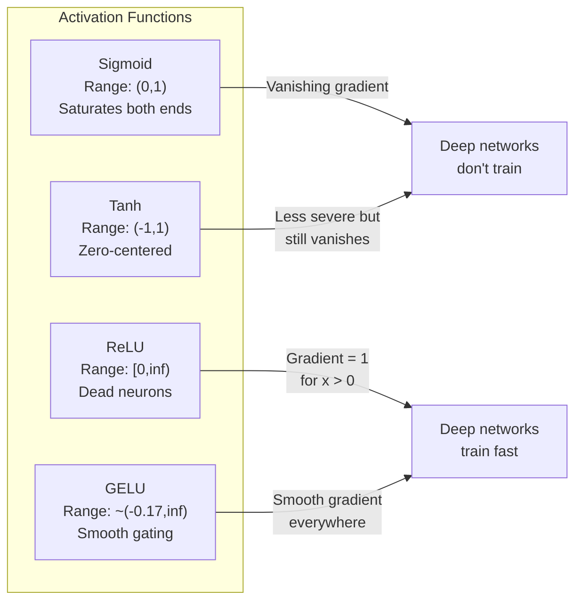
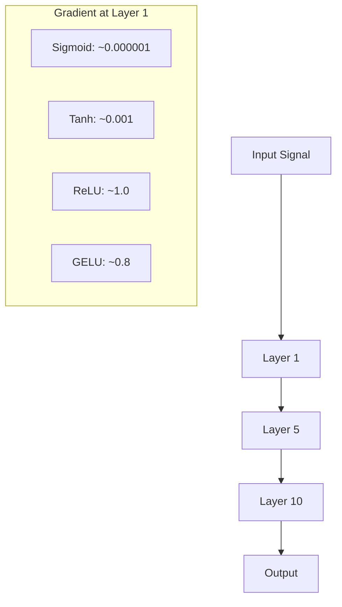
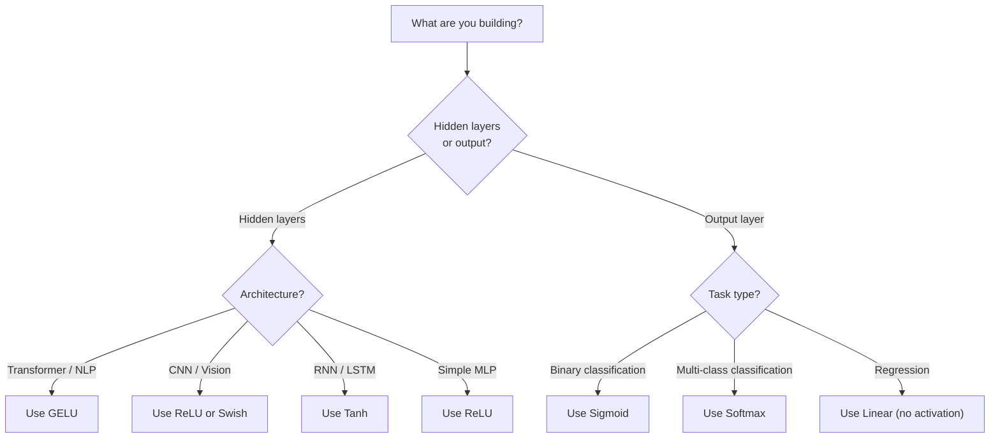

# Etkinleştirme İşlevleri

> Doğrusal olmama olmadan, 100 katmanlı ağınız süslü bir matris çarpımıdır. Aktivasyonlar, neural network'lerin eğriler halinde düşünmesini sağlayan kapılardır.

**Tür:** Yapım
**Diller:** Python
**Önkoşullar:** Ders 03.03 (Backpropagation)
**Süre:** ~75 dakika

## Öğrenme Hedefleri

- Sigmoid, tanh, ReLU, Leaky ReLU, GELU, Swish ve softmax'ı türevleriyle sıfırdan uygulayın
- Farklı aktivasyonlara sahip 10'dan fazla katman aracılığıyla aktivasyon büyüklüklerini ölçerek kaybolan gradient problemini teşhis edin
- Bir ReLU ağındaki ölü nöronları tespit edin ve GELU'nun neden bu arıza modundan kaçındığını açıklayın
- Belirli bir mimari için doğru aktivasyon fonksiyonunu seçin (transformer, CNN, RNN, çıkış katmanı)

## Sorun

İki doğrusal dönüşümü yığınlayın: y = W2(W1x + b1) + b2. Genişletin: y = W2W1x + W2b1 + b2. Bu sadece y = Ax + c -- tek bir doğrusal dönüşüm. Ne kadar doğrusal katmanı üst üste koyarsanız koyun, sonuç bir matris çarpımına düşer. 100 katmanlı ağınız tek katmanla aynı temsil gücüne sahiptir.

Bu teorik bir merak değil. Bu, derin bir doğrusal ağın kelimenin tam anlamıyla XOR'u öğrenemeyeceği, dataset spiralini sınıflandıramayacağı, bir yüzü tanıyamayacağı anlamına gelir. Aktivasyon fonksiyonları olmadan derinlik bir yanılsamadır.

Aktivasyon fonksiyonları doğrusallığı bozar. Her katmanın çıktısını doğrusal olmayan bir fonksiyon yoluyla çarpıtarak ağa karar sınırlarını bükme, keyfi fonksiyonlara yaklaşma ve gerçekten öğrenme yeteneği kazandırır. Ancak yanlış aktivasyonu seçerseniz gradient'leriniz sıfıra kaybolur (derin ağlarda sigmoid), sonsuza kadar patlar (dikkatli başlatma olmadan sınırsız aktivasyonlar) veya nöronlarınız kalıcı olarak ölür (büyük negatif önyargılarla ReLU). Etkinleştirme işlevinin seçimi, ağınızın öğrenip öğrenmeyeceğini doğrudan belirler.

## Konsept

### Doğrusal Olmama Neden Gereklidir

Matris çarpımı birleştirilebilir. Bir vektörü A matrisiyle, ardından B matrisiyle çarpmak AB ile çarpmakla aynıdır. Bu, on doğrusal katmanın istiflenmesinin matematiksel olarak büyük bir matrise sahip bir doğrusal katmana eşdeğer olduğu anlamına gelir. Bütün bu parametreler, bütün bu derinlik boşa gitti. Zinciri kıracak bir şeye ihtiyacın var. Aktivasyon fonksiyonlarının yaptığı budur.

İşte kanıtı. Doğrusal bir katman f(x) = Wx + b'yi hesaplar. İkinci yığın:

```
Layer 1: h = W1 * x + b1
Layer 2: y = W2 * h + b2
```

Yedek:

```
y = W2 * (W1 * x + b1) + b2
y = (W2 * W1) * x + (W2 * b1 + b2)
y = A * x + c
```

Bir katman. Katmanlar arasına doğrusal olmayan bir aktivasyon g() ekleyin:

```
h = g(W1 * x + b1)
y = W2 * h + b2
```

Artık oyuncu değişikliği bozuluyor. W2 * g(W1 * x + b1) + b2 tek bir doğrusal dönüşüme indirgenemez. Ağ doğrusal olmayan fonksiyonları temsil edebilir. Etkinleştirmeye sahip her ek katman, temsil kapasitesini artırır.

### Sigmoid

neural network'ler için orijinal etkinleştirme işlevi.

```
sigmoid(x) = 1 / (1 + e^(-x))
```

Çıkış aralığı: (0, 1). Düzgün, türevlenebilir, herhangi bir gerçek sayıyı olasılığa benzer bir değerle eşleştirir.

Türev:

```
sigmoid'(x) = sigmoid(x) * (1 - sigmoid(x))
```

Bu türevin maksimum değeri 0,25'tir ve x = 0'da meydana gelir. backpropagation'de gradient'ler katmanlar boyunca çoğalır. On sigmoid katmanı, gradient'nin en fazla 0,25 ile on kez çarpılacağı anlamına gelir:

```
0.25^10 = 0.000000953674
```

Orijinal sinyalin milyonda birinden azı. Bu, ortadan kaybolan gradient sorunudur. İlk katmanlardaki Gradient'ler o kadar küçülür ki ağırlıklar neredeyse hiç güncellenmez. Ağ öğreniyor gibi görünüyor - daha sonraki katmanlarda kayıp azalıyor - ancak ilk katmanlar donuyor. Derin sigmoid ağlar eğitilmez.

Ek sorun: sigmoid çıkışları her zaman pozitiftir (0'dan 1'e), bu da ağırlıklardaki gradient'lerin her zaman aynı işaretli olduğu anlamına gelir. Bu, gradient inişi sırasında zig-zagging'e neden olur.

### Tanh

Sigmoid'in ortalanmış versiyonu.

```
tanh(x) = (e^x - e^(-x)) / (e^x + e^(-x))
```

Çıkış aralığı: (-1, 1). Zig-zag problemini ortadan kaldıran sıfır merkezli.

Türev:

```
tanh'(x) = 1 - tanh(x)^2
```

Maksimum türev x = 0'da 1,0'dır -- sigmoid'den dört kat daha iyidir. Ancak ortadan kaybolan gradient sorunu hala mevcut. Büyük pozitif veya negatif girdiler için türev sıfıra yaklaşır. On katman hala gradient'yi daha az agresif bir şekilde eziyor.

### ReLU: Atılım

Düzeltilmiş Lineer Ünite. 2010 yılında Nair ve Hinton tarafından deep learning için popüler hale getirilen (fonksiyonun tarihi Fukushima'nın 1969 çalışmasına dayanmaktadır) her şeyi değiştirdi.

```
relu(x) = max(0, x)
```

Çıkış aralığı: [0, sonsuz). Türev önemsiz derecede basittir:

```
relu'(x) = 1  if x > 0
            0  if x <= 0
```

Pozitif girişler için gradient'nin kaybolması yok. gradient tam olarak 1'dir, doğrudan geçilir. Bu nedenle derin ağlar eğitilebilir hale geldi; ReLU, gradient büyüklüğünü katmanlar arasında korur.

Ancak bir başarısızlık modu da var: Ölü nöron sorunu. Bir nöronun ağırlıklı girişi her zaman negatifse (büyük bir negatif önyargı veya talihsiz ağırlık başlatma nedeniyle), çıkışı her zaman sıfırdır, gradient her zaman sıfırdır ve hiçbir zaman güncellenmez. Kalıcı olarak ölüdür. Uygulamada, bir ReLU ağındaki nöronların %10-40'ı eğitim sırasında ölebilir.

### Sızdıran ReLU

Ölü nöronlar için en basit çözüm.

```
leaky_relu(x) = x        if x > 0
                alpha * x if x <= 0
```

Alfa küçük bir sabittir, genellikle 0,01'dir. Negatif tarafın sıfır yerine küçük bir eğimi vardır, bu nedenle ölü nöronlar hala gradient sinyali alır ve iyileşebilirler.

### GELU: Modern Varsayılan

Gauss Hatası Doğrusal Birimi. Hendrycks ve Gimpel tarafından 2016'da tanıtıldı. BERT, GPT ve çoğu modern transformer'de varsayılan etkinleştirme.

```
gelu(x) = x * Phi(x)
```

Phi(x) standart normal dağılımın kümülatif dağılım fonksiyonudur. Pratikte kullanılan yaklaşım:

```
gelu(x) ~= 0.5 * x * (1 + tanh(sqrt(2/pi) * (x + 0.044715 * x^3)))
```

GELU her yerde pürüzsüzdür, küçük negatif değerlere izin verir (sıfıra sabitlenen ReLU'dan farklı olarak) ve olasılıksal bir yorumu vardır: her girdiyi Gauss dağılımı altında pozitif olma olasılığına göre ağırlıklandırır. Bu düzgün geçiş, transformer mimarilerinde ReLU'dan daha iyi performans gösterir çünkü daha iyi gradient akışı sağlar ve ölü nöron problemini tamamen ortadan kaldırır.

### Swish / SiLU

Ramachandran ve arkadaşları tarafından keşfedilen kendi kendine kapılı aktivasyon. 2017'de otomatik arama yoluyla.

```
swish(x) = x * sigmoid(x)
```

Swish resmi olarak x * sigmoid(x)'tir. Google bunu, neural network'lerin parçalarını tasarlayan bir neural network olan etkinleştirme işlev alanı üzerinde otomatik arama yoluyla keşfetti.

GELU gibi pürüzsüzdür, monoton değildir ve küçük negatif değerlere izin verir. Aradaki fark çok ince: Swish geçitleme için sigmoid kullanırken GELU Gaussian CDF'yi kullanıyor. Uygulamada performans neredeyse aynıdır. EfficientNet ve bazı görüntü modellerinde Swish kullanılmaktadır. GELU dil modellerinde hakimdir.

### Softmax: Çıkış Aktivasyonu

Gizli katmanlarda kullanılmaz. Softmax, ham puanlardan (logitler) oluşan bir vektörü olasılık dağılımına dönüştürür.

```
softmax(x_i) = e^(x_i) / sum(e^(x_j) for all j)
```

Her çıkış 0 ile 1 arasındadır. Tüm çıkışların toplamı 1'dir. Bu, onu çok sınıflı sınıflandırma için standart son aktivasyon haline getirir. En büyük logit en yüksek olasılığı alır, ancak argmax'tan farklı olarak softmax türevlenebilirdir ve göreceli güven hakkındaki bilgileri korur.

### Şekillerin Karşılaştırılması



### Gradient Akış Karşılaştırması



### Hangi Aktivasyon Ne Zaman



```figure
softmax-temperature
```

## İnşa Et

### Adım 1: Tüm Aktivasyon Fonksiyonlarını Türevlerle Uygulayın

Her fonksiyon tek bir kayan noktayı alır ve bir kayan noktayı döndürür. Her türev işlevi aynı girişi alır ve gradient değerini döndürür.

```python
import math

def sigmoid(x):
    x = max(-500, min(500, x))
    return 1.0 / (1.0 + math.exp(-x))

def sigmoid_derivative(x):
    s = sigmoid(x)
    return s * (1 - s)

def tanh_act(x):
    return math.tanh(x)

def tanh_derivative(x):
    t = math.tanh(x)
    return 1 - t * t

def relu(x):
    return max(0.0, x)

def relu_derivative(x):
    return 1.0 if x > 0 else 0.0

def leaky_relu(x, alpha=0.01):
    return x if x > 0 else alpha * x

def leaky_relu_derivative(x, alpha=0.01):
    return 1.0 if x > 0 else alpha

def gelu(x):
    return 0.5 * x * (1 + math.tanh(math.sqrt(2 / math.pi) * (x + 0.044715 * x ** 3)))

def gelu_derivative(x):
    phi = 0.5 * (1 + math.erf(x / math.sqrt(2)))
    pdf = math.exp(-0.5 * x * x) / math.sqrt(2 * math.pi)
    return phi + x * pdf

def swish(x):
    return x * sigmoid(x)

def swish_derivative(x):
    s = sigmoid(x)
    return s + x * s * (1 - s)

def softmax(xs):
    max_x = max(xs)
    exps = [math.exp(x - max_x) for x in xs]
    total = sum(exps)
    return [e / total for e in exps]
```

### Adım 2: Gradient'lerin Nerede Öldüğünü Görselleştirin

-5'ten 5'e kadar 100 eşit aralıklı noktada gradient'yi hesaplayın. Her aktivasyonun gradient'sinin sıfıra yakın olduğu yeri gösteren bir metin histogramı yazdırın.

```python
def gradient_scan(name, derivative_fn, start=-5, end=5, n=100):
    step = (end - start) / n
    near_zero = 0
    healthy = 0
    for i in range(n):
        x = start + i * step
        g = derivative_fn(x)
        if abs(g) < 0.01:
            near_zero += 1
        else:
            healthy += 1
    pct_dead = near_zero / n * 100
    print(f"{name:15s}: {healthy:3d} healthy, {near_zero:3d} near-zero ({pct_dead:.0f}% dead zone)")

gradient_scan("Sigmoid", sigmoid_derivative)
gradient_scan("Tanh", tanh_derivative)
gradient_scan("ReLU", relu_derivative)
gradient_scan("Leaky ReLU", leaky_relu_derivative)
gradient_scan("GELU", gelu_derivative)
gradient_scan("Swish", swish_derivative)
```

### Adım 3: Gradient Deneyini Kaybolma

Sigmoid ve ReLU'yu kullanarak bir sinyali N katmandan ileri iletin. Aktivasyon büyüklüğünün nasıl değiştiğini ölçün.

```python
import random

def vanishing_gradient_experiment(activation_fn, name, n_layers=10, n_inputs=5):
    random.seed(42)
    values = [random.gauss(0, 1) for _ in range(n_inputs)]

    print(f"\n{name} through {n_layers} layers:")
    for layer in range(n_layers):
        weights = [random.gauss(0, 1) for _ in range(n_inputs)]
        z = sum(w * v for w, v in zip(weights, values))
        activated = activation_fn(z)
        magnitude = abs(activated)
        bar = "#" * int(magnitude * 20)
        print(f"  Layer {layer+1:2d}: magnitude = {magnitude:.6f} {bar}")
        values = [activated] * n_inputs

vanishing_gradient_experiment(sigmoid, "Sigmoid")
vanishing_gradient_experiment(relu, "ReLU")
vanishing_gradient_experiment(gelu, "GELU")
```

### Adım 4: Ölü Nöron Dedektörü

Bir ReLU ağı oluşturun, içinden rastgele girdiler iletin, kaç tane nöronun asla ateşlenmediğini sayın.

```python
def dead_neuron_detector(n_inputs=5, hidden_size=20, n_samples=1000):
    random.seed(0)
    weights = [[random.gauss(0, 1) for _ in range(n_inputs)] for _ in range(hidden_size)]
    biases = [random.gauss(0, 1) for _ in range(hidden_size)]

    fire_counts = [0] * hidden_size

    for _ in range(n_samples):
        inputs = [random.gauss(0, 1) for _ in range(n_inputs)]
        for neuron_idx in range(hidden_size):
            z = sum(w * x for w, x in zip(weights[neuron_idx], inputs)) + biases[neuron_idx]
            if relu(z) > 0:
                fire_counts[neuron_idx] += 1

    dead = sum(1 for c in fire_counts if c == 0)
    rarely_fire = sum(1 for c in fire_counts if 0 < c < n_samples * 0.05)
    healthy = hidden_size - dead - rarely_fire

    print(f"\nDead Neuron Report ({hidden_size} neurons, {n_samples} samples):")
    print(f"  Dead (never fired):     {dead}")
    print(f"  Barely alive (<5%):     {rarely_fire}")
    print(f"  Healthy:                {healthy}")
    print(f"  Dead neuron rate:       {dead/hidden_size*100:.1f}%")

    for i, c in enumerate(fire_counts):
        status = "DEAD" if c == 0 else "WEAK" if c < n_samples * 0.05 else "OK"
        bar = "#" * (c * 40 // n_samples)
        print(f"  Neuron {i:2d}: {c:4d}/{n_samples} fires [{status:4s}] {bar}")

dead_neuron_detector()
```

### Adım 5: Eğitim Karşılaştırması -- Sigmoid vs ReLU vs GELU

Aynı iki katmanlı ağı dataset çemberi üzerinde (bir çemberin içindeki noktalar = sınıf 1, dış = sınıf 0) üç farklı aktivasyonla eğitin. Yakınsama hızını karşılaştırın.

```python
def make_circle_data(n=200, seed=42):
    random.seed(seed)
    data = []
    for _ in range(n):
        x = random.uniform(-2, 2)
        y = random.uniform(-2, 2)
        label = 1.0 if x * x + y * y < 1.5 else 0.0
        data.append(([x, y], label))
    return data


class ActivationNetwork:
    def __init__(self, activation_fn, activation_deriv, hidden_size=8, lr=0.1):
        random.seed(0)
        self.act = activation_fn
        self.act_d = activation_deriv
        self.lr = lr
        self.hidden_size = hidden_size

        self.w1 = [[random.gauss(0, 0.5) for _ in range(2)] for _ in range(hidden_size)]
        self.b1 = [0.0] * hidden_size
        self.w2 = [random.gauss(0, 0.5) for _ in range(hidden_size)]
        self.b2 = 0.0

    def forward(self, x):
        self.x = x
        self.z1 = []
        self.h = []
        for i in range(self.hidden_size):
            z = self.w1[i][0] * x[0] + self.w1[i][1] * x[1] + self.b1[i]
            self.z1.append(z)
            self.h.append(self.act(z))

        self.z2 = sum(self.w2[i] * self.h[i] for i in range(self.hidden_size)) + self.b2
        self.out = sigmoid(self.z2)
        return self.out

    def backward(self, target):
        error = self.out - target
        d_out = error * self.out * (1 - self.out)

        for i in range(self.hidden_size):
            d_h = d_out * self.w2[i] * self.act_d(self.z1[i])
            self.w2[i] -= self.lr * d_out * self.h[i]
            for j in range(2):
                self.w1[i][j] -= self.lr * d_h * self.x[j]
            self.b1[i] -= self.lr * d_h
        self.b2 -= self.lr * d_out

    def train(self, data, epochs=200):
        losses = []
        for epoch in range(epochs):
            total_loss = 0
            correct = 0
            for x, y in data:
                pred = self.forward(x)
                self.backward(y)
                total_loss += (pred - y) ** 2
                if (pred >= 0.5) == (y >= 0.5):
                    correct += 1
            avg_loss = total_loss / len(data)
            accuracy = correct / len(data) * 100
            losses.append(avg_loss)
            if epoch % 50 == 0 or epoch == epochs - 1:
                print(f"    Epoch {epoch:3d}: loss={avg_loss:.4f}, accuracy={accuracy:.1f}%")
        return losses


data = make_circle_data()

configs = [
    ("Sigmoid", sigmoid, sigmoid_derivative),
    ("ReLU", relu, relu_derivative),
    ("GELU", gelu, gelu_derivative),
]

results = {}
for name, act_fn, act_d_fn in configs:
    print(f"\n=== Training with {name} ===")
    net = ActivationNetwork(act_fn, act_d_fn, hidden_size=8, lr=0.1)
    losses = net.train(data, epochs=200)
    results[name] = losses

print("\n=== Final Loss Comparison ===")
for name, losses in results.items():
    print(f"  {name:10s}: start={losses[0]:.4f} -> end={losses[-1]:.4f} (improvement: {(1 - losses[-1]/losses[0])*100:.1f}%)")
```

## Kullan onu

PyTorch bunların hepsini hem işlevsel hem de modül formları olarak sağlar:

```python
import torch
import torch.nn as nn
import torch.nn.functional as F

x = torch.randn(4, 10)

relu_out = F.relu(x)
gelu_out = F.gelu(x)
sigmoid_out = torch.sigmoid(x)
swish_out = F.silu(x)

logits = torch.randn(4, 5)
probs = F.softmax(logits, dim=1)

model = nn.Sequential(
    nn.Linear(10, 64),
    nn.GELU(),
    nn.Linear(64, 32),
    nn.GELU(),
    nn.Linear(32, 5),
)
```

transformer'deki gizli katmanlar: GELU. CNN'deki gizli katmanlar: ReLU. Sınıflandırma için çıktı katmanı: softmax. Regresyon için çıktı katmanı: yok (doğrusal). Olasılıklar için çıktı katmanı: sigmoid. İşte bu. Bu varsayılanlarla başlayın. Bunları yalnızca kanıtınız olduğunda değiştirin.

RNN'ler ve LSTM'ler gizli durum için tanh'ı ve kapılar için sigmoid'i kullanır, ancak bugün sıfırdan inşa ediyorsanız muhtemelen RNN'leri kullanmıyorsunuzdur. ReLU ağınızda nöronlar ölüyorsa GELU'ya geçin. Belirli bir nedeniniz olmadığı sürece Leaky ReLU'ya ulaşmayın; GELU ölü nöron sorununu çözer ve daha iyi gradient akışı sağlar.

## Gönderin

Bu ders şunları üretir:
- `outputs/prompt-activation-selector.md` -- her türlü mimari için doğru aktivasyon fonksiyonunu seçmenize yardımcı olan yeniden kullanılabilir bir prompt

## Egzersizler

1. Negatif eğim alfanın öğrenilebilir bir parametre olduğu Parametrik ReLU'yu (PReLU) uygulayın. dataset dairesinde eğitin ve sabit Leaky ReLU ile karşılaştırın.

2. Kaybolan gradient deneyini 10 yerine 50 katmanla çalıştırın. Sigmoid, tanh, ReLU ve GELU için her katmandaki büyüklüğü çizin. Her aktivasyonun sinyali hangi katmanda etkili bir şekilde sıfıra ulaşır?

3. ELU'yu (Üstel Doğrusal Birim) uygulayın: elu(x) = x if x > 0, alpha * (e^x - 1) if x <= 0. Ölü nöron oranını aynı ağdaki ReLU ile karşılaştırın.

4. Eğitim sırasında çalışan bir "gradient sağlık monitörü" oluşturun: her çağda, her katmandaki ortalama gradient büyüklüğünü hesaplayın. Herhangi bir katmanın gradient'si 0,001'in altına düştüğünde veya 100'ü aştığında bir uyarı yazdırın.

5. Daireler yerine Ders 01'deki XOR dataset'yi kullanmak için eğitim karşılaştırmasını değiştirin. Hangi aktivasyon XOR'da en hızlı şekilde birleşir? Bu neden daire sonuçlarından farklı?

## Anahtar Terimler

| Dönem | İnsanlar ne diyor | Aslında ne anlama geliyor |
|------|----------------|----------------------|
| Etkinleştirme işlevi | "Doğrusal olmayan kısım" | Her nöronun çıkışına uygulanan, doğrusallığı bozan ve ağın doğrusal olmayan eşlemeleri öğrenmesini sağlayan bir işlev |
| Kaybolan gradient | "Gradient'ler derin ağlarda kayboluyor" | Gradient'ler, aktivasyonun türevi 1'den küçük olduğunda katmanlar arasında katlanarak küçülür ve erken katmanları eğitilemez hale getirir |
| Patlayan gradient | "Gradient'ler patladı" | Etkili çarpan 1'i aştığında Gradient'ler katmanlar boyunca katlanarak büyür ve bu da dengesiz eğitime neden olur |
| Ölü nöron | "Öğrenmeyi bırakan bir nöron" | Girişi kalıcı olarak negatif olan, sıfır çıkış ve sıfır üreten bir ReLU nöronu gradient |
| Sigmoid | "Değerleri 0-1'e sıkıştırır" | Lojistik işlevi 1/(1+e^-x), tarihsel olarak önemlidir ancak derin ağlarda gradient'lerin kaybolmasına neden olur |
| ReLU | "Negatifleri sıfıra kırpar" | max(0, x) -- gradient büyüklüğünü koruyarak deep learning'yi pratik hale getiren aktivasyon |
| GEL | "transformer aktivasyonu" | Gauss Hata Doğrusal Birimi, girdileri pozitif olma olasılıklarına göre ağırlıklandıran yumuşak bir aktivasyon |
| Swish/SiLU | "Kendinden geçişli ReLU" | x * sigmoid(x), otomatik arama yoluyla keşfedildi, EfficientNet'te kullanıldı |
| Softmax | "Puanları olasılıklara dönüştürür" | Bir logit vektörünü, tüm değerlerin (0,1) içinde olduğu ve toplamının 1 | olduğu bir olasılık dağılımına göre normalleştirir.
| Sızdıran ReLU | "Ölmeyen ReLU" | max(alpha*x, x) burada alfa küçüktür (0,01), küçük negatiflere izin vererek ölü nöronları önler gradient |
| Doygunluk | "Sigmoidin düz kısmı" | Bir aktivasyonun türevinin sıfıra yaklaştığı ve gradient akışını engelleyen bölgeler |
| Giriş | "Softmax'tan önceki ham puan" | Softmax veya sigmoid uygulanmadan önceki son katmanın normalleştirilmemiş çıktısı |

## Daha Fazla Okuma

- Nair & Hinton, "Düzeltilmiş Doğrusal Birimler Kısıtlı Boltzmann Makinelerini İyileştiriyor" (2010) -- ReLU'yu tanıtan ve derin ağların eğitimini mümkün kılan makale
- Hendrycks & Gimpel, "Gaussian Error Linear Units (GELU'lar)" (2016) -- transformer'ler için varsayılan hale gelen aktivasyon fonksiyonunu tanıttı
- Ramachandran ve diğerleri, "Etkinleştirme İşlevlerinin Aranması" (2017) -- Swish'i keşfetmek için otomatik aramayı kullandı ve etkinleştirme tasarımının otomatikleştirilebileceğini gösterdi
- Glorot ve Bengio, "Derin ileri beslemeli neural network'lerin eğitiminin zorluğunu anlamak" (2010) -- kaybolan/patlayan gradient'leri teşhis eden ve Xavier başlatmayı öneren makale
- Goodfellow, Bengio, Courville, "Deep Learning" Bölüm 6.3 (https://www.deeplearningbook.org/) -- gizli ünitelerin ve aktivasyon fonksiyonlarının titizlikle ele alınması
