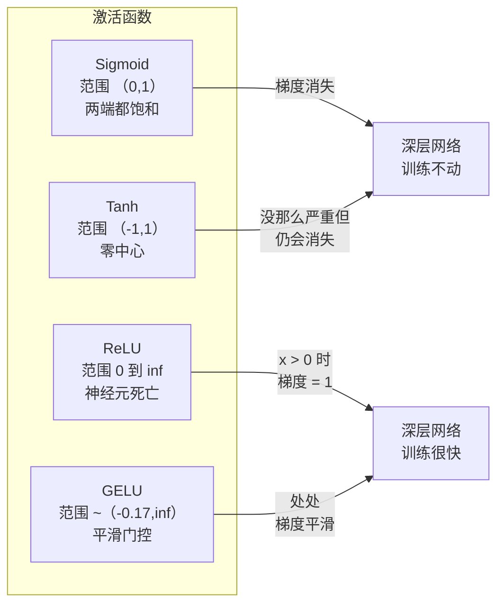
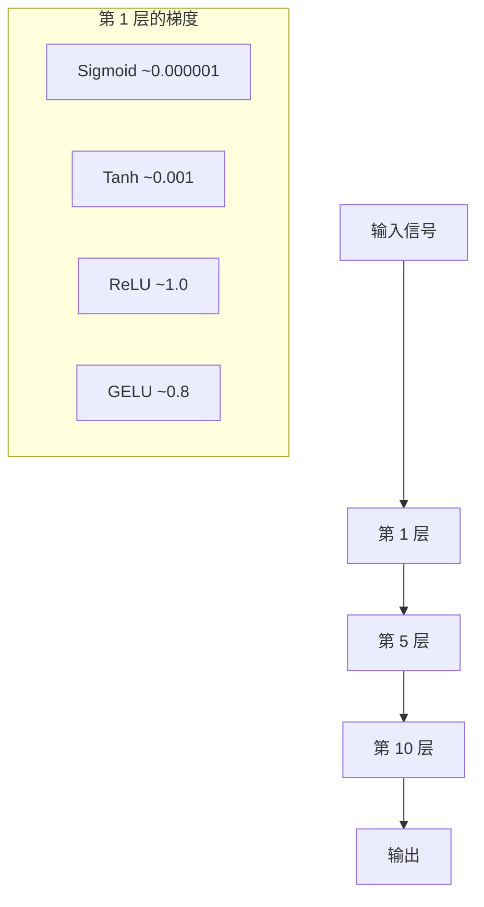
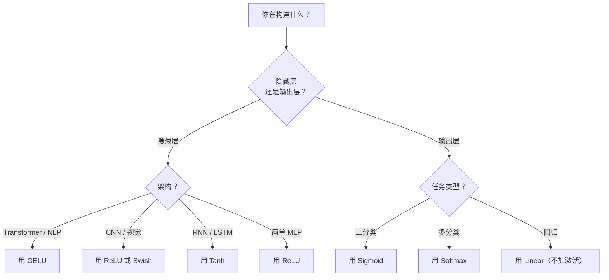

# 激活函数（Activation Functions）

> 译注：本文译自同目录 [`en.md`](./en.md)。术语遵循仓根 [TRANSLATION_GUIDE.md](../../../../TRANSLATION_GUIDE.md)。

> 没有非线性，你那 100 层网络不过是一个花哨的矩阵乘法。激活函数是让神经网络能用曲线思考的闸门。

**Type:** Build
**Languages:** Python
**Prerequisites:** Lesson 03.03 (Backpropagation)
**Time:** ~75 minutes

## 学习目标（Learning Objectives）

- 从零实现 sigmoid、tanh、ReLU、Leaky ReLU、GELU、Swish 和 softmax，以及它们的导数
- 通过测量激活值在 10+ 层网络中的幅度来诊断梯度消失（vanishing gradient）问题，对比不同激活函数
- 在 ReLU 网络中检测死亡神经元（dead neuron），并解释为什么 GELU 能避免这种失效模式
- 为给定架构（transformer、CNN、RNN、输出层）选择正确的激活函数

## 问题（The Problem）

把两个线性变换叠起来：y = W2(W1x + b1) + b2。展开后：y = W2W1x + W2b1 + b2。这其实就是 y = Ax + c —— 一个线性变换而已。无论你叠多少层线性层，结果都会塌缩成一次矩阵乘法。你那 100 层网络的表达能力，跟单层一模一样。

这不是什么理论好奇心。它意味着深度线性网络压根学不会 XOR、分不出螺旋数据集、认不出人脸。没有激活函数，深度只是错觉。

激活函数打破线性。它们用一个非线性函数把每层的输出弯一弯，让网络能弯曲决策边界、逼近任意函数、真正去学习。但激活函数选错了，梯度会衰减到零（深网络里的 sigmoid）、爆炸到无穷（不带细致初始化的无界激活），或者神经元永久死亡（带大负偏置的 ReLU）。激活函数的选择直接决定网络究竟能不能学。

## 概念（The Concept）

### 为什么必须有非线性（Why Nonlinearity Is Necessary）

矩阵乘法是可组合的。一个向量先乘 A 再乘 B，等价于直接乘 AB。这意味着叠十层线性层，数学上跟一层带一个大矩阵的线性层完全等价。所有那些参数、所有那些深度——白搭。你需要某种东西来打断这条链。激活函数就是干这个的。

证明如下。线性层计算 f(x) = Wx + b。叠两层：

```
Layer 1: h = W1 * x + b1
Layer 2: y = W2 * h + b2
```

代入：

```
y = W2 * (W1 * x + b1) + b2
y = (W2 * W1) * x + (W2 * b1 + b2)
y = A * x + c
```

一层。在层之间插入一个非线性激活 g()：

```
h = g(W1 * x + b1)
y = W2 * h + b2
```

现在代入就走不通了。W2 * g(W1 * x + b1) + b2 没法化简成一个线性变换。网络可以表示非线性函数。每多加一层带激活的层，都会增加表达能力。

### Sigmoid

神经网络最早的那个激活函数。

```
sigmoid(x) = 1 / (1 + e^(-x))
```

输出范围：(0, 1)。光滑、可导，把任何实数映到一个类概率值。

导数：

```
sigmoid'(x) = sigmoid(x) * (1 - sigmoid(x))
```

这个导数的最大值是 0.25，在 x = 0 处取到。在反向传播里，梯度会逐层相乘。十层 sigmoid 意味着梯度最多被乘上 0.25 十次：

```
0.25^10 = 0.000000953674
```

不到原始信号的百万分之一。这就是 vanishing gradient（梯度消失）问题。靠前的层梯度小到几乎不更新权重。表面上网络在学——靠后的层 loss 在降——但前几层是冻住的。深层 sigmoid 网络压根训练不动。

还有个附加问题：sigmoid 输出永远是正的（0 到 1），这意味着权重梯度永远同号。这会让梯度下降走 zig-zag。

### Tanh

sigmoid 的零中心版本。

```
tanh(x) = (e^x - e^(-x)) / (e^x + e^(-x))
```

输出范围：(-1, 1)。零中心，消掉了 zig-zag 问题。

导数：

```
tanh'(x) = 1 - tanh(x)^2
```

最大导数是 1.0，在 x = 0 处——比 sigmoid 强四倍。但梯度消失问题还在。对很大的正负输入，导数仍趋近零。十层依然会把梯度压扁，只是没那么狠而已。

### ReLU：突破口（ReLU: The Breakthrough）

Rectified Linear Unit（修正线性单元）。Nair 与 Hinton 在 2010 年把它推上深度学习舞台（函数本身可追溯到 Fukushima 1969 年的工作），它改变了一切。

```
relu(x) = max(0, x)
```

输出范围：[0, infinity)。导数简单到不能再简单：

```
relu'(x) = 1  if x > 0
            0  if x <= 0
```

正输入没有梯度消失。梯度恰好是 1，原样传过去。这就是深度网络变得可训练的原因——ReLU 在层间保住了梯度幅度。

但它有个失效模式：dead neuron（死亡神经元）问题。如果某个神经元的加权输入永远为负（因为大的负偏置或不走运的权重初始化），它的输出永远是零、梯度永远是零，永远不更新。它就永久死了。实践中，ReLU 网络里 10–40% 的神经元可能在训练中死掉。

### Leaky ReLU

针对死亡神经元最简单的修补。

```
leaky_relu(x) = x        if x > 0
                alpha * x if x <= 0
```

其中 alpha 是个小常数，一般取 0.01。负的一侧不再是零，而是一个小斜率，所以死掉的神经元仍能拿到梯度信号、有机会复活。

### GELU：现代默认（GELU: The Modern Default）

Gaussian Error Linear Unit（高斯误差线性单元）。Hendrycks 与 Gimpel 于 2016 年提出。BERT、GPT 以及大多数现代 transformer 的默认激活。

```
gelu(x) = x * Phi(x)
```

其中 Phi(x) 是标准正态分布的累积分布函数。实际使用的近似式：

```
gelu(x) ~= 0.5 * x * (1 + tanh(sqrt(2/pi) * (x + 0.044715 * x^3)))
```

GELU 处处光滑，允许小的负值（不像 ReLU 那样直接硬截到零），还有概率解释：它按一个高斯分布下输入为正的概率给输入加权。这种平滑门控在 transformer 架构里胜过 ReLU，因为它带来更好的梯度传播，并且彻底回避了死亡神经元问题。

### Swish / SiLU

自门控激活，Ramachandran 等人在 2017 年通过自动搜索发现。

```
swish(x) = x * sigmoid(x)
```

Swish 形式上就是 x * sigmoid(x)。Google 是在激活函数空间里做自动搜索发现它的——一个用神经网络去设计神经网络组件的故事。

跟 GELU 一样，它是光滑的、非单调的，允许小的负值。区别很微妙：Swish 用 sigmoid 做门控，而 GELU 用高斯 CDF 做门控。实践中两者性能几乎一样。Swish 用在 EfficientNet 和一些视觉模型里。GELU 在语言模型里占主导。

### Softmax：输出激活（Softmax: The Output Activation）

不在隐藏层里用。Softmax 把一个原始分数（logits）向量转成概率分布。

```
softmax(x_i) = e^(x_i) / sum(e^(x_j) for all j)
```

每个输出都在 0 到 1 之间。所有输出加起来等于 1。这让它成为多分类任务里标准的最终激活。最大的 logit 拿到最高的概率，但和 argmax 不同，softmax 是可导的，并且保留了相对置信度的信息。

### 形状对比（Comparison of Shapes）



### 梯度传播对比（Gradient Flow Comparison）



### 在何种场景用何种激活（Which Activation When）



## 动手实现（Build It）

### 第 1 步：实现所有激活函数与导数（Step 1: Implement All Activation Functions with Derivatives）

每个函数接收一个 float、返回一个 float。每个导数函数接收同样的输入、返回梯度。

```python
import math

def sigmoid(x):
    x = max(-500, min(500, x))
    return 1.0 / (1.0 + math.exp(-x))

def sigmoid_derivative(x):
    s = sigmoid(x)
    return s * (1 - s)

def tanh_act(x):
    return math.tanh(x)

def tanh_derivative(x):
    t = math.tanh(x)
    return 1 - t * t

def relu(x):
    return max(0.0, x)

def relu_derivative(x):
    return 1.0 if x > 0 else 0.0

def leaky_relu(x, alpha=0.01):
    return x if x > 0 else alpha * x

def leaky_relu_derivative(x, alpha=0.01):
    return 1.0 if x > 0 else alpha

def gelu(x):
    return 0.5 * x * (1 + math.tanh(math.sqrt(2 / math.pi) * (x + 0.044715 * x ** 3)))

def gelu_derivative(x):
    phi = 0.5 * (1 + math.erf(x / math.sqrt(2)))
    pdf = math.exp(-0.5 * x * x) / math.sqrt(2 * math.pi)
    return phi + x * pdf

def swish(x):
    return x * sigmoid(x)

def swish_derivative(x):
    s = sigmoid(x)
    return s + x * s * (1 - s)

def softmax(xs):
    max_x = max(xs)
    exps = [math.exp(x - max_x) for x in xs]
    total = sum(exps)
    return [e / total for e in exps]
```

### 第 2 步：可视化梯度死在哪儿（Step 2: Visualize Where Gradients Die）

在 -5 到 5 之间均匀取 100 个点，计算每点处的梯度。打印一个文本直方图，展示每个激活在哪些区间梯度接近零。

```python
def gradient_scan(name, derivative_fn, start=-5, end=5, n=100):
    step = (end - start) / n
    near_zero = 0
    healthy = 0
    for i in range(n):
        x = start + i * step
        g = derivative_fn(x)
        if abs(g) < 0.01:
            near_zero += 1
        else:
            healthy += 1
    pct_dead = near_zero / n * 100
    print(f"{name:15s}: {healthy:3d} healthy, {near_zero:3d} near-zero ({pct_dead:.0f}% dead zone)")

gradient_scan("Sigmoid", sigmoid_derivative)
gradient_scan("Tanh", tanh_derivative)
gradient_scan("ReLU", relu_derivative)
gradient_scan("Leaky ReLU", leaky_relu_derivative)
gradient_scan("GELU", gelu_derivative)
gradient_scan("Swish", swish_derivative)
```

### 第 3 步：梯度消失实验（Step 3: Vanishing Gradient Experiment）

让一个信号分别用 sigmoid 和 ReLU 前向通过 N 层。测量激活幅度的变化。

```python
import random

def vanishing_gradient_experiment(activation_fn, name, n_layers=10, n_inputs=5):
    random.seed(42)
    values = [random.gauss(0, 1) for _ in range(n_inputs)]

    print(f"\n{name} through {n_layers} layers:")
    for layer in range(n_layers):
        weights = [random.gauss(0, 1) for _ in range(n_inputs)]
        z = sum(w * v for w, v in zip(weights, values))
        activated = activation_fn(z)
        magnitude = abs(activated)
        bar = "#" * int(magnitude * 20)
        print(f"  Layer {layer+1:2d}: magnitude = {magnitude:.6f} {bar}")
        values = [activated] * n_inputs

vanishing_gradient_experiment(sigmoid, "Sigmoid")
vanishing_gradient_experiment(relu, "ReLU")
vanishing_gradient_experiment(gelu, "GELU")
```

### 第 4 步：死亡神经元检测器（Step 4: Dead Neuron Detector）

构造一个 ReLU 网络，给它喂随机输入，统计有多少神经元从来没被激活。

```python
def dead_neuron_detector(n_inputs=5, hidden_size=20, n_samples=1000):
    random.seed(0)
    weights = [[random.gauss(0, 1) for _ in range(n_inputs)] for _ in range(hidden_size)]
    biases = [random.gauss(0, 1) for _ in range(hidden_size)]

    fire_counts = [0] * hidden_size

    for _ in range(n_samples):
        inputs = [random.gauss(0, 1) for _ in range(n_inputs)]
        for neuron_idx in range(hidden_size):
            z = sum(w * x for w, x in zip(weights[neuron_idx], inputs)) + biases[neuron_idx]
            if relu(z) > 0:
                fire_counts[neuron_idx] += 1

    dead = sum(1 for c in fire_counts if c == 0)
    rarely_fire = sum(1 for c in fire_counts if 0 < c < n_samples * 0.05)
    healthy = hidden_size - dead - rarely_fire

    print(f"\nDead Neuron Report ({hidden_size} neurons, {n_samples} samples):")
    print(f"  Dead (never fired):     {dead}")
    print(f"  Barely alive (<5%):     {rarely_fire}")
    print(f"  Healthy:                {healthy}")
    print(f"  Dead neuron rate:       {dead/hidden_size*100:.1f}%")

    for i, c in enumerate(fire_counts):
        status = "DEAD" if c == 0 else "WEAK" if c < n_samples * 0.05 else "OK"
        bar = "#" * (c * 40 // n_samples)
        print(f"  Neuron {i:2d}: {c:4d}/{n_samples} fires [{status:4s}] {bar}")

dead_neuron_detector()
```

### 第 5 步：训练对比 —— Sigmoid vs ReLU vs GELU（Step 5: Training Comparison -- Sigmoid vs ReLU vs GELU）

在圆形数据集（圆内的点 = 类别 1，圆外 = 类别 0）上用三种不同激活函数训练同一个两层网络。对比收敛速度。

```python
def make_circle_data(n=200, seed=42):
    random.seed(seed)
    data = []
    for _ in range(n):
        x = random.uniform(-2, 2)
        y = random.uniform(-2, 2)
        label = 1.0 if x * x + y * y < 1.5 else 0.0
        data.append(([x, y], label))
    return data


class ActivationNetwork:
    def __init__(self, activation_fn, activation_deriv, hidden_size=8, lr=0.1):
        random.seed(0)
        self.act = activation_fn
        self.act_d = activation_deriv
        self.lr = lr
        self.hidden_size = hidden_size

        self.w1 = [[random.gauss(0, 0.5) for _ in range(2)] for _ in range(hidden_size)]
        self.b1 = [0.0] * hidden_size
        self.w2 = [random.gauss(0, 0.5) for _ in range(hidden_size)]
        self.b2 = 0.0

    def forward(self, x):
        self.x = x
        self.z1 = []
        self.h = []
        for i in range(self.hidden_size):
            z = self.w1[i][0] * x[0] + self.w1[i][1] * x[1] + self.b1[i]
            self.z1.append(z)
            self.h.append(self.act(z))

        self.z2 = sum(self.w2[i] * self.h[i] for i in range(self.hidden_size)) + self.b2
        self.out = sigmoid(self.z2)
        return self.out

    def backward(self, target):
        error = self.out - target
        d_out = error * self.out * (1 - self.out)

        for i in range(self.hidden_size):
            d_h = d_out * self.w2[i] * self.act_d(self.z1[i])
            self.w2[i] -= self.lr * d_out * self.h[i]
            for j in range(2):
                self.w1[i][j] -= self.lr * d_h * self.x[j]
            self.b1[i] -= self.lr * d_h
        self.b2 -= self.lr * d_out

    def train(self, data, epochs=200):
        losses = []
        for epoch in range(epochs):
            total_loss = 0
            correct = 0
            for x, y in data:
                pred = self.forward(x)
                self.backward(y)
                total_loss += (pred - y) ** 2
                if (pred >= 0.5) == (y >= 0.5):
                    correct += 1
            avg_loss = total_loss / len(data)
            accuracy = correct / len(data) * 100
            losses.append(avg_loss)
            if epoch % 50 == 0 or epoch == epochs - 1:
                print(f"    Epoch {epoch:3d}: loss={avg_loss:.4f}, accuracy={accuracy:.1f}%")
        return losses


data = make_circle_data()

configs = [
    ("Sigmoid", sigmoid, sigmoid_derivative),
    ("ReLU", relu, relu_derivative),
    ("GELU", gelu, gelu_derivative),
]

results = {}
for name, act_fn, act_d_fn in configs:
    print(f"\n=== Training with {name} ===")
    net = ActivationNetwork(act_fn, act_d_fn, hidden_size=8, lr=0.1)
    losses = net.train(data, epochs=200)
    results[name] = losses

print("\n=== Final Loss Comparison ===")
for name, losses in results.items():
    print(f"  {name:10s}: start={losses[0]:.4f} -> end={losses[-1]:.4f} (improvement: {(1 - losses[-1]/losses[0])*100:.1f}%)")
```

## 用起来（Use It）

PyTorch 把这些都提供了函数式和模块式两种形式：

```python
import torch
import torch.nn as nn
import torch.nn.functional as F

x = torch.randn(4, 10)

relu_out = F.relu(x)
gelu_out = F.gelu(x)
sigmoid_out = torch.sigmoid(x)
swish_out = F.silu(x)

logits = torch.randn(4, 5)
probs = F.softmax(logits, dim=1)

model = nn.Sequential(
    nn.Linear(10, 64),
    nn.GELU(),
    nn.Linear(64, 32),
    nn.GELU(),
    nn.Linear(32, 5),
)
```

transformer 的隐藏层：GELU。CNN 的隐藏层：ReLU。分类的输出层：softmax。回归的输出层：不加（线性）。输出概率的层：sigmoid。就这些。先用这套默认配置，等有证据再改。

RNN 和 LSTM 的隐藏状态用 tanh、门用 sigmoid，但你今天要从零搭东西，多半不会再用 RNN 了。如果 ReLU 网络里神经元在死，换 GELU。别一上来就抓 Leaky ReLU——除非你有特别的理由——GELU 既能解决死亡神经元问题，又能给出更好的梯度传播。

## 上线部署（Ship It）

这节课产出：
- `outputs/prompt-activation-selector.md` —— 一个可复用的 prompt，帮你为任意架构挑选合适的激活函数

## 练习（Exercises）

1. 实现 Parametric ReLU（PReLU），其中负侧斜率 alpha 是一个可学习参数。在圆形数据集上训练它，并跟固定的 Leaky ReLU 比较。

2. 把梯度消失实验从 10 层改成 50 层。画出 sigmoid、tanh、ReLU、GELU 在各层的幅度。每种激活分别在第几层信号实际归零？

3. 实现 ELU（Exponential Linear Unit）：当 x > 0 时 elu(x) = x；当 x <= 0 时 elu(x) = alpha * (e^x - 1)。在同一网络上比较它和 ReLU 的死亡神经元率。

4. 写一个「梯度健康监控器」，在训练过程中运行：每个 epoch 计算每层的平均梯度幅度。当任意层的梯度跌破 0.001 或超过 100 时打印警告。

5. 把训练对比里用的圆形数据换成第 01 课的 XOR 数据集。哪种激活在 XOR 上收敛最快？为什么和圆形的结果不一样？

## 关键术语（Key Terms）

| 术语 | 大家平时怎么说 | 实际含义 |
|------|----------------|----------------------|
| Activation function（激活函数） | 「那个非线性的部分」 | 作用在每个神经元输出上的函数，打破线性，使网络能学习非线性映射 |
| Vanishing gradient（梯度消失） | 「深度网络里梯度没了」 | 当激活函数的导数小于 1 时，梯度逐层指数级缩小，使靠前的层无法训练 |
| Exploding gradient（梯度爆炸） | 「梯度炸了」 | 当层间有效乘子大于 1 时，梯度逐层指数级增长，导致训练不稳定 |
| Dead neuron（死亡神经元） | 「不学了的神经元」 | 输入永远为负的 ReLU 神经元，输出永远为零、梯度永远为零 |
| Sigmoid | 「把值压到 0–1」 | 逻辑函数 1/(1+e^-x)，历史上很重要，但在深度网络里会引发梯度消失 |
| ReLU | 「把负值剪到零」 | max(0, x) —— 通过保住梯度幅度让深度学习真正可行的激活函数 |
| GELU | 「transformer 的激活」 | Gaussian Error Linear Unit，一种平滑激活，按输入为正的概率给输入加权 |
| Swish/SiLU | 「自门控的 ReLU」 | x * sigmoid(x)，通过自动搜索发现，用在 EfficientNet 中 |
| Softmax | 「把分数变成概率」 | 把 logits 向量归一化为一个概率分布，所有值在 (0,1) 内、总和为 1 |
| Leaky ReLU | 「不会死的 ReLU」 | max(alpha*x, x)，alpha 取小值（0.01），通过允许小的负梯度避免死亡神经元 |
| Saturation（饱和） | 「sigmoid 平的那段」 | 激活函数导数趋近零的区段，会阻塞梯度传播 |
| Logit | 「softmax 之前的原始分数」 | 最后一层在套 softmax 或 sigmoid 之前的未归一化输出 |

## 延伸阅读（Further Reading）

- Nair & Hinton, "Rectified Linear Units Improve Restricted Boltzmann Machines" (2010) —— 引入 ReLU、让深度网络得以训练的论文
- Hendrycks & Gimpel, "Gaussian Error Linear Units (GELUs)" (2016) —— 引入了后来成为 transformer 默认激活的函数
- Ramachandran et al., "Searching for Activation Functions" (2017) —— 用自动搜索发现 Swish，证明激活函数设计本身可以自动化
- Glorot & Bengio, "Understanding the difficulty of training deep feedforward neural networks" (2010) —— 诊断梯度消失/爆炸并提出 Xavier 初始化的论文
- Goodfellow, Bengio, Courville, "Deep Learning" 第 6.3 章 (https://www.deeplearningbook.org/) —— 对隐藏单元和激活函数的严谨论述
