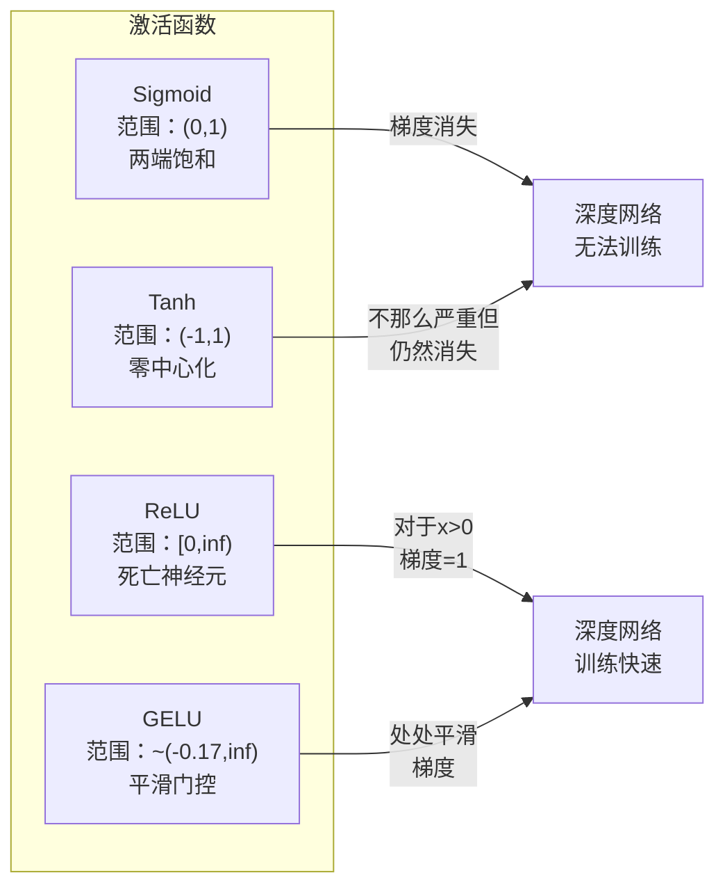
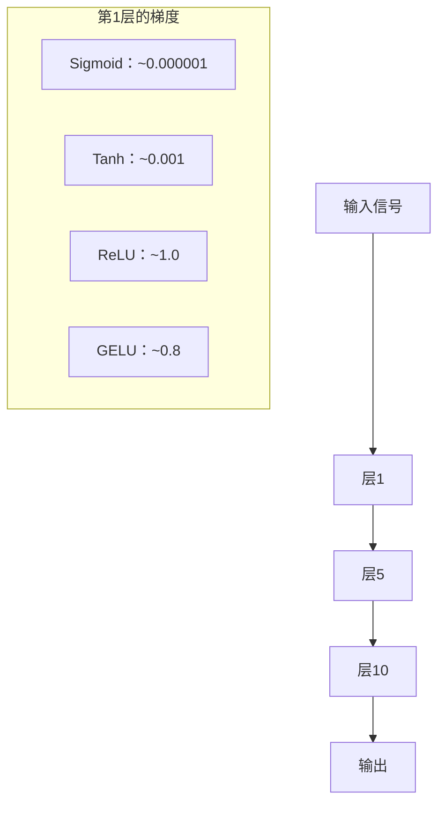
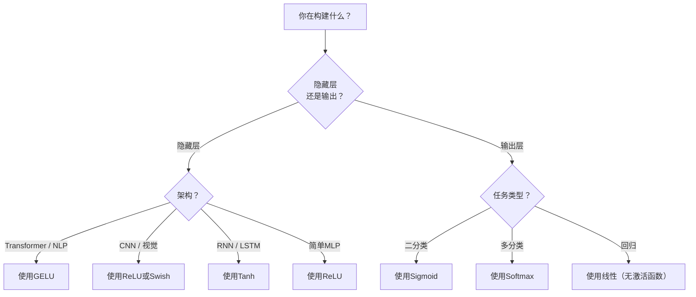

# 激活函数

> 没有非线性，你的100层网络不过是花哨的矩阵乘法。激活函数是让神经网络以曲线方式思考的门控。

**类型:** 构建
**语言:** Python
**先修课程:** 03.03 反向传播（Backpropagation）
**时间:** ~75 分钟

## 学习目标

- 从头实现sigmoid、tanh、ReLU、Leaky ReLU、GELU、Swish和softmax及其导数
- 通过测量10层以上不同激活函数的激活值幅度，诊断梯度消失问题
- 检测ReLU网络中的死亡神经元，并解释为何GELU能避免这种失效模式
- 为给定架构（Transformer、CNN、RNN、输出层）选择合适的激活函数

## 问题

堆叠两个线性变换：y = W2(W1x + b1) + b2。展开：y = W2W1x + W2b1 + b2。这只是y = Ax + c —— 一个单一的线性变换。无论堆叠多少线性层，结果都会坍缩成一个矩阵乘法。你的100层网络与单层具有相同的表示能力。

这并非理论上的奇闻。它意味着一个深度线性网络根本无法学习XOR，无法对螺旋数据集进行分类，无法识别人脸。没有激活函数，深度只是幻觉。

激活函数打破了线性。它们通过非线性函数扭曲每一层的输出，使网络能够弯曲决策边界、逼近任意函数并真正进行学习。但选错激活函数，梯度会消失到零（深度网络中的sigmoid）、爆炸到无穷大（未谨慎初始化的无界激活），或者神经元永久死亡（大负偏置下的ReLU）。激活函数的选择直接决定了你的网络能否学到东西。

## 概念

### 为什么非线性是必要的

矩阵乘法是可组合的。将一个向量先乘以矩阵A再乘以矩阵B，等同于乘以AB。这意味着堆叠十个线性层在数学上等价于一个带有大矩阵的单线性层。所有这些参数、所有深度 —— 都白费了。你需要一些东西来打破链条。这就是激活函数的作用。

下面是证明。一个线性层计算 f(x) = Wx + b。堆叠两层：

```
层1：h = W1 * x + b1
层2：y = W2 * h + b2
```

代入：

```
y = W2 * (W1 * x + b1) + b2
y = (W2 * W1) * x + (W2 * b1 + b2)
y = A * x + c
```

单层。在层之间插入一个非线性激活函数 g( )：

```
h = g(W1 * x + b1)
y = W2 * h + b2
```

现在代入被打破。W2 * g(W1 * x + b1) + b2 不能简化为单个线性变换。网络可以表示非线性函数。每一层带激活函数的额外层都增加了表示能力。

### Sigmoid

神经网络最初使用的激活函数。

```
sigmoid(x) = 1 / (1 + e^(-x))
```

输出范围：(0, 1)。平滑、可微、将任何实数映射为类似概率的值。

导数：

```
sigmoid'(x) = sigmoid(x) * (1 - sigmoid(x))
```

该导数的最大值是0.25，出现在x=0处。在反向传播中，梯度会逐层相乘。十层sigmoid意味着梯度最多被乘以0.25十次：

```
0.25^10 = 0.000000953674
```

不到原始信号的百万分之一。这就是梯度消失问题。早期层中的梯度变得极小，权重几乎不更新。网络看起来在学习 —— 后期层的损失在下降 —— 但前几层被冻结。深层sigmoid网络根本无法训练。

另一个问题：sigmoid输出总是正的（0到1），这意味着权重的梯度总是同号。这导致梯度下降过程中出现锯齿现象。

### Tanh

sigmoid的中心化版本。

```
tanh(x) = (e^x - e^(-x)) / (e^x + e^(-x))
```

输出范围：(-1, 1)。零中心化，消除了锯齿问题。

导数：

```
tanh'(x) = 1 - tanh(x)^2
```

最大导数为1.0，出现在x=0 —— 比sigmoid好四倍。但梯度消失问题仍然存在。对于大正或大负的输入，导数趋近于零。十层仍然会压垮梯度，只是不那么剧烈。

### ReLU：突破性进展

修正线性单元（Rectified Linear Unit）。由Nair和Hinton在2010年推广用于深度学习（该函数本身可追溯到Fukushima 1969年的工作），它改变了一切。

```
relu(x) = max(0, x)
```

输出范围：[0, 无穷大)。导数极其简单：

```
relu'(x) = 1  if x > 0
            0  if x <= 0
```

对于正输入没有梯度消失。梯度恰好为1，直接传递。这就是深度网络变得可训练的原因 —— ReLU跨层保持梯度幅度。

但有一个失效模式：死亡神经元问题。如果一个神经元的加权输入总是负的（由于大的负偏置或不幸的权重初始化），它的输出总是零，梯度总是零，并且永不更新。它永久死亡。在实践中，ReLU网络中10-40%的神经元可能在训练过程中死亡。

### Leaky ReLU

修复死亡神经元的最简单方案。

```
leaky_relu(x) = x        if x > 0
                alpha * x if x <= 0
```

其中alpha是一个小的常数，通常为0.01。负侧有一个小斜率而非零，因此死亡神经元仍然能获得梯度信号并可以恢复。

### GELU：现代默认选择

高斯误差线性单元（Gaussian Error Linear Unit）。由Hendrycks和Gimpel在2016年提出。BERT、GPT和大多数现代Transformer的默认激活函数。

```
gelu(x) = x * Phi(x)
```

其中Phi(x)是标准正态分布的累积分布函数。实践中使用的近似：

```
gelu(x) ~= 0.5 * x * (1 + tanh(sqrt(2/pi) * (x + 0.044715 * x^3)))
```

GELU处处光滑，允许小的负值（不像ReLU那样硬裁剪为零），并且具有概率解释：它根据输入在高斯分布下为正的概率对每个输入进行加权。这种平滑门控在Transformer架构中优于ReLU，因为它提供了更好的梯度流并完全避免了死亡神经元问题。

### Swish / SiLU

由Ramachandran等人在2017年通过自动搜索发现的自门控激活函数。

```
swish(x) = x * sigmoid(x)
```

Swish正式表示为 x * sigmoid(x)。谷歌通过激活函数空间的自动搜索发现 —— 一个神经网络在设计神经网络的部件。

与GELU一样，它是光滑的、非单调的，并允许小的负值。区别很微妙：Swish使用sigmoid进行门控，而GELU使用高斯CDF。在实践中，性能几乎相同。Swish用于EfficientNet和一些视觉模型。GELU在语言模型中占主导地位。

### Softmax：输出激活函数

不用于隐藏层。Softmax将一个原始分数（logits）向量转换为概率分布。

```
softmax(x_i) = e^(x_i) / sum(e^(x_j) 对所有 j)
```

每个输出都在0和1之间。所有输出之和为1。这使其成为多分类的标准最终激活函数。最大的logit获得最高概率，但与argmax不同，softmax是可微的，并保留关于相对置信度的信息。

### 形状对比



### 梯度流对比



### 何时使用哪种激活函数



## 动手构建

### 第一步：实现所有激活函数及其导数

每个函数接受一个浮点数并返回一个浮点数。每个导数函数接受相同输入并返回梯度。

```python
import math

def sigmoid(x):
    x = max(-500, min(500, x))
    return 1.0 / (1.0 + math.exp(-x))

def sigmoid_derivative(x):
    s = sigmoid(x)
    return s * (1 - s)

def tanh_act(x):
    return math.tanh(x)

def tanh_derivative(x):
    t = math.tanh(x)
    return 1 - t * t

def relu(x):
    return max(0.0, x)

def relu_derivative(x):
    return 1.0 if x > 0 else 0.0

def leaky_relu(x, alpha=0.01):
    return x if x > 0 else alpha * x

def leaky_relu_derivative(x, alpha=0.01):
    return 1.0 if x > 0 else alpha

def gelu(x):
    return 0.5 * x * (1 + math.tanh(math.sqrt(2 / math.pi) * (x + 0.044715 * x ** 3)))

def gelu_derivative(x):
    phi = 0.5 * (1 + math.erf(x / math.sqrt(2)))
    pdf = math.exp(-0.5 * x * x) / math.sqrt(2 * math.pi)
    return phi + x * pdf

def swish(x):
    return x * sigmoid(x)

def swish_derivative(x):
    s = sigmoid(x)
    return s + x * s * (1 - s)

def softmax(xs):
    max_x = max(xs)
    exps = [math.exp(x - max_x) for x in xs]
    total = sum(exps)
    return [e / total for e in exps]
```

### 第二步：可视化梯度消亡区域

在-5到5之间均匀取100个点计算梯度。打印文本直方图显示每个激活函数的梯度在哪些区域接近零。

```python
def gradient_scan(name, derivative_fn, start=-5, end=5, n=100):
    step = (end - start) / n
    near_zero = 0
    healthy = 0
    for i in range(n):
        x = start + i * step
        g = derivative_fn(x)
        if abs(g) < 0.01:
            near_zero += 1
        else:
            healthy += 1
    pct_dead = near_zero / n * 100
    print(f"{name:15s}: {healthy:3d} 健康, {near_zero:3d} 接近零 ({pct_dead:.0f}% 死亡区)")

gradient_scan("Sigmoid", sigmoid_derivative)
gradient_scan("Tanh", tanh_derivative)
gradient_scan("ReLU", relu_derivative)
gradient_scan("Leaky ReLU", leaky_relu_derivative)
gradient_scan("GELU", gelu_derivative)
gradient_scan("Swish", swish_derivative)
```

### 第三步：梯度消失实验

通过N层传递信号，使用sigmoid vs ReLU。测量激活值幅度如何变化。

```python
import random

def vanishing_gradient_experiment(activation_fn, name, n_layers=10, n_inputs=5):
    random.seed(42)
    values = [random.gauss(0, 1) for _ in range(n_inputs)]

    print(f"\n{name} 经过 {n_layers} 层：")
    for layer in range(n_layers):
        weights = [random.gauss(0, 1) for _ in range(n_inputs)]
        z = sum(w * v for w, v in zip(weights, values))
        activated = activation_fn(z)
        magnitude = abs(activated)
        bar = "#" * int(magnitude * 20)
        print(f"  层 {layer+1:2d}: 幅度 = {magnitude:.6f} {bar}")
        values = [activated] * n_inputs

vanishing_gradient_experiment(sigmoid, "Sigmoid")
vanishing_gradient_experiment(relu, "ReLU")
vanishing_gradient_experiment(gelu, "GELU")
```

### 第四步：死亡神经元检测器

创建一个ReLU网络，通过随机输入，统计有多少神经元从未激活。

```python
def dead_neuron_detector(n_inputs=5, hidden_size=20, n_samples=1000):
    random.seed(0)
    weights = [[random.gauss(0, 1) for _ in range(n_inputs)] for _ in range(hidden_size)]
    biases = [random.gauss(0, 1) for _ in range(hidden_size)]

    fire_counts = [0] * hidden_size

    for _ in range(n_samples):
        inputs = [random.gauss(0, 1) for _ in range(n_inputs)]
        for neuron_idx in range(hidden_size):
            z = sum(w * x for w, x in zip(weights[neuron_idx], inputs)) + biases[neuron_idx]
            if relu(z) > 0:
                fire_counts[neuron_idx] += 1

    dead = sum(1 for c in fire_counts if c == 0)
    rarely_fire = sum(1 for c in fire_counts if 0 < c < n_samples * 0.05)
    healthy = hidden_size - dead - rarely_fire

    print(f"\n死亡神经元报告（{hidden_size} 个神经元，{n_samples} 个样本）：")
    print(f"  死亡（从未激活）：     {dead}")
    print(f"  几乎死亡（<5%）：     {rarely_fire}")
    print(f"  健康：                {healthy}")
    print(f"  死亡神经元率：       {dead/hidden_size*100:.1f}%")

    for i, c in enumerate(fire_counts):
        status = "死亡" if c == 0 else "虚弱" if c < n_samples * 0.05 else "正常"
        bar = "#" * (c * 40 // n_samples)
        print(f"  神经元 {i:2d}: {c:4d}/{n_samples} 激活 [{status:4s}] {bar}")

dead_neuron_detector()
```

### 第五步：训练对比 —— Sigm