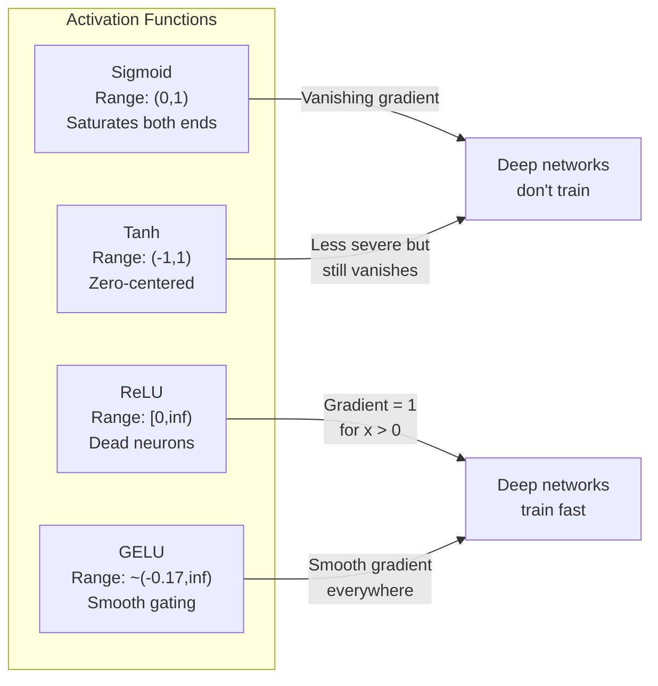
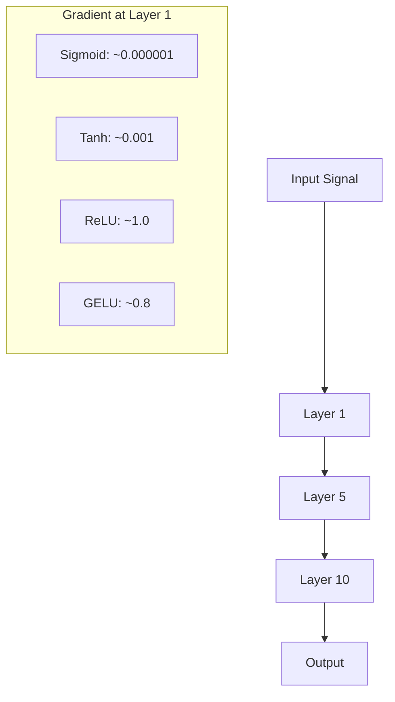
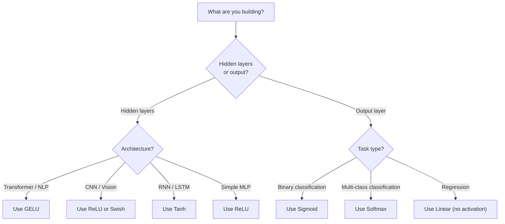

# 激活函数

> 如果没有非线性，您的100层网络就是一个花哨的矩阵乘。激活是让神经网络以曲线思维的大门。

** 类型：** 构建
** 语言：** Python
** 先决条件：** 第03.03课（反向传播）
** 时间：** ~75分钟

## 学习目标

- 从头开始实现sigmoid、tanh、ReLU、Leaky ReLU、GELU、Swish和softmax及其衍生工具
- 通过测量具有不同激活的10+层的激活幅度来诊断梯度消失问题
- 检测ReLU网络中的死亡神经元并解释为什么GELU避免这种失败模式
- 为给定架构（Transformer、CNN、RNN、输出层）选择正确的激活函数

## 问题

堆叠两个线性变换：y = W2（W1 x + b1）+ b2。展开：y = W2 W1 x + W2 b1 + b2。这只是y = Ax + c --一个单一的线性变换。无论堆叠多少个线性层，结果都会折叠为一个矩阵相乘。你的100层网络与单层网络具有相同的代表性。

这不是一个理论上的好奇心。这意味着深度线性网络实际上无法学习异或，无法对螺旋数据集进行分类，无法识别面部。如果没有激活功能，深度就是一种幻觉。

激活功能打破了线性。它们通过非线性函数扭曲每一层的输出，使网络能够弯曲决策边界、逼近任意函数并进行实际学习。但选择错误的激活，你的梯度就会消失为零（深度网络中的S字形），爆炸为无限（未经仔细初始化的无界激活），或者你的神经元永久死亡（ReLU具有很大的负偏差）。激活功能的选择直接决定您的网络是否能够学习。

## 概念

### 为什么非线性是必要的

矩阵相乘是可组合的。用矩阵A乘以一个矩阵，那么矩阵B与乘以AB相同。这意味着堆叠十个线性层在数学上相当于一个线性层和一个大矩阵。所有这些参数，所有这些深度--都浪费了。你需要一些东西来打破这个链条。这就是激活函数的作用。

这是证据。线性层计算f（x）= Wx + b。堆栈二：

```
Layer 1: h = W1 * x + b1
Layer 2: y = W2 * h + b2
```

替补：

```
y = W2 * (W1 * x + b1) + b2
y = (W2 * W1) * x + (W2 * b1 + b2)
y = A * x + c
```

一层。在层之间插入非线性激活g（）：

```
h = g(W1 * x + b1)
y = W2 * h + b2
```

现在替换中断了。W2 * g（W1 * x + b1）+ b2不能简化为一个线性变换。该网络可以表示非线性函数。每增加一个激活层，就增加一个表征能力。

### 乙状

神经网络的原始激活函数。

```
sigmoid(x) = 1 / (1 + e^(-x))
```

输出范围：（0，1）。平滑、可微，将任何真实数字映射到类似概率的值。

衍生品：

```
sigmoid'(x) = sigmoid(x) * (1 - sigmoid(x))
```

该求导的最大值为0.25，发生在x = 0时。在反向传播中，梯度在层中成倍增加。十层Sigmoid意味着梯度最多乘以0.25十倍：

```
0.25^10 = 0.000000953674
```

不到原始信号的百万分之一。这就是消失的梯度问题。早期层中的分量变得如此之小，以至于权重几乎没有更新。网络似乎会学习--稍后层的损失减少--但前一层被冻结。深度Sigmoid网络根本无法训练。

其他问题：Sigmoid输出始终为正（0到1），这意味着权重上的梯度始终是相同的符号。这会在梯度下降期间导致锯齿形变化。

### Tanh

Sigmoid的中心版本。

```
tanh(x) = (e^x - e^(-x)) / (e^x + e^(-x))
```

输出范围：（-1，1）。以零为中心，消除了锯齿形问题。

衍生品：

```
tanh'(x) = 1 - tanh(x)^2
```

x = 0时的最大求导为1.0--比sigmoid好四倍。但梯度消失问题仍然存在。对于较大的正或负输入，求导接近零。十层仍然粉碎了梯度，只是攻击性较小。

### ReLU：突破

纠正线性单位。它于2010年由Nair和Hinton推广深度学习（该功能本身可以追溯到Fukushima 1969年的工作），改变了一切。

```
relu(x) = max(0, x)
```

输出范围：[0，无限大）。这个衍生品很简单：

```
relu'(x) = 1  if x > 0
            0  if x <= 0
```

正输入没有消失的梯度。梯度正好是1，直接通过。这就是深度网络变得可训练的原因-- ReLU保留了跨层的梯度幅度。

但有一种失败模式：死亡神经元问题。如果神经元的加权输入始终为负（由于大的负偏差或不幸的权重初始化），那么它的输出始终为零，它的梯度始终为零，并且永远不会更新。它永远死了。实际上，ReLU网络中10-40%的神经元可能会在训练期间死亡。

### Leaky ReLU

对死亡神经元最简单的修复方法。

```
leaky_relu(x) = x        if x > 0
                alpha * x if x <= 0
```

其中Alpha是一个小常数，通常为0.01。负侧的斜坡很小，而不是零，因此死亡的神经元仍然会收到梯度信号并可以恢复。

### GELU：现代默认

高斯误差线性单位。由Hendrycks和Gimpel于2016年推出。BERT、GPT和大多数现代变压器中的默认激活。

```
gelu(x) = x * Phi(x)
```

其中Phi（x）是标准正态分布的累积分布函数。实践中使用的近似值：

```
gelu(x) ~= 0.5 * x * (1 + tanh(sqrt(2/pi) * (x + 0.044715 * x^3)))
```

GELU在任何地方都是平滑的，允许小的负值（与ReLU不同，ReLU硬剪辑为零），并且具有概率解释：它根据每个输入在高斯分布下为正的可能性来加权每个输入。这种平滑门控优于Transformer架构中的ReLU，因为它提供了更好的梯度流并完全避免了死神经元问题。

### Swish / SiLU

Ramachandran等人于2017年通过自动搜索发现了自门控激活。

```
swish(x) = x * sigmoid(x)
```

Swish的形式是x * sigmoid（x）。谷歌是通过激活函数空间的自动搜索发现的--激活函数空间是一个神经网络，它设计了神经网络的一部分。

与GELU一样，它是平滑的、非单调的，并且允许小的负值。区别很微妙：Swish使用Sigmoid进行门控，而GELU使用高斯DF。在实践中，性能几乎相同。Swish用于EfficientNet和一些视觉模型中。GELU在语言模型中占据主导地位。

### Softmax：输出激活

不用于隐藏层。Softmax将原始分数（logits）的载体转换为概率分布。

```
softmax(x_i) = e^(x_i) / sum(e^(x_j) for all j)
```

每个输出都在0和1之间。所有输出总和为1。这使其成为多类别分类的标准最终激活。最大的logit获得最高的概率，但与argmax不同的是，softmax是可微的，并保留有关相对置信度的信息。

### 收件箱比较



### 梯度流量比较



### 何时激活



## 建设党

### 第1步：使用衍生品实施所有激活功能

每个函数接受一个浮点数并返回一个浮点数。每个导函数接受相同的输入并返回梯度。

```python
import math

def sigmoid(x):
    x = max(-500, min(500, x))
    return 1.0 / (1.0 + math.exp(-x))

def sigmoid_derivative(x):
    s = sigmoid(x)
    return s * (1 - s)

def tanh_act(x):
    return math.tanh(x)

def tanh_derivative(x):
    t = math.tanh(x)
    return 1 - t * t

def relu(x):
    return max(0.0, x)

def relu_derivative(x):
    return 1.0 if x > 0 else 0.0

def leaky_relu(x, alpha=0.01):
    return x if x > 0 else alpha * x

def leaky_relu_derivative(x, alpha=0.01):
    return 1.0 if x > 0 else alpha

def gelu(x):
    return 0.5 * x * (1 + math.tanh(math.sqrt(2 / math.pi) * (x + 0.044715 * x ** 3)))

def gelu_derivative(x):
    phi = 0.5 * (1 + math.erf(x / math.sqrt(2)))
    pdf = math.exp(-0.5 * x * x) / math.sqrt(2 * math.pi)
    return phi + x * pdf

def swish(x):
    return x * sigmoid(x)

def swish_derivative(x):
    s = sigmoid(x)
    return s + x * s * (1 - s)

def softmax(xs):
    max_x = max(xs)
    exps = [math.exp(x - max_x) for x in xs]
    total = sum(exps)
    return [e / total for e in exps]
```

### 第2步：想象病人死亡的地方

计算-5到5之间100个均匀间隔点的梯度。打印文本图表，显示每个激活的梯度接近零的位置。

```python
def gradient_scan(name, derivative_fn, start=-5, end=5, n=100):
    step = (end - start) / n
    near_zero = 0
    healthy = 0
    for i in range(n):
        x = start + i * step
        g = derivative_fn(x)
        if abs(g) < 0.01:
            near_zero += 1
        else:
            healthy += 1
    pct_dead = near_zero / n * 100
    print(f"{name:15s}: {healthy:3d} healthy, {near_zero:3d} near-zero ({pct_dead:.0f}% dead zone)")

gradient_scan("Sigmoid", sigmoid_derivative)
gradient_scan("Tanh", tanh_derivative)
gradient_scan("ReLU", relu_derivative)
gradient_scan("Leaky ReLU", leaky_relu_derivative)
gradient_scan("GELU", gelu_derivative)
gradient_scan("Swish", swish_derivative)
```

### 步骤3：消失梯度实验

使用Sigmoid与ReLU将信号前向传递通过N层。测量激活幅度如何变化。

```python
import random

def vanishing_gradient_experiment(activation_fn, name, n_layers=10, n_inputs=5):
    random.seed(42)
    values = [random.gauss(0, 1) for _ in range(n_inputs)]

    print(f"\n{name} through {n_layers} layers:")
    for layer in range(n_layers):
        weights = [random.gauss(0, 1) for _ in range(n_inputs)]
        z = sum(w * v for w, v in zip(weights, values))
        activated = activation_fn(z)
        magnitude = abs(activated)
        bar = "#" * int(magnitude * 20)
        print(f"  Layer {layer+1:2d}: magnitude = {magnitude:.6f} {bar}")
        values = [activated] * n_inputs

vanishing_gradient_experiment(sigmoid, "Sigmoid")
vanishing_gradient_experiment(relu, "ReLU")
vanishing_gradient_experiment(gelu, "GELU")
```

### 第4步：死亡神经元检测器

创建一个ReLU网络，通过它传递随机输入，计算有多少神经元从未激发。

```python
def dead_neuron_detector(n_inputs=5, hidden_size=20, n_samples=1000):
    random.seed(0)
    weights = [[random.gauss(0, 1) for _ in range(n_inputs)] for _ in range(hidden_size)]
    biases = [random.gauss(0, 1) for _ in range(hidden_size)]

    fire_counts = [0] * hidden_size

    for _ in range(n_samples):
        inputs = [random.gauss(0, 1) for _ in range(n_inputs)]
        for neuron_idx in range(hidden_size):
            z = sum(w * x for w, x in zip(weights[neuron_idx], inputs)) + biases[neuron_idx]
            if relu(z) > 0:
                fire_counts[neuron_idx] += 1

    dead = sum(1 for c in fire_counts if c == 0)
    rarely_fire = sum(1 for c in fire_counts if 0 < c < n_samples * 0.05)
    healthy = hidden_size - dead - rarely_fire

    print(f"\nDead Neuron Report ({hidden_size} neurons, {n_samples} samples):")
    print(f"  Dead (never fired):     {dead}")
    print(f"  Barely alive (<5%):     {rarely_fire}")
    print(f"  Healthy:                {healthy}")
    print(f"  Dead neuron rate:       {dead/hidden_size*100:.1f}%")

    for i, c in enumerate(fire_counts):
        status = "DEAD" if c == 0 else "WEAK" if c < n_samples * 0.05 else "OK"
        bar = "#" * (c * 40 // n_samples)
        print(f"  Neuron {i:2d}: {c:4d}/{n_samples} fires [{status:4s}] {bar}")

dead_neuron_detector()
```

### 第5步：训练比较-- Sigmoid vs ReLU vs GELU

通过三种不同的激活在圆数据集（圆内的点=类1，圆外=类0）上训练相同的双层网络。比较收敛速度。

```python
def make_circle_data(n=200, seed=42):
    random.seed(seed)
    data = []
    for _ in range(n):
        x = random.uniform(-2, 2)
        y = random.uniform(-2, 2)
        label = 1.0 if x * x + y * y < 1.5 else 0.0
        data.append(([x, y], label))
    return data


class ActivationNetwork:
    def __init__(self, activation_fn, activation_deriv, hidden_size=8, lr=0.1):
        random.seed(0)
        self.act = activation_fn
        self.act_d = activation_deriv
        self.lr = lr
        self.hidden_size = hidden_size

        self.w1 = [[random.gauss(0, 0.5) for _ in range(2)] for _ in range(hidden_size)]
        self.b1 = [0.0] * hidden_size
        self.w2 = [random.gauss(0, 0.5) for _ in range(hidden_size)]
        self.b2 = 0.0

    def forward(self, x):
        self.x = x
        self.z1 = []
        self.h = []
        for i in range(self.hidden_size):
            z = self.w1[i][0] * x[0] + self.w1[i][1] * x[1] + self.b1[i]
            self.z1.append(z)
            self.h.append(self.act(z))

        self.z2 = sum(self.w2[i] * self.h[i] for i in range(self.hidden_size)) + self.b2
        self.out = sigmoid(self.z2)
        return self.out

    def backward(self, target):
        error = self.out - target
        d_out = error * self.out * (1 - self.out)

        for i in range(self.hidden_size):
            d_h = d_out * self.w2[i] * self.act_d(self.z1[i])
            self.w2[i] -= self.lr * d_out * self.h[i]
            for j in range(2):
                self.w1[i][j] -= self.lr * d_h * self.x[j]
            self.b1[i] -= self.lr * d_h
        self.b2 -= self.lr * d_out

    def train(self, data, epochs=200):
        losses = []
        for epoch in range(epochs):
            total_loss = 0
            correct = 0
            for x, y in data:
                pred = self.forward(x)
                self.backward(y)
                total_loss += (pred - y) ** 2
                if (pred >= 0.5) == (y >= 0.5):
                    correct += 1
            avg_loss = total_loss / len(data)
            accuracy = correct / len(data) * 100
            losses.append(avg_loss)
            if epoch % 50 == 0 or epoch == epochs - 1:
                print(f"    Epoch {epoch:3d}: loss={avg_loss:.4f}, accuracy={accuracy:.1f}%")
        return losses


data = make_circle_data()

configs = [
    ("Sigmoid", sigmoid, sigmoid_derivative),
    ("ReLU", relu, relu_derivative),
    ("GELU", gelu, gelu_derivative),
]

results = {}
for name, act_fn, act_d_fn in configs:
    print(f"\n=== Training with {name} ===")
    net = ActivationNetwork(act_fn, act_d_fn, hidden_size=8, lr=0.1)
    losses = net.train(data, epochs=200)
    results[name] = losses

print("\n=== Final Loss Comparison ===")
for name, losses in results.items():
    print(f"  {name:10s}: start={losses[0]:.4f} -> end={losses[-1]:.4f} (improvement: {(1 - losses[-1]/losses[0])*100:.1f}%)")
```

## 使用它

PyTorch以功能形式和模块形式提供所有这些：

```python
import torch
import torch.nn as nn
import torch.nn.functional as F

x = torch.randn(4, 10)

relu_out = F.relu(x)
gelu_out = F.gelu(x)
sigmoid_out = torch.sigmoid(x)
swish_out = F.silu(x)

logits = torch.randn(4, 5)
probs = F.softmax(logits, dim=1)

model = nn.Sequential(
    nn.Linear(10, 64),
    nn.GELU(),
    nn.Linear(64, 32),
    nn.GELU(),
    nn.Linear(32, 5),
)
```

Transformer中的隐藏层：GELU。CNN中的隐藏层：ReLU。分类的输出层：softmax。回归的输出层：无（线性）。概率的输出层：Sigmoid。就是这样。从这些默认值开始。只有在有证据时才更改它们。

RNN和LSTM使用tanh来表示隐藏状态，使用sigmoid来表示gate，但如果您今天从头开始构建，那么您可能不会使用RNN。如果ReLU网络中的神经元正在死亡，请切换到GELU。除非您有特定的原因，否则不要使用Leaky ReLU-- GELU解决了死亡神经元问题并提供更好的梯度流。

## 把它运

本课产生：
- ' outputes/prompt-activation-selector.md '--一个可重复使用的提示，可帮助您为任何架构选择正确的激活功能

## 演习

1. 实现参数ReLU（PReLU），其中负斜坡Alpha是可学习的参数。在圆形数据集上训练它，并与固定的Leaky ReLU进行比较。

2. 使用50层而不是10层运行消失梯度实验。绘制sigmoid、tanh、ReLU和GELU各层的震级。每次激活的信号在哪一层有效达到零？

3. 实现ELU（指数线性单位）：elu（x）= x，如果x > 0，则Alpha *（e^x - 1），如果x <= 0。将其死亡神经元率与同一网络上的ReLU进行比较。

4. 构建一个在训练期间运行的“梯度健康监测器”：在每个时期，计算每个层的平均梯度幅度。当任何层的梯度降至0.001以下或超过100时，打印警告。

5. 修改训练比较以使用第01课中的异或数据集而不是圆圈。哪个激活在异或上收敛得最快？为什么这与循环结果不同？

## 关键术语

| Term | 别人怎么说 | 它实际上意味着什么 |
|------|----------------|----------------------|
| 激活函数 | “非线性部分” | 应用于每个神经元输出的函数，打破线性，使网络能够学习非线性映射 |
| 消失梯度 | “恶意软件在深层网络中消失” | 当激活的求导小于1时，成员在层中呈指数级缩小，使早期层无法训练 |
| 爆炸式梯度 | “邻居爆炸” | 当有效乘数超过1时，学生在分层中呈指数级增长，导致训练不稳定 |
| 死亡神经元 | “停止学习的神经元” | 输入永久为负的ReLU神经元，产生零输出和零梯度 |
| 乙状 | “将值压扁为0-1” | 逻辑函数1/（1+e '-x）具有历史意义，但会导致深度网络中的梯度消失 |
| ReLU | “将阴性降至零” | max（0，x）--通过保留梯度幅度使深度学习变得可行的激活 |
| 格卢 | “Transformer激活” | 高斯误差线性单元，一种平滑激活，根据输入为正的概率对输入进行加权 |
| Swish/SiLU | “自封的ReLU” | x * sigmoid（x），通过自动搜索发现，用于EfficientNet |
| Softmax | “将分数转化为概率” | 将logit的载体正规化为概率分布，其中所有值都在（0，1）中并且总和为1 |
| Leaky ReLU | “不会消亡的ReLU” | max（Alpha*x，x），其中Alpha很小（0.01），通过允许较小的负梯度来防止神经元死亡 |
| 饱和 | “乙状结肠的平坦部分” | 激活的衍生物接近零、阻碍梯度流的区域 |
| Logit | “softmax之前的原始分数” | 在应用softmax或sigmoid之前，最后一层的未规范化输出 |

## 进一步阅读

- Nair & Hinton，“Rectified Linear Units Improve Restricted Boltzmann Machines”（2010）--这篇论文引入了ReLU并实现了深度网络的训练
- Hendrycks & Gimpel，“高斯误差线性单位（GELUs）”（2016年）--引入了成为变压器默认设置的激活功能
- 拉马钱德兰等人，“搜索激活功能”（2017）--使用自动搜索发现Swish，表明激活设计可以自动化
- Glorot和Bengio，“了解训练深度前向神经网络的困难”（2010）--这篇论文诊断了消失/爆炸的梯度并提出了Xavier初始化
- Goodfellow、Bengio、Courville，“深度学习”第6.3章（https：//www.deeplearningbook.org/）--对隐藏单元和激活功能的严格处理
