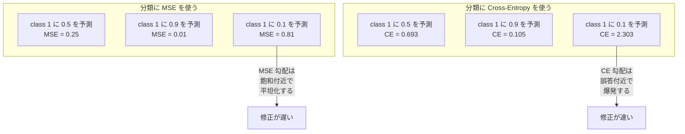
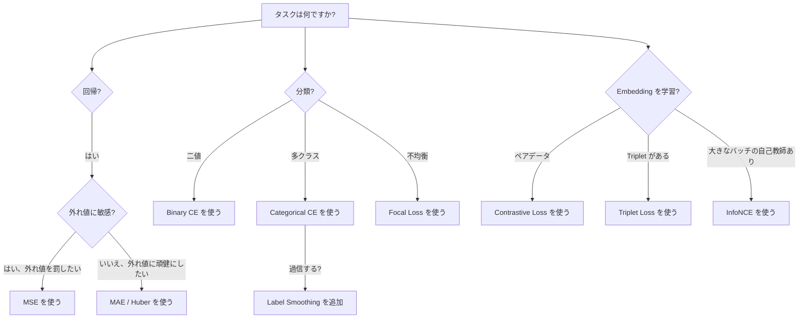
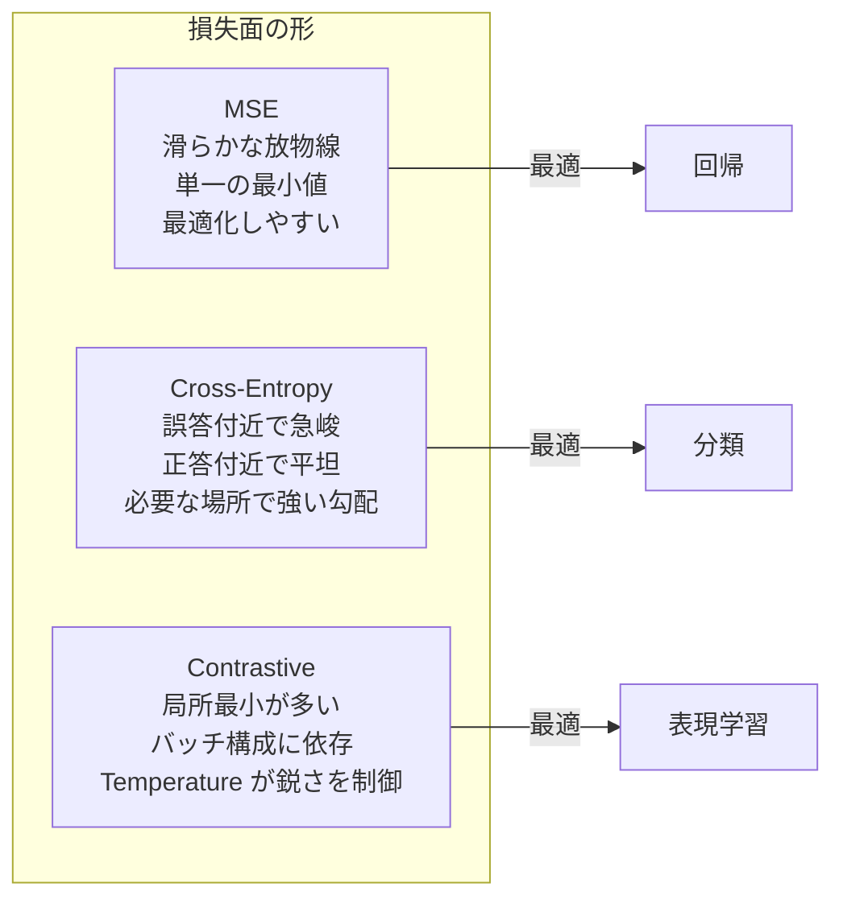

# 損失関数

> ネットワークが予測を出します。正解は違うと言っています。どれくらい間違っているのか。その数値が損失です。損失関数の選択を誤ると、モデルはまったく違うものを最適化します。

**種類:** Build
**言語:** Python
**前提:** レッスン 03.04（Activation Functions）
**時間:** 約75分

## 学習目標

- MSE、binary cross-entropy、categorical cross-entropy、contrastive loss（InfoNCE）とそれぞれの勾配をゼロから実装する
- 「すべてに 0.5 を予測する」故障モードを示し、分類で MSE が失敗する理由を説明する
- cross-entropy に label smoothing を適用し、それが過信した予測を防ぐ仕組みを説明する
- 回帰、二値分類、多クラス分類、embedding 学習タスクに対して正しい損失関数を選ぶ

## 問題

分類問題で MSE を最小化するモデルは、すべてに対して自信満々に 0.5 を予測することがあります。損失は最小化しています。同時に、まったく役に立ちません。

損失関数は、モデルが実際に最適化する唯一のものです。accuracy ではありません。F1 score でもありません。マネージャーに報告する何らかの指標でもありません。optimizer は損失関数の勾配を取り、その数値が小さくなるように重みを調整します。損失関数があなたの関心事を捉えていなければ、モデルはそれを満たすために数学的に最も安い方法を見つけます。そしてその方法は、ほぼ必ずあなたが望んだものではありません。

具体例を見てみます。二値分類タスクがあります。2クラスで、50/50 の分布です。損失に MSE を使います。モデルはすべての入力に 0.5 を予測します。平均 MSE は 0.25 で、実際には何も学習しない場合に到達できる最小値です。モデルには識別能力がありませんが、技術的には損失関数を最小化しています。cross-entropy に切り替えると、同じモデルは予測を 0 または 1 に押し出すことを強制されます。なぜなら -log(0.5) = 0.693 はひどい損失で、-log(0.99) = 0.01 は自信のある正解予測に報酬を与えるからです。損失関数の選択は、学習するモデルと、指標をすり抜けるだけのモデルの違いです。

さらに悪いこともあります。自己教師あり学習では、ラベルすらありません。contrastive loss が学習信号のすべてを定義します。何を似ていると見なすか、何を違うと見なすか、どれくらい強く引き離すかです。contrastive loss を間違えると、embedding が1点に崩壊します。すべての入力が同じベクトルに写ります。技術的にはゼロ損失。完全に無価値です。

## 概念

### Mean Squared Error（MSE）

回帰のデフォルトです。予測とターゲットの差を二乗し、全サンプルで平均します。

```
MSE = (1/n) * sum((y_pred - y_true)^2)
```

二乗が重要な理由: 大きな誤差を二次的に罰します。誤差2は誤差1の4倍のコストです。誤差10は100倍です。そのため MSE は外れ値に敏感です。たった1つの極端に間違った予測が損失を支配します。

具体的には、住宅価格を予測するモデルが、多くの家で $10,000 外す一方、1つの豪邸で $200,000 外したとします。MSE はその1つの豪邸を直そうと強く動き、ほかの99件の性能を悪化させる可能性があります。

予測に対する MSE の勾配は次のとおりです。

```
dMSE/dy_pred = (2/n) * (y_pred - y_true)
```

誤差に対して線形です。大きな誤差ほど大きな勾配を持ちます。これは回帰では利点です（大きな誤差には大きな修正が必要）。しかし分類では欠点です（自信を持った誤答は線形ではなく指数的に罰したいからです）。

### Cross-Entropy Loss

分類のための損失関数です。情報理論に根ざしており、予測された確率分布と真の分布の乖離を測ります。

**Binary Cross-Entropy（BCE）:**

```
BCE = -(y * log(p) + (1 - y) * log(1 - p))
```

ここで y は真のラベル（0 または 1）、p は予測確率です。

-log(p) が効く理由: 真のラベルが 1 で、p = 0.99 と予測すると、損失は -log(0.99) = 0.01 です。p = 0.01 と予測すると、損失は -log(0.01) = 4.6 です。この460倍の差が cross-entropy が効く理由です。自信を持った誤答を容赦なく罰し、自信を持った正答にはほとんど罰を与えません。

勾配も同じことを語っています。

```
dBCE/dp = -(y/p) + (1-y)/(1-p)
```

y = 1 で p がゼロに近いと、勾配は -1/p になり、負の無限大へ近づきます。モデルは間違いを修正するための巨大な信号を受け取ります。p が 1 に近いと、勾配はごく小さくなります。すでに正しいので、直すものがないからです。

**Categorical Cross-Entropy:**

one-hot エンコードされたターゲットを持つ多クラス分類向けです。

```
CCE = -sum(y_i * log(p_i))
```

損失に寄与するのは真のクラスだけです（他の y_i はすべてゼロだからです）。10クラスあり、正解クラスの確率が 0.1（ランダム推測）なら、損失は -log(0.1) = 2.3 です。正解クラスの確率が 0.9 なら、損失は -log(0.9) = 0.105 です。モデルは正解に確率質量を集中させるように学習します。

### 分類で MSE が失敗する理由



予測が 0 または 1 に近いとき、MSE の勾配は（sigmoid の飽和により）平坦になります。cross-entropy の勾配はこれを補償します。-log が sigmoid の平坦な領域を打ち消し、最も必要な場所で強い勾配を与えます。

### Label Smoothing

標準的な one-hot ラベルは「これは100% class 3 で、それ以外は0%」と言います。かなり強い主張です。Label smoothing はそれを柔らかくします。

```
smooth_label = (1 - alpha) * one_hot + alpha / num_classes
```

alpha = 0.1、10クラスなら、ターゲットは [0, 0, 1, 0, ...] ではなく [0.01, 0.01, 0.91, 0.01, ...] になります。モデルは 1.0 ではなく 0.91 を目標にします。

これが効く理由: softmax を通して厳密に 1.0 を出そうとするモデルは、logits を無限大へ押し上げる必要があります。これは過信を引き起こし、汎化を悪化させ、分布シフトに対して脆くします。Label smoothing は（alpha=0.1 の場合）ターゲットを 0.9 に抑え、logits を妥当な範囲に保ちます。GPT を含む現代の多くのモデルは、label smoothing またはそれに相当するものを使っています。

### Contrastive Loss

ラベルはありません。クラスもありません。入力ペアと、これらは似ているか違うか、という問いだけです。

**SimCLR スタイルの contrastive loss（NT-Xent / InfoNCE）:**

1枚の画像を取ります。それに2つの拡張ビュー（crop、rotate、color jitter）を作ります。これらが「positive pair」で、似た embedding を持つべきです。バッチ内の他のすべての画像は「negative pair」で、異なる embedding を持つべきです。

```
L = -log(exp(sim(z_i, z_j) / tau) / sum(exp(sim(z_i, z_k) / tau)))
```

ここで sim() は cosine similarity、z_i と z_j は positive pair、sum はすべての negatives にわたり、tau（temperature）は分布の鋭さを制御します。低い temperature = より難しい negatives = より強い分離です。

具体的には、batch size 256 は positive pair ごとに255個の negatives があることを意味します。Temperature tau = 0.07（SimCLR のデフォルト）です。この損失は類似度に対する softmax のように見えます。256個の選択肢の中で、positive pair の類似度を最も高くしたいわけです。

**Triplet Loss:**

3つの入力を取ります。anchor、positive（同じクラス）、negative（異なるクラス）です。

```
L = max(0, d(anchor, positive) - d(anchor, negative) + margin)
```

margin（通常 0.2-1.0）は、positive と negative の距離の間に最小ギャップを強制します。negative がすでに十分遠ければ、損失はゼロです。勾配も更新もありません。これにより訓練は効率的になりますが、慎重な triplet mining（anchor に近い hard negatives を選ぶこと）が必要です。

### Focal Loss

不均衡データセット向けです。標準の cross-entropy は、正しく分類されたすべての例を同じように扱います。Focal loss は簡単な例の重みを下げます。

```
FL = -alpha * (1 - p_t)^gamma * log(p_t)
```

ここで p_t は真のクラスの予測確率で、gamma は focus の強さを制御します。gamma = 0 なら標準の cross-entropy です。gamma = 2（デフォルト）では次のようになります。

- 簡単な例（p_t = 0.9）: weight = (0.1)^2 = 0.01。実質的に無視されます。
- 難しい例（p_t = 0.1）: weight = (0.9)^2 = 0.81。十分な勾配信号があります。

Focal loss は、候補領域の99%が background（簡単な負例）である物体検出のために Lin らが導入しました。focal loss がないと、モデルは簡単な background 例に埋もれ、物体を検出することを学べません。これを使うと、モデルは重要な hard で曖昧なケースに容量を集中できます。

### 損失関数の決定木



### 損失地形



## 作ってみる

### Step 1: MSE とその勾配

```python
def mse(predictions, targets):
    n = len(predictions)
    total = 0.0
    for p, t in zip(predictions, targets):
        total += (p - t) ** 2
    return total / n

def mse_gradient(predictions, targets):
    n = len(predictions)
    grads = []
    for p, t in zip(predictions, targets):
        grads.append(2.0 * (p - t) / n)
    return grads
```

### Step 2: Binary Cross-Entropy

log(0) 問題は現実に起きます。モデルが正例に対してちょうど 0 を予測すると、log(0) = 負の無限大 です。clipping はこれを防ぎます。

```python
import math

def binary_cross_entropy(predictions, targets, eps=1e-15):
    n = len(predictions)
    total = 0.0
    for p, t in zip(predictions, targets):
        p_clipped = max(eps, min(1 - eps, p))
        total += -(t * math.log(p_clipped) + (1 - t) * math.log(1 - p_clipped))
    return total / n

def bce_gradient(predictions, targets, eps=1e-15):
    grads = []
    for p, t in zip(predictions, targets):
        p_clipped = max(eps, min(1 - eps, p))
        grads.append(-(t / p_clipped) + (1 - t) / (1 - p_clipped))
    return grads
```

### Step 3: Softmax 付き Categorical Cross-Entropy

Softmax は生の logits を確率へ変換します。その後、one-hot ターゲットに対して cross-entropy を計算します。

```python
def softmax(logits):
    max_val = max(logits)
    exps = [math.exp(x - max_val) for x in logits]
    total = sum(exps)
    return [e / total for e in exps]

def categorical_cross_entropy(logits, target_index, eps=1e-15):
    probs = softmax(logits)
    p = max(eps, probs[target_index])
    return -math.log(p)

def cce_gradient(logits, target_index):
    probs = softmax(logits)
    grads = list(probs)
    grads[target_index] -= 1.0
    return grads
```

softmax + cross-entropy の勾配は美しく簡約されます。真のクラスでは（予測確率 - 1）、それ以外の全クラスでは（予測確率）だけです。この洗練された簡約は偶然ではありません。softmax と cross-entropy が組で使われる理由です。

### Step 4: Label Smoothing

```python
def label_smoothed_cce(logits, target_index, num_classes, alpha=0.1, eps=1e-15):
    probs = softmax(logits)
    loss = 0.0
    for i in range(num_classes):
        if i == target_index:
            smooth_target = 1.0 - alpha + alpha / num_classes
        else:
            smooth_target = alpha / num_classes
        p = max(eps, probs[i])
        loss += -smooth_target * math.log(p)
    return loss
```

### Step 5: Contrastive Loss（簡略化した InfoNCE）

```python
def cosine_similarity(a, b):
    dot = sum(x * y for x, y in zip(a, b))
    norm_a = math.sqrt(sum(x * x for x in a))
    norm_b = math.sqrt(sum(x * x for x in b))
    if norm_a < 1e-10 or norm_b < 1e-10:
        return 0.0
    return dot / (norm_a * norm_b)

def contrastive_loss(anchor, positive, negatives, temperature=0.07):
    sim_pos = cosine_similarity(anchor, positive) / temperature
    sim_negs = [cosine_similarity(anchor, neg) / temperature for neg in negatives]

    max_sim = max(sim_pos, max(sim_negs)) if sim_negs else sim_pos
    exp_pos = math.exp(sim_pos - max_sim)
    exp_negs = [math.exp(s - max_sim) for s in sim_negs]
    total_exp = exp_pos + sum(exp_negs)

    return -math.log(max(1e-15, exp_pos / total_exp))
```

### Step 6: 分類における MSE vs Cross-Entropy

レッスン04の同じネットワーク（円データセット）を、両方の損失関数で訓練します。cross-entropy のほうが速く収束する様子を観察します。

```python
import random

def sigmoid(x):
    x = max(-500, min(500, x))
    return 1.0 / (1.0 + math.exp(-x))

def make_circle_data(n=200, seed=42):
    random.seed(seed)
    data = []
    for _ in range(n):
        x = random.uniform(-2, 2)
        y = random.uniform(-2, 2)
        label = 1.0 if x * x + y * y < 1.5 else 0.0
        data.append(([x, y], label))
    return data


class LossComparisonNetwork:
    def __init__(self, loss_type="bce", hidden_size=8, lr=0.1):
        random.seed(0)
        self.loss_type = loss_type
        self.lr = lr
        self.hidden_size = hidden_size

        self.w1 = [[random.gauss(0, 0.5) for _ in range(2)] for _ in range(hidden_size)]
        self.b1 = [0.0] * hidden_size
        self.w2 = [random.gauss(0, 0.5) for _ in range(hidden_size)]
        self.b2 = 0.0

    def forward(self, x):
        self.x = x
        self.z1 = []
        self.h = []
        for i in range(self.hidden_size):
            z = self.w1[i][0] * x[0] + self.w1[i][1] * x[1] + self.b1[i]
            self.z1.append(z)
            self.h.append(max(0.0, z))

        self.z2 = sum(self.w2[i] * self.h[i] for i in range(self.hidden_size)) + self.b2
        self.out = sigmoid(self.z2)
        return self.out

    def backward(self, target):
        if self.loss_type == "mse":
            d_loss = 2.0 * (self.out - target)
        else:
            eps = 1e-15
            p = max(eps, min(1 - eps, self.out))
            d_loss = -(target / p) + (1 - target) / (1 - p)

        d_sigmoid = self.out * (1 - self.out)
        d_out = d_loss * d_sigmoid

        for i in range(self.hidden_size):
            d_relu = 1.0 if self.z1[i] > 0 else 0.0
            d_h = d_out * self.w2[i] * d_relu
            self.w2[i] -= self.lr * d_out * self.h[i]
            for j in range(2):
                self.w1[i][j] -= self.lr * d_h * self.x[j]
            self.b1[i] -= self.lr * d_h
        self.b2 -= self.lr * d_out

    def compute_loss(self, pred, target):
        if self.loss_type == "mse":
            return (pred - target) ** 2
        else:
            eps = 1e-15
            p = max(eps, min(1 - eps, pred))
            return -(target * math.log(p) + (1 - target) * math.log(1 - p))

    def train(self, data, epochs=200):
        losses = []
        for epoch in range(epochs):
            total_loss = 0.0
            correct = 0
            for x, y in data:
                pred = self.forward(x)
                self.backward(y)
                total_loss += self.compute_loss(pred, y)
                if (pred >= 0.5) == (y >= 0.5):
                    correct += 1
            avg_loss = total_loss / len(data)
            accuracy = correct / len(data) * 100
            losses.append((avg_loss, accuracy))
            if epoch % 50 == 0 or epoch == epochs - 1:
                print(f"    Epoch {epoch:3d}: loss={avg_loss:.4f}, accuracy={accuracy:.1f}%")
        return losses
```

## 使ってみる

PyTorch は数値安定性を組み込んだ標準の損失関数をすべて提供しています。

```python
import torch
import torch.nn as nn
import torch.nn.functional as F

predictions = torch.tensor([0.9, 0.1, 0.7], requires_grad=True)
targets = torch.tensor([1.0, 0.0, 1.0])

mse_loss = F.mse_loss(predictions, targets)
bce_loss = F.binary_cross_entropy(predictions, targets)

logits = torch.randn(4, 10)
labels = torch.tensor([3, 7, 1, 9])
ce_loss = F.cross_entropy(logits, labels)
ce_smooth = F.cross_entropy(logits, labels, label_smoothing=0.1)
```

`F.cross_entropy` を使ってください（`F.nll_loss` と手動 softmax の組み合わせではありません）。これは log-softmax と negative log-likelihood を、数値的に安定した1つの操作にまとめています。softmax を別に適用してから log を取る方法は安定性が低く、大きな指数の引き算で精度を失います。

contrastive learning では、多くのチームが独自実装または `lightly` や `pytorch-metric-learning` のようなライブラリを使います。中核のループは常に同じです。ペアごとの類似度を計算し、positives と negatives に対する softmax を作り、バックプロパゲーションします。

## 成果物

このレッスンで作るもの:
- `outputs/prompt-loss-function-selector.md` -- 正しい損失関数を選ぶための再利用可能なプロンプト
- `outputs/prompt-loss-debugger.md` -- 損失曲線がおかしいときの診断プロンプト

## 演習

1. Huber loss（smooth L1 loss）を実装してください。小さな誤差には MSE、大きな誤差には MAE として振る舞います。y = sin(x) を予測する回帰ネットワークを、訓練ターゲットの5%にランダムノイズ（外れ値）を加えた条件で MSE と Huber で訓練してください。最終的なテスト誤差を比較してください。

2. 二値分類の訓練ループに focal loss を追加してください。不均衡データセット（90% が class 0、10% が class 1）を作ります。200 epochs 後の少数クラス recall で、標準 BCE と focal loss（gamma=2）を比較してください。

3. semi-hard negative mining 付きの triplet loss を実装してください。5クラスの2D embedding データを生成します。各 anchor について、positive よりは遠いが最も難しい negative（semi-hard）を見つけます。ランダムな triplet 選択と収束を比較してください。

4. MSE vs cross-entropy 比較を実行しつつ、訓練中の各層の勾配の大きさを追跡してください。epoch ごとの平均勾配ノルムをプロットします。モデルが最も不確実な初期 epoch で、cross-entropy がより大きな勾配を生むことを確認してください。

5. KL divergence loss を実装し、真の分布が one-hot のときに KL(true || predicted) を最小化すると cross-entropy と同じ勾配になることを確認してください。次に、teacher model の softmax 出力から来る「真の」分布のような soft targets（knowledge distillation）を試してください。

## 重要用語

| 用語 | よく言われること | 実際の意味 |
|------|----------------|------------|
| Loss function | 「モデルがどれくらい間違っているか」 | 予測とターゲットを optimizer が最小化するスカラーへ写す微分可能な関数 |
| MSE | 「平均二乗誤差」 | 予測とターゲットの差の二乗平均。大きな誤差を二次的に罰する |
| Cross-entropy | 「分類の損失」 | -log(p) を使って、予測確率分布と真の分布の乖離を測る |
| Binary cross-entropy | 「BCE」 | 2クラス用の cross-entropy: -(y*log(p) + (1-y)*log(1-p)) |
| Label smoothing | 「ターゲットを柔らかくする」 | hard な 0/1 ターゲットを soft な値（例: 0.1/0.9）に置き換え、過信を防ぎ汎化を改善する |
| Contrastive loss | 「近づけて、引き離す」 | embedding 空間で似たペアを近く、似ていないペアを遠くすることで表現を学習する損失 |
| InfoNCE | 「CLIP/SimCLR の損失」 | 類似度スコアに対する正規化された temperature-scaled cross-entropy。contrastive learning を分類として扱う |
| Focal loss | 「不均衡データ対策」 | (1-p_t)^gamma で重み付けされた cross-entropy。簡単な例の重みを下げ、難しい例に集中する |
| Triplet loss | 「Anchor-positive-negative」 | embedding 空間で、anchor を negative より少なくとも margin 分だけ positive に近づける |
| Temperature | 「鋭さのノブ」 | logits/類似度に対するスカラーの除数で、結果の分布の尖り具合を制御する。低いほど鋭い |

## 参考資料

- Lin et al., "Focal Loss for Dense Object Detection" (2017) -- 物体検出（RetinaNet）における極端なクラス不均衡を扱うために focal loss を導入した論文
- Chen et al., "A Simple Framework for Contrastive Learning of Visual Representations" (SimCLR, 2020) -- NT-Xent loss を伴う現代的な contrastive learning パイプラインを定義した論文
- Szegedy et al., "Rethinking the Inception Architecture" (2016) -- 正則化技法として label smoothing を導入し、現在では多くの大規模モデルで標準になっている論文
- Hinton et al., "Distilling the Knowledge in a Neural Network" (2015) -- soft targets と KL divergence を使う knowledge distillation。モデル圧縮の基礎となる論文
