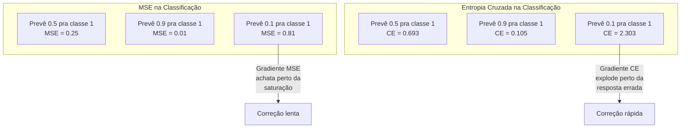
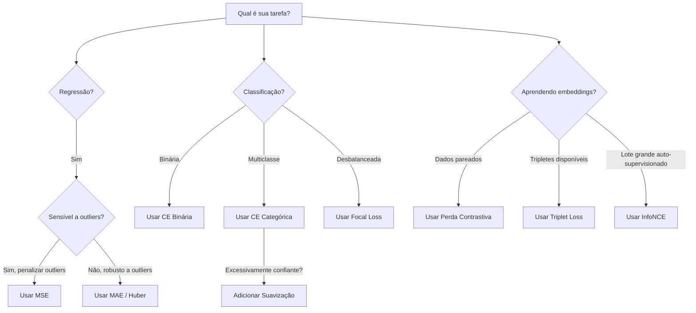

# Funções de Perda

> Sua rede faz uma previsão. A verdade diz outra coisa. Quão errado está? Esse número é a perda. Escolha a função de perda errada e seu modelo otimiza pra coisa completamente diferente.

**Tipo:** Construção
**Linguagens:** Python
**Pré-requisitos:** Aula 03.04 (Funções de Ativação)
**Tempo:** ~75 minutos

## Objetivos de Aprendizado

- Implementar MSE, entropia cruzada binária, entropia cruzada categórica e perda contrastiva (InfoNCE) do zero com seus gradientes
- Explicar por que MSE falha pra classificação demonstrando o modo de falha "prever 0.5 pra tudo"
- Aplicar suavização de rótulos à entropia cruzada e descrever como previne previsões excessivamente confiantes
- Escolher a função de perda correta pra regressão, classificação binária, classificação multiclasse e tarefas de aprendizado de embeddings

## O Problema

Um modelo minimizando MSE num problema de classificação vai confiantemente prever 0.5 pra tudo. Está minimizando a perda. Também é inútil.

A função de perda é a única coisa que seu modelo realmente otimiza. Não acurácia. Não F1 score. Não qualquer métrica que você reporta pro seu gestor. O otimizador pega o gradiente da função de perda e ajusta pesos pra fazer esse número menor. Se a função de perda não captura o que você se importa, o modelo vai encontrar o caminho matematicamente mais barato pra satisfazê-la, e esse caminho quase nunca é o que você queria.

Exemplo concreto. Você tem uma tarefa de classificação binária. Duas classes, divisão 50/50. Usa MSE como perda. O modelo prevê 0.5 pra cada entrada. O MSE médio é 0.25, que é o mínimo possível sem aprender nada. O modelo tem zero capacidade discriminativa mas tecnicamente minimizou sua função de perda. Troque pra entropia cruzada e o mesmo modelo é forçado a empurrar previsões pra 0 ou 1, porque -log(0.5) = 0.693 é uma perda terrível, enquanto -log(0.99) = 0.01 recompensa previsões corretas confiantes.

Piora. No aprendizado auto-supervisionado, você nem tem rótulos. A perda contrastiva define o sinal de aprendizado inteiramente: o que conta como similar, o que conta como diferente e o quão forte o modelo deve empurrá-los. Erre a perda contrastiva e seus embeddings colapsam pra um único ponto — toda entrada mapeia pro mesmo vetor. Tecnicamente perda zero. Completamente inútil.

## O Conceito

### Erro Quadrático Médio (MSE)

O padrão pra regressão. Compute a diferença quadrada entre previsão e alvo, média em todas as amostras.

```
MSE = (1/n) * sum((y_pred - y_true)^2)
```

Por que quadrar importa: penaliza erros grandes quadraticamente. Um erro de 2 custa 4x mais que um erro de 1. Um erro de 10 custa 100x. Isso torna MSE sensível a outliers — uma previsão errada domina a perda.

Números reais: se seu modelo prevê preços de casas e erra em $10.000 na maioria mas erra em $200.000 numa mansão, o MSE vai agressivamente tentar corrigir aquela mansão, potencialmente prejudicando performance nas outras 99 casas.

O gradiente do MSE em relação a uma previsão é:

```
dMSE/dy_pred = (2/n) * (y_pred - y_true)
```

Linear no erro. Erros maiores recebem gradientes maiores. Isso é uma funcionalidade pra regressão (erros grandes precisam de grandes correções) e um bug pra classificação (você quer penalizar respostas erradas confiantes exponencialmente, não linearmente).

### Perda de Entropia Cruzada

A função de perda pra classificação. Enraizada na teoria da informação — mede a divergência entre a distribuição de probabilidade prevista e a verdadeira.

**Entropia Cruzada Binária (BCE):**

```
BCE = -(y * log(p) + (1 - y) * log(1 - p))
```

Onde y é o rótulo verdadeiro (0 ou 1) e p é a probabilidade prevista.

Por que -log(p) funciona: quando o rótulo verdadeiro é 1 e você prevê p = 0.99, a perda é -log(0.99) = 0.01. Quando prevê p = 0.01, a perda é -log(0.01) = 4.6. Essa diferença de 460x é por que entropia cruzada funciona. Ela pune brutalmente previsões erradas confiantes enquanto mal penaliza as corretas.

**Entropia Cruzada Categórica:**

Pra classificação multiclasse com alvos one-hot.

```
CCE = -sum(y_i * log(p_i))
```

Só a classe verdadeira contribui pra perda (porque todos os outros y_i são zero).

### Por que MSE Falha pra Classificação



Gradientes de MSE achatam quando previsões estão perto de 0 ou 1 (devido à saturação da sigmoid). Gradientes de entropia cruzada compensam isso — o -log cancela as regiões planas da sigmoid, dando gradientes fortes exatamente onde mais precisam.

### Suavização de Rótulos

Rótulos one-hot padrão dizem "isso é 100% classe 3 e 0% tudo o mais." Isso é uma afirmação forte. Suavização de rótulos suaviza isso:

```
smooth_label = (1 - alpha) * one_hot + alpha / num_classes
```

Com alpha = 0.1 e 10 classes: em vez de [0, 0, 1, 0, ...], o alvo vira [0.01, 0.01, 0.91, 0.01, ...]. O modelo almeja 0.91 em vez de 1.0.

Por que funciona: um modelo tentando produzir exatamente 1.0 através de softmax precisa empurrar logits pra infinito. Isso causa excesso de confiança, prejudica generalização e torna o modelo frágil a mudanças de distribuição. Suavização de rótulos coloca um teto no alvo em 0.9 (com alpha=0.1), mantendo logits numa faixa razoável.

### Perda Contrastiva

Sem rótulos. Sem classes. Só pares de entradas e a pergunta: esses são similares ou diferentes?

**Perda contrastiva estilo SimCLR (NT-Xent / InfoNCE):**

Pega uma imagem. Cria duas views augmentadas dela (recorte, rotação, tremulação de cor). Esses são o "par positivo" — devem ter embeddings similares. Toda outra imagem do lote forma um "par negativo" — devem ter embeddings diferentes.

```
L = -log(exp(sim(z_i, z_j) / tau) / sum(exp(sim(z_i, z_k) / tau)))
```

Onde sim() é similaridade cosseno, z_i e z_j são o par positivo, a soma é sobre todos os negativos e tau (temperatura) controla o quão afiada é a distribuição.

### Árvore de Decisão de Funções de Perda



## Construa

### Passo 1: MSE e Seu Gradiente

```python
def mse(predictions, targets):
    n = len(predictions)
    total = 0.0
    for p, t in zip(predictions, targets):
        total += (p - t) ** 2
    return total / n

def mse_gradient(predictions, targets):
    n = len(predictions)
    grads = []
    for p, t in zip(predictions, targets):
        grads.append(2.0 * (p - t) / n)
    return grads
```

### Passo 2: Entropia Cruzada Binária

O problema do log(0) é real. Se o modelo prevê exatamente 0 pra um exemplo positivo, log(0) = infinito negativo. Clipping previne isso.

```python
import math

def binary_cross_entropy(predictions, targets, eps=1e-15):
    n = len(predictions)
    total = 0.0
    for p, t in zip(predictions, targets):
        p_clipped = max(eps, min(1 - eps, p))
        total += -(t * math.log(p_clipped) + (1 - t) * math.log(1 - p_clipped))
    return total / n

def bce_gradient(predictions, targets, eps=1e-15):
    grads = []
    for p, t in zip(predictions, targets):
        p_clipped = max(eps, min(1 - eps, p))
        grads.append(-(t / p_clipped) + (1 - t) / (1 - p_clipped))
    return grads
```

### Passo 3: Entropia Cruzada Categórica com Softmax

```python
def softmax(logits):
    max_val = max(logits)
    exps = [math.exp(x - max_val) for x in logits]
    total = sum(exps)
    return [e / total for e in exps]

def categorical_cross_entropy(logits, target_index, eps=1e-15):
    probs = softmax(logits)
    p = max(eps, probs[target_index])
    return -math.log(p)

def cce_gradient(logits, target_index):
    probs = softmax(logits)
    grads = list(probs)
    grads[target_index] -= 1.0
    return grads
```

O gradiente de softmax + entropia cruzada se simplifica lindamente: é só (probabilidade prevista - 1) pra classe verdadeira e (probabilidade prevista) pra todas as outras classes.

### Passo 4: Suavização de Rótulos

```python
def label_smoothed_cce(logits, target_index, num_classes, alpha=0.1, eps=1e-15):
    probs = softmax(logits)
    loss = 0.0
    for i in range(num_classes):
        if i == target_index:
            smooth_target = 1.0 - alpha + alpha / num_classes
        else:
            smooth_target = alpha / num_classes
        p = max(eps, probs[i])
        loss += -smooth_target * math.log(p)
    return loss
```

### Passo 5: Perda Contrastiva (InfoNCE Simplificada)

```python
def cosine_similarity(a, b):
    dot = sum(x * y for x, y in zip(a, b))
    norm_a = math.sqrt(sum(x * x for x in a))
    norm_b = math.sqrt(sum(x * x for x in b))
    if norm_a < 1e-10 or norm_b < 1e-10:
        return 0.0
    return dot / (norm_a * norm_b)

def contrastive_loss(anchor, positive, negatives, temperature=0.07):
    sim_pos = cosine_similarity(anchor, positive) / temperature
    sim_negs = [cosine_similarity(anchor, neg) / temperature for neg in negatives]

    max_sim = max(sim_pos, max(sim_negs)) if sim_negs else sim_pos
    exp_pos = math.exp(sim_pos - max_sim)
    exp_negs = [math.exp(s - max_sim) for s in sim_negs]
    total_exp = exp_pos + sum(exp_negs)

    return -math.log(max(1e-15, exp_pos / total_exp))
```

## Use

PyTorch fornece todas as funções de perda padrão com estabilidade numérica embutida:

```python
import torch
import torch.nn as nn
import torch.nn.functional as F

predictions = torch.tensor([0.9, 0.1, 0.7], requires_grad=True)
targets = torch.tensor([1.0, 0.0, 1.0])

mse_loss = F.mse_loss(predictions, targets)
bce_loss = F.binary_cross_entropy(predictions, targets)

logits = torch.randn(4, 10)
rótulos = torch.tensor([3, 7, 1, 9])
ce_loss = F.cross_entropy(logits, rótulos)
ce_smooth = F.cross_entropy(logits, rótulos, label_smoothing=0.1)
```

Use `F.cross_entropy` (não `F.nll_loss` mais softmax manual). Ela combina log-softmax e log-verossimilhança negativa numa única operação numericamente estável.

## Entregue

Esta aula produz:
- `outputs/prompt-loss-function-selector.md` — um prompt reutilizável pra escolher a função de perda certa
- `outputs/prompt-loss-debugger.md` — um prompt diagnóstico pra quando sua curva de perda parece errada

## Exercícios

1. Implemente Huber loss (perda L1 suave), que é MSE pra erros pequenos e MAE pra erros grandes. Treine uma rede de regressão predizendo y = sin(x) com MSE vs Huber quando 5% dos alvos de treino têm ruído aleatório (outliers). Compare o erro final de teste.

2. Adicione focal loss ao loop de treino de classificação binária. Crie um dataset desbalanceado (90% classe 0, 10% classe 1). Compare BCE padrão vs focal loss (gamma=2) no recall da classe minoritária após 200 épocas.

3. Implemente triplet loss com mineração de negativos semi-difíceis. Gere dados de embedding 2D pra 5 classes. Para cada âncora, encontre o negativo mais difícil que ainda é mais distante que o positivo (semi-difícil). Compare convergência com seleção aleatória de tripletes.

4. Execute a comparação MSE vs entropia cruzada mas rastreie magnitudes de gradiente em cada camada durante o treino. Plote a norma média do gradiente por época. Verifique que entropia cruzada produz gradientes maiores nas primeiras épocas quando o modelo está mais incerto.

5. Implemente perda de divergência KL e verifique que minimizar KL(verdadeiro || previsto) dá os mesmos gradientes que entropia cruzada quando a distribuição verdadeira é one-hot. Então tente alvos suaves (como destilação de conhecimento) onde a distribuição "verdadeira" vem da saída softmax de um modelo professor.

## Termos-Chave

| Termo | O que o pessoal diz | O que realmente significa |
|-------|---------------------|--------------------------|
| Função de perda | "Quão errado o modelo está" | Uma função diferenciável que mapeia previsões e alvos pra um escalar que o otimizador minimiza |
| MSE | "Erro quadrático médio" | Média das diferenças quadradas entre previsões e alvos; penaliza erros grandes quadraticamente |
| Entropia cruzada | "A perda de classificação" | Mede divergência entre distribuição de probabilidade prevista e verdadeira usando -log(p) |
| Entropia cruzada binária | "BCE" | Entropia cruzada pra duas classes: -(y*log(p) + (1-y)*log(1-p)) |
| Suavização de rótulos | "Suavizando os alvos" | Substituir alvos duros 0/1 por valores suaves (ex: 0.1/0.9) pra prevenir excesso de confiança e melhorar generalização |
| Perda contrastiva | "Juntar, afastar" | Uma perda que aprende representações tornando pares similares próximos e pares dissimilares longes no espaço de embedding |
| InfoNCE | "A perda CLIP/SimCLR" | Entropia cruzada normalizada e escalada por temperatura sobre pontuações de similaridade; trata aprendizado contrastivo como classificação |
| Focal loss | "A correção pra dados desbalanceados" | Entropia cruzada ponderada por (1-p_t)^gamma pra diminuir peso de exemplos fáceis e focar nos difíceis |
| Triplet loss | "Âncora-positivo-negativo" | Empurra âncora mais perto do positivo que do negativo por pelo menos uma margem no espaço de embedding |
| Temperatura | "Botão de afiamento" | Um divisor escalar nos logits/similaridades que controla o quão pontuda é a distribuição resultante; menor = mais afiada |

## Leituras Complementares

- Lin et al., "Focal Loss for Dense Object Detection" (2017) — introduziu focal loss pra lidar com desbalanceamento extremo de classes em detecção de objetos (RetinaNet)
- Chen et al., "A Simple Framework for Contrastive Learning of Visual Representations" (SimCLR, 2020) — definiu o pipeline moderno de aprendizado contrastivo com perda NT-Xent
- Szegedy et al., "Rethinking the Inception Architecture" (2016) — introduziu suavização de rótulos como técnica de regularização
- Hinton et al., "Distilling the Knowledge in a Neural Network" (2015) — destilação de conhecimento usando alvos suaves e divergência KL
