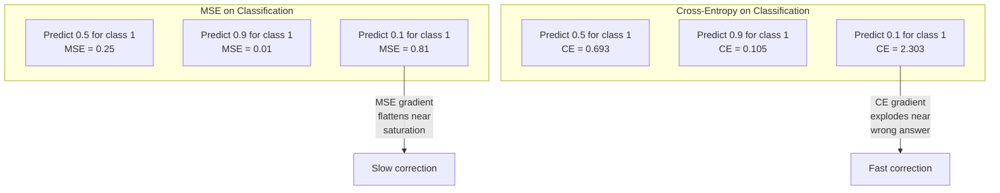
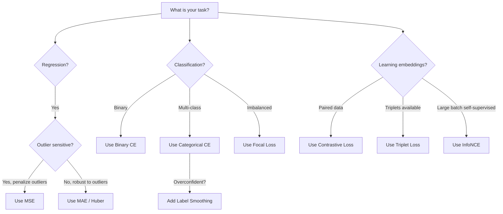
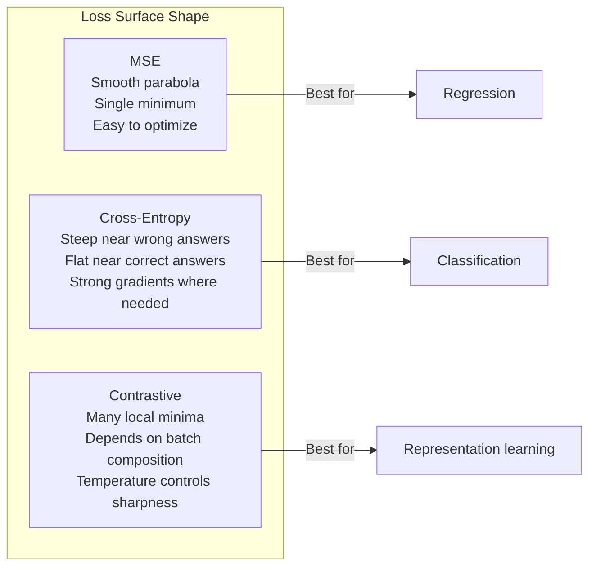

# Loss Function'ler

> Ağınız bir tahminde bulunur. Temel gerçek aksini söylüyor. Ne kadar yanlış? Bu sayı kayıptır. Yanlış loss function'yi seçtiğinizde modeliniz tamamen yanlış şeye göre optimize edilir.

**Tür:** Yapım
**Diller:** Python
**Önkoşullar:** Ders 03.04 (Etkinleştirme İşlevleri)
**Süre:** ~75 dakika

## Öğrenme Hedefleri

- gradient'leriyle MSE, ikili çapraz entropi, kategorik çapraz entropi ve karşılaştırmalı kaybı (InfoNCE) sıfırdan uygulayın
- "Her şey için 0,5 tahmin et" başarısızlık modunu göstererek MSE'nin sınıflandırmada neden başarısız olduğunu açıklayın
- Çapraz entropiye etiket yumuşatma uygulayın ve bunun aşırı güvenli tahminleri nasıl önlediğini açıklayın
- Regresyon, ikili sınıflandırma, çok sınıflı sınıflandırma ve embedding öğrenme görevleri için doğru loss function'yi seçin

## Sorun

Bir sınıflandırma probleminde MSE'yi en aza indiren bir model, her şey için güvenle 0,5'i tahmin edecektir. Kayıpları en aza indiriyor. Aynı zamanda işe yaramaz.

loss function, modelinizin gerçekten optimize ettiği tek şeydir. Doğruluk değil. F1 puanı değil. Yöneticinize rapor ettiğiniz ölçüm ne olursa olsun değil. Optimize edici, loss function'nin gradient'sini alır ve bu sayıyı küçültmek için ağırlıkları ayarlar. loss function önemsediğiniz şeyi yakalayamazsa, model onu tatmin etmenin matematiksel olarak en ucuz yolunu bulacaktır ve bu yol neredeyse hiçbir zaman istediğiniz şey değildir.

İşte somut bir örnek. İkili sınıflandırma göreviniz var. İki sınıf, 50/50 bölünmüş. MSE'yi kaybınız olarak kullanırsınız. Model her bir girdi için 0,5 öngörüyor. Ortalama MSE 0,25'tir ve bu aslında hiçbir şey öğrenmeden mümkün olan minimum değerdir. Model sıfır ayırt etme yeteneğine sahiptir ancak loss function'nizi teknik olarak en aza indirmiştir. Çapraz entropiye geçin ve aynı model tahminleri 0 veya 1'e doğru itmek zorunda kalır, çünkü -log(0,5) = 0,693 korkunç bir kayıptır, -log(0,99) = 0,01 ise kendinden emin doğru tahminleri ödüllendirir. loss function'nin seçimi, öğrenen bir model ile metriği oynayan bir model arasındaki farktır.

Daha da kötüleşiyor. Kendi kendini denetleyen öğrenmede etiketleriniz bile yoktur. Karşılaştırmalı kayıp, öğrenme sinyalini tamamen tanımlar: neyin benzer olduğu, neyin farklı olduğu ve modelin bunları ne kadar birbirinden ayırması gerektiği. Karşılaştırmalı kaybı yanlış anladığınızda embedding'leriniz tek bir noktaya çöker; her giriş aynı vektörle eşleşir. Teknik olarak sıfır kayıp. Tamamen değersiz.

## Konsept

### Ortalama Kare Hatası (MSE)

Regresyon için varsayılan. Tahmin ile hedef arasındaki kare farkını, tüm örneklerin ortalamasını hesaplayın.

```
MSE = (1/n) * sum((y_pred - y_true)^2)
```

Kare alma neden önemlidir: Büyük hataları karesel olarak cezalandırır. 2'lik bir hata, 1'lik bir hatanın maliyetinin 4 katıdır. 10'luk bir hatanın maliyeti ise 100x'tir. Bu, MSE'yi aykırı değerlere karşı duyarlı hale getirir; son derece yanlış tek bir tahmin, kayba hakim olur.

Gerçek sayılar: Eğer modeliniz konut fiyatlarını öngörüyorsa ve bir malikanede $10,000 on most houses but off by $200.000 sapma varsa, MSE agresif bir şekilde bu malikaneyi onarmaya çalışacak ve potansiyel olarak diğer 99 evin performansına zarar verecektir.

Bir tahminle ilgili olarak MSE'nin gradient'si şöyledir:

```
dMSE/dy_pred = (2/n) * (y_pred - y_true)
```

Hatada doğrusal. Daha büyük hatalar daha da büyür gradient'ler. Bu, regresyona yönelik bir özelliktir (büyük hatalar büyük düzeltmeler gerektirir) ve sınıflandırmaya yönelik bir hatadır (kendinden emin yanlış yanıtları doğrusal olarak değil, katlanarak cezalandırmak istersiniz).

### Çapraz Entropi Kaybı

Sınıflandırma için loss function. Bilgi teorisine dayanan, tahmin edilen olasılık dağılımı ile gerçek dağılım arasındaki farkı ölçer.

**İkili Çapraz Entropi (M.Ö.):**

```
BCE = -(y * log(p) + (1 - y) * log(1 - p))
```

Burada y gerçek etikettir (0 veya 1) ve p tahmin edilen olasılıktır.

-log(p) neden çalışıyor: doğru etiket 1 olduğunda ve p = 0,99'u tahmin ettiğinizde kayıp -log(0,99) = 0,01 olur. P = 0,01'i tahmin ettiğinizde kayıp -log(0,01) = 4,6 olur. Bu 460x fark, çapraz entropinin işe yaramasının nedenidir. Kendinden emin yanlış tahminleri acımasızca cezalandırırken, kendinden emin doğru tahminleri zar zor cezalandırıyor.

gradient aynı hikayeyi anlatıyor:

```
dBCE/dp = -(y/p) + (1-y)/(1-p)
```

y = 1 ve p sıfıra yakın olduğunda, gradient -1/p'dir ve negatif sonsuza yaklaşır. Model, hatasını düzeltmek için muazzam bir sinyal alıyor. p 1'e yakın olduğunda gradient küçüktür. Zaten doğru, düzeltilecek bir şey yok.

**Kategorik Çapraz Entropi:**

Tek sıcak kodlanmış hedeflerle çok sınıflı sınıflandırma için.

```
CCE = -sum(y_i * log(p_i))
```

Yalnızca gerçek sınıf kayba katkıda bulunur (çünkü diğer tüm y_i'ler sıfırdır). 10 sınıf varsa ve doğru sınıfın olasılığı 0,1 ise (rastgele tahmin), kayıp -log(0,1) = 2,3 olur. Doğru sınıfın olasılığı 0,9 ise kayıp -log(0,9) = 0,105 olur. Model olasılık kütlesini doğru cevaba yoğunlaştırmayı öğrenir.

### MSE Sınıflandırmada Neden Başarısız?



Tahminler 0 veya 1'e yakın olduğunda (sigmoid doygunluğu nedeniyle) MSE gradient'ler düzleşir. Çapraz entropi gradient'ler bunu telafi eder; -log, sigmoidin düz bölgelerini iptal ederek tam olarak en çok ihtiyaç duyulan yerde güçlü gradient'ler sağlar.

### Etiket Düzeltme

Standart tek sıcak etiketler "bunun %100 sınıf 3 ve diğer her şeyin %0 olduğunu" belirtir. Bu güçlü bir iddia. Etiket yumuşatma onu yumuşatır:

```
smooth_label = (1 - alpha) * one_hot + alpha / num_classes
```

Alfa = 0,1 ve 10 sınıflarında: [0, 0, 1, 0, ...] yerine hedef [0,01, 0,01, 0,91, 0,01, ...] olur. Model 1,0 yerine 0,91'i hedefliyor.

Bu neden işe yarıyor: softmax aracılığıyla tam olarak 1,0 çıktı vermeye çalışan bir modelin logitleri sonsuza itmesi gerekiyor. Bu aşırı güvene neden olur, genellemeye zarar verir ve modeli dağıtım değişikliğine karşı kırılgan hale getirir. Etiket yumuşatma, logitleri makul bir aralıkta tutarak hedefi 0,9'da (alfa=0,1 ile) sınırlandırır. GPT ve çoğu modern model, etiket yumuşatma veya eşdeğerini kullanır.

### Karşılaştırmalı Kayıp

Etiket yok. Ders yok. Sadece girdi çiftleri ve şu soru: Bunlar benzer mi yoksa farklı mı?

**SimCLR tarzı karşılaştırmalı kayıp (NT-Xent / InfoNCE):**

Bir resim çekin. Bunun iki genişletilmiş görünümünü oluşturun (kırpma, döndürme, renk değişimi). Bunlar "pozitif çifttir"; benzer embedding'lere sahip olmaları gerekir. Gruptaki diğer tüm görüntüler bir "negatif çift" oluşturur; farklı embedding'lere sahip olmaları gerekir.

```
L = -log(exp(sim(z_i, z_j) / tau) / sum(exp(sim(z_i, z_k) / tau)))
```

sim() kosinüs benzerliği olduğunda z_i ve z_j pozitif çifttir, toplam tüm negatiflerin üzerindendir ve tau (sıcaklık) dağılımın ne kadar keskin olduğunu kontrol eder. Daha düşük sıcaklık = daha sert negatifler = daha agresif ayırma.

Gerçek sayılar: parti büyüklüğü 256, pozitif çift başına 255 negatif anlamına gelir. Sıcaklık tau = 0,07 (SimCLR varsayılanı). Kayıp, benzerlikler üzerinde bir softmax gibi görünüyor; pozitif çiftin benzerliğinin 256 seçenek arasında en yüksek olmasını istiyor.

**Üçlü Kayıp:**

Üç girdi alır: çapa, pozitif (aynı sınıf), negatif (farklı sınıf).

```
L = max(0, d(anchor, positive) - d(anchor, negative) + margin)
```

Kenar boşluğu (genellikle 0,2-1,0), pozitif ve negatif mesafeler arasında minimum bir boşluk olmasını sağlar. Negatif zaten yeterince uzaktaysa kayıp sıfırdır; gradient yok, güncelleme yok. Bu, eğitimi verimli hale getirir ancak dikkatli bir üçlü madencilik (çapaya yakın olan sert negatiflerin seçilmesi) gerektirir.

### Odak Kaybı

Dengesiz dataset'ler için. Standart çapraz entropi, doğru şekilde sınıflandırılmış tüm örnekleri eşit şekilde ele alır. Odak kaybı ağırlığı azaltır kolay örnekler:

```
FL = -alpha * (1 - p_t)^gamma * log(p_t)
```

Burada p_t gerçek sınıfın tahmin edilen olasılığıdır ve gama odaklanmayı kontrol eder. Gama = 0 ile bu standart çapraz entropidir. Gama = 2 (varsayılan) ile:

- Kolay örnek (p_t = 0,9): ağırlık = (0,1)^2 = 0,01. Etkili bir şekilde göz ardı edildi.
- Zor örnek (p_t = 0,1): ağırlık = (0,9)^2 = 0,81. Tam gradient sinyali.

Odak kaybı Lin ve arkadaşları tarafından tanıtıldı. aday bölgelerin %99'unun arka planda olduğu nesne tespiti için (kolay negatifler). Odak kaybı olmadığında model, kolay arka plan örneklerinde boğulur ve nesneleri algılamayı asla öğrenemez. Bununla birlikte model, kapasitesini önemli olan zor ve belirsiz vakalara odaklıyor.

### Loss Function Karar Ağacı



### Kayıp Durumu



```figure
cross-entropy-loss
```

## İnşa Et

### Adım 1: MSE ve Gradient

```python
def mse(predictions, targets):
    n = len(predictions)
    total = 0.0
    for p, t in zip(predictions, targets):
        total += (p - t) ** 2
    return total / n

def mse_gradient(predictions, targets):
    n = len(predictions)
    grads = []
    for p, t in zip(predictions, targets):
        grads.append(2.0 * (p - t) / n)
    return grads
```

### Adım 2: İkili Çapraz Entropi

Log(0) sorunu gerçektir. Model pozitif bir örnek için tam olarak 0 öngörüyorsa log(0) = negatif sonsuzluk. Kırpma bunu engeller.

```python
import math

def binary_cross_entropy(predictions, targets, eps=1e-15):
    n = len(predictions)
    total = 0.0
    for p, t in zip(predictions, targets):
        p_clipped = max(eps, min(1 - eps, p))
        total += -(t * math.log(p_clipped) + (1 - t) * math.log(1 - p_clipped))
    return total / n

def bce_gradient(predictions, targets, eps=1e-15):
    grads = []
    for p, t in zip(predictions, targets):
        p_clipped = max(eps, min(1 - eps, p))
        grads.append(-(t / p_clipped) + (1 - t) / (1 - p_clipped))
    return grads
```

### Adım 3: Softmax ile Kategorik Çapraz Entropi

Softmax ham logitleri olasılıklara dönüştürür. Daha sonra tek sıcak hedeflere göre çapraz entropiyi hesaplıyoruz.

```python
def softmax(logits):
    max_val = max(logits)
    exps = [math.exp(x - max_val) for x in logits]
    total = sum(exps)
    return [e / total for e in exps]

def categorical_cross_entropy(logits, target_index, eps=1e-15):
    probs = softmax(logits)
    p = max(eps, probs[target_index])
    return -math.log(p)

def cce_gradient(logits, target_index):
    probs = softmax(logits)
    grads = list(probs)
    grads[target_index] -= 1.0
    return grads
```

Softmax + çapraz entropinin gradient'si güzel bir şekilde basitleştirir: gerçek sınıf için sadece (tahmin edilen olasılık - 1) ve diğer tüm sınıflar için (tahmin edilen olasılık). Bu zarif basitleştirme bir tesadüf değildir; softmax ve çapraz entropinin eşleştirilmesinin nedeni budur.

### Adım 4: Etiket Düzeltme

```python
def label_smoothed_cce(logits, target_index, num_classes, alpha=0.1, eps=1e-15):
    probs = softmax(logits)
    loss = 0.0
    for i in range(num_classes):
        if i == target_index:
            smooth_target = 1.0 - alpha + alpha / num_classes
        else:
            smooth_target = alpha / num_classes
        p = max(eps, probs[i])
        loss += -smooth_target * math.log(p)
    return loss
```

### Adım 5: Karşılaştırmalı Kayıp (Basitleştirilmiş InfoNCE)

```python
def cosine_similarity(a, b):
    dot = sum(x * y for x, y in zip(a, b))
    norm_a = math.sqrt(sum(x * x for x in a))
    norm_b = math.sqrt(sum(x * x for x in b))
    if norm_a < 1e-10 or norm_b < 1e-10:
        return 0.0
    return dot / (norm_a * norm_b)

def contrastive_loss(anchor, positive, negatives, temperature=0.07):
    sim_pos = cosine_similarity(anchor, positive) / temperature
    sim_negs = [cosine_similarity(anchor, neg) / temperature for neg in negatives]

    max_sim = max(sim_pos, max(sim_negs)) if sim_negs else sim_pos
    exp_pos = math.exp(sim_pos - max_sim)
    exp_negs = [math.exp(s - max_sim) for s in sim_negs]
    total_exp = exp_pos + sum(exp_negs)

    return -math.log(max(1e-15, exp_pos / total_exp))
```

### Adım 6: Sınıflandırmada MSE ve Çapraz Entropi Karşılaştırması

Ders 04'teki aynı ağı (dataset'yi daire içine alın) her iki loss function ile eğitin. Çapraz entropinin daha hızlı yakınsamasını izleyin.

```python
import random

def sigmoid(x):
    x = max(-500, min(500, x))
    return 1.0 / (1.0 + math.exp(-x))

def make_circle_data(n=200, seed=42):
    random.seed(seed)
    data = []
    for _ in range(n):
        x = random.uniform(-2, 2)
        y = random.uniform(-2, 2)
        label = 1.0 if x * x + y * y < 1.5 else 0.0
        data.append(([x, y], label))
    return data


class LossComparisonNetwork:
    def __init__(self, loss_type="bce", hidden_size=8, lr=0.1):
        random.seed(0)
        self.loss_type = loss_type
        self.lr = lr
        self.hidden_size = hidden_size

        self.w1 = [[random.gauss(0, 0.5) for _ in range(2)] for _ in range(hidden_size)]
        self.b1 = [0.0] * hidden_size
        self.w2 = [random.gauss(0, 0.5) for _ in range(hidden_size)]
        self.b2 = 0.0

    def forward(self, x):
        self.x = x
        self.z1 = []
        self.h = []
        for i in range(self.hidden_size):
            z = self.w1[i][0] * x[0] + self.w1[i][1] * x[1] + self.b1[i]
            self.z1.append(z)
            self.h.append(max(0.0, z))

        self.z2 = sum(self.w2[i] * self.h[i] for i in range(self.hidden_size)) + self.b2
        self.out = sigmoid(self.z2)
        return self.out

    def backward(self, target):
        if self.loss_type == "mse":
            d_loss = 2.0 * (self.out - target)
        else:
            eps = 1e-15
            p = max(eps, min(1 - eps, self.out))
            d_loss = -(target / p) + (1 - target) / (1 - p)

        d_sigmoid = self.out * (1 - self.out)
        d_out = d_loss * d_sigmoid

        for i in range(self.hidden_size):
            d_relu = 1.0 if self.z1[i] > 0 else 0.0
            d_h = d_out * self.w2[i] * d_relu
            self.w2[i] -= self.lr * d_out * self.h[i]
            for j in range(2):
                self.w1[i][j] -= self.lr * d_h * self.x[j]
            self.b1[i] -= self.lr * d_h
        self.b2 -= self.lr * d_out

    def compute_loss(self, pred, target):
        if self.loss_type == "mse":
            return (pred - target) ** 2
        else:
            eps = 1e-15
            p = max(eps, min(1 - eps, pred))
            return -(target * math.log(p) + (1 - target) * math.log(1 - p))

    def train(self, data, epochs=200):
        losses = []
        for epoch in range(epochs):
            total_loss = 0.0
            correct = 0
            for x, y in data:
                pred = self.forward(x)
                self.backward(y)
                total_loss += self.compute_loss(pred, y)
                if (pred >= 0.5) == (y >= 0.5):
                    correct += 1
            avg_loss = total_loss / len(data)
            accuracy = correct / len(data) * 100
            losses.append((avg_loss, accuracy))
            if epoch % 50 == 0 or epoch == epochs - 1:
                print(f"    Epoch {epoch:3d}: loss={avg_loss:.4f}, accuracy={accuracy:.1f}%")
        return losses
```

## Kullan onu

PyTorch, tüm standart loss function'leri yerleşik sayısal kararlılıkla sağlar:

```python
import torch
import torch.nn as nn
import torch.nn.functional as F

predictions = torch.tensor([0.9, 0.1, 0.7], requires_grad=True)
targets = torch.tensor([1.0, 0.0, 1.0])

mse_loss = F.mse_loss(predictions, targets)
bce_loss = F.binary_cross_entropy(predictions, targets)

logits = torch.randn(4, 10)
labels = torch.tensor([3, 7, 1, 9])
ce_loss = F.cross_entropy(logits, labels)
ce_smooth = F.cross_entropy(logits, labels, label_smoothing=0.1)
```

`F.cross_entropy` kullanın (`F.nll_loss` artı manuel softmax değil). Log-softmax ve negatif log-olabilirliği sayısal olarak kararlı tek bir işlemde birleştirir. Softmax'ı ayrı ayrı uygulamak ve ardından günlüğü almak daha az kararlıdır; büyük üstel sayıların çıkarılmasında hassasiyeti kaybedersiniz.

Karşılaştırmalı öğrenme için çoğu ekip `lightly` veya `pytorch-metric-learning` gibi özel uygulamaları veya kitaplıkları kullanır. Çekirdek döngü her zaman aynıdır: ikili benzerlikleri hesaplayın, pozitifler ve negatifler üzerinden softmax'ı oluşturun, geri yayılım yapın.

## Gönderin

Bu ders şunları üretir:
- `outputs/prompt-loss-function-selector.md` -- doğru loss function'yi seçmek için yeniden kullanılabilir bir prompt
- `outputs/prompt-loss-debugger.md` -- kayıp eğriniz yanlış göründüğünde kullanabileceğiniz bir teşhis prompt

## Egzersizler

1. Küçük hatalar için MSE ve büyük hatalar için MAE olan Huber kaybını (düzgün L1 kaybı) uygulayın. Eğitim hedeflerinin %5'inde rastgele gürültü eklendiğinde (aykırı değerler) MSE ve Huber ile y = sin(x) tahminini yapan bir regresyon ağı eğitin. Son test hatasını karşılaştırın.

2. İkili sınıflandırma eğitim döngüsüne odak kaybını ekleyin. Dengesiz bir dataset (%90 sınıf 0, %10 sınıf 1) oluşturun. 200 çağdan sonra azınlık sınıfının geri çağrılmasında standart BCE ile odak kaybını (gamma=2) karşılaştırın.

3. Yarı sert negatif madencilikle üçlü kaybı uygulayın. 5 sınıf için 2D embedding verileri oluşturun. Her bir çapa için, pozitiften (yarı-sert) daha uzakta olan en sert negatifi bulun. Yakınsamayı rastgele üçlü seçimle karşılaştırın.

4. MSE ve çapraz entropi karşılaştırmasını çalıştırın ancak eğitim sırasında her katmandaki gradient büyüklüklerini izleyin. Dönem başına ortalama gradient normunu çizin. Çapraz entropinin, modelin en belirsiz olduğu erken dönemlerde daha büyük gradient'ler ürettiğini doğrulayın.

5. KL diverjans kaybını uygulayın ve KL'yi (doğru || tahmin edilen) en aza indirmenin, gerçek dağılım tek sıcak olduğunda çapraz entropi ile aynı gradient'leri verdiğini doğrulayın. Daha sonra "doğru" dağılımın öğretmen modelinin softmax çıktısından geldiği yumuşak hedefleri (bilgi damıtma gibi) deneyin.

## Anahtar Terimler

| Dönem | İnsanlar ne diyor | Aslında ne anlama geliyor |
|------|----------------|----------------------|
| Loss function | "Model ne kadar yanlış" | Tahminleri ve hedefleri, optimize edicinin simge durumuna küçülttüğü bir skalere eşleyen türevlenebilir bir işlev |
| MSE | "Ortalama kare hatası" | Tahminler ve hedefler arasındaki kare farkların ortalaması; büyük hataları ikinci dereceden cezalandırır |
| Çapraz entropi | "Sınıflandırma kaybı" | Tahmin edilen olasılık dağılımı ile gerçek dağılım arasındaki farkı -log(p) |
| İkili çapraz entropi | "MÖ" | İki sınıf için çapraz entropi: -(y*log(p) + (1-y)*log(1-p)) |
| Etiket yumuşatma | "Hedefleri yumuşatmak" | Aşırı güveni önlemek ve genellemeyi geliştirmek için sabit 0/1 hedeflerini yumuşak değerlerle (e.g., 0,1/0,9) değiştirme |
| Karşılaştırmalı kayıp | "Bir araya getirin, ayırın" | embedding uzayında benzer çiftleri yakın ve farklı çiftleri uzak hale getirerek temsilleri öğrenen bir kayıp |
| BilgiNCE | "CLIP/SimCLR kaybı" | Benzerlik puanları üzerinden normalleştirilmiş sıcaklık ölçekli çapraz entropi; karşılaştırmalı öğrenmeyi sınıflandırma olarak ele alır |
| Odak kaybı | "Dengesiz veri düzeltmesi" | Kolay örneklerin ağırlığını azaltmak ve zor olanlara odaklanmak için (1-p_t)^gamma ile ağırlıklandırılmış çapraz entropi |
| Üçlü kayıp | "Çapa-pozitif-negatif" | embedding alanında en azından bir marj kadar çapayı negatiften ziyade pozitife yaklaştırıyor |
| Sıcaklık | "Keskinlik düğmesi" | Ortaya çıkan dağılımın ne kadar zirveye ulaştığını kontrol eden logitler/benzerlikler üzerinde bir skaler bölen; daha düşük = daha keskin |

## Daha Fazla Okuma

- Lin ve diğerleri, "Yoğun Nesne Algılama için Odak Kaybı" (2017) -- nesne algılamada aşırı sınıf dengesizliğinin üstesinden gelmek için odak kaybını tanıttı (RetinaNet)
- Chen ve diğerleri, "Görsel Temsillerin Karşılaştırmalı Öğrenimi için Basit Bir Framework" (SimCLR, 2020) - NT-Xent kaybıyla modern karşılaştırmalı öğrenme hattını tanımladı
- Szegedy ve diğerleri, "Başlangıç Mimarisini Yeniden Düşünmek" (2016) -- artık çoğu büyük modelde standart olan etiket yumuşatmayı bir düzenleme tekniği olarak tanıttı
- Hinton ve diğerleri, "Bilginin Distilling the Knowledge in a Neural Network" (2015) -- yumuşak hedefler ve KL sapması kullanılarak bilginin damıtılması, model sıkıştırmanın temeli
