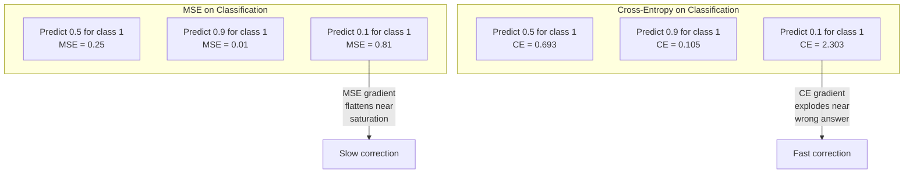
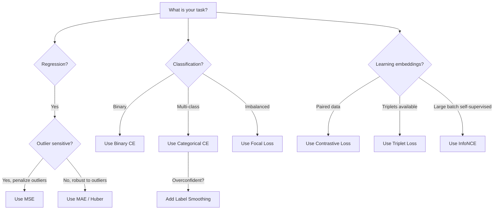
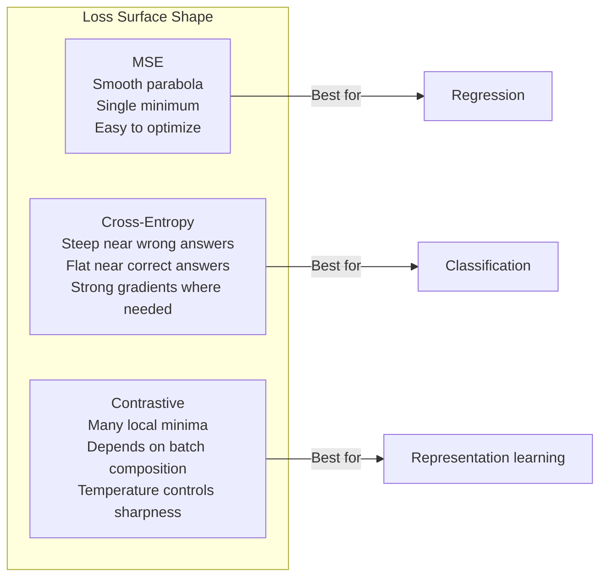

# 05 · 损失函数

> 你的网络做出一个预测，而真实标签却给出了不同的答案。它错得有多离谱？那个数字就是损失（loss）。一旦选错了损失函数，你的模型就会彻底优化错方向。

**类型：** 实践构建
**语言：** Python
**前置：** 课程 03.04（激活函数）
**时长：** 约 75 分钟

## 学习目标

- 从零实现 MSE、二元交叉熵、多分类交叉熵以及对比损失（InfoNCE）及其梯度
- 通过演示「对所有样本都预测 0.5」这一失败模式，解释为什么 MSE 不适用于分类
- 对交叉熵应用标签平滑（label smoothing），并说明它如何防止模型过度自信的预测
- 为回归、二分类、多分类以及嵌入学习任务选择正确的损失函数

## 问题所在

一个在分类问题上最小化 MSE 的模型，会自信满满地对所有样本都预测 0.5。它确实在最小化损失，但同时也毫无用处。

损失函数是你的模型唯一真正在优化的东西。不是准确率（accuracy），不是 F1 分数，也不是你汇报给老板的那些指标。优化器会对损失函数求梯度，并调整权重来让那个数字变小。如果损失函数没有捕捉到你真正在意的东西，模型就会找到数学上代价最低的方式去满足它，而那种方式几乎从来都不是你想要的。

来看一个具体的例子。你有一个二分类任务，两个类别各占 50%。你用 MSE 作为损失。模型对每一个输入都预测 0.5。平均 MSE 是 0.25，这是在不真正学到任何东西的前提下所能达到的最小值。模型完全没有判别能力，但从技术上讲，它确实最小化了你的损失函数。换成交叉熵（cross-entropy）后，同一个模型就被迫把预测推向 0 或 1，因为 -log(0.5) = 0.693 是一个糟糕的损失，而 -log(0.99) = 0.01 则会奖励自信且正确的预测。损失函数的选择，决定了你得到的是一个真正在学习的模型，还是一个钻指标空子的模型。

情况还能更糟。在自监督学习（self-supervised learning）中，你连标签都没有。对比损失（contrastive loss）完全定义了学习信号：什么算相似，什么算不同，以及模型应该多用力地把它们拉开。一旦把对比损失搞错，你的嵌入（embedding）就会坍缩到一个点——每个输入都映射到同一个向量。技术上损失为零，实际上一文不值。

## 核心概念

### 均方误差（Mean Squared Error，MSE）

回归任务的默认选择。计算预测值与目标值之差的平方，再对所有样本取平均。

```
MSE = (1/n) * sum((y_pred - y_true)^2)
```

为什么平方很重要：它对大误差施加二次惩罚。误差为 2 的代价是误差为 1 的 4 倍，误差为 10 则是 100 倍。这使得 MSE 对离群点（outlier）非常敏感——单个错得离谱的预测就会主导整个损失。

举个实在的例子：如果你的模型预测房价，对大多数房子的误差是 1 万美元，但对某一栋豪宅的误差是 20 万美元，那么 MSE 会拼命去修正那一栋豪宅，可能因此损害对其余 99 栋房子的表现。

MSE 对预测值的梯度为：

```
dMSE/dy_pred = (2/n) * (y_pred - y_true)
```

它与误差呈线性关系。误差越大，梯度越大。对回归来说这是个优点（大误差需要大修正），但对分类来说却是个缺陷（你希望对自信的错误答案施加指数级而非线性的惩罚）。

### 交叉熵损失（Cross-Entropy Loss）

分类任务的损失函数，根植于信息论——它度量预测概率分布与真实分布之间的散度。

**二元交叉熵（Binary Cross-Entropy，BCE）：**

```
BCE = -(y * log(p) + (1 - y) * log(1 - p))
```

其中 y 是真实标签（0 或 1），p 是预测概率。

为什么 -log(p) 有效：当真实标签为 1，你预测 p = 0.99 时，损失为 -log(0.99) = 0.01；当你预测 p = 0.01 时，损失为 -log(0.01) = 4.6。正是这 460 倍的差距，让交叉熵奏效。它会狠狠惩罚自信的错误预测，同时对自信的正确预测几乎不施加惩罚。

梯度讲述的是同一个故事：

```
dBCE/dp = -(y/p) + (1-y)/(1-p)
```

当 y = 1 且 p 接近零时，梯度为 -1/p，趋向于负无穷。模型会收到一个巨大的信号去纠正自己的错误。当 p 接近 1 时，梯度非常小——已经正确了，没什么可改的。

**多分类交叉熵（Categorical Cross-Entropy）：**

用于使用独热编码（one-hot）目标的多分类任务。

```
CCE = -sum(y_i * log(p_i))
```

只有真实类别会对损失产生贡献（因为其余所有 y_i 都为零）。如果有 10 个类别，而正确类别得到的概率是 0.1（相当于随机猜测），损失就是 -log(0.1) = 2.3；如果正确类别得到的概率是 0.9，损失则是 -log(0.9) = 0.105。模型由此学会把概率质量集中到正确答案上。

### 为什么 MSE 不适用于分类



当预测值接近 0 或 1 时，MSE 的梯度会趋于平坦（这是由于 sigmoid 饱和导致的）。交叉熵的梯度恰好补偿了这一点——其中的 -log 抵消了 sigmoid 的平坦区域，从而在最需要的地方给出强劲的梯度。

### 标签平滑（Label Smoothing）

标准的独热标签宣称「这 100% 是类别 3，其余类别都是 0%」。这是一个很强的断言。标签平滑则会缓和它：

```
smooth_label = (1 - alpha) * one_hot + alpha / num_classes
```

取 alpha = 0.1、共 10 个类别时：目标不再是 [0, 0, 1, 0, ...]，而变成 [0.01, 0.01, 0.91, 0.01, ...]。模型瞄准的是 0.91 而非 1.0。

为什么有效：一个想要通过 softmax 输出精确 1.0 的模型，需要把 logits 推向无穷大。这会导致过度自信，损害泛化能力，并使模型对分布偏移（distribution shift）变得脆弱。标签平滑把目标上限设为 0.9（在 alpha=0.1 时），从而把 logits 保持在合理范围内。GPT 以及大多数现代模型都使用标签平滑或与之等价的技术。

### 对比损失（Contrastive Loss）

没有标签，没有类别，只有成对的输入，以及一个问题：它们是相似还是不同？

**SimCLR 风格的对比损失（NT-Xent / InfoNCE）：**

取一张图像，对它创建两个增强视图（裁剪、旋转、颜色抖动）。这两个视图构成「正样本对」（positive pair）——它们应该有相似的嵌入。批次中其余每一张图像都与之构成「负样本对」（negative pair）——它们应该有不同的嵌入。

```
L = -log(exp(sim(z_i, z_j) / tau) / sum(exp(sim(z_i, z_k) / tau)))
```

其中 sim() 是余弦相似度（cosine similarity），z_i 和 z_j 是正样本对，求和遍历所有负样本，tau（温度，temperature）控制分布的尖锐程度。温度越低 = 负样本越「难」= 分离得越激进。

举个实在的例子：批大小为 256，意味着每个正样本对对应 255 个负样本。温度 tau = 0.07（SimCLR 的默认值）。这个损失看起来就像是对各个相似度做的一次 softmax——它希望正样本对的相似度在全部 256 个选项中最高。

**三元组损失（Triplet Loss）：**

接收三个输入：锚点（anchor）、正样本（positive，同类）、负样本（negative，异类）。

```
L = max(0, d(anchor, positive) - d(anchor, negative) + margin)
```

间隔（margin，通常取 0.2 到 1.0）强制在正样本距离和负样本距离之间保持一个最小差距。如果负样本本来就已经离得足够远，损失就为零——没有梯度，没有更新。这让训练变得高效，但需要谨慎地进行三元组挖掘（triplet mining，即挑选那些靠近锚点的难负样本）。

### 焦点损失（Focal Loss）

用于不平衡数据集。标准交叉熵对所有被正确分类的样本一视同仁。焦点损失则会降低简单样本的权重：

```
FL = -alpha * (1 - p_t)^gamma * log(p_t)
```

其中 p_t 是真实类别的预测概率，gamma 控制聚焦程度。当 gamma = 0 时，这就是标准交叉熵。当 gamma = 2（默认值）时：

- 简单样本（p_t = 0.9）：权重 = (0.1)^2 = 0.01，几乎被忽略。
- 难样本（p_t = 0.1）：权重 = (0.9)^2 = 0.81，获得完整的梯度信号。

焦点损失由 Lin 等人为目标检测引入，在目标检测中，99% 的候选区域都是背景（简单负样本）。没有焦点损失，模型就会淹没在大量简单背景样本里，永远学不会检测目标；有了它，模型就能把容量集中到那些真正重要的、困难而模糊的样本上。

### 损失函数决策树



### 损失曲面（Loss Landscape）



## 动手构建

### 第 1 步：MSE 及其梯度

```python
def mse(predictions, targets):
    n = len(predictions)
    total = 0.0
    for p, t in zip(predictions, targets):
        total += (p - t) ** 2
    return total / n

def mse_gradient(predictions, targets):
    n = len(predictions)
    grads = []
    for p, t in zip(predictions, targets):
        grads.append(2.0 * (p - t) / n)
    return grads
```

### 第 2 步：二元交叉熵

log(0) 问题真实存在。如果模型对一个正样本预测出精确的 0，那么 log(0) = 负无穷。裁剪（clipping）可以防止这种情况。

```python
import math

def binary_cross_entropy(predictions, targets, eps=1e-15):
    n = len(predictions)
    total = 0.0
    for p, t in zip(predictions, targets):
        p_clipped = max(eps, min(1 - eps, p))
        total += -(t * math.log(p_clipped) + (1 - t) * math.log(1 - p_clipped))
    return total / n

def bce_gradient(predictions, targets, eps=1e-15):
    grads = []
    for p, t in zip(predictions, targets):
        p_clipped = max(eps, min(1 - eps, p))
        grads.append(-(t / p_clipped) + (1 - t) / (1 - p_clipped))
    return grads
```

### 第 3 步：搭配 Softmax 的多分类交叉熵

softmax 将原始 logits 转换为概率。然后我们对独热目标计算交叉熵。

```python
def softmax(logits):
    max_val = max(logits)
    exps = [math.exp(x - max_val) for x in logits]
    total = sum(exps)
    return [e / total for e in exps]

def categorical_cross_entropy(logits, target_index, eps=1e-15):
    probs = softmax(logits)
    p = max(eps, probs[target_index])
    return -math.log(p)

def cce_gradient(logits, target_index):
    probs = softmax(logits)
    grads = list(probs)
    grads[target_index] -= 1.0
    return grads
```

softmax + 交叉熵的梯度简化得非常漂亮：对真实类别就是（预测概率 - 1），对其余所有类别就是（预测概率）。这个优雅的简化并非巧合——这正是 softmax 与交叉熵被配对使用的原因。

### 第 4 步：标签平滑

```python
def label_smoothed_cce(logits, target_index, num_classes, alpha=0.1, eps=1e-15):
    probs = softmax(logits)
    loss = 0.0
    for i in range(num_classes):
        if i == target_index:
            smooth_target = 1.0 - alpha + alpha / num_classes
        else:
            smooth_target = alpha / num_classes
        p = max(eps, probs[i])
        loss += -smooth_target * math.log(p)
    return loss
```

### 第 5 步：对比损失（简化版 InfoNCE）

```python
def cosine_similarity(a, b):
    dot = sum(x * y for x, y in zip(a, b))
    norm_a = math.sqrt(sum(x * x for x in a))
    norm_b = math.sqrt(sum(x * x for x in b))
    if norm_a < 1e-10 or norm_b < 1e-10:
        return 0.0
    return dot / (norm_a * norm_b)

def contrastive_loss(anchor, positive, negatives, temperature=0.07):
    sim_pos = cosine_similarity(anchor, positive) / temperature
    sim_negs = [cosine_similarity(anchor, neg) / temperature for neg in negatives]

    max_sim = max(sim_pos, max(sim_negs)) if sim_negs else sim_pos
    exp_pos = math.exp(sim_pos - max_sim)
    exp_negs = [math.exp(s - max_sim) for s in sim_negs]
    total_exp = exp_pos + sum(exp_negs)

    return -math.log(max(1e-15, exp_pos / total_exp))
```

### 第 6 步：分类任务上 MSE 与交叉熵的对比

用两种损失函数分别训练课程 04 中的同一个网络（圆形数据集），观察交叉熵收敛得更快。

```python
import random

def sigmoid(x):
    x = max(-500, min(500, x))
    return 1.0 / (1.0 + math.exp(-x))

def make_circle_data(n=200, seed=42):
    random.seed(seed)
    data = []
    for _ in range(n):
        x = random.uniform(-2, 2)
        y = random.uniform(-2, 2)
        label = 1.0 if x * x + y * y < 1.5 else 0.0
        data.append(([x, y], label))
    return data


class LossComparisonNetwork:
    def __init__(self, loss_type="bce", hidden_size=8, lr=0.1):
        random.seed(0)
        self.loss_type = loss_type
        self.lr = lr
        self.hidden_size = hidden_size

        self.w1 = [[random.gauss(0, 0.5) for _ in range(2)] for _ in range(hidden_size)]
        self.b1 = [0.0] * hidden_size
        self.w2 = [random.gauss(0, 0.5) for _ in range(hidden_size)]
        self.b2 = 0.0

    def forward(self, x):
        self.x = x
        self.z1 = []
        self.h = []
        for i in range(self.hidden_size):
            z = self.w1[i][0] * x[0] + self.w1[i][1] * x[1] + self.b1[i]
            self.z1.append(z)
            self.h.append(max(0.0, z))

        self.z2 = sum(self.w2[i] * self.h[i] for i in range(self.hidden_size)) + self.b2
        self.out = sigmoid(self.z2)
        return self.out

    def backward(self, target):
        if self.loss_type == "mse":
            d_loss = 2.0 * (self.out - target)
        else:
            eps = 1e-15
            p = max(eps, min(1 - eps, self.out))
            d_loss = -(target / p) + (1 - target) / (1 - p)

        d_sigmoid = self.out * (1 - self.out)
        d_out = d_loss * d_sigmoid

        for i in range(self.hidden_size):
            d_relu = 1.0 if self.z1[i] > 0 else 0.0
            d_h = d_out * self.w2[i] * d_relu
            self.w2[i] -= self.lr * d_out * self.h[i]
            for j in range(2):
                self.w1[i][j] -= self.lr * d_h * self.x[j]
            self.b1[i] -= self.lr * d_h
        self.b2 -= self.lr * d_out

    def compute_loss(self, pred, target):
        if self.loss_type == "mse":
            return (pred - target) ** 2
        else:
            eps = 1e-15
            p = max(eps, min(1 - eps, pred))
            return -(target * math.log(p) + (1 - target) * math.log(1 - p))

    def train(self, data, epochs=200):
        losses = []
        for epoch in range(epochs):
            total_loss = 0.0
            correct = 0
            for x, y in data:
                pred = self.forward(x)
                self.backward(y)
                total_loss += self.compute_loss(pred, y)
                if (pred >= 0.5) == (y >= 0.5):
                    correct += 1
            avg_loss = total_loss / len(data)
            accuracy = correct / len(data) * 100
            losses.append((avg_loss, accuracy))
            if epoch % 50 == 0 or epoch == epochs - 1:
                print(f"    Epoch {epoch:3d}: loss={avg_loss:.4f}, accuracy={accuracy:.1f}%")
        return losses
```

## 实际应用

PyTorch 提供了所有标准损失函数，并内置了数值稳定性处理：

```python
import torch
import torch.nn as nn
import torch.nn.functional as F

predictions = torch.tensor([0.9, 0.1, 0.7], requires_grad=True)
targets = torch.tensor([1.0, 0.0, 1.0])

mse_loss = F.mse_loss(predictions, targets)
bce_loss = F.binary_cross_entropy(predictions, targets)

logits = torch.randn(4, 10)
labels = torch.tensor([3, 7, 1, 9])
ce_loss = F.cross_entropy(logits, labels)
ce_smooth = F.cross_entropy(logits, labels, label_smoothing=0.1)
```

请使用 `F.cross_entropy`（而不是 `F.nll_loss` 再加手动 softmax）。它把 log-softmax 和负对数似然（negative log-likelihood）合并成了一个数值稳定的运算。先单独应用 softmax 再取对数会不那么稳定——你会在大指数项的相减过程中损失精度。

对于对比学习，大多数团队会使用自定义实现，或者像 `lightly`、`pytorch-metric-learning` 这样的库。其核心循环始终如一：计算两两之间的相似度，对正负样本构造 softmax，然后反向传播。

## 交付成果

本课程产出：
- `outputs/prompt-loss-function-selector.md` —— 一个可复用的提示词，用于选择正确的损失函数
- `outputs/prompt-loss-debugger.md` —— 一个诊断性提示词，用于当你的损失曲线看起来不对劲时排查问题

## 练习

1. 实现 Huber 损失（平滑 L1 损失），它在小误差时表现为 MSE，在大误差时表现为 MAE。训练一个预测 y = sin(x) 的回归网络，在 5% 的训练目标被加入随机噪声（离群点）的情况下，分别用 MSE 和 Huber 训练，比较最终的测试误差。

2. 把焦点损失加入二分类训练循环。构造一个不平衡数据集（90% 为类别 0，10% 为类别 1）。在训练 200 个 epoch 后，比较标准 BCE 与焦点损失（gamma=2）在少数类召回率（recall）上的表现。

3. 实现带半难负样本挖掘（semi-hard negative mining）的三元组损失。为 5 个类别生成 2D 嵌入数据。对每个锚点，找出那个仍比正样本更远的最难负样本（半难）。将其收敛情况与随机选取三元组的方式进行比较。

4. 运行 MSE 与交叉熵的对比实验，但在训练过程中跟踪每一层的梯度幅值。绘制每个 epoch 的平均梯度范数（gradient norm）。验证在早期 epoch、模型最不确定时，交叉熵会产生更大的梯度。

5. 实现 KL 散度（KL divergence）损失，并验证：当真实分布是独热分布时，最小化 KL(true || predicted) 会给出与交叉熵相同的梯度。然后尝试软目标（soft targets，如知识蒸馏中的情形），即「真实」分布来自教师模型（teacher model）的 softmax 输出。

## 关键术语

| 术语 | 人们怎么说 | 它实际指什么 |
|------|----------------|----------------------|
| 损失函数（Loss function） | 「模型错得有多离谱」 | 一个可微函数，把预测和目标映射为一个标量，优化器去最小化它 |
| MSE | 「平均平方误差」 | 预测与目标之差的平方的均值；对大误差施加二次惩罚 |
| 交叉熵（Cross-entropy） | 「那个分类损失」 | 用 -log(p) 度量预测概率分布与真实分布之间的散度 |
| 二元交叉熵（Binary cross-entropy） | 「BCE」 | 两个类别的交叉熵：-(y*log(p) + (1-y)*log(1-p)) |
| 标签平滑（Label smoothing） | 「软化目标」 | 把硬性的 0/1 目标替换为软值（如 0.1/0.9），以防止过度自信并改善泛化 |
| 对比损失（Contrastive loss） | 「拉近、推远」 | 一种损失，通过让相似对在嵌入空间中靠近、不相似对远离来学习表示 |
| InfoNCE | 「CLIP/SimCLR 那个损失」 | 在相似度分数上做的归一化、温度缩放的交叉熵；把对比学习当作分类来处理 |
| 焦点损失（Focal loss） | 「不平衡数据的修补方案」 | 用 (1-p_t)^gamma 加权的交叉熵，以降低简单样本权重、聚焦于难样本 |
| 三元组损失（Triplet loss） | 「锚点-正样本-负样本」 | 在嵌入空间中，把锚点拉得比负样本更靠近正样本，且至少相差一个间隔 |
| 温度（Temperature） | 「尖锐度旋钮」 | 作用在 logits/相似度上的标量除数，控制所得分布的尖锐程度；越低越尖锐 |

## 延伸阅读

- Lin 等人，《Focal Loss for Dense Object Detection》（2017）—— 引入焦点损失，用于处理目标检测中的极端类别不平衡（RetinaNet）
- Chen 等人，《A Simple Framework for Contrastive Learning of Visual Representations》（SimCLR，2020）—— 用 NT-Xent 损失定义了现代对比学习流程
- Szegedy 等人，《Rethinking the Inception Architecture》（2016）—— 引入标签平滑作为一种正则化技术，如今已成为大多数大模型的标准做法
- Hinton 等人，《Distilling the Knowledge in a Neural Network》（2015）—— 使用软目标和 KL 散度的知识蒸馏（knowledge distillation），是模型压缩的奠基性工作
