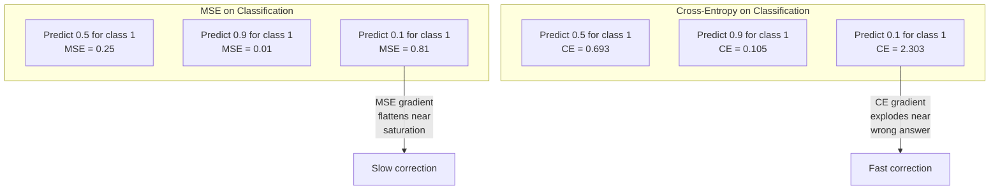
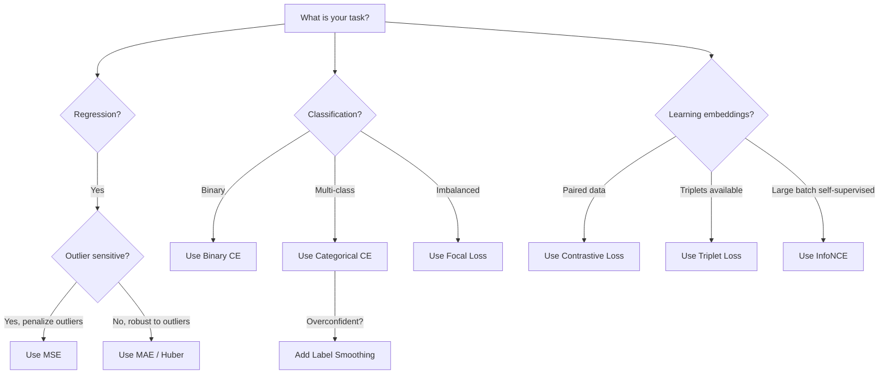
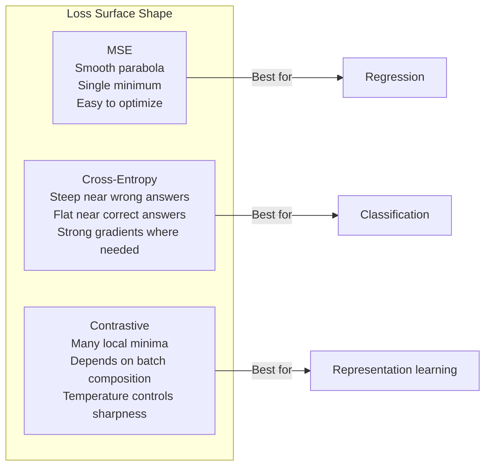

# 损失函数

> 您的网络做出预测。事实并非如此。错得有多严重？这个数字就是损失。选择错误的损失函数，你的模型会完全优化错误的东西。

** 类型：** 构建
** 语言：** Python
** 先决条件：** 第03.04课（激活功能）
** 时间：** ~75分钟

## 学习目标

- 利用梯度从头开始实施SSE、二进制交叉信息、分类交叉信息和对比损失（InfoNSO）
- 通过演示“预测一切0.5”失败模式来解释为什么SSE无法分类
- 将标签平滑应用于交叉信息并描述它如何防止过度自信的预测
- 为回归、二元分类、多类分类和嵌入学习任务选择正确的损失函数

## 问题

在分类问题上最小化SSE的模型将自信地预测所有内容为0.5。它正在最大限度地减少损失。也没用。

损失函数是模型实际优化的唯一内容。不是准确性。不是F1分数。而不是你向经理报告的任何指标。优化器获取损失函数的梯度并调整权重以使该数字更小。如果损失函数不能捕捉您关心的内容，模型将找到数学上最便宜的方法来满足它，而这种方法几乎从来都不是您想要的。

这是一个具体的例子。您有一个二进制分类任务。两个班，50/50分成。您使用SSE作为您的损失。该模型预测每个输入为0.5。平均SSE为0.25，这是在没有实际学习任何东西的情况下可能的最低值。该模型的辨别能力为零，但在技术上它已经最大限度地减少了您的损失函数。切换到交叉熵，相同的模型被迫将预测推向0或1，因为-log（0.5）= 0.693是一个可怕的损失，而-log（0.99）= 0.01奖励自信正确的预测。损失函数的选择是学习模型和游戏指标的模型之间的差异。

情况变得更糟。在自我监督学习中，你甚至没有标签。对比损失完全定义了学习信号：什么算作相似，什么算作不同，以及模型应该如何将它们分开。对比损失错误，您的嵌入就会崩溃到一个点--每个输入都映射到同一个载体。技术上为零损失。完全一文不值。

## 概念

### 均方误差（SSE）

回归的默认值。计算预测和目标之间的平方差，所有样本的平均值。

```
MSE = (1/n) * sum((y_pred - y_true)^2)
```

为什么平方很重要：它对大的错误进行二次惩罚。错误2的成本是错误1的4倍。错误10将花费100倍。这使得SSE对异常值很敏感--一个严重错误的预测会导致损失。

真实数字：如果您的模型预测房价，并且大多数房屋的房价相差10，000美元，但其中一栋豪宅的房价相差200，000美元，则SSE将积极尝试修复这一栋豪宅，这可能会损害其他99栋房屋的性能。

相对于预测的SSE梯度为：

```
dMSE/dy_pred = (2/n) * (y_pred - y_true)
```

误差呈线性。错误越大，梯度越大。这是回归的一个功能（大的错误需要大的纠正），也是分类的一个错误（您希望以指数级方式惩罚自信的错误答案，而不是线性方式）。

### 交叉熵损失

分类的损失函数。植根于信息论--它衡量预测的概率分布和真实分布之间的偏差。

** 二进制交叉熵（BCE）：**

```
BCE = -(y * log(p) + (1 - y) * log(1 - p))
```

其中y是真实标签（0或1），p是预测概率。

为什么-log（p）有效：当真实标签为1并且您预测p = 0.99时，损失为-log（0.99）= 0.01。当您预测p = 0.01时，损失为-log（0.01）= 4.6。这种460倍的差异就是交叉熵有效的原因。它残酷地惩罚自信的错误预测，而几乎不惩罚自信的正确预测。

梯度讲述了同样的故事：

```
dBCE/dp = -(y/p) + (1-y)/(1-p)
```

当y = 1且p接近零时，梯度为-1/p，接近负无穷大。该模型收到了一个巨大的信号来修复其错误。当p接近1时，梯度很小。已经正确，没有什么可修复的。

** 类别交叉熵：**

用于具有单热编码目标的多类分类。

```
CCE = -sum(y_i * log(p_i))
```

只有真实的类才会导致损失（因为所有其他y_i都是零）。如果有10个类，并且正确的类的概率为0.1（随机猜测），则损失为-log（0.1）= 2.3。如果正确的类的概率为0.9，则损失为-log（0.9）= 0.105。该模型学会将概率质量集中在正确的答案上。

### 为什么SSE无法分类



当预测接近0或1时（由于Sigmoid饱和），SSE梯度变平。交叉熵梯度对此进行了补偿--log取消了Sigmoid的平坦区域，在最需要的地方给出强梯度。

### 标签平滑

标准的一次性标签上写着“这是100% 3级，其他所有都是0%。“这是一个强有力的主张。标签平滑可以软化它：

```
smooth_label = (1 - alpha) * one_hot + alpha / num_classes
```

Alpha = 0.1和10个类：而不是[0，0，1，0，.]，目标变为[0.01，0.01，0.91，0.01，..]。该模型的目标是0.91而不是1.0。

为什么这样做：试图通过softmax输出恰好1.0的模型需要将logit推到无限大。这会导致过度自信，损害概括性，并使模型容易受到分布转移的影响。标签平滑将目标限制在0.9（Alpha=0.1），将log保持在合理范围内。GPT和大多数现代型号使用标签平滑或其等效产品。

### 对比损失

没有标签。没有课程。只是成对的输入和问题：这些是相似还是不同？

** SimCLR式对比损失（NT-Xent /InfoNSO）：**

拍摄一张照片。创建它的两个增强视图（裁剪、旋转、颜色抖动）。这些是“积极对”--它们应该有类似的嵌入。批次中的每个其他图像都形成“负对”--它们应该具有不同的嵌入。

```
L = -log(exp(sim(z_i, z_j) / tau) / sum(exp(sim(z_i, z_k) / tau)))
```

其中sim（）是cos相似性，z_i和z_j是正对，和是所有负值，而tau（温度）控制分布的尖锐程度。较低的温度=更硬的底片=更积极的分离。

真实数字：批量256意味着每个阳性对有255个阴性。温度tau = 0.07（模拟默认）。这种损失看起来像是相似性的softmax--它希望正对的相似性在所有256个选项中最高。

** 三重损失：**

接受三个输入：锚点、正（同一类别）、负（不同类别）。

```
L = max(0, d(anchor, positive) - d(anchor, negative) + margin)
```

裕度（通常为0.2-1.0）强制规定正距离和负距离之间的最小间隙。如果负值已经足够远，则损失为零--没有梯度，没有更新。这使得训练高效，但需要仔细的三重组挖掘（选择接近锚点的硬阴性）。

### 焦点损失

对于不平衡的数据集。标准交叉信息平等地对待所有正确分类的示例。焦点损失减轻了简单例子：

```
FL = -alpha * (1 - p_t)^gamma * log(p_t)
```

其中p_t是真类的预测概率，gamma控制聚焦。当gamma = 0时，这是标准的交叉熵。gamma = 2（默认值）：

- 简单的例子（p_t = 0.9）：重量=（0.1）#2 = 0.01。实际上被忽视了。
- 硬例子（p_t = 0.1）：重量=（0.9）#2 = 0.81。全梯度信号。

林等人引入了焦点丢失用于物体检测，其中99%的候选区域是背景（容易阴性）。如果没有焦点损失，该模型就会淹没在简单的背景示例中，并且永远不会学会检测物体。通过它，该模型将其能力集中在重要的棘手、模糊的案例上。

### 损失函数决策树



### 损失景观



## 建设党

### 第1步：SSE及其梯度

```python
def mse(predictions, targets):
    n = len(predictions)
    total = 0.0
    for p, t in zip(predictions, targets):
        total += (p - t) ** 2
    return total / n

def mse_gradient(predictions, targets):
    n = len(predictions)
    grads = []
    for p, t in zip(predictions, targets):
        grads.append(2.0 * (p - t) / n)
    return grads
```

### 第2步：二元交叉熵

log（0）问题是真实存在的。如果模型预测正示例恰好为0，则log（0）=负无穷大。剪辑可以防止这种情况发生。

```python
import math

def binary_cross_entropy(predictions, targets, eps=1e-15):
    n = len(predictions)
    total = 0.0
    for p, t in zip(predictions, targets):
        p_clipped = max(eps, min(1 - eps, p))
        total += -(t * math.log(p_clipped) + (1 - t) * math.log(1 - p_clipped))
    return total / n

def bce_gradient(predictions, targets, eps=1e-15):
    grads = []
    for p, t in zip(predictions, targets):
        p_clipped = max(eps, min(1 - eps, p))
        grads.append(-(t / p_clipped) + (1 - t) / (1 - p_clipped))
    return grads
```

### 第3步：使用Softmax的分类交叉熵

Softmax将原始逻辑转换为概率。然后我们计算针对一热目标的交叉熵。

```python
def softmax(logits):
    max_val = max(logits)
    exps = [math.exp(x - max_val) for x in logits]
    total = sum(exps)
    return [e / total for e in exps]

def categorical_cross_entropy(logits, target_index, eps=1e-15):
    probs = softmax(logits)
    p = max(eps, probs[target_index])
    return -math.log(p)

def cce_gradient(logits, target_index):
    probs = softmax(logits)
    grads = list(probs)
    grads[target_index] -= 1.0
    return grads
```

softmax +交叉熵的梯度被完美地简化了：对于真实类别来说，它只是（预测概率-1），对于所有其他类别来说，它只是（预测概率）。这种优雅的简化并不是巧合--这就是softmax和cross-entropy配对的原因。

### 第4步：标签平滑

```python
def label_smoothed_cce(logits, target_index, num_classes, alpha=0.1, eps=1e-15):
    probs = softmax(logits)
    loss = 0.0
    for i in range(num_classes):
        if i == target_index:
            smooth_target = 1.0 - alpha + alpha / num_classes
        else:
            smooth_target = alpha / num_classes
        p = max(eps, probs[i])
        loss += -smooth_target * math.log(p)
    return loss
```

### 第5步：对比损失（简化的InfoNCE）

```python
def cosine_similarity(a, b):
    dot = sum(x * y for x, y in zip(a, b))
    norm_a = math.sqrt(sum(x * x for x in a))
    norm_b = math.sqrt(sum(x * x for x in b))
    if norm_a < 1e-10 or norm_b < 1e-10:
        return 0.0
    return dot / (norm_a * norm_b)

def contrastive_loss(anchor, positive, negatives, temperature=0.07):
    sim_pos = cosine_similarity(anchor, positive) / temperature
    sim_negs = [cosine_similarity(anchor, neg) / temperature for neg in negatives]

    max_sim = max(sim_pos, max(sim_negs)) if sim_negs else sim_pos
    exp_pos = math.exp(sim_pos - max_sim)
    exp_negs = [math.exp(s - max_sim) for s in sim_negs]
    total_exp = exp_pos + sum(exp_negs)

    return -math.log(max(1e-15, exp_pos / total_exp))
```

### 第6步：分类中的SSE与交叉熵

使用两个损失函数训练第04课（圆圈数据集）中的相同网络。观看交叉信息收敛得更快。

```python
import random

def sigmoid(x):
    x = max(-500, min(500, x))
    return 1.0 / (1.0 + math.exp(-x))

def make_circle_data(n=200, seed=42):
    random.seed(seed)
    data = []
    for _ in range(n):
        x = random.uniform(-2, 2)
        y = random.uniform(-2, 2)
        label = 1.0 if x * x + y * y < 1.5 else 0.0
        data.append(([x, y], label))
    return data


class LossComparisonNetwork:
    def __init__(self, loss_type="bce", hidden_size=8, lr=0.1):
        random.seed(0)
        self.loss_type = loss_type
        self.lr = lr
        self.hidden_size = hidden_size

        self.w1 = [[random.gauss(0, 0.5) for _ in range(2)] for _ in range(hidden_size)]
        self.b1 = [0.0] * hidden_size
        self.w2 = [random.gauss(0, 0.5) for _ in range(hidden_size)]
        self.b2 = 0.0

    def forward(self, x):
        self.x = x
        self.z1 = []
        self.h = []
        for i in range(self.hidden_size):
            z = self.w1[i][0] * x[0] + self.w1[i][1] * x[1] + self.b1[i]
            self.z1.append(z)
            self.h.append(max(0.0, z))

        self.z2 = sum(self.w2[i] * self.h[i] for i in range(self.hidden_size)) + self.b2
        self.out = sigmoid(self.z2)
        return self.out

    def backward(self, target):
        if self.loss_type == "mse":
            d_loss = 2.0 * (self.out - target)
        else:
            eps = 1e-15
            p = max(eps, min(1 - eps, self.out))
            d_loss = -(target / p) + (1 - target) / (1 - p)

        d_sigmoid = self.out * (1 - self.out)
        d_out = d_loss * d_sigmoid

        for i in range(self.hidden_size):
            d_relu = 1.0 if self.z1[i] > 0 else 0.0
            d_h = d_out * self.w2[i] * d_relu
            self.w2[i] -= self.lr * d_out * self.h[i]
            for j in range(2):
                self.w1[i][j] -= self.lr * d_h * self.x[j]
            self.b1[i] -= self.lr * d_h
        self.b2 -= self.lr * d_out

    def compute_loss(self, pred, target):
        if self.loss_type == "mse":
            return (pred - target) ** 2
        else:
            eps = 1e-15
            p = max(eps, min(1 - eps, pred))
            return -(target * math.log(p) + (1 - target) * math.log(1 - p))

    def train(self, data, epochs=200):
        losses = []
        for epoch in range(epochs):
            total_loss = 0.0
            correct = 0
            for x, y in data:
                pred = self.forward(x)
                self.backward(y)
                total_loss += self.compute_loss(pred, y)
                if (pred >= 0.5) == (y >= 0.5):
                    correct += 1
            avg_loss = total_loss / len(data)
            accuracy = correct / len(data) * 100
            losses.append((avg_loss, accuracy))
            if epoch % 50 == 0 or epoch == epochs - 1:
                print(f"    Epoch {epoch:3d}: loss={avg_loss:.4f}, accuracy={accuracy:.1f}%")
        return losses
```

## 使用它

PyTorch提供所有标准损失函数，内置数字稳定性：

```python
import torch
import torch.nn as nn
import torch.nn.functional as F

predictions = torch.tensor([0.9, 0.1, 0.7], requires_grad=True)
targets = torch.tensor([1.0, 0.0, 1.0])

mse_loss = F.mse_loss(predictions, targets)
bce_loss = F.binary_cross_entropy(predictions, targets)

logits = torch.randn(4, 10)
labels = torch.tensor([3, 7, 1, 9])
ce_loss = F.cross_entropy(logits, labels)
ce_smooth = F.cross_entropy(logits, labels, label_smoothing=0.1)
```

使用“F.cross_entropy”（而不是“F.nll_loss”加上手动softmax）。它将log-softmax和负log-似然结合在一个数字稳定的操作中。分别应用softmax然后取log不太稳定--在减去大指数时会失去精确度。

对于对比学习，大多数团队使用自定义实现或库，例如“lightly”或“pytorch-metric-learning”。核心循环始终是相同的：计算成对相似性、创建正和负的softmax、反向传播。

## 把它运

本课产生：
- ' outputes/prompt-loss-function-selector.md '--可重复使用的提示，用于选择正确的损失函数
- '输出/prompt-loss-debugger.md '--当您的损失曲线看起来错误时的诊断提示

## 演习

1. 实现Huber损失（平滑L1损失），对于小错误，对于大错误，对于大错误，对于MAE。当5%的训练目标添加了随机噪音（离群值）时，使用SSE vs Huber训练预测y = sin（x）的回归网络。比较最终测试错误。

2. 将焦点损失添加到二元分类训练循环中。创建不平衡的数据集（90%为0级，10%为1级）。比较200个纪元后少数族裔召回的标准BCE与焦点丧失（gamma=2）。

3. 通过半硬负挖掘实现三重丢失。为5个类生成2D嵌入数据。对于每个锚点，找到最难的负面，但仍然比正面（半硬）更远。将收敛与随机三重选择进行比较。

4. 运行SSE与交叉熵比较，但在训练期间跟踪每个层的梯度幅度。绘制每个历元的平均梯度规范。验证交叉信息在模型最不确定的早期阶段产生更大的梯度。

5. 实现KL偏差损失并验证是否最小化KL（真||预测）当真实分布是一热时，给出与交叉熵相同的梯度。然后尝试软目标（例如知识蒸馏），其中“真实”分布来自教师模型的softmax输出。

## 关键术语

| Term | 别人怎么说 | 它实际上意味着什么 |
|------|----------------|----------------------|
| 损失函数 | “这个模型有多错误” | 将预测和目标映射到优化器最小化的纯量的可微函数 |
| MSE | “平均平方误差” | 预测和目标之间平方差的平均值;对大错误进行二次惩罚 |
| 交叉熵 | “分类损失” | 使用-log（p）测量预测概率分布和真实分布之间的偏差 |
| 二进制交叉熵 | “BCE” | 两个类别的交叉熵：-（y*log（p）+（1-y）*log（1-p）） |
| 标签平滑 | “软化目标” | 用软值替换硬0/1目标（例如，0.1/0.9），以防止过度自信，提高泛化能力 |
| 对比损失 | “拉在一起，推开” | 通过在嵌入空间中使相似的对接近和不同的对远离来学习表示的损失 |
| InfoNSO | “CLIP/Simpson的损失” | 相似性分数上的标准化温度标度交叉熵;将对比学习视为分类 |
| 焦点损失 | “不平衡的数据修复” | 通过（1-p_t）' gamma加权交叉信息，以降低简单示例的权重并专注于困难示例 |
| 三重损失 | “锚-阳性-阴性” | 将锚推到嵌入空间中的正位置，而不是负位置，至少一个裕度 |
| 温度 | “锋利的旋钮” | logits/相似性的标量除数，用于控制结果分布的峰值;较低=较尖锐 |

## 进一步阅读

- 林等人，“密集对象检测的焦点丢失”（2017年）--引入焦点丢失，以处理对象检测中的极端类别不平衡（RetinaNet）
- Chen等人，“视觉表示对比学习的简单框架”（Simpier，2020）--定义了NT-Xent损失的现代对比学习管道
- Szegedy等人，“重新思考初始架构”（2016）--引入标签平滑作为一种规则化技术，现在是大多数大型模型的标准配置
- 辛顿等人，“提取神经网络中的知识”（2015）--使用软目标和KL分歧的知识提取，模型压缩的基础
