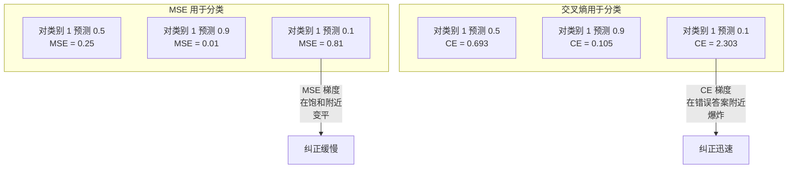
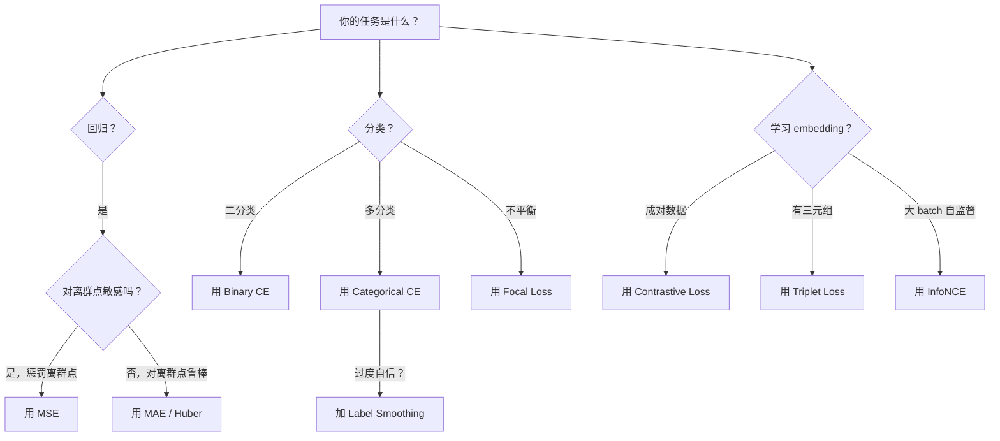
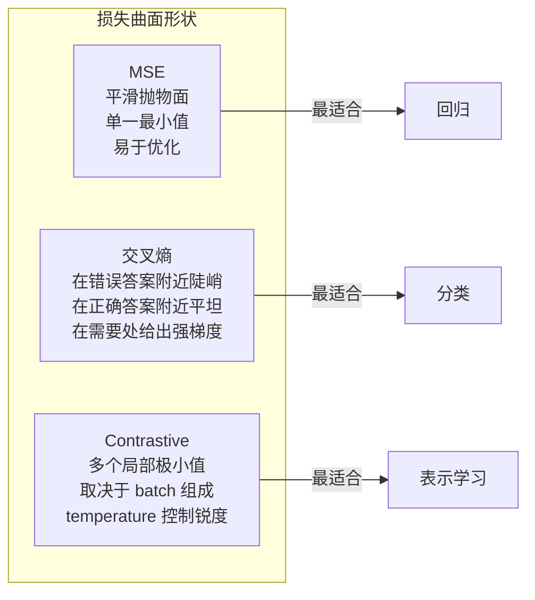

# 损失函数（Loss Functions）

> 译注：本文译自同目录 [`en.md`](./en.md)。术语遵循仓根 [TRANSLATION_GUIDE.md](../../../../TRANSLATION_GUIDE.md)。

> 你的网络做了一个预测。真实标签却说不是这样。它错得有多离谱？这个数字就是 loss（损失）。选错损失函数，你的模型就会朝着完全错误的方向去优化。

**Type:** Build
**Languages:** Python
**Prerequisites:** Lesson 03.04 (Activation Functions)
**Time:** ~75 minutes

## 学习目标（Learning Objectives）

- 从零实现 MSE、binary cross-entropy、categorical cross-entropy 以及 contrastive loss（InfoNCE），并写出它们的梯度
- 通过演示「对所有样本都预测 0.5」这种失败模式，解释为什么 MSE 不适合分类任务
- 给 cross-entropy 加上 label smoothing（标签平滑），并描述它如何防止预测过度自信
- 为回归、二分类、多分类、embedding 学习等任务挑选正确的损失函数

## 问题（The Problem）

一个在分类问题上最小化 MSE 的模型，会很自信地对所有输入都预测 0.5。它确实在最小化损失，但同时也毫无用处。

损失函数是模型唯一真正在优化的东西。不是 accuracy（准确率），不是 F1 分数，也不是你向老板汇报的那些指标。optimizer 取损失函数的 gradient，调整 weight 让那个数字变小。如果损失函数没有捕捉到你真正在乎的东西，模型就会找到数学上代价最低的方式去满足它，而那种方式几乎从来不是你想要的。

举个具体例子。你有一个二分类任务，两类样本各占 50%。你用 MSE 当损失。模型对每一个输入都预测 0.5。平均 MSE 是 0.25，这是不真正学习时所能达到的最小值。模型零判别能力，但从技术上看它确实把你的损失函数压到了最低。换成 cross-entropy，同一个模型就被迫把预测推向 0 或 1，因为 -log(0.5) = 0.693 是个糟糕的损失，而 -log(0.99) = 0.01 会奖励自信且正确的预测。损失函数的选择，就是「会学习的模型」和「玩弄指标的模型」之间的差别。

更糟的还在后面。在自监督学习里，你甚至没有 label。Contrastive loss（对比损失）完全定义了学习信号：什么算相似、什么算不同、模型应该多用力把它们推开。Contrastive loss 写错了，你的 embedding 会坍缩成一个点——每个输入都映射到同一个向量。技术上 loss 是零，实际上完全没用。

## 概念（The Concept）

### 均方误差（Mean Squared Error, MSE）

回归任务的默认选项。计算预测值与目标值的平方差，再对所有样本求平均。

```
MSE = (1/n) * sum((y_pred - y_true)^2)
```

为什么平方很关键：它对大误差的惩罚是平方级的。误差为 2 时代价是误差为 1 的 4 倍，误差为 10 时是 100 倍。这让 MSE 对离群点（outlier）非常敏感——一个离谱的预测就能主导整个 loss。

举个真实例子：如果你的模型预测房价，对绝大多数房子误差是 1 万美元，但对某一栋豪宅误差 20 万，MSE 会激进地去修那一栋豪宅，可能反而拖垮其他 99 栋的表现。

MSE 关于预测的梯度是：

```
dMSE/dy_pred = (2/n) * (y_pred - y_true)
```

它在误差上是线性的：误差越大，gradient 越大。这对回归是个 feature（大误差需要大幅修正），对分类是个 bug（你想让自信的错误答案受到指数级惩罚，而不是线性惩罚）。

### 交叉熵损失（Cross-Entropy Loss）

分类任务的损失函数。根植于信息论——它衡量的是预测概率分布与真实分布之间的差异。

**Binary Cross-Entropy（BCE，二元交叉熵）：**

```
BCE = -(y * log(p) + (1 - y) * log(1 - p))
```

其中 y 是真实标签（0 或 1），p 是预测概率。

为什么 -log(p) 有效：当真实标签是 1、你预测 p = 0.99 时，loss 是 -log(0.99) = 0.01；当你预测 p = 0.01 时，loss 是 -log(0.01) = 4.6。这 460 倍的差距，正是 cross-entropy 起作用的原因。它对自信但错误的预测狠狠惩罚，对自信且正确的预测几乎不罚。

它的梯度也讲同样的故事：

```
dBCE/dp = -(y/p) + (1-y)/(1-p)
```

当 y = 1 而 p 接近 0 时，gradient 是 -1/p，会逼近负无穷。模型会拿到一个巨大的信号去修正错误。当 p 接近 1 时，gradient 很小：已经对了，没什么要修。

**Categorical Cross-Entropy（多类交叉熵）：**

用于使用 one-hot 编码目标的多分类任务。

```
CCE = -sum(y_i * log(p_i))
```

只有真实类别对 loss 有贡献（因为其他 y_i 都是 0）。如果有 10 个类别，正确类别的概率是 0.1（相当于随机猜测），loss 就是 -log(0.1) = 2.3；如果正确类别的概率是 0.9，loss 是 -log(0.9) = 0.105。模型会学着把概率质量集中到正确答案上。

### 为什么 MSE 不适合分类



当预测接近 0 或 1 时（受 sigmoid 饱和影响），MSE 的 gradient 会变得很平。Cross-entropy 的 gradient 正好补偿了这一点——其中的 -log 抵消了 sigmoid 的平坦区，恰好在最需要的地方给出强 gradient。

### 标签平滑（Label Smoothing）

标准的 one-hot 标签是在说「这 100% 是第 3 类，0% 是其他类」。这是一个非常强的断言。Label smoothing 把它软化：

```
smooth_label = (1 - alpha) * one_hot + alpha / num_classes
```

取 alpha = 0.1、10 个类别为例：原来的 [0, 0, 1, 0, ...] 变成 [0.01, 0.01, 0.91, 0.01, ...]。模型的目标从 1.0 变成了 0.91。

为什么这样有效：要让一个模型通过 softmax 输出恰好的 1.0，它得把 logits 推到无穷大。这会导致过度自信，损害泛化能力，让模型在分布偏移面前变得脆弱。Label smoothing 把目标封顶到 0.9（alpha=0.1 时），让 logits 留在合理范围内。GPT 以及大多数现代模型都使用 label smoothing 或其等价物。

### 对比损失（Contrastive Loss）

没有 label，没有类别。只有一对对输入，以及一个问题：它们是相似的还是不同的？

**SimCLR 风格的对比损失（NT-Xent / InfoNCE）：**

拿一张图。对它做两次增强（裁剪、旋转、色彩抖动），得到两个视图。这两个就是「正例对」（positive pair）——它们的 embedding 应当相似。batch 里其他所有图像构成「负例对」（negative pair）——它们的 embedding 应当不同。

```
L = -log(exp(sim(z_i, z_j) / tau) / sum(exp(sim(z_i, z_k) / tau)))
```

其中 sim() 是 cosine similarity（余弦相似度），z_i 与 z_j 是正例对，求和遍历所有负例，tau（temperature，温度）控制分布的尖锐程度。temperature 越低 = 负例越「难」 = 推得越狠。

举个真实数字：batch size 256 意味着每个正例对配 255 个负例。SimCLR 默认 temperature tau = 0.07。这个 loss 形式上是对相似度做 softmax——它希望正例对的相似度在所有 256 个候选里最高。

**Triplet Loss（三元组损失）：**

接收三个输入：anchor（锚点）、positive（同类）、negative（异类）。

```
L = max(0, d(anchor, positive) - d(anchor, negative) + margin)
```

margin（通常 0.2–1.0）强制正例距离与负例距离之间留出至少这么大的间隙。如果 negative 已经离得足够远，loss 就是 0——没有 gradient，也就没有更新。这让训练高效，但需要小心地做 triplet mining（三元组挖掘，挑选离 anchor 很近的「难负例」）。

### Focal Loss（焦点损失）

针对类别不平衡数据集。标准的 cross-entropy 对所有分类正确的样本一视同仁。Focal loss 会对简单样本降权：

```
FL = -alpha * (1 - p_t)^gamma * log(p_t)
```

其中 p_t 是真实类别的预测概率，gamma 控制聚焦程度。gamma = 0 时就是标准 cross-entropy。gamma = 2（默认值）时：

- 简单样本（p_t = 0.9）：权重 = (0.1)^2 = 0.01。基本被忽略。
- 困难样本（p_t = 0.1）：权重 = (0.9)^2 = 0.81。完整 gradient 信号。

Focal loss 由 Lin 等人为目标检测引入，那里 99% 的候选区域是背景（容易的负例）。没有 focal loss，模型会被淹没在简单背景样本里，永远学不会检测物体。有了它，模型会把容量集中在那些真正重要、模糊难判的样本上。

### 损失函数决策树



### 损失曲面（Loss Landscape）



## 动手实现（Build It）

### 第 1 步：MSE 及其梯度

```python
def mse(predictions, targets):
    n = len(predictions)
    total = 0.0
    for p, t in zip(predictions, targets):
        total += (p - t) ** 2
    return total / n

def mse_gradient(predictions, targets):
    n = len(predictions)
    grads = []
    for p, t in zip(predictions, targets):
        grads.append(2.0 * (p - t) / n)
    return grads
```

### 第 2 步：Binary Cross-Entropy

log(0) 问题是真实存在的。如果模型对一个正例恰好预测 0，log(0) = 负无穷。Clipping（截断）可以避免这种情况。

```python
import math

def binary_cross_entropy(predictions, targets, eps=1e-15):
    n = len(predictions)
    total = 0.0
    for p, t in zip(predictions, targets):
        p_clipped = max(eps, min(1 - eps, p))
        total += -(t * math.log(p_clipped) + (1 - t) * math.log(1 - p_clipped))
    return total / n

def bce_gradient(predictions, targets, eps=1e-15):
    grads = []
    for p, t in zip(predictions, targets):
        p_clipped = max(eps, min(1 - eps, p))
        grads.append(-(t / p_clipped) + (1 - t) / (1 - p_clipped))
    return grads
```

### 第 3 步：Categorical Cross-Entropy 配 Softmax

Softmax 把原始 logits 转成概率。然后我们对照 one-hot 目标计算 cross-entropy。

```python
def softmax(logits):
    max_val = max(logits)
    exps = [math.exp(x - max_val) for x in logits]
    total = sum(exps)
    return [e / total for e in exps]

def categorical_cross_entropy(logits, target_index, eps=1e-15):
    probs = softmax(logits)
    p = max(eps, probs[target_index])
    return -math.log(p)

def cce_gradient(logits, target_index):
    probs = softmax(logits)
    grads = list(probs)
    grads[target_index] -= 1.0
    return grads
```

softmax + cross-entropy 的梯度可以漂亮地化简：对真实类别就是（预测概率 - 1），对其他类别就是（预测概率）。这种优雅的化简不是巧合——这正是 softmax 与 cross-entropy 被配对使用的原因。

### 第 4 步：Label Smoothing

```python
def label_smoothed_cce(logits, target_index, num_classes, alpha=0.1, eps=1e-15):
    probs = softmax(logits)
    loss = 0.0
    for i in range(num_classes):
        if i == target_index:
            smooth_target = 1.0 - alpha + alpha / num_classes
        else:
            smooth_target = alpha / num_classes
        p = max(eps, probs[i])
        loss += -smooth_target * math.log(p)
    return loss
```

### 第 5 步：对比损失（简化版 InfoNCE）

```python
def cosine_similarity(a, b):
    dot = sum(x * y for x, y in zip(a, b))
    norm_a = math.sqrt(sum(x * x for x in a))
    norm_b = math.sqrt(sum(x * x for x in b))
    if norm_a < 1e-10 or norm_b < 1e-10:
        return 0.0
    return dot / (norm_a * norm_b)

def contrastive_loss(anchor, positive, negatives, temperature=0.07):
    sim_pos = cosine_similarity(anchor, positive) / temperature
    sim_negs = [cosine_similarity(anchor, neg) / temperature for neg in negatives]

    max_sim = max(sim_pos, max(sim_negs)) if sim_negs else sim_pos
    exp_pos = math.exp(sim_pos - max_sim)
    exp_negs = [math.exp(s - max_sim) for s in sim_negs]
    total_exp = exp_pos + sum(exp_negs)

    return -math.log(max(1e-15, exp_pos / total_exp))
```

### 第 6 步：MSE 与 Cross-Entropy 在分类任务上的对比

用第 04 课里相同的网络（圆形数据集），分别用两种损失函数训练，观察 cross-entropy 收敛得更快。

```python
import random

def sigmoid(x):
    x = max(-500, min(500, x))
    return 1.0 / (1.0 + math.exp(-x))

def make_circle_data(n=200, seed=42):
    random.seed(seed)
    data = []
    for _ in range(n):
        x = random.uniform(-2, 2)
        y = random.uniform(-2, 2)
        label = 1.0 if x * x + y * y < 1.5 else 0.0
        data.append(([x, y], label))
    return data


class LossComparisonNetwork:
    def __init__(self, loss_type="bce", hidden_size=8, lr=0.1):
        random.seed(0)
        self.loss_type = loss_type
        self.lr = lr
        self.hidden_size = hidden_size

        self.w1 = [[random.gauss(0, 0.5) for _ in range(2)] for _ in range(hidden_size)]
        self.b1 = [0.0] * hidden_size
        self.w2 = [random.gauss(0, 0.5) for _ in range(hidden_size)]
        self.b2 = 0.0

    def forward(self, x):
        self.x = x
        self.z1 = []
        self.h = []
        for i in range(self.hidden_size):
            z = self.w1[i][0] * x[0] + self.w1[i][1] * x[1] + self.b1[i]
            self.z1.append(z)
            self.h.append(max(0.0, z))

        self.z2 = sum(self.w2[i] * self.h[i] for i in range(self.hidden_size)) + self.b2
        self.out = sigmoid(self.z2)
        return self.out

    def backward(self, target):
        if self.loss_type == "mse":
            d_loss = 2.0 * (self.out - target)
        else:
            eps = 1e-15
            p = max(eps, min(1 - eps, self.out))
            d_loss = -(target / p) + (1 - target) / (1 - p)

        d_sigmoid = self.out * (1 - self.out)
        d_out = d_loss * d_sigmoid

        for i in range(self.hidden_size):
            d_relu = 1.0 if self.z1[i] > 0 else 0.0
            d_h = d_out * self.w2[i] * d_relu
            self.w2[i] -= self.lr * d_out * self.h[i]
            for j in range(2):
                self.w1[i][j] -= self.lr * d_h * self.x[j]
            self.b1[i] -= self.lr * d_h
        self.b2 -= self.lr * d_out

    def compute_loss(self, pred, target):
        if self.loss_type == "mse":
            return (pred - target) ** 2
        else:
            eps = 1e-15
            p = max(eps, min(1 - eps, pred))
            return -(target * math.log(p) + (1 - target) * math.log(1 - p))

    def train(self, data, epochs=200):
        losses = []
        for epoch in range(epochs):
            total_loss = 0.0
            correct = 0
            for x, y in data:
                pred = self.forward(x)
                self.backward(y)
                total_loss += self.compute_loss(pred, y)
                if (pred >= 0.5) == (y >= 0.5):
                    correct += 1
            avg_loss = total_loss / len(data)
            accuracy = correct / len(data) * 100
            losses.append((avg_loss, accuracy))
            if epoch % 50 == 0 or epoch == epochs - 1:
                print(f"    Epoch {epoch:3d}: loss={avg_loss:.4f}, accuracy={accuracy:.1f}%")
        return losses
```

## 用起来（Use It）

PyTorch 提供了所有标准损失函数，并内置了数值稳定性处理：

```python
import torch
import torch.nn as nn
import torch.nn.functional as F

predictions = torch.tensor([0.9, 0.1, 0.7], requires_grad=True)
targets = torch.tensor([1.0, 0.0, 1.0])

mse_loss = F.mse_loss(predictions, targets)
bce_loss = F.binary_cross_entropy(predictions, targets)

logits = torch.randn(4, 10)
labels = torch.tensor([3, 7, 1, 9])
ce_loss = F.cross_entropy(logits, labels)
ce_smooth = F.cross_entropy(logits, labels, label_smoothing=0.1)
```

请使用 `F.cross_entropy`（而不是 `F.nll_loss` 加手动 softmax）。它把 log-softmax 和 negative log-likelihood 合成一个数值稳定的操作。先单独做 softmax 再取 log 数值上更不稳定——大指数相减时你会损失精度。

对于对比学习，大多数团队会自定义实现，或者用 `lightly`、`pytorch-metric-learning` 这类库。核心循环始终是同一套：算两两相似度，对正例和负例做 softmax，然后反向传播。

## 上线部署（Ship It）

本课产出：
- `outputs/prompt-loss-function-selector.md` —— 一个用于挑选合适损失函数的可复用 prompt
- `outputs/prompt-loss-debugger.md` —— 当你的 loss 曲线看起来不对劲时使用的诊断 prompt

## 练习（Exercises）

1. 实现 Huber loss（smooth L1 loss），它在小误差处表现为 MSE，在大误差处表现为 MAE。训练一个回归网络去拟合 y = sin(x)，分别用 MSE 和 Huber，并在 5% 的训练目标上加入随机噪声（离群点）。比较最终测试误差。

2. 把 focal loss 加进二分类训练循环。构造一个不平衡数据集（90% 第 0 类，10% 第 1 类）。比较标准 BCE 与 focal loss（gamma=2）在 200 个 epoch 后对少数类 recall 的表现。

3. 实现带 semi-hard 负例挖掘的 triplet loss。为 5 个类别生成二维 embedding 数据。对每个 anchor，找出比 positive 更远、但又是最难的那个 negative（semi-hard）。把它的收敛情况和随机选 triplet 做对比。

4. 跑一遍 MSE 与 cross-entropy 的对比，但在训练过程中追踪每一层的梯度幅度。画出每个 epoch 平均 gradient 范数的曲线。验证当模型最不确定时（早期 epoch），cross-entropy 产生的 gradient 更大。

5. 实现 KL divergence（KL 散度）损失，并验证：当真实分布是 one-hot 时，最小化 KL(true || predicted) 给出的 gradient 与 cross-entropy 完全相同。然后试一下软目标（类似知识蒸馏，knowledge distillation）的情形——「真实」分布来自一个教师模型的 softmax 输出。

## 关键术语（Key Terms）

| Term | 大家通常怎么说 | 它真正的含义 |
|------|----------------|----------------------|
| Loss function | 「模型错得多离谱」 | 一个把预测与目标映射成标量的可微函数，optimizer 要去最小化它 |
| MSE | 「平均平方误差」 | 预测与目标差的平方的平均；对大误差以平方级惩罚 |
| Cross-entropy | 「分类用的损失」 | 用 -log(p) 衡量预测概率分布与真实分布之间的差异 |
| Binary cross-entropy | 「BCE」 | 两类版本的 cross-entropy：-(y*log(p) + (1-y)*log(1-p)) |
| Label smoothing | 「把目标软化」 | 用软值（如 0.1/0.9）替代硬 0/1 目标，防止过度自信、改善泛化 |
| Contrastive loss | 「拉近同类、推远异类」 | 通过让相似对在 embedding 空间靠近、不相似对远离来学习表示的损失 |
| InfoNCE | 「CLIP/SimCLR 用的那个 loss」 | 在相似度分数上做归一化、温度缩放后的 cross-entropy；把对比学习当作分类来做 |
| Focal loss | 「修不平衡数据用的」 | 用 (1-p_t)^gamma 加权的 cross-entropy，对简单样本降权、聚焦于困难样本 |
| Triplet loss | 「锚点-正例-负例」 | 在 embedding 空间里把 anchor 拉得比 negative 离 positive 更近，至少差一个 margin |
| Temperature | 「尖锐度旋钮」 | 作用在 logits/相似度上的标量除数，控制分布尖锐程度；越低越尖 |

## 延伸阅读（Further Reading）

- Lin et al., "Focal Loss for Dense Object Detection" (2017) —— 引入 focal loss 来处理目标检测中的极端类别不平衡（RetinaNet）
- Chen et al., "A Simple Framework for Contrastive Learning of Visual Representations" (SimCLR, 2020) —— 用 NT-Xent loss 定义了现代对比学习管线
- Szegedy et al., "Rethinking the Inception Architecture" (2016) —— 把 label smoothing 作为正则化技巧引入，如今已是大多数大模型的标配
- Hinton et al., "Distilling the Knowledge in a Neural Network" (2015) —— 利用软目标和 KL 散度做知识蒸馏，是模型压缩的奠基之作
