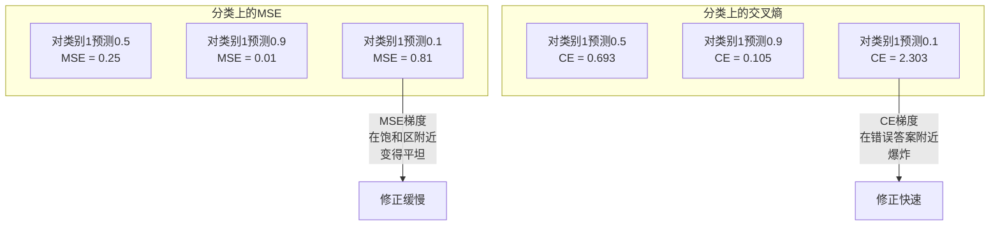
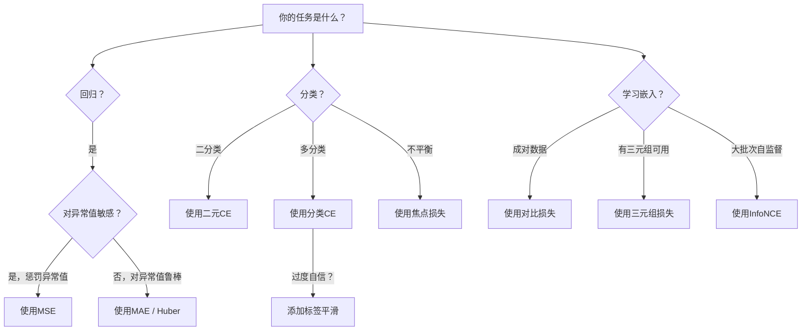
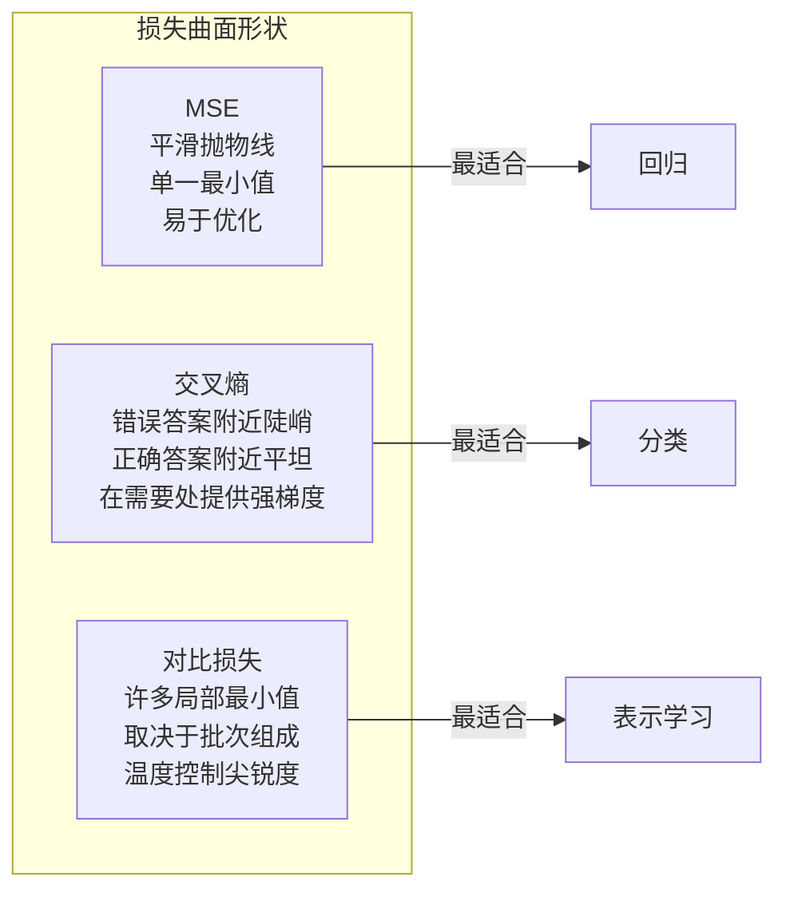

# 损失函数（Loss Functions）

> 你的网络做出了一个预测。真实情况并非如此。它错得有多离谱？那个数字就是损失。选错了损失函数，你的模型就会朝着完全错误的方向进行优化。

**类型：** 构建
**语言：** Python
**前置知识：** 第03.04课（激活函数）
**时长：** 约75分钟

## 学习目标

- 从头实现均方误差（MSE）、二元交叉熵（Binary Cross-Entropy）、分类交叉熵（Categorical Cross-Entropy）和对比损失（Contrastive Loss，即InfoNCE）及其梯度
- 通过演示“对所有样本都预测0.5”的失效模式，解释为什么MSE不适用于分类问题
- 对交叉熵应用标签平滑（Label Smoothing），并描述它如何防止过度自信的预测
- 为回归、二分类、多分类和嵌入学习任务选择正确的损失函数

## 问题

一个用MSE最小化损失的分类模型，会自信地对所有样本预测0.5。它确实在最小化损失，但毫无用处。

损失函数是模型唯一真正优化的东西。不是准确率，不是F1分数，也不是你汇报给经理的任何指标。优化器计算损失函数的梯度，并调整权重使那个数值变小。如果损失函数没有抓住你所关心的东西，模型就会找到数学上最廉价的方式来满足它，而这种方式几乎永远不是你想要的。

这里有一个具体的例子。你有一个二分类任务，两个类别各占50%。你使用MSE作为损失。模型对每一个输入都预测0.5。平均MSE为0.25，这是在没有学到任何东西的情况下能达到的最小值。模型完全没有判别能力，但从技术上讲，它确实最小化了你的损失函数。换成交叉熵，同一个模型会被迫将预测推向0或1，因为 -log(0.5) = 0.693 是一个很差的损失，而 -log(0.99) = 0.01 则奖励自信正确的预测。损失函数的选择，决定了模型是真正在学习，还是在钻指标的空子。

情况还能更糟。在自监督学习中，你甚至没有标签。对比损失完全定义了学习信号：什么算相似，什么算不同，以及模型应该将它们推开的力度。如果对比损失选错了，你的嵌入就会坍缩到一个点上——每个输入都映射到同一个向量。从技术上讲，损失为零，但完全无用。

## 概念

### 均方误差（Mean Squared Error，MSE）

回归的默认选择。计算预测值与目标值之间的平方差，再对所有样本取平均。

```
MSE = (1/n) * sum((y_pred - y_true)^2)
```

为什么平方很重要：它二次方地惩罚大误差。误差2的成本是误差1的4倍。误差10的成本是100倍。这使得MSE对异常值敏感——单个严重错误的预测就会主导损失。

实际数字：如果你的模型预测房价，大多数房子偏差10,000美元，但有一栋豪宅偏差200,000美元，MSE会积极尝试修正那栋豪宅，可能损害其他99栋房子的表现。

MSE关于预测值的梯度为：

```
dMSE/dy_pred = (2/n) * (y_pred - y_true)
```

误差与梯度呈线性关系。误差越大，梯度越大。这对回归来说是优点（大误差需要大修正），但对分类来说是缺陷（你希望以指数方式惩罚自信的错误答案，而不是线性方式）。

### 交叉熵损失（Cross-Entropy Loss）

分类问题的损失函数。源于信息论——它衡量预测概率分布与真实分布之间的散度（divergence）。

**二元交叉熵（Binary Cross-Entropy，BCE）：**

```
BCE = -(y * log(p) + (1 - y) * log(1 - p))
```

其中 y 是真实标签（0或1），p 是预测概率。

为什么 -log(p) 有效：当真实标签为1且你预测 p = 0.99 时，损失为 -log(0.99) = 0.01。当你预测 p = 0.01 时，损失为 -log(0.01) = 4.6。这460倍的差异就是交叉熵有效的原因。它残忍地惩罚自信的错误预测，而对自信正确的预测几乎不加惩罚。

梯度也说明了同样的问题：

```
dBCE/dp = -(y/p) + (1-y)/(1-p)
```

当 y = 1 且 p 接近0时，梯度为 -1/p，趋近于负无穷。模型得到一个巨大的信号来修正错误。当 p 接近1时，梯度很小。已经正确了，无需修正。

**分类交叉熵（Categorical Cross-Entropy）：**

适用于独热编码（one-hot encoded）目标的多分类问题。

```
CCE = -sum(y_i * log(p_i))
```

只有真实类别贡献到损失中（因为所有其他 y_i 均为0）。如果有10个类别，正确类别的概率为0.1（随机猜测），损失为 -log(0.1) = 2.3。如果正确类别的概率为0.9，损失为 -log(0.9) = 0.105。模型学会将概率质量集中在正确的答案上。

### 为什么MSE不适合分类



当预测值接近0或1时（由于sigmoid饱和），MSE梯度变得平坦。交叉熵梯度弥补了这一点——-log抵消了sigmoid的平坦区域，在最需要的地方提供强劲的梯度。

### 标签平滑（Label Smoothing）

标准的独热标签表示“这是100%的类别3，0%的其他任何类别”。这是一个很强的断言。标签平滑将其软化：

```
smooth_label = (1 - alpha) * one_hot + alpha / num_classes
```

当 alpha = 0.1 且类别数为10时：目标从 [0, 0, 1, 0, ...] 变为 [0.01, 0.01, 0.91, 0.01, ...]。模型的目标是0.91而不是1.0。

为什么有效：试图通过softmax输出精确的1.0需要将logits推向无穷大。这会导致过度自信、损害泛化能力，并使模型对分布偏移（distribution shift）变得脆弱。标签平滑将目标上限设为0.9（当alpha=0.1时），使logits保持在合理范围内。GPT和大多数现代模型都使用标签平滑或其等效方法。

### 对比损失（Contrastive Loss）

没有标签。没有类别。只有成对的输入和问题：这些是相似还是不同？

**SimCLR风格的对比损失（NT-Xent / InfoNCE）：**

取一张图像。创建它的两个增强视图（裁剪、旋转、颜色抖动）。这是“正样本对”——它们应该具有相似的嵌入。批次中的每一张其他图像构成“负样本对”——它们应该具有不同的嵌入。

```
L = -log(exp(sim(z_i, z_j) / tau) / sum(exp(sim(z_i, z_k) / tau)))
```

其中 sim() 是余弦相似度，z_i 和 z_j 是正样本对，求和覆盖所有负样本，tau（温度，temperature）控制分布的尖锐程度。温度越低 = 负样本越硬 = 分离越激进。

实际数字：批次大小256意味着每个正样本对对应255个负样本。温度 tau = 0.07（SimCLR默认值）。这个损失看起来像相似度上的softmax——它希望正样本对的相似度在256个选项中最高。

**三元组损失（Triplet Loss）：**

接受三个输入：锚点（anchor）、正样本（positive，同类）、负样本（negative，不同类）。

```
L = max(0, d(anchor, positive) - d(anchor, negative) + margin)
```

边界（margin，通常为0.2-1.0）强制正负距离之间有一个最小间隙。如果负样本已经足够远，损失为零——没有梯度，没有更新。这使得训练高效，但需要仔细的三元组挖掘（选择靠近锚点的困难负样本）。

### 焦点损失（Focal Loss）

适用于不平衡数据集。标准交叉熵对所有正确分类的样本一视同仁。焦点损失降低简单样本的权重：

```
FL = -alpha * (1 - p_t)^gamma * log(p_t)
```

其中 p_t 是真实类别的预测概率，gamma 控制聚焦程度。当 gamma = 0 时，这是标准交叉熵。当gamma = 2（默认值）时：

- 简单样本（p_t = 0.9）：权重 = (0.1)^2 = 0.01。实际上被忽略。
- 困难样本（p_t = 0.1）：权重 = (0.9)^2 = 0.81。完整的梯度信号。

焦点损失由Lin等人为物体检测引入，其中99%的候选区域是背景（简单负样本）。如果没有焦点损失，模型会被大量简单背景样本淹没，永远学不会检测物体。有了它，模型将能力集中在重要的困难、模糊案例上。

### 损失函数决策树



### 损失景观（Loss Landscape）



## 动手构建

### 第1步：MSE及其梯度

```python
def mse(predictions, targets):
    n = len(predictions)
    total = 0.0
    for p, t in zip(predictions, targets):
        total += (p - t) ** 2
    return total / n

def mse_gradient(predictions, targets):
    n = len(predictions)
    grads = []
    for p, t in zip(predictions, targets):
        grads.append(2.0 * (p - t) / n)
    return grads
```

### 第2步：二元交叉熵

log(0) 的问题是真实存在的。如果模型对正例恰好预测为0，log(0) = 负无穷。裁剪可以防止这种情况。

```python
import math

def binary_cross_entropy(predictions, targets, eps=1e-15):
    n = len(predictions)
    total = 0.0
    for p, t in zip(predictions, targets):
        p_clipped = max(eps, min(1 - eps, p))
        total += -(t * math.log(p_clipped) + (1 - t) * math.log(1 - p_clipped))
    return total / n

def bce_gradient(predictions, targets, eps=1e-15):
    grads = []
    for p, t in zip(predictions, targets):
        p_clipped = max(eps, min(1 - eps, p))
        grads.append(-(t / p_clipped) + (1 - t) / (1 - p_clipped))
    return grads
```

### 第3步：带Softmax的分类交叉熵

Softmax将原始logits转换为概率。然后我们针对独热目标计算交叉熵。

```python
def softmax(logits):
    max_val = max(logits)
    exps = [math.exp(x - max_val) for x in logits]
    total = sum(exps)
    return [e / total for e in exps]

def categorical_cross_entropy(logits, target_index, eps=1e-15):
    probs = softmax(logits)
    p = max(eps, probs[target_index])
    return -math.log(p)

def cce_gradient(logits, target_index):
    probs = softmax(logits)
    grads = list(probs)
    grads[target_index] -= 1.0
    return grads
```

Softmax + 交叉熵的梯度简化得非常漂亮：对于真实类别，它就是（预测概率 - 1），对于所有其他类别，它就是（预测概率）。这种优雅的简化并非巧合——这就是为什么softmax和交叉熵总是配对使用。

### 第4步：标签平滑

```python
def label_smoothed_cce(logits, target_index, num_classes, alpha=0.1, eps=1e-15):
    probs = softmax(logits)
    loss = 0.0
    for i in range(num_classes):
        if i == target_index:
            smooth_target = 1.0 - alpha + alpha / num_classes
        else:
            smooth_target = alpha / num_classes
        p = max(eps, probs[i])
        loss += -smooth_target * math.log(p)
    return loss
```

### 第5步：对比损失（简化的InfoNCE）

```python
def cosine_similarity(a, b):
    dot = sum(x * y for x, y in zip(a, b))
    norm_a = math.sqrt(sum(x * x for x in a))
    norm_b = math.sqrt(sum(x * x for x in b))
    if norm_a < 1e-10 or norm_b < 1e-10:
        return 0.0
    return dot / (norm_a * norm_b)

def contrastive_loss(anchor, positive, negatives, temperature=0.07):
    sim_pos = cosine_similarity(anchor, positive) / temperature
    sim_negs = [cosine_similarity(anchor, neg) / temperature for neg in negatives]

    max_sim = max(sim_pos, max(sim_negs)) if sim_negs else sim_pos
    exp_pos = math.exp(sim_pos - max_sim)
    exp_negs = [math.exp(s - max_sim) for s in sim_negs]
    total_exp = exp_pos + sum(exp_negs)

    return -math.log(max(1e-15, exp_pos / total_exp))
```

### 第6步：分类问题上的MSE vs 交叉熵

用第04课中的相同网络（圆形数据集）分别用两种损失函数训练。观察交叉熵收敛更快。

```python
import random

def sigmoid(x):
    x = max(-500, min(500, x))
    return 1.0 / (1.0 + math.exp(-x))

def make_circle_data(n=200, seed=42):
    random.seed(seed)
    data = []
    for _ in range(n):
        x = random.uniform(-2, 2)
        y = random.uniform(-2, 2)
        label = 1.0 if x * x + y * y < 1.5 else 0.0
        data.append(([x, y], label))
    return data


class LossComparisonNetwork:
    def __init__(self, loss_type="bce", hidden_size=8, lr=0.1):
        random.seed(0)
        self.loss_type = loss_type
        self.lr = lr
        self.hidden_size = hidden_size

        self.w1 = [[random.gauss(0, 0.5) for _ in range(2)] for _ in range(hidden_size)]
        self.b1 = [0.0] * hidden_size
        self.w2 = [random.gauss(0, 0.5) for _ in range(hidden_size)]
        self.b2 = 0.0

    def forward(self, x):
        self.x = x
        self.z1 = []
        self.h = []
        for i in range(self.hidden_size):
            z = self.w1[i][0] * x[0] + self.w1[i][1] * x[1] + self.b1[i]
            self.z1.append(z)
            self.h.append(max(0.0, z))

        self.z2 = sum