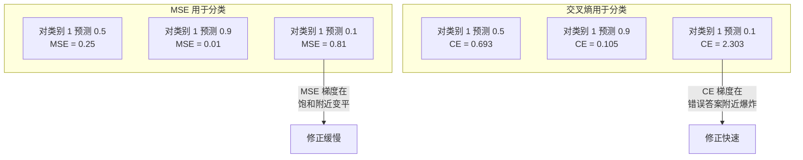
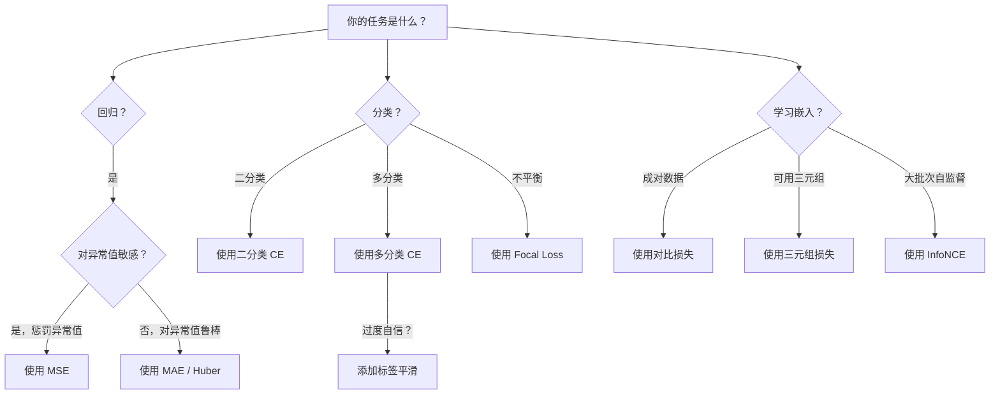
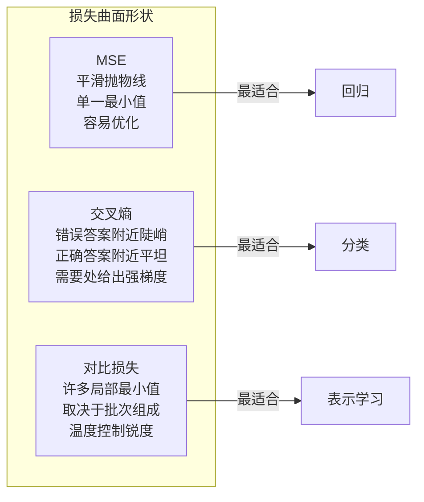

# 损失函数 (Loss Functions)

> 你的网络做出一个预测。而真实情况另有说法。它错得有多离谱？那个数字就是 loss (损失)。选错 loss function，你的模型就会完全为错误的目标进行优化。

**类型：** 动手构建
**语言：** Python
**前置知识：** 第 03.04 课（激活函数）
**时长：** ~75 分钟

## 学习目标

- 从零实现 MSE、二分类交叉熵、多分类交叉熵和对比损失 (InfoNCE) 及其梯度
- 通过演示"对所有东西预测 0.5"的失效模式，解释为什么 MSE 不适合分类任务
- 对交叉熵应用 label smoothing (标签平滑)，并描述它如何防止过于自信的预测
- 为回归、二分类、多分类和嵌入学习任务选择正确的损失函数

## 问题

一个在分类问题上最小化 MSE 的模型会自信地对所有东西预测 0.5。它在最小化 loss。它也毫无用处。

Loss function 是你的模型实际优化的唯一东西。不是准确率。不是 F1 分数。不是你向经理报告的无论什么指标。优化器获取 loss function 的梯度并调整权重使这个数字变小。如果 loss function 没有捕捉到你关心的东西，模型会找到数学上最便宜的方式来满足它，而那种方式几乎从不是你想要的结果。

这是一个具体例子。你有一个二分类任务。两个类别，50/50 分割。你使用 MSE 作为 loss。模型对每个输入都预测 0.5。平均 MSE 是 0.25，这是不真正学习任何东西情况下的最小可能值。模型具有零判别能力，但它在技术上已经最小化了你的 loss function。切换到交叉熵，同样的模型被迫将预测推向 0 或 1，因为 -log(0.5) = 0.693 是一个糟糕的 loss，而 -log(0.99) = 0.01 奖励了自信的正确预测。Loss function 的选择决定了模型是在学习还是在玩弄指标。

情况更糟。在自监督学习中，你甚至没有标签。对比损失完全定义了学习信号：什么算相似，什么算不同，以及模型应该把它们推开多远。搞错了对比损失，你的嵌入会坍缩到一个点——每个输入映射到同一个向量。技术上零 loss。完全没用。

## 概念

### 均方误差 (MSE)

回归的默认选择。计算预测值和目标值之间的平方差，对所有样本取平均。

```
MSE = (1/n) * sum((y_pred - y_true)^2)
```

为什么平方很重要：它二次方地惩罚大误差。误差 2 的代价是误差 1 的 4 倍。误差 10 的代价是 100 倍。这使得 MSE 对异常值敏感——一个极其错误的预测会主导 loss。

实际数字：如果你的模型预测房价，对大多数房子偏差 $10,000，但对一个豪宅偏差 $200,000，MSE 会激进地试图修正那个豪宅，可能损害其他 99 套房子的性能。

MSE 对预测的梯度是：

```
dMSE/dy_pred = (2/n) * (y_pred - y_true)
```

与误差成线性关系。更大的误差得到更大的梯度。这对回归是优点（大误差需要大修正），对分类是缺点（你希望以指数级而非线性级别惩罚自信的错误答案）。

### 交叉熵损失 (Cross-Entropy Loss)

用于分类的损失函数。根植于信息论——它衡量预测概率分布与真实分布之间的散度。

**二分类交叉熵 (BCE)：**

```
BCE = -(y * log(p) + (1 - y) * log(1 - p))
```

其中 y 是真实标签（0 或 1），p 是预测概率。

为什么 -log(p) 有效：当真实标签为 1 且你预测 p = 0.99 时，loss 是 -log(0.99) = 0.01。当你预测 p = 0.01 时，loss 是 -log(0.01) = 4.6。这 460 倍的差异就是交叉熵有效的原因。它残酷地惩罚自信的错误预测，同时几乎不惩罚自信的正确预测。

梯度讲述了同样的故事：

```
dBCE/dp = -(y/p) + (1-y)/(1-p)
```

当 y = 1 且 p 接近零时，梯度是 -1/p，接近负无穷大。模型收到巨大的信号来修正其错误。当 p 接近 1 时，梯度很小。已经正确，无需修正。

**多分类交叉熵：**

用于独热编码目标的多分类任务。

```
CCE = -sum(y_i * log(p_i))
```

只有真实类别对 loss 有贡献（因为所有其他 y_i 为零）。如果有 10 个类别，正确类别获得概率 0.1（随机猜测），loss 是 -log(0.1) = 2.3。如果正确类别获得概率 0.9，loss 是 -log(0.9) = 0.105。模型学习将概率质量集中在正确的答案上。

### 为什么 MSE 不适合分类


```mermaid
graph TD
    subgraph "MSE 用于分类"
        P1["对类别 1 预测 0.5<br/>MSE = 0.25"]
        P2["对类别 1 预测 0.9<br/>MSE = 0.01"]
        P3["对类别 1 预测 0.1<br/>MSE = 0.81"]
    end
    subgraph "交叉熵用于分类"
        C1["对类别 1 预测 0.5<br/>CE = 0.693"]
        C2["对类别 1 预测 0.9<br/>CE = 0.105"]
        C3["对类别 1 预测 0.1<br/>CE = 2.303"]
    end
    P3 -->|"MSE 梯度在<br/>饱和附近变平"| Slow["修正缓慢"]
    C3 -->|"CE 梯度在<br/>错误答案附近爆炸"| Fast["修正快速"]
```

当预测接近 0 或 1 时，MSE 梯度变平（由于 sigmoid 饱和）。交叉熵梯度补偿了这一点——-log 抵消了 sigmoid 的平坦区域，在最需要的地方给出强梯度。

### 标签平滑 (Label Smoothing)

标准的独热标签说"这是 100% 类别 3，0% 其他所有"。这是一个强声明。标签平滑将其软化：

```
smooth_label = (1 - alpha) * one_hot + alpha / num_classes
```

使用 alpha = 0.1 和 10 个类别：目标从 [0, 0, 1, 0, ...] 变为 [0.01, 0.01, 0.91, 0.01, ...]。模型瞄准 0.91 而不是 1.0。

为什么有效：试图通过 softmax 输出恰好 1.0 的模型需要将 logits 推向无穷大。这会导致过度自信，损害泛化能力，并使模型对分布变化脆弱。标签平滑将目标上限设为 0.9（当 alpha=0.1 时），将 logits 保持在合理范围内。GPT 和大多数现代模型使用标签平滑或其等效方法。

### 对比损失 (Contrastive Loss)

没有标签。没有类别。只有输入对和问题：这些是相似还是不同？

**SimCLR 风格的对比损失 (NT-Xent / InfoNCE)：**

取一张图像。创建它的两个增强视图（裁剪、旋转、颜色抖动）。这些是"正样本对"——它们应该有相似的嵌入。批次中的每个其他图像形成一个"负样本对"——它们应该有不同的嵌入。

```
L = -log(exp(sim(z_i, z_j) / tau) / sum(exp(sim(z_i, z_k) / tau)))
```

其中 sim() 是余弦相似度，z_i 和 z_j 是正样本对，求和是对所有负样本，tau（温度）控制分布的尖锐程度。温度越低 = 负样本越硬 = 更激进的分离。

实际数字：批次大小 256 意味着每个正样本对有 255 个负样本。温度 tau = 0.07（SimCLR 默认值）。这个 loss 类似于相似度上的 softmax——它希望正样本对的相似度在 256 个选项中最高。

**三元组损失 (Triplet Loss)：**

接收三个输入：锚点、正样本（同类别）、负样本（不同类别）。

```
L = max(0, d(anchor, positive) - d(anchor, negative) + margin)
```

间隔 margin（通常为 0.2-1.0）强制正负距离之间的最小差距。如果负样本已经足够远，loss 为零——没有梯度，没有更新。这使得训练高效，但需要仔细的三元组挖掘（选择靠近锚点的困难负样本）。

### Focal Loss

用于不平衡数据集。标准交叉熵对所有正确分类的样本一视同仁。Focal loss 降低简单样本的权重：

```
FL = -alpha * (1 - p_t)^gamma * log(p_t)
```

其中 p_t 是真实类别的预测概率，gamma 控制聚焦程度。当 gamma = 0 时，这是标准交叉熵。当 gamma = 2（默认值）时：

- 简单样本 (p_t = 0.9)：权重 = (0.1)^2 = 0.01。被有效忽略。
- 困难样本 (p_t = 0.1)：权重 = (0.9)^2 = 0.81。完整的梯度信号。

Focal loss 由 Lin 等人为物体检测引入，其中 99% 的候选区域是背景（简单负样本）。没有 focal loss，模型淹没在简单的背景样本中，永远学不会检测物体。有了它，模型将其能力集中在重要的困难、模糊案例上。

### 损失函数决策树


```mermaid
flowchart TD
    Start["你的任务是什么？"] --> Reg{"回归？"}
    Start --> Cls{"分类？"}
    Start --> Emb{"学习嵌入？"}

    Reg -->|"是"| Outliers{"对异常值敏感？"}
    Outliers -->|"是，惩罚异常值"| MSE["使用 MSE"]
    Outliers -->|"否，对异常值鲁棒"| MAE["使用 MAE / Huber"]

    Cls -->|"二分类"| BCE["使用二分类 CE"]
    Cls -->|"多分类"| CCE["使用多分类 CE"]
    Cls -->|"不平衡"| FL["使用 Focal Loss"]
    CCE -->|"过度自信？"| LS["添加标签平滑"]

    Emb -->|"成对数据"| CL["使用对比损失"]
    Emb -->|"可用三元组"| TL["使用三元组损失"]
    Emb -->|"大批次自监督"| NCE["使用 InfoNCE"]
```

### 损失景观


```mermaid
graph LR
    subgraph "损失曲面形状"
        MSE_S["MSE<br/>平滑抛物线<br/>单一最小值<br/>容易优化"]
        CE_S["交叉熵<br/>错误答案附近陡峭<br/>正确答案附近平坦<br/>需要处给出强梯度"]
        CL_S["对比损失<br/>许多局部最小值<br/>取决于批次组成<br/>温度控制锐度"]
    end
    MSE_S -->|"最适合"| Reg2["回归"]
    CE_S -->|"最适合"| Cls2["分类"]
    CL_S -->|"最适合"| Emb2["表示学习"]
```

```figure
cross-entropy-loss
```

## 动手构建

### 第 1 步：MSE 及其梯度

```python
def mse(predictions, targets):
    n = len(predictions)
    total = 0.0
    for p, t in zip(predictions, targets):
        total += (p - t) ** 2
    return total / n

def mse_gradient(predictions, targets):
    n = len(predictions)
    grads = []
    for p, t in zip(predictions, targets):
        grads.append(2.0 * (p - t) / n)
    return grads
```

### 第 2 步：二分类交叉熵

log(0) 问题是真实存在的。如果模型对正样本预测恰好为 0，log(0) = 负无穷。裁剪可以防止这种情况。

```python
import math

def binary_cross_entropy(predictions, targets, eps=1e-15):
    n = len(predictions)
    total = 0.0
    for p, t in zip(predictions, targets):
        p_clipped = max(eps, min(1 - eps, p))
        total += -(t * math.log(p_clipped) + (1 - t) * math.log(1 - p_clipped))
    return total / n

def bce_gradient(predictions, targets, eps=1e-15):
    grads = []
    for p, t in zip(predictions, targets):
        p_clipped = max(eps, min(1 - eps, p))
        grads.append(-(t / p_clipped) + (1 - t) / (1 - p_clipped))
    return grads
```

### 第 3 步：带 Softmax 的多分类交叉熵

Softmax 将原始 logits 转换为概率。然后我们计算与独热目标的交叉熵。

```python
def softmax(logits):
    max_val = max(logits)
    exps = [math.exp(x - max_val) for x in logits]
    total = sum(exps)
    return [e / total for e in exps]

def categorical_cross_entropy(logits, target_index, eps=1e-15):
    probs = softmax(logits)
    p = max(eps, probs[target_index])
    return -math.log(p)

def cce_gradient(logits, target_index):
    probs = softmax(logits)
    grads = list(probs)
    grads[target_index] -= 1.0
    return grads
```

Softmax + 交叉熵的梯度优美地简化了：就是真实类别的（预测概率 - 1），以及其他所有类别的（预测概率）。这个优雅的简化并非巧合——这就是为什么 softmax 和交叉熵是配对使用的。

### 第 4 步：标签平滑

```python
def label_smoothed_cce(logits, target_index, num_classes, alpha=0.1, eps=1e-15):
    probs = softmax(logits)
    loss = 0.0
    for i in range(num_classes):
        if i == target_index:
            smooth_target = 1.0 - alpha + alpha / num_classes
        else:
            smooth_target = alpha / num_classes
        p = max(eps, probs[i])
        loss += -smooth_target * math.log(p)
    return loss
```

### 第 5 步：对比损失（简化版 InfoNCE）

```python
def cosine_similarity(a, b):
    dot = sum(x * y for x, y in zip(a, b))
    norm_a = math.sqrt(sum(x * x for x in a))
    norm_b = math.sqrt(sum(x * x for x in b))
    if norm_a < 1e-10 or norm_b < 1e-10:
        return 0.0
    return dot / (norm_a * norm_b)

def contrastive_loss(anchor, positive, negatives, temperature=0.07):
    sim_pos = cosine_similarity(anchor, positive) / temperature
    sim_negs = [cosine_similarity(anchor, neg) / temperature for neg in negatives]

    max_sim = max(sim_pos, max(sim_negs)) if sim_negs else sim_pos
    exp_pos = math.exp(sim_pos - max_sim)
    exp_negs = [math.exp(s - max_sim) for s in sim_negs]
    total_exp = exp_pos + sum(exp_negs)

    return -math.log(max(1e-15, exp_pos / total_exp))
```

### 第 6 步：MSE vs 交叉熵在分类上的比较

使用两种 loss function 训练来自第 04 课相同的网络（圆形数据集）。观察交叉熵收敛更快。

```python
import random

def sigmoid(x):
    x = max(-500, min(500, x))
    return 1.0 / (1.0 + math.exp(-x))

def make_circle_data(n=200, seed=42):
    random.seed(seed)
    data = []
    for _ in range(n):
        x = random.uniform(-2, 2)
        y = random.uniform(-2, 2)
        label = 1.0 if x * x + y * y < 1.5 else 0.0
        data.append(([x, y], label))
    return data


class LossComparisonNetwork:
    def __init__(self, loss_type="bce", hidden_size=8, lr=0.1):
        random.seed(0)
        self.loss_type = loss_type
        self.lr = lr
        self.hidden_size = hidden_size

        self.w1 = [[random.gauss(0, 0.5) for _ in range(2)] for _ in range(hidden_size)]
        self.b1 = [0.0] * hidden_size
        self.w2 = [random.gauss(0, 0.5) for _ in range(hidden_size)]
        self.b2 = 0.0

    def forward(self, x):
        self.x = x
        self.z1 = []
        self.h = []
        for i in range(self.hidden_size):
            z = self.w1[i][0] * x[0] + self.w1[i][1] * x[1] + self.b1[i]
            self.z1.append(z)
            self.h.append(max(0.0, z))

        self.z2 = sum(self.w2[i] * self.h[i] for i in range(self.hidden_size)) + self.b2
        self.out = sigmoid(self.z2)
        return self.out

    def backward(self, target):
        if self.loss_type == "mse":
            d_loss = 2.0 * (self.out - target)
        else:
            eps = 1e-15
            p = max(eps, min(1 - eps, self.out))
            d_loss = -(target / p) + (1 - target) / (1 - p)

        d_sigmoid = self.out * (1 - self.out)
        d_out = d_loss * d_sigmoid

        for i in range(self.hidden_size):
            d_relu = 1.0 if self.z1[i] > 0 else 0.0
            d_h = d_out * self.w2[i] * d_relu
            self.w2[i] -= self.lr * d_out * self.h[i]
            for j in range(2):
                self.w1[i][j] -= self.lr * d_h * self.x[j]
            self.b1[i] -= self.lr * d_h
        self.b2 -= self.lr * d_out

    def compute_loss(self, pred, target):
        if self.loss_type == "mse":
            return (pred - target) ** 2
        else:
            eps = 1e-15
            p = max(eps, min(1 - eps, pred))
            return -(target * math.log(p) + (1 - target) * math.log(1 - p))

    def train(self, data, epochs=200):
        losses = []
        for epoch in range(epochs):
            total_loss = 0.0
            correct = 0
            for x, y in data:
                pred = self.forward(x)
                self.backward(y)
                total_loss += self.compute_loss(pred, y)
                if (pred >= 0.5) == (y >= 0.5):
                    correct += 1
            avg_loss = total_loss / len(data)
            accuracy = correct / len(data) * 100
            losses.append((avg_loss, accuracy))
            if epoch % 50 == 0 or epoch == epochs - 1:
                print(f"    Epoch {epoch:3d}: loss={avg_loss:.4f}, accuracy={accuracy:.1f}%")
        return losses
```

## 使用它

PyTorch 提供了所有标准 loss function，内置数值稳定性：

```python
import torch
import torch.nn as nn
import torch.nn.functional as F

predictions = torch.tensor([0.9, 0.1, 0.7], requires_grad=True)
targets = torch.tensor([1.0, 0.0, 1.0])

mse_loss = F.mse_loss(predictions, targets)
bce_loss = F.binary_cross_entropy(predictions, targets)

logits = torch.randn(4, 10)
labels = torch.tensor([3, 7, 1, 9])
ce_loss = F.cross_entropy(logits, labels)
ce_smooth = F.cross_entropy(logits, labels, label_smoothing=0.1)
```

使用 `F.cross_entropy`（而不是 `F.nll_loss` 加手动 softmax）。它将 log-softmax 和负对数似然结合在一个数值稳定的操作中。先单独应用 softmax 再取对数稳定性较差——在大指数相减时会损失精度。

对于对比学习，大多数团队使用自定义实现或像 `lightly` 或 `pytorch-metric-learning` 这样的库。核心循环总是相同的：计算成对相似度，在正负样本上创建 softmax，反向传播。

## 交付物

本课程产出：
- `outputs/prompt-loss-function-selector.md` —— 一个用于选择正确 loss function 的可复用提示词
- `outputs/prompt-loss-debugger.md` —— 当你的 loss 曲线看起来不对时的诊断提示词

## 练习

1. 实现 Huber loss (平滑 L1 loss)，它对小误差使用 MSE，对大误差使用 MAE。在一个预测 y = sin(x) 的回归网络上比较 MSE 与 Huber，其中 5% 的训练目标添加了随机噪声（异常值）。比较最终测试误差。
2. 在二分类训练循环中添加 focal loss。创建一个不平衡数据集（90% 类别 0，10% 类别 1）。比较标准 BCE 与 focal loss (gamma=2) 在 200 个 epoch 后对少数类别的召回率。
3. 实现带半困难负样本挖掘的三元组损失。为 5 个类别生成 2D 嵌入数据。对每个锚点，找到仍比正样本远的最近负样本（半困难）。比较与随机三元组选择的收敛速度。
4. 运行 MSE vs 交叉熵比较，但在训练期间跟踪每层的梯度幅度。绘制每个 epoch 的平均梯度范数。验证交叉熵在模型最不确定的早期 epoch 产生更大的梯度。
5. 实现 KL 散度 loss，并验证当真实分布是独热分布时，最小化 KL(真实 || 预测) 给出的梯度与交叉熵相同。然后尝试软目标（如知识蒸馏），其中"真实"分布来自教师模型的 softmax 输出。

## 关键术语

| 术语 | 人们怎么说 | 实际含义 |
|------|-----------|---------|
| Loss function | "模型有多错" | 一个可微函数，将预测和目标映射到一个标量，优化器将其最小化 |
| MSE | "平均平方误差" | 预测与目标之间平方差的均值；二次方地惩罚大误差 |
| Cross-entropy | "分类损失" | 使用 -log(p) 衡量预测概率分布与真实分布之间的散度 |
| Binary cross-entropy | "BCE" | 两个类别的交叉熵：-(y*log(p) + (1-y)*log(1-p)) |
| Label smoothing | "软化目标" | 将硬 0/1 目标替换为软值（例如 0.1/0.9），以防止过度自信并改善泛化 |
| Contrastive loss | "拉近相似，推开不同" | 一种 loss，通过使相似对在嵌入空间中靠近、不相似对远离来学习表示 |
| InfoNCE | "CLIP/SimCLR 的 loss" | 对相似度分数进行归一化温度缩放交叉熵；将对比学习视为分类问题 |
| Focal loss | "不平衡数据的修复" | 交叉熵乘以 (1-p_t)^gamma 以降低简单样本的权重并聚焦于困难样本 |
| Triplet loss | "锚点-正样本-负样本" | 在嵌入空间中将锚点推得比负样本更靠近正样本至少一个间隔 |
| Temperature | "锐度旋钮" | 对 logits/相似度的标量除数，控制结果分布的峰值程度；越低 = 越尖锐 |

## 延伸阅读

- Lin et al., "Focal Loss for Dense Object Detection" (2017) —— 引入 focal loss 以处理物体检测中的极端类别不平衡 (RetinaNet)
- Chen et al., "A Simple Framework for Contrastive Learning of Visual Representations" (SimCLR, 2020) —— 使用 NT-Xent loss 定义了现代对比学习流程
- Szegedy et al., "Rethinking the Inception Architecture" (2016) —— 引入标签平滑作为正则化技术，现已成为大多数大型模型的标准做法
- Hinton et al., "Distilling the Knowledge in a Neural Network" (2015) —— 使用软目标和 KL 散度的知识蒸馏，是模型压缩的基础
