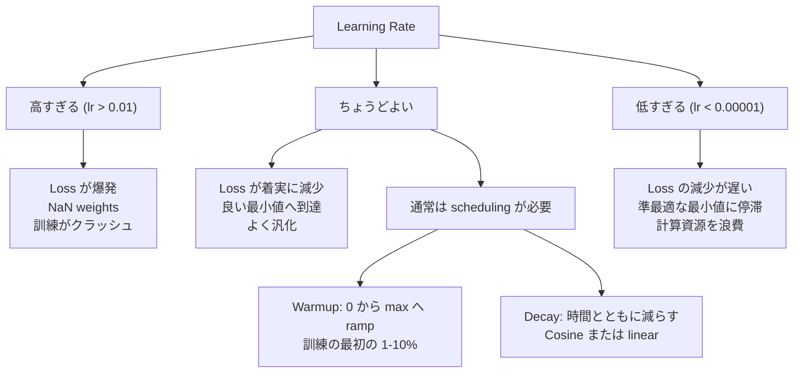
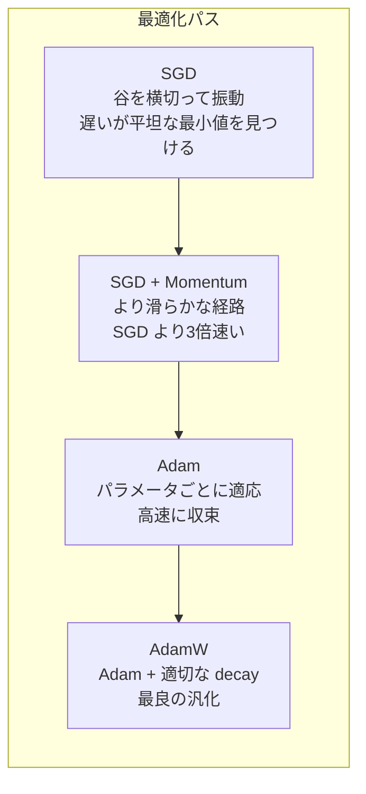
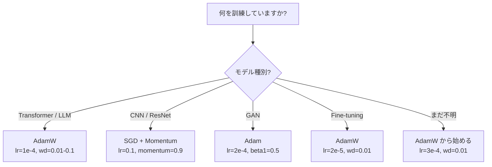

# オプティマイザ

> 勾配降下は、どちらへ動くべきかを教えてくれます。どれくらい遠くへ、どれくらい速く動くべきかは教えてくれません。SGD はコンパスです。Adam は渋滞情報付きの GPS です。

**種類:** Build
**言語:** Python
**前提:** レッスン 03.05（Loss Functions）
**時間:** 約75分

## 学習目標

- SGD、momentum 付き SGD、Adam、AdamW optimizer を Python でゼロから実装する
- Adam の bias correction が、訓練初期のゼロ初期化された moment 推定をどのように補正するかを説明する
- 同じタスクで、AdamW が L2 正則化付き Adam より良い汎化を生む理由を示す
- transformers、CNNs、GANs、fine-tuning に対して適切な optimizer とデフォルトハイパーパラメータを選ぶ

## 問題

勾配は計算できました。weight #4,721 は損失を減らすために 0.003 減らすべきだと分かっています。しかし 0.003 とはどの単位でしょうか。何でスケールすべきでしょうか。そして step 1 と step 1,000 で同じ量だけ動くべきでしょうか。

素の gradient descent は、すべての step で、すべてのパラメータに同じ learning rate を適用します: w = w - lr * gradient。これは、実務でニューラルネットワークの訓練を苦しくする3つの問題を生みます。

第一に、振動です。損失地形は滑らかなお椀のような形であることはほとんどありません。むしろ長く狭い谷のような形です。勾配は谷に沿った方向（浅い方向）ではなく、谷を横切る方向（急な方向）を指します。gradient descent は狭い次元を行ったり来たり跳ねながら、有用な方向にはわずかにしか進みません。これはよく見ます。loss が急に下がってから plateau するのは、モデルが収束したからではなく、振動しているからです。

第二に、すべてのパラメータに1つの learning rate を使うのは間違っています。大きな更新が必要な重みもあります（初期の underfitting 段階にあるもの）。小さな更新だけでよい重みもあります（最適値に近いもの）。前者に合う learning rate は後者を壊し、後者に合う learning rate は前者には小さすぎます。

第三に、saddle points です。高次元の損失地形には、勾配がゼロに近い広大な平坦領域があります。素の SGD は、この領域を勾配の速度、つまり実質ゼロの速度で這って進みます。モデルは詰まっているように見えます。実際には詰まっていません。その先に有用な降下方向がある平坦領域にいるだけです。しかし SGD には押し抜ける仕組みがありません。

Adam はこの3つすべてを解決します。パラメータごとに2つの running average を維持します。平均勾配（momentum、振動を扱う）と、二乗勾配の平均（adaptive rate、スケールの違いを扱う）です。最初の数 step に対する bias correction と組み合わせることで、デフォルトハイパーパラメータのまま80%の問題で動く単一の optimizer になります。このレッスンでは、それをゼロから作り、残り20%でいつ、なぜ失敗するかを正確に理解します。

## 概念

### Stochastic Gradient Descent（SGD）

最も単純な optimizer です。mini-batch で勾配を計算し、反対方向へ step します。

```
w = w - lr * gradient
```

「stochastic」は、full dataset ではなくランダムな subset（mini-batch）を使って勾配を推定するという意味です。このノイズは実は有用で、鋭い局所最小から抜ける助けになります。ただしノイズは振動も引き起こします。

learning rate が唯一のノブです。高すぎると loss は発散します。低すぎると訓練に永遠に時間がかかります。最適値は、アーキテクチャ、データ、batch size、訓練の現在段階に依存します。現代的なネットワークで素の SGD を使う場合、典型値は 0.01 から 0.1 です。ただし1回の訓練の中でも、理想的な learning rate は変化します。

### Momentum

坂を転がるボールの比喩は使い古されていますが、正確です。勾配だけで step する代わりに、過去の勾配を蓄積する velocity を維持します。

```
m_t = beta * m_{t-1} + gradient
w = w - lr * m_t
```

Beta（通常 0.9）は、どれくらい履歴を保持するかを制御します。beta = 0.9 では、momentum はおおよそ直近10個の勾配の平均です（1 / (1 - 0.9) = 10）。

これが振動を直す理由: 同じ方向を向く勾配は蓄積されます。方向が反転する勾配は打ち消し合います。狭い谷では、「横切る」成分は step ごとに符号が反転して減衰します。「沿う」成分は一貫して残り、増幅されます。その結果、有用な方向へ滑らかに加速します。

具体的には、条件の悪い損失地形で SGD 単体なら 10,000 steps かかるかもしれません。同じ問題で momentum 付き SGD（beta=0.9）なら、典型的には 3,000-5,000 steps です。この高速化は小さな差ではありません。

### RMSProp

実際にうまく機能した最初のパラメータごとの adaptive learning rate 手法です。Hinton が Coursera の講義で提案しました（正式な論文としては未発表）。

```
s_t = beta * s_{t-1} + (1 - beta) * gradient^2
w = w - lr * gradient / (sqrt(s_t) + epsilon)
```

s_t は二乗勾配の running average を追跡します。継続的に大きな勾配を持つパラメータは大きな数で割られます（有効 learning rate が小さくなる）。小さな勾配を持つパラメータは小さな数で割られます（有効 learning rate が大きくなる）。

これは「すべてのパラメータに1つの learning rate」問題を解決します。すでに大きな更新を受け続けている重みは、目標に近い可能性があります。遅くします。小さな更新しか受けていない重みは、学習不足かもしれません。速くします。

Epsilon（通常 1e-8）は、パラメータがまだ更新されていないときのゼロ除算を防ぎます。

### Adam: Momentum + RMSProp

Adam はこの2つのアイデアを組み合わせます。パラメータごとに2つの exponential moving averages を維持します。

```
m_t = beta1 * m_{t-1} + (1 - beta1) * gradient        (first moment: mean)
v_t = beta2 * v_{t-1} + (1 - beta2) * gradient^2       (second moment: variance)
```

**Bias correction** は、多くの説明が飛ばす重要な細部です。step 1 では、m_1 = (1 - beta1) * gradient です。beta1 = 0.9 なら、これは 0.1 * gradient、つまり10倍小さすぎます。moving average がまだ温まっていないからです。bias correction はこれを補正します。

```
m_hat = m_t / (1 - beta1^t)
v_hat = v_t / (1 - beta2^t)
```

step 1 で beta1 = 0.9 の場合、m_hat = m_1 / (1 - 0.9) = m_1 / 0.1 = 実際の勾配です。step 100 では、(1 - 0.9^100) はほぼ 1.0 なので、補正は消えます。bias correction が重要なのは最初の約10 steps で、約50 steps 後にはほぼ関係なくなります。

更新式は次のとおりです。

```
w = w - lr * m_hat / (sqrt(v_hat) + epsilon)
```

Adam のデフォルトは、lr = 0.001、beta1 = 0.9、beta2 = 0.999、epsilon = 1e-8 です。これらのデフォルトは80%の問題で機能します。機能しないときは、まず lr を変えます。次に beta2 です。beta1 や epsilon を変えることはほとんどありません。

### AdamW: 正しい Weight Decay

L2 正則化は lambda * w^2 を損失に追加します。素の SGD では、これは weight decay（各 step で weight から lambda * w を引くこと）と等価です。Adam では、この等価性が壊れます。

Loshchilov & Hutter の洞察はこうです。L2 を損失に追加し、その勾配を Adam が処理すると、adaptive learning rate が正則化項もスケールしてしまいます。勾配分散が大きいパラメータは正則化が弱くなります。分散が小さいパラメータは正則化が強くなります。これは望む挙動ではありません。勾配統計に関係なく、一様な正則化が欲しいはずです。

AdamW は、Adam update の後に weight decay を直接重みに適用してこれを修正します。

```
w = w - lr * m_hat / (sqrt(v_hat) + epsilon) - lr * lambda * w
```

weight decay 項（lr * lambda * w）は、Adam の adaptive factor でスケールされません。すべてのパラメータが同じ比例縮小を受けます。

これは小さな細部に見えます。違います。AdamW は、ほぼすべてのタスクで Adam + L2 正則化より良い解へ収束します。PyTorch では、transformer、diffusion model、そして現代的な多くのアーキテクチャを訓練するデフォルト optimizer です。BERT、GPT、LLaMA、Stable Diffusion はすべて AdamW で訓練されています。

### Learning Rate: 最も重要なハイパーパラメータ



ハイパーパラメータを1つだけ調整するなら、learning rate を調整してください。learning rate の10倍の変化は、あなたが行うどんなアーキテクチャ上の判断よりも大きく効きます。よく使うデフォルトは次のとおりです。

- SGD: lr = 0.01 to 0.1
- Adam/AdamW: lr = 1e-4 to 3e-4
- 事前訓練済みモデルの fine-tuning: lr = 1e-5 to 5e-5
- Learning rate warmup: 最初の 1-10% steps で linear ramp

### Optimizer の比較



### どの Optimizer がいつ勝つか



## 作ってみる

### Step 1: Vanilla SGD

```python
class SGD:
    def __init__(self, lr=0.01):
        self.lr = lr

    def step(self, params, grads):
        for i in range(len(params)):
            params[i] -= self.lr * grads[i]
```

### Step 2: Momentum 付き SGD

```python
class SGDMomentum:
    def __init__(self, lr=0.01, beta=0.9):
        self.lr = lr
        self.beta = beta
        self.velocities = None

    def step(self, params, grads):
        if self.velocities is None:
            self.velocities = [0.0] * len(params)
        for i in range(len(params)):
            self.velocities[i] = self.beta * self.velocities[i] + grads[i]
            params[i] -= self.lr * self.velocities[i]
```

### Step 3: Adam

```python
import math

class Adam:
    def __init__(self, lr=0.001, beta1=0.9, beta2=0.999, epsilon=1e-8):
        self.lr = lr
        self.beta1 = beta1
        self.beta2 = beta2
        self.epsilon = epsilon
        self.m = None
        self.v = None
        self.t = 0

    def step(self, params, grads):
        if self.m is None:
            self.m = [0.0] * len(params)
            self.v = [0.0] * len(params)

        self.t += 1

        for i in range(len(params)):
            self.m[i] = self.beta1 * self.m[i] + (1 - self.beta1) * grads[i]
            self.v[i] = self.beta2 * self.v[i] + (1 - self.beta2) * grads[i] ** 2

            m_hat = self.m[i] / (1 - self.beta1 ** self.t)
            v_hat = self.v[i] / (1 - self.beta2 ** self.t)

            params[i] -= self.lr * m_hat / (math.sqrt(v_hat) + self.epsilon)
```

### Step 4: AdamW

```python
class AdamW:
    def __init__(self, lr=0.001, beta1=0.9, beta2=0.999, epsilon=1e-8, weight_decay=0.01):
        self.lr = lr
        self.beta1 = beta1
        self.beta2 = beta2
        self.epsilon = epsilon
        self.weight_decay = weight_decay
        self.m = None
        self.v = None
        self.t = 0

    def step(self, params, grads):
        if self.m is None:
            self.m = [0.0] * len(params)
            self.v = [0.0] * len(params)

        self.t += 1

        for i in range(len(params)):
            self.m[i] = self.beta1 * self.m[i] + (1 - self.beta1) * grads[i]
            self.v[i] = self.beta2 * self.v[i] + (1 - self.beta2) * grads[i] ** 2

            m_hat = self.m[i] / (1 - self.beta1 ** self.t)
            v_hat = self.v[i] / (1 - self.beta2 ** self.t)

            params[i] -= self.lr * m_hat / (math.sqrt(v_hat) + self.epsilon)
            params[i] -= self.lr * self.weight_decay * params[i]
```

### Step 5: 訓練比較

レッスン05の円データセットで、同じ2層ネットワークを4つの optimizer すべてで訓練します。収束を比較します。

```python
import random

def sigmoid(x):
    x = max(-500, min(500, x))
    return 1.0 / (1.0 + math.exp(-x))

def make_circle_data(n=200, seed=42):
    random.seed(seed)
    data = []
    for _ in range(n):
        x = random.uniform(-2, 2)
        y = random.uniform(-2, 2)
        label = 1.0 if x * x + y * y < 1.5 else 0.0
        data.append(([x, y], label))
    return data


class OptimizerTestNetwork:
    def __init__(self, optimizer, hidden_size=8):
        random.seed(0)
        self.hidden_size = hidden_size
        self.optimizer = optimizer

        self.w1 = [[random.gauss(0, 0.5) for _ in range(2)] for _ in range(hidden_size)]
        self.b1 = [0.0] * hidden_size
        self.w2 = [random.gauss(0, 0.5) for _ in range(hidden_size)]
        self.b2 = 0.0

    def get_params(self):
        params = []
        for row in self.w1:
            params.extend(row)
        params.extend(self.b1)
        params.extend(self.w2)
        params.append(self.b2)
        return params

    def set_params(self, params):
        idx = 0
        for i in range(self.hidden_size):
            for j in range(2):
                self.w1[i][j] = params[idx]
                idx += 1
        for i in range(self.hidden_size):
            self.b1[i] = params[idx]
            idx += 1
        for i in range(self.hidden_size):
            self.w2[i] = params[idx]
            idx += 1
        self.b2 = params[idx]

    def forward(self, x):
        self.x = x
        self.z1 = []
        self.h = []
        for i in range(self.hidden_size):
            z = self.w1[i][0] * x[0] + self.w1[i][1] * x[1] + self.b1[i]
            self.z1.append(z)
            self.h.append(max(0.0, z))

        self.z2 = sum(self.w2[i] * self.h[i] for i in range(self.hidden_size)) + self.b2
        self.out = sigmoid(self.z2)
        return self.out

    def compute_grads(self, target):
        eps = 1e-15
        p = max(eps, min(1 - eps, self.out))
        d_loss = -(target / p) + (1 - target) / (1 - p)
        d_sigmoid = self.out * (1 - self.out)
        d_out = d_loss * d_sigmoid

        grads = [0.0] * (self.hidden_size * 2 + self.hidden_size + self.hidden_size + 1)
        idx = 0
        for i in range(self.hidden_size):
            d_relu = 1.0 if self.z1[i] > 0 else 0.0
            d_h = d_out * self.w2[i] * d_relu
            grads[idx] = d_h * self.x[0]
            grads[idx + 1] = d_h * self.x[1]
            idx += 2

        for i in range(self.hidden_size):
            d_relu = 1.0 if self.z1[i] > 0 else 0.0
            grads[idx] = d_out * self.w2[i] * d_relu
            idx += 1

        for i in range(self.hidden_size):
            grads[idx] = d_out * self.h[i]
            idx += 1

        grads[idx] = d_out
        return grads

    def train(self, data, epochs=300):
        losses = []
        for epoch in range(epochs):
            total_loss = 0.0
            correct = 0
            for x, y in data:
                pred = self.forward(x)
                grads = self.compute_grads(y)
                params = self.get_params()
                self.optimizer.step(params, grads)
                self.set_params(params)

                eps = 1e-15
                p = max(eps, min(1 - eps, pred))
                total_loss += -(y * math.log(p) + (1 - y) * math.log(1 - p))
                if (pred >= 0.5) == (y >= 0.5):
                    correct += 1
            avg_loss = total_loss / len(data)
            accuracy = correct / len(data) * 100
            losses.append((avg_loss, accuracy))
            if epoch % 75 == 0 or epoch == epochs - 1:
                print(f"    Epoch {epoch:3d}: loss={avg_loss:.4f}, accuracy={accuracy:.1f}%")
        return losses
```

## 使ってみる

PyTorch optimizer は、parameter groups、gradient clipping、learning rate scheduling を扱います。

```python
import torch
import torch.optim as optim

model = torch.nn.Sequential(
    torch.nn.Linear(784, 256),
    torch.nn.ReLU(),
    torch.nn.Linear(256, 10),
)

optimizer = optim.AdamW(model.parameters(), lr=3e-4, weight_decay=0.01)

scheduler = optim.lr_scheduler.CosineAnnealingLR(optimizer, T_max=100)

for epoch in range(100):
    optimizer.zero_grad()
    output = model(torch.randn(32, 784))
    loss = torch.nn.functional.cross_entropy(output, torch.randint(0, 10, (32,)))
    loss.backward()
    torch.nn.utils.clip_grad_norm_(model.parameters(), max_norm=1.0)
    optimizer.step()
    scheduler.step()
```

パターンは常に zero_grad、forward、loss、backward、(clip)、step、(schedule) です。この順序を覚えてください。これを間違えること（たとえば optimizer.step() の前に scheduler.step() を呼ぶこと）は、気づきにくいバグのよくある原因です。

CNN では、今でも多くの実務者が step schedule または cosine schedule とともに SGD + momentum（lr=0.1, momentum=0.9, weight_decay=1e-4）を好みます。SGD はより平坦な最小値を見つけるため、汎化が良くなることがよくあります。transformers と LLMs では、warmup + cosine decay 付き AdamW が普遍的なデフォルトです。測定に基づく理由なしに、この合意に逆らわないでください。

## 成果物

このレッスンで作るもの:
- `outputs/prompt-optimizer-selector.md` -- 任意のアーキテクチャに対して正しい optimizer と learning rate を選ぶための判断プロンプト

## 演習

1. Nesterov momentum を実装してください。現在位置ではなく「lookahead」位置（w - lr * beta * v）で勾配を計算します。円データセットで標準 momentum との収束を比較してください。

2. learning rate warmup schedule を実装してください。訓練 step の最初の10%で 0 から max_lr へ linear ramp し、その後 0 まで cosine decay します。Adam + warmup と warmup なし Adam を訓練してください。円データセットで 90% accuracy に到達するまで何 epochs かかるかを測定してください。

3. Adam 訓練中、各パラメータの有効 learning rate を追跡してください。有効 rate は lr * m_hat / (sqrt(v_hat) + eps) です。10、50、200 steps 後の有効 rate の分布をプロットしてください。すべてのパラメータは同じ速度で更新されていますか?

4. gradient clipping（global norm で clip）を実装してください。最大勾配ノルムを 1.0 に設定します。高い learning rate（Adam で lr=0.01）を使い、clipping あり/なしで訓練してください。10個の random seeds で、loss が NaN になって発散した run の数を比較してください。

5. 大きな重みを持つネットワークで Adam と AdamW を比較してください。すべての重みを [-5, 5] のランダム値（通常よりかなり大きい）で初期化します。weight_decay=0.1 で200 epochs 訓練してください。訓練中の重みの L2 norm を両 optimizer でプロットします。AdamW のほうがより速く重みを縮小するはずです。

## 重要用語

| 用語 | よく言われること | 実際の意味 |
|------|----------------|------------|
| Learning rate | 「Step size」 | 勾配更新に掛けるスカラー係数。訓練で最も影響が大きい単一のハイパーパラメータ |
| SGD | 「基本の gradient descent」 | Stochastic gradient descent。mini-batch で計算した lr * gradient を重みから引いて更新する |
| Momentum | 「転がるボールの比喩」 | 過去の勾配の exponential moving average。振動を減衰し、一貫した方向を加速する |
| RMSProp | 「Adaptive learning rate」 | 各パラメータの勾配を、その最近の勾配の running RMS で割る。learning rate を均す |
| Adam | 「デフォルト optimizer」 | momentum（first moment）と RMSProp（second moment）を、初期 steps の bias correction と組み合わせる |
| AdamW | 「正しい Adam」 | decoupled weight decay を持つ Adam。正則化を勾配経由ではなく重みに直接適用する |
| Bias correction | 「running average の warmup」 | Adam の moment 推定がゼロ初期化されることを補正するため、(1 - beta^t) で割ること |
| Weight decay | 「重みを縮める」 | 各 step で重み値の一部を引くこと。大きな重みを罰する正則化 |
| Learning rate schedule | 「時間とともに lr を変える」 | 訓練中に learning rate を調整する関数。warmup + cosine decay が現代的なデフォルト |
| Gradient clipping | 「勾配ノルムに上限をかける」 | 勾配ベクトルのノルムが閾値を超えたときに縮小すること。勾配爆発による更新を防ぐ |

## 参考資料

- Kingma & Ba, "Adam: A Method for Stochastic Optimization" (2014) -- Adam の原論文。収束解析と bias correction の導出を含む
- Loshchilov & Hutter, "Decoupled Weight Decay Regularization" (2017) -- L2 正則化と weight decay が Adam では等価ではないことを示し、AdamW を提案した論文
- Smith, "Cyclical Learning Rates for Training Neural Networks" (2017) -- LR range test と cyclical schedule を導入し、固定 learning rate の調整を不要にする考え方を示した論文
- Ruder, "An Overview of Gradient Descent Optimization Algorithms" (2016) -- optimizer 変種を明快な比較と直感でまとめた、最良の単一サーベイ
