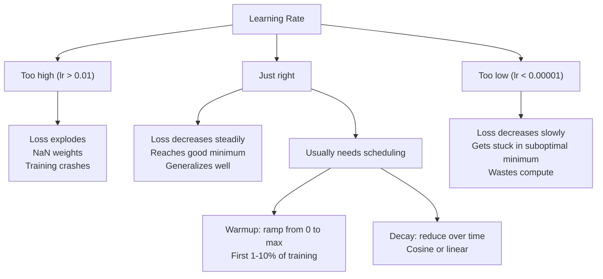
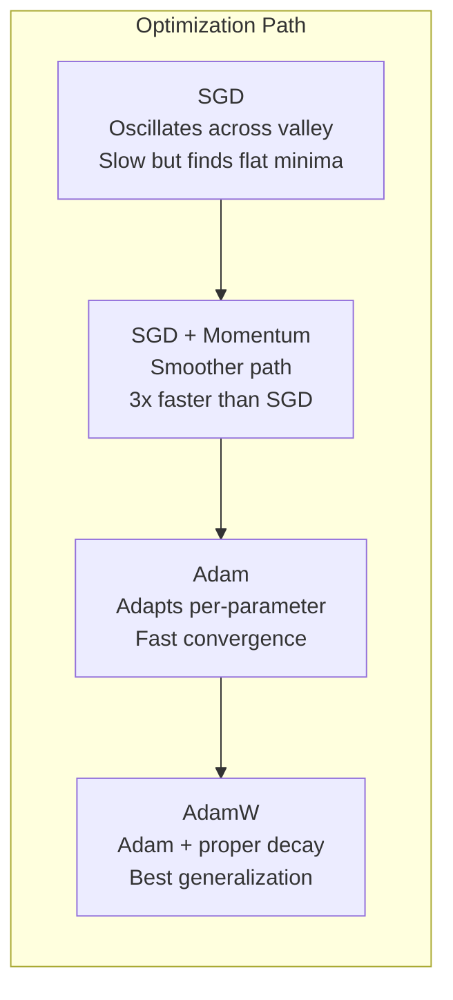
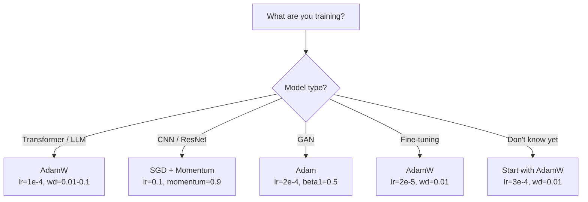

# Optimize Ediciler

> Gradient inişi size hangi yöne hareket edeceğinizi söyler. Ne kadar uzağa veya ne kadar hızlı olduğuna dair hiçbir şey söylemiyor. SGD bir pusuladır. Adam, trafik verilerini içeren GPS'tir.

**Tür:** Yapım
**Diller:** Python
**Önkoşullar:** Ders 03.05 (Loss Functions)
**Süre:** ~75 dakika

## Öğrenme Hedefleri

- Python'da momentumlu SGD, SGD, Adam ve AdamW optimizerlerini sıfırdan uygulayın
- Adam'ın sapma düzeltmesinin erken eğitim adımlarında sıfır başlangıçlı moment tahminlerini nasıl telafi ettiğini açıklayın
- Aynı görevde L2 düzenlileştirmesi ile AdamW'nin neden Adam'dan daha iyi genelleme ürettiğini gösterin
- transformer'ler, CNN'ler, GAN'lar ve fine-tuning için uygun optimize ediciyi ve varsayılan hiperparametreleri seçin

## Sorun

gradient'leri hesapladınız. Kaybı azaltmak için #4,721 ağırlığının 0,003 oranında azalması gerektiğini biliyorsunuz. Peki 0,003 hangi birimlerde? Neye göre ölçeklendirilmiş? Peki 1. adımda 1.000. adımdakiyle aynı miktarda mı hareket etmelisiniz?

Vanilya gradient iniş, her adımdaki her parametreye aynı öğrenme oranını uygular: w = w - lr * gradient. Bu, pratikte neural network'lerin eğitimini zahmetli hale getiren üç sorun yaratır.

İlk olarak salınım. Kayıp manzarası nadiren pürüzsüz bir çanak şeklindedir. Daha çok uzun ve dar bir vadiye benziyor. gradient vadi boyunca (dik yön) değil, vadi boyunca (sığ yön) işaret eder. Gradient inişi, dar boyutta ileri geri sıçrarken, kullanışlı boyutta küçük bir ilerleme kaydediyor. Şunu gördünüz: Model yakınsadığı için değil, salınım yaptığı için kayıplar hızla düşüyor, ardından plato oluyor.

İkincisi, tüm parametreler için tek bir öğrenme oranı yanlıştır. Bazı ağırlıkların büyük güncellemelere ihtiyacı vardır (bunlar henüz başlangıç ​​aşamasındadır, yetersiz uyum aşamasındadır). Diğerleri küçük güncellemelere ihtiyaç duyar (optimal değerlerine yakındırlar). Birincisi için işe yarayan bir öğrenme oranı ikincisini yok eder ve bunun tersi de geçerlidir.

Üçüncüsü, eyer noktaları. Yüksek boyutlarda kayıp manzarası, gradient'nin sıfıra yakın olduğu geniş düz bölgelere sahiptir. Vanilya SGD, bunlar arasında fiilen sıfır olan gradient hızında geziniyor. Model sıkışmış görünüyor. Sıkışmış değil; diğer tarafta kullanışlı inişin olduğu düz bir bölgede. Ancak SGD'nin bunu başaracak bir mekanizması yok.

Adam üçünü de çözer. Parametre başına iki çalışan ortalamayı korur; ortalama gradient (momentum, salınımı yönetir) ve ortalama karesi gradient (uyarlanabilir hız, farklı ölçekleri yönetir). İlk birkaç adım için önyargı düzeltmeyle birleştirildiğinde, size varsayılan hiper parametrelerle ilgili sorunların %80'inde çalışan tek bir optimize edici sunar. Bu ders onu sıfırdan oluşturur, böylece geri kalan %20'de tam olarak ne zaman ve neden başarısız olduğunu anlarsınız.

## Konsept

### Stokastik Gradient İniş (SGD)

En basit optimize edici. gradient'yi mini bir grup üzerinde hesaplayın ve ters yönde adım atın.

```
w = w - lr * gradient
```

"Stokastik", dataset'nin tamamı yerine gradient'yi tahmin etmek için rastgele bir veri alt kümesi (mini toplu) kullandığınız anlamına gelir. Bu gürültü aslında faydalıdır; keskin yerel minimumlardan kaçmaya yardımcı olur. Ancak gürültü aynı zamanda salınımlara da neden olur.

Öğrenme oranı tek düğmedir. Çok yüksek: kayıp farklılaşıyor. Çok düşük: Eğitim sonsuza kadar sürer. Optimum değer mimariye, verilere, toplu iş boyutuna ve eğitimin mevcut aşamasına bağlıdır. Modern ağlardaki vanilya SGD'si için tipik değerler 0,01 ile 0,1 arasında değişir. Ancak tek bir eğitim çalıştırmasında bile ideal öğrenme oranı değişir.

### Momentum

Topun yuvarlanması ve yokuş aşağı benzetmesi aşırı kullanılmış ama doğrudur. Yalnızca gradient'ye adım atmak yerine, gradient'lerin ötesinde biriken bir hızı korursunuz.

```
m_t = beta * m_{t-1} + gradient
w = w - lr * m_t
```

Beta (tipik olarak 0,9), ne kadar geçmişin tutulacağını kontrol eder. Beta = 0,9 ile momentum kabaca son 10 gradient'nin ortalamasıdır (1 / (1 - 0,9) = 10).

Bu neden salınımı düzeltiyor: Aynı yöne işaret eden gradient'ler birikiyor. Yön değiştiren Gradient'ler iptal edilir. Bu dar vadide, "karşı" bileşen her adımda işareti çeviriyor ve sönüyor. "Birlikte" bileşeni tutarlı kalır ve güçlendirilir. Sonuç, faydalı yönde yumuşak bir hızlanmadır.

Gerçek rakamlar: Kötü şartlandırılmış bir kayıp ortamında tek başına SGD 10.000 adım atabilir. Momentumlu (beta=0,9) SGD genellikle aynı sorun üzerinde 3.000-5.000 adım atar. Hızlanma marjinal değil.

### RMSProp

Gerçekten işe yarayan ilk parametre başına uyarlanabilir öğrenme oranı yöntemi. Hinton tarafından Coursera konferansında önerilmiştir (hiçbir zaman resmi olarak yayınlanmamıştır).

```
s_t = beta * s_{t-1} + (1 - beta) * gradient^2
w = w - lr * gradient / (sqrt(s_t) + epsilon)
```

s_t, karesi alınmış gradient'lerin devam eden ortalamasını izler. Sürekli olarak büyük gradient'lere sahip parametreler büyük bir sayıya bölünür (daha küçük etkili öğrenme oranı). Küçük gradient'lere sahip parametreler küçük bir sayıya bölünür (daha büyük etkili öğrenme oranı).

Bu, "tüm parametreler için tek öğrenme oranı" sorununu çözer. Halihazırda büyük güncellemeler alan bir ağırlık muhtemelen hedefine yakındır; onu yavaşlatın. Küçük güncellemeler alan bir ağırlık yetersiz antrenman yapmış olabilir; hızlandırın.

Epsilon (tipik olarak 1e-8), bir parametre güncellenmediğinde sıfıra bölünmeyi önler.

### Adam: Momentum + RMSProp

Adam her iki fikri de birleştiriyor. Parametre başına iki üstel hareketli ortalamayı korur:

```
m_t = beta1 * m_{t-1} + (1 - beta1) * gradient        (first moment: mean)
v_t = beta2 * v_{t-1} + (1 - beta2) * gradient^2       (second moment: variance)
```

**Önyargı düzeltmesi** çoğu açıklamanın atladığı temel ayrıntıdır. 1. adımda m_1 = (1 - beta1) * gradient. Beta1 = 0,9 ile bu 0,1 * gradient'dir -- on kat çok küçüktür. Hareketli ortalama henüz ısınmadı. Önyargı düzeltmesi şunları telafi eder:

```
m_hat = m_t / (1 - beta1^t)
v_hat = v_t / (1 - beta2^t)
```

Beta1 = 0,9 ile 1. adımda: m_hat = m_1 / (1 - 0,9) = m_1 / 0,1 = gerçek gradient. Adım 100'de: (1 - 0,9^100) yaklaşık 1,0'dır, dolayısıyla düzeltme ortadan kalkar. Önyargı düzeltmesi ilk ~10 adım için önemlidir ve ~50'den sonra önemsizdir.

Güncelleme:

```
w = w - lr * m_hat / (sqrt(v_hat) + epsilon)
```

Adam varsayılanları: lr = 0,001, beta1 = 0,9, beta2 = 0,999, epsilon = 1e-8. Bu varsayılanlar sorunların %80'inde işe yarar. Yapmadıklarında, önce lr'yi değiştirin. Daha sonra beta2. Neredeyse hiçbir zaman beta1 veya epsilon'u değiştirmeyin.

### AdamW: Kilo Kaybı Doğru Yapıldı

L2 düzenlemesi kayba lambda * w^2 ekler. Vanilya SGD'sinde bu, ağırlık azalmasına eşdeğerdir (her adımdaki ağırlıktan lambda * w'nin çıkarılması). Adem'de bu eşdeğerlik bozulur.

Loshchilov ve Hutter'ın içgörüsü: Kayba L2'yi eklediğinizde ve ardından Adam gradient'yi işlediğinde, uyarlanabilir öğrenme oranı, düzenleme terimini de ölçeklendirir. Büyük gradient varyansına sahip parametreler daha az düzenli hale gelir. Küçük varyansa sahip parametreler daha fazlasını elde eder. İstediğiniz bu değil - gradient istatistiklerine bakılmaksızın tek tip düzenleme istiyorsunuz.

AdamW, Adam güncellemesinden sonra ağırlık azalmasını doğrudan ağırlıklara uygulayarak bu sorunu düzeltir:

```
w = w - lr * m_hat / (sqrt(v_hat) + epsilon) - lr * lambda * w
```

Ağırlık azalması terimi (lr * lambda * w), Adam'ın uyarlanabilir faktörü tarafından ölçeklendirilmez. Her parametre aynı orantısal küçülmeyi alır.

Bu küçük bir detay gibi görünüyor. Öyle değil. AdamW neredeyse her görevde Adam + L2 düzenlemesinden daha iyi çözümlere yakınsıyor. transformer'leri, difüzyon modellerini ve çoğu modern mimariyi eğitmek için PyTorch'taki varsayılan iyileştiricidir. BERT, GPT, LLaMA, Stabil Difüzyon - tümü AdamW ile eğitilmiştir.

### Öğrenme Hızı: En Önemli Hiperparametre



Bir hiperparametreyi ayarlarsanız öğrenme oranını ayarlayın. Öğrenme oranındaki 10 katlık bir değişiklik, vereceğiniz herhangi bir mimari karardan daha önemlidir. Ortak varsayılanlar:

- SGD: lr = 0,01 ila 0,1
- Adam/AdamW: lr = 1e-4 ila 3e-4
- Fine-tuning önceden eğitilmiş modeller: lr = 1e-5 ila 5e-5
- Öğrenme hızı ısınması: adımların ilk %1-10'u boyunca doğrusal rampa

### Optimize Edici Karşılaştırması



### Her Optimize Edici Kazandığında



```figure
optimizer-trajectory
```

## İnşa Et

### Adım 1: Vanilya SGD

```python
class SGD:
    def __init__(self, lr=0.01):
        self.lr = lr

    def step(self, params, grads):
        for i in range(len(params)):
            params[i] -= self.lr * grads[i]
```

### Adım 2: Momentumlu SGD

```python
class SGDMomentum:
    def __init__(self, lr=0.01, beta=0.9):
        self.lr = lr
        self.beta = beta
        self.velocities = None

    def step(self, params, grads):
        if self.velocities is None:
            self.velocities = [0.0] * len(params)
        for i in range(len(params)):
            self.velocities[i] = self.beta * self.velocities[i] + grads[i]
            params[i] -= self.lr * self.velocities[i]
```

### Adım 3: Adem

```python
import math

class Adam:
    def __init__(self, lr=0.001, beta1=0.9, beta2=0.999, epsilon=1e-8):
        self.lr = lr
        self.beta1 = beta1
        self.beta2 = beta2
        self.epsilon = epsilon
        self.m = None
        self.v = None
        self.t = 0

    def step(self, params, grads):
        if self.m is None:
            self.m = [0.0] * len(params)
            self.v = [0.0] * len(params)

        self.t += 1

        for i in range(len(params)):
            self.m[i] = self.beta1 * self.m[i] + (1 - self.beta1) * grads[i]
            self.v[i] = self.beta2 * self.v[i] + (1 - self.beta2) * grads[i] ** 2

            m_hat = self.m[i] / (1 - self.beta1 ** self.t)
            v_hat = self.v[i] / (1 - self.beta2 ** self.t)

            params[i] -= self.lr * m_hat / (math.sqrt(v_hat) + self.epsilon)
```

### Adım 4: AdamW

```python
class AdamW:
    def __init__(self, lr=0.001, beta1=0.9, beta2=0.999, epsilon=1e-8, weight_decay=0.01):
        self.lr = lr
        self.beta1 = beta1
        self.beta2 = beta2
        self.epsilon = epsilon
        self.weight_decay = weight_decay
        self.m = None
        self.v = None
        self.t = 0

    def step(self, params, grads):
        if self.m is None:
            self.m = [0.0] * len(params)
            self.v = [0.0] * len(params)

        self.t += 1

        for i in range(len(params)):
            self.m[i] = self.beta1 * self.m[i] + (1 - self.beta1) * grads[i]
            self.v[i] = self.beta2 * self.v[i] + (1 - self.beta2) * grads[i] ** 2

            m_hat = self.m[i] / (1 - self.beta1 ** self.t)
            v_hat = self.v[i] / (1 - self.beta2 ** self.t)

            params[i] -= self.lr * m_hat / (math.sqrt(v_hat) + self.epsilon)
            params[i] -= self.lr * self.weight_decay * params[i]
```

### Adım 5: Eğitim Karşılaştırması

Dört optimize edicinin tümü ile ders 05'teki aynı iki katmanlı ağı dataset çemberinde eğitin. Yakınsamayı karşılaştırın.

```python
import random

def sigmoid(x):
    x = max(-500, min(500, x))
    return 1.0 / (1.0 + math.exp(-x))

def make_circle_data(n=200, seed=42):
    random.seed(seed)
    data = []
    for _ in range(n):
        x = random.uniform(-2, 2)
        y = random.uniform(-2, 2)
        label = 1.0 if x * x + y * y < 1.5 else 0.0
        data.append(([x, y], label))
    return data


class OptimizerTestNetwork:
    def __init__(self, optimizer, hidden_size=8):
        random.seed(0)
        self.hidden_size = hidden_size
        self.optimizer = optimizer

        self.w1 = [[random.gauss(0, 0.5) for _ in range(2)] for _ in range(hidden_size)]
        self.b1 = [0.0] * hidden_size
        self.w2 = [random.gauss(0, 0.5) for _ in range(hidden_size)]
        self.b2 = 0.0

    def get_params(self):
        params = []
        for row in self.w1:
            params.extend(row)
        params.extend(self.b1)
        params.extend(self.w2)
        params.append(self.b2)
        return params

    def set_params(self, params):
        idx = 0
        for i in range(self.hidden_size):
            for j in range(2):
                self.w1[i][j] = params[idx]
                idx += 1
        for i in range(self.hidden_size):
            self.b1[i] = params[idx]
            idx += 1
        for i in range(self.hidden_size):
            self.w2[i] = params[idx]
            idx += 1
        self.b2 = params[idx]

    def forward(self, x):
        self.x = x
        self.z1 = []
        self.h = []
        for i in range(self.hidden_size):
            z = self.w1[i][0] * x[0] + self.w1[i][1] * x[1] + self.b1[i]
            self.z1.append(z)
            self.h.append(max(0.0, z))

        self.z2 = sum(self.w2[i] * self.h[i] for i in range(self.hidden_size)) + self.b2
        self.out = sigmoid(self.z2)
        return self.out

    def compute_grads(self, target):
        eps = 1e-15
        p = max(eps, min(1 - eps, self.out))
        d_loss = -(target / p) + (1 - target) / (1 - p)
        d_sigmoid = self.out * (1 - self.out)
        d_out = d_loss * d_sigmoid

        grads = [0.0] * (self.hidden_size * 2 + self.hidden_size + self.hidden_size + 1)
        idx = 0
        for i in range(self.hidden_size):
            d_relu = 1.0 if self.z1[i] > 0 else 0.0
            d_h = d_out * self.w2[i] * d_relu
            grads[idx] = d_h * self.x[0]
            grads[idx + 1] = d_h * self.x[1]
            idx += 2

        for i in range(self.hidden_size):
            d_relu = 1.0 if self.z1[i] > 0 else 0.0
            grads[idx] = d_out * self.w2[i] * d_relu
            idx += 1

        for i in range(self.hidden_size):
            grads[idx] = d_out * self.h[i]
            idx += 1

        grads[idx] = d_out
        return grads

    def train(self, data, epochs=300):
        losses = []
        for epoch in range(epochs):
            total_loss = 0.0
            correct = 0
            for x, y in data:
                pred = self.forward(x)
                grads = self.compute_grads(y)
                params = self.get_params()
                self.optimizer.step(params, grads)
                self.set_params(params)

                eps = 1e-15
                p = max(eps, min(1 - eps, pred))
                total_loss += -(y * math.log(p) + (1 - y) * math.log(1 - p))
                if (pred >= 0.5) == (y >= 0.5):
                    correct += 1
            avg_loss = total_loss / len(data)
            accuracy = correct / len(data) * 100
            losses.append((avg_loss, accuracy))
            if epoch % 75 == 0 or epoch == epochs - 1:
                print(f"    Epoch {epoch:3d}: loss={avg_loss:.4f}, accuracy={accuracy:.1f}%")
        return losses
```

## Kullan onu

PyTorch iyileştiricileri parametre gruplarını, gradient kırpmayı ve öğrenme hızı planlamasını yönetir:

```python
import torch
import torch.optim as optim

model = torch.nn.Sequential(
    torch.nn.Linear(784, 256),
    torch.nn.ReLU(),
    torch.nn.Linear(256, 10),
)

optimizer = optim.AdamW(model.parameters(), lr=3e-4, weight_decay=0.01)

scheduler = optim.lr_scheduler.CosineAnnealingLR(optimizer, T_max=100)

for epoch in range(100):
    optimizer.zero_grad()
    output = model(torch.randn(32, 784))
    loss = torch.nn.functional.cross_entropy(output, torch.randint(0, 10, (32,)))
    loss.backward()
    torch.nn.utils.clip_grad_norm_(model.parameters(), max_norm=1.0)
    optimizer.step()
    scheduler.step()
```

Desen her zaman şu şekildedir: sıfır_grad, ileri, kayıp, geri, (klip), adım, (program). Bu emri ezberleyin. Yanlış anlaşılması (e.g., optimizer.step()'den önce scheduler.step() çağrılması), ince hataların yaygın bir kaynağıdır.

CNN'ler için birçok uygulayıcı hala adım veya kosinüs çizelgesiyle SGD + momentumu (lr=0,1, momentum=0,9,weight_decay=1e-4) tercih ediyor. SGD genellikle daha iyi genelleme yapan daha düz minimumları bulur. transformer'ler ve LLM'ler için, ısınma + kosinüs azalmasına sahip AdamW evrensel varsayılandır. Ölçülü bir sebep olmadan fikir birliğine karşı çıkmayın.

## Gönderin

Bu ders şunları üretir:
- `outputs/prompt-optimizer-selector.md` -- her mimari için doğru optimize ediciyi ve öğrenme oranını seçmeye yönelik bir karar prompt

## Egzersizler

1. gradient'yi mevcut konum yerine "ileri" konumda (w - lr * beta * v) hesapladığınız Nesterov momentumunu uygulayın. Yakınsamayı dataset çemberindeki standart momentumla karşılaştırın.

2. Bir öğrenme oranı ısınma planı uygulayın: eğitim adımlarının ilk %10'luk bölümünde 0'dan max_lr'ye doğrusal rampa, ardından kosinüs azalmasıyla 0'a. Adam ile antrenman + ısınma ve ısınma olmadan Adam ile antrenman yapın. dataset çemberinde %90 doğruluğa ulaşmak için kaç dönem gerektiğini ölçün.

3. Adam eğitimi sırasında her parametrenin etkili öğrenme oranını izleyin. Etkin oran lr * m_hat / (sqrt(v_hat) + eps) şeklindedir. 10, 50 ve 200 adımdan sonra etkin oranların dağılımını çizin. Tüm parametreler aynı hızda güncelleniyor mu?

4. gradient kırpmayı uygulayın (küresel normlara göre kırpma). Maksimum gradient normunu 1,0 olarak ayarlayın. Yüksek bir öğrenme oranı kullanarak (Adam için lr=0,01) kırpmalı ve kesmesiz eğitim yapın. 10'dan fazla rastgele tohum kesilerek ve kesilmeden kaç koşunun birbirinden ayrıldığını (kayıp NaN'ye gider) sayın.

5. Büyük ağırlıklara sahip bir ağ üzerinde Adam ile AdamW'yi karşılaştırın. Tüm ağırlıkları [-5, 5] cinsinden rastgele değerlere (normalden çok daha büyük) başlatın. Weight_decay=0,1 ile 200 dönem boyunca antrenman yapın. Her iki optimize edici için L2 ağırlık normunu eğitim üzerinden çizin. AdamW daha hızlı ağırlık kaybı göstermeli.

## Anahtar Terimler

| Dönem | İnsanlar ne diyor | Aslında ne anlama geliyor |
|------|----------------|----------------------|
| Öğrenme oranı | "Adım boyutu" | gradient güncellemesindeki skaler çarpan; eğitimde en etkili tek hiperparametre |
| SGD | "Temel gradient iniş" | Stokastik gradient düşüşü: lr * gradient'yi çıkararak ağırlıkları güncelleyin, mini toplu olarak hesaplanır |
| ivme | "Yuvarlanan top benzetmesi" | Geçmiş gradient'lerin üstel hareketli ortalaması; salınımı azaltır ve tutarlı yönleri hızlandırır |
| RMSProp | "Uyarlanabilir öğrenme oranı" | Her parametrenin gradient değerini, son gradient'lerinin çalışan RMS'sine böler; öğrenme oranlarını eşitliyor |
| Adem | "Varsayılan optimize edici" | İlk adımlar için momentum (ilk moment) ve RMSProp'u (ikinci moment) sapma düzeltmesi ile birleştirir |
| AdamW | "Adem doğruyu yaptı" | Ayrılmış ağırlık kaybı olan Adam; düzenlemeyi gradient yerine doğrudan ağırlıklara uygular |
| Önyargı düzeltmesi | "Koşu ortalamaları için ısınma" | Adam'ın moment tahminlerinin sıfır başlatılmasını telafi etmek için (1 - beta^t)'ye bölmek |
| Ağırlık azalması | "Ağırlıkları küçültün" | Her adımda ağırlık değerinin bir kısmını çıkarmak; büyük ağırlıkları cezalandıran bir düzenleyici |
| Öğrenme oranı planı | "lr'yi zamanla değiştirme" | Eğitim sırasında öğrenme oranını ayarlayan bir işlev; ısınma + kosinüs bozunması modern varsayılandır |
| Gradient kırpma | "gradient normunun sınırlandırılması" | Normu bir eşiği aştığında gradient vektörünün ölçeğinin küçültülmesi; gradient güncellemelerinin patlamasını önler |

## Daha Fazla Okuma

- Kingma & Ba, "Adam: A Method for Stokastik Optimizasyon" (2014) -- yakınsama analizi ve yanlılık düzeltme türetme içeren orijinal Adam makalesi
- Loshchilov ve Hutter, "Decoupled Weight Decay Regularization" (2017) -- L2 düzenlileştirmesinin ve ağırlık azalmasının Adam'da eşdeğer olmadığını kanıtladı ve AdamW'yi önerdi
- Smith, "Neural Networks Eğitimi için Döngüsel Öğrenme Oranları" (2017) - sabit bir öğrenme oranını ayarlama ihtiyacını ortadan kaldıran LR aralık testini ve döngüsel programları tanıttı
- Ruder, "Gradient Descent Optimization Algorithms'e Genel Bakış" (2016) -- net karşılaştırmalar ve sezgilerle tüm optimize edici çeşitlerinin en iyi tek araştırması
