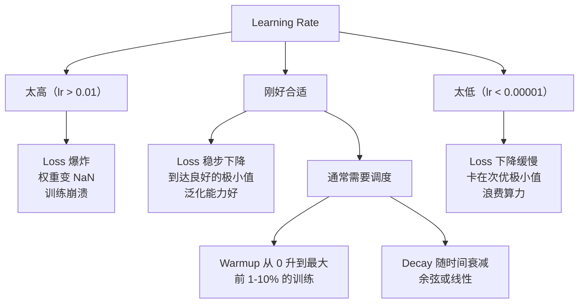
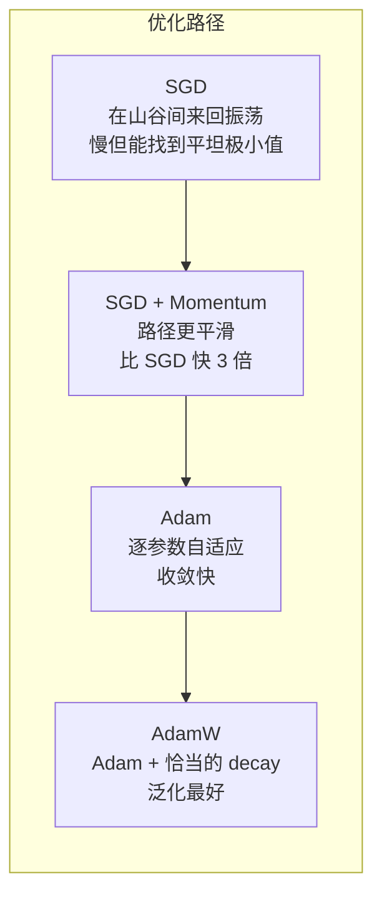
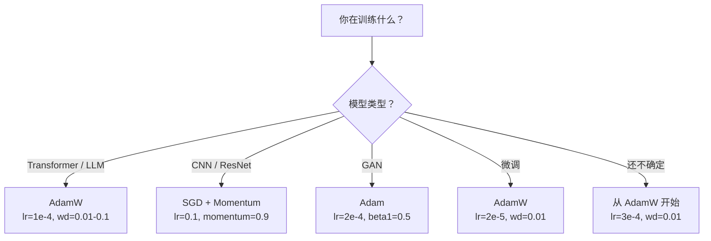

# Optimizers（优化器）

> 译注：本文译自同目录 [`en.md`](./en.md)。术语遵循仓根 [TRANSLATION_GUIDE.md](../../../../TRANSLATION_GUIDE.md)。

> 梯度下降只告诉你往哪个方向走，却没说该走多远、多快。SGD 是个指南针，Adam 则是带实时路况的 GPS。

**Type:** Build
**Languages:** Python
**Prerequisites:** Lesson 03.05 (Loss Functions)
**Time:** ~75 minutes

## 学习目标（Learning Objectives）

- 用纯 Python 从零实现 SGD、带 momentum 的 SGD、Adam 和 AdamW 优化器
- 解释 Adam 的 bias correction（偏置修正）如何在训练初期补偿零初始化的 moment 估计
- 在同一任务上演示为什么 AdamW 比 Adam + L2 正则化泛化得更好
- 为 transformer、CNN、GAN 和 fine-tune（微调）选择合适的 optimizer 和默认超参数

## 问题（The Problem）

你已经算出了 gradient（梯度）。你知道第 4,721 号权重应该减小 0.003 才能降低 loss。但 0.003 是什么单位？按什么尺度缩放？而且，第 1 步要走的距离应该和第 1,000 步一样吗？

朴素的 gradient descent（梯度下降）每一步对每个参数都用同一个 learning rate：w = w - lr * gradient。这在实践中训练神经网络时会带来三个让人头疼的问题。

第一，振荡。loss landscape（损失曲面）很少长得像一个光滑的碗，更像是一条又长又窄的山谷。gradient 指向的是横穿山谷的方向（陡峭方向），而不是沿着山谷往前走的方向（平缓方向）。gradient descent 在窄维度上来回反弹，沿着真正有用的方向却只前进了一点点。你肯定见过这种现象：loss 一开始迅速下降，然后陷入平台期——不是因为模型已经收敛，而是因为它在振荡。

第二，所有参数共用一个 learning rate 是错的。有些 weight（权重）需要大幅更新（它们还在前期欠拟合阶段），有些只需要微调（它们已经接近最优值）。一个对前者合适的 learning rate 会毁掉后者，反之亦然。

第三，鞍点（saddle points）。在高维空间里，loss landscape 有大量近乎平坦的区域，gradient 接近零。朴素 SGD 在这些区域里以 gradient 的速度前进——也就是基本不动。模型看起来卡住了，其实它没卡住，只是在一个平坦区域里，另一边还有可走的下坡路。但 SGD 没有任何机制能把它推过去。

Adam 同时解决了这三个问题。它为每个参数维护两个滑动平均——gradient 的均值（momentum，处理振荡）和 gradient 平方的均值（自适应步长，处理不同尺度）。再配上前几步的 bias correction，你就得到了一个用默认超参数就能搞定 80% 问题的 optimizer。本节课会把它从零拼起来，让你彻底搞清楚剩下 20% 它会失败时是为什么、在什么时候。

## 概念（The Concept）

### 随机梯度下降（Stochastic Gradient Descent, SGD）

最简单的 optimizer。在 mini-batch 上算 gradient，然后朝反方向走一步。

```
w = w - lr * gradient
```

"stochastic"（随机）的意思是你用数据的一个随机子集（mini-batch）来估计 gradient，而不是整个数据集。这种噪声其实是有用的——它帮助逃离尖锐的局部极小。但同样的噪声也会带来振荡。

learning rate 是唯一的旋钮。太大：loss 发散。太小：训练慢得没边。最优值取决于架构、数据、batch size 和当前训练阶段。在现代网络上跑朴素 SGD，典型值在 0.01 到 0.1 之间。但即便是同一次训练里，理想的 learning rate 也会变。

### Momentum（动量）

"球从山坡上滚下来" 这个比喻被滥用了，但它确实准确。你不是只按 gradient 走一步，而是维护一个累积过去 gradient 的速度。

```
m_t = beta * m_{t-1} + gradient
w = w - lr * m_t
```

Beta（典型值 0.9）控制保留多少历史。当 beta = 0.9 时，momentum 大致是最近 10 个 gradient 的平均（1 / (1 - 0.9) = 10）。

为什么这能修正振荡：方向一致的 gradient 会累加起来，方向反复翻转的 gradient 会互相抵消。在那条窄山谷里，"横穿" 分量每一步都翻号，被压制；"沿走" 分量保持一致，被放大。结果就是在有用方向上的平滑加速。

来点真实数字：在病态 loss landscape 上，单独的 SGD 可能要走 10,000 步。带 momentum（beta=0.9）的 SGD 在同一问题上通常只要 3,000–5,000 步。这个加速可不是边际效应。

### RMSProp

第一个真正能用的 per-parameter 自适应 learning rate 方法。Hinton 在一节 Coursera 课上提出（从来没正式发表过）。

```
s_t = beta * s_{t-1} + (1 - beta) * gradient^2
w = w - lr * gradient / (sqrt(s_t) + epsilon)
```

s_t 跟踪 gradient 平方的滑动平均。一直拿大 gradient 的参数被一个大数除（实际 learning rate 变小），一直拿小 gradient 的参数被一个小数除（实际 learning rate 变大）。

这就解决了 "所有参数共用一个 learning rate" 的问题。一个一直在大幅更新的 weight 大概率已经接近目标——就让它慢下来。一个一直只动一点点的 weight 可能还没训练够——就让它快起来。

epsilon（典型值 1e-8）防止某个参数从未被更新时出现除零。

### Adam：Momentum + RMSProp

Adam 把这两个想法合在一起。它为每个参数维护两个指数滑动平均：

```
m_t = beta1 * m_{t-1} + (1 - beta1) * gradient        (first moment: mean)
v_t = beta2 * v_{t-1} + (1 - beta2) * gradient^2       (second moment: variance)
```

**Bias correction（偏置修正）** 是大多数解释里都跳过的关键细节。在第 1 步，m_1 = (1 - beta1) * gradient。当 beta1 = 0.9 时，那就是 0.1 * gradient——比真实值小了十倍。滑动平均还没热起来。bias correction 来补偿：

```
m_hat = m_t / (1 - beta1^t)
v_hat = v_t / (1 - beta2^t)
```

第 1 步、beta1 = 0.9 时：m_hat = m_1 / (1 - 0.9) = m_1 / 0.1 = 实际的 gradient。第 100 步时：(1 - 0.9^100) 约等于 1.0，修正项就消失了。bias correction 在前 ~10 步起作用，~50 步以后就无关紧要了。

更新规则：

```
w = w - lr * m_hat / (sqrt(v_hat) + epsilon)
```

Adam 默认值：lr = 0.001、beta1 = 0.9、beta2 = 0.999、epsilon = 1e-8。这套默认值能搞定 80% 的问题。搞不定时，先调 lr，再调 beta2，几乎永远不用动 beta1 或 epsilon。

### AdamW：把权重衰减做对

L2 正则化是在 loss 上加一项 lambda * w^2。在朴素 SGD 里，这等价于 weight decay（权重衰减，即每一步从 weight 上减去 lambda * w）。在 Adam 里，这个等价关系就被打破了。

Loshchilov & Hutter 的洞察是：当你把 L2 加进 loss、然后让 Adam 去处理 gradient 时，自适应 learning rate 也会去缩放正则项。gradient 方差大的参数被正则化得少；方差小的参数被正则化得多。这并不是你想要的——你想要的是不管 gradient 统计如何，都施加均匀的正则化。

AdamW 通过在 Adam 更新之后直接对 weight 应用 weight decay 来修复这个问题：

```
w = w - lr * m_hat / (sqrt(v_hat) + epsilon) - lr * lambda * w
```

weight decay 项（lr * lambda * w）不被 Adam 的自适应因子缩放。每个参数都得到同样比例的收缩。

听起来像是个小细节，其实不是。在几乎所有任务上，AdamW 都比 Adam + L2 正则化收敛到更好的解。它是 PyTorch 里训练 transformer、扩散模型和大多数现代架构的默认 optimizer。BERT、GPT、LLaMA、Stable Diffusion——全都是用 AdamW 训出来的。

### Learning Rate：最重要的超参数



如果你只能调一个超参数，调 learning rate。learning rate 改 10 倍带来的影响，比你做的任何架构决定都大。常见默认值：

- SGD：lr = 0.01 到 0.1
- Adam/AdamW：lr = 1e-4 到 3e-4
- fine-tune 预训练模型：lr = 1e-5 到 5e-5
- learning rate warmup：在前 1–10% 的步数内做线性 ramp

### 优化器对比（Optimizer Comparison）



### 各 optimizer 各自适合的场景（When Each Optimizer Wins）



## 动手实现（Build It）

### Step 1：朴素 SGD

```python
class SGD:
    def __init__(self, lr=0.01):
        self.lr = lr

    def step(self, params, grads):
        for i in range(len(params)):
            params[i] -= self.lr * grads[i]
```

### Step 2：带 Momentum 的 SGD

```python
class SGDMomentum:
    def __init__(self, lr=0.01, beta=0.9):
        self.lr = lr
        self.beta = beta
        self.velocities = None

    def step(self, params, grads):
        if self.velocities is None:
            self.velocities = [0.0] * len(params)
        for i in range(len(params)):
            self.velocities[i] = self.beta * self.velocities[i] + grads[i]
            params[i] -= self.lr * self.velocities[i]
```

### Step 3：Adam

```python
import math

class Adam:
    def __init__(self, lr=0.001, beta1=0.9, beta2=0.999, epsilon=1e-8):
        self.lr = lr
        self.beta1 = beta1
        self.beta2 = beta2
        self.epsilon = epsilon
        self.m = None
        self.v = None
        self.t = 0

    def step(self, params, grads):
        if self.m is None:
            self.m = [0.0] * len(params)
            self.v = [0.0] * len(params)

        self.t += 1

        for i in range(len(params)):
            self.m[i] = self.beta1 * self.m[i] + (1 - self.beta1) * grads[i]
            self.v[i] = self.beta2 * self.v[i] + (1 - self.beta2) * grads[i] ** 2

            m_hat = self.m[i] / (1 - self.beta1 ** self.t)
            v_hat = self.v[i] / (1 - self.beta2 ** self.t)

            params[i] -= self.lr * m_hat / (math.sqrt(v_hat) + self.epsilon)
```

### Step 4：AdamW

```python
class AdamW:
    def __init__(self, lr=0.001, beta1=0.9, beta2=0.999, epsilon=1e-8, weight_decay=0.01):
        self.lr = lr
        self.beta1 = beta1
        self.beta2 = beta2
        self.epsilon = epsilon
        self.weight_decay = weight_decay
        self.m = None
        self.v = None
        self.t = 0

    def step(self, params, grads):
        if self.m is None:
            self.m = [0.0] * len(params)
            self.v = [0.0] * len(params)

        self.t += 1

        for i in range(len(params)):
            self.m[i] = self.beta1 * self.m[i] + (1 - self.beta1) * grads[i]
            self.v[i] = self.beta2 * self.v[i] + (1 - self.beta2) * grads[i] ** 2

            m_hat = self.m[i] / (1 - self.beta1 ** self.t)
            v_hat = self.v[i] / (1 - self.beta2 ** self.t)

            params[i] -= self.lr * m_hat / (math.sqrt(v_hat) + self.epsilon)
            params[i] -= self.lr * self.weight_decay * params[i]
```

### Step 5：训练对比

用 lesson 05 的圆形数据集训同一个两层网络，分别用四个 optimizer，对比收敛情况。

```python
import random

def sigmoid(x):
    x = max(-500, min(500, x))
    return 1.0 / (1.0 + math.exp(-x))

def make_circle_data(n=200, seed=42):
    random.seed(seed)
    data = []
    for _ in range(n):
        x = random.uniform(-2, 2)
        y = random.uniform(-2, 2)
        label = 1.0 if x * x + y * y < 1.5 else 0.0
        data.append(([x, y], label))
    return data


class OptimizerTestNetwork:
    def __init__(self, optimizer, hidden_size=8):
        random.seed(0)
        self.hidden_size = hidden_size
        self.optimizer = optimizer

        self.w1 = [[random.gauss(0, 0.5) for _ in range(2)] for _ in range(hidden_size)]
        self.b1 = [0.0] * hidden_size
        self.w2 = [random.gauss(0, 0.5) for _ in range(hidden_size)]
        self.b2 = 0.0

    def get_params(self):
        params = []
        for row in self.w1:
            params.extend(row)
        params.extend(self.b1)
        params.extend(self.w2)
        params.append(self.b2)
        return params

    def set_params(self, params):
        idx = 0
        for i in range(self.hidden_size):
            for j in range(2):
                self.w1[i][j] = params[idx]
                idx += 1
        for i in range(self.hidden_size):
            self.b1[i] = params[idx]
            idx += 1
        for i in range(self.hidden_size):
            self.w2[i] = params[idx]
            idx += 1
        self.b2 = params[idx]

    def forward(self, x):
        self.x = x
        self.z1 = []
        self.h = []
        for i in range(self.hidden_size):
            z = self.w1[i][0] * x[0] + self.w1[i][1] * x[1] + self.b1[i]
            self.z1.append(z)
            self.h.append(max(0.0, z))

        self.z2 = sum(self.w2[i] * self.h[i] for i in range(self.hidden_size)) + self.b2
        self.out = sigmoid(self.z2)
        return self.out

    def compute_grads(self, target):
        eps = 1e-15
        p = max(eps, min(1 - eps, self.out))
        d_loss = -(target / p) + (1 - target) / (1 - p)
        d_sigmoid = self.out * (1 - self.out)
        d_out = d_loss * d_sigmoid

        grads = [0.0] * (self.hidden_size * 2 + self.hidden_size + self.hidden_size + 1)
        idx = 0
        for i in range(self.hidden_size):
            d_relu = 1.0 if self.z1[i] > 0 else 0.0
            d_h = d_out * self.w2[i] * d_relu
            grads[idx] = d_h * self.x[0]
            grads[idx + 1] = d_h * self.x[1]
            idx += 2

        for i in range(self.hidden_size):
            d_relu = 1.0 if self.z1[i] > 0 else 0.0
            grads[idx] = d_out * self.w2[i] * d_relu
            idx += 1

        for i in range(self.hidden_size):
            grads[idx] = d_out * self.h[i]
            idx += 1

        grads[idx] = d_out
        return grads

    def train(self, data, epochs=300):
        losses = []
        for epoch in range(epochs):
            total_loss = 0.0
            correct = 0
            for x, y in data:
                pred = self.forward(x)
                grads = self.compute_grads(y)
                params = self.get_params()
                self.optimizer.step(params, grads)
                self.set_params(params)

                eps = 1e-15
                p = max(eps, min(1 - eps, pred))
                total_loss += -(y * math.log(p) + (1 - y) * math.log(1 - p))
                if (pred >= 0.5) == (y >= 0.5):
                    correct += 1
            avg_loss = total_loss / len(data)
            accuracy = correct / len(data) * 100
            losses.append((avg_loss, accuracy))
            if epoch % 75 == 0 or epoch == epochs - 1:
                print(f"    Epoch {epoch:3d}: loss={avg_loss:.4f}, accuracy={accuracy:.1f}%")
        return losses
```

## 用起来（Use It）

PyTorch 的 optimizer 帮你处理参数分组、gradient clipping（梯度裁剪）和 learning rate 调度：

```python
import torch
import torch.optim as optim

model = torch.nn.Sequential(
    torch.nn.Linear(784, 256),
    torch.nn.ReLU(),
    torch.nn.Linear(256, 10),
)

optimizer = optim.AdamW(model.parameters(), lr=3e-4, weight_decay=0.01)

scheduler = optim.lr_scheduler.CosineAnnealingLR(optimizer, T_max=100)

for epoch in range(100):
    optimizer.zero_grad()
    output = model(torch.randn(32, 784))
    loss = torch.nn.functional.cross_entropy(output, torch.randint(0, 10, (32,)))
    loss.backward()
    torch.nn.utils.clip_grad_norm_(model.parameters(), max_norm=1.0)
    optimizer.step()
    scheduler.step()
```

固定流程永远是：zero_grad、forward、loss、backward、(clip)、step、(schedule)。把这个顺序背下来。搞错（比如把 scheduler.step() 放到 optimizer.step() 前面）是一类常见的隐蔽 bug 来源。

对于 CNN，很多人到现在还更喜欢 SGD + momentum（lr=0.1，momentum=0.9，weight_decay=1e-4）配 step 或 cosine 调度。SGD 找到的 minima（极小值）更平坦，往往泛化得更好。对于 transformer 和 LLM，AdamW 配 warmup + cosine decay 是放之四海皆准的默认。没有实测理由别去和这个共识较劲。

## 上线部署（Ship It）

本节课产出：
- `outputs/prompt-optimizer-selector.md` —— 一份决策 prompt，用于为任意架构选择合适的 optimizer 和 learning rate

## 练习（Exercises）

1. 实现 Nesterov momentum：在 "lookahead" 位置（w - lr * beta * v）而不是当前位置计算 gradient。在圆形数据集上对比它和标准 momentum 的收敛情况。

2. 实现一个 learning rate warmup 调度：前 10% 的训练步数内从 0 线性 ramp 到 max_lr，之后 cosine decay 到 0。对比带 warmup 的 Adam 和不带 warmup 的 Adam，测一下在圆形数据集上达到 90% 准确率分别需要多少 epoch。

3. 在 Adam 训练过程中跟踪每个参数的实际 learning rate。实际 rate 是 lr * m_hat / (sqrt(v_hat) + eps)。画出第 10、50、200 步时实际 rate 的分布。所有参数都在以同样的速度被更新吗？

4. 实现 gradient clipping（按全局 norm 裁剪），把最大 gradient norm 设成 1.0。用一个偏大的 learning rate（Adam 用 lr=0.01）跑训练，分别带和不带 clipping。在 10 个随机种子下，统计带和不带 clipping 各自有多少次发散（loss 跑成 NaN）。

5. 在一个 weight 偏大的网络上对比 Adam 和 AdamW。把所有 weight 初始化为 [-5, 5] 的随机值（远大于通常的范围）。用 weight_decay=0.1 训练 200 个 epoch。画出训练过程中两个 optimizer 的 weight L2 范数曲线。AdamW 应该会显示更快的 weight 收缩。

## 关键术语（Key Terms）

| Term | What people say | What it actually means |
|------|----------------|----------------------|
| Learning rate | "步长" | gradient 更新的标量乘子；训练中影响最大的单个超参数 |
| SGD | "基础梯度下降" | 随机梯度下降：用 mini-batch 上算出的 gradient，按 w -= lr * gradient 更新 weight |
| Momentum | "球往下滚的比喻" | 过往 gradient 的指数滑动平均；抑制振荡、加速一致方向上的前进 |
| RMSProp | "自适应 learning rate" | 把每个参数的 gradient 除以其近期 gradient 的 RMS 滑动值；让各参数 learning rate 拉齐 |
| Adam | "默认 optimizer" | 把 momentum（first moment）和 RMSProp（second moment）合起来，并对前几步做 bias correction |
| AdamW | "把 Adam 做对" | 解耦了 weight decay 的 Adam；把正则化直接施加在 weight 上，而不是通过 gradient |
| Bias correction | "滑动平均的 warmup" | 除以 (1 - beta^t)，用来补偿 Adam 的 moment 估计被零初始化带来的偏差 |
| Weight decay | "把 weight 缩小" | 每一步从 weight 上减去其自身的一个比例；一种惩罚大 weight 的正则化 |
| Learning rate schedule | "随时间改变 lr" | 一个在训练过程中调整 learning rate 的函数；warmup + cosine decay 是当下默认 |
| Gradient clipping | "给 gradient 范数封顶" | 当 gradient 向量的 norm 超过阈值时按比例缩放；防止 gradient 更新爆炸 |

## 延伸阅读（Further Reading）

- Kingma & Ba, "Adam: A Method for Stochastic Optimization" (2014) —— Adam 原始论文，含收敛性分析与 bias correction 推导
- Loshchilov & Hutter, "Decoupled Weight Decay Regularization" (2017) —— 证明在 Adam 里 L2 正则化和 weight decay 并不等价，并提出 AdamW
- Smith, "Cyclical Learning Rates for Training Neural Networks" (2017) —— 提出 LR range test 和循环调度，免去你调一个固定 learning rate 的麻烦
- Ruder, "An Overview of Gradient Descent Optimization Algorithms" (2016) —— 各 optimizer 变体最好的单篇综述，对比与直觉都讲得清楚
