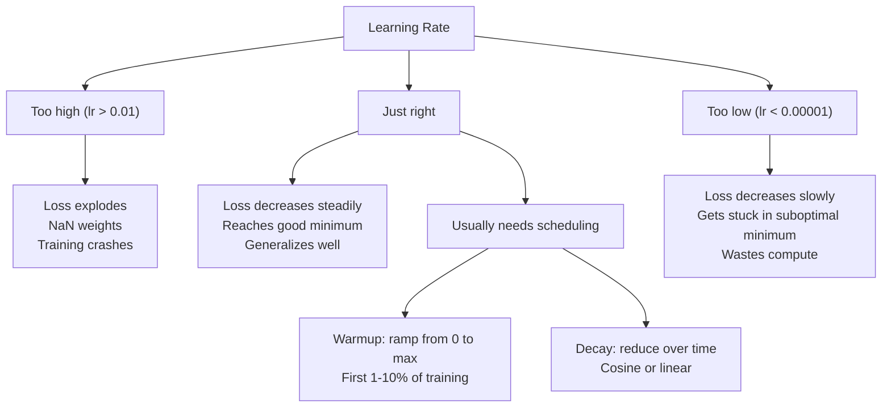
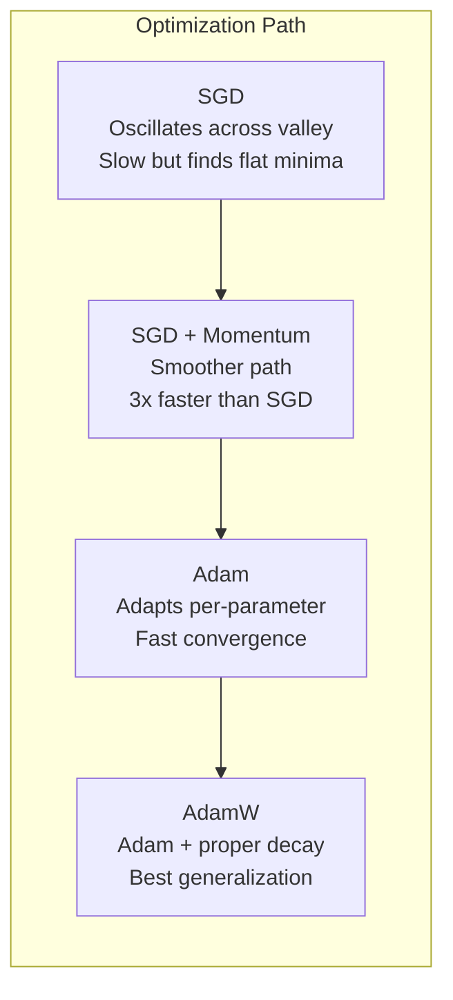
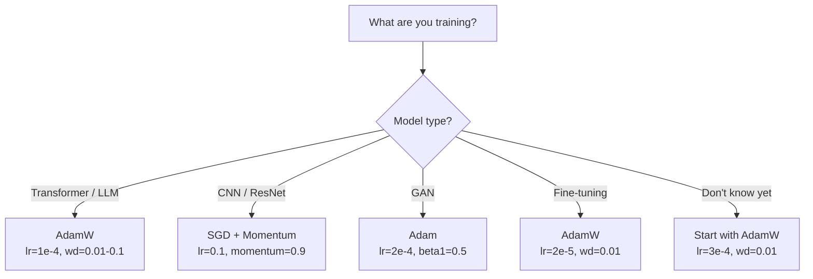

# 优化器

> 梯度下降告诉你该往哪个方向移动。它没有说有多远或多快。SGD是指南针。亚当是有交通数据的GPS

** 类型：** 构建
** 语言：** Python
** 先决条件：** 第03.05课（损失函数）
** 时间：** ~75分钟

## 学习目标

- 在Python中从头开始实施Singapore、with moment Singapore、Adam和AdamW优化器
- 解释Adam的偏差纠正如何补偿早期训练步骤中的零初始化时刻估计
- 演示为什么AdamW在同一任务上比Adam通过L2正规化产生更好的概括
- 为转换器、CNN、GAN和微调选择适当的优化器和默认超参数

## 问题

您计算了梯度。您知道体重#4，721应该减少0.003才能减少损失。但0.003是什么单位呢？通过什么来缩放？您是否应该在第1步中移动与第1，000步相同的金额？

香草梯度下降对每个步骤的每个参数应用相同的学习率：w = w - lr * 梯度。这产生了三个问题，使训练神经网络在实践中变得痛苦。

第一，振荡。损失景观很少像一个光滑的碗。更像是一个狭长的山谷。坡度指向山谷（陡峭方向），而不是沿着山谷（浅方向）。梯度下降在狭窄维度上来回弹跳，同时沿着有用维度取得微小进展。您已经看到了这一点：损失迅速下降，然后趋于平稳，不是因为模型收敛，而是因为它在振荡。

其次，所有参数的一个学习率都是错误的。有些权重需要大幅更新（它们处于早期、不适合的阶段）。其他人需要微小的更新（它们接近其最佳值）。适用于前者的学习率会破坏后者，反之亦然。

第三，鞍点。在高维度中，损失景观具有广阔的平坦区域，其中的梯度接近于零。香草新元以梯度的速度穿过这些区域，而梯度实际上为零。模型看起来卡住了。它没有被卡住--它位于一个平坦的区域，另一侧有有用的下降。但新元没有推动机制。

亚当解决了这三者。它为每个参数保留两个运行平均值--平均梯度（动量，处理振荡）和均方梯度（自适应率，处理不同的尺度）。结合前几个步骤的偏差纠正，它为您提供了一个单一的优化器，可以使用默认超参数处理80%的问题。本课从头开始构建它，以便您准确了解它何时以及为何在其他20%上失败。

## 概念

### 随机梯度下降（Singapore）

最简单的优化器。计算迷你批次上的梯度并沿相反方向步进。

```
w = w - lr * gradient
```

“随机”意味着您使用随机数据子集（小批量）来估计梯度，而不是完整数据集。这种噪音实际上很有用--它有助于摆脱尖锐的局部极小值。但噪音也会引起振荡。

学习率是唯一的旋钮。太高：损失分散。太低：训练需要永远。最佳值取决于体系结构、数据、批量大小和当前训练阶段。对于现代网络上的普通新元，典型值范围为0.01至0.1。但即使在一次训练中，理想的学习率也会发生变化。

### 势头

滚球下坡的类比被过度使用，但却是准确的。您不会仅仅按照梯度步进，而是保持累积过去梯度的速度。

```
m_t = beta * m_{t-1} + gradient
w = w - lr * m_t
```

Beta（通常为0.9）控制要保留的历史记录量。当Beta = 0.9时，动量大致是最后10个梯度的平均值（1 /（1 - 0.9）= 10）。

为什么这会修复振荡：指向同一方向的梯度会累积。翻转方向的学生抵消了。在那个狭窄的山谷中，“跨越”组件每走一步都会翻转标志并被浸湿。“沿着”分量保持一致并被放大。结果是在有用方向上平稳加速。

真实数字：在条件恶劣的损失环境中，仅新加坡元可能需要10，000步。带有动量（beta=0.9）的SGD通常需要3，000 - 5，000步来解决同一问题。加速不是边际的。

### RMSProp

第一个实际有效的按参数自适应学习率方法。由Hinton在Coursera讲座中提出（从未正式发表）。

```
s_t = beta * s_{t-1} + (1 - beta) * gradient^2
w = w - lr * gradient / (sqrt(s_t) + epsilon)
```

s_t跟踪平方梯度的运行平均值。具有一致大梯度的参数被除以较大的数字（较小的有效学习率）。梯度较小的参数被除以较小的数字（更大的有效学习率）。

这解决了“所有参数都有一个学习率”的问题。已经获得大量更新的重量可能已经接近其目标--放慢速度。一直在进行微小更新的体重可能训练不足--加快速度。

Eppery（通常为1 e-8）防止在参数未更新时被零除。

### Adam：动量+ RMSProp

亚当结合了这两个想法。它每个参数保持两个指数移动平均值：

```
m_t = beta1 * m_{t-1} + (1 - beta1) * gradient        (first moment: mean)
v_t = beta2 * v_{t-1} + (1 - beta2) * gradient^2       (second moment: variance)
```

** 偏差纠正 ** 是大多数解释跳过的关键细节。在第1步，m_1 =（1 - beta1）* 梯度。如果beta1 = 0.9，那就是0.1 * 梯度--太小了十倍。移动平均线尚未升温。偏差纠正补偿：

```
m_hat = m_t / (1 - beta1^t)
v_hat = v_t / (1 - beta2^t)
```

在第1步，β 1 = 0.9：m_hat = m_1 /（1 - 0.9）= m_1 / 0.1 =实际梯度。在步骤100处：（1 - 0. 9 ' 100）大约为1.0，因此修正消失。偏差纠正对于前~10个步骤很重要，而在~50个步骤之后就不重要了。

更新：

```
w = w - lr * m_hat / (sqrt(v_hat) + epsilon)
```

Adam默认值：lr = 0.001，beta1 = 0.9，beta2 = 0.999，= 1 e-8。这些默认设置适用于80%的问题。如果他们不这样做，请先更改lr。然后是beta2。几乎从不改变beta1或beta2。

### AdamW：正确的体重衰退

L2正规化会增加lambda * w^2的损失。在vanilla Singapore中，这相当于重量衰减（从每一步的重量中减去ambda * w）。在亚当身上，这种对等性被打破了。

Loshchilov和Hutter的见解：当您将L2添加到损失中，然后Adam处理梯度时，自适应学习率也会扩展正规化项。梯度方差大的参数得到的正规化较少。方差小的参数会得到更多。这不是您想要的--无论梯度统计数据如何，您想要均匀的正规化。

Adam更新后，AdamW通过将权重衰减直接应用于权重来解决这个问题：

```
w = w - lr * m_hat / (sqrt(v_hat) + epsilon) - lr * lambda * w
```

重量衰减项（lr * ambda * w）不受Adam自适应因子的缩放。每个参数都会得到相同的比例收缩。

这似乎是一个小细节。不是的AdamW在几乎所有任务上都能收敛到比Adam + L2正规化更好的解决方案。它是PyTorch中用于训练转换器、扩散模型和大多数现代架构的默认优化器。BERT，GPT，LLaMA，Stable Diffusion --都是用AdamW训练的。

### 学习率：最重要的超参数



如果您调整了一个超参数，请调整学习率。学习率的10倍变化比您做出的任何架构决策都更重要。常见默认值：

- 新元：lr = 0.01至0.1
- Adam/AdamW：lr = 1 e-4至3e-4
- 微调预训练模型：lr = 1 e-5至5e-5
- 学习率热身：前1-10%的步骤呈线性斜坡

### 优化器比较



### 当每个优化器获胜时



## 建设党

### 1.香草SGD

```python
class SGD:
    def __init__(self, lr=0.01):
        self.lr = lr

    def step(self, params, grads):
        for i in range(len(params)):
            params[i] -= self.lr * grads[i]
```

### 第2步：新加坡元有动量

```python
class SGDMomentum:
    def __init__(self, lr=0.01, beta=0.9):
        self.lr = lr
        self.beta = beta
        self.velocities = None

    def step(self, params, grads):
        if self.velocities is None:
            self.velocities = [0.0] * len(params)
        for i in range(len(params)):
            self.velocities[i] = self.beta * self.velocities[i] + grads[i]
            params[i] -= self.lr * self.velocities[i]
```

### 第3步：亚当

```python
import math

class Adam:
    def __init__(self, lr=0.001, beta1=0.9, beta2=0.999, epsilon=1e-8):
        self.lr = lr
        self.beta1 = beta1
        self.beta2 = beta2
        self.epsilon = epsilon
        self.m = None
        self.v = None
        self.t = 0

    def step(self, params, grads):
        if self.m is None:
            self.m = [0.0] * len(params)
            self.v = [0.0] * len(params)

        self.t += 1

        for i in range(len(params)):
            self.m[i] = self.beta1 * self.m[i] + (1 - self.beta1) * grads[i]
            self.v[i] = self.beta2 * self.v[i] + (1 - self.beta2) * grads[i] ** 2

            m_hat = self.m[i] / (1 - self.beta1 ** self.t)
            v_hat = self.v[i] / (1 - self.beta2 ** self.t)

            params[i] -= self.lr * m_hat / (math.sqrt(v_hat) + self.epsilon)
```

### 第4步：AdamW

```python
class AdamW:
    def __init__(self, lr=0.001, beta1=0.9, beta2=0.999, epsilon=1e-8, weight_decay=0.01):
        self.lr = lr
        self.beta1 = beta1
        self.beta2 = beta2
        self.epsilon = epsilon
        self.weight_decay = weight_decay
        self.m = None
        self.v = None
        self.t = 0

    def step(self, params, grads):
        if self.m is None:
            self.m = [0.0] * len(params)
            self.v = [0.0] * len(params)

        self.t += 1

        for i in range(len(params)):
            self.m[i] = self.beta1 * self.m[i] + (1 - self.beta1) * grads[i]
            self.v[i] = self.beta2 * self.v[i] + (1 - self.beta2) * grads[i] ** 2

            m_hat = self.m[i] / (1 - self.beta1 ** self.t)
            v_hat = self.v[i] / (1 - self.beta2 ** self.t)

            params[i] -= self.lr * m_hat / (math.sqrt(v_hat) + self.epsilon)
            params[i] -= self.lr * self.weight_decay * params[i]
```

### 第5步：培训比较

使用所有四个优化器在第05课的圆圈数据集上训练相同的双层网络。比较收敛性。

```python
import random

def sigmoid(x):
    x = max(-500, min(500, x))
    return 1.0 / (1.0 + math.exp(-x))

def make_circle_data(n=200, seed=42):
    random.seed(seed)
    data = []
    for _ in range(n):
        x = random.uniform(-2, 2)
        y = random.uniform(-2, 2)
        label = 1.0 if x * x + y * y < 1.5 else 0.0
        data.append(([x, y], label))
    return data


class OptimizerTestNetwork:
    def __init__(self, optimizer, hidden_size=8):
        random.seed(0)
        self.hidden_size = hidden_size
        self.optimizer = optimizer

        self.w1 = [[random.gauss(0, 0.5) for _ in range(2)] for _ in range(hidden_size)]
        self.b1 = [0.0] * hidden_size
        self.w2 = [random.gauss(0, 0.5) for _ in range(hidden_size)]
        self.b2 = 0.0

    def get_params(self):
        params = []
        for row in self.w1:
            params.extend(row)
        params.extend(self.b1)
        params.extend(self.w2)
        params.append(self.b2)
        return params

    def set_params(self, params):
        idx = 0
        for i in range(self.hidden_size):
            for j in range(2):
                self.w1[i][j] = params[idx]
                idx += 1
        for i in range(self.hidden_size):
            self.b1[i] = params[idx]
            idx += 1
        for i in range(self.hidden_size):
            self.w2[i] = params[idx]
            idx += 1
        self.b2 = params[idx]

    def forward(self, x):
        self.x = x
        self.z1 = []
        self.h = []
        for i in range(self.hidden_size):
            z = self.w1[i][0] * x[0] + self.w1[i][1] * x[1] + self.b1[i]
            self.z1.append(z)
            self.h.append(max(0.0, z))

        self.z2 = sum(self.w2[i] * self.h[i] for i in range(self.hidden_size)) + self.b2
        self.out = sigmoid(self.z2)
        return self.out

    def compute_grads(self, target):
        eps = 1e-15
        p = max(eps, min(1 - eps, self.out))
        d_loss = -(target / p) + (1 - target) / (1 - p)
        d_sigmoid = self.out * (1 - self.out)
        d_out = d_loss * d_sigmoid

        grads = [0.0] * (self.hidden_size * 2 + self.hidden_size + self.hidden_size + 1)
        idx = 0
        for i in range(self.hidden_size):
            d_relu = 1.0 if self.z1[i] > 0 else 0.0
            d_h = d_out * self.w2[i] * d_relu
            grads[idx] = d_h * self.x[0]
            grads[idx + 1] = d_h * self.x[1]
            idx += 2

        for i in range(self.hidden_size):
            d_relu = 1.0 if self.z1[i] > 0 else 0.0
            grads[idx] = d_out * self.w2[i] * d_relu
            idx += 1

        for i in range(self.hidden_size):
            grads[idx] = d_out * self.h[i]
            idx += 1

        grads[idx] = d_out
        return grads

    def train(self, data, epochs=300):
        losses = []
        for epoch in range(epochs):
            total_loss = 0.0
            correct = 0
            for x, y in data:
                pred = self.forward(x)
                grads = self.compute_grads(y)
                params = self.get_params()
                self.optimizer.step(params, grads)
                self.set_params(params)

                eps = 1e-15
                p = max(eps, min(1 - eps, pred))
                total_loss += -(y * math.log(p) + (1 - y) * math.log(1 - p))
                if (pred >= 0.5) == (y >= 0.5):
                    correct += 1
            avg_loss = total_loss / len(data)
            accuracy = correct / len(data) * 100
            losses.append((avg_loss, accuracy))
            if epoch % 75 == 0 or epoch == epochs - 1:
                print(f"    Epoch {epoch:3d}: loss={avg_loss:.4f}, accuracy={accuracy:.1f}%")
        return losses
```

## 使用它

PyTorch优化器处理参数组、梯度剪裁和学习率调度：

```python
import torch
import torch.optim as optim

model = torch.nn.Sequential(
    torch.nn.Linear(784, 256),
    torch.nn.ReLU(),
    torch.nn.Linear(256, 10),
)

optimizer = optim.AdamW(model.parameters(), lr=3e-4, weight_decay=0.01)

scheduler = optim.lr_scheduler.CosineAnnealingLR(optimizer, T_max=100)

for epoch in range(100):
    optimizer.zero_grad()
    output = model(torch.randn(32, 784))
    loss = torch.nn.functional.cross_entropy(output, torch.randint(0, 10, (32,)))
    loss.backward()
    torch.nn.utils.clip_grad_norm_(model.parameters(), max_norm=1.0)
    optimizer.step()
    scheduler.step()
```

模式总是：zero_grad、forward、loss、backward、（clip）、step、（schedule）。把这个订单取消。错误（例如，在optimizer. step（）之前调用scheduler.step（））是产生细微错误的常见原因。

对于CNN，许多从业者仍然更喜欢带有阶梯或cos时间表的Singapore+动量（lr=0.1，动量=0.9，weight_decay= 1 e-4）。新元找到更平坦的最低限度，通常会更好地概括。对于变压器和LLM，带有预热+cos衰减的AdamW是通用默认设置。如果没有适当的理由，不要反对共识。

## 把它运

本课产生：
- ' outputes/prompt-optimizer-selector.md '--为任何架构选择正确的优化器和学习率的决策提示

## 演习

1. 实现Nesterov动量，计算“前瞻”位置（w - lr * Beta * v）而不是当前位置的梯度。将收敛与圆数据集中的标准动量进行比较。

2. 实现学习率预热计划：在前10%的训练步骤中从0线性斜坡到max_lr，然后余弦衰减到0。有亚当+热身的训练vs没有热身的亚当。测量在圆数据集上达到90%的准确度需要多少个epoch。

3. 跟踪Adam训练期间每个参数的有效学习率。有效率为lr * m_hat /（squtt（v_hat）+ eps）。绘制10、50和200步后有效率的分布。所有参数是否以相同的速度更新？

4. 实现渐变剪裁（按全局规范剪裁）。将最大梯度规范设置为1.0。使用高学习率（对于Adam，lr=0.01）进行有修剪和不有修剪的训练。计算在修剪和不修剪超过10个随机种子的情况下，有多少次运行偏离（损失归NaN）。

5. 在具有大权重的网络上比较Adam与AdamW。将所有权重初始化为[-5，5]中的随机值（比正常值大得多）。训练200个epoch，weight_decay=0.1。绘制两个优化器在训练过程中权重的L2范数。AdamW应该表现出更快的重量收缩。

## 关键术语

| Term | 别人怎么说 | 它实际上意味着什么 |
|------|----------------|----------------------|
| 学习率 | “步骤大小” | 梯度更新上的纯量乘数;训练中最有影响力的超参数 |
| SGD | “基本梯度下降” | 随机梯度下降：通过减去lr * 梯度来更新权重，在迷你批次上计算 |
| 势头 | “滚球类比” | 过去梯度的指数移动平均值;抑制振荡并加速一致的方向 |
| RMSProp | “自适应学习率” | 将每个参数的梯度除以其最近梯度的运行RMS;均衡学习率 |
| 亚当 | “默认优化器” | 结合动量（一阶矩）和RMSProp（二阶矩），并对初始步骤进行偏差修正 |
| AdamW | “亚当做得对” | Adam具有脱钩的权重衰减;直接对权重应用正规化，而不是通过梯度应用正规化 |
| 偏差校正 | “平均成绩热身” | 除以（1 - Beta ' t）以补偿Adam矩估计的零初始化 |
| 权重衰减 | “缩小体重” | 每一步减去权重值的一小部分;惩罚大权重的正规化器 |
| 学习速率计划 | “随着时间的推移改变lr” | 在训练过程中调整学习速率的功能;预热+余弦衰减是现代默认值 |
| 渐变剪裁 | “限制梯度规范” | 当其规范超过阈值时缩小梯度载体;防止爆发梯度更新 |

## 进一步阅读

- Kingma & Ba，”Adam：随机优化方法”（2014）--Adam的原创论文，具有收敛分析和偏差修正推导
- Loshchilov & Hutter，“Decoupled Weight Decay Regiation”（2017）--证明L2正规化和Weight decay在Adam中不等效，并提出了AdamW
- Smith，《训练神经网络的周期学习率》（2017年）--引入了LR范围测试和循环时间表，无需调整固定学习率
- Ruder，“梯度下降优化算法概述”（2016）--所有优化器变体的最佳单一调查，具有清晰的比较和直觉
