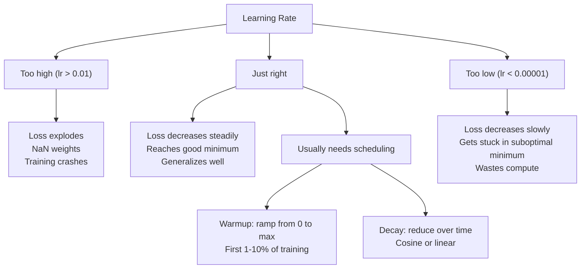
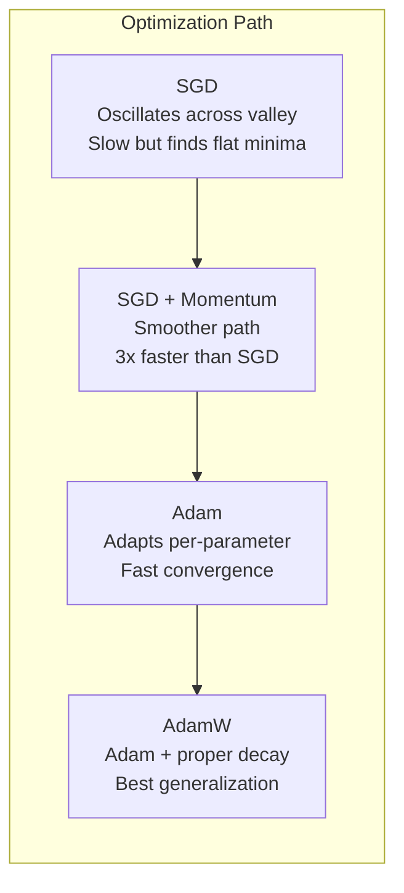
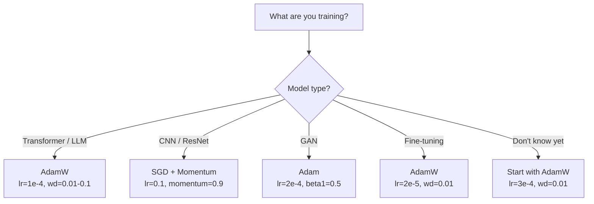

# 06 · 优化器

> 梯度下降告诉你该往哪个方向移动，却对走多远、走多快只字不提。SGD 是一个指南针，Adam 则是带实时路况数据的 GPS。

**类型：** 实战构建
**语言：** Python
**前置：** 第 03.05 课（损失函数）
**时长：** 约 75 分钟

## 学习目标

- 用 Python 从零实现 SGD、带动量的 SGD、Adam 和 AdamW 优化器
- 解释 Adam 的偏差修正（bias correction）如何在训练早期补偿被零初始化的矩估计
- 演示为什么在同一任务上 AdamW 比 Adam 加 L2 正则化能带来更好的泛化
- 为 Transformer、CNN、GAN 和微调场景选择合适的优化器及默认超参数

## 问题所在

你已经算出了梯度。你知道第 4721 号权重应该减少 0.003 来降低损失。但 0.003 是以什么为单位？按什么比例缩放？在第 1 步和第 1000 步，你应该移动同样的幅度吗？

朴素梯度下降（vanilla gradient descent）在每一步对每个参数都施加相同的学习率（learning rate）：w = w - lr * gradient。这在实践中带来了三个让神经网络训练痛苦不堪的问题。

第一，振荡。损失曲面（loss landscape）很少是平滑的碗状，更像是一条又长又窄的山谷。梯度指向横跨山谷的方向（陡峭方向），而不是沿山谷延伸的方向（平缓方向）。梯度下降在窄维度上来回弹跳，却在真正有用的方向上只取得极小的进展。你应该见过这种现象：损失迅速下降然后陷入平台期，这并非因为模型收敛了，而是因为它在振荡。

第二，所有参数共用一个学习率是错误的。有些权重需要大幅更新（它们还处在早期欠拟合阶段），另一些则只需微调（它们已经接近最优值）。适合前者的学习率会毁掉后者，反之亦然。

第三，鞍点（saddle point）。在高维空间中，损失曲面存在大片梯度接近零的平坦区域。朴素 SGD 以梯度的速度在这些区域里爬行，而这个速度实际上等于零。模型看上去卡住了，但它并没有真的卡住——它只是处在一片平坦区域，而另一侧仍有可用的下降方向。只是 SGD 没有任何机制能把它推过去。

Adam 同时解决了这三个问题。它为每个参数维护两个滑动平均——梯度均值（动量，处理振荡）和梯度平方均值（自适应速率，处理不同的尺度）。再加上前几步的偏差修正，它给了你一个用默认超参数就能解决 80% 问题的单一优化器。本课从零构建它，让你确切理解它在剩下 20% 的问题上何时以及为何会失败。

## 核心概念

### 随机梯度下降（SGD）

最简单的优化器。在一个小批量（mini-batch）上计算梯度，然后朝相反方向迈一步。

```
w = w - lr * gradient
```

“随机”（stochastic）指的是你用数据的一个随机子集（小批量）来估计梯度，而非整个数据集。这种噪声其实是有用的——它有助于逃离尖锐的局部极小值。但噪声同时也会引起振荡。

学习率是唯一的旋钮。太高：损失发散。太低：训练慢得没完没了。最优值取决于架构、数据、批量大小以及训练当前所处的阶段。对于现代网络上的朴素 SGD，典型取值在 0.01 到 0.1 之间。但即便在单次训练过程中，理想的学习率也会变化。

### 动量（Momentum）

“小球滚下山坡”这个类比被用滥了，但它确实准确。你不再仅凭梯度迈步，而是维护一个累积过往梯度的速度（velocity）。

```
m_t = beta * m_{t-1} + gradient
w = w - lr * m_t
```

Beta（通常取 0.9）控制保留多少历史信息。当 beta = 0.9 时，动量大致是最近 10 个梯度的平均（1 / (1 - 0.9) = 10）。

为什么这能修复振荡：指向同一方向的梯度会累积，方向反转的梯度会相互抵消。在那条狭窄的山谷里，“横跨”分量每一步都改变符号，从而被抑制；“沿谷”分量保持一致，从而被放大。结果就是在有用方向上的平滑加速。

真实数据：在一个病态（badly conditioned）的损失曲面上，单独使用 SGD 可能需要 10000 步。在同样的问题上，带动量的 SGD（beta=0.9）通常只需 3000 到 5000 步。这种加速绝非边际效应。

### RMSProp

第一个真正奏效的逐参数自适应学习率方法。由 Hinton 在一次 Coursera 讲座中提出（从未正式发表）。

```
s_t = beta * s_{t-1} + (1 - beta) * gradient^2
w = w - lr * gradient / (sqrt(s_t) + epsilon)
```

s_t 跟踪梯度平方的滑动平均。梯度持续偏大的参数会被一个大数除（有效学习率变小）；梯度偏小的参数会被一个小数除（有效学习率变大）。

这解决了“所有参数共用一个学习率”的问题。一个已经在大幅更新的权重，很可能已接近目标——让它慢下来；一个一直只在微调的权重，可能训练不足——让它加速。

Epsilon（通常取 1e-8）用于在某个参数尚未被更新时防止除以零。

### Adam：动量 + RMSProp

Adam 结合了这两种思路。它为每个参数维护两个指数滑动平均（exponential moving average）：

```
m_t = beta1 * m_{t-1} + (1 - beta1) * gradient        (一阶矩：均值)
v_t = beta2 * v_{t-1} + (1 - beta2) * gradient^2       (二阶矩：方差)
```

**偏差修正（bias correction）** 是大多数讲解都跳过的关键细节。在第 1 步，m_1 = (1 - beta1) * gradient。当 beta1 = 0.9 时，这等于 0.1 * gradient——小了十倍。滑动平均还没“热身”起来。偏差修正对此进行补偿：

```
m_hat = m_t / (1 - beta1^t)
v_hat = v_t / (1 - beta2^t)
```

当 beta1 = 0.9、处于第 1 步时：m_hat = m_1 / (1 - 0.9) = m_1 / 0.1 = 真实梯度。到第 100 步时，(1 - 0.9^100) 约等于 1.0，因此修正项消失。偏差修正对前约 10 步至关重要，约 50 步之后便无关紧要。

更新公式：

```
w = w - lr * m_hat / (sqrt(v_hat) + epsilon)
```

Adam 的默认值：lr = 0.001，beta1 = 0.9，beta2 = 0.999，epsilon = 1e-8。这些默认值适用于 80% 的问题。当它们不奏效时，先改 lr，再改 beta2。几乎永远不要动 beta1 或 epsilon。

### AdamW：把权重衰减做对

L2 正则化在损失中加上 lambda * w^2 项。在朴素 SGD 中，这等价于权重衰减（weight decay，即每一步从权重中减去 lambda * w）。但在 Adam 中，这种等价关系被打破了。

Loshchilov 与 Hutter 的洞见：当你把 L2 加到损失上、然后让 Adam 处理梯度时，自适应学习率也会缩放正则化项。梯度方差大的参数得到的正则化更少，方差小的参数得到的正则化更多。这并不是你想要的——你想要的是不论梯度统计如何都施加均匀的正则化。

AdamW 通过在 Adam 更新之后将权重衰减直接作用于权重来修复这一点：

```
w = w - lr * m_hat / (sqrt(v_hat) + epsilon) - lr * lambda * w
```

权重衰减项（lr * lambda * w）不会被 Adam 的自适应因子缩放。每个参数都得到相同比例的收缩。

这看起来像是个细枝末节。其实不然。在几乎所有任务上，AdamW 都比 Adam + L2 正则化收敛到更好的解。它是 PyTorch 中训练 Transformer、扩散模型（diffusion model）以及大多数现代架构的默认优化器。BERT、GPT、LLaMA、Stable Diffusion——全都用 AdamW 训练。

### 学习率：最重要的超参数



如果你只调一个超参数，那就调学习率。学习率改变 10 倍带来的影响，比你将要做出的任何架构决策都更大。常用默认值：

- SGD：lr = 0.01 到 0.1
- Adam/AdamW：lr = 1e-4 到 3e-4
- 微调预训练模型：lr = 1e-5 到 5e-5
- 学习率预热（warmup）：在前 1%–10% 的步数内线性爬升

### 优化器对比



### 各优化器的适用场景



## 动手构建

### 第 1 步：朴素 SGD

```python
class SGD:
    def __init__(self, lr=0.01):
        self.lr = lr

    def step(self, params, grads):
        for i in range(len(params)):
            params[i] -= self.lr * grads[i]
```

### 第 2 步：带动量的 SGD

```python
class SGDMomentum:
    def __init__(self, lr=0.01, beta=0.9):
        self.lr = lr
        self.beta = beta
        self.velocities = None

    def step(self, params, grads):
        if self.velocities is None:
            self.velocities = [0.0] * len(params)
        for i in range(len(params)):
            self.velocities[i] = self.beta * self.velocities[i] + grads[i]
            params[i] -= self.lr * self.velocities[i]
```

### 第 3 步：Adam

```python
import math

class Adam:
    def __init__(self, lr=0.001, beta1=0.9, beta2=0.999, epsilon=1e-8):
        self.lr = lr
        self.beta1 = beta1
        self.beta2 = beta2
        self.epsilon = epsilon
        self.m = None
        self.v = None
        self.t = 0

    def step(self, params, grads):
        if self.m is None:
            self.m = [0.0] * len(params)
            self.v = [0.0] * len(params)

        self.t += 1

        for i in range(len(params)):
            self.m[i] = self.beta1 * self.m[i] + (1 - self.beta1) * grads[i]
            self.v[i] = self.beta2 * self.v[i] + (1 - self.beta2) * grads[i] ** 2

            m_hat = self.m[i] / (1 - self.beta1 ** self.t)
            v_hat = self.v[i] / (1 - self.beta2 ** self.t)

            params[i] -= self.lr * m_hat / (math.sqrt(v_hat) + self.epsilon)
```

### 第 4 步：AdamW

```python
class AdamW:
    def __init__(self, lr=0.001, beta1=0.9, beta2=0.999, epsilon=1e-8, weight_decay=0.01):
        self.lr = lr
        self.beta1 = beta1
        self.beta2 = beta2
        self.epsilon = epsilon
        self.weight_decay = weight_decay
        self.m = None
        self.v = None
        self.t = 0

    def step(self, params, grads):
        if self.m is None:
            self.m = [0.0] * len(params)
            self.v = [0.0] * len(params)

        self.t += 1

        for i in range(len(params)):
            self.m[i] = self.beta1 * self.m[i] + (1 - self.beta1) * grads[i]
            self.v[i] = self.beta2 * self.v[i] + (1 - self.beta2) * grads[i] ** 2

            m_hat = self.m[i] / (1 - self.beta1 ** self.t)
            v_hat = self.v[i] / (1 - self.beta2 ** self.t)

            params[i] -= self.lr * m_hat / (math.sqrt(v_hat) + self.epsilon)
            params[i] -= self.lr * self.weight_decay * params[i]
```

### 第 5 步：训练对比

用全部四个优化器在第 05 课的圆形数据集上训练同一个两层网络，比较收敛情况。

```python
import random

def sigmoid(x):
    x = max(-500, min(500, x))
    return 1.0 / (1.0 + math.exp(-x))

def make_circle_data(n=200, seed=42):
    random.seed(seed)
    data = []
    for _ in range(n):
        x = random.uniform(-2, 2)
        y = random.uniform(-2, 2)
        label = 1.0 if x * x + y * y < 1.5 else 0.0
        data.append(([x, y], label))
    return data


class OptimizerTestNetwork:
    def __init__(self, optimizer, hidden_size=8):
        random.seed(0)
        self.hidden_size = hidden_size
        self.optimizer = optimizer

        self.w1 = [[random.gauss(0, 0.5) for _ in range(2)] for _ in range(hidden_size)]
        self.b1 = [0.0] * hidden_size
        self.w2 = [random.gauss(0, 0.5) for _ in range(hidden_size)]
        self.b2 = 0.0

    def get_params(self):
        params = []
        for row in self.w1:
            params.extend(row)
        params.extend(self.b1)
        params.extend(self.w2)
        params.append(self.b2)
        return params

    def set_params(self, params):
        idx = 0
        for i in range(self.hidden_size):
            for j in range(2):
                self.w1[i][j] = params[idx]
                idx += 1
        for i in range(self.hidden_size):
            self.b1[i] = params[idx]
            idx += 1
        for i in range(self.hidden_size):
            self.w2[i] = params[idx]
            idx += 1
        self.b2 = params[idx]

    def forward(self, x):
        self.x = x
        self.z1 = []
        self.h = []
        for i in range(self.hidden_size):
            z = self.w1[i][0] * x[0] + self.w1[i][1] * x[1] + self.b1[i]
            self.z1.append(z)
            self.h.append(max(0.0, z))

        self.z2 = sum(self.w2[i] * self.h[i] for i in range(self.hidden_size)) + self.b2
        self.out = sigmoid(self.z2)
        return self.out

    def compute_grads(self, target):
        eps = 1e-15
        p = max(eps, min(1 - eps, self.out))
        d_loss = -(target / p) + (1 - target) / (1 - p)
        d_sigmoid = self.out * (1 - self.out)
        d_out = d_loss * d_sigmoid

        grads = [0.0] * (self.hidden_size * 2 + self.hidden_size + self.hidden_size + 1)
        idx = 0
        for i in range(self.hidden_size):
            d_relu = 1.0 if self.z1[i] > 0 else 0.0
            d_h = d_out * self.w2[i] * d_relu
            grads[idx] = d_h * self.x[0]
            grads[idx + 1] = d_h * self.x[1]
            idx += 2

        for i in range(self.hidden_size):
            d_relu = 1.0 if self.z1[i] > 0 else 0.0
            grads[idx] = d_out * self.w2[i] * d_relu
            idx += 1

        for i in range(self.hidden_size):
            grads[idx] = d_out * self.h[i]
            idx += 1

        grads[idx] = d_out
        return grads

    def train(self, data, epochs=300):
        losses = []
        for epoch in range(epochs):
            total_loss = 0.0
            correct = 0
            for x, y in data:
                pred = self.forward(x)
                grads = self.compute_grads(y)
                params = self.get_params()
                self.optimizer.step(params, grads)
                self.set_params(params)

                eps = 1e-15
                p = max(eps, min(1 - eps, pred))
                total_loss += -(y * math.log(p) + (1 - y) * math.log(1 - p))
                if (pred >= 0.5) == (y >= 0.5):
                    correct += 1
            avg_loss = total_loss / len(data)
            accuracy = correct / len(data) * 100
            losses.append((avg_loss, accuracy))
            if epoch % 75 == 0 or epoch == epochs - 1:
                print(f"    Epoch {epoch:3d}: loss={avg_loss:.4f}, accuracy={accuracy:.1f}%")
        return losses
```

## 实际应用

PyTorch 的优化器能处理参数分组、梯度裁剪（gradient clipping）以及学习率调度：

```python
import torch
import torch.optim as optim

model = torch.nn.Sequential(
    torch.nn.Linear(784, 256),
    torch.nn.ReLU(),
    torch.nn.Linear(256, 10),
)

optimizer = optim.AdamW(model.parameters(), lr=3e-4, weight_decay=0.01)

scheduler = optim.lr_scheduler.CosineAnnealingLR(optimizer, T_max=100)

for epoch in range(100):
    optimizer.zero_grad()
    output = model(torch.randn(32, 784))
    loss = torch.nn.functional.cross_entropy(output, torch.randint(0, 10, (32,)))
    loss.backward()
    torch.nn.utils.clip_grad_norm_(model.parameters(), max_norm=1.0)
    optimizer.step()
    scheduler.step()
```

这套流程永远是：zero_grad、前向、loss、反向、（裁剪）、step、（调度）。记住这个顺序。弄错它（例如在 optimizer.step() 之前调用 scheduler.step()）是一类常见且隐蔽的 bug 来源。

对于 CNN，许多从业者仍然偏好带动量的 SGD（lr=0.1，momentum=0.9，weight_decay=1e-4），配合 step 或余弦（cosine）调度。SGD 倾向于找到更平坦的极小值，而这往往泛化得更好。对于 Transformer 和 LLM，带预热 + 余弦衰减的 AdamW 是放之四海皆准的默认选择。没有经过测量验证的理由，就不要去对抗这套共识。

## 交付成果

本课产出：
- `outputs/prompt-optimizer-selector.md` —— 一个决策提示词，用于为任意架构选择合适的优化器和学习率

## 练习

1. 实现 Nesterov 动量：在“前瞻”（lookahead）位置（w - lr * beta * v）而非当前位置计算梯度。在圆形数据集上对比它与标准动量的收敛情况。

2. 实现学习率预热调度：在前 10% 的训练步数内从 0 线性爬升到 max_lr，随后余弦衰减到 0。分别用 Adam + 预热和不带预热的 Adam 训练，测量在圆形数据集上达到 90% 准确率各需要多少个 epoch。

3. 在 Adam 训练过程中跟踪每个参数的有效学习率。有效速率为 lr * m_hat / (sqrt(v_hat) + eps)。绘制第 10、50、200 步后有效速率的分布。所有参数是否都以相同速度被更新？

4. 实现梯度裁剪（按全局范数裁剪）。将最大梯度范数设为 1.0。在高学习率（Adam 取 lr=0.01）下分别带裁剪和不带裁剪进行训练。在 10 个随机种子下，统计带裁剪与不带裁剪各有多少次训练发散（损失变成 NaN）。

5. 在一个权重很大的网络上对比 Adam 与 AdamW。将所有权重初始化为 [-5, 5] 区间内的随机值（远大于正常水平）。用 weight_decay=0.1 训练 200 个 epoch。绘制两个优化器在训练过程中权重 L2 范数的变化曲线。AdamW 应当表现出更快的权重收缩。

## 关键术语

| 术语 | 人们怎么说 | 它实际指什么 |
|------|----------------|----------------------|
| 学习率（Learning rate） | “步长” | 作用在梯度更新上的标量乘子；训练中影响最大的单一超参数 |
| SGD | “基础梯度下降” | 随机梯度下降：在一个小批量上计算梯度，通过减去 lr * gradient 来更新权重 |
| 动量（Momentum） | “滚动小球类比” | 过往梯度的指数滑动平均；抑制振荡并加速方向一致的更新 |
| RMSProp | “自适应学习率” | 用每个参数近期梯度的滑动 RMS 去除其梯度；使各参数的学习率趋于均衡 |
| Adam | “默认优化器” | 结合动量（一阶矩）与 RMSProp（二阶矩），并对初始步施加偏差修正 |
| AdamW | “把 Adam 做对” | 带解耦权重衰减的 Adam；将正则化直接作用于权重，而非通过梯度施加 |
| 偏差修正（Bias correction） | “滑动平均的预热” | 除以 (1 - beta^t) 来补偿 Adam 矩估计的零初始化 |
| 权重衰减（Weight decay） | “收缩权重” | 在每一步减去权重值的一个比例；一种惩罚大权重的正则化手段 |
| 学习率调度（Learning rate schedule） | “随时间改变 lr” | 在训练过程中调整学习率的函数；预热 + 余弦衰减是当下的默认做法 |
| 梯度裁剪（Gradient clipping） | “给梯度范数封顶” | 当梯度向量的范数超过阈值时将其缩小；防止梯度爆炸式更新 |

## 延伸阅读

- Kingma & Ba，《Adam: A Method for Stochastic Optimization》(2014) —— Adam 的原始论文，包含收敛性分析与偏差修正的推导
- Loshchilov & Hutter，《Decoupled Weight Decay Regularization》(2017) —— 证明了在 Adam 中 L2 正则化与权重衰减并不等价，并提出了 AdamW
- Smith，《Cyclical Learning Rates for Training Neural Networks》(2017) —— 引入了 LR 范围测试（LR range test）和循环调度，免去了调一个固定学习率的麻烦
- Ruder，《An Overview of Gradient Descent Optimization Algorithms》(2016) —— 关于所有优化器变体的最佳单篇综述，对比清晰、直觉到位
