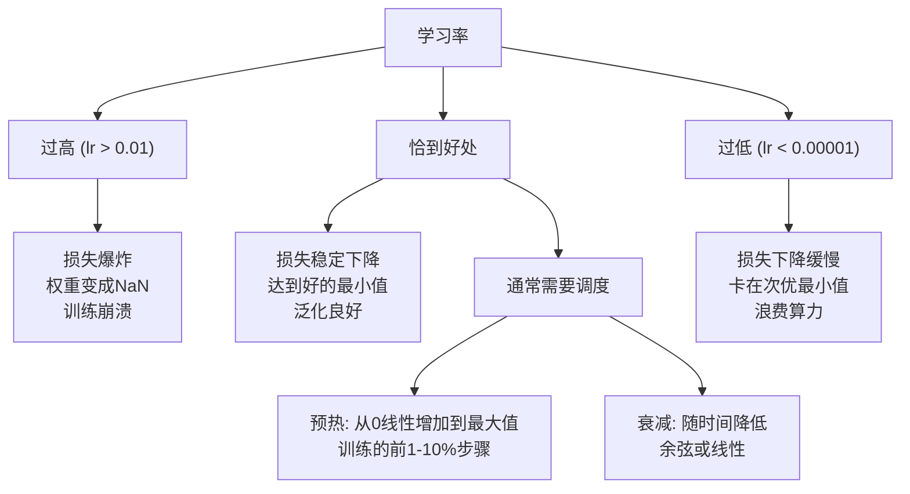
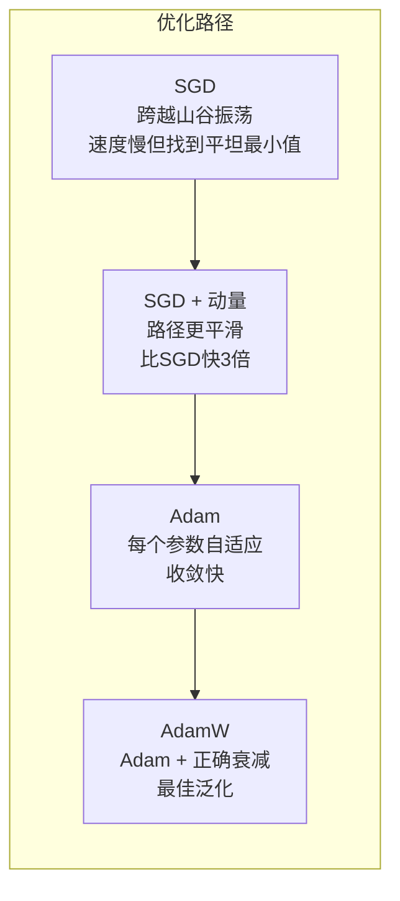
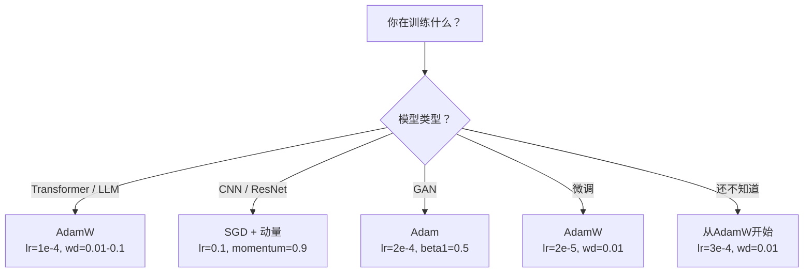

# 优化器（Optimizers）

> 梯度下降告诉你该往哪个方向移动，但它没有说该走多远或多快。随机梯度下降（SGD）是指南针，Adam则是带交通数据的GPS导航。

**类型：** 构建
**语言：** Python
**前置条件：** 第03.05课（损失函数）
**预计时间：** ~75分钟

## 学习目标

- 从零开始用Python实现SGD、带动量（Momentum）的SGD、Adam和AdamW优化器
- 解释Adam的偏差修正（Bias Correction）如何在训练早期步骤中补偿零初始化的矩估计
- 论证为什么AdamW在相同任务上比带L2正则化的Adam产生更好的泛化效果
- 为Transformer、CNN、GAN和微调（Fine-tuning）选择合适的优化器及默认超参数

## 问题

你已经计算出了梯度。你知道权重#4,721应该减少0.003以降低损失。但0.003是什么单位？按什么缩放？而且，你在第1步和第1,000步应该移动相同的量吗？

原始梯度下降（Vanilla Gradient Descent）在每一步对每个参数应用相同的学习率：w = w - lr * gradient。这产生了三个问题，使得实际训练神经网络变得痛苦。

第一，振荡（Oscillation）。损失景观（Loss Landscape）很少像一个光滑的碗。它更像一个狭长的山谷。梯度指向山谷的横向（陡峭方向），而不是沿山谷方向（平缓方向）。梯度下降在狭窄维度上来回反弹，而在有用方向上进展甚微。你见过这种情况：损失快速下降，然后陷入平台期，这不是因为模型收敛了，而是因为它在振荡。

第二，对所有参数使用一个学习率是错误的。某些权重需要大的更新（它们处于早期欠拟合阶段），而其他权重需要微小的更新（它们接近最优值）。适合前者的学习率会破坏后者，反之亦然。

第三，鞍点（Saddle Points）。在高维空间中，损失景观存在大片平坦区域，梯度接近零。原始SGD以梯度的速度爬行，而梯度实际上为零。模型看起来卡住了，但它并没有卡住——它在平坦区域，而另一边有有用的下降路径。但SGD没有机制能推动通过。

Adam解决了所有三个问题。它为每个参数维护两个运行平均值——梯度均值（动量，处理振荡）和梯度平方均值（自适应学习率，处理不同尺度）。结合前几步的偏差修正，你得到一个单一的优化器，在默认超参数下适用于80%的问题。本节课从头构建它，以便你准确理解它在另外20%的问题上何时以及为何失败。

## 概念

### 随机梯度下降（Stochastic Gradient Descent, SGD）

最简单的优化器。计算小批量（Mini-batch）上的梯度，并向相反方向迈步。

```
w = w - lr * gradient
```

“随机”意味着你使用数据的随机子集（小批量）来估计梯度，而不是全部数据集。这种噪声实际上是有用的——它有助于逃离尖锐的局部极小值。但噪声也会引起振荡。

学习率是唯一的旋钮。过高：损失发散。过低：训练永远完成不了。最优值取决于架构、数据、批量大小以及当前训练阶段。对于现代网络的原始SGD，典型值范围从0.01到0.1。但即使在单次训练中，理想的学习率也会变化。

### 动量（Momentum）

球滚下山坡的类比虽然用得太滥但很准确。你不是单独根据梯度迈步，而是维护一个累积过去梯度的速度（Velocity）。

```
m_t = beta * m_{t-1} + gradient
w = w - lr * m_t
```

Beta（通常为0.9）控制保留多少历史信息。当beta=0.9时，动量大致是最后10个梯度的平均值（1/(1-0.9)=10）。

为什么这能解决振荡：指向同一方向的梯度累积。翻转方向的梯度相互抵消。在那个狭窄的山谷中，“横向”分量每一步都改变符号，从而被抑制。“沿山谷”分量保持一致并被放大。结果是沿有用方向的平滑加速。

实际数字：在病态条件损失景观上，单独SGD可能需要10,000步。带动量的SGD（beta=0.9）在同一问题上通常只需3,000-5,000步。加速不是边际的。

### RMSProp

第一个真正有效的每参数自适应学习率方法。由Hinton在Coursera课程中提出（从未正式发表）。

```
s_t = beta * s_{t-1} + (1 - beta) * gradient^2
w = w - lr * gradient / (sqrt(s_t) + epsilon)
```

s_t跟踪梯度平方的运行平均值。持续有较大梯度的参数会除以一个大数（较小的有效学习率）。梯度较小的参数会除以一个小数（较大的有效学习率）。

这解决了“对所有参数使用一个学习率”的问题。一个已经获得较大更新的权重可能接近其目标——应该放慢速度。一个获得极小更新的权重可能训练不足——应该加速。

Epsilon（通常为1e-8）防止参数尚未更新时出现除以零的情况。

### Adam：动量 + RMSProp

Adam结合了两种思想。它为每个参数维护两个指数移动平均：

```
m_t = beta1 * m_{t-1} + (1 - beta1) * gradient        （一阶矩：均值）
v_t = beta2 * v_{t-1} + (1 - beta2) * gradient^2       （二阶矩：方差）
```

**偏差修正（Bias Correction）** 是大多数解释忽略的关键细节。在第1步，m_1 = (1 - beta1) * gradient。当beta1=0.9时，这是0.1 * gradient——小了十倍。移动平均还没有预热。偏差修正补偿了这一点：

```
m_hat = m_t / (1 - beta1^t)
v_hat = v_t / (1 - beta2^t)
```

在第1步，beta1=0.9时：m_hat = m_1 / (1 - 0.9) = m_1 / 0.1 = 实际的梯度。在第100步：(1 - 0.9^100)约等于1.0，所以修正消失。偏差修正对前~10步很重要，在~50步后无关紧要。

更新：

```
w = w - lr * m_hat / (sqrt(v_hat) + epsilon)
```

Adam默认值：lr = 0.001, beta1 = 0.9, beta2 = 0.999, epsilon = 1e-8。这些默认值适用于80%的问题。当它们不适用时，先改lr，再改beta2。几乎从不改变beta1或epsilon。

### AdamW：正确的权重衰减（Weight Decay）

L2正则化在损失中添加lambda * w^2。在原始SGD中，这等价于权重衰减（每一步从权重中减去lambda * w）。在Adam中，这种等价性被打破。

Loshchilov & Hutter的洞见：当你在损失上添加L2后，Adam处理梯度时，自适应学习率也会缩放正则化项。梯度方差大的参数得到较少的正则化；方差小的参数得到较多的正则化。这不是你想要的——你想要的是与梯度统计无关的统一正则化。

AdamW通过在Adam更新之后直接将权重衰减应用于权重来修复这个问题：

```
w = w - lr * m_hat / (sqrt(v_hat) + epsilon) - lr * lambda * w
```

权重衰减项（lr * lambda * w）不被Adam的自适应因子缩放。每个参数获得相同的比例收缩。

这看起来是个小细节。但并非如此。AdamW在几乎所有任务上都能比Adam + L2正则化收敛到更好的解。它是PyTorch中训练Transformer、扩散模型和大多数现代架构的默认优化器。BERT、GPT、LLaMA、Stable Diffusion——都用AdamW训练。

### 学习率：最重要的超参数



如果你只调一个超参数，那就调学习率。10倍的学习率变化比你做的任何架构决策都更重要。常见默认值：

- SGD: lr = 0.01 到 0.1
- Adam/AdamW: lr = 1e-4 到 3e-4
- 微调预训练模型: lr = 1e-5 到 5e-5
- 学习率预热: 在前1-10%的步骤中线性上升

### 优化器比较



### 每个优化器何时胜出



## 动手构建（Build It）

### 第1步：原始SGD

```python
class SGD:
    def __init__(self, lr=0.01):
        self.lr = lr

    def step(self, params, grads):
        for i in range(len(params)):
            params[i] -= self.lr * grads[i]
```

### 第2步：带动量的SGD

```python
class SGDMomentum:
    def __init__(self, lr=0.01, beta=0.9):
        self.lr = lr
        self.beta = beta
        self.velocities = None

    def step(self, params, grads):
        if self.velocities is None:
            self.velocities = [0.0] * len(params)
        for i in range(len(params)):
            self.velocities[i] = self.beta * self.velocities[i] + grads[i]
            params[i] -= self.lr * self.velocities[i]
```

### 第3步：Adam

```python
import math

class Adam:
    def __init__(self, lr=0.001, beta1=0.9, beta2=0.999, epsilon=1e-8):
        self.lr = lr
        self.beta1 = beta1
        self.beta2 = beta2
        self.epsilon = epsilon
        self.m = None
        self.v = None
        self.t = 0

    def step(self, params, grads):
        if self.m is None:
            self.m = [0.0] * len(params)
            self.v = [0.0] * len(params)

        self.t += 1

        for i in range(len(params)):
            self.m[i] = self.beta1 * self.m[i] + (1 - self.beta1) * grads[i]
            self.v[i] = self.beta2 * self.v[i] + (1 - self.beta2) * grads[i] ** 2

            m_hat = self.m[i] / (1 - self.beta1 ** self.t)
            v_hat = self.v[i] / (1 - self.beta2 ** self.t)

            params[i] -= self.lr * m_hat / (math.sqrt(v_hat) + self.epsilon)
```

### 第4步：AdamW

```python
class AdamW:
    def __init__(self, lr=0.001, beta1=0.9, beta2=0.999, epsilon=1e-8, weight_decay=0.01):
        self.lr = lr
        self.beta1 = beta1
        self.beta2 = beta2
        self.epsilon = epsilon
        self.weight_decay = weight_decay
        self.m = None
        self.v = None
        self.t = 0

    def step(self, params, grads):
        if self.m is None:
            self.m = [0.0] * len(params)
            self.v = [0.0] * len(params)

        self.t += 1

        for i in range(len(params)):
            self.m[i] = self.beta1 * self.m[i] + (1 - self.beta1) * grads[i]
            self.v[i] = self.beta2 * self.v[i] + (1 - self.beta2) * grads[i] ** 2

            m_hat = self.m[i] / (1 - self.beta1 ** self.t)
            v_hat = self.v[i] / (1 - self.beta2 ** self.t)

            params[i] -= self.lr * m_hat / (math.sqrt(v_hat) + self.epsilon)
            params[i] -= self.lr * self.weight_decay * params[i]
```

### 第5步：训练对比

在第05课的圆数据集上使用所有四个优化器训练同一个两层网络，比较收敛情况。

```python
import random

def sigmoid(x):
    x = max(-500, min(500, x))
    return 1.0 / (1.0 + math.exp(-x))

def make_circle_data(n=200, seed=42):
    random.seed(seed)
    data = []
    for _ in range(n):
        x = random.uniform(-2, 2)
        y = random.uniform(-2, 2)
        label = 1.0 if x * x + y * y < 1.5 else 0.0
        data.append(([x, y], label))
    return data


class OptimizerTestNetwork:
    def __init__(self, optimizer, hidden_size=8):
        random.seed(0)
        self.hidden_size = hidden_size
        self.optimizer = optimizer

        self.w1 = [[random.gauss(0, 0.5) for _ in range(2)] for _ in range(hidden_size)]
        self.b1 = [0.0] * hidden_size
        self.w2 = [random.gauss(0, 0.5) for _ in range(hidden_size)]
        self.b2 = 0.0

    def get_params(self):
        params = []
        for row in self.w1:
            params.extend(row)
        params.extend(self.b1)
        params.extend(self.w2)
        params.append(self.b2)
        return params

    def set_params(self, params):
        idx = 0
        for i in range(self.hidden_size):
            for j in range(2):
                self.w1[i][j] = params[idx]
                idx += 1
        for i in range(self.hidden_size):
            self.b1[i] = params[idx]
            idx += 1
        for i in range(self.hidden_size):
            self.w2[i] = params[idx]
            idx += 1
        self.b2 = params[idx]

    def forward(self, x):
        self.x = x
        self.z1 = []
        self.h = []
        for i in range(self.hidden_size):
            z = self.w1[i][0] * x[0] + self.w1[i][1] * x[1] + self.b1[i]
            self.z1.append(z)
            self.h.append(max(0.0, z))

        self.z2 = sum(self.w2[i] * self.h[i] for i in range(self.hidden_size)) + self.b2
        self.out = sigmoid(self.z2)
        return self.out

    def compute_grads(self, target):
        eps = 1e-15
        p = max(eps, min(1 - eps, self.out))
        d_loss = -(target / p) + (1 - target) / (1 - p)
        d_sigmoid = self.out * (1 - self.out)
        d_out = d_loss * d_sigmoid

        grads = [0.0] * (self.hidden_size * 2 + self.hidden_size + self.hidden_size + 1)
        idx = 0
        for i in range(self.hidden_size):
            d_relu = 1.0 if self.z1[i] > 0 else