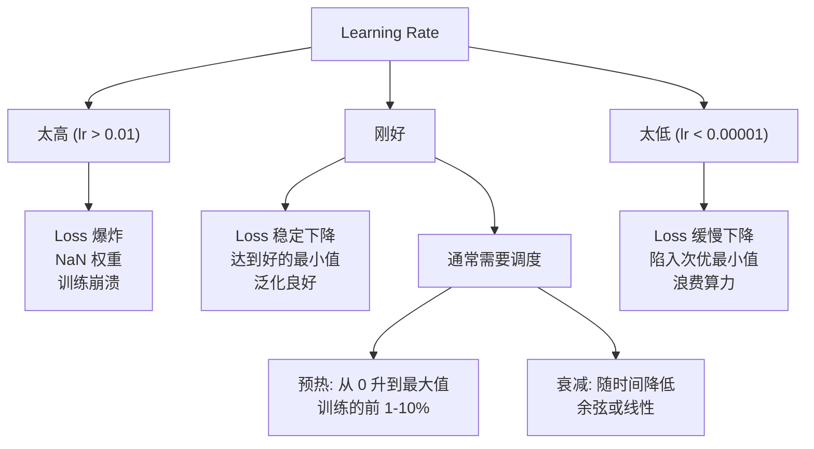
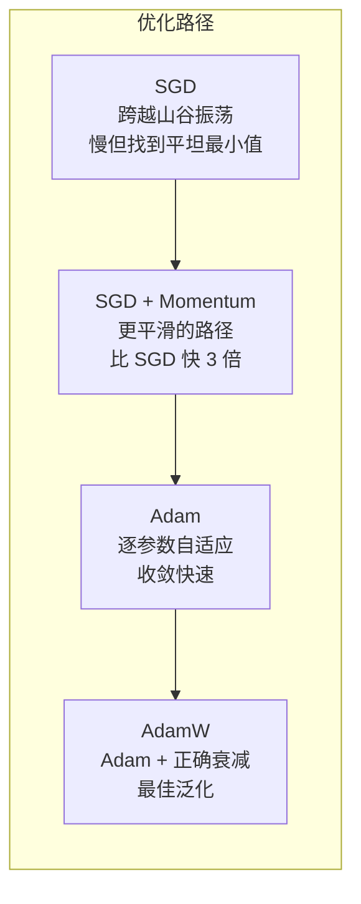
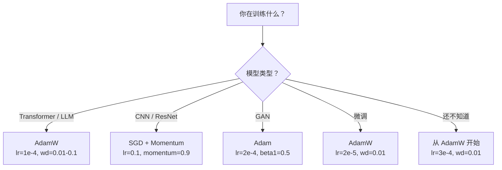

# 优化器 (Optimizers)

> 梯度下降告诉你要往哪个方向走。但它对走多远或多快只字不提。SGD 是指南针。Adam 是带交通数据的 GPS。

**类型：** 动手构建
**语言：** Python
**前置知识：** 第 03.05 课（损失函数）
**时长：** ~75 分钟

## 学习目标

- 用 Python 从零实现 SGD、带动量的 SGD、Adam 和 AdamW 优化器
- 解释 Adam 的偏置修正如何在早期训练步骤中补偿零初始化的矩估计
- 演示为什么 AdamW 在同一任务上比带 L2 正则化的 Adam 产生更好的泛化效果
- 为 transformer、CNN、GAN 和微调选择适当的优化器及默认超参数

## 问题

你计算了梯度。你知道第 4,721 号权重应该减少 0.003 以减小 loss。但 0.003 是以什么为单位？被什么缩放？在第 1 步和第 1,000 步应该移动相同的量吗？

普通梯度下降对每个参数在每一步应用相同的 learning rate：w = w - lr * gradient。这产生了三个问题，使得训练神经网络在实践中很痛苦。

第一，振荡。Loss 景观很少像一个光滑的碗。它更像一个长而窄的山谷。梯度指向山谷的横截面（陡峭方向），而不是沿山谷（平缓方向）。梯度下降在狭窄维度上来回弹跳，同时在有用的方向上进展微小。你见过这种现象：loss 快速下降然后停滞，不是因为模型收敛了，而是因为它在振荡。

第二，对所有参数使用一个 learning rate 是错误的。有些权重需要大的更新（它们处于早期、欠拟合阶段）。其他需要微小的更新（它们接近最优值）。对前者有效的 learning rate 会破坏后者，反之亦然。

第三，鞍点。在高维空间中，loss 景观有广阔的平坦区域，梯度接近零。普通 SGD 以梯度的速度爬过这些区域，而梯度实际上为零。模型看起来卡住了。它并没有卡住——它在一个平坦区域，另一边有有用的下降方向。但 SGD 没有机制来突破。

Adam 解决了所有三个问题。它为每个参数维护两个运行平均值——平均梯度（动量，处理振荡）和平均梯度平方（自适应学习率，处理不同尺度）。结合前几步的偏置修正，它提供了一个在 80% 的问题上使用默认超参数就能工作的优化器。本课从零构建它，以便你准确理解它何时以及为何在另外 20% 上失败。

## 概念

### 随机梯度下降 (SGD)

最简单的优化器。在小批量上计算梯度，然后朝相反方向迈步。

```
w = w - lr * gradient
```

"随机"意味着你使用数据的随机子集（小批量）来估计梯度，而不是完整数据集。这种噪声实际上是有用的——它有助于逃离尖锐的局部最小值。但噪声也会导致振荡。

Learning rate 是唯一的旋钮。太高：loss 发散。太低：训练永远进行不了。最优值取决于架构、数据、批次大小和当前训练阶段。对于现代网络上的普通 SGD，典型值范围从 0.01 到 0.1。但即使在单次训练运行中，理想的 learning rate 也会变化。

### 动量 (Momentum)

球滚下山的比喻虽被过度使用但很准确。你不是仅靠梯度迈步，而是维护一个累积过去梯度的速度。

```
m_t = beta * m_{t-1} + gradient
w = w - lr * m_t
```

Beta（通常为 0.9）控制保留多少历史。使用 beta = 0.9，动量大约是最近 10 个梯度的平均值 (1 / (1 - 0.9) = 10)。

为什么这能修复振荡：指向相同方向的梯度会累积。方向翻转的梯度会相互抵消。在那个狭窄的山谷中，"横向"分量每一步都翻转符号并被抑制。"纵向"分量保持一致并被放大。结果是在有用方向上的平滑加速。

实际数字：单独使用 SGD 在一个条件不好的 loss 景观上可能需要 10,000 步。带动量的 SGD（beta=0.9）在同一个问题上通常只需要 3,000-5,000 步。提速不是微小的。

### RMSProp

第一个真正有效的逐参数自适应学习率方法。由 Hinton 在 Coursera 讲座中提出（从未正式发表）。

```
s_t = beta * s_{t-1} + (1 - beta) * gradient^2
w = w - lr * gradient / (sqrt(s_t) + epsilon)
```

s_t 跟踪梯度平方的运行平均值。梯度持续大的参数会被一个大数除（更小的有效学习率）。梯度小的参数会被一个小数除（更大的有效学习率）。

这解决了"对所有参数使用一个 learning rate"的问题。一个已经获得大更新的权重大概接近其目标——让它慢下来。一个获得微小更新的权重可能训练不足——让它加速。

Epsilon（通常为 1e-8）防止当参数从未更新时除以零。

### Adam：动量 + RMSProp

Adam 结合了两种思想。它为每个参数维护两个指数移动平均值：

```
m_t = beta1 * m_{t-1} + (1 - beta1) * gradient        (first moment: mean)
v_t = beta2 * v_{t-1} + (1 - beta2) * gradient^2       (second moment: variance)
```

**偏置修正 (bias correction)** 是大多数解释略过的关键细节。在第 1 步，m_1 = (1 - beta1) * gradient。使用 beta1 = 0.9，那是 0.1 * gradient——小了十倍。移动平均还没有预热。偏置修正进行补偿：

```
m_hat = m_t / (1 - beta1^t)
v_hat = v_t / (1 - beta2^t)
```

在第 1 步，beta1 = 0.9：m_hat = m_1 / (1 - 0.9) = m_1 / 0.1 = 实际梯度。在第 100 步：(1 - 0.9^100) 约等于 1.0，所以修正消失。偏置修正对前 ~10 步很重要，在 ~50 步后无关紧要。

更新规则：

```
w = w - lr * m_hat / (sqrt(v_hat) + epsilon)
```

Adam 默认值：lr = 0.001，beta1 = 0.9，beta2 = 0.999，epsilon = 1e-8。这些默认值在 80% 的问题上有效。当它们无效时，先改 lr。然后改 beta2。几乎从不改 beta1 或 epsilon。

### AdamW：正确实现的权重衰减

L2 正则化向 loss 添加 lambda * w^2。在普通 SGD 中，这等价于权重衰减（每一步从权重中减去 lambda * w）。在 Adam 中，这种等价性被打破了。

Loshchilov & Hutter 的洞见：当你将 L2 添加到 loss 然后 Adam 处理梯度时，自适应学习率也会缩放正则化项。梯度方差大的参数获得更少的正则化。方差小的参数获得更多。这不是你想要的——无论梯度统计如何，你都需要统一的正则化。

AdamW 通过在 Adam 更新之后直接将权重衰减应用于权重来修复这个问题：

```
w = w - lr * m_hat / (sqrt(v_hat) + epsilon) - lr * lambda * w
```

权重衰减项 (lr * lambda * w) 不被 Adam 的自适应因子缩放。每个参数获得相同的比例收缩。

这看起来是一个小细节。但并非如此。AdamW 在几乎所有任务上收敛到比 Adam + L2 正则化更好的解。它是 PyTorch 中训练 transformer、扩散模型和大多数现代架构的默认优化器。BERT、GPT、LLaMA、Stable Diffusion——全部用 AdamW 训练。

### Learning Rate：最重要的超参数


```mermaid
graph TD
    LR["Learning Rate"] --> TooHigh["太高 (lr > 0.01)"]
    LR --> JustRight["刚好"]
    LR --> TooLow["太低 (lr < 0.00001)"]

    TooHigh --> Diverge["Loss 爆炸<br/>NaN 权重<br/>训练崩溃"]
    JustRight --> Converge["Loss 稳定下降<br/>达到好的最小值<br/>泛化良好"]
    TooLow --> Stall["Loss 缓慢下降<br/>陷入次优最小值<br/>浪费算力"]

    JustRight --> Schedule["通常需要调度"]
    Schedule --> Warmup["预热: 从 0 升到最大值<br/>训练的前 1-10%"]
    Schedule --> Decay["衰减: 随时间降低<br/>余弦或线性"]
```

如果你只调一个超参数，调 learning rate。10 倍 learning rate 的变化比你做的任何架构决策都重要。常见默认值：

- SGD：lr = 0.01 到 0.1
- Adam/AdamW：lr = 1e-4 到 3e-4
- 微调预训练模型：lr = 1e-5 到 5e-5
- Learning rate warmup：在前 1-10% 的步骤中线性上升

### 优化器对比


```mermaid
flowchart LR
    subgraph "优化路径"
        SGD_P["SGD<br/>跨越山谷振荡<br/>慢但找到平坦最小值"]
        Mom_P["SGD + Momentum<br/>更平滑的路径<br/>比 SGD 快 3 倍"]
        Adam_P["Adam<br/>逐参数自适应<br/>收敛快速"]
        AdamW_P["AdamW<br/>Adam + 正确衰减<br/>最佳泛化"]
    end
    SGD_P --> Mom_P --> Adam_P --> AdamW_P
```

### 各优化器何时胜出


```mermaid
flowchart TD
    Task["你在训练什么？"] --> Type{"模型类型？"}

    Type -->|"Transformer / LLM"| AdamW["AdamW<br/>lr=1e-4, wd=0.01-0.1"]
    Type -->|"CNN / ResNet"| SGD_M["SGD + Momentum<br/>lr=0.1, momentum=0.9"]
    Type -->|"GAN"| Adam2["Adam<br/>lr=2e-4, beta1=0.5"]
    Type -->|"微调"| AdamW2["AdamW<br/>lr=2e-5, wd=0.01"]
    Type -->|"还不知道"| Default["从 AdamW 开始<br/>lr=3e-4, wd=0.01"]
```

```figure
optimizer-trajectory
```

## 动手构建

### 第 1 步：普通 SGD

```python
class SGD:
    def __init__(self, lr=0.01):
        self.lr = lr

    def step(self, params, grads):
        for i in range(len(params)):
            params[i] -= self.lr * grads[i]
```

### 第 2 步：带动量的 SGD

```python
class SGDMomentum:
    def __init__(self, lr=0.01, beta=0.9):
        self.lr = lr
        self.beta = beta
        self.velocities = None

    def step(self, params, grads):
        if self.velocities is None:
            self.velocities = [0.0] * len(params)
        for i in range(len(params)):
            self.velocities[i] = self.beta * self.velocities[i] + grads[i]
            params[i] -= self.lr * self.velocities[i]
```

### 第 3 步：Adam

```python
import math

class Adam:
    def __init__(self, lr=0.001, beta1=0.9, beta2=0.999, epsilon=1e-8):
        self.lr = lr
        self.beta1 = beta1
        self.beta2 = beta2
        self.epsilon = epsilon
        self.m = None
        self.v = None
        self.t = 0

    def step(self, params, grads):
        if self.m is None:
            self.m = [0.0] * len(params)
            self.v = [0.0] * len(params)

        self.t += 1

        for i in range(len(params)):
            self.m[i] = self.beta1 * self.m[i] + (1 - self.beta1) * grads[i]
            self.v[i] = self.beta2 * self.v[i] + (1 - self.beta2) * grads[i] ** 2

            m_hat = self.m[i] / (1 - self.beta1 ** self.t)
            v_hat = self.v[i] / (1 - self.beta2 ** self.t)

            params[i] -= self.lr * m_hat / (math.sqrt(v_hat) + self.epsilon)
```

### 第 4 步：AdamW

```python
class AdamW:
    def __init__(self, lr=0.001, beta1=0.9, beta2=0.999, epsilon=1e-8, weight_decay=0.01):
        self.lr = lr
        self.beta1 = beta1
        self.beta2 = beta2
        self.epsilon = epsilon
        self.weight_decay = weight_decay
        self.m = None
        self.v = None
        self.t = 0

    def step(self, params, grads):
        if self.m is None:
            self.m = [0.0] * len(params)
            self.v = [0.0] * len(params)

        self.t += 1

        for i in range(len(params)):
            self.m[i] = self.beta1 * self.m[i] + (1 - self.beta1) * grads[i]
            self.v[i] = self.beta2 * self.v[i] + (1 - self.beta2) * grads[i] ** 2

            m_hat = self.m[i] / (1 - self.beta1 ** self.t)
            v_hat = self.v[i] / (1 - self.beta2 ** self.t)

            params[i] -= self.lr * m_hat / (math.sqrt(v_hat) + self.epsilon)
            params[i] -= self.lr * self.weight_decay * params[i]
```

### 第 5 步：训练比较

使用第 05 课的圆形数据集，用所有四个优化器训练相同的两层网络。比较收敛情况。

```python
import random

def sigmoid(x):
    x = max(-500, min(500, x))
    return 1.0 / (1.0 + math.exp(-x))

def make_circle_data(n=200, seed=42):
    random.seed(seed)
    data = []
    for _ in range(n):
        x = random.uniform(-2, 2)
        y = random.uniform(-2, 2)
        label = 1.0 if x * x + y * y < 1.5 else 0.0
        data.append(([x, y], label))
    return data


class OptimizerTestNetwork:
    def __init__(self, optimizer, hidden_size=8):
        random.seed(0)
        self.hidden_size = hidden_size
        self.optimizer = optimizer

        self.w1 = [[random.gauss(0, 0.5) for _ in range(2)] for _ in range(hidden_size)]
        self.b1 = [0.0] * hidden_size
        self.w2 = [random.gauss(0, 0.5) for _ in range(hidden_size)]
        self.b2 = 0.0

    def get_params(self):
        params = []
        for row in self.w1:
            params.extend(row)
        params.extend(self.b1)
        params.extend(self.w2)
        params.append(self.b2)
        return params

    def set_params(self, params):
        idx = 0
        for i in range(self.hidden_size):
            for j in range(2):
                self.w1[i][j] = params[idx]
                idx += 1
        for i in range(self.hidden_size):
            self.b1[i] = params[idx]
            idx += 1
        for i in range(self.hidden_size):
            self.w2[i] = params[idx]
            idx += 1
        self.b2 = params[idx]

    def forward(self, x):
        self.x = x
        self.z1 = []
        self.h = []
        for i in range(self.hidden_size):
            z = self.w1[i][0] * x[0] + self.w1[i][1] * x[1] + self.b1[i]
            self.z1.append(z)
            self.h.append(max(0.0, z))

        self.z2 = sum(self.w2[i] * self.h[i] for i in range(self.hidden_size)) + self.b2
        self.out = sigmoid(self.z2)
        return self.out

    def compute_grads(self, target):
        eps = 1e-15
        p = max(eps, min(1 - eps, self.out))
        d_loss = -(target / p) + (1 - target) / (1 - p)
        d_sigmoid = self.out * (1 - self.out)
        d_out = d_loss * d_sigmoid

        grads = [0.0] * (self.hidden_size * 2 + self.hidden_size + self.hidden_size + 1)
        idx = 0
        for i in range(self.hidden_size):
            d_relu = 1.0 if self.z1[i] > 0 else 0.0
            d_h = d_out * self.w2[i] * d_relu
            grads[idx] = d_h * self.x[0]
            grads[idx + 1] = d_h * self.x[1]
            idx += 2

        for i in range(self.hidden_size):
            d_relu = 1.0 if self.z1[i] > 0 else 0.0
            grads[idx] = d_out * self.w2[i] * d_relu
            idx += 1

        for i in range(self.hidden_size):
            grads[idx] = d_out * self.h[i]
            idx += 1

        grads[idx] = d_out
        return grads

    def train(self, data, epochs=300):
        losses = []
        for epoch in range(epochs):
            total_loss = 0.0
            correct = 0
            for x, y in data:
                pred = self.forward(x)
                grads = self.compute_grads(y)
                params = self.get_params()
                self.optimizer.step(params, grads)
                self.set_params(params)

                eps = 1e-15
                p = max(eps, min(1 - eps, pred))
                total_loss += -(y * math.log(p) + (1 - y) * math.log(1 - p))
                if (pred >= 0.5) == (y >= 0.5):
                    correct += 1
            avg_loss = total_loss / len(data)
            accuracy = correct / len(data) * 100
            losses.append((avg_loss, accuracy))
            if epoch % 75 == 0 or epoch == epochs - 1:
                print(f"    Epoch {epoch:3d}: loss={avg_loss:.4f}, accuracy={accuracy:.1f}%")
        return losses
```

## 使用它

PyTorch 优化器处理参数组、梯度裁剪和学习率调度：

```python
import torch
import torch.optim as optim

model = torch.nn.Sequential(
    torch.nn.Linear(784, 256),
    torch.nn.ReLU(),
    torch.nn.Linear(256, 10),
)

optimizer = optim.AdamW(model.parameters(), lr=3e-4, weight_decay=0.01)

scheduler = optim.lr_scheduler.CosineAnnealingLR(optimizer, T_max=100)

for epoch in range(100):
    optimizer.zero_grad()
    output = model(torch.randn(32, 784))
    loss = torch.nn.functional.cross_entropy(output, torch.randint(0, 10, (32,)))
    loss.backward()
    torch.nn.utils.clip_grad_norm_(model.parameters(), max_norm=1.0)
    optimizer.step()
    scheduler.step()
```

模式始终是：zero_grad, forward, loss, backward, (clip), step, (schedule)。记住这个顺序。搞错了（例如在 optimizer.step() 之前调用 scheduler.step()）是微妙 bug 的常见来源。

对于 CNN，许多从业者仍然偏爱 SGD + momentum（lr=0.1, momentum=0.9, weight_decay=1e-4）配合 step 或余弦调度。SGD 找到更平坦的最小值，通常泛化更好。对于 transformer 和 LLM，带 warmup + 余弦衰减的 AdamW 是通用默认值。没有实测理由就不要对抗共识。

## 交付物

本课程产出：
- `outputs/prompt-optimizer-selector.md` —— 一个决策提示词，用于为任何架构选择正确的优化器和 learning rate

## 练习

1. 实现 Nesterov 动量，其中你在"前瞻"位置 (w - lr * beta * v) 而不是当前位置计算梯度。在圆形数据集上比较与标准动量的收敛速度。
2. 实现一个 learning rate warmup 调度：在前 10% 的训练步骤中从 0 线性上升到 max_lr，然后余弦衰减到 0。使用带 warmup 的 Adam 与不带 warmup 的 Adam 进行训练。测量在圆形数据集上达到 90% 准确率所需的 epoch 数。
3. 在 Adam 训练期间跟踪每个参数的有效 learning rate。有效学习率是 lr * m_hat / (sqrt(v_hat) + eps)。在 10、50 和 200 步后绘制有效学习率的分布。所有参数以相同的速度更新吗？
4. 实现梯度裁剪（按全局范数裁剪）。将最大梯度范数设为 1.0。使用高 learning rate（Adam 的 lr=0.01）进行带和不带裁剪的训练。在 10 个随机种子下计数有多少次运行发散（loss 变为 NaN）。
5. 在一个具有大权重的网络上比较 Adam 与 AdamW。将所有权重初始化为 [-5, 5] 范围内的随机值（比正常大得多）。以 weight_decay=0.1 训练 200 个 epoch。绘制两个优化器在训练过程中权重的 L2 范数。AdamW 应该显示更快的权重收缩。

## 关键术语

| 术语 | 人们怎么说 | 实际含义 |
|------|-----------|---------|
| Learning rate | "步长" | 梯度更新的标量乘数；训练中影响最大的单一超参数 |
| SGD | "基本梯度下降" | 随机梯度下降：通过减去 lr * gradient 更新权重，在小批量上计算 |
| Momentum | "滚球比喻" | 过去梯度的指数移动平均；抑制振荡并加速一致的方向 |
| RMSProp | "自适应学习率" | 将每个参数的梯度除以其近期梯度的运行 RMS；均衡学习率 |
| Adam | "默认优化器" | 结合动量（一阶矩）和 RMSProp（二阶矩），带初始步骤的偏置修正 |
| AdamW | "正确的 Adam" | 带解耦权重衰减的 Adam；直接对权重应用正则化而非通过梯度 |
| Bias correction | "运行平均的预热" | 除以 (1 - beta^t) 以补偿 Adam 矩估计的零初始化 |
| Weight decay | "收缩权重" | 每一步减去权重值的一部分；惩罚大权重的正则化器 |
| Learning rate schedule | "随时间改变 lr" | 在训练期间调整 learning rate 的函数；warmup + 余弦衰减是现代默认 |
| Gradient clipping | "限制梯度范数" | 当梯度向量的范数超过阈值时缩小它；防止梯度爆炸更新 |

## 延伸阅读

- Kingma & Ba, "Adam: A Method for Stochastic Optimization" (2014) —— 原始的 Adam 论文，包含收敛性分析和偏置修正推导
- Loshchilov & Hutter, "Decoupled Weight Decay Regularization" (2017) —— 证明了 L2 正则化和权重衰减在 Adam 中不等价，并提出了 AdamW
- Smith, "Cyclical Learning Rates for Training Neural Networks" (2017) —— 引入了 LR 范围测试和循环调度，消除了调整固定 learning rate 的需要
- Ruder, "An Overview of Gradient Descent Optimization Algorithms" (2016) —— 所有优化器变体的最佳单一综述，有清晰的比较和直觉
