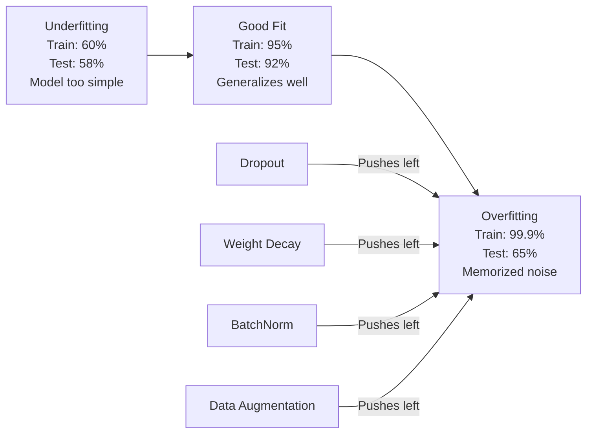
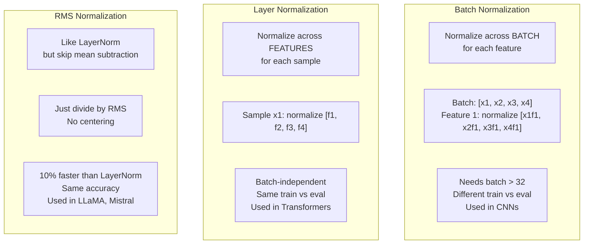
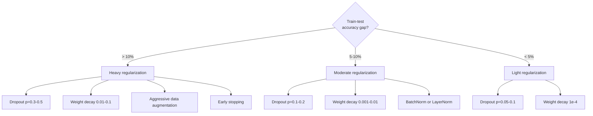

# 正則化

> モデルが学習データで 99%、テストデータで 60% を出す。これは学習ではなく暗記です。正則化とは、汎化を強制するために複雑さへ課す税金です。

**種類:** Build
**言語:** Python
**前提:** Lesson 03.06 (Optimizers)
**時間:** 約 75 分

## 学習目標

- inverted scaling 付きの dropout、L2 weight decay、batch normalization、layer normalization、RMSNorm をゼロから実装する
- train-test accuracy gap を測定し、正則化実験を使って過学習を診断する
- transformers が BatchNorm ではなく LayerNorm を使う理由と、現代的な LLMs が RMSNorm を好む理由を説明する
- 過学習の深刻さに応じて、正しい正則化手法の組み合わせを適用する

## 問題

十分なパラメータを持つニューラルネットワークは、どんなデータセットでも暗記できます。これは仮説ではありません。Zhang et al. (2017) は、ランダムなラベルを付けた ImageNet で標準的なネットワークを学習させてそれを示しました。ネットワークは完全にランダムなラベル割り当てに対して、ほぼゼロの training loss に到達しました。学ぶべきパターンがない 100 万件のランダムな入出力ペアを暗記したのです。Training loss は完璧でした。Test accuracy はゼロでした。

これが過学習の問題であり、モデルが大きくなるほど悪化します。GPT-3 には 1750 億パラメータがあります。学習セットは約 5000 億 tokens です。それほど多くのパラメータがあれば、モデルには学習データのかなりの塊をそのまま暗記するだけの容量があります。正則化がなければ、汎化可能なパターンを学ぶ代わりに、学習例をそのまま吐き出すだけになります。

学習性能とテスト性能の差が overfitting gap です。このレッスンの各手法は、その gap を別々の角度から攻撃します。Dropout は、ネットワークが特定の 1 個のニューロンに依存しないように強制します。Weight decay は、どの重みも大きくなりすぎないようにします。Batch normalization は loss landscape を滑らかにし、optimizer がより平坦で汎化しやすい minima を見つけられるようにします。Layer normalization も同じことをしますが、batch normalization が失敗する場所（小さい batches、可変長 sequences）でも機能します。RMSNorm は平均計算を省いて、それを 10% 速く行います。各手法は単純です。組み合わせると、暗記するモデルと汎化するモデルの差になります。

## 概念

### 過学習のスペクトラム

すべてのモデルは、underfitting（パターンを捉えるには単純すぎる）から overfitting（複雑すぎてノイズまで捉える）までのスペクトラム上のどこかにあります。最適な位置はその中間であり、正則化は overfit 側からモデルをそこへ押し戻します。



### Dropout

最も単純で、最も優雅な解釈を持つ正則化手法です。学習中に、各ニューロンの出力を確率 p でランダムにゼロにします。

```
output = activation(z) * mask    where mask[i] ~ Bernoulli(1 - p)
```

p = 0.5 なら、各 forward pass で半分のニューロンがゼロになります。どのニューロンが使えるか予測できないため、ネットワークは冗長な表現を学ばなければなりません。これにより co-adaptation、つまりニューロンが特定の他のニューロンの存在に依存することを防ぎます。

ensemble としての解釈: N 個のニューロンを持つネットワークに dropout を使うと、2^N 個の可能なサブネットワーク（各ニューロンがオンかオフかのすべての組み合わせ）が作られます。Dropout での学習は、異なる mini-batches 上で 2^N 個すべてのサブネットワークを同時に近似的に学習していることになります。テスト時には全ニューロンを使い（dropout なし）、出力を (1 - p) でスケールして学習時の期待値と合わせます。これは 2^N 個のサブネットワークの予測を平均することと等価です。単一モデルから作る巨大な ensemble です。

実務では、スケーリングはテスト時ではなく学習中に適用します（inverted dropout）。

```
During training:  output = activation(z) * mask / (1 - p)
During testing:   output = activation(z)   (no change needed)
```

このほうが、テストコードが dropout をまったく意識しなくてよいためきれいです。

デフォルトの rate: transformers は p = 0.1、MLPs は p = 0.5、CNNs は p = 0.2-0.3。Dropout が高いほど、正則化は強くなり、underfitting のリスクも上がります。

### Weight Decay（L2 正則化）

すべての重みの二乗の大きさを loss に加えます。

```
total_loss = task_loss + (lambda / 2) * sum(w_i^2)
```

正則化項の gradient は lambda * w です。つまり各 step で、それぞれの重みは自身の大きさに比例した割合でゼロへ縮められます。大きな重みほど強く罰せられます。モデルは、特定の 1 個の重みが支配しない解へ押されます。

これが汎化に効く理由: overfit したモデルは、学習データ内のノイズを増幅する大きな重みを持ちがちです。Weight decay は重みを小さく保ち、モデルの実効容量を制限し、記憶した癖ではなく頑健で汎化可能な特徴に依存させます。

lambda hyperparameter が強さを制御します。典型値は次の通りです。

- transformers の AdamW では 0.01
- CNNs の SGD では 1e-4
- 強く overfit しているモデルでは 0.1

レッスン 06 で説明した通り、weight decay と L2 regularization は SGD では等価ですが、Adam では等価ではありません。Adam で学習する場合は必ず AdamW（decoupled weight decay）を使ってください。

### Batch Normalization

各 layer の出力を、次の layer に渡す前に mini-batch 全体で正規化します。

ある layer の activations の mini-batch について:

```
mu = (1/B) * sum(x_i)           (batch mean)
sigma^2 = (1/B) * sum((x_i - mu)^2)   (batch variance)
x_hat = (x_i - mu) / sqrt(sigma^2 + eps)   (normalize)
y = gamma * x_hat + beta        (scale and shift)
```

Gamma と beta は learnable parameters で、最適であればネットワークが正規化を打ち消せるようにします。これらがないと、すべての layer 出力を zero-mean unit-variance に強制することになり、それはネットワークが望むものではないかもしれません。

**Training と inference の分離:** 学習中、mu と sigma は現在の mini-batch から得ます。Inference 中は、学習中に蓄積された running averages を使います（momentum = 0.1 の exponential moving average、つまり 90% old + 10% new）。

BatchNorm がなぜ効くのかは、今でも議論があります。元の論文は "internal covariate shift"（前の layers が更新されるにつれて layer 入力の分布が変わること）を減らすからだと主張しました。Santurkar et al. (2018) は、この説明が誤りであることを示しました。実際の理由は、BatchNorm が loss landscape を滑らかにすることです。Gradients はより予測しやすくなり、Lipschitz constants は小さくなり、optimizer はより大きな step を安全に取れます。これが、BatchNorm によって高い learning rates を使え、より速く収束できる理由です。

BatchNorm には根本的な制限があります。batch statistics に依存することです。Batch size 1 では、平均と分散に意味がありません。小さい batches（< 32）では statistics がノイズを含み、性能を損ないます。これは object detection（memory 制限で batch size が小さくなる）や language modeling（sequence lengths が可変）のようなタスクで重要です。

### Layer Normalization

batch 方向ではなく features 方向で正規化します。単一 sample について:

```
mu = (1/D) * sum(x_j)           (feature mean)
sigma^2 = (1/D) * sum((x_j - mu)^2)   (feature variance)
x_hat = (x_j - mu) / sqrt(sigma^2 + eps)
y = gamma * x_hat + beta
```

D は feature dimension です。各 sample は独立に正規化され、batch size には依存しません。これが transformers が BatchNorm ではなく LayerNorm を使う理由です。Sequences は可変長で、batch sizes は小さいことが多く（生成時は 1 になることもあります）、training と inference で計算が同一です。

Transformers での LayerNorm は、各 self-attention block と各 feed-forward block の後（Post-LN）、またはそれらの前（Pre-LN、こちらのほうが学習が安定）に適用されます。

### RMSNorm

平均の差し引きがない LayerNorm です。Zhang & Sennrich (2019) によって提案されました。

```
rms = sqrt((1/D) * sum(x_j^2))
y = gamma * x / rms
```

これだけです。平均計算も beta parameter もありません。観察されたことは、LayerNorm の re-centering（平均の差し引き）はモデル性能にほとんど寄与しない一方で、計算コストがかかるという点です。それを取り除くと、約 10% 少ない overhead で同じ accuracy が得られます。

LLaMA、LLaMA 2、LLaMA 3、Mistral、そして多くの現代的な LLMs は LayerNorm の代わりに RMSNorm を使います。数十億パラメータ、数兆 tokens の規模では、この 10% の節約は大きな意味を持ちます。

### 正規化の比較



### 正則化としての Data Augmentation

これはモデルの変更ではなく、データの変更です。ラベルを保ったまま学習入力を変換します。

- 画像: random crop、flip、rotation、color jitter、cutout
- テキスト: synonym replacement、back-translation、random deletion
- 音声: time stretch、pitch shift、noise addition

効果は正則化と同じです。学習セットの実効サイズを増やし、モデルが特定の例を暗記しにくくします。各画像を元の形で 1 回だけ見るモデルは、それを暗記できます。各画像の 50 個の augmented versions を見るモデルは、不変な構造を学ぶことを強制されます。

### Early Stopping

最も単純な正則化です。validation loss が増え始めたら学習を止めます。その時点では、モデルはまだ overfit していません。実務では、epoch ごとに validation loss を追跡し、best model を保存し、"patience" window（典型的には 5-20 epochs）の間は学習を続けます。patience window 内で validation loss が改善しなければ停止し、保存しておいた best model を読み込みます。

### 何をいつ適用するか



## 作ってみる

### Step 1: Dropout（Train Mode と Eval Mode）

```python
import random
import math


class Dropout:
    def __init__(self, p=0.5):
        self.p = p
        self.training = True
        self.mask = None

    def forward(self, x):
        if not self.training:
            return list(x)
        self.mask = []
        output = []
        for val in x:
            if random.random() < self.p:
                self.mask.append(0)
                output.append(0.0)
            else:
                self.mask.append(1)
                output.append(val / (1 - self.p))
        return output

    def backward(self, grad_output):
        grads = []
        for g, m in zip(grad_output, self.mask):
            if m == 0:
                grads.append(0.0)
            else:
                grads.append(g / (1 - self.p))
        return grads
```

### Step 2: L2 Weight Decay

```python
def l2_regularization(weights, lambda_reg):
    penalty = 0.0
    for w in weights:
        penalty += w * w
    return lambda_reg * 0.5 * penalty

def l2_gradient(weights, lambda_reg):
    return [lambda_reg * w for w in weights]
```

### Step 3: Batch Normalization

```python
class BatchNorm:
    def __init__(self, num_features, momentum=0.1, eps=1e-5):
        self.gamma = [1.0] * num_features
        self.beta = [0.0] * num_features
        self.eps = eps
        self.momentum = momentum
        self.running_mean = [0.0] * num_features
        self.running_var = [1.0] * num_features
        self.training = True
        self.num_features = num_features

    def forward(self, batch):
        batch_size = len(batch)
        if self.training:
            mean = [0.0] * self.num_features
            for sample in batch:
                for j in range(self.num_features):
                    mean[j] += sample[j]
            mean = [m / batch_size for m in mean]

            var = [0.0] * self.num_features
            for sample in batch:
                for j in range(self.num_features):
                    var[j] += (sample[j] - mean[j]) ** 2
            var = [v / batch_size for v in var]

            for j in range(self.num_features):
                self.running_mean[j] = (1 - self.momentum) * self.running_mean[j] + self.momentum * mean[j]
                self.running_var[j] = (1 - self.momentum) * self.running_var[j] + self.momentum * var[j]
        else:
            mean = list(self.running_mean)
            var = list(self.running_var)

        self.x_hat = []
        output = []
        for sample in batch:
            normalized = []
            out_sample = []
            for j in range(self.num_features):
                x_h = (sample[j] - mean[j]) / math.sqrt(var[j] + self.eps)
                normalized.append(x_h)
                out_sample.append(self.gamma[j] * x_h + self.beta[j])
            self.x_hat.append(normalized)
            output.append(out_sample)
        return output
```

### Step 4: Layer Normalization

```python
class LayerNorm:
    def __init__(self, num_features, eps=1e-5):
        self.gamma = [1.0] * num_features
        self.beta = [0.0] * num_features
        self.eps = eps
        self.num_features = num_features

    def forward(self, x):
        mean = sum(x) / len(x)
        var = sum((xi - mean) ** 2 for xi in x) / len(x)

        self.x_hat = []
        output = []
        for j in range(self.num_features):
            x_h = (x[j] - mean) / math.sqrt(var + self.eps)
            self.x_hat.append(x_h)
            output.append(self.gamma[j] * x_h + self.beta[j])
        return output
```

### Step 5: RMSNorm

```python
class RMSNorm:
    def __init__(self, num_features, eps=1e-6):
        self.gamma = [1.0] * num_features
        self.eps = eps
        self.num_features = num_features

    def forward(self, x):
        rms = math.sqrt(sum(xi * xi for xi in x) / len(x) + self.eps)
        output = []
        for j in range(self.num_features):
            output.append(self.gamma[j] * x[j] / rms)
        return output
```

### Step 6: 正則化あり・なしで学習する

```python
def sigmoid(x):
    x = max(-500, min(500, x))
    return 1.0 / (1.0 + math.exp(-x))


def make_circle_data(n=200, seed=42):
    random.seed(seed)
    data = []
    for _ in range(n):
        x = random.uniform(-2, 2)
        y = random.uniform(-2, 2)
        label = 1.0 if x * x + y * y < 1.5 else 0.0
        data.append(([x, y], label))
    return data


class RegularizedNetwork:
    def __init__(self, hidden_size=16, lr=0.05, dropout_p=0.0, weight_decay=0.0):
        random.seed(0)
        self.hidden_size = hidden_size
        self.lr = lr
        self.dropout_p = dropout_p
        self.weight_decay = weight_decay
        self.dropout = Dropout(p=dropout_p) if dropout_p > 0 else None

        self.w1 = [[random.gauss(0, 0.5) for _ in range(2)] for _ in range(hidden_size)]
        self.b1 = [0.0] * hidden_size
        self.w2 = [random.gauss(0, 0.5) for _ in range(hidden_size)]
        self.b2 = 0.0

    def forward(self, x, training=True):
        self.x = x
        self.z1 = []
        self.h = []
        for i in range(self.hidden_size):
            z = self.w1[i][0] * x[0] + self.w1[i][1] * x[1] + self.b1[i]
            self.z1.append(z)
            self.h.append(max(0.0, z))

        if self.dropout and training:
            self.dropout.training = True
            self.h = self.dropout.forward(self.h)
        elif self.dropout:
            self.dropout.training = False
            self.h = self.dropout.forward(self.h)

        self.z2 = sum(self.w2[i] * self.h[i] for i in range(self.hidden_size)) + self.b2
        self.out = sigmoid(self.z2)
        return self.out

    def backward(self, target):
        eps = 1e-15
        p = max(eps, min(1 - eps, self.out))
        d_loss = -(target / p) + (1 - target) / (1 - p)
        d_sigmoid = self.out * (1 - self.out)
        d_out = d_loss * d_sigmoid

        for i in range(self.hidden_size):
            d_relu = 1.0 if self.z1[i] > 0 else 0.0
            d_h = d_out * self.w2[i] * d_relu
            self.w2[i] -= self.lr * (d_out * self.h[i] + self.weight_decay * self.w2[i])
            for j in range(2):
                self.w1[i][j] -= self.lr * (d_h * self.x[j] + self.weight_decay * self.w1[i][j])
            self.b1[i] -= self.lr * d_h
        self.b2 -= self.lr * d_out

    def evaluate(self, data):
        correct = 0
        total_loss = 0.0
        for x, y in data:
            pred = self.forward(x, training=False)
            eps = 1e-15
            p = max(eps, min(1 - eps, pred))
            total_loss += -(y * math.log(p) + (1 - y) * math.log(1 - p))
            if (pred >= 0.5) == (y >= 0.5):
                correct += 1
        return total_loss / len(data), correct / len(data) * 100

    def train_model(self, train_data, test_data, epochs=300):
        history = []
        for epoch in range(epochs):
            total_loss = 0.0
            correct = 0
            for x, y in train_data:
                pred = self.forward(x, training=True)
                self.backward(y)
                eps = 1e-15
                p = max(eps, min(1 - eps, pred))
                total_loss += -(y * math.log(p) + (1 - y) * math.log(1 - p))
                if (pred >= 0.5) == (y >= 0.5):
                    correct += 1
            train_loss = total_loss / len(train_data)
            train_acc = correct / len(train_data) * 100
            test_loss, test_acc = self.evaluate(test_data)
            history.append((train_loss, train_acc, test_loss, test_acc))
            if epoch % 75 == 0 or epoch == epochs - 1:
                gap = train_acc - test_acc
                print(f"    Epoch {epoch:3d}: train_acc={train_acc:.1f}%, test_acc={test_acc:.1f}%, gap={gap:.1f}%")
        return history
```

## 使ってみる

PyTorch はすべての normalization と regularization を modules として提供しています。

```python
import torch
import torch.nn as nn

model = nn.Sequential(
    nn.Linear(784, 256),
    nn.BatchNorm1d(256),
    nn.ReLU(),
    nn.Dropout(0.3),
    nn.Linear(256, 128),
    nn.BatchNorm1d(128),
    nn.ReLU(),
    nn.Dropout(0.3),
    nn.Linear(128, 10),
)

model.train()
out_train = model(torch.randn(32, 784))

model.eval()
out_test = model(torch.randn(1, 784))
```

`model.train()` / `model.eval()` の切り替えは重要です。これは dropout のオン/オフを切り替え、BatchNorm に batch statistics と running statistics のどちらを使うかを伝えます。Inference 前に `model.eval()` を忘れることは、deep learning で最もよくあるバグの 1 つです。dropout がまだ有効で、BatchNorm が mini-batch statistics を使っているため、test accuracy がランダムに揺れます。

Transformers では、パターンが異なります。

```python
class TransformerBlock(nn.Module):
    def __init__(self, d_model=512, nhead=8, dropout=0.1):
        super().__init__()
        self.attention = nn.MultiheadAttention(d_model, nhead, dropout=dropout)
        self.norm1 = nn.LayerNorm(d_model)
        self.ff = nn.Sequential(
            nn.Linear(d_model, d_model * 4),
            nn.GELU(),
            nn.Linear(d_model * 4, d_model),
            nn.Dropout(dropout),
        )
        self.norm2 = nn.LayerNorm(d_model)
        self.dropout = nn.Dropout(dropout)

    def forward(self, x):
        attended, _ = self.attention(x, x, x)
        x = self.norm1(x + self.dropout(attended))
        x = self.norm2(x + self.ff(x))
        return x
```

BatchNorm ではなく LayerNorm。Dropout は p=0.5 ではなく p=0.1。これらが transformer のデフォルトです。

## 完成物

このレッスンで作るもの:
- `outputs/prompt-regularization-advisor.md` - 過学習を診断し、適切な正則化戦略を推奨するプロンプト

## 演習

1. 2D データ向けの spatial dropout を実装してください。個別のニューロンを落とすのではなく、feature channels 全体を落とします。連続する features のグループを channels として扱い、グループ全体を落とすことでシミュレートしてください。hidden_size=32 の circle dataset で、標準的な dropout と train-test gap を比較してください。

2. レッスン 05 の label smoothing と、このレッスンの dropout を組み合わせて実装してください。どちらもなし、dropout のみ、label smoothing のみ、両方、という 4 つの構成で学習します。それぞれの最終的な train-test accuracy gap を測定してください。どの組み合わせが最小の gap を出しますか。

3. circle-dataset network の hidden layer と activation の間に BatchNorm layer を追加してください。Learning rates 0.01、0.05、0.1 で、BatchNorm あり・なしの両方を学習してください。BatchNorm は、通常のネットワークが発散する高い learning rates でも安定した学習を可能にするはずです。

4. early stopping を実装してください。epoch ごとに test loss を追跡し、best weights を保存し、test loss が 20 epochs 改善しなければ停止します。regularized network を 1000 epochs 実行してください。best test accuracy が得られた epoch と、節約できた計算 epoch 数を報告してください。

5. 4-layer network（2 層だけではない）で LayerNorm と RMSNorm を比較してください。両方を同じ weights で初期化します。200 epochs 学習し、最終 accuracy、training speed（epoch あたりの時間）、first layer の gradient magnitudes を比較してください。同じ accuracy で RMSNorm が高速であることを確認してください。

## 重要用語

| 用語 | よく言われること | 実際の意味 |
|------|----------------|------------|
| Overfitting | 「モデルがデータを暗記した」 | モデルの training performance が test performance を大きく上回り、signal ではなく noise を学んだことを示す状態 |
| Regularization | 「過学習を防ぐこと」 | 汎化を改善するためにモデルの複雑さを制約する任意の手法: dropout、weight decay、normalization、augmentation |
| Dropout | 「ランダムなニューロン削除」 | 学習中に確率 p でランダムなニューロンをゼロにし、冗長な表現を強制すること。ensemble の学習に等価 |
| Weight decay | 「L2 penalty」 | 各 step で lambda * w を引くことで、すべての重みをゼロへ縮めること。重みの大きさを通じて複雑さを罰する |
| Batch normalization | 「batch ごとの正規化」 | 学習中は batch statistics、inference 中は running averages を使って、batch dimension に沿って layer outputs を正規化すること |
| Layer normalization | 「sample ごとの正規化」 | 各 sample 内の features 方向で正規化すること。batch-independent で、batch size が変わる transformers で使われる |
| RMSNorm | 「平均なしの LayerNorm」 | Root mean square normalization。LayerNorm から平均の差し引きを省き、同等の精度で 10% 高速化する |
| Early stopping | 「overfit 前に止める」 | validation loss が改善しなくなったら学習を止めること。最も単純な regularizer で、他の手法と併用されることが多い |
| Data augmentation | 「少ないデータから多く作る」 | training inputs を変換（flip、crop、noise）して実効 dataset size を増やし、不変性の学習を強制すること |
| Generalization gap | 「train-test split」 | training performance と test performance の差。正則化はこの gap を最小化することを目指す |

## 参考文献

- Srivastava et al., "Dropout: A Simple Way to Prevent Neural Networks from Overfitting" (2014) - dropout の元論文。ensemble としての解釈と広範な実験を含む
- Ioffe & Szegedy, "Batch Normalization: Accelerating Deep Network Training by Reducing Internal Covariate Shift" (2015) - BatchNorm とその学習手順を導入した、最も引用されている deep learning 論文の 1 つ
- Zhang & Sennrich, "Root Mean Square Layer Normalization" (2019) - RMSNorm が計算量を減らしながら LayerNorm と同等の精度を達成することを示した。LLaMA と Mistral に採用された
- Zhang et al., "Understanding Deep Learning Requires Rethinking Generalization" (2017) - neural networks がランダムラベルを暗記できることを示し、従来の汎化観に疑問を投げかけた画期的な論文
