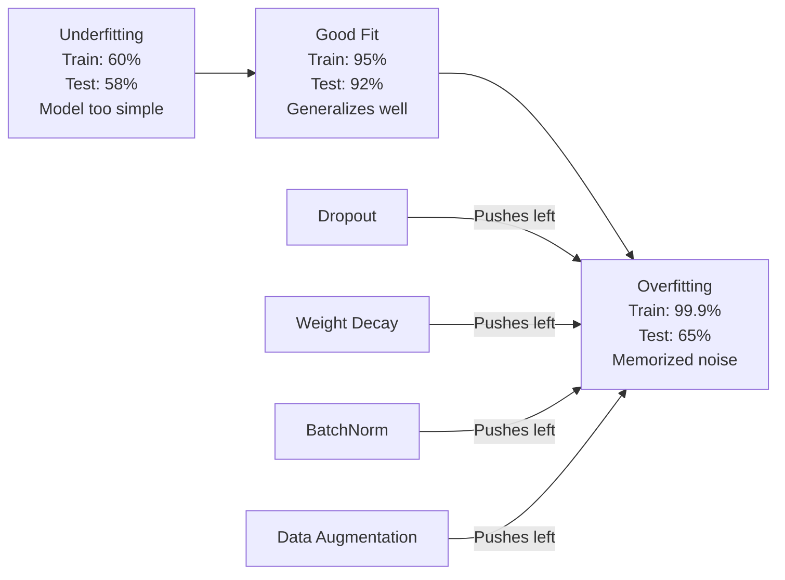
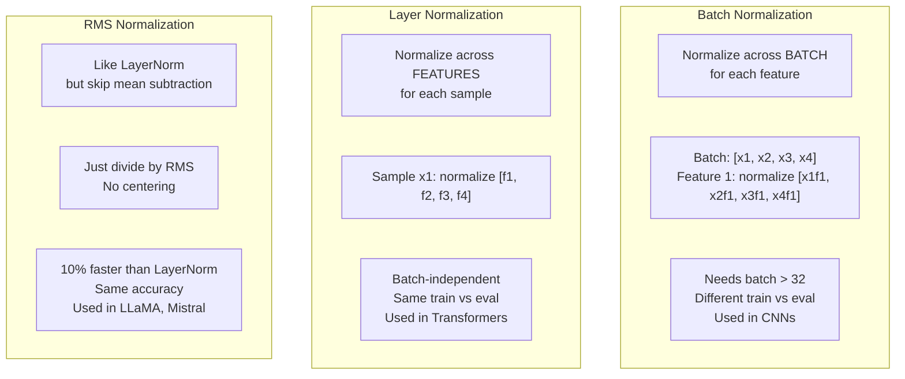
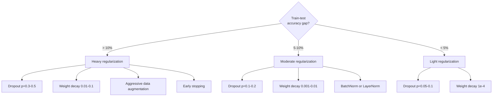

# Düzenleme

> Modeliniz eğitim verilerinden %99, test verilerinden ise %60 alır. Öğrenmek yerine ezberledi. Düzenleme, genellemeyi zorlamak için karmaşıklığa uyguladığınız vergidir.

**Tür:** Yapım
**Diller:** Python
**Önkoşullar:** Ders 03.06 (Optimize Ediciler)
**Süre:** ~75 dakika

## Öğrenme Hedefleri

- Ters ölçeklendirme, L2 ağırlık azalması, toplu normalleştirme, katman normalleştirme ve RMSNorm'u sıfırdan kullanarak bırakmayı uygulayın
- Tren-test doğruluk farkını ölçün ve düzenlileştirme deneylerini kullanarak aşırı uyumu teşhis edin
- transformer'lerin neden BatchNorm yerine LayerNorm kullandığını ve modern LLM'lerin neden RMSNorm'u tercih ettiğini açıklayın
- Aşırı uyumun ciddiyetine bağlı olarak doğru düzenleme teknikleri kombinasyonunu uygulayın

## Sorun

Yeterli parametreye sahip bir neural network, herhangi bir dataset'yi ezberleyebilir. Bu bir varsayım değil - Zhang ve ark. (2017), standart ağları ImageNet üzerinde rastgele etiketlerle eğiterek bunu kanıtladı. Ağlar tamamen rastgele etiket atamalarında sıfıra yakın eğitim kaybına ulaştı. Bir milyon rastgele girdi-çıktı çiftini, öğrenecek hiçbir kalıp olmadan ezberlediler. Eğitim kaybı mükemmeldi. Test doğruluğu sıfırdı.

Bu aşırı uyum sorunudur ve modeller büyüdükçe daha da kötüleşir. GPT-3'ün 175 milyar parametresi var. Eğitim setinde yaklaşık 500 milyar token bulunmaktadır. Bu kadar çok parametreyle model, eğitim verilerinin önemli parçalarını kelimesi kelimesine ezberlemek için yeterli kapasiteye sahiptir. Düzenlileştirme olmadan, genelleştirilebilir kalıpları öğrenmek yerine yalnızca eğitim örneklerini yeniden ortaya çıkarır.

Eğitim performansı ile test performansı arasındaki boşluk aşırı uyum boşluğudur. Bu dersteki her teknik bu boşluğa farklı bir açıdan saldırıyor. Bırakma, ağı herhangi bir nörona güvenmemeye zorlar. Ağırlık kaybı herhangi bir ağırlığın çok fazla büyümesini engeller. Toplu normalleştirme, kayıp manzarasını düzelterek optimize edicinin daha düz, daha genelleştirilebilir minimumlar bulmasını sağlar. Katman normalleştirmesi de aynı şeyi yapar ancak toplu normalleştirmenin başarısız olduğu durumlarda çalışır (küçük gruplar, değişken uzunluklu diziler). RMSNorm, ortalama hesaplamayı düşürerek bunu %10 daha hızlı yapar. Her teknik basittir. Hepsi birlikte ezberleyen bir model ile genelleyen bir model arasındaki farkı oluşturur.

## Konsept

### Aşırı Uyum Spektrumu

Her model, yetersiz uyumdan (deseni yakalamak için çok basit) aşırı uyumdan (gürültüyü yakalayacak kadar karmaşık) kadar bir spektrumda bir yerde bulunur. Tatlı nokta bu ikisinin arasındadır ve düzenlilik, modelleri aşırı uyum yönünden ona doğru iter.



### Bırakma

En zarif yorumla en basit düzenleme tekniği. Eğitim sırasında, her nöronun çıktısını p olasılığıyla rastgele sıfıra ayarlayın.

```
output = activation(z) * mask    where mask[i] ~ Bernoulli(1 - p)
```

P = 0,5 ile her ileri geçişte nöronların yarısı sıfırlanır. Ağın yedek temsilleri öğrenmesi gerekir çünkü hangi nöronların kullanılabilir olacağını tahmin edemez. Bu, ortak adaptasyonu (nöronların mevcut olan diğer belirli nöronlara güvenmeyi öğrenmesini) önler.

Topluluk yorumu: N nöronlu ve bırakılmış bir ağ, 2^N olası alt ağ oluşturur (nöronların her kombinasyonu açık veya kapalıdır). Bırakma ile eğitim, her biri farklı mini gruplarda olmak üzere yaklaşık olarak 2 ^ N alt ağın tamamını aynı anda eğitir. Test zamanında, tüm nöronları kullanırsınız (bırakma yok) ve eğitim sırasında beklenen değerle eşleşecek şekilde çıktıları (1 - p) ölçeklendirirsiniz. Bu, tek bir modelden devasa bir topluluk olan 2^N alt ağın tahminlerinin ortalamasının alınmasına eşdeğerdir.

Uygulamada, ölçeklendirme test yerine eğitim sırasında uygulanır (tersine çevrilmiş bırakma):

```
During training:  output = activation(z) * mask / (1 - p)
During testing:   output = activation(z)   (no change needed)
```

Bu daha temizdir çünkü test kodunun bırakma hakkında hiçbir şey bilmesine gerek yoktur.

Varsayılan oranlar: transformer'ler için p = 0,1, MLP'ler için p = 0,5, CNN'ler için p = 0,2-0,3. Daha yüksek ayrılma = daha güçlü düzenleme = daha fazla yetersiz uyum riski.

### Ağırlık Azalması (L2 Düzenlenmesi)

Tüm ağırlıkların kare büyüklüğünü kayba ekleyin:

```
total_loss = task_loss + (lambda / 2) * sum(w_i^2)
```

Düzenlileştirme teriminin gradient'si lambda * w'dir. Bu, her adımda her ağırlığın, büyüklüğüyle orantılı bir kesir oranında sıfıra doğru küçültülmesi anlamına gelir. Büyük ağırlıklar daha fazla cezalandırılır. Model, tek bir ağırlığın hakim olmadığı çözümlere doğru itilmektedir.

Bu neden genellemeye yardımcı oluyor: Aşırı uyum modelleri, eğitim verilerindeki gürültüyü artıran büyük ağırlıklara sahip olma eğilimindedir. Ağırlık azalması, ağırlıkları küçük tutar, bu da modelin etkili kapasitesini sınırlar ve onu ezberlenmiş tuhaflıklar yerine sağlam, genelleştirilebilir özelliklere güvenmeye zorlar.

Lambda hiperparametresi gücü kontrol eder. Tipik değerler:

- transformer'lerde AdamW için 0,01
- CNN'lerde SGD için 1e-4
- Aşırı uygun modeller için 0,1

Ders 06'da tartışıldığı gibi: ağırlık azalması ve L2 düzenlemesi SGD'de eşdeğerdir ancak Adam'da değildir. Adam'la antrenman yaparken daima AdamW'yi (bağlantısız ağırlık kaybı) kullanın.

### Toplu Normalleştirme

Bir sonraki katmana geçirmeden önce mini gruptaki her katmanın çıktısını normalleştirin.

Bazı katmanlardaki mini toplu aktivasyonlar için:

```
mu = (1/B) * sum(x_i)           (batch mean)
sigma^2 = (1/B) * sum((x_i - mu)^2)   (batch variance)
x_hat = (x_i - mu) / sqrt(sigma^2 + eps)   (normalize)
y = gamma * x_hat + beta        (scale and shift)
```

Gama ve beta, eğer optimalse, ağın normalleştirmeyi geri almasına olanak tanıyan öğrenilebilir parametrelerdir. Bunlar olmasaydı, her katmanın çıktısını sıfır ortalamalı birim varyansa zorlardınız, bu da ağın istediği şey olmayabilir.

**Eğitim ve inference ayrımı:** Eğitim sırasında mu ve sigma mevcut mini gruptan gelir. inference sırasında, antrenman sırasında biriken koşu ortalamalarını kullanırsınız (momentumlu üstel hareketli ortalama = 0,1, yani %90 eski + %10 yeni).

BatchNorm'un neden çalıştığı hala tartışılıyor. Orijinal makale, "dahili ortak değişken kaymasını" (önceki katmanlar güncellendikçe katman girdilerinin dağılımının değiştiğini) azalttığını iddia etti. Santurkar ve ark. (2018) bu açıklamanın yanlış olduğunu gösterdi. Gerçek sebep: BatchNorm kayıp ortamını daha pürüzsüz hale getiriyor. gradient'ler daha öngörücüdür, Lipschitz sabitleri daha küçüktür ve optimize edici daha büyük adımları güvenli bir şekilde gerçekleştirebilir. BatchNorm'un daha yüksek öğrenme oranları kullanmanıza ve daha hızlı yakınsama yapmanıza olanak sağlamasının nedeni budur.

BatchNorm'un temel bir sınırlaması vardır: toplu istatistiklere bağlıdır. Parti büyüklüğü 1 ile ortalama ve varyans anlamsızdır. Küçük gruplarla (< 32) istatistikler gürültülüdür ve performansa zarar verir. Bu, nesne algılama (belleğin toplu iş boyutunu sınırladığı durumlarda) ve dil modelleme (dizi uzunluklarının değiştiği durumlarda) gibi görevler için önemlidir.

### Katman Normalleştirme

Toplu iş yerine özellikler genelinde normalleştirme yapın. Tek bir örnek için:

```
mu = (1/D) * sum(x_j)           (feature mean)
sigma^2 = (1/D) * sum((x_j - mu)^2)   (feature variance)
x_hat = (x_j - mu) / sqrt(sigma^2 + eps)
y = gamma * x_hat + beta
```

D, özellik boyutudur. Her numune bağımsız olarak normalleştirilir; parti büyüklüğüne bağlı değildir. transformer'lerin BatchNorm yerine LayerNorm kullanmasının nedeni budur. Dizilerin değişken uzunlukları vardır, parti boyutları genellikle küçüktür (veya oluşturma sırasında 1'dir) ve hesaplama, eğitim ile inference arasında aynıdır.

transformer'lerdeki LayerNorm, her kişisel dikkat bloğundan ve her ileri besleme bloğundan sonra (LN Sonrası) veya bunlardan önce (eğitim için daha kararlı olan LN Öncesi) uygulanır.

### RMSNormu

Ortalama çıkarma olmadan LayerNorm. Zhang ve Sennrich (2019) tarafından önerilmiştir.

```
rms = sqrt((1/D) * sum(x_j^2))
y = gamma * x / rms
```

İşte bu. Ortalama hesaplama yok, beta parametresi yok. Gözlem: LayerNorm'daki yeniden ortalama (ortalama çıkarma) modelin performansına çok az katkıda bulunur, ancak hesaplamaya mal olur. Çıkarılması, yaklaşık %10 daha az ek yük ile aynı doğruluğu sağlar.

LLaMA, LLaMA 2, LLaMA 3, Mistral ve çoğu modern LLM, LayerNorm yerine RMSNorm'u kullanır. Milyarlarca parametre ve trilyonlarca token ölçeğinde bu %10'luk tasarruf önemlidir.

### Normalleştirme Karşılaştırması



### Düzenlileştirme Olarak Veri Arttırma

Bir model değişikliği değil, bir veri değişikliği. Etiketleri korurken eğitim girdilerini dönüştürün:

- Görüntüler: rastgele kırpma, çevirme, döndürme, renk değişimi, kesme
- Metin: eşanlamlı değiştirme, geri çeviri, rastgele silme
- Ses: zaman uzatma, perde değiştirme, gürültü ekleme

Etki, düzenlemeyle aynıdır: eğitim setinin etkin boyutunu artırarak modelin belirli örnekleri ezberlemesini zorlaştırır. Her görüntüyü orijinal haliyle yalnızca bir kez gören bir model, onu ezberleyebilir. Her görüntünün 50 artırılmış versiyonunu gören bir model, değişmez yapıyı öğrenmek zorunda kalıyor.

### Erken Durdurma

En basit düzenleyici: doğrulama kaybı artmaya başladığında eğitimi durdurun. Model bu noktada henüz tam oturmadı. Uygulamada, doğrulama kaybını her dönemde izlersiniz, en iyi modeli kaydedersiniz ve bir "sabır" penceresi (genellikle 5-20 dönem) için eğitime devam edersiniz. Doğrulama kaybı sabır penceresi içinde düzelmezse durur ve en iyi kaydedilen modeli yüklersiniz.

### Ne Zaman Uygulanmalı Ne



```figure
l2-regularization
```

## İnşa Et

### Adım 1: Bırakma (Eğitim ve Değerlendirme Modu)

```python
import random
import math


class Dropout:
    def __init__(self, p=0.5):
        self.p = p
        self.training = True
        self.mask = None

    def forward(self, x):
        if not self.training:
            return list(x)
        self.mask = []
        output = []
        for val in x:
            if random.random() < self.p:
                self.mask.append(0)
                output.append(0.0)
            else:
                self.mask.append(1)
                output.append(val / (1 - self.p))
        return output

    def backward(self, grad_output):
        grads = []
        for g, m in zip(grad_output, self.mask):
            if m == 0:
                grads.append(0.0)
            else:
                grads.append(g / (1 - self.p))
        return grads
```

### Adım 2: L2 Ağırlık Azalması

```python
def l2_regularization(weights, lambda_reg):
    penalty = 0.0
    for w in weights:
        penalty += w * w
    return lambda_reg * 0.5 * penalty

def l2_gradient(weights, lambda_reg):
    return [lambda_reg * w for w in weights]
```

### Adım 3: Toplu Normalleştirme

```python
class BatchNorm:
    def __init__(self, num_features, momentum=0.1, eps=1e-5):
        self.gamma = [1.0] * num_features
        self.beta = [0.0] * num_features
        self.eps = eps
        self.momentum = momentum
        self.running_mean = [0.0] * num_features
        self.running_var = [1.0] * num_features
        self.training = True
        self.num_features = num_features

    def forward(self, batch):
        batch_size = len(batch)
        if self.training:
            mean = [0.0] * self.num_features
            for sample in batch:
                for j in range(self.num_features):
                    mean[j] += sample[j]
            mean = [m / batch_size for m in mean]

            var = [0.0] * self.num_features
            for sample in batch:
                for j in range(self.num_features):
                    var[j] += (sample[j] - mean[j]) ** 2
            var = [v / batch_size for v in var]

            for j in range(self.num_features):
                self.running_mean[j] = (1 - self.momentum) * self.running_mean[j] + self.momentum * mean[j]
                self.running_var[j] = (1 - self.momentum) * self.running_var[j] + self.momentum * var[j]
        else:
            mean = list(self.running_mean)
            var = list(self.running_var)

        self.x_hat = []
        output = []
        for sample in batch:
            normalized = []
            out_sample = []
            for j in range(self.num_features):
                x_h = (sample[j] - mean[j]) / math.sqrt(var[j] + self.eps)
                normalized.append(x_h)
                out_sample.append(self.gamma[j] * x_h + self.beta[j])
            self.x_hat.append(normalized)
            output.append(out_sample)
        return output
```

### Adım 4: Katman Normalleştirme

```python
class LayerNorm:
    def __init__(self, num_features, eps=1e-5):
        self.gamma = [1.0] * num_features
        self.beta = [0.0] * num_features
        self.eps = eps
        self.num_features = num_features

    def forward(self, x):
        mean = sum(x) / len(x)
        var = sum((xi - mean) ** 2 for xi in x) / len(x)

        self.x_hat = []
        output = []
        for j in range(self.num_features):
            x_h = (x[j] - mean) / math.sqrt(var + self.eps)
            self.x_hat.append(x_h)
            output.append(self.gamma[j] * x_h + self.beta[j])
        return output
```

### Adım 5: RMSNormu

```python
class RMSNorm:
    def __init__(self, num_features, eps=1e-6):
        self.gamma = [1.0] * num_features
        self.eps = eps
        self.num_features = num_features

    def forward(self, x):
        rms = math.sqrt(sum(xi * xi for xi in x) / len(x) + self.eps)
        output = []
        for j in range(self.num_features):
            output.append(self.gamma[j] * x[j] / rms)
        return output
```

### Adım 6: Düzenlileştirmeli ve Düzenlemesiz Eğitim

```python
def sigmoid(x):
    x = max(-500, min(500, x))
    return 1.0 / (1.0 + math.exp(-x))


def make_circle_data(n=200, seed=42):
    random.seed(seed)
    data = []
    for _ in range(n):
        x = random.uniform(-2, 2)
        y = random.uniform(-2, 2)
        label = 1.0 if x * x + y * y < 1.5 else 0.0
        data.append(([x, y], label))
    return data


class RegularizedNetwork:
    def __init__(self, hidden_size=16, lr=0.05, dropout_p=0.0, weight_decay=0.0):
        random.seed(0)
        self.hidden_size = hidden_size
        self.lr = lr
        self.dropout_p = dropout_p
        self.weight_decay = weight_decay
        self.dropout = Dropout(p=dropout_p) if dropout_p > 0 else None

        self.w1 = [[random.gauss(0, 0.5) for _ in range(2)] for _ in range(hidden_size)]
        self.b1 = [0.0] * hidden_size
        self.w2 = [random.gauss(0, 0.5) for _ in range(hidden_size)]
        self.b2 = 0.0

    def forward(self, x, training=True):
        self.x = x
        self.z1 = []
        self.h = []
        for i in range(self.hidden_size):
            z = self.w1[i][0] * x[0] + self.w1[i][1] * x[1] + self.b1[i]
            self.z1.append(z)
            self.h.append(max(0.0, z))

        if self.dropout and training:
            self.dropout.training = True
            self.h = self.dropout.forward(self.h)
        elif self.dropout:
            self.dropout.training = False
            self.h = self.dropout.forward(self.h)

        self.z2 = sum(self.w2[i] * self.h[i] for i in range(self.hidden_size)) + self.b2
        self.out = sigmoid(self.z2)
        return self.out

    def backward(self, target):
        eps = 1e-15
        p = max(eps, min(1 - eps, self.out))
        d_loss = -(target / p) + (1 - target) / (1 - p)
        d_sigmoid = self.out * (1 - self.out)
        d_out = d_loss * d_sigmoid

        for i in range(self.hidden_size):
            d_relu = 1.0 if self.z1[i] > 0 else 0.0
            d_h = d_out * self.w2[i] * d_relu
            self.w2[i] -= self.lr * (d_out * self.h[i] + self.weight_decay * self.w2[i])
            for j in range(2):
                self.w1[i][j] -= self.lr * (d_h * self.x[j] + self.weight_decay * self.w1[i][j])
            self.b1[i] -= self.lr * d_h
        self.b2 -= self.lr * d_out

    def evaluate(self, data):
        correct = 0
        total_loss = 0.0
        for x, y in data:
            pred = self.forward(x, training=False)
            eps = 1e-15
            p = max(eps, min(1 - eps, pred))
            total_loss += -(y * math.log(p) + (1 - y) * math.log(1 - p))
            if (pred >= 0.5) == (y >= 0.5):
                correct += 1
        return total_loss / len(data), correct / len(data) * 100

    def train_model(self, train_data, test_data, epochs=300):
        history = []
        for epoch in range(epochs):
            total_loss = 0.0
            correct = 0
            for x, y in train_data:
                pred = self.forward(x, training=True)
                self.backward(y)
                eps = 1e-15
                p = max(eps, min(1 - eps, pred))
                total_loss += -(y * math.log(p) + (1 - y) * math.log(1 - p))
                if (pred >= 0.5) == (y >= 0.5):
                    correct += 1
            train_loss = total_loss / len(train_data)
            train_acc = correct / len(train_data) * 100
            test_loss, test_acc = self.evaluate(test_data)
            history.append((train_loss, train_acc, test_loss, test_acc))
            if epoch % 75 == 0 or epoch == epochs - 1:
                gap = train_acc - test_acc
                print(f"    Epoch {epoch:3d}: train_acc={train_acc:.1f}%, test_acc={test_acc:.1f}%, gap={gap:.1f}%")
        return history
```

## Kullan onu

PyTorch tüm normalleştirme ve düzenlemeleri modüller halinde sağlar:

```python
import torch
import torch.nn as nn

model = nn.Sequential(
    nn.Linear(784, 256),
    nn.BatchNorm1d(256),
    nn.ReLU(),
    nn.Dropout(0.3),
    nn.Linear(256, 128),
    nn.BatchNorm1d(128),
    nn.ReLU(),
    nn.Dropout(0.3),
    nn.Linear(128, 10),
)

model.train()
out_train = model(torch.randn(32, 784))

model.eval()
out_test = model(torch.randn(1, 784))
```

`model.train()` / `model.eval()` geçişi kritik öneme sahiptir. Bırakmayı açar/kapatır ve BatchNorm'a toplu istatistikleri ve çalışma istatistiklerini kullanmasını söyler. inference'den önce `model.eval()`'yi unutmak, deep learning'deki en yaygın hatalardan biridir. Bırakma hala etkin olduğundan ve BatchNorm mini toplu istatistikleri kullandığından test doğruluğunuz rastgele dalgalanacaktır.

transformer'ler için desen farklıdır:

```python
class TransformerBlock(nn.Module):
    def __init__(self, d_model=512, nhead=8, dropout=0.1):
        super().__init__()
        self.attention = nn.MultiheadAttention(d_model, nhead, dropout=dropout)
        self.norm1 = nn.LayerNorm(d_model)
        self.ff = nn.Sequential(
            nn.Linear(d_model, d_model * 4),
            nn.GELU(),
            nn.Linear(d_model * 4, d_model),
            nn.Dropout(dropout),
        )
        self.norm2 = nn.LayerNorm(d_model)
        self.dropout = nn.Dropout(dropout)

    def forward(self, x):
        attended, _ = self.attention(x, x, x)
        x = self.norm1(x + self.dropout(attended))
        x = self.norm2(x + self.ff(x))
        return x
```

BatchNorm değil, LayerNorm. Bırakma p=0,1, p=0,5 değil. Bunlar transformer varsayılanlarıdır.

## Gönderin

Bu ders şunları üretir:
- `outputs/prompt-regularization-advisor.md` — aşırı uyumu teşhis eden ve doğru düzenleme stratejisini öneren bir prompt

## Egzersizler

1. 2B veriler için uzamsal bırakma uygulayın: tek tek nöronları bırakmak yerine, özellik kanallarının tamamını bırakın. Ardışık özellik gruplarını kanal olarak ele alarak ve tüm grupları bırakarak bunu simüle edin. Tren-test açığını dataset çemberindeki gizli_size=32 ile standart bırakma ile karşılaştırın.

2. Ders 05'teki etiket düzeltmeyi bu dersten ayrılmayla birlikte uygulayın. Dört yapılandırmayla eğitim alın: hiçbiri, yalnızca bırakma, yalnızca etiket yumuşatma, her ikisi de. Her biri için son tren-test doğruluk boşluğunu ölçün. Hangi kombinasyon en küçük boşluğu verir?

3. Gizli katman ile Circle-dataset ağınızdaki aktivasyon arasına bir BatchNorm katmanı ekleyin. BatchNorm ile ve BatchNorm olmadan 0,01, 0,05 ve 0,1 öğrenme oranlarında eğitim alın. BatchNorm, vanilya ağının farklılaştığı yerlerde daha yüksek öğrenme oranlarında istikrarlı eğitime izin vermelidir.

4. Erken durdurmayı uygulayın: her dönemde test kaybını takip edin, en iyi ağırlıkları kaydedin ve test kaybı 20 dönem boyunca iyileşmediyse durun. Düzenli ağı 1000 dönem boyunca çalıştırın. Hangi dönemin en iyi test doğruluğuna sahip olduğunu ve kaç hesaplama dönemi kaydettiğinizi bildirin.

5. 4 katmanlı bir ağda (yalnızca 2 değil) LayerNorm ile RMSNorm'u karşılaştırın. Her ikisini de aynı ağırlıklarla başlatın. 200 dönem boyunca eğitim alın ve ilk katmandaki nihai doğruluğu, eğitim hızını (dönem başına süre) ve gradient büyüklüklerini karşılaştırın. RMSNorm'un aynı doğrulukla daha hızlı olduğunu doğrulayın.

## Anahtar Terimler

| Dönem | İnsanlar ne diyor | Aslında ne anlama geliyor |
|------|----------------|----------------------|
| Aşırı uyum | "Model verileri ezberledi" | Bir modelin eğitim performansı, test performansını önemli ölçüde aştığında, bu onun sinyal yerine gürültüyü öğrendiğini gösterir |
| Düzenleme | "Aşırı uyumu önleme" | Genelleştirmeyi geliştirmek için model karmaşıklığını kısıtlayan herhangi bir teknik: çıkarma, ağırlık azalması, normalleştirme, büyütme |
| Bırakma | "Rastgele nöron silme" | Eğitim sırasında p olasılığı ile rastgele nöronların sıfırlanması, gereksiz temsillerin zorlanması; bir topluluk yetiştirmeye eşdeğer |
| Ağırlık azalması | "L2 cezası" | Her adımda lambda * w çıkarılarak tüm ağırlıklar sıfıra doğru küçültülür; karmaşıklığı ağırlık büyüklüğüyle cezalandırıyor |
| Toplu normalleştirme | "Toplu iş başına normalleştir" | inference |
| Katman normalleştirme | "Örnek başına normalleştir" | Her numunedeki özellikler arasında normalleştirme; partiden bağımsız, parti boyutunun değiştiği transformer'lerde kullanılır |
| RMSNormu | "Anlamı olmayan LayerNorm" | Kök ortalama kare normalizasyonu; eşit doğrulukta %10 hızlanma için LayerNorm'dan ortalama çıkarma oranını düşürür |
| Erken durdurma | "Fazla donatmadan önce dur" | Doğrulama kaybının iyileşmesi durduğunda eğitimin durdurulması; genellikle diğerleriyle birlikte kullanılan en basit düzenleyici |
| Veri artırma | "Daha az kaynaktan daha fazla veri" | Etkili dataset boyutunu artırmak ve değişmezlik öğrenimini zorlamak için eğitim girdilerini (çevirme, kırpma, gürültü) dönüştürme |
| Genelleme farkı | "Tren-test ayrımı" | Eğitim ve test performansı arasındaki fark; düzenleme bu açığı en aza indirmeyi amaçlıyor |

## Daha Fazla Okuma

- Srivastava ve diğerleri, "Bırakma: Neural Network'lerin Aşırı Uyumunu Önlemenin Basit Bir Yolu" (2014) -- topluluk yorumu ve kapsamlı deneyler içeren orijinal bırakma makalesi
- Ioffe & Szegedy, "Toplu Normalleştirme: Dahili Ortak Değişken Kaymasını Azaltarak Derin Ağ Eğitimini Hızlandırma" (2015) - en çok alıntı yapılan deep learning makalelerinden biri olan BatchNorm'u ve onun eğitim prosedürünü tanıttı
- Zhang ve Sennrich, "Root Mean Square Layer Normalization" (2019) -- RMSNorm'un daha az hesaplamayla LayerNorm doğruluğuyla eşleştiğini gösterdi; LLaMA ve Mistral tarafından benimsendi
- Zhang ve diğerleri, "Deep Learning'yi Anlamak Genellemeyi Yeniden Düşünmeyi Gerektirir" (2017) -- neural network'lerin rastgele etiketleri ezberleyebildiğini ve geleneksel genelleme görüşlerine meydan okuduğunu gösteren dönüm noktası niteliğindeki makale
