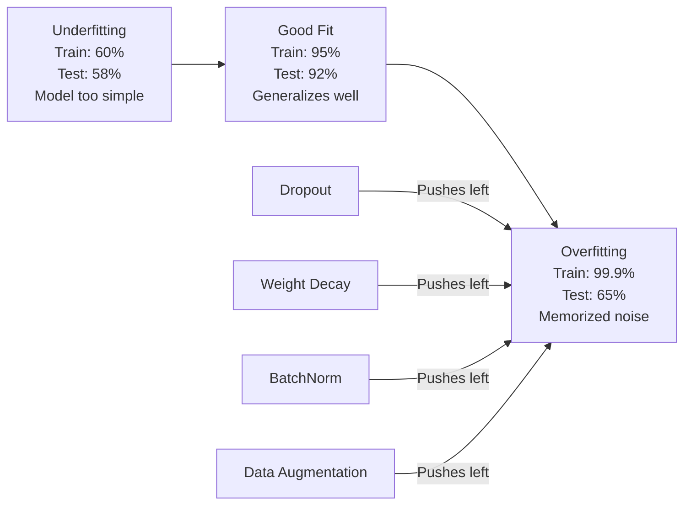
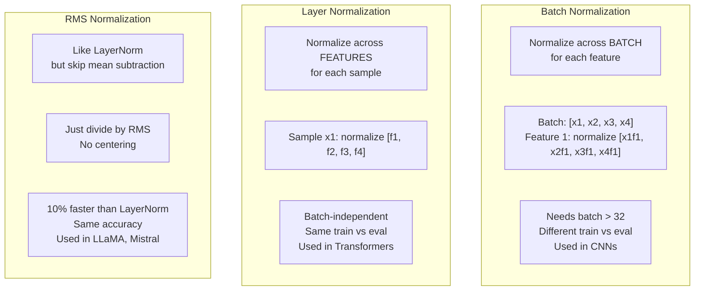
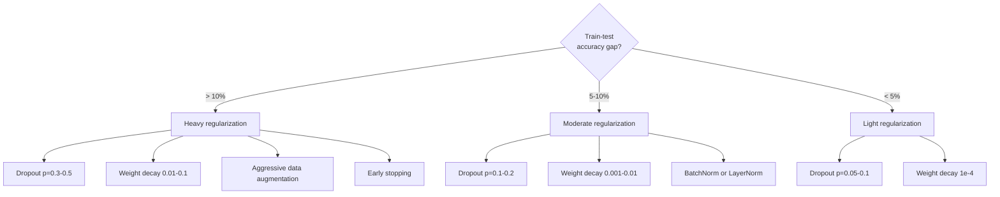

# 正则化

> 您的模型获得99%的训练数据，60%的测试数据。它是记忆而不是学习。规范化是对复杂性征收的税，以迫使概括化。

** 类型：** 构建
** 语言：** Python
** 先决条件：** 第03.06课（优化器）
** 时间：** ~75分钟

## 学习目标

- 从头开始通过反向缩放、L2权重衰减、批规范化、层规范化和RMSNorm实现dropout
- 测量训练测试准确性差距并使用正规化实验诊断过度匹配
- 解释为什么变压器使用LayerNorm而不是BatchNorm以及为什么现代LLC更喜欢RMSNorm
- 根据过拟合的严重程度应用正则化技术的正确组合

## 问题

具有足够参数的神经网络可以记住任何数据集。这不是一个假设- Zhang et al.（2017）通过在ImageNet上使用随机标签训练标准网络来证明这一点。网络在完全随机的标签分配上达到了接近零的训练损失。他们记住了一百万个随机的输入输出对，没有模式可学。训练损失是完美的。测试准确性为零。

这就是过度匹配的问题，随着模型变得更大，问题变得更糟。GPT-3具有1750亿个参数。训练集拥有约5000亿个代币。有了这么多参数，该模型就有足够的容量逐字记忆训练数据的重要部分。如果没有正则化，它只会重复训练示例，而不是学习可推广的模式。

训练表现和测试表现之间的差距是过度匹配的差距。本课中的每一项技术都从不同的角度攻击该差距。辍学迫使网络不依赖任何单个神经元。重量衰减可以防止任何单一重量变得太大。批量规范化可以平滑损失情况，以便优化器找到更平坦、更通用的最小值。层规范化也能起到同样的作用，但适用于批量规范化失败的情况（小批量、变长序列）。RMSNorm通过放弃平均值计算，速度提高了10%。每种技术都很简单。总而言之，它们就是记忆模型和概括模型之间的区别。

## 概念

### 过度匹配光谱

每个模型都位于从欠拟合（太简单而无法捕获模式）到过拟合（太复杂而无法捕获噪声）的频谱上。最佳点位于两者之间，正则化将模型从过拟合侧推向最佳点。



### 辍学

最简单的正规化技术和最优雅的解释。在训练过程中，以概率p随机将每个神经元的输出设置为零。

```
output = activation(z) * mask    where mask[i] ~ Bernoulli(1 - p)
```

当p = 0.5时，一半的神经元在每次向前传递时都会归零。网络必须学习冗余表示，因为它无法预测哪些神经元将可用。这阻止了共适应--神经元学习依赖存在的特定其他神经元。

整体解释：具有N个神经元和脱落的网络创建2 ' N个可能的子网络（神经元打开或关闭的每一个组合）。有丢失的训练大约同时训练所有2 ' N个子网络，每个子网络以不同的小批量进行。在测试时，您使用所有神经元（无脱落）并按（1 - p）缩放输出以匹配训练期间的预期值。这相当于对2 ' N个子网络的预测进行平均--来自单个模型的庞大集合。

在实践中，缩放是在训练期间应用的，而不是测试（倒置脱落）：

```
During training:  output = activation(z) * mask / (1 - p)
During testing:   output = activation(z)   (no change needed)
```

这更清晰，因为测试代码根本不需要知道丢失。

默认率：变压器p = 0.1，MLP p = 0.5，CNN p = 0.2-0.3。辍学率越高=正规化越强=不适合的风险越大。

### L2正则化（L2 Regularization）

将所有权重的平方与损失相加：

```
total_loss = task_loss + (lambda / 2) * sum(w_i^2)
```

正规化项的梯度为lambda * w。这意味着在每一步，每个权重都会缩小到与其大小成比例的分数。重物较多受到惩罚。该模型被推向没有单一权重占主导地位的解决方案。

为什么这有助于概括：过适应模型往往具有较大的权重，从而放大训练数据中的噪音。重量衰减使权重保持较小，这限制了模型的有效容量，并迫使它依赖于稳健、可概括的特征，而不是记忆的怪癖。

Lambda超参数控制强度。典型值：

- 0.01关于变形金刚的AdamW
- CNN上的新元为1 e-4
- 0.1对于严重过拟合的模型

正如第06课中讨论的那样：权重衰减和L2正规化在Singapore中等效，但在Adam中则不然。与Adam一起训练时，始终使用AdamW（脱钩体重衰减）。

### 批次归一化

在将其传递到下一层之前，在minibatch中规范化每一层的输出。

对于某个层的小批量激活：

```
mu = (1/B) * sum(x_i)           (batch mean)
sigma^2 = (1/B) * sum((x_i - mu)^2)   (batch variance)
x_hat = (x_i - mu) / sqrt(sigma^2 + eps)   (normalize)
y = gamma * x_hat + beta        (scale and shift)
```

Gamma和Beta是可学习的参数，如果最佳，网络可以撤销正规化。如果没有它们，您将迫使每个层的输出都为零均值单位方差，这可能不是网络想要的。

** 训练与推理拆分：** 训练期间，μ和西格玛来自当前的迷你批处理。在推理过程中，您使用训练期间积累的跑步平均值（动量= 0.1的指数移动平均值，意味着90%旧+ 10%新）。

BatchNorm为何有效仍存在争议。原始论文声称它减少了“内部协变量漂移”（层输入的分布随着早期层更新而变化）。Santurkar等人（2018）表明这种解释是错误的。实际原因：BatchNorm使损失情况变得更平稳。梯度更具预测性，Lipschitz常数更小，优化器可以安全地采取更大的步骤。这就是为什么BatchNorm让您使用更高的学习率并更快地收敛。

BatchNorm有一个根本的局限性：它取决于批统计数据。对于批量大小为1，平均值和方差毫无意义。对于小批量（< 32），统计数据会带来干扰并损害性能。这对于对象检测（内存限制批量大小）和语言建模（序列长度不同）等任务很重要。

### 层规范化

跨功能而不是跨批次规范化。对于单个样本：

```
mu = (1/D) * sum(x_j)           (feature mean)
sigma^2 = (1/D) * sum((x_j - mu)^2)   (feature variance)
x_hat = (x_j - mu) / sqrt(sigma^2 + eps)
y = gamma * x_hat + beta
```

D是特征维度。每个样本都独立标准化--不依赖批量大小。这就是为什么变压器使用LayerNorm而不是BatchNorm。序列长度可变，批量大小通常很小（或生成期间为1），并且训练和推理之间的计算相同。

变压器中的LayerNorm应用于每个自我注意块和每个前向块（Post-LN）之后，或在它们之前（Pre-LN，对于训练来说更稳定）。

### RMSNorm

不含平均值减法的LayerNorm。由Zhang和Sennrich（2019）提出。

```
rms = sqrt((1/D) * sum(x_j^2))
y = gamma * x / rms
```

就是这样。没有平均计算，没有Beta参数。观察结果：LayerNorm中的重新定中心（均值减法）对模型的性能贡献很小，但计算成本很高。删除它可以提供相同的准确性，并减少约10%的费用。

LLaMA、LLaMA 2、LLaMA 3、Mistral和大多数现代LL使用RMSNorm而不是LayerNorm。从数十亿个参数和数万亿个代币的规模来看，10%的节省是非常重要的。

### 规范化比较



### 数据增强作为规则化

不是模型修改，而是数据修改。转换训练输入，同时保留标签：

- 图像：随机裁剪、翻转、旋转、颜色抖动、剪切
- 文本：同义词替换、回译、随机删除
- 音频：时间延伸、音调变化、噪音添加

其效果与正规化相同：它增加了训练集的有效大小，使模型更难记住特定的示例。一个只以原始形式看到每张图像一次的模型可以记住它。一个看到每张图像50个增强版本的模型被迫学习不变结构。

### 提前停止

最简单的规则化器：当验证损失开始增加时停止训练。该模型目前还没有过度适应。在实践中，您会跟踪每个时期的验证损失，保存最佳模型，并继续训练“耐心”窗口（通常为5-20个时期）。如果验证损失在耐心窗口内没有改善，则停止并加载保存的最佳模型。

### 何时应用什么



## 建设党

### 第1步：辍学（火车和评估模式）

```python
import random
import math


class Dropout:
    def __init__(self, p=0.5):
        self.p = p
        self.training = True
        self.mask = None

    def forward(self, x):
        if not self.training:
            return list(x)
        self.mask = []
        output = []
        for val in x:
            if random.random() < self.p:
                self.mask.append(0)
                output.append(0.0)
            else:
                self.mask.append(1)
                output.append(val / (1 - self.p))
        return output

    def backward(self, grad_output):
        grads = []
        for g, m in zip(grad_output, self.mask):
            if m == 0:
                grads.append(0.0)
            else:
                grads.append(g / (1 - self.p))
        return grads
```

### 第2步：L2体重下降

```python
def l2_regularization(weights, lambda_reg):
    penalty = 0.0
    for w in weights:
        penalty += w * w
    return lambda_reg * 0.5 * penalty

def l2_gradient(weights, lambda_reg):
    return [lambda_reg * w for w in weights]
```

### 第3步：批量规范化

```python
class BatchNorm:
    def __init__(self, num_features, momentum=0.1, eps=1e-5):
        self.gamma = [1.0] * num_features
        self.beta = [0.0] * num_features
        self.eps = eps
        self.momentum = momentum
        self.running_mean = [0.0] * num_features
        self.running_var = [1.0] * num_features
        self.training = True
        self.num_features = num_features

    def forward(self, batch):
        batch_size = len(batch)
        if self.training:
            mean = [0.0] * self.num_features
            for sample in batch:
                for j in range(self.num_features):
                    mean[j] += sample[j]
            mean = [m / batch_size for m in mean]

            var = [0.0] * self.num_features
            for sample in batch:
                for j in range(self.num_features):
                    var[j] += (sample[j] - mean[j]) ** 2
            var = [v / batch_size for v in var]

            for j in range(self.num_features):
                self.running_mean[j] = (1 - self.momentum) * self.running_mean[j] + self.momentum * mean[j]
                self.running_var[j] = (1 - self.momentum) * self.running_var[j] + self.momentum * var[j]
        else:
            mean = list(self.running_mean)
            var = list(self.running_var)

        self.x_hat = []
        output = []
        for sample in batch:
            normalized = []
            out_sample = []
            for j in range(self.num_features):
                x_h = (sample[j] - mean[j]) / math.sqrt(var[j] + self.eps)
                normalized.append(x_h)
                out_sample.append(self.gamma[j] * x_h + self.beta[j])
            self.x_hat.append(normalized)
            output.append(out_sample)
        return output
```

### 步骤4：层规格化

```python
class LayerNorm:
    def __init__(self, num_features, eps=1e-5):
        self.gamma = [1.0] * num_features
        self.beta = [0.0] * num_features
        self.eps = eps
        self.num_features = num_features

    def forward(self, x):
        mean = sum(x) / len(x)
        var = sum((xi - mean) ** 2 for xi in x) / len(x)

        self.x_hat = []
        output = []
        for j in range(self.num_features):
            x_h = (x[j] - mean) / math.sqrt(var + self.eps)
            self.x_hat.append(x_h)
            output.append(self.gamma[j] * x_h + self.beta[j])
        return output
```

### 第5步：RMSNorm

```python
class RMSNorm:
    def __init__(self, num_features, eps=1e-6):
        self.gamma = [1.0] * num_features
        self.eps = eps
        self.num_features = num_features

    def forward(self, x):
        rms = math.sqrt(sum(xi * xi for xi in x) / len(x) + self.eps)
        output = []
        for j in range(self.num_features):
            output.append(self.gamma[j] * x[j] / rms)
        return output
```

### 第6步：有和没有正规化的培训

```python
def sigmoid(x):
    x = max(-500, min(500, x))
    return 1.0 / (1.0 + math.exp(-x))


def make_circle_data(n=200, seed=42):
    random.seed(seed)
    data = []
    for _ in range(n):
        x = random.uniform(-2, 2)
        y = random.uniform(-2, 2)
        label = 1.0 if x * x + y * y < 1.5 else 0.0
        data.append(([x, y], label))
    return data


class RegularizedNetwork:
    def __init__(self, hidden_size=16, lr=0.05, dropout_p=0.0, weight_decay=0.0):
        random.seed(0)
        self.hidden_size = hidden_size
        self.lr = lr
        self.dropout_p = dropout_p
        self.weight_decay = weight_decay
        self.dropout = Dropout(p=dropout_p) if dropout_p > 0 else None

        self.w1 = [[random.gauss(0, 0.5) for _ in range(2)] for _ in range(hidden_size)]
        self.b1 = [0.0] * hidden_size
        self.w2 = [random.gauss(0, 0.5) for _ in range(hidden_size)]
        self.b2 = 0.0

    def forward(self, x, training=True):
        self.x = x
        self.z1 = []
        self.h = []
        for i in range(self.hidden_size):
            z = self.w1[i][0] * x[0] + self.w1[i][1] * x[1] + self.b1[i]
            self.z1.append(z)
            self.h.append(max(0.0, z))

        if self.dropout and training:
            self.dropout.training = True
            self.h = self.dropout.forward(self.h)
        elif self.dropout:
            self.dropout.training = False
            self.h = self.dropout.forward(self.h)

        self.z2 = sum(self.w2[i] * self.h[i] for i in range(self.hidden_size)) + self.b2
        self.out = sigmoid(self.z2)
        return self.out

    def backward(self, target):
        eps = 1e-15
        p = max(eps, min(1 - eps, self.out))
        d_loss = -(target / p) + (1 - target) / (1 - p)
        d_sigmoid = self.out * (1 - self.out)
        d_out = d_loss * d_sigmoid

        for i in range(self.hidden_size):
            d_relu = 1.0 if self.z1[i] > 0 else 0.0
            d_h = d_out * self.w2[i] * d_relu
            self.w2[i] -= self.lr * (d_out * self.h[i] + self.weight_decay * self.w2[i])
            for j in range(2):
                self.w1[i][j] -= self.lr * (d_h * self.x[j] + self.weight_decay * self.w1[i][j])
            self.b1[i] -= self.lr * d_h
        self.b2 -= self.lr * d_out

    def evaluate(self, data):
        correct = 0
        total_loss = 0.0
        for x, y in data:
            pred = self.forward(x, training=False)
            eps = 1e-15
            p = max(eps, min(1 - eps, pred))
            total_loss += -(y * math.log(p) + (1 - y) * math.log(1 - p))
            if (pred >= 0.5) == (y >= 0.5):
                correct += 1
        return total_loss / len(data), correct / len(data) * 100

    def train_model(self, train_data, test_data, epochs=300):
        history = []
        for epoch in range(epochs):
            total_loss = 0.0
            correct = 0
            for x, y in train_data:
                pred = self.forward(x, training=True)
                self.backward(y)
                eps = 1e-15
                p = max(eps, min(1 - eps, pred))
                total_loss += -(y * math.log(p) + (1 - y) * math.log(1 - p))
                if (pred >= 0.5) == (y >= 0.5):
                    correct += 1
            train_loss = total_loss / len(train_data)
            train_acc = correct / len(train_data) * 100
            test_loss, test_acc = self.evaluate(test_data)
            history.append((train_loss, train_acc, test_loss, test_acc))
            if epoch % 75 == 0 or epoch == epochs - 1:
                gap = train_acc - test_acc
                print(f"    Epoch {epoch:3d}: train_acc={train_acc:.1f}%, test_acc={test_acc:.1f}%, gap={gap:.1f}%")
        return history
```

## 使用它

PyTorch将所有规范化和正规化作为模块提供：

```python
import torch
import torch.nn as nn

model = nn.Sequential(
    nn.Linear(784, 256),
    nn.BatchNorm1d(256),
    nn.ReLU(),
    nn.Dropout(0.3),
    nn.Linear(256, 128),
    nn.BatchNorm1d(128),
    nn.ReLU(),
    nn.Dropout(0.3),
    nn.Linear(128, 10),
)

model.train()
out_train = model(torch.randn(32, 784))

model.eval()
out_test = model(torch.randn(1, 784))
```

' model.train（）'/' model.eval（）'切换至关重要。它打开/关闭dropout，并告诉BatchNorm使用批统计数据与运行统计数据。在推理之前忘记“modal.eval（）”是深度学习中最常见的错误之一。您的测试准确性将随机波动，因为dropout仍然处于活动状态，并且BatchNorm正在使用迷你批统计数据。

对于变形金刚来说，模式有所不同：

```python
class TransformerBlock(nn.Module):
    def __init__(self, d_model=512, nhead=8, dropout=0.1):
        super().__init__()
        self.attention = nn.MultiheadAttention(d_model, nhead, dropout=dropout)
        self.norm1 = nn.LayerNorm(d_model)
        self.ff = nn.Sequential(
            nn.Linear(d_model, d_model * 4),
            nn.GELU(),
            nn.Linear(d_model * 4, d_model),
            nn.Dropout(dropout),
        )
        self.norm2 = nn.LayerNorm(d_model)
        self.dropout = nn.Dropout(dropout)

    def forward(self, x):
        attended, _ = self.attention(x, x, x)
        x = self.norm1(x + self.dropout(attended))
        x = self.norm2(x + self.ff(x))
        return x
```

LayerNorm，而不是BatchNorm。辍学率p=0.1，而不是p=0.5。这些是Transformer默认设置。

## 把它运

本课产生：
- '输出/prompt-regularization-advisor.md '--诊断过度匹配并建议正确的正规化策略的提示

## 演习

1. 实现2D数据的空间丢弃：不是丢弃单个神经元，而是丢弃整个特征通道。通过将连续特征组视为通道并删除整个组来模拟这一点。将训练测试差距与hidden_size=32的圆数据集中的标准辍学率进行比较。

2. 结合本课的删除，实施第05课的标签平滑。使用四种配置进行训练：两者都不、仅丢弃、仅标签平滑、两者兼而有之。测量每个项目的最终训练测试准确性差距。哪种组合的差距最小？

3. 在圆圈数据集网络中的隐藏层和激活之间添加BatchNorm层。使用和不使用BatchNorm进行训练，学习率为0.01、0.05和0.1。BatchNorm应该允许在香草网络分歧的情况下以更高的学习率进行稳定训练。

4. 实施提前停止：跟踪每个纪元的测试损失，保存最佳权重，如果测试损失在20个纪元内没有改善，则停止。运行1000个纪元的正规化网络。报告哪个纪元的测试准确性最高以及您保存了多少个纪元的计算。

5. 比较4层网络（而不仅仅是2层）上的LayerNorm与RMSNorm。使用相同的权重初始化两者。训练200个历元并比较第一层的最终准确性、训练速度（每个历元的时间）和梯度幅度。验证RMSNorm是否更快且准确性相同。

## 关键术语

| Term | 别人怎么说 | 它实际上意味着什么 |
|------|----------------|----------------------|
| 过拟合 | “模型记住了数据” | 当模型的训练性能显着超过其测试性能时，表明它学习的是噪音而不是信号 |
| 正则化 | “防止过度拟合” | 任何限制模型复杂性以提高概括性的技术：丢弃、权重衰减、正规化、增强 |
| 辍学 | “随机神经元删除” | 在训练期间以概率p将随机神经元归零，强制冗余表示;相当于训练一个集成 |
| 权重衰减 | “L2处罚” | 通过在每一步减去拉姆达 * w，将所有权重缩小到零;通过权重大小惩罚复杂性 |
| 批次归一化 | “每批正常化” | 在训练期间使用批统计数据并在推理期间使用运行平均值来规范批次维度上的层输出 |
| 层规范化 | “按样本标准化” | 对每个样本内的特征进行标准化;与批次无关，用于批量大小不同的变压器 |
| RMSNorm | “LayerNorm without the mean” | 均方标准化;放弃LayerNorm的平均值减法，以相同的准确性加速10% |
| 提前停止 | “在过度健身之前停下来” | 当验证损失停止改善时停止训练;最简单的正则化器，通常与其他正则化器一起使用 |
| 数据增强 | “从更少的数据中获取更多数据” | 转换训练输入（翻转、裁剪、噪音）以增加有效数据集大小并强制不变性学习 |
| 概括差距 | “火车测试分裂” | 训练和测试性能之间的差异;正规化旨在最大限度地减少这种差距 |

## 进一步阅读

- Srivastava等人，“辍学：一种防止神经网络过度匹配的简单方法》（2014年）--具有整体解释和大量实验的原创辍学论文
- Ioffe & Szegedy，“批量规范化：通过减少内部协变量漂移来加速深度网络训练”（2015年）--介绍了BatchNorm及其训练过程，这是被引用最多的深度学习论文之一
- Zhang和Sennrich，“Root Mean Square Layer Normalation”（2019）--表明RMSNorm与LayerNorm准确性相匹配，计算量减少;被LLaMA和Mistral采用
- 张等人，《理解深度学习需要重新思考概括》（2017）--这篇里程碑式的论文表明神经网络可以记住随机标签，挑战了传统的概括观点
