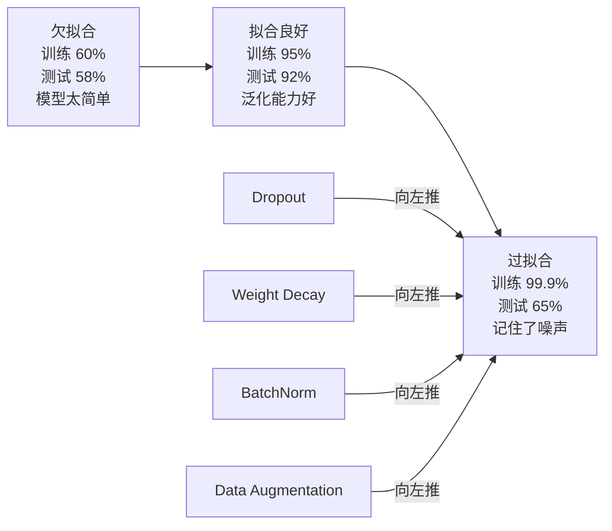
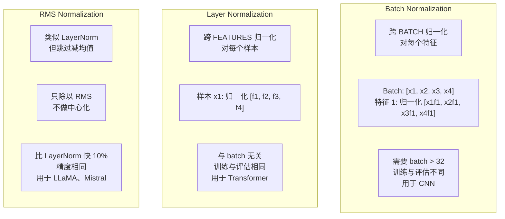
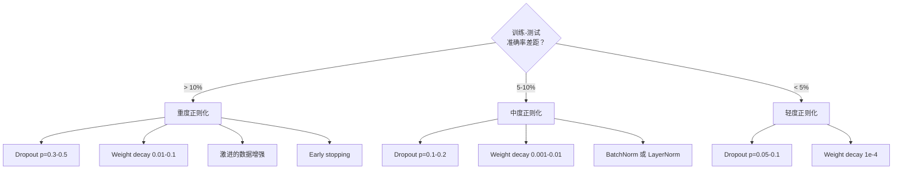

# 正则化（Regularization）

> 译注：本文译自同目录 [`en.md`](./en.md)。术语遵循仓根 [TRANSLATION_GUIDE.md](../../../../TRANSLATION_GUIDE.md)。

> 你的模型在训练数据上拿了 99%，在测试数据上只有 60%。它在背答案，没在学习。正则化（regularization）就是你对复杂度征收的税，逼模型去泛化。

**Type:** Build
**Languages:** Python
**Prerequisites:** Lesson 03.06 (Optimizers)
**Time:** ~75 minutes

## 学习目标（Learning Objectives）

- 从零实现 dropout（带 inverted scaling）、L2 权重衰减、batch normalization、layer normalization 以及 RMSNorm
- 测量训练集与测试集的准确率差距，借助正则化实验诊断过拟合
- 解释为什么 transformer 用 LayerNorm 而不用 BatchNorm，以及为什么现代 LLM 偏爱 RMSNorm
- 根据过拟合的严重程度，组合应用正确的正则化技术

## 问题（The Problem）

只要参数足够多，神经网络就能背下任何数据集。这不是空想——Zhang 等人（2017）用随机标签在 ImageNet 上训练标准网络，证明了这一点。这些网络在完全随机的标签上也能把训练损失（loss）压到接近零。它们硬背下了一百万对没有任何规律可学的输入-输出。训练损失完美无瑕，测试准确率为零。

这就是过拟合（overfitting）问题，而且模型越大，问题越严重。GPT-3 有 1750 亿参数，训练集大约 5000 亿 token。在这种参数量级下，模型容量足以一字不差地背下训练数据中的大段内容。没有正则化，它就只会反刍训练样本，而不是学到能泛化的规律。

训练表现和测试表现之间的差距，就是过拟合差距（overfitting gap）。本节课的每一种技术都从不同角度攻击这个差距。Dropout 让网络不依赖任何单一神经元（neuron）。权重衰减（weight decay）阻止任何单一权重（weight）增长得过大。Batch normalization 抚平损失曲面，让 optimizer 找到更平坦、更易泛化的极小值。Layer normalization 做同样的事，但在 batch normalization 失灵的场景下也能工作（小 batch、变长序列）。RMSNorm 通过省掉均值计算，把这件事再快 10%。每种技术都很简单。但合起来，就是「死记硬背的模型」和「能泛化的模型」之间的差别。

## 概念（The Concept）

### 过拟合光谱（The Overfitting Spectrum）

每个模型都落在一个光谱上：从欠拟合（underfitting，简单到抓不住规律）到过拟合（复杂到把噪声也抓住了）。甜蜜点在中间，正则化的作用是把模型从过拟合那一侧推回来。



### Dropout

最简单的正则化技术，却有最优雅的解释。训练时，以概率 p 随机把每个神经元的输出置零。

```
output = activation(z) * mask    where mask[i] ~ Bernoulli(1 - p)
```

p = 0.5 时，每次前向传播都会有一半的神经元被清零。网络必须学会冗余的表示，因为它无法预测哪些神经元会在场。这阻止了「共适应」（co-adaptation）——神经元学会依赖某些特定神经元的存在。

集成视角的解释：一个有 N 个神经元、带 dropout 的网络，可以构造出 2^N 种子网络（神经元开关的所有组合）。带 dropout 训练，相当于在不同的 mini-batch 上同时训练所有 2^N 个子网络。测试时使用全部神经元（不 dropout），并把输出乘以 (1 - p) 以匹配训练时的期望值。这等价于把 2^N 个子网络的预测做平均——一个模型里的超大集成。

实际工程里，缩放是放在训练时而不是测试时（也就是 inverted dropout）：

```
During training:  output = activation(z) * mask / (1 - p)
During testing:   output = activation(z)   (no change needed)
```

这样更干净，因为测试代码完全不需要知道 dropout 的存在。

默认比率：transformer 用 p = 0.1，MLP 用 p = 0.5，CNN 用 p = 0.2-0.3。dropout 越高 = 正则化越强 = 欠拟合风险越大。

### 权重衰减（Weight Decay / L2 Regularization）

把所有权重的平方和加进损失：

```
total_loss = task_loss + (lambda / 2) * sum(w_i^2)
```

正则化项的梯度（gradient）是 lambda * w。这意味着每一步，每个权重都会按其大小成比例地向零收缩。大权重被惩罚得更狠。模型被推向「没有任何单一权重占主导」的解。

为什么这能帮助泛化：过拟合的模型往往有大权重，会放大训练数据里的噪声。权重衰减把权重压小，从而限制了模型的有效容量，迫使它依赖鲁棒、可泛化的特征，而不是背下来的怪癖。

lambda 是控制强度的超参数。常见取值：

- transformer 上用 AdamW：0.01
- CNN 上用 SGD：1e-4
- 严重过拟合的模型：0.1

正如 lesson 06 中讨论的：weight decay 与 L2 regularization 在 SGD 下等价，但在 Adam 下不等价。用 Adam 训练时永远要用 AdamW（解耦的 weight decay）。

### Batch Normalization

把每一层的输出，在 mini-batch 维度上归一化，再传给下一层。

对于某层在某个 mini-batch 上的激活值（activation）：

```
mu = (1/B) * sum(x_i)           (batch mean)
sigma^2 = (1/B) * sum((x_i - mu)^2)   (batch variance)
x_hat = (x_i - mu) / sqrt(sigma^2 + eps)   (normalize)
y = gamma * x_hat + beta        (scale and shift)
```

Gamma 和 beta 是可学习参数，让网络在最优时可以「撤销」归一化。没有它们，你就强制每一层的输出都是零均值单位方差，但这未必是网络想要的。

**训练 vs 推理的分歧**：训练时，mu 和 sigma 来自当前的 mini-batch；推理（inference）时，使用训练过程中累计的滑动平均（指数滑动平均，momentum = 0.1，即 90% 旧值 + 10% 新值）。

为什么 BatchNorm 起作用至今仍有争论。原始论文声称它减少了「internal covariate shift」（前面层更新时，后面层输入分布的变化）。Santurkar 等人（2018）证明这种解释是错的。真正的原因：BatchNorm 让损失曲面更光滑。梯度更具预测性，Lipschitz 常数更小，optimizer 可以安全地走更大的步长。这就是为什么 BatchNorm 让你能用更大的学习率（learning rate）并更快收敛。

BatchNorm 有一个根本性的限制：它依赖批次统计量。batch size 为 1 时，均值和方差都没有意义。batch 很小（< 32）时，统计量充满噪声并损害性能。这对目标检测（显存限制 batch size）和语言建模（序列长度可变）这类任务很关键。

### Layer Normalization

在特征维度上归一化，而不是在 batch 维度上。对单个样本：

```
mu = (1/D) * sum(x_j)           (feature mean)
sigma^2 = (1/D) * sum((x_j - mu)^2)   (feature variance)
x_hat = (x_j - mu) / sqrt(sigma^2 + eps)
y = gamma * x_hat + beta
```

D 是特征维度。每个样本独立归一化——不依赖 batch size。这就是为什么 transformer 用 LayerNorm 而不用 BatchNorm。序列长度可变，batch size 经常很小（生成时甚至是 1），而且训练和推理阶段的计算是相同的。

transformer 中的 LayerNorm，可以放在每个 self-attention 块和每个前向块之后（Post-LN），也可以放在它们之前（Pre-LN，训练更稳定）。

### RMSNorm

不做均值减法的 LayerNorm。由 Zhang & Sennrich（2019）提出。

```
rms = sqrt((1/D) * sum(x_j^2))
y = gamma * x / rms
```

就这么简单。没有均值计算，没有 beta 参数。观察到的事实：LayerNorm 中的「再中心化」（减均值）对模型性能的贡献很小，但要花计算。去掉它，用约 10% 更少的开销拿到同样的精度。

LLaMA、LLaMA 2、LLaMA 3、Mistral 以及大多数现代 LLM 都用 RMSNorm，而不是 LayerNorm。在百亿参数、万亿 token 的规模下，10% 的节省非常可观。

### 归一化对比（Normalization Comparison）



### 数据增强作为正则化（Data Augmentation as Regularization）

不是改模型，而是改数据。在保持标签（label）的前提下变换训练输入：

- 图像：随机裁剪、翻转、旋转、颜色抖动、cutout
- 文本：同义词替换、回译、随机删除
- 音频：时间拉伸、音高偏移、添加噪声

效果与正则化等价：增加了训练集的有效规模，让模型更难记住具体样本。一个模型只看每张图原本一次，可以背下来；一个模型看每张图的 50 个增强版本，就被迫去学不变结构。

### 提前停止（Early Stopping）

最简单的正则器：当验证损失开始上升时就停止训练。那一刻模型还没有过拟合。实践中，你每个 epoch 跟踪验证损失，保存最优模型，并继续训练一段「耐心」（patience）窗口（通常 5-20 个 epoch）。如果在耐心窗口内验证损失没有改善，就停止训练并加载之前保存的最优模型。

### 何时用什么（When to Apply What）



## 动手实现（Build It）

### Step 1: Dropout（训练 / 评估两种模式）

```python
import random
import math


class Dropout:
    def __init__(self, p=0.5):
        self.p = p
        self.training = True
        self.mask = None

    def forward(self, x):
        if not self.training:
            return list(x)
        self.mask = []
        output = []
        for val in x:
            if random.random() < self.p:
                self.mask.append(0)
                output.append(0.0)
            else:
                self.mask.append(1)
                output.append(val / (1 - self.p))
        return output

    def backward(self, grad_output):
        grads = []
        for g, m in zip(grad_output, self.mask):
            if m == 0:
                grads.append(0.0)
            else:
                grads.append(g / (1 - self.p))
        return grads
```

### Step 2: L2 权重衰减

```python
def l2_regularization(weights, lambda_reg):
    penalty = 0.0
    for w in weights:
        penalty += w * w
    return lambda_reg * 0.5 * penalty

def l2_gradient(weights, lambda_reg):
    return [lambda_reg * w for w in weights]
```

### Step 3: Batch Normalization

```python
class BatchNorm:
    def __init__(self, num_features, momentum=0.1, eps=1e-5):
        self.gamma = [1.0] * num_features
        self.beta = [0.0] * num_features
        self.eps = eps
        self.momentum = momentum
        self.running_mean = [0.0] * num_features
        self.running_var = [1.0] * num_features
        self.training = True
        self.num_features = num_features

    def forward(self, batch):
        batch_size = len(batch)
        if self.training:
            mean = [0.0] * self.num_features
            for sample in batch:
                for j in range(self.num_features):
                    mean[j] += sample[j]
            mean = [m / batch_size for m in mean]

            var = [0.0] * self.num_features
            for sample in batch:
                for j in range(self.num_features):
                    var[j] += (sample[j] - mean[j]) ** 2
            var = [v / batch_size for v in var]

            for j in range(self.num_features):
                self.running_mean[j] = (1 - self.momentum) * self.running_mean[j] + self.momentum * mean[j]
                self.running_var[j] = (1 - self.momentum) * self.running_var[j] + self.momentum * var[j]
        else:
            mean = list(self.running_mean)
            var = list(self.running_var)

        self.x_hat = []
        output = []
        for sample in batch:
            normalized = []
            out_sample = []
            for j in range(self.num_features):
                x_h = (sample[j] - mean[j]) / math.sqrt(var[j] + self.eps)
                normalized.append(x_h)
                out_sample.append(self.gamma[j] * x_h + self.beta[j])
            self.x_hat.append(normalized)
            output.append(out_sample)
        return output
```

### Step 4: Layer Normalization

```python
class LayerNorm:
    def __init__(self, num_features, eps=1e-5):
        self.gamma = [1.0] * num_features
        self.beta = [0.0] * num_features
        self.eps = eps
        self.num_features = num_features

    def forward(self, x):
        mean = sum(x) / len(x)
        var = sum((xi - mean) ** 2 for xi in x) / len(x)

        self.x_hat = []
        output = []
        for j in range(self.num_features):
            x_h = (x[j] - mean) / math.sqrt(var + self.eps)
            self.x_hat.append(x_h)
            output.append(self.gamma[j] * x_h + self.beta[j])
        return output
```

### Step 5: RMSNorm

```python
class RMSNorm:
    def __init__(self, num_features, eps=1e-6):
        self.gamma = [1.0] * num_features
        self.eps = eps
        self.num_features = num_features

    def forward(self, x):
        rms = math.sqrt(sum(xi * xi for xi in x) / len(x) + self.eps)
        output = []
        for j in range(self.num_features):
            output.append(self.gamma[j] * x[j] / rms)
        return output
```

### Step 6: 带 / 不带正则化的训练对比

```python
def sigmoid(x):
    x = max(-500, min(500, x))
    return 1.0 / (1.0 + math.exp(-x))


def make_circle_data(n=200, seed=42):
    random.seed(seed)
    data = []
    for _ in range(n):
        x = random.uniform(-2, 2)
        y = random.uniform(-2, 2)
        label = 1.0 if x * x + y * y < 1.5 else 0.0
        data.append(([x, y], label))
    return data


class RegularizedNetwork:
    def __init__(self, hidden_size=16, lr=0.05, dropout_p=0.0, weight_decay=0.0):
        random.seed(0)
        self.hidden_size = hidden_size
        self.lr = lr
        self.dropout_p = dropout_p
        self.weight_decay = weight_decay
        self.dropout = Dropout(p=dropout_p) if dropout_p > 0 else None

        self.w1 = [[random.gauss(0, 0.5) for _ in range(2)] for _ in range(hidden_size)]
        self.b1 = [0.0] * hidden_size
        self.w2 = [random.gauss(0, 0.5) for _ in range(hidden_size)]
        self.b2 = 0.0

    def forward(self, x, training=True):
        self.x = x
        self.z1 = []
        self.h = []
        for i in range(self.hidden_size):
            z = self.w1[i][0] * x[0] + self.w1[i][1] * x[1] + self.b1[i]
            self.z1.append(z)
            self.h.append(max(0.0, z))

        if self.dropout and training:
            self.dropout.training = True
            self.h = self.dropout.forward(self.h)
        elif self.dropout:
            self.dropout.training = False
            self.h = self.dropout.forward(self.h)

        self.z2 = sum(self.w2[i] * self.h[i] for i in range(self.hidden_size)) + self.b2
        self.out = sigmoid(self.z2)
        return self.out

    def backward(self, target):
        eps = 1e-15
        p = max(eps, min(1 - eps, self.out))
        d_loss = -(target / p) + (1 - target) / (1 - p)
        d_sigmoid = self.out * (1 - self.out)
        d_out = d_loss * d_sigmoid

        for i in range(self.hidden_size):
            d_relu = 1.0 if self.z1[i] > 0 else 0.0
            d_h = d_out * self.w2[i] * d_relu
            self.w2[i] -= self.lr * (d_out * self.h[i] + self.weight_decay * self.w2[i])
            for j in range(2):
                self.w1[i][j] -= self.lr * (d_h * self.x[j] + self.weight_decay * self.w1[i][j])
            self.b1[i] -= self.lr * d_h
        self.b2 -= self.lr * d_out

    def evaluate(self, data):
        correct = 0
        total_loss = 0.0
        for x, y in data:
            pred = self.forward(x, training=False)
            eps = 1e-15
            p = max(eps, min(1 - eps, pred))
            total_loss += -(y * math.log(p) + (1 - y) * math.log(1 - p))
            if (pred >= 0.5) == (y >= 0.5):
                correct += 1
        return total_loss / len(data), correct / len(data) * 100

    def train_model(self, train_data, test_data, epochs=300):
        history = []
        for epoch in range(epochs):
            total_loss = 0.0
            correct = 0
            for x, y in train_data:
                pred = self.forward(x, training=True)
                self.backward(y)
                eps = 1e-15
                p = max(eps, min(1 - eps, pred))
                total_loss += -(y * math.log(p) + (1 - y) * math.log(1 - p))
                if (pred >= 0.5) == (y >= 0.5):
                    correct += 1
            train_loss = total_loss / len(train_data)
            train_acc = correct / len(train_data) * 100
            test_loss, test_acc = self.evaluate(test_data)
            history.append((train_loss, train_acc, test_loss, test_acc))
            if epoch % 75 == 0 or epoch == epochs - 1:
                gap = train_acc - test_acc
                print(f"    Epoch {epoch:3d}: train_acc={train_acc:.1f}%, test_acc={test_acc:.1f}%, gap={gap:.1f}%")
        return history
```

## 用起来（Use It）

PyTorch 把所有归一化和正则化都封装成模块：

```python
import torch
import torch.nn as nn

model = nn.Sequential(
    nn.Linear(784, 256),
    nn.BatchNorm1d(256),
    nn.ReLU(),
    nn.Dropout(0.3),
    nn.Linear(256, 128),
    nn.BatchNorm1d(128),
    nn.ReLU(),
    nn.Dropout(0.3),
    nn.Linear(128, 10),
)

model.train()
out_train = model(torch.randn(32, 784))

model.eval()
out_test = model(torch.randn(1, 784))
```

`model.train()` / `model.eval()` 这个开关至关重要。它切换 dropout 的开关，并告诉 BatchNorm 该用 batch 统计量还是 running 统计量。推理前忘记调用 `model.eval()` 是深度学习中最常见的 bug 之一。你的测试准确率会随机抖动，因为 dropout 还在生效，而 BatchNorm 还在用 mini-batch 统计量。

对于 transformer，模式不一样：

```python
class TransformerBlock(nn.Module):
    def __init__(self, d_model=512, nhead=8, dropout=0.1):
        super().__init__()
        self.attention = nn.MultiheadAttention(d_model, nhead, dropout=dropout)
        self.norm1 = nn.LayerNorm(d_model)
        self.ff = nn.Sequential(
            nn.Linear(d_model, d_model * 4),
            nn.GELU(),
            nn.Linear(d_model * 4, d_model),
            nn.Dropout(dropout),
        )
        self.norm2 = nn.LayerNorm(d_model)
        self.dropout = nn.Dropout(dropout)

    def forward(self, x):
        attended, _ = self.attention(x, x, x)
        x = self.norm1(x + self.dropout(attended))
        x = self.norm2(x + self.ff(x))
        return x
```

是 LayerNorm，不是 BatchNorm。Dropout p=0.1，不是 p=0.5。这些是 transformer 的默认值。

## 上线部署（Ship It）

本课产出：
- `outputs/prompt-regularization-advisor.md` —— 一个 prompt，用来诊断过拟合并推荐合适的正则化策略

## 练习（Exercises）

1. 实现 2D 数据的 spatial dropout：不丢弃单个神经元，而是丢弃整个特征通道。把若干个连续特征视为一个通道，然后整组丢弃。在 hidden_size=32 的圆形数据集上，比较它和标准 dropout 的训练-测试差距。

2. 把 lesson 05 的 label smoothing 与本课的 dropout 组合起来。用四种配置训练：都不用、只用 dropout、只用 label smoothing、两者都用。测量每种配置最终的训练-测试准确率差距。哪种组合差距最小？

3. 在你的圆形数据集网络中，于隐层和激活函数之间加一个 BatchNorm 层。在学习率 0.01、0.05、0.1 下，分别训练带 BatchNorm 和不带 BatchNorm 的版本。BatchNorm 应该能让网络在朴素版本会发散的高学习率下也能稳定训练。

4. 实现 early stopping：每个 epoch 跟踪测试损失，保存最优权重，若 20 个 epoch 内测试损失未改善就停止。把带正则化的网络跑 1000 个 epoch。报告哪个 epoch 取得最佳测试准确率，以及你节省了多少 epoch 的计算。

5. 在一个 4 层（不只是 2 层）网络上对比 LayerNorm 与 RMSNorm。两者用相同的初始权重。训练 200 个 epoch，比较最终准确率、训练速度（每个 epoch 耗时）和第一层的梯度幅值。验证 RMSNorm 在同等准确率下确实更快。

## 关键术语（Key Terms）

| Term | What people say | What it actually means |
|------|----------------|----------------------|
| Overfitting | "模型把数据背下来了" | 模型训练表现远超测试表现，说明它学的是噪声而不是信号 |
| Regularization | "防止过拟合" | 任何约束模型复杂度以提升泛化能力的技术：dropout、weight decay、归一化、数据增强 |
| Dropout | "随机砍神经元" | 训练时以概率 p 把随机神经元置零，迫使网络学到冗余表示；等价于训练一个集成 |
| Weight decay | "L2 惩罚" | 每一步从权重中减去 lambda * w，让所有权重向零收缩；通过权重幅值惩罚复杂度 |
| Batch normalization | "按 batch 归一化" | 训练时用 batch 统计量、推理时用 running 平均，在 batch 维度上对层输出归一化 |
| Layer normalization | "按样本归一化" | 在每个样本内的特征维度上归一化；不依赖 batch，在 batch size 多变的 transformer 里使用 |
| RMSNorm | "去均值的 LayerNorm" | 均方根归一化；从 LayerNorm 中去掉减均值步骤，10% 提速且精度持平 |
| Early stopping | "在过拟合前刹车" | 验证损失停止改善时就停训；最简单的正则器，常与其他方法搭配使用 |
| Data augmentation | "用更少的数据造出更多" | 通过翻转、裁剪、加噪等变换训练输入，扩大有效数据集规模并强迫模型学到不变性 |
| Generalization gap | "训练-测试差距" | 训练表现与测试表现之间的差值；正则化的目标就是缩小这个差距 |

## 延伸阅读（Further Reading）

- Srivastava et al., "Dropout: A Simple Way to Prevent Neural Networks from Overfitting" (2014) —— dropout 的原始论文，给出了集成视角的解释和大量实验
- Ioffe & Szegedy, "Batch Normalization: Accelerating Deep Network Training by Reducing Internal Covariate Shift" (2015) —— 提出了 BatchNorm 及其训练流程，是引用最多的深度学习论文之一
- Zhang & Sennrich, "Root Mean Square Layer Normalization" (2019) —— 证明 RMSNorm 在精度持平的情况下减少了计算量；被 LLaMA 和 Mistral 采用
- Zhang et al., "Understanding Deep Learning Requires Rethinking Generalization" (2017) —— 里程碑式的论文，展示神经网络可以背下随机标签，挑战了关于泛化的传统观点
