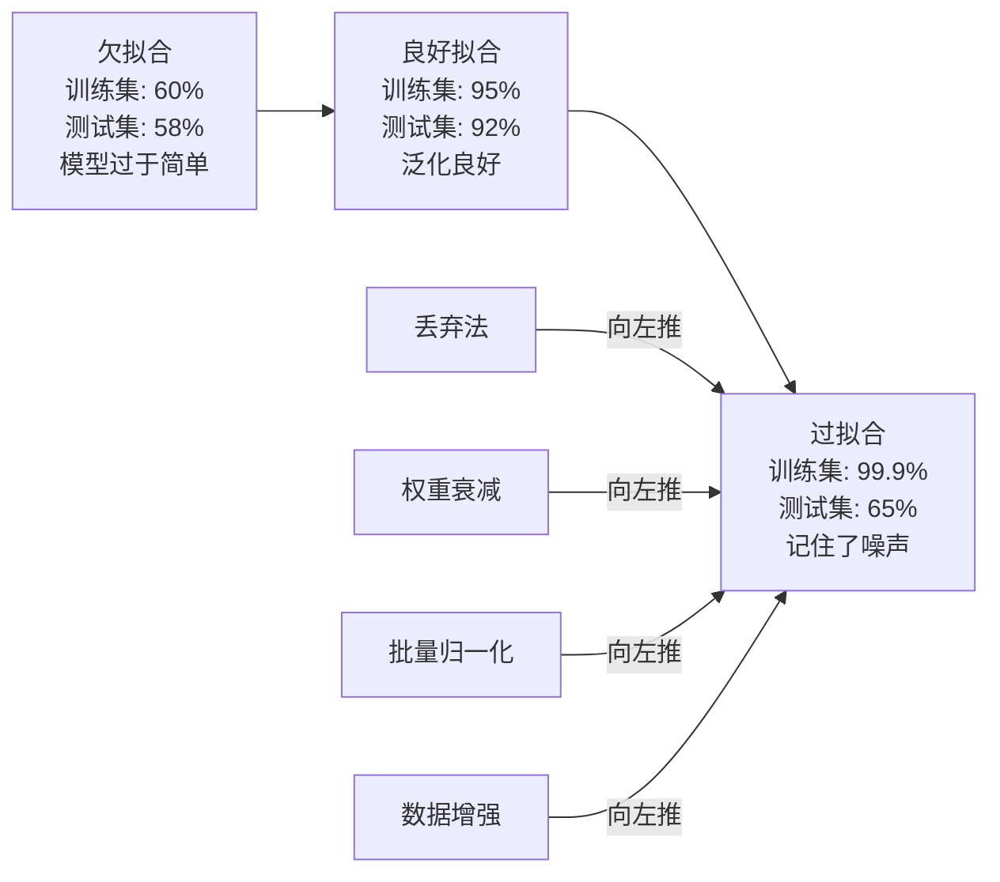
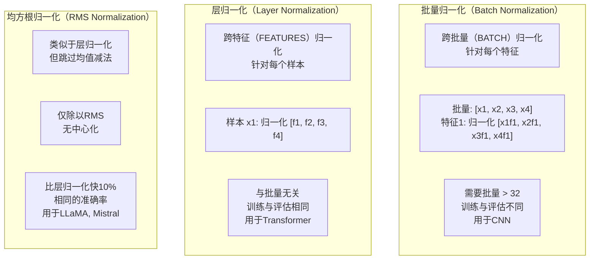
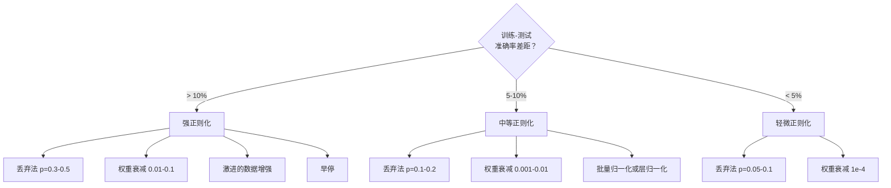

# 正则化（Regularization）

> 你的模型在训练数据上达到99%，在测试数据上只有60%。它记住了数据而非学习了规律。正则化是你对复杂性征收的税，以迫使模型具备泛化能力。

**类型：** 构建
**语言：** Python
**前置要求：** 课程 03.06（优化器）
**时间：** 约75分钟

## 学习目标

- 从零实现带反向缩放（Inverted Scaling）的丢弃法（Dropout）、L2权重衰减（Weight Decay）、批量归一化（Batch Normalization）、层归一化（Layer Normalization）和均方根归一化（RMSNorm）
- 测量训练-测试准确率差距，并通过正则化实验诊断过拟合（Overfitting）
- 解释为什么Transformer使用层归一化而不是批量归一化，以及为什么现代大语言模型（LLM）偏好均方根归一化
- 根据过拟合的严重程度，应用正确的正则化技术组合

## 问题

一个拥有足够参数的神经网络可以记住任何数据集。这不是假设——张（Zhang）等人（2017年）通过在带有随机标签的ImageNet上训练标准网络证明了这一点。这些网络在完全随机分配的标签上达到了接近零的训练损失。它们记住了100万个毫无规律可学的随机输入-输出对。训练损失完美，测试准确率为零。

这就是过拟合问题，而且随着模型变大，问题变得更严重。GPT-3有1750亿个参数，训练集大约有5000亿个词元。拥有这么多参数，模型有足够的能力逐字记住训练数据的显著部分。没有正则化，它只会复述训练示例，而不是学习可泛化的模式。

训练性能与测试性能之间的差距就是过拟合差距。本课程中的每一项技术都从不同角度攻击这一差距。丢弃法迫使网络不依赖任何单个神经元。权重衰减防止任何单个权重变得过大。批量归一化使损失景观更平滑，从而使优化器能找到更平坦、更易泛化的最小值。层归一化做同样的事情，但在批量归一化失效的地方（小批量、变长序列）有效。均方根归一化通过去掉均值计算，将速度提升了约10%。每种技术都很简单。但综合起来，它们决定了模型是记忆还是泛化的关键。

## 概念

### 过拟合谱

每个模型都处于某种谱上，从欠拟合（过于简单而无法捕捉模式）到过拟合（过于复杂而捕捉了噪声）。最佳点位于两者之间，正则化从过拟合一侧将模型推向它。



### 丢弃法（Dropout）

最简单的正则化技术，具有最优雅的解释。在训练期间，以概率p随机将每个神经元的输出置为零。

```
输出 = 激活(z) * 掩码    其中掩码[i] ~ 伯努利分布(1 - p)
```

p = 0.5时，每次前向传播中有一半的神经元被置零。网络必须学习冗余的表示，因为它无法预测哪些神经元可用。这防止了共适应（Co-adaptation）——神经元学习依赖特定其他神经元的存在。

集成解释：一个具有N个神经元并使用丢弃法的网络，会产生2^N个可能的子网络（每个神经元打开或关闭的所有组合）。使用丢弃法训练，相当于同时训练所有2^N个子网络，每个子网络在不同的mini-batch上训练。在测试时，你使用所有神经元（无丢弃）并将输出按(1 - p)缩放，以匹配训练期间的期望值。这相当于对2^N个子网络的预测取平均——一个单一模型产生的巨大集成。

在实践中，缩放是在训练期间而不是测试期间进行的（反向丢弃法（Inverted Dropout））：

```
训练期间：  输出 = 激活(z) * 掩码 / (1 - p)
测试期间：  输出 = 激活(z)   （无需修改）
```

这样更干净，因为测试代码根本不需要知道丢弃法。

默认比率：Transformer用p = 0.1，多层感知机（MLP）用p = 0.5，卷积神经网络（CNN）用p = 0.2-0.3。丢弃率越高 = 正则化越强 = 欠拟合风险越大。

### 权重衰减（Weight Decay，L2正则化）

将所有权重的平方幅值添加到损失中：

```
总损失 = 任务损失 + (lambda / 2) * 求和(w_i^2)
```

正则化项的梯度是 lambda * w。这意味着每一步，每个权重都会按与其幅值成正比的比例向零收缩。大权重受到更多惩罚。模型被推向没有单个权重占主导地位的解。

为什么这有助于泛化：过拟合的模型往往具有较大的权重，这会放大训练数据中的噪声。权重衰减使权重保持较小，从而限制了模型的有效容量，并迫使它依赖鲁棒、可泛化的特征而不是记住的怪异点。

lambda 超参数控制强度。典型值：

- 对于Transformer上的AdamW：0.01
- 对于CNN上的随机梯度下降（SGD）：1e-4
- 对于严重过拟合的模型：0.1

正如课程06中所讨论的：权重衰减和L2正则化在SGD中是等价的，但在Adam中则不然。当使用Adam训练时，始终使用AdamW（解耦的权重衰减（Decoupled Weight Decay））。

### 批量归一化（Batch Normalization）

在将每一层的输出传递给下一层之前，先在mini-batch范围内对其进行归一化。

对于某一层的mini-batch激活值：

```
mu = (1/B) * 求和(x_i)           （批量均值）
sigma^2 = (1/B) * 求和((x_i - mu)^2)   （批量方差）
x_hat = (x_i - mu) / sqrt(sigma^2 + eps)   （归一化）
y = gamma * x_hat + beta        （缩放和平移）
```

gamma 和 beta 是可学习的参数，如果归一化不是最优的，网络可以撤销这一操作。没有它们，你将强制每一层的输出都是零均值、单位方差，这可能不是网络想要的。

**训练与推理的区分：** 在训练期间，mu 和 sigma 来自当前mini-batch。在推理期间，使用训练期间积累的滑动平均值（指数移动平均，动量为0.1，即90%旧值 + 10%新值）。

为什么批量归一化有效仍然存在争议。原始论文声称它减少了“内部协变量偏移（Internal Covariate Shift）”（随着较早层的更新，层输入分布的变化）。Santurkar等人（2018年）表明这一解释是错误的。实际原因：批量归一化使损失景观更平滑。梯度更具预测性，Lipschitz常数更小，优化器可以更安全地迈出更大的步长。这就是为什么批量归一化允许你使用更高的学习率并更快地收敛。

批量归一化有一个根本性限制：它依赖于批量统计。当批量大小为1时，均值和方差毫无意义。当批量较小时（< 32），统计量有噪声并损害性能。这在诸如目标检测（内存限制批量大小）和语言建模（序列长度变化）等任务中很重要。

### 层归一化（Layer Normalization）

跨特征而不是跨批量进行归一化。对于单个样本：

```
mu = (1/D) * 求和(x_j)           （特征均值）
sigma^2 = (1/D) * 求和((x_j - mu)^2)   （特征方差）
x_hat = (x_j - mu) / sqrt(sigma^2 + eps)
y = gamma * x_hat + beta
```

D 是特征维度。每个样本独立归一化——不依赖于批量大小。这就是为什么Transformer使用层归一化而不是批量归一化。序列具有可变长度，批量大小通常很小（或在生成时为1），并且训练和推理之间的计算是相同的。

在Transformer中，层归一化应用在每个自注意力块和每个前馈块之后（后LN（Post-LN）），或者应用在它们之前（前LN（Pre-LN），对训练更稳定）。

### 均方根归一化（RMSNorm）

去掉均值计算的层归一化。由张（Zhang）和森里奇（Sennrich）在2019年提出。

```
rms = sqrt((1/D) * 求和(x_j^2))
y = gamma * x / rms
```

就是这样。没有均值计算，没有beta参数。观察结果是：层归一化中的中心化（均值减法）对模型性能贡献很小，但耗费计算资源。移除它可以在约10%更少的开销下获得相同的准确率。

LLaMA、LLaMA 2、LLaMA 3、Mistral以及大多数现代大语言模型（LLM）都使用均方根归一化而不是层归一化。在数十亿参数和数万亿词元的规模下，那10%的节省是显著的。

### 归一化对比



### 数据增强（Data Augmentation）作为正则化

不是模型修改，而是数据修改。在保持标签不变的同时变换训练输入：

- 图像：随机裁剪、翻转、旋转、颜色抖动、cutout
- 文本：同义词替换、回译、随机删除
- 音频：时间拉伸、音高偏移、噪声添加

效果与正则化相同：它增加了训练集的有效大小，使模型更难记住特定示例。一个只看到每张图像原始形态一次的模型可以记住它。一个看到每张图像50个增强版本的模型被迫学习不变结构。

### 早停（Early Stopping）

最简单的正则化器：当验证损失开始增加时停止训练。此时模型尚未过拟合。在实践中，每个epoch跟踪验证损失，保存最佳模型，并继续训练一个“耐心”窗口（通常5-20个epoch）。如果验证损失在耐心窗口内没有改善，则停止并加载最佳保存的模型。

### 何时应用何种方法



## 动手构建

### 第1步：丢弃法（训练和评估模式）

```python
import random
import math


class Dropout:
    def __init__(self, p=0.5):
        self.p = p
        self.training = True
        self.mask = None

    def forward(self, x):
        if not self.training:
            return list(x)
        self.mask = []
        output = []
        for val in x:
            if random.random() < self.p:
                self.mask.append(0)
                output.append(0.0)
            else:
                self.mask.append(1)
                output.append(val / (1 - self.p))
        return output

    def backward(self, grad_output):
        grads = []
        for g, m in zip(grad_output, self.mask):
            if m == 0:
                grads.append(0.0)
            else:
                grads.append(g / (1 - self.p))
        return grads
```

### 第2步：L2权重衰减

```python
def l2_regularization(weights, lambda_reg):
    penalty = 0.0
    for w in weights:
        penalty += w * w
    return lambda_reg * 0.5 * penalty

def l2_gradient(weights, lambda_reg):
    return [lambda_reg * w for w in weights]
```

### 第3步：批量归一化

```python
class BatchNorm:
    def __init__(self, num_features, momentum=0.1, eps=1e-5):
        self.gamma = [1.0] * num_features
        self.beta = [0.0] * num_features
        self.eps = eps
        self.momentum = momentum
        self.running_mean = [0.0] * num_features
        self.running_var = [1.0] * num_features
        self.training = True
        self.num_features = num_features

    def forward(self, batch):
        batch_size = len(batch)
        if self.training:
            mean = [0.0] * self.num_features
            for sample in batch:
                for j in range(self.num_features):
                    mean[j] += sample[j]
            mean = [m / batch_size for m in mean]

            var = [0.0] * self.num_features
            for sample in batch:
                for j in range(self.num_features):
                    var[j] += (sample[j] - mean[j]) ** 2
            var = [v / batch_size for v in var]

            for j in range(self.num_features):
                self.running_mean[j] = (1 - self.momentum) * self.running_mean[j] + self.momentum * mean[j]
                self.running_var[j] = (1 - self.momentum) * self.running_var[j] + self.momentum * var[j]
        else:
            mean = list(self.running_mean)
            var = list(self.running_var)

        self.x_hat = []
        output = []
        for sample in batch:
            normalized = []
            out_sample = []
            for j in range(self.num_features):
                x_h = (sample[j] - mean[j]) / math.sqrt(var[j] + self.eps)
                normalized.append(x_h)
                out_sample.append(self.gamma[j] * x_h + self.beta[j])
            self.x_hat.append(normalized)
            output.append(out_sample)
        return output
```

### 第4步：层归一化

```python
class LayerNorm:
    def __init__(self, num_features, eps=1e-5):
        self.gamma = [1.0] * num_features
        self.beta = [0.0] * num_features
        self.eps = eps
        self.num_features = num_features

    def forward(self, x):
        mean = sum(x) / len(x)
        var = sum((xi - mean) ** 2 for xi in x) / len(x)

        self.x_hat = []
        output = []
        for j in range(self.num_features):
            x_h = (x[j] - mean) / math.sqrt(var + self.eps)
            self.x_hat.append(x_h)
            output.append(self.gamma[j] * x_h + self.beta[j])
        return output
```

### 第5步：均方根归一化

```python
class RMSNorm:
    def __init__(self, num_features, eps=1e-6):
        self.gamma = [1.0] * num_features
        self.eps = eps
        self.num_features = num_features

    def forward(self, x):
        rms = math.sqrt(sum(xi * xi for xi in x) / len(x) + self.eps)
        output = []
        for j in range(self.num_features):
            output.append(self.gamma[j] * x[j] / rms)
        return output
```

### 第6步：带和不带正则化的训练

```python
def sigmoid(x):
    x = max(-500, min(500, x))
    return 1.0 / (1.0 + math.exp(-x))


def make_circle_data(n=200, seed=42):
    random.seed(seed)
    data = []
    for _ in range(n):
        x = random.uniform(-2, 2)
        y = random.uniform(-2, 2)
        label = 1.0 if x * x + y * y < 1.5 else 0.0
        data.append(([x, y], label))
    return data


class RegularizedNetwork:
    def __init__(self, hidden_size=16, lr=0.05, dropout_p=0