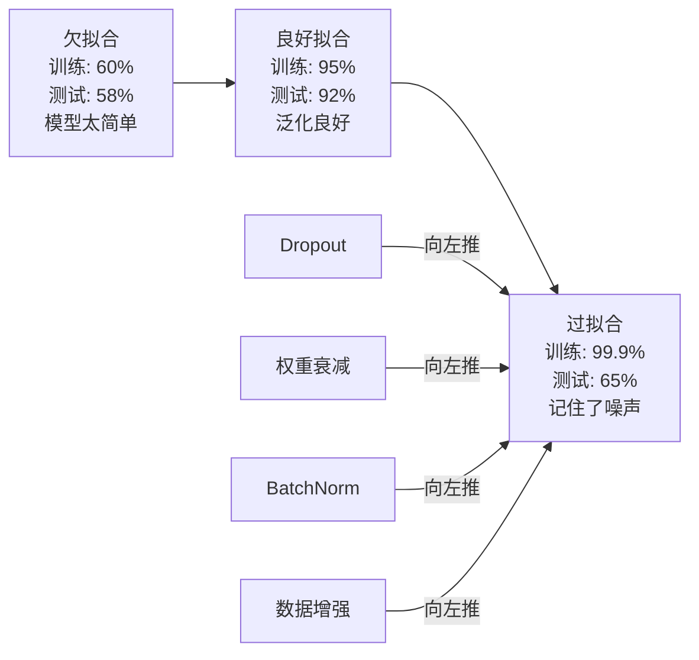
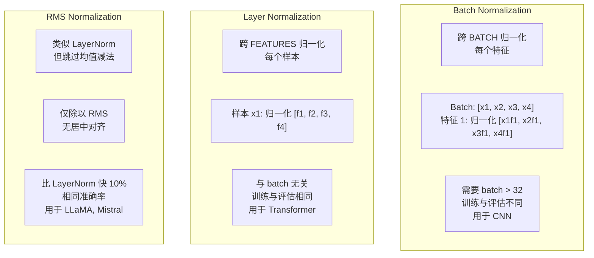
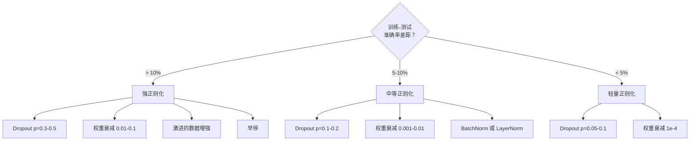

# 正则化 (Regularization)

> 你的模型在训练数据上达到 99%，在测试数据上达到 60%。它记住了而非学习了。正则化是你对复杂性施加的税，以强制泛化。

**类型：** 动手构建
**语言：** Python
**前置知识：** 第 03.06 课（优化器）
**时长：** ~75 分钟

## 学习目标

- 从零实现带反向缩放的 dropout、L2 权重衰减、batch normalization、layer normalization 和 RMSNorm
- 测量训练-测试准确率差距，并通过正则化实验诊断过拟合
- 解释为什么 transformer 使用 LayerNorm 而非 BatchNorm，以及为什么现代 LLM 偏爱 RMSNorm
- 根据过拟合的严重程度，应用正确的正则化技术组合

## 问题

一个具有足够参数的神经网络可以记忆任何数据集。这不是假设——Zhang 等人（2017）通过在带有随机标签的 ImageNet 上训练标准网络证明了这一点。网络在完全随机的标签分配上达到了接近零的训练 loss。它们记住了一百万个没有模式可学的随机输入-输出对。训练 loss 完美。测试准确率为零。

这就是过拟合问题，而且随着模型变大而变得更糟。GPT-3 有 1750 亿个参数。训练集有大约 5000 亿个 token。有了这么多参数，模型有足够的能力逐字记忆训练数据的显著部分。没有正则化，它只会死记硬背训练样本，而不是学习可泛化的模式。

训练性能和测试性能之间的差距就是过拟合差距。本课中的每种技术都从不同的角度攻击这个差距。Dropout 迫使网络不依赖任何单个神经元。权重衰减阻止任何单个权重变得过大。Batch normalization 平滑 loss 景观，使优化器找到更平坦、更可泛化的最小值。Layer normalization 做同样的事情，但在 batch normalization 失败的地方有效（小批次、变长序列）。RMSNorm 通过去掉均值计算使其快 10%。每种技术都很简单。它们合在一起，就是记忆模型和泛化模型之间的区别。

## 概念

### 过拟合谱

每个模型都位于从欠拟合（太简单无法捕捉模式）到过拟合（太复杂以至于捕捉噪声）谱上的某处。最佳点在中间，正则化将模型从过拟合侧推向它。


```mermaid
graph LR
    Under["欠拟合<br/>训练: 60%<br/>测试: 58%<br/>模型太简单"] --> Good["良好拟合<br/>训练: 95%<br/>测试: 92%<br/>泛化良好"]
    Good --> Over["过拟合<br/>训练: 99.9%<br/>测试: 65%<br/>记住了噪声"]

    Dropout["Dropout"] -->|"向左推"| Over
    WD["权重衰减"] -->|"向左推"| Over
    BN["BatchNorm"] -->|"向左推"| Over
    Aug["数据增强"] -->|"向左推"| Over
```

### Dropout

最简单的正则化技术，有着最优雅的解释。在训练期间，以概率 p 将每个神经元的输出随机设为零。

```
output = activation(z) * mask    其中 mask[i] ~ Bernoulli(1 - p)
```

使用 p = 0.5，一半的神经元在每次前向传播时被置零。网络必须学习冗余表示，因为它无法预测哪些神经元可用。这防止了共适应——神经元学会依赖特定其他神经元的存在。

集成解释：一个有 N 个神经元和 dropout 的网络创建了 2^N 个可能的子网络（神经元开启或关闭的每种组合）。使用 dropout 训练近似同时训练所有 2^N 个子网络，每个在不同的 mini-batch 上。在测试时，你使用所有神经元（无 dropout）并将输出缩放 (1 - p) 以匹配训练期间的期望值。这相当于平均 2^N 个子网络的预测——一个来自单个模型的大规模集成。

在实践中，缩放应用于训练期间而非测试期间（反向 dropout）：

```
训练期间：  output = activation(z) * mask / (1 - p)
测试期间：  output = activation(z)   （无需修改）
```

这更简洁，因为测试代码完全不需要知道 dropout。

默认比率：transformer 用 p = 0.1，MLP 用 p = 0.5，CNN 用 p = 0.2-0.3。更高的 dropout = 更强的正则化 = 更大的欠拟合风险。

### 权重衰减 (L2 正则化)

将所有权重的平方幅度添加到 loss 中：

```
total_loss = task_loss + (lambda / 2) * sum(w_i^2)
```

正则化项的梯度是 lambda * w。这意味着在每一步，每个权重都按其幅度比例向零收缩。大权重受到更多惩罚。模型被推向没有单个权重占主导地位的解。

为什么这有助于泛化：过拟合模型往往有大的权重，放大训练数据中的噪声。权重衰减使权重保持小，这限制了模型的有效容量，并迫使它依赖鲁棒的、可泛化的特征而非记忆的怪癖。

Lambda 超参数控制强度。典型值：

- transformer 的 AdamW 使用 0.01
- CNN 的 SGD 使用 1e-4
- 严重过拟合模型使用 0.1

如第 06 课所述：权重衰减和 L2 正则化在 SGD 中等价，但在 Adam 中不等价。使用 Adam 训练时始终使用 AdamW（解耦的权重衰减）。

### Batch Normalization

在将每层的输出传递给下一层之前，跨 mini-batch 进行归一化。

对于某层的一个 mini-batch 激活值：

```
mu = (1/B) * sum(x_i)           (batch mean)
sigma^2 = (1/B) * sum((x_i - mu)^2)   (batch variance)
x_hat = (x_i - mu) / sqrt(sigma^2 + eps)   (normalize)
y = gamma * x_hat + beta        (scale and shift)
```

Gamma 和 beta 是可学习参数，让网络在最优时撤销归一化。没有它们，你会强制每层的输出都是零均值单位方差，这可能不是网络想要的。

**训练 vs 推理的区别：** 训练期间，mu 和 sigma 来自当前 mini-batch。推理期间，你使用训练期间累积的运行平均值（指数移动平均，动量 = 0.1，即 90% 旧 + 10% 新）。

为什么 BatchNorm 有效仍有争议。原始论文声称它减少了"内部协变量偏移"（随着早期层更新，层输入分布的变化）。Santurkar 等人（2018）证明这个解释是错误的。真正原因：BatchNorm 使 loss 景观更平滑。梯度更具预测性，Lipschitz 常数更小，优化器可以安全地迈更大的步子。这就是 BatchNorm 让你使用更高的 learning rate 并更快收敛的原因。

BatchNorm 有一个根本限制：它依赖于批次统计。当批次大小为 1 时，均值和方差没有意义。当批次较小时（< 32），统计量有噪声并损害性能。这对于物体检测（内存限制批次大小）和语言建模（序列长度变化）等任务很重要。

### Layer Normalization

跨特征而非跨批次进行归一化。对于单个样本：

```
mu = (1/D) * sum(x_j)           (feature mean)
sigma^2 = (1/D) * sum((x_j - mu)^2)   (feature variance)
x_hat = (x_j - mu) / sqrt(sigma^2 + eps)
y = gamma * x_hat + beta
```

D 是特征维度。每个样本独立归一化——不依赖于批次大小。这就是 transformer 使用 LayerNorm 而非 BatchNorm 的原因。序列有变长长度，批次大小通常很小（或在生成时为 1），并且训练和推理之间的计算是相同的。

Transformer 中的 LayerNorm 应用于每个自注意力块和前馈块之后（Post-LN），或在其之前（Pre-LN，对训练更稳定）。

### RMSNorm

不带均值减法的 LayerNorm。由 Zhang & Sennrich（2019）提出。

```
rms = sqrt((1/D) * sum(x_j^2))
y = gamma * x / rms
```

就是这样。没有均值计算，没有 beta 参数。观察发现：LayerNorm 中的重新居中（均值减法）对模型性能贡献很小，但需要计算成本。移除它可以获得相同的准确率，同时减少约 10% 的开销。

LLaMA、LLaMA 2、LLaMA 3、Mistral 和大多数现代 LLM 使用 RMSNorm 而非 LayerNorm。在数十亿参数和数万亿 token 的规模下，那 10% 的节省是显著的。

### 归一化对比


```mermaid
graph TD
    subgraph "Batch Normalization"
        BN_D["跨 BATCH 归一化<br/>每个特征"]
        BN_S["Batch: [x1, x2, x3, x4]<br/>特征 1: 归一化 [x1f1, x2f1, x3f1, x4f1]"]
        BN_P["需要 batch > 32<br/>训练与评估不同<br/>用于 CNN"]
    end
    subgraph "Layer Normalization"
        LN_D["跨 FEATURES 归一化<br/>每个样本"]
        LN_S["样本 x1: 归一化 [f1, f2, f3, f4]"]
        LN_P["与 batch 无关<br/>训练与评估相同<br/>用于 Transformer"]
    end
    subgraph "RMS Normalization"
        RN_D["类似 LayerNorm<br/>但跳过均值减法"]
        RN_S["仅除以 RMS<br/>无居中对齐"]
        RN_P["比 LayerNorm 快 10%<br/>相同准确率<br/>用于 LLaMA, Mistral"]
    end
```

### 数据增强作为正则化

不是模型修改，而是数据修改。在保持标签的同时变换训练输入：

- 图像：随机裁剪、翻转、旋转、颜色抖动、剪切
- 文本：同义词替换、回译、随机删除
- 音频：时间拉伸、音调变换、添加噪声

效果与正则化相同：它增加了训练集的有效大小，使模型更难记忆特定示例。一个只看到每个图像原始形态一次的模型可以记住它。一个看到每个图像的 50 个增强版本的模型被迫学习不变结构。

### 早停 (Early Stopping)

最简单的正则化器：当验证 loss 开始增加时停止训练。此时模型尚未过拟合。在实践中，你每个 epoch 跟踪验证 loss，保存最佳模型，并继续训练一个"耐心"窗口（通常 5-20 个 epoch）。如果验证 loss 在耐心窗口内没有改善，你就停止并加载保存的最佳模型。

### 何时应用什么


```mermaid
flowchart TD
    Gap{"训练-测试<br/>准确率差距？"} -->|"> 10%"| Heavy["强正则化"]
    Gap -->|"5-10%"| Medium["中等正则化"]
    Gap -->|"< 5%"| Light["轻量正则化"]

    Heavy --> D5["Dropout p=0.3-0.5"]
    Heavy --> WD2["权重衰减 0.01-0.1"]
    Heavy --> Aug["激进的数据增强"]
    Heavy --> ES["早停"]

    Medium --> D3["Dropout p=0.1-0.2"]
    Medium --> WD1["权重衰减 0.001-0.01"]
    Medium --> Norm["BatchNorm 或 LayerNorm"]

    Light --> D1["Dropout p=0.05-0.1"]
    Light --> WD0["权重衰减 1e-4"]
```

```figure
l2-regularization
```

## 动手构建

### 第 1 步：Dropout（训练和评估模式）

```python
import random
import math


class Dropout:
    def __init__(self, p=0.5):
        self.p = p
        self.training = True
        self.mask = None

    def forward(self, x):
        if not self.training:
            return list(x)
        self.mask = []
        output = []
        for val in x:
            if random.random() < self.p:
                self.mask.append(0)
                output.append(0.0)
            else:
                self.mask.append(1)
                output.append(val / (1 - self.p))
        return output

    def backward(self, grad_output):
        grads = []
        for g, m in zip(grad_output, self.mask):
            if m == 0:
                grads.append(0.0)
            else:
                grads.append(g / (1 - self.p))
        return grads
```

### 第 2 步：L2 权重衰减

```python
def l2_regularization(weights, lambda_reg):
    penalty = 0.0
    for w in weights:
        penalty += w * w
    return lambda_reg * 0.5 * penalty

def l2_gradient(weights, lambda_reg):
    return [lambda_reg * w for w in weights]
```

### 第 3 步：Batch Normalization

```python
class BatchNorm:
    def __init__(self, num_features, momentum=0.1, eps=1e-5):
        self.gamma = [1.0] * num_features
        self.beta = [0.0] * num_features
        self.eps = eps
        self.momentum = momentum
        self.running_mean = [0.0] * num_features
        self.running_var = [1.0] * num_features
        self.training = True
        self.num_features = num_features

    def forward(self, batch):
        batch_size = len(batch)
        if self.training:
            mean = [0.0] * self.num_features
            for sample in batch:
                for j in range(self.num_features):
                    mean[j] += sample[j]
            mean = [m / batch_size for m in mean]

            var = [0.0] * self.num_features
            for sample in batch:
                for j in range(self.num_features):
                    var[j] += (sample[j] - mean[j]) ** 2
            var = [v / batch_size for v in var]

            for j in range(self.num_features):
                self.running_mean[j] = (1 - self.momentum) * self.running_mean[j] + self.momentum * mean[j]
                self.running_var[j] = (1 - self.momentum) * self.running_var[j] + self.momentum * var[j]
        else:
            mean = list(self.running_mean)
            var = list(self.running_var)

        self.x_hat = []
        output = []
        for sample in batch:
            normalized = []
            out_sample = []
            for j in range(self.num_features):
                x_h = (sample[j] - mean[j]) / math.sqrt(var[j] + self.eps)
                normalized.append(x_h)
                out_sample.append(self.gamma[j] * x_h + self.beta[j])
            self.x_hat.append(normalized)
            output.append(out_sample)
        return output
```

### 第 4 步：Layer Normalization

```python
class LayerNorm:
    def __init__(self, num_features, eps=1e-5):
        self.gamma = [1.0] * num_features
        self.beta = [0.0] * num_features
        self.eps = eps
        self.num_features = num_features

    def forward(self, x):
        mean = sum(x) / len(x)
        var = sum((xi - mean) ** 2 for xi in x) / len(x)

        self.x_hat = []
        output = []
        for j in range(self.num_features):
            x_h = (x[j] - mean) / math.sqrt(var + self.eps)
            self.x_hat.append(x_h)
            output.append(self.gamma[j] * x_h + self.beta[j])
        return output
```

### 第 5 步：RMSNorm

```python
class RMSNorm:
    def __init__(self, num_features, eps=1e-6):
        self.gamma = [1.0] * num_features
        self.eps = eps
        self.num_features = num_features

    def forward(self, x):
        rms = math.sqrt(sum(xi * xi for xi in x) / len(x) + self.eps)
        output = []
        for j in range(self.num_features):
            output.append(self.gamma[j] * x[j] / rms)
        return output
```

### 第 6 步：带和不带正则化的训练

```python
def sigmoid(x):
    x = max(-500, min(500, x))
    return 1.0 / (1.0 + math.exp(-x))


def make_circle_data(n=200, seed=42):
    random.seed(seed)
    data = []
    for _ in range(n):
        x = random.uniform(-2, 2)
        y = random.uniform(-2, 2)
        label = 1.0 if x * x + y * y < 1.5 else 0.0
        data.append(([x, y], label))
    return data


class RegularizedNetwork:
    def __init__(self, hidden_size=16, lr=0.05, dropout_p=0.0, weight_decay=0.0):
        random.seed(0)
        self.hidden_size = hidden_size
        self.lr = lr
        self.dropout_p = dropout_p
        self.weight_decay = weight_decay
        self.dropout = Dropout(p=dropout_p) if dropout_p > 0 else None

        self.w1 = [[random.gauss(0, 0.5) for _ in range(2)] for _ in range(hidden_size)]
        self.b1 = [0.0] * hidden_size
        self.w2 = [random.gauss(0, 0.5) for _ in range(hidden_size)]
        self.b2 = 0.0

    def forward(self, x, training=True):
        self.x = x
        self.z1 = []
        self.h = []
        for i in range(self.hidden_size):
            z = self.w1[i][0] * x[0] + self.w1[i][1] * x[1] + self.b1[i]
            self.z1.append(z)
            self.h.append(max(0.0, z))

        if self.dropout and training:
            self.dropout.training = True
            self.h = self.dropout.forward(self.h)
        elif self.dropout:
            self.dropout.training = False
            self.h = self.dropout.forward(self.h)

        self.z2 = sum(self.w2[i] * self.h[i] for i in range(self.hidden_size)) + self.b2
        self.out = sigmoid(self.z2)
        return self.out

    def backward(self, target):
        eps = 1e-15
        p = max(eps, min(1 - eps, self.out))
        d_loss = -(target / p) + (1 - target) / (1 - p)
        d_sigmoid = self.out * (1 - self.out)
        d_out = d_loss * d_sigmoid

        for i in range(self.hidden_size):
            d_relu = 1.0 if self.z1[i] > 0 else 0.0
            d_h = d_out * self.w2[i] * d_relu
            self.w2[i] -= self.lr * (d_out * self.h[i] + self.weight_decay * self.w2[i])
            for j in range(2):
                self.w1[i][j] -= self.lr * (d_h * self.x[j] + self.weight_decay * self.w1[i][j])
            self.b1[i] -= self.lr * d_h
        self.b2 -= self.lr * d_out

    def evaluate(self, data):
        correct = 0
        total_loss = 0.0
        for x, y in data:
            pred = self.forward(x, training=False)
            eps = 1e-15
            p = max(eps, min(1 - eps, pred))
            total_loss += -(y * math.log(p) + (1 - y) * math.log(1 - p))
            if (pred >= 0.5) == (y >= 0.5):
                correct += 1
        return total_loss / len(data), correct / len(data) * 100

    def train_model(self, train_data, test_data, epochs=300):
        history = []
        for epoch in range(epochs):
            total_loss = 0.0
            correct = 0
            for x, y in train_data:
                pred = self.forward(x, training=True)
                self.backward(y)
                eps = 1e-15
                p = max(eps, min(1 - eps, pred))
                total_loss += -(y * math.log(p) + (1 - y) * math.log(1 - p))
                if (pred >= 0.5) == (y >= 0.5):
                    correct += 1
            train_loss = total_loss / len(train_data)
            train_acc = correct / len(train_data) * 100
            test_loss, test_acc = self.evaluate(test_data)
            history.append((train_loss, train_acc, test_loss, test_acc))
            if epoch % 75 == 0 or epoch == epochs - 1:
                gap = train_acc - test_acc
                print(f"    Epoch {epoch:3d}: train_acc={train_acc:.1f}%, test_acc={test_acc:.1f}%, gap={gap:.1f}%")
        return history
```

## 使用它

PyTorch 以模块形式提供所有归一化和正则化：

```python
import torch
import torch.nn as nn

model = nn.Sequential(
    nn.Linear(784, 256),
    nn.BatchNorm1d(256),
    nn.ReLU(),
    nn.Dropout(0.3),
    nn.Linear(256, 128),
    nn.BatchNorm1d(128),
    nn.ReLU(),
    nn.Dropout(0.3),
    nn.Linear(128, 10),
)

model.train()
out_train = model(torch.randn(32, 784))

model.eval()
out_test = model(torch.randn(1, 784))
```

`model.train()` / `model.eval()` 的切换至关重要。它开关 dropout 并告诉 BatchNorm 使用批次统计还是运行统计。在推理前忘记调用 `model.eval()` 是深度学习中最常见的 bug 之一。你的测试准确率会随机波动，因为 dropout 仍然激活，BatchNorm 在使用 mini-batch 统计。

对于 transformer，模式不同：

```python
class TransformerBlock(nn.Module):
    def __init__(self, d_model=512, nhead=8, dropout=0.1):
        super().__init__()
        self.attention = nn.MultiheadAttention(d_model, nhead, dropout=dropout)
        self.norm1 = nn.LayerNorm(d_model)
        self.ff = nn.Sequential(
            nn.Linear(d_model, d_model * 4),
            nn.GELU(),
            nn.Linear(d_model * 4, d_model),
            nn.Dropout(dropout),
        )
        self.norm2 = nn.LayerNorm(d_model)
        self.dropout = nn.Dropout(dropout)

    def forward(self, x):
        attended, _ = self.attention(x, x, x)
        x = self.norm1(x + self.dropout(attended))
        x = self.norm2(x + self.ff(x))
        return x
```

LayerNorm，而非 BatchNorm。Dropout p=0.1，而非 p=0.5。这些是 transformer 的默认值。

## 交付物

本课程产出：
- `outputs/prompt-regularization-advisor.md` —— 一个诊断过拟合并推荐正确正则化策略的提示词

## 练习

1. 实现 2D 数据的空间 dropout：不是丢弃单个神经元，而是丢弃整个特征通道。通过将连续特征组视为通道并丢弃整组来模拟这一点。在 hidden_size=32 的圆形数据集上比较训练-测试差距与标准 dropout。
2. 将第 05 课的标签平滑与本课的 dropout 结合。用四种配置训练：都不用、仅 dropout、仅标签平滑、两者都用。测量每种配置的最终训练-测试准确率差距。哪种组合给出的差距最小？
3. 在圆形数据集网络的隐藏层和激活函数之间添加一个 BatchNorm 层。以 learning rate 0.01、0.05 和 0.1 训练带和不带 BatchNorm 的网络。BatchNorm 应该允许在普通网络发散的高 learning rate 下稳定训练。
4. 实现早停：每个 epoch 跟踪测试 loss，保存最佳权重，如果测试 loss 在 20 个 epoch 内没有改善就停止。运行正则化网络 1000 个 epoch。报告哪个 epoch 有最佳测试准确率，以及你节省了多少 epoch 的计算量。
5. 在 4 层网络（不仅仅是 2 层）上比较 LayerNorm 与 RMSNorm。以相同的权重初始化两者。训练 200 个 epoch 并比较最终准确率、训练速度（每 epoch 时间）和第一层的梯度幅度。验证 RMSNorm 在相同准确率下更快。

## 关键术语

| 术语 | 人们怎么说 | 实际含义 |
|------|-----------|---------|
| Overfitting | "模型记住了数据" | 当模型的训练性能显著超过其测试性能时，表明它学习了噪声而非信号 |
| Regularization | "防止过拟合" | 任何约束模型复杂度以改善泛化的技术：dropout、权重衰减、归一化、增强 |
| Dropout | "随机删除神经元" | 在训练期间以概率 p 将随机神经元置零，迫使冗余表示；相当于训练一个集成 |
| Weight decay | "L2 惩罚" | 通过每一步减去 lambda * w 将所有权重向零收缩；通过权重幅度惩罚复杂度 |
| Batch normalization | "逐批次归一化" | 在批次维度上使用训练期间的批次统计和推理期间的运行平均来归一化层输出 |
| Layer normalization | "逐样本归一化" | 在每个样本内跨特征归一化；与批次无关，用于批次大小变化的 transformer |
| RMSNorm | "不带均值的 LayerNorm" | 均方根归一化；从 LayerNorm 中去掉均值减法，获得 10% 速度提升和相同准确率 |
| Early stopping | "在过拟合前停止" | 当验证 loss 停止改善时停止训练；最简单的正则化器，常与其他方法一起使用 |
| Data augmentation | "用更少的数据获得更多数据" | 变换训练输入（翻转、裁剪、噪声）以增加有效数据集大小并强制学习不变性 |
| Generalization gap | "训练-测试差异" | 训练和测试性能之间的差异；正则化旨在最小化这个差距 |

## 延伸阅读

- Srivastava et al., "Dropout: A Simple Way to Prevent Neural Networks from Overfitting" (2014) —— 原始的 dropout 论文，包含集成解释和大量实验
- Ioffe & Szegedy, "Batch Normalization: Accelerating Deep Network Training by Reducing Internal Covariate Shift" (2015) —— 引入了 BatchNorm 及其训练过程，是引用最多的深度学习论文之一
- Zhang & Sennrich, "Root Mean Square Layer Normalization" (2019) —— 展示了 RMSNorm 以更少的计算匹配 LayerNorm 准确率；被 LLaMA 和 Mistral 采用
- Zhang et al., "Understanding Deep Learning Requires Rethinking Generalization" (2017) —— 里程碑论文，展示神经网络可以记忆随机标签，挑战了传统的泛化观点
