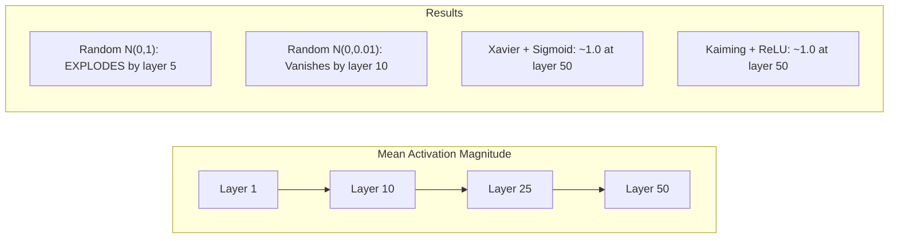
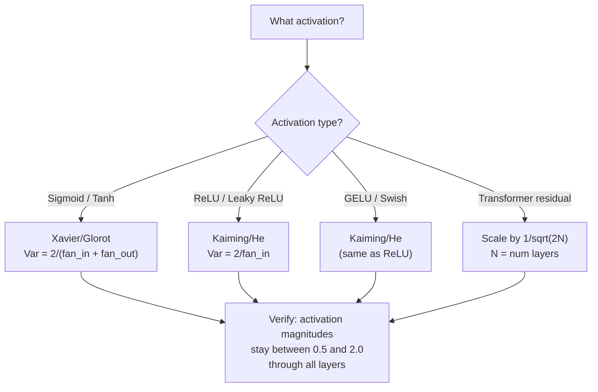

# 重み初期化と学習の安定性

> 初期化を間違えると学習は始まりません。正しく初期化すると、50 層でも 3 層のように滑らかに学習できます。

**種類:** Build
**言語:** Python
**前提:** Lesson 03.04 (Activation Functions), Lesson 03.07 (Regularization)
**時間:** 約 90 分

## 学習目標

- zero、random、Xavier/Glorot、Kaiming/He initialization strategies を実装し、50 layers を通じて activation magnitudes に与える影響を測定する
- Xavier init が Var(w) = 2/(fan_in + fan_out) を使い、Kaiming が Var(w) = 2/fan_in を使う理由を導出する
- zero initialization の symmetry problem を実演し、random scale だけでは不十分な理由を説明する
- activation function に正しい initialization strategy を対応させる: sigmoid/tanh には Xavier、ReLU/GELU には Kaiming

## 問題

すべての重みをゼロに初期化してください。何も学習しません。すべてのニューロンが同じ関数を計算し、同じ gradient を受け取り、同一に更新されます。10,000 epochs 後でも、512-neuron hidden layer は同じニューロンの 512 個のコピーのままです。512 個のパラメータに払ったのに、得られたのは 1 個分です。

重みを大きくしすぎて初期化してください。Activations はネットワークを通るにつれて爆発します。Layer 10 では値が 1e15 に達します。Layer 20 では infinity に overflow します。Gradients は逆向きに同じ軌跡をたどります。

標準正規分布からランダムに初期化してください。3 layers なら動きます。50 layers では、random scale がわずかに小さすぎるか大きすぎるかに応じて、signal はゼロに崩壊するか infinity に爆発します。「動く」と「壊れる」の境界は紙一重です。

重み初期化は、deep learning で最も過小評価されている判断です。Architecture は論文になります。Optimizers はブログ記事になります。Initialization は脚注になります。しかし間違えると、他のすべては意味を失います。ネットワークは学習が始まる前に死んでいます。

## 概念

### 対称性の問題

ある layer 内のすべてのニューロンは同じ構造を持ちます。入力に重みを掛け、bias を足し、activation を適用します。すべての重みが同じ値から始まると（ゼロはその極端な例です）、すべてのニューロンが同じ出力を計算します。Backpropagation では、すべてのニューロンが同じ gradient を受け取ります。Update step では、すべてのニューロンが同じ量だけ変化します。

身動きが取れません。ネットワークには数百のパラメータがありますが、すべてが足並みをそろえて動きます。これを symmetry と呼び、random initialization はそれを破る力技です。各ニューロンは weight space の異なる点から始まるため、それぞれが異なる feature を学びます。

しかし「ランダム」だけでは不十分です。ランダム性の *scale* が、ネットワークが学習できるかどうかを決めます。

### Layers を通る variance propagation

fan_in 個の入力を持つ単一 layer を考えます。

```
z = w1*x1 + w2*x2 + ... + w_n*x_n
```

各 weight wi が variance Var(w) の分布から引かれ、各 input xi が variance Var(x) を持つなら、出力 variance は次のようになります。

```
Var(z) = fan_in * Var(w) * Var(x)
```

Var(w) = 1 で fan_in = 512 なら、出力 variance は入力 variance の 512 倍です。10 layers 後: 512^10 = 1.2e27。signal は爆発しています。

Var(w) = 0.001 なら、出力 variance は layer ごとに 0.001 * 512 = 0.512 倍に縮みます。10 layers 後: 0.512^10 = 0.00013。signal は消えています。

目標は、Var(z) = Var(x) になるように Var(w) を選ぶことです。Signal magnitude が layers をまたいでも一定に保たれます。

### Xavier/Glorot Initialization

Glorot and Bengio (2010) は、sigmoid と tanh activations 向けの解を導きました。forward pass と backward pass の両方で variance を一定に保つには:

```
Var(w) = 2 / (fan_in + fan_out)
```

実務では、weights は次から引きます。

```
w ~ Uniform(-limit, limit)  where limit = sqrt(6 / (fan_in + fan_out))
```

または:

```
w ~ Normal(0, sqrt(2 / (fan_in + fan_out)))
```

これは、sigmoid と tanh がゼロ近傍ではほぼ線形であり、適切に初期化された activations はその領域にあるため機能します。Variance は何十 layers を通っても安定します。

### Kaiming/He Initialization

ReLU は出力の半分を殺します（負の値はすべてゼロになります）。平均的には入力の半分がゼロになるため、実効的な fan_in は半分になります。Xavier init はこれを考慮しないため、必要な variance を過小評価します。

He et al. (2015) は式を調整しました。

```
Var(w) = 2 / fan_in
```

Weights は次から引きます。

```
w ~ Normal(0, sqrt(2 / fan_in))
```

2 という係数は、ReLU が activations の半分をゼロにすることを補正します。これがないと、signal は layer ごとに約 0.5x に縮みます。50 layers では 0.5^50 = 8.8e-16 です。Kaiming init はこれを防ぎます。

### Transformer Initialization

GPT-2 は別のパターンを導入しました。Residual connections は各 sub-layer の出力を入力に足します。

```
x = x + sublayer(x)
```

各加算は variance を増やします。N 個の residual layers があると、variance は N に比例して増えます。GPT-2 は residual layers の weights を 1/sqrt(2N) でスケールします。ここで N は layers の数です。これにより、蓄積された signal magnitude が安定します。

Llama 3（405B parameters、126 layers）も似た仕組みを使います。この scaling がなければ、residual stream は 126 layers の attention と feedforward blocks を通る間に際限なく大きくなります。

```mermaid
flowchart TD
    subgraph "Zero Init"
        Z1["Layer 1<br/>All weights = 0"] --> Z2["Layer 2<br/>All neurons identical"]
        Z2 --> Z3["Layer 3<br/>Still identical"]
        Z3 --> ZR["Result: 1 effective neuron<br/>regardless of width"]
    end

    subgraph "Xavier Init"
        X1["Layer 1<br/>Var = 2/(fan_in+fan_out)"] --> X2["Layer 2<br/>Signal stable"]
        X2 --> X3["Layer 50<br/>Signal stable"]
        X3 --> XR["Result: Trains with<br/>sigmoid/tanh"]
    end

    subgraph "Kaiming Init"
        K1["Layer 1<br/>Var = 2/fan_in"] --> K2["Layer 2<br/>Signal stable"]
        K2 --> K3["Layer 50<br/>Signal stable"]
        K3 --> KR["Result: Trains with<br/>ReLU/GELU"]
    end
```



### 50 Layers を通る activation magnitude



### 正しい Init を選ぶ



## 作ってみる

### Step 1: Initialization Strategies

weight matrix を初期化する 4 つの方法です。それぞれ、fan_in columns と fan_out rows を持つ list of lists（2D matrix）を返します。

```python
import math
import random


def zero_init(fan_in, fan_out):
    return [[0.0 for _ in range(fan_in)] for _ in range(fan_out)]


def random_init(fan_in, fan_out, scale=1.0):
    return [[random.gauss(0, scale) for _ in range(fan_in)] for _ in range(fan_out)]


def xavier_init(fan_in, fan_out):
    std = math.sqrt(2.0 / (fan_in + fan_out))
    return [[random.gauss(0, std) for _ in range(fan_in)] for _ in range(fan_out)]


def kaiming_init(fan_in, fan_out):
    std = math.sqrt(2.0 / fan_in)
    return [[random.gauss(0, std) for _ in range(fan_in)] for _ in range(fan_out)]
```

### Step 2: Activation Functions

各 init strategy を意図された activation と組み合わせてテストするために、sigmoid、tanh、ReLU が必要です。

```python
def sigmoid(x):
    x = max(-500, min(500, x))
    return 1.0 / (1.0 + math.exp(-x))


def tanh_act(x):
    return math.tanh(x)


def relu(x):
    return max(0.0, x)
```

### Step 3: 50 Layers を通す Forward Pass

deep network に random data を通し、各 layer の mean activation magnitude を測定します。

```python
def forward_deep(init_fn, activation_fn, n_layers=50, width=64, n_samples=100):
    random.seed(42)
    layer_magnitudes = []

    inputs = [[random.gauss(0, 1) for _ in range(width)] for _ in range(n_samples)]

    for layer_idx in range(n_layers):
        weights = init_fn(width, width)
        biases = [0.0] * width

        new_inputs = []
        for sample in inputs:
            output = []
            for neuron_idx in range(width):
                z = sum(weights[neuron_idx][j] * sample[j] for j in range(width)) + biases[neuron_idx]
                output.append(activation_fn(z))
            new_inputs.append(output)
        inputs = new_inputs

        magnitudes = []
        for sample in inputs:
            magnitudes.append(sum(abs(v) for v in sample) / width)
        mean_mag = sum(magnitudes) / len(magnitudes)
        layer_magnitudes.append(mean_mag)

    return layer_magnitudes
```

### Step 4: 実験

すべての組み合わせを実行します。zero init、random N(0,1)、random N(0,0.01)、Xavier with sigmoid、Xavier with tanh、Kaiming with ReLU。主要な layers での magnitude を表示します。

```python
def run_experiment():
    configs = [
        ("Zero init + Sigmoid", lambda fi, fo: zero_init(fi, fo), sigmoid),
        ("Random N(0,1) + ReLU", lambda fi, fo: random_init(fi, fo, 1.0), relu),
        ("Random N(0,0.01) + ReLU", lambda fi, fo: random_init(fi, fo, 0.01), relu),
        ("Xavier + Sigmoid", xavier_init, sigmoid),
        ("Xavier + Tanh", xavier_init, tanh_act),
        ("Kaiming + ReLU", kaiming_init, relu),
    ]

    print(f"{'Strategy':<30} {'L1':>10} {'L5':>10} {'L10':>10} {'L25':>10} {'L50':>10}")
    print("-" * 80)

    for name, init_fn, act_fn in configs:
        mags = forward_deep(init_fn, act_fn)
        row = f"{name:<30}"
        for idx in [0, 4, 9, 24, 49]:
            val = mags[idx]
            if val > 1e6:
                row += f" {'EXPLODED':>10}"
            elif val < 1e-6:
                row += f" {'VANISHED':>10}"
            else:
                row += f" {val:>10.4f}"
        print(row)
```

### Step 5: Symmetry Demonstration

zero init が同一のニューロンを生むことを示します。

```python
def symmetry_demo():
    random.seed(42)
    weights = zero_init(2, 4)
    biases = [0.0] * 4

    inputs = [0.5, -0.3]
    outputs = []
    for neuron_idx in range(4):
        z = sum(weights[neuron_idx][j] * inputs[j] for j in range(2)) + biases[neuron_idx]
        outputs.append(sigmoid(z))

    print("\nSymmetry Demo (4 neurons, zero init):")
    for i, out in enumerate(outputs):
        print(f"  Neuron {i}: output = {out:.6f}")
    all_same = all(abs(outputs[i] - outputs[0]) < 1e-10 for i in range(len(outputs)))
    print(f"  All identical: {all_same}")
    print(f"  Effective parameters: 1 (not {len(weights) * len(weights[0])})")
```

### Step 6: Layer ごとの magnitude report

50 layers を通る activation magnitudes の視覚的な bar chart を表示します。

```python
def magnitude_report(name, magnitudes):
    print(f"\n{name}:")
    for i, mag in enumerate(magnitudes):
        if i % 5 == 0 or i == len(magnitudes) - 1:
            if mag > 1e6:
                bar = "X" * 50 + " EXPLODED"
            elif mag < 1e-6:
                bar = "." + " VANISHED"
            else:
                bar_len = min(50, max(1, int(mag * 10)))
                bar = "#" * bar_len
            print(f"  Layer {i+1:3d}: {bar} ({mag:.6f})")
```

## 使ってみる

PyTorch はこれらを built-in functions として提供しています。

```python
import torch
import torch.nn as nn

layer = nn.Linear(512, 256)

nn.init.xavier_uniform_(layer.weight)
nn.init.xavier_normal_(layer.weight)

nn.init.kaiming_uniform_(layer.weight, nonlinearity='relu')
nn.init.kaiming_normal_(layer.weight, nonlinearity='relu')

nn.init.zeros_(layer.bias)
```

`nn.Linear(512, 256)` を呼ぶと、PyTorch はデフォルトで Kaiming uniform initialization を使います。多くの単純なネットワークが「そのまま動く」のは、PyTorch がすでに正しい選択をしているからです。ただし custom architectures を作る場合や 20 layers を超えて深くする場合は、何が起きているかを理解し、必要ならデフォルトを上書きする必要があります。

Transformers では、HuggingFace models は通常 `_init_weights` method 内で initialization を処理します。GPT-2 の実装は residual projections を 1/sqrt(N) でスケールします。transformer をゼロから作るなら、これを自分で追加する必要があります。

## 完成物

このレッスンで作るもの:
- `outputs/prompt-init-strategy.md` - 重み初期化の問題を診断し、適切な戦略を推奨するプロンプト

## 演習

1. LeCun initialization（Var = 1/fan_in、SELU activation 向けに設計）を追加してください。LeCun init + tanh で 50-layer experiment を実行し、Xavier + tanh と比較してください。

2. GPT-2 residual scaling を実装してください。residual stream に加える前に、各 layer の出力に 1/sqrt(2*N) を掛けます。scaling あり・なしで 50 layers を実行し、residual magnitude がどれだけ速く増えるかを測定してください。

3. ネットワークの layer dimensions と activation type を受け取り、正しい initialization を推奨し、現在の init が問題を起こす場合は警告する "init health check" function を作成してください。

4. fan_in = 16 と fan_in = 1024 で実験を実行してください。Xavier と Kaiming は fan_in に適応しますが、random init は適応しません。層が大きくなるほど「動く」と「壊れる」の差がどれだけ広がるかを示してください。

5. orthogonal initialization を実装してください（random matrix を生成し、その SVD を計算し、orthogonal matrix U を使います）。50 layers の ReLU networks で Kaiming と比較してください。

## 重要用語

| 用語 | よく言われること | 実際の意味 |
|------|----------------|------------|
| Weight initialization | 「開始時の重みをランダムに設定する」 | ネットワークがそもそも学習できるかを決める初期 weight values の選び方 |
| Symmetry breaking | 「ニューロンを違うものにする」 | random initialization により、ニューロンが同じ関数を計算するのではなく異なる features を学ぶようにすること |
| Fan-in | 「ニューロンへの入力数」 | incoming connections の数。weighted sum で input variance がどのように蓄積するかを決める |
| Fan-out | 「ニューロンからの出力数」 | outgoing connections の数。backpropagation 中の gradient variance を保つ際に関係する |
| Xavier/Glorot init | 「sigmoid 用の初期化」 | Var(w) = 2/(fan_in + fan_out)。sigmoid と tanh activations を通して variance を保つために設計された |
| Kaiming/He init | 「ReLU 用の初期化」 | Var(w) = 2/fan_in。ReLU が activations の半分をゼロにすることを考慮する |
| Variance propagation | 「layers を通じて signals が増えるか縮むか」 | weight scale に基づいて activation variance が layer ごとにどう変化するかの数学的分析 |
| Residual scaling | 「GPT-2 の init trick」 | N 個の transformer layers を通じた variance growth を防ぐため、residual connection weights を 1/sqrt(2N) でスケールすること |
| Dead network | 「何も学習しない」 | 悪い initialization により、すべての gradients がゼロになる、またはすべての activations が飽和するネットワーク |
| Exploding activations | 「値が infinity に向かう」 | weight variance が高すぎて、activation magnitudes が layers を通じて指数的に増えること |

## 参考文献

- Glorot & Bengio, "Understanding the difficulty of training deep feedforward neural networks" (2010) - variance analysis を含む元の Xavier initialization 論文
- He et al., "Delving Deep into Rectifiers" (2015) - ReLU networks 向けの Kaiming initialization を導入した
- Radford et al., "Language Models are Unsupervised Multitask Learners" (2019) - residual scaling initialization を含む GPT-2 論文
- Mishkin & Matas, "All You Need is a Good Init" (2016) - layer-sequential unit-variance initialization。解析的な式に対する経験的な代替手法
