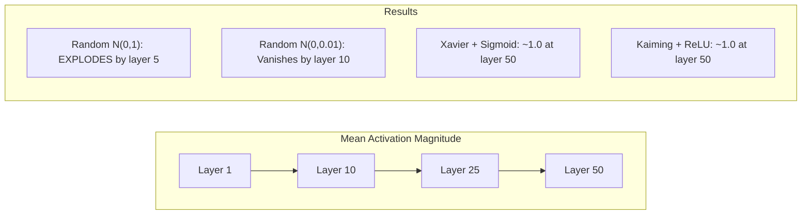
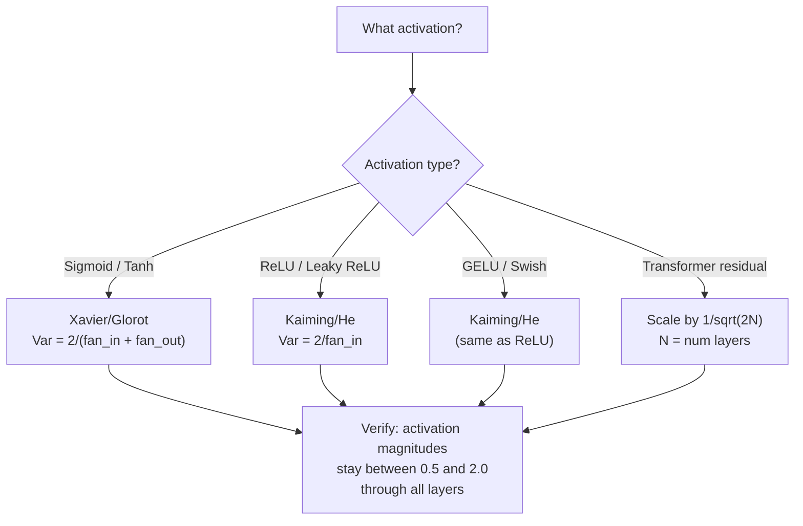

# Ağırlık Başlatma ve Eğitim Kararlılığı

> Yanlış başlattığınızda eğitim asla başlamaz. Sağdan başlatın ve 50 katman 3 kadar sorunsuz bir şekilde eğitilsin.

**Tür:** Yapım
**Diller:** Python
**Önkoşullar:** Ders 03.04 (Etkinleştirme İşlevleri), Ders 03.07 (Düzenleme)
**Süre:** ~90 dakika

## Öğrenme Hedefleri

- Sıfır, rastgele, Xavier/Glorot ve Kaiming/He başlatma stratejilerini uygulayın ve bunların aktivasyon büyüklükleri üzerindeki etkisini 50 katman aracılığıyla ölçün
- Xavier init'in neden Var(w) = 2/(fan_in + fan_out) kullandığını ve Kaiming'in neden Var(w) = 2/fan_in kullandığını öğrenin
- Sıfır başlatmayla simetri problemini gösterin ve rastgele ölçeğin neden tek başına yetersiz olduğunu açıklayın
- Doğru başlatma stratejisini aktivasyon fonksiyonuyla eşleştirin: sigmoid/tanh için Xavier, ReLU/GELU için Kaiming

## Sorun

Tüm ağırlıkları sıfıra sıfırlayın. Hiçbir şey öğrenmiyor. Her nöron aynı işlevi hesaplar, aynı gradient'yi alır ve aynı şekilde güncellenir. 10.000 çağdan sonra, 512 nöronlu gizli katmanınız hâlâ aynı nöronun 512 kopyasıdır. 512 parametre ödeyip 1 puan aldınız.

Bunları çok büyük başlat. Aktivasyonlar ağ üzerinden patlar. 10. katmanda değerler 1e15'e ulaştı. 20. katmana gelindiğinde sonsuza kadar taşarlar. Gradient'ler aynı yörüngeyi tersten takip eder.

Bunları standart normal dağılımdan rastgele başlatın. 3 katman için çalışır. 50 katmanda, rastgele ölçeğin biraz fazla küçük veya biraz fazla büyük olmasına bağlı olarak sinyal sıfıra çöker veya sonsuza kadar patlar. "Çalışmak" ile "kırık" arasındaki sınır çok incedir.

Ağırlık başlatma, deep learning'de en az önemsenen karardır. Mimarlık evrakları alıyor. Optimize ediciler blog gönderilerini alır. Başlatma bir dipnot alır. Ancak yanlış anlayın ve başka hiçbir şeyin önemi yok; ağınız, eğitim başlamadan önce ölmüştür.

## Konsept

### Simetri Sorunu

Bir katmandaki her nöron aynı yapıya sahiptir: girdileri ağırlıklarla çarpın, önyargı ekleyin, aktivasyon uygulayın. Tüm ağırlıklar aynı değerde başlarsa (sıfır en uç durumdur), her nöron aynı çıktıyı hesaplar. backpropagation sırasında her nöron aynı gradient'yi alır. Güncelleme adımı sırasında her nöron aynı miktarda değişir.

Sıkıştınız. Ağın yüzlerce parametresi vardır, ancak hepsi aynı anda hareket eder. Buna simetri denir ve rastgele başlatma, onu kırmanın kaba kuvvet yoludur. Her nöron ağırlık alanında farklı bir noktada başlar, dolayısıyla her biri farklı bir özelliği öğrenir.

Ancak "rastgele" yeterli değildir. Rastgeleliğin *ölçeği* ağın eğitilip eğitilmediğini belirler.

### Katmanlar Arasında Varyans Yayılımı

fan_in girişlerine sahip tek bir katman düşünün:

```
z = w1*x1 + w2*x2 + ... + w_n*x_n
```

Her wi ağırlığı Var(w) varyansına sahip bir dağılımdan alınıyorsa ve her girdi xi varyansa Var(x) sahipse, çıktı varyansı şöyle olur:

```
Var(z) = fan_in * Var(w) * Var(x)
```

Var(w) = 1 ve fan_in = 512 ise, çıkış varyansı giriş varyansının 512 katıdır. 10 katmandan sonra: 512^10 = 1,2e27. Sinyaliniz patladı.

Var(w) = 0,001 ise çıktı varyansı katman başına 0,001 * 512 = 0,512 kadar küçülür. 10 katmandan sonra: 0,512^10 = 0,00013. Sinyaliniz kayboldu.

Amaç: Var(w)'yi seçerek Var(z) = Var(x)'i seçin. Sinyal büyüklüğü katmanlar arasında sabit kalır.

### Xavier/Glorot Başlatma

Glorot ve Bengio (2010) sigmoid ve tanh aktivasyonları için çözüm türetmiştir. Hem ileri hem de geri geçişte varyansı sabit tutmak için:

```
Var(w) = 2 / (fan_in + fan_out)
```

Pratikte ağırlıklar aşağıdakilerden alınır:

```
w ~ Uniform(-limit, limit)  where limit = sqrt(6 / (fan_in + fan_out))
```

veya:

```
w ~ Normal(0, sqrt(2 / (fan_in + fan_out)))
```

Bu işe yarar çünkü sigmoid ve tanh, uygun şekilde başlatılan aktivasyonların yaşadığı sıfıra yakın kabaca doğrusaldır. Varyans düzinelerce katman boyunca sabit kalır.

### Kaiming/He Başlatma

ReLU çıktıların yarısını öldürür (negatif olan her şey sıfır olur). Etkin fan_in yarıya düşer çünkü ortalama olarak girişlerin yarısı sıfırlanır. Xavier init bunu hesaba katmıyor; ihtiyaç duyulan varyansı hafife alıyor.

O ve ark. (2015) formülü düzeltti:

```
Var(w) = 2 / fan_in
```

Ağırlıklar aşağıdakilerden alınır:

```
w ~ Normal(0, sqrt(2 / fan_in))
```

2 faktörü, ReLU'nun aktivasyonların yarısını sıfırlamasını telafi eder. Bu olmadan sinyal katman başına ~0,5 kat küçülür. 50 katmanla: 0,5^50 = 8,8e-16. Kaiming init bunu engeller.

### Transformer Başlatma

GPT-2 farklı bir model ortaya koydu. Artık bağlantılar, her alt katmanın çıkışını girişine ekler:

```
x = x + sublayer(x)
```

Her ekleme varyansı artırır. N artık katmanla, varyans N ile orantılı olarak büyür. GPT-2, artık katmanların ağırlıklarını 1/sqrt(2N) oranında ölçeklendirir; burada N, katman sayısıdır. Bu, biriken sinyal büyüklüğünü sabit tutar.

Llama 3 (405B parametreleri, 126 katman) benzer bir şema kullanır. Bu ölçeklendirme olmasaydı, kalan akış 126 dikkat katmanı ve ileri besleme blokları aracılığıyla sınırsız bir şekilde büyüyecekti.

```mermaid
flowchart TD
    subgraph "Zero Init"
        Z1["Layer 1<br/>All weights = 0"] --> Z2["Layer 2<br/>All neurons identical"]
        Z2 --> Z3["Layer 3<br/>Still identical"]
        Z3 --> ZR["Result: 1 effective neuron<br/>regardless of width"]
    end

    subgraph "Xavier Init"
        X1["Layer 1<br/>Var = 2/(fan_in+fan_out)"] --> X2["Layer 2<br/>Signal stable"]
        X2 --> X3["Layer 50<br/>Signal stable"]
        X3 --> XR["Result: Trains with<br/>sigmoid/tanh"]
    end

    subgraph "Kaiming Init"
        K1["Layer 1<br/>Var = 2/fan_in"] --> K2["Layer 2<br/>Signal stable"]
        K2 --> K3["Layer 50<br/>Signal stable"]
        K3 --> KR["Result: Trains with<br/>ReLU/GELU"]
    end
```



### 50 Katman Boyunca Aktivasyon Büyüklüğü



### Doğru Girişi Seçmek



```figure
weight-init-variance
```

## İnşa Et

### Adım 1: Başlatma Stratejileri

Ağırlık matrisini başlatmanın dört yolu. Her biri fan_in sütunları ve fan_out satırlarını içeren bir liste listesi (2 boyutlu matris) döndürür.

```python
import math
import random


def zero_init(fan_in, fan_out):
    return [[0.0 for _ in range(fan_in)] for _ in range(fan_out)]


def random_init(fan_in, fan_out, scale=1.0):
    return [[random.gauss(0, scale) for _ in range(fan_in)] for _ in range(fan_out)]


def xavier_init(fan_in, fan_out):
    std = math.sqrt(2.0 / (fan_in + fan_out))
    return [[random.gauss(0, std) for _ in range(fan_in)] for _ in range(fan_out)]


def kaiming_init(fan_in, fan_out):
    std = math.sqrt(2.0 / fan_in)
    return [[random.gauss(0, std) for _ in range(fan_in)] for _ in range(fan_out)]
```

### Adım 2: Etkinleştirme İşlevleri

Her bir başlatma stratejisini amaçlanan aktivasyonuyla test etmek için sigmoid, tanh ve ReLU'ya ihtiyacımız var.

```python
def sigmoid(x):
    x = max(-500, min(500, x))
    return 1.0 / (1.0 + math.exp(-x))


def tanh_act(x):
    return math.tanh(x)


def relu(x):
    return max(0.0, x)
```

### Adım 3: 50 Katman Üzerinden İleri Geçiş

Rastgele verileri derin bir ağ üzerinden geçirin ve her katmandaki ortalama aktivasyon büyüklüğünü ölçün.

```python
def forward_deep(init_fn, activation_fn, n_layers=50, width=64, n_samples=100):
    random.seed(42)
    layer_magnitudes = []

    inputs = [[random.gauss(0, 1) for _ in range(width)] for _ in range(n_samples)]

    for layer_idx in range(n_layers):
        weights = init_fn(width, width)
        biases = [0.0] * width

        new_inputs = []
        for sample in inputs:
            output = []
            for neuron_idx in range(width):
                z = sum(weights[neuron_idx][j] * sample[j] for j in range(width)) + biases[neuron_idx]
                output.append(activation_fn(z))
            new_inputs.append(output)
        inputs = new_inputs

        magnitudes = []
        for sample in inputs:
            magnitudes.append(sum(abs(v) for v in sample) / width)
        mean_mag = sum(magnitudes) / len(magnitudes)
        layer_magnitudes.append(mean_mag)

    return layer_magnitudes
```

### Adım 4: Deney

Tüm kombinasyonları çalıştırın: sıfır başlangıç, rastgele N(0,1), rastgele N(0,0.01), sigmoid ile Xavier, tanh ile Xavier, ReLU ile Kaiming. Anahtar katmanlardaki büyüklüğü yazdırın.

```python
def run_experiment():
    configs = [
        ("Zero init + Sigmoid", lambda fi, fo: zero_init(fi, fo), sigmoid),
        ("Random N(0,1) + ReLU", lambda fi, fo: random_init(fi, fo, 1.0), relu),
        ("Random N(0,0.01) + ReLU", lambda fi, fo: random_init(fi, fo, 0.01), relu),
        ("Xavier + Sigmoid", xavier_init, sigmoid),
        ("Xavier + Tanh", xavier_init, tanh_act),
        ("Kaiming + ReLU", kaiming_init, relu),
    ]

    print(f"{'Strategy':<30} {'L1':>10} {'L5':>10} {'L10':>10} {'L25':>10} {'L50':>10}")
    print("-" * 80)

    for name, init_fn, act_fn in configs:
        mags = forward_deep(init_fn, act_fn)
        row = f"{name:<30}"
        for idx in [0, 4, 9, 24, 49]:
            val = mags[idx]
            if val > 1e6:
                row += f" {'EXPLODED':>10}"
            elif val < 1e-6:
                row += f" {'VANISHED':>10}"
            else:
                row += f" {val:>10.4f}"
        print(row)
```

### Adım 5: Simetri Gösterimi

Sıfır init'in aynı nöronları ürettiğini gösterin.

```python
def symmetry_demo():
    random.seed(42)
    weights = zero_init(2, 4)
    biases = [0.0] * 4

    inputs = [0.5, -0.3]
    outputs = []
    for neuron_idx in range(4):
        z = sum(weights[neuron_idx][j] * inputs[j] for j in range(2)) + biases[neuron_idx]
        outputs.append(sigmoid(z))

    print("\nSymmetry Demo (4 neurons, zero init):")
    for i, out in enumerate(outputs):
        print(f"  Neuron {i}: output = {out:.6f}")
    all_same = all(abs(outputs[i] - outputs[0]) < 1e-10 for i in range(len(outputs)))
    print(f"  All identical: {all_same}")
    print(f"  Effective parameters: 1 (not {len(weights) * len(weights[0])})")
```

### Adım 6: Katman Katman Büyüklük Raporu

50 katman boyunca aktivasyon büyüklüklerini gösteren görsel bir çubuk grafiği yazdırın.

```python
def magnitude_report(name, magnitudes):
    print(f"\n{name}:")
    for i, mag in enumerate(magnitudes):
        if i % 5 == 0 or i == len(magnitudes) - 1:
            if mag > 1e6:
                bar = "X" * 50 + " EXPLODED"
            elif mag < 1e-6:
                bar = "." + " VANISHED"
            else:
                bar_len = min(50, max(1, int(mag * 10)))
                bar = "#" * bar_len
            print(f"  Layer {i+1:3d}: {bar} ({mag:.6f})")
```

## Kullan onu

PyTorch bunları yerleşik işlevler olarak sağlar:

```python
import torch
import torch.nn as nn

layer = nn.Linear(512, 256)

nn.init.xavier_uniform_(layer.weight)
nn.init.xavier_normal_(layer.weight)

nn.init.kaiming_uniform_(layer.weight, nonlinearity='relu')
nn.init.kaiming_normal_(layer.weight, nonlinearity='relu')

nn.init.zeros_(layer.bias)
```

`nn.Linear(512, 256)`'yi çağırdığınızda, PyTorch varsayılan olarak Kaiming tek tip başlatmayı kullanır. Bu nedenle çoğu basit ağ "sadece çalışır"; PyTorch zaten doğru seçimi yapmıştır. Ancak özel mimariler oluşturduğunuzda veya 20 katmandan daha derine indiğinizde, neler olduğunu anlamanız ve potansiyel olarak varsayılanı geçersiz kılmanız gerekir.

transformer'ler için HuggingFace modelleri genellikle başlatma işlemini `_init_weights` yöntemlerinde gerçekleştirir. GPT-2'nin uygulanması, kalan projeksiyonları 1/sqrt(N) oranında ölçeklendirir. Sıfırdan bir transformer oluşturuyorsanız bunu kendiniz eklemeniz gerekir.

## Gönderin

Bu ders şunları üretir:
- `outputs/prompt-init-strategy.md` -- ağırlık başlatma sorunlarını teşhis eden ve doğru stratejiyi öneren bir prompt

## Egzersizler

1. LeCun başlatmasını ekleyin (Var = 1/fan_in, SELU aktivasyonu için tasarlanmıştır). 50 katmanlı deneyi LeCun init + tanh ile çalıştırın ve Xavier + tanh ile karşılaştırın.

2. GPT-2 artık ölçeklendirmeyi uygulayın: artık akışa eklemeden önce her katmanın çıktısını 1/sqrt(2*N) ile çarpın. Ölçeklendirmeli ve ölçeksiz 50 katman çalıştırın, kalan büyüklüğün ne kadar hızlı büyüdüğünü ölçün.

3. Bir ağın katman boyutlarını ve etkinleştirme türünü alan, ardından doğru başlatmayı öneren ve mevcut başlatmanın sorunlara neden olup olmayacağı konusunda uyarıda bulunan bir "başlatma sağlık kontrolü" işlevi oluşturun.

4. Deneyi fan_in = 16 ve fan_in = 1024 ile çalıştırın. Xavier ve Kaiming fan_in'e uyum sağlar ancak random init uyum sağlamaz. Daha büyük katmanlarla "çalışıyor" ve "kırılıyor" arasındaki boşluğun nasıl genişlediğini gösterin.

5. Dik başlatmayı uygulayın (rastgele bir matris oluşturun, SVD'sini hesaplayın, dik matris U'yu kullanın). 50 katmandaki ReLU ağları için Kaiming ile karşılaştırın.

## Anahtar Terimler

| Dönem | İnsanlar ne diyor | Aslında ne anlama geliyor |
|------|----------------|----------------------|
| Ağırlık başlatma | "Başlangıç ​​ağırlıklarını rastgele ayarla" | Bir ağın eğitim alıp alamayacağını belirleyen başlangıç ​​ağırlık değerlerini seçme stratejisi |
| Simetri kırılması | "Nöronları farklılaştırın" | Nöronların aynı işlevleri hesaplamak yerine farklı özellikleri öğrenmesini sağlamak için rastgele başlatmayı kullanma |
| Fan girişi | "Bir nörona yapılan giriş sayısı" | Giriş varyansının ağırlıklı toplamda nasıl birikeceğini belirleyen gelen bağlantıların sayısı |
| Fan çıkışı | "Bir nörondan gelen çıktıların sayısı" | backpropagation sırasında gradient varyansının korunmasıyla ilgili giden bağlantıların sayısı |
| Xavier/Glorot başlangıç ​​| "Sigmoid başlatma" | Var(w) = 2/(fan_in + fan_out), sigmoid ve tanh aktivasyonları aracılığıyla varyansı korumak için tasarlanmıştır |
| Kaiming/O init | "ReLU'nun başlatılması" | Var(w) = 2/fan_in, ReLU'nun aktivasyonların yarısını sıfırlamasını açıklıyor |
| Varyans yayılımı | "Sinyaller katmanlar arasında nasıl büyür veya küçülür?" | Etkinleştirme varyansının ağırlık ölçeğine göre katman katman nasıl değiştiğinin matematiksel analizi |
| Artık ölçeklendirme | "GPT-2'nin başlangıç ​​numarası" | N transformer katmanı boyunca varyans artışını önlemek için artık bağlantı ağırlıklarını 1/sqrt(2N) oranında ölçeklendirme |
| Ölü ağ | "Hiçbir şey trene binmiyor" | Kötü başlatmanın tüm gradient'lerin sıfır olmasına veya tüm etkinleştirmelerin doymasına neden olduğu bir ağ |
| Patlayan aktivasyonlar | "Değerler sonsuza gider" | Ağırlık farkı çok yüksek olduğunda, aktivasyon büyüklüklerinin katmanlar boyunca katlanarak büyümesine neden olur |

## Daha Fazla Okuma

- Glorot ve Bengio, "Derin ileri beslemeli neural network'lerin eğitiminin zorluğunu anlamak" (2010) -- varyans analizi içeren orijinal Xavier başlatma makalesi
- He ve diğerleri, "Delving Deep into Redresörler" (2015) -- ReLU ağları için Kaiming başlatmayı tanıttı
- Radford ve diğerleri, "Dil Modelleri Denetimsiz Çoklu Görev Öğrenicileridir" (2019) -- Artık ölçeklendirme başlatmayı içeren GPT-2 makalesi
- Mishkin & Matas, "All You Need is a Good Init" (2016) -- katman-sıralı birim-varyans başlatma, analitik formüllere ampirik bir alternatif
