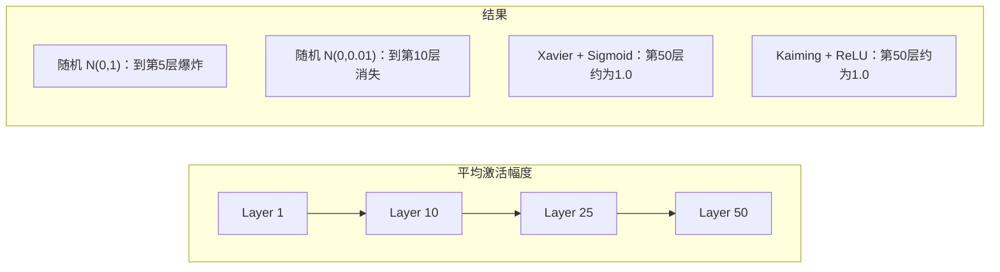
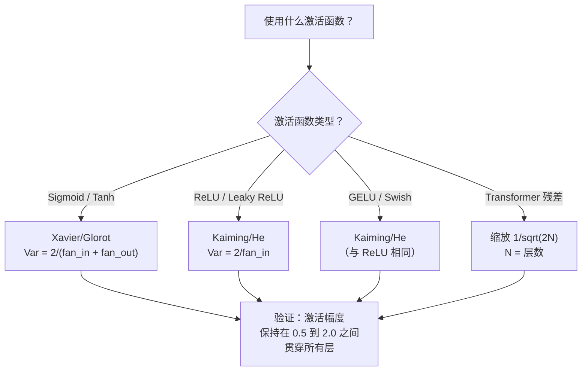

# 权重初始化与训练稳定性

> 初始化错误，训练永远无法开始。初始化正确，50层网络也能像3层一样顺畅训练。

**类型：** 构建
**语言：** Python
**先修知识：** 第03.04课（激活函数）、第03.07课（正则化）
**时间：** 约90分钟

## 学习目标

- 实现零值、随机、Xavier/Glorot 和 Kaiming/He 初始化策略，并通过50层网络测量它们对激活幅度的影响
- 推导为什么 Xavier 初始化使用 Var(w) = 2/(fan_in + fan_out)，而 Kaiming 初始化使用 Var(w) = 2/fan_in
- 演示零值初始化的对称性（Symmetry）问题，并解释为何仅靠随机规模是不够的
- 将正确的初始化策略与激活函数匹配：Xavier 用于 sigmoid/tanh，Kaiming 用于 ReLU/GELU

## 问题

将所有权重初始化为零。什么也学不到。每个神经元计算相同的函数，接收相同的梯度，执行完全相同的更新。经过10,000个epoch后，你的512神经元隐藏层仍然是512个相同神经元的复制品。你为512个参数付了钱，只得到了1个。

初始化得太大。激活值在网络中爆炸。到第10层，数值达到1e15。到第20层，它们溢出到无穷大。梯度在反向传播中也会经历同样的轨迹。

从标准正态分布随机初始化。3层可行。50层时，信号要么坍缩到零，要么爆炸到无穷大，具体取决于随机规模是略小还是略大。从"可行"到"崩溃"的边界细如刀刃。

权重初始化是深度学习中最被低估的决策。架构写论文，优化器写博客，初始化只配一个脚注。但一旦搞错，其他一切都无关紧要——你的网络在训练开始前就已经死了。

## 概念

### 对称性问题（Symmetry Problem）

一层中的每个神经元结构相同：输入乘以权重，加上偏置，应用激活函数。如果所有权重从相同的值开始（零值是极端情况），每个神经元计算相同的输出。在反向传播（Backpropagation）期间，每个神经元接收相同的梯度。在更新步骤中，每个神经元变化相同的量。

你被困住了。网络有数百个参数，但它们都同步移动。这称为对称性（Symmetry），而随机初始化就是打破它的粗暴方式。每个神经元从权重空间的不同点开始，因此每个神经元学习不同的特征。

但"随机"还不够。随机性的*规模化*决定了网络能否训练。

### 跨层的方差传播（Variance Propagation）

考虑一个具有 fan_in 个输入的单个层：

```
z = w1*x1 + w2*x2 + ... + w_n*x_n
```

如果每个权重 wi 来自方差为 Var(w) 的分布，每个输入 xi 具有方差 Var(x)，则输出方差为：

```
Var(z) = fan_in * Var(w) * Var(x)
```

如果 Var(w) = 1 且 fan_in = 512，则输出方差是输入方差的 512 倍。经过 10 层后：512^10 = 1.2e27。信号爆炸了。

如果 Var(w) = 0.001，则输出方差每层缩小 0.001 * 512 = 0.512 倍。经过 10 层后：0.512^10 = 0.00013。信号消失了。

目标：选择 Var(w) 使得 Var(z) = Var(x)。信号幅度跨层保持恒定。

### Xavier/Glorot 初始化

Glorot 和 Bengio（2010）推导出了用于 sigmoid 和 tanh 激活函数的解决方案。为了在前向和反向传播中保持方差恒定：

```
Var(w) = 2 / (fan_in + fan_out)
```

实践中，权重从以下分布中抽取：

```
w ~ Uniform(-limit, limit)  其中 limit = sqrt(6 / (fan_in + fan_out))
```

或：

```
w ~ Normal(0, sqrt(2 / (fan_in + fan_out)))
```

这之所以有效，是因为 sigmoid 和 tanh 在零附近大致线性，而恰当初始化的激活值正位于此。方差在数十层中保持稳定。

### Kaiming/He 初始化

ReLU 杀死了半数输出（所有负数变为零）。有效 fan_in 减半，因为平均一半的输入被置零。Xavier 初始化没有考虑到这一点——它低估了所需方差。

He 等人（2015）调整了公式：

```
Var(w) = 2 / fan_in
```

权重从以下分布中抽取：

```
w ~ Normal(0, sqrt(2 / fan_in))
```

因子 2 补偿了 ReLU 将一半激活值置零的影响。没有它，信号每层收缩约 0.5 倍。50 层时：0.5^50 = 8.8e-16。Kaiming 初始化阻止了这一点。

### Transformer 初始化

GPT-2 引入了一种不同模式。残差连接（Residual connection）将每个子层的输出加到其输入上：

```
x = x + sublayer(x)
```

每次加法都会增加方差。对于 N 个残差层，方差与 N 成正比增长。GPT-2 将残差层的权重缩放 1/sqrt(2N)，其中 N 是层数。这保持了累积信号幅度的稳定。

Llama 3（405B 参数，126 层）使用了类似的方案。没有这种缩放，残差流（Residual stream）将通过 126 层的注意力（Attention）和前馈（Feedforward）块无界增长。

```mermaid
flowchart TD
    subgraph "零值初始化"
        Z1["Layer 1<br/>所有权重 = 0"] --> Z2["Layer 2<br/>所有神经元相同"]
        Z2 --> Z3["Layer 3<br/>仍然相同"]
        Z3 --> ZR["结果：1个有效神经元<br/>无论宽度如何"]
    end

    subgraph "Xavier 初始化"
        X1["Layer 1<br/>Var = 2/(fan_in+fan_out)"] --> X2["Layer 2<br/>信号稳定"]
        X2 --> X3["Layer 50<br/>信号稳定"]
        X3 --> XR["结果：可训练<br/>使用 sigmoid/tanh"]
    end

    subgraph "Kaiming 初始化"
        K1["Layer 1<br/>Var = 2/fan_in"] --> K2["Layer 2<br/>信号稳定"]
        K2 --> K3["Layer 50<br/>信号稳定"]
        K3 --> KR["结果：可训练<br/>使用 ReLU/GELU"]
    end
```



### 50层间的激活幅度



### 选择合适的初始化



## 动手构建

### 第一步：初始化策略

四种初始化权重矩阵的方法。每个返回一个列表的列表（二维矩阵），具有 fan_in 列和 fan_out 行。

```python
import math
import random


def zero_init(fan_in, fan_out):
    return [[0.0 for _ in range(fan_in)] for _ in range(fan_out)]


def random_init(fan_in, fan_out, scale=1.0):
    return [[random.gauss(0, scale) for _ in range(fan_in)] for _ in range(fan_out)]


def xavier_init(fan_in, fan_out):
    std = math.sqrt(2.0 / (fan_in + fan_out))
    return [[random.gauss(0, std) for _ in range(fan_in)] for _ in range(fan_out)]


def kaiming_init(fan_in, fan_out):
    std = math.sqrt(2.0 / fan_in)
    return [[random.gauss(0, std) for _ in range(fan_in)] for _ in range(fan_out)]
```

### 第二步：激活函数

我们需要 sigmoid、tanh 和 ReLU 来测试每个初始化策略与其预期激活函数的搭配。

```python
def sigmoid(x):
    x = max(-500, min(500, x))
    return 1.0 / (1.0 + math.exp(-x))


def tanh_act(x):
    return math.tanh(x)


def relu(x):
    return max(0.0, x)
```

### 第三步：50层前向传播

将随机数据通过一个深层网络，并测量每个层的平均激活幅度。

```python
def forward_deep(init_fn, activation_fn, n_layers=50, width=64, n_samples=100):
    random.seed(42)
    layer_magnitudes = []

    inputs = [[random.gauss(0, 1) for _ in range(width)] for _ in range(n_samples)]

    for layer_idx in range(n_layers):
        weights = init_fn(width, width)
        biases = [0.0] * width

        new_inputs = []
        for sample in inputs:
            output = []
            for neuron_idx in range(width):
                z = sum(weights[neuron_idx][j] * sample[j] for j in range(width)) + biases[neuron_idx]
                output.append(activation_fn(z))
            new_inputs.append(output)
        inputs = new_inputs

        magnitudes = []
        for sample in inputs:
            magnitudes.append(sum(abs(v) for v in sample) / width)
        mean_mag = sum(magnitudes) / len(magnitudes)
        layer_magnitudes.append(mean_mag)

    return layer_magnitudes
```

### 第四步：实验

运行所有组合：零值初始化、随机 N(0,1)、随机 N(0,0.01)、Xavier + sigmoid、Xavier + tanh、Kaiming + ReLU。打印关键层的幅度。

```python
def run_experiment():
    configs = [
        ("Zero init + Sigmoid", lambda fi, fo: zero_init(fi, fo), sigmoid),
        ("Random N(0,1) + ReLU", lambda fi, fo: random_init(fi, fo, 1.0), relu),
        ("Random N(0,0.01) + ReLU", lambda fi, fo: random_init(fi, fo, 0.01), relu),
        ("Xavier + Sigmoid", xavier_init, sigmoid),
        ("Xavier + Tanh", xavier_init, tanh_act),
        ("Kaiming + ReLU", kaiming_init, relu),
    ]

    print(f"{'策略':<30} {'L1':>10} {'L5':>10} {'L10':>10} {'L25':>10} {'L50':>10}")
    print("-" * 80)

    for name, init_fn, act_fn in configs:
        mags = forward_deep(init_fn, act_fn)
        row = f"{name:<30}"
        for idx in [0, 4, 9, 24, 49]:
            val = mags[idx]
            if val > 1e6:
                row += f" {'爆炸':>10}"
            elif val < 1e-6:
                row += f" {'消失':>10}"
            else:
                row += f" {val:>10.4f}"
        print(row)
```

### 第五步：对称性演示

展示零值初始化产生相同的神经元。

```python
def symmetry_demo():
    random.seed(42)
    weights = zero_init(2, 4)
    biases = [0.0] * 4

    inputs = [0.5, -0.3]
    outputs = []
    for neuron_idx in range(4):
        z = sum(weights[neuron_idx][j] * inputs[j] for j in range(2)) + biases[neuron_idx]
        outputs.append(sigmoid(z))

    print("\n对称性演示（4个神经元，零值初始化）：")
    for i, out in enumerate(outputs):
        print(f"  神经元 {i}: 输出 = {out:.6f}")
    all_same = all(abs(outputs[i] - outputs[0]) < 1e-10 for i in range(len(outputs)))
    print(f"  所有输出相同：{all_same}")
    print(f"  有效参数数量：1（而不是 {len(weights) * len(weights[0])}）")
```

### 第六步：逐层幅度报告

打印50层间激活幅度的可视化条形图。

```python
def magnitude_report(name, magnitudes):
    print(f"\n{name}:")
    for i, mag in enumerate(magnitudes):
        if i % 5 == 0 or i == len(magnitudes) - 1:
            if mag > 1e6:
                bar = "X" * 50 + " 爆炸"
            elif mag < 1e-6:
                bar = "." + " 消失"
            else:
                bar_len = min(50, max(1, int(mag * 10)))
                bar = "#" * bar_len
            print(f"  层 {i+1:3d}: {bar} ({mag:.6f})")
```

## 使用它

PyTorch 将这些作为内置函数提供：

```python
import torch
import torch.nn as nn

layer = nn.Linear(512, 256)

nn.init.xavier_uniform_(layer.weight)
nn.init.xavier_normal_(layer.weight)

nn.init.kaiming_uniform_(layer.weight, nonlinearity='relu')
nn.init.kaiming_normal_(layer.weight, nonlinearity='relu')

nn.init.zeros_(layer.bias)
```

当你调用 `nn.Linear(512, 256)` 时，PyTorch 默认使用 Kaiming 均匀初始化。这就是为什么大多数简单网络"开箱即用"——PyTorch 已经做出了正确的选择。但当你构建自定义架构或深入超过20层时，你需要理解正在发生的事情并可能覆盖默认值。

对于 Transformer，HuggingFace 模型通常在其 `_init_weights` 方法中处理初始化。GPT-2 的实现将残差投影按 1/sqrt(N) 缩放。如果你从头构建 Transformer，需要自己添加这个。

## 交付

本课程产出：
- `outputs/prompt-init-strategy.md` -- 一个用于诊断权重初始化问题并推荐正确策略的提示词

## 练习

1. 添加 LeCun 初始化（Var = 1/fan_in，专为 SELU 激活设计）。运行50层实验，使用 LeCun 初始化 + tanh，并与 Xavier + tanh 进行比较。

2. 实现 GPT-2 残差缩放：在将每一层输出加到残差流之前，乘以 1/sqrt(2*N)。运行50层，带缩放和不带缩放，测量残差幅度增长的速度。

3. 创建一个"初始化健康检查"函数，接收网络的层维度和激活类型，然后推荐正确的初始化，并在当前初始化会导致问题时发出警告。

4. 使用 fan_in = 16 和 fan_in = 1024 运行实验。Xavier 和 Kaiming 适应 fan_in，但随机初始化不适用。展示"可行"和"失败"之间的差距如何随着更大层而扩大。

5. 实现正交初始化（Orthogonal initialization）：生成一个随机矩阵，计算其 SVD，使用正交矩阵 U。在50层 ReLU 网络中与 Kaiming 进行比较。

## 关键术语

| 术语 | 人们说的 | 实际含义 |
|------|---------|---------|
| 权重初始化（Weight initialization） | "随机设置初始权重" | 选择初始权重值的策略，决定网络能否训练 |
| 对称性打破（Symmetry breaking） | "让神经元不同" | 使用随机初始化确保神经元学习不同特征，而不是计算相同函数 |
| 扇入（Fan-in） | "神经元的输入数量" | 输入连接的数量，决定了输入方差如何在加权和中累积 |
| 扇出（Fan-out） | "神经元的输出数量" | 输出连接的数量，与反向传播中梯度方差的维持相关 |
| Xavier/Glorot 初始化 | "sigmoid 初始化" | Var(w) = 2/(fan_in + fan_out)，专为通过 sigmoid 和 tanh 激活保持方差设计 |
| Kaiming/He 初始化 | "ReLU 初始化" | Var(w) = 2/fan_in，考虑了 ReLU 将一半激活值置零的影响 |
| 方差传播（Variance propagation） | "信号如何在层间增长或缩小" | 基于权重规模分析激活