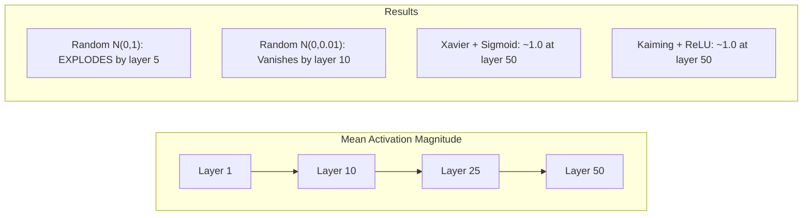
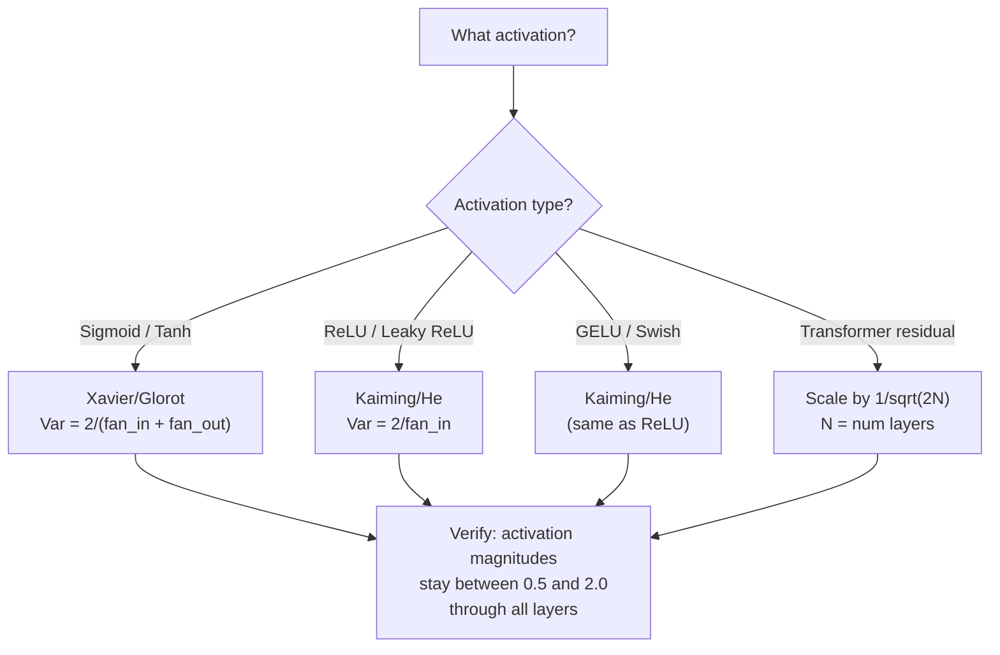

# 体重平衡和训练稳定性

> 初始化错误，培训将永远无法开始。正确初始化，50层训练就像3层一样顺利。

** 类型：** 构建
** 语言：** Python
** 前提：** 课03.04（激活函数），课03.07（正则化）
** 时间：** ~90分钟

## 学习目标

- 实施零、随机、Xavier/Glorot和Kaiming/He初始化策略，并通过50层测量它们对激活幅度的影响
- 推导为什么Xavier initit使用Var（w）= 2/（fan_in + fan_out）而Kaiming使用Var（w）= 2/fan_in
- 演示零初始化的对称性问题，并解释为什么单独的随机尺度是不够的
- 将正确的初始化策略与激活函数匹配：Xavier代表sigmoid/tanh，Kaiming代表ReLU/GELU

## 问题

将所有权重初始化为零。什么也学不到。每个神经元计算相同的函数，接收相同的梯度，并相同的更新。10，000个历元后，您的512个神经元隐藏层仍然是同一神经元的512个副本。您支付了512个参数，得到了1个。

初始化它们太大。激活通过网络爆炸式增长。到了第10层，值达到1 e15。到了第20层，它们溢出到无限。学生们反向遵循相同的轨迹。

根据标准正态分布随机初始化它们。适用于3层。在50层时，信号会崩溃为零或爆炸至无限大，具体取决于随机尺度是稍微太小还是稍微太大。“作品”和“破碎”之间的界限非常狭窄。

权重初始化是深度学习中最被低估的决定。建筑获得论文。优化者获取博客文章。收件箱得到一个脚注。但如果做错了，其他都不重要了--在培训开始之前，您的网络就死了。

## 概念

### 对称性问题

层中的每个神经元都具有相同的结构：将输入乘以权重、添加偏差、应用激活。如果所有权重从相同的值开始（零是极端情况），则每个神经元计算相同的输出。在反向传播期间，每个神经元都接收相同的梯度。在更新步骤期间，每个神经元的变化量相同。

你被困住了。这个网络有数百个参数，但它们都是步调一致的。这就是所谓的对称性，随机初始化是打破对称性的暴力方式，每个神经元都从权重空间中的不同点开始，因此每个神经元都学习不同的特征。

但“随机”还不够。随机性的“规模”决定了网络是否训练。

### 层间方差传播

考虑具有fan_in输入的单层：

```
z = w1*x1 + w2*x2 + ... + w_n*x_n
```

如果每个权重wi是从具有方差Var（w）的分布中提取的，并且每个输入xi具有方差Var（x），则输出方差是：

```
Var(z) = fan_in * Var(w) * Var(x)
```

如果Var（w）= 1且fan_in = 512，则输出方差是输入方差的512 x。10层后：512#10 = 1.2e27。你的信号爆炸了。

如果Var（w）= 0.001，则输出方差每层缩小0.001 * 512 = 0.512。10层后：0.512#10 = 0.00013。你的信号消失了。

目标：选择Var（w），使Var（z）= Var（x）。信号幅度在各个层之间保持不变。

### 泽维尔/格洛洛特

Glorot和Bengio（2010）推导出了Sigmoid和tanh激活的解决方案。要在向前和向后传递中保持方差恒定：

```
Var(w) = 2 / (fan_in + fan_out)
```

在实践中，权重来自：

```
w ~ Uniform(-limit, limit)  where limit = sqrt(6 / (fan_in + fan_out))
```

或者：

```
w ~ Normal(0, sqrt(2 / (fan_in + fan_out)))
```

这是有效的，因为sigmoid和tanh在零附近大致呈线性，其中存在正确初始化的激活。方差在数十层中保持稳定。

### 开明/贺

ReLU会杀死一半的输出（所有负值都变成零）。有效的fan_in减半，因为平均一半的输入被归零。Xavier initit没有考虑到这一点--它低估了所需的方差。

他等人（2015）调整了公式：

```
Var(w) = 2 / fan_in
```

权重来自：

```
w ~ Normal(0, sqrt(2 / fan_in))
```

因子2补偿了ReLU将一半激活归零。如果没有它，信号每层会缩小约0.5倍。50层：0.5#50 = 8.8e-16。Kaiming initit防止了这种情况。

### Transformer收件箱

GPT-2引入了不同的模式。剩余连接将每个子层的输出添加到其输入：

```
x = x + sublayer(x)
```

每次增加都会增加方差。对于N个剩余层，方差与N成比例增长。GPT-2将剩余层的权重按1/平方（2N）缩放，其中N是层的数量。这使累积的信号幅度保持稳定。

Lama 3（405 B参数，126层）使用类似的方案。如果没有这种缩放，剩余流将通过126层注意力和前向块无限增长。

```mermaid
flowchart TD
    subgraph "Zero Init"
        Z1["Layer 1<br/>All weights = 0"] --> Z2["Layer 2<br/>All neurons identical"]
        Z2 --> Z3["Layer 3<br/>Still identical"]
        Z3 --> ZR["Result: 1 effective neuron<br/>regardless of width"]
    end

    subgraph "Xavier Init"
        X1["Layer 1<br/>Var = 2/(fan_in+fan_out)"] --> X2["Layer 2<br/>Signal stable"]
        X2 --> X3["Layer 50<br/>Signal stable"]
        X3 --> XR["Result: Trains with<br/>sigmoid/tanh"]
    end

    subgraph "Kaiming Init"
        K1["Layer 1<br/>Var = 2/fan_in"] --> K2["Layer 2<br/>Signal stable"]
        K2 --> K3["Layer 50<br/>Signal stable"]
        K3 --> KR["Result: Trains with<br/>ReLU/GELU"]
    end
```



### 50层激活幅度



### 选择正确的初始化



## 建设党

### 第1步：删除策略

初始化权重矩阵的四种方法。每个都返回包含fan_in列和fan_out行的列表列表（2D矩阵）。

```python
import math
import random


def zero_init(fan_in, fan_out):
    return [[0.0 for _ in range(fan_in)] for _ in range(fan_out)]


def random_init(fan_in, fan_out, scale=1.0):
    return [[random.gauss(0, scale) for _ in range(fan_in)] for _ in range(fan_out)]


def xavier_init(fan_in, fan_out):
    std = math.sqrt(2.0 / (fan_in + fan_out))
    return [[random.gauss(0, std) for _ in range(fan_in)] for _ in range(fan_out)]


def kaiming_init(fan_in, fan_out):
    std = math.sqrt(2.0 / fan_in)
    return [[random.gauss(0, std) for _ in range(fan_in)] for _ in range(fan_out)]
```

### 第2步：激活功能

我们需要sigmoid、tanh和ReLU来测试每个初始化策略及其预期激活。

```python
def sigmoid(x):
    x = max(-500, min(500, x))
    return 1.0 / (1.0 + math.exp(-x))


def tanh_act(x):
    return math.tanh(x)


def relu(x):
    return max(0.0, x)
```

### 第3步：向前穿过50层

通过深度网络传递随机数据，并测量每层的平均激活幅度。

```python
def forward_deep(init_fn, activation_fn, n_layers=50, width=64, n_samples=100):
    random.seed(42)
    layer_magnitudes = []

    inputs = [[random.gauss(0, 1) for _ in range(width)] for _ in range(n_samples)]

    for layer_idx in range(n_layers):
        weights = init_fn(width, width)
        biases = [0.0] * width

        new_inputs = []
        for sample in inputs:
            output = []
            for neuron_idx in range(width):
                z = sum(weights[neuron_idx][j] * sample[j] for j in range(width)) + biases[neuron_idx]
                output.append(activation_fn(z))
            new_inputs.append(output)
        inputs = new_inputs

        magnitudes = []
        for sample in inputs:
            magnitudes.append(sum(abs(v) for v in sample) / width)
        mean_mag = sum(magnitudes) / len(magnitudes)
        layer_magnitudes.append(mean_mag)

    return layer_magnitudes
```

### 第4步：实验

运行所有组合：零初始化、随机N（0，1）、随机N（0，0.01）、Xavier与sigmoid、Xavier与tanh、Kaiming与ReLU。在关键层打印幅度。

```python
def run_experiment():
    configs = [
        ("Zero init + Sigmoid", lambda fi, fo: zero_init(fi, fo), sigmoid),
        ("Random N(0,1) + ReLU", lambda fi, fo: random_init(fi, fo, 1.0), relu),
        ("Random N(0,0.01) + ReLU", lambda fi, fo: random_init(fi, fo, 0.01), relu),
        ("Xavier + Sigmoid", xavier_init, sigmoid),
        ("Xavier + Tanh", xavier_init, tanh_act),
        ("Kaiming + ReLU", kaiming_init, relu),
    ]

    print(f"{'Strategy':<30} {'L1':>10} {'L5':>10} {'L10':>10} {'L25':>10} {'L50':>10}")
    print("-" * 80)

    for name, init_fn, act_fn in configs:
        mags = forward_deep(init_fn, act_fn)
        row = f"{name:<30}"
        for idx in [0, 4, 9, 24, 49]:
            val = mags[idx]
            if val > 1e6:
                row += f" {'EXPLODED':>10}"
            elif val < 1e-6:
                row += f" {'VANISHED':>10}"
            else:
                row += f" {val:>10.4f}"
        print(row)
```

### 第5步：对称演示

证明零初始化产生相同的神经元。

```python
def symmetry_demo():
    random.seed(42)
    weights = zero_init(2, 4)
    biases = [0.0] * 4

    inputs = [0.5, -0.3]
    outputs = []
    for neuron_idx in range(4):
        z = sum(weights[neuron_idx][j] * inputs[j] for j in range(2)) + biases[neuron_idx]
        outputs.append(sigmoid(z))

    print("\nSymmetry Demo (4 neurons, zero init):")
    for i, out in enumerate(outputs):
        print(f"  Neuron {i}: output = {out:.6f}")
    all_same = all(abs(outputs[i] - outputs[0]) < 1e-10 for i in range(len(outputs)))
    print(f"  All identical: {all_same}")
    print(f"  Effective parameters: 1 (not {len(weights) * len(weights[0])})")
```

### 第6步：逐层幅度报告

打印50层激活幅度的视觉条形图。

```python
def magnitude_report(name, magnitudes):
    print(f"\n{name}:")
    for i, mag in enumerate(magnitudes):
        if i % 5 == 0 or i == len(magnitudes) - 1:
            if mag > 1e6:
                bar = "X" * 50 + " EXPLODED"
            elif mag < 1e-6:
                bar = "." + " VANISHED"
            else:
                bar_len = min(50, max(1, int(mag * 10)))
                bar = "#" * bar_len
            print(f"  Layer {i+1:3d}: {bar} ({mag:.6f})")
```

## 使用它

PyTorch将这些作为内置函数提供：

```python
import torch
import torch.nn as nn

layer = nn.Linear(512, 256)

nn.init.xavier_uniform_(layer.weight)
nn.init.xavier_normal_(layer.weight)

nn.init.kaiming_uniform_(layer.weight, nonlinearity='relu')
nn.init.kaiming_normal_(layer.weight, nonlinearity='relu')

nn.init.zeros_(layer.bias)
```

当您调用' nn.Linear（512，256）'时，PyTorch默认为Kaiming统一初始化。这就是为什么大多数简单的网络“只是工作”-- PyTorch已经做出了正确的选择。但当您构建自定义架构或深入到20层以上时，您需要了解正在发生的事情并可能覆盖默认设置。

对于变压器，HuggingFace模型通常在其“_init_weights”方法中处理初始化。GPT-2的实施将剩余预测扩展为1/平方（N）。如果您要从头开始构建Transformer，则需要自己添加该内容。

## 把它运

本课产生：
- ' outputes/prompt-init-strategy.md '--诊断权重初始化问题并建议正确策略的提示

## 演习

1. 添加LeCun初始化（Var = 1/fan_in，专为SELU激活设计）。使用LeCun init + tanh运行50层实验，并与Xavier + tanh进行比较。

2. 实施GPT-2残余缩放：将每层的输出乘以1/平方t（2*N），然后添加到残余流中。运行50个有和不有缩放的层，测量剩余幅度增长的速度。

3. 创建一个“初始化健康检查”函数，该函数获取网络的层维度和激活类型，然后建议正确的初始化并警告当前的初始化是否会导致问题。

4. 在fan_in = 16与fan_in = 1024的情况下运行实验。Xavier和Kaiming适应fan_in，但random initt不适应。展示“工作”和“休息”之间的差距如何随着层的增加而扩大。

5. 实现正交初始化（生成随机矩阵，计算其SVD，使用正交矩阵U）。与Kaiming相比，ReLU网络有50层。

## 关键术语

| Term | 别人怎么说 | 它实际上意味着什么 |
|------|----------------|----------------------|
| 权重初始化 | “随机设定起始重量” | 选择初始权重值的策略，该策略决定网络是否可以进行训练 |
| 对称性破缺 | “让神经元与众不同” | 使用随机初始化确保神经元学习不同的特征而不是计算相同的函数 |
| 扇入 | “神经元的输入数量” | 进入连接的数量，确定输入方差如何在加权和中累积 |
| 扇出 | “一个神经元的输出数量” | 传出连接的数量，与在反向传播期间保持梯度方差相关 |
| Xavier/Glorot初始化 | “Sigmoid初始化” | Var（w）= 2/（fan_in + fan_out），旨在通过Sigmoid和tanh激活保留方差 |
| 开明/他发起 | “ReLU初始化” | Var（w）= 2/fan_in，说明ReLU将一半激活归零 |
| 方差传播 | “信号如何在层中增长或缩小” | 激活方差如何基于权重分层变化的数学分析 |
| 剩余标度 | “GPT-2的初始化技巧” | 将剩余连接权重缩放1/平方（2N），以防止方差通过N个Transformer层增长 |
| 网络已死 | “没有火车” | 初始化不良导致所有梯度为零或所有激活饱和的网络 |
| 爆炸性激活 | “价值观走向无限” | 当权重方差过高时，导致激活幅度在各个层中呈指数级增长 |

## 进一步阅读

- Glorot和Bengio，“了解训练深度前向神经网络的困难”（2010）--带有方差分析的Xavier初始化论文
- 他等人，“深入研究整流器”（2015）--引入ReLU网络的Kaiming初始化
- Radford等人，“语言模型是无监督的多任务学习者”（2019）-- GPT-2论文，带有残差缩放初始化
- Mishkin和Matas，“All You Need is a Good Init”（2016）--层序单位方差初始化，分析公式的经验替代方案
