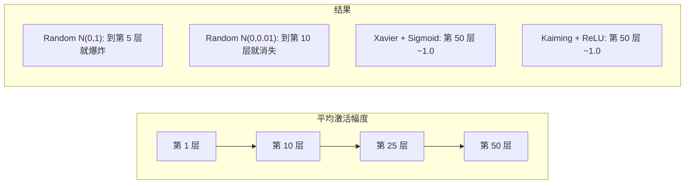
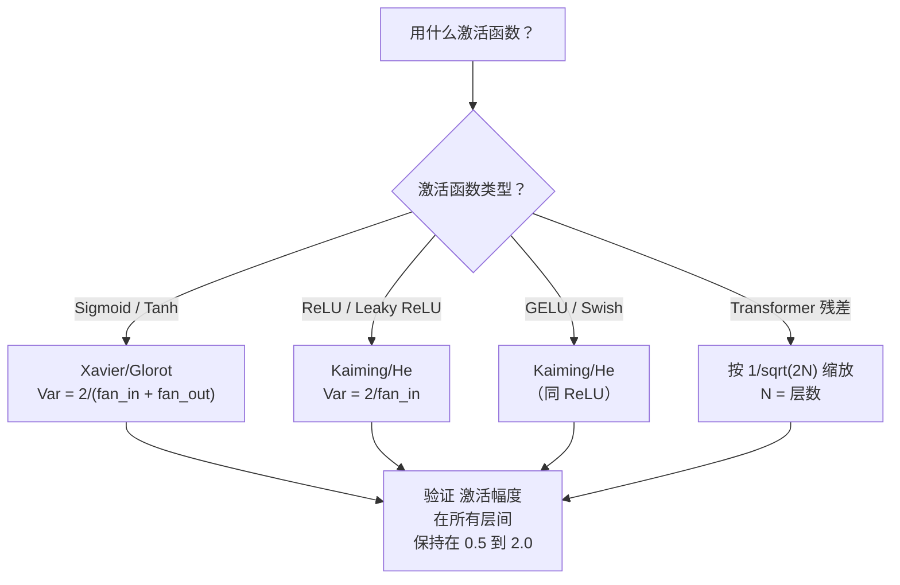

# 权重初始化与训练稳定性

> 译注：本文译自同目录 [`en.md`](./en.md)。术语遵循仓根 [TRANSLATION_GUIDE.md](../../../../TRANSLATION_GUIDE.md)。

> 初始化错了，训练根本启动不了；初始化对了，50 层网络能像 3 层一样平稳收敛。

**Type:** Build
**Languages:** Python
**Prerequisites:** Lesson 03.04 (Activation Functions), Lesson 03.07 (Regularization)
**Time:** ~90 minutes

## 学习目标（Learning Objectives）

- 实现 zero、random、Xavier/Glorot、Kaiming/He 这几种初始化策略，并测量它们对一个 50 层网络中各层激活幅度的影响
- 推导为什么 Xavier 初始化使用 Var(w) = 2/(fan_in + fan_out)，而 Kaiming 用 Var(w) = 2/fan_in
- 演示零初始化带来的对称性问题，并解释为什么仅靠随机的尺度（scale）是不够的
- 把正确的初始化策略与对应的激活函数（activation function）匹配上：sigmoid/tanh 用 Xavier，ReLU/GELU 用 Kaiming

## 问题（The Problem）

把所有权重初始化为零。什么都学不到。每个神经元（neuron）都计算同一个函数，收到同样的 gradient，更新方式完全一致。10,000 个 epoch 之后，你那个 512 神经元的隐藏层依然只是同一个神经元的 512 份副本。你为 512 个参数买了单，最后只拿到 1 个有效参数。

把它们初始化得太大。激活值会在网络中爆炸。到第 10 层，数值飙到 1e15；到第 20 层，溢出成无穷大。gradient 沿着同一条路反向走。

把它们从标准正态分布里随机抽。3 层网络还能凑合工作。到 50 层，信号要么塌缩到零，要么炸到无穷——取决于你随机抽样的尺度是稍稍偏小还是稍稍偏大。「能用」与「废掉」之间的边界薄如刀刃。

权重初始化是深度学习里被严重低估的决策。架构能上论文，optimizer 能上博客，初始化只能塞进脚注。但只要这一步搞错，其他都白搭——网络在训练开始之前就已经死了。

## 概念（The Concept）

### 对称性问题（The Symmetry Problem）

一层里的每个神经元结构都是一样的：把输入乘以权重、加偏置（bias）、过激活函数。如果所有权重都从同一个值开始（零是极端情形），那每个神经元算出的输出都一样。在反向传播（backpropagation）时，每个神经元收到一样的 gradient；在更新步骤里，每个神经元改变的量也一样。

你卡住了。网络有几百个参数，但它们整齐划一地一起动。这就叫对称性，而随机初始化是打破它最暴力的办法——让每个神经元在权重空间的不同位置出发，于是每个都能学到不同的特征。

但「随机」还不够。随机的*尺度*才决定网络能不能训得起来。

### 各层间的方差传播（Variance Propagation Through Layers）

考虑一个 fan_in 个输入的单层：

```
z = w1*x1 + w2*x2 + ... + w_n*x_n
```

如果每个权重 wi 都从方差为 Var(w) 的分布里抽取，每个输入 xi 的方差是 Var(x)，那么输出方差是：

```
Var(z) = fan_in * Var(w) * Var(x)
```

如果 Var(w) = 1 且 fan_in = 512，输出方差就是输入方差的 512 倍。10 层之后：512^10 = 1.2e27。信号炸了。

如果 Var(w) = 0.001，输出方差每层缩小为 0.001 * 512 = 0.512 倍。10 层之后：0.512^10 = 0.00013。信号没了。

目标：选一个 Var(w)，让 Var(z) = Var(x)，使信号幅度跨层保持不变。

### Xavier/Glorot 初始化（Xavier/Glorot Initialization）

Glorot 和 Bengio（2010）针对 sigmoid 和 tanh 激活推导了解。要让前向和反向传播两侧的方差都保持不变：

```
Var(w) = 2 / (fan_in + fan_out)
```

实践中，权重从下面的分布里抽取：

```
w ~ Uniform(-limit, limit)  where limit = sqrt(6 / (fan_in + fan_out))
```

或者：

```
w ~ Normal(0, sqrt(2 / (fan_in + fan_out)))
```

之所以管用，是因为 sigmoid 和 tanh 在零附近近似线性，而正确初始化的激活值正落在这一带。这样几十层下来方差都能保持稳定。

### Kaiming/He 初始化（Kaiming/He Initialization）

ReLU 会干掉一半的输出（所有负值变成零）。有效 fan_in 因此被砍了一半，因为平均下来一半的输入被清零了。Xavier 初始化没考虑这个——它低估了实际需要的方差。

He 等人（2015）调整了公式：

```
Var(w) = 2 / fan_in
```

权重从下面的分布里抽取：

```
w ~ Normal(0, sqrt(2 / fan_in))
```

那个因子 2 用来补偿 ReLU 把一半激活清零的影响。没有它，信号每层缩小 ~0.5 倍。50 层下来：0.5^50 = 8.8e-16。Kaiming 初始化能避免这种情况。

### Transformer 初始化（Transformer Initialization）

GPT-2 引入了另一种模式。残差连接（residual connection）把每个子层的输出加回它的输入：

```
x = x + sublayer(x)
```

每加一次都让方差增大。N 个残差层下来，方差按 N 比例增长。GPT-2 把残差层的权重按 1/sqrt(2N) 缩放，N 是层数。这能让累积的信号幅度保持稳定。

Llama 3（405B 参数，126 层）用了类似的方案。没有这种缩放，残差流（residual stream）会在 126 层 attention 与 feedforward 块中无限增长。

```mermaid
flowchart TD
    subgraph "Zero Init"
        Z1["第 1 层<br/>所有权重 = 0"] --> Z2["第 2 层<br/>所有神经元相同"]
        Z2 --> Z3["第 3 层<br/>仍然相同"]
        Z3 --> ZR["结果 不论多宽<br/>都只有 1 个有效神经元"]
    end

    subgraph "Xavier Init"
        X1["第 1 层<br/>Var = 2/(fan_in+fan_out)"] --> X2["第 2 层<br/>信号稳定"]
        X2 --> X3["第 50 层<br/>信号稳定"]
        X3 --> XR["结果 配合<br/>sigmoid/tanh 训练"]
    end

    subgraph "Kaiming Init"
        K1["第 1 层<br/>Var = 2/fan_in"] --> K2["第 2 层<br/>信号稳定"]
        K2 --> K3["第 50 层<br/>信号稳定"]
        K3 --> KR["结果 配合<br/>ReLU/GELU 训练"]
    end
```



### 50 层之后的激活幅度（Activation Magnitude Through 50 Layers）



### 选对初始化（Choosing the Right Init）



## 动手实现（Build It）

### 第 1 步：初始化策略（Step 1: Initialization Strategies）

四种初始化权重矩阵的方法。每个函数都返回一个 list 嵌套 list（一个二维矩阵），fan_in 列、fan_out 行。

```python
import math
import random


def zero_init(fan_in, fan_out):
    return [[0.0 for _ in range(fan_in)] for _ in range(fan_out)]


def random_init(fan_in, fan_out, scale=1.0):
    return [[random.gauss(0, scale) for _ in range(fan_in)] for _ in range(fan_out)]


def xavier_init(fan_in, fan_out):
    std = math.sqrt(2.0 / (fan_in + fan_out))
    return [[random.gauss(0, std) for _ in range(fan_in)] for _ in range(fan_out)]


def kaiming_init(fan_in, fan_out):
    std = math.sqrt(2.0 / fan_in)
    return [[random.gauss(0, std) for _ in range(fan_in)] for _ in range(fan_out)]
```

### 第 2 步：激活函数（Step 2: Activation Functions）

我们需要 sigmoid、tanh、ReLU 来分别测试每种初始化策略和它对应的激活函数。

```python
def sigmoid(x):
    x = max(-500, min(500, x))
    return 1.0 / (1.0 + math.exp(-x))


def tanh_act(x):
    return math.tanh(x)


def relu(x):
    return max(0.0, x)
```

### 第 3 步：50 层的前向传播（Step 3: Forward Pass Through 50 Layers）

让随机数据穿过一个深网络，并测每一层的平均激活幅度。

```python
def forward_deep(init_fn, activation_fn, n_layers=50, width=64, n_samples=100):
    random.seed(42)
    layer_magnitudes = []

    inputs = [[random.gauss(0, 1) for _ in range(width)] for _ in range(n_samples)]

    for layer_idx in range(n_layers):
        weights = init_fn(width, width)
        biases = [0.0] * width

        new_inputs = []
        for sample in inputs:
            output = []
            for neuron_idx in range(width):
                z = sum(weights[neuron_idx][j] * sample[j] for j in range(width)) + biases[neuron_idx]
                output.append(activation_fn(z))
            new_inputs.append(output)
        inputs = new_inputs

        magnitudes = []
        for sample in inputs:
            magnitudes.append(sum(abs(v) for v in sample) / width)
        mean_mag = sum(magnitudes) / len(magnitudes)
        layer_magnitudes.append(mean_mag)

    return layer_magnitudes
```

### 第 4 步：实验（Step 4: The Experiment）

跑全部组合：zero init、random N(0,1)、random N(0,0.01)、Xavier 配 sigmoid、Xavier 配 tanh、Kaiming 配 ReLU。在关键层打印幅度。

```python
def run_experiment():
    configs = [
        ("Zero init + Sigmoid", lambda fi, fo: zero_init(fi, fo), sigmoid),
        ("Random N(0,1) + ReLU", lambda fi, fo: random_init(fi, fo, 1.0), relu),
        ("Random N(0,0.01) + ReLU", lambda fi, fo: random_init(fi, fo, 0.01), relu),
        ("Xavier + Sigmoid", xavier_init, sigmoid),
        ("Xavier + Tanh", xavier_init, tanh_act),
        ("Kaiming + ReLU", kaiming_init, relu),
    ]

    print(f"{'Strategy':<30} {'L1':>10} {'L5':>10} {'L10':>10} {'L25':>10} {'L50':>10}")
    print("-" * 80)

    for name, init_fn, act_fn in configs:
        mags = forward_deep(init_fn, act_fn)
        row = f"{name:<30}"
        for idx in [0, 4, 9, 24, 49]:
            val = mags[idx]
            if val > 1e6:
                row += f" {'EXPLODED':>10}"
            elif val < 1e-6:
                row += f" {'VANISHED':>10}"
            else:
                row += f" {val:>10.4f}"
        print(row)
```

### 第 5 步：对称性演示（Step 5: Symmetry Demonstration）

证明 zero init 会产生完全相同的神经元。

```python
def symmetry_demo():
    random.seed(42)
    weights = zero_init(2, 4)
    biases = [0.0] * 4

    inputs = [0.5, -0.3]
    outputs = []
    for neuron_idx in range(4):
        z = sum(weights[neuron_idx][j] * inputs[j] for j in range(2)) + biases[neuron_idx]
        outputs.append(sigmoid(z))

    print("\nSymmetry Demo (4 neurons, zero init):")
    for i, out in enumerate(outputs):
        print(f"  Neuron {i}: output = {out:.6f}")
    all_same = all(abs(outputs[i] - outputs[0]) < 1e-10 for i in range(len(outputs)))
    print(f"  All identical: {all_same}")
    print(f"  Effective parameters: 1 (not {len(weights) * len(weights[0])})")
```

### 第 6 步：逐层幅度报告（Step 6: Layer-by-Layer Magnitude Report）

把 50 层激活幅度打成可视化条形图。

```python
def magnitude_report(name, magnitudes):
    print(f"\n{name}:")
    for i, mag in enumerate(magnitudes):
        if i % 5 == 0 or i == len(magnitudes) - 1:
            if mag > 1e6:
                bar = "X" * 50 + " EXPLODED"
            elif mag < 1e-6:
                bar = "." + " VANISHED"
            else:
                bar_len = min(50, max(1, int(mag * 10)))
                bar = "#" * bar_len
            print(f"  Layer {i+1:3d}: {bar} ({mag:.6f})")
```

## 用起来（Use It）

PyTorch 提供了这些函数作为内置：

```python
import torch
import torch.nn as nn

layer = nn.Linear(512, 256)

nn.init.xavier_uniform_(layer.weight)
nn.init.xavier_normal_(layer.weight)

nn.init.kaiming_uniform_(layer.weight, nonlinearity='relu')
nn.init.kaiming_normal_(layer.weight, nonlinearity='relu')

nn.init.zeros_(layer.bias)
```

当你调用 `nn.Linear(512, 256)` 时，PyTorch 默认使用 Kaiming uniform 初始化。这就是为什么大多数简单网络「拿来就能跑」——PyTorch 已经替你做了正确选择。但当你构建自定义架构、或者层数超过 20 时，你就得搞清楚底层在做什么，必要时还得覆盖默认值。

对 transformer，HuggingFace 的模型通常在它们的 `_init_weights` 方法里处理初始化。GPT-2 的实现把残差投影按 1/sqrt(N) 缩放。如果你从零造一个 transformer，你得自己加上这一步。

## 上线部署（Ship It）

这一课产出：
- `outputs/prompt-init-strategy.md` —— 一个用来诊断权重初始化问题、并推荐正确策略的 prompt

## 练习（Exercises）

1. 加上 LeCun 初始化（Var = 1/fan_in，为 SELU 激活设计）。用 LeCun init + tanh 跑 50 层实验，并和 Xavier + tanh 做对比。

2. 实现 GPT-2 的残差缩放：在把每层输出加回残差流之前，乘以 1/sqrt(2*N)。分别跑 50 层「带缩放」和「不带缩放」的版本，测残差幅度增长的速度。

3. 写一个「初始化健康检查（init health check）」函数，输入网络各层的维度和激活类型，输出推荐的初始化方法，并在当前初始化会出问题时发出警告。

4. 用 fan_in = 16 vs fan_in = 1024 跑这个实验。Xavier 和 Kaiming 会自适应 fan_in，但 random init 不会。展示「能用」和「崩掉」之间的差距是怎样随着层变大而拉开的。

5. 实现正交（orthogonal）初始化：生成一个随机矩阵，做 SVD，使用其正交矩阵 U。在 50 层 ReLU 网络上和 Kaiming 做对比。

## 关键术语（Key Terms）

| 术语 | 大家通常怎么说 | 实际指什么 |
|------|----------------|----------------------|
| 权重初始化（Weight initialization） | 「随机设个起点权重」 | 选择初始权重值的策略，它直接决定一个网络是否能被训出来 |
| 对称性破坏（Symmetry breaking） | 「让神经元彼此不同」 | 用随机初始化，使神经元学到不同特征，而不是计算同一个函数 |
| Fan-in | 「神经元的输入数量」 | 进入神经元的连接数，决定了输入方差在加权和里如何累积 |
| Fan-out | 「神经元的输出数量」 | 离开神经元的连接数，与反向传播时维持 gradient 方差有关 |
| Xavier/Glorot 初始化 | 「sigmoid 用的初始化」 | Var(w) = 2/(fan_in + fan_out)，设计目标是让方差穿过 sigmoid 和 tanh 后保持不变 |
| Kaiming/He 初始化 | 「ReLU 用的初始化」 | Var(w) = 2/fan_in，考虑了 ReLU 把一半激活清零这一事实 |
| 方差传播（Variance propagation） | 「信号在层间是变大还是变小」 | 在数学上分析激活方差如何随权重尺度逐层变化 |
| 残差缩放（Residual scaling） | 「GPT-2 的初始化技巧」 | 把残差连接的权重按 1/sqrt(2N) 缩放，防止 N 层 transformer 累计出方差爆炸 |
| 死网络（Dead network） | 「啥都训不动」 | 因初始化不当，导致所有 gradient 都是零或所有激活都饱和的网络 |
| 激活爆炸（Exploding activations） | 「数值变成无穷」 | 权重方差太大，导致激活幅度逐层指数增长 |

## 延伸阅读（Further Reading）

- Glorot & Bengio, "Understanding the difficulty of training deep feedforward neural networks" (2010) —— Xavier 初始化的原始论文，附方差分析
- He et al., "Delving Deep into Rectifiers" (2015) —— 为 ReLU 网络引入 Kaiming 初始化
- Radford et al., "Language Models are Unsupervised Multitask Learners" (2019) —— GPT-2 论文，包含残差缩放初始化
- Mishkin & Matas, "All You Need is a Good Init" (2016) —— layer-sequential unit-variance 初始化，一种相对解析公式的经验性替代方案
