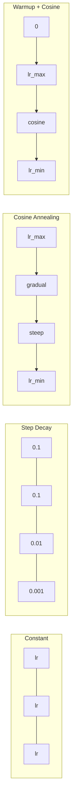
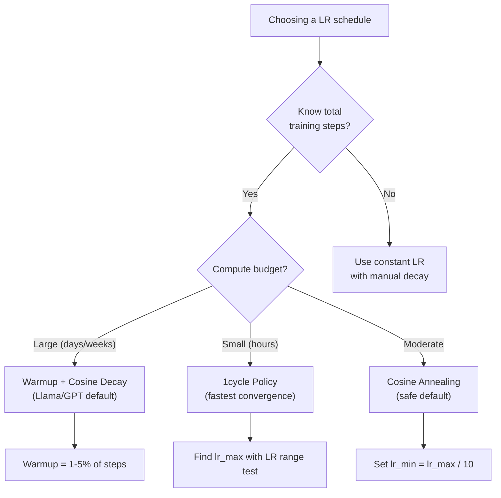
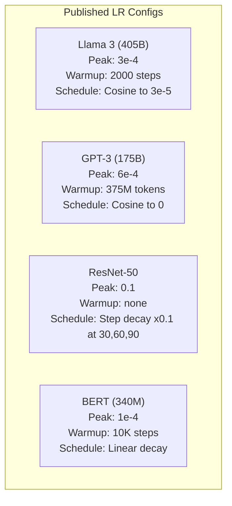

# Learning Rate Schedules と Warmup

> learning rate は最も重要な hyperparameter です。architecture でも、dataset size でも、activation function でもありません。learning rate です。他に何も調整しないなら、これを調整してください。

**種類:** Build
**言語:** Python
**前提:** Lesson 03.06 (Optimizers), Lesson 03.08 (Weight Initialization)
**時間:** 約 90 分

## 学習目標

- constant、step decay、cosine annealing、warmup + cosine、1cycle learning rate schedules をゼロから実装する
- learning rate selection の 3 つの失敗モードを実演する: divergence（高すぎる）、stalling（低すぎる）、oscillation（decay がない）
- Adam ベースの optimizers に warmup が必要な理由と、warmup が学習序盤を安定させる仕組みを説明する
- 同じタスクで 5 つすべての schedules の収束速度を比較し、与えられた training budget に適したものを選ぶ

## 問題

learning rate を 0.1 に設定します。学習は発散し、loss は 3 steps で infinity に跳ねます。0.0001 に設定します。学習は這うように遅くなり、100 epochs 後でもモデルは random からほとんど動いていません。0.01 に設定します。50 epochs はうまく学習しますが、その後 loss は到達できない minimum の周りで oscillate します。steps が大きすぎるからです。

最適な learning rate は定数ではありません。学習中に変わります。序盤は大きな steps で素早く進みたい。後半は小さな steps で sharp minimum に落ち着きたい。90% accurate なモデルと 95% accurate なモデルの違いは、多くの場合 schedule だけです。

過去 3 年に発表された主要なモデルはすべて learning rate schedule を使っています。Llama 3 は peak lr=3e-4、2000 warmup steps、そして 3e-5 までの cosine decay を使いました。GPT-3 は lr=6e-4 と 375 million tokens にわたる warmup を使いました。これらは恣意的な選択ではありません。数百万ドル規模の費用がかかった広範な hyperparameter sweeps の結果です。

schedules を理解する必要があります。defaults はあなたの問題では機能しないからです。pretrained model を fine-tune するとき、正しい schedule はゼロから学習するときとは異なります。batch size を増やすとき、warmup period も変える必要があります。step 10,000 で学習が壊れたとき、それが schedule の問題なのか別の問題なのかを判断できる必要があります。

## 概念

### Constant Learning Rate

最も単純な方法です。数値を 1 つ選び、すべての step で使います。

```
lr(t) = lr_0
```

最適であることはほとんどありません。学習終盤には高すぎる（minimum の周りで oscillation する）か、序盤には低すぎる（小さな steps で compute を無駄にする）かのどちらかです。小さいモデルや debugging には問題なく使えます。1 時間以上学習するものにはひどい選択です。

### Step Decay

ResNet 時代からの昔ながらの方法です。固定 epochs で learning rate を係数（通常は 10x）だけ下げます。

```
lr(t) = lr_0 * gamma^(floor(epoch / step_size))
```

gamma = 0.1、step_size = 30 なら、30 epochs ごとに lr を 10x 下げるという意味です。ResNet-50 はこれを使いました。lr=0.1、epochs 30、60、90 で 10x ずつ下げます。

問題は、最適な decay points が dataset と architecture に依存することです。別の問題へ移ると、いつ下げるかを再調整する必要があります。遷移は急激で、rate が突然変わったときに loss が spike することがあります。

### Cosine Annealing

最大 learning rate から最小値まで、cosine curve に沿って滑らかに decay します。

```
lr(t) = lr_min + 0.5 * (lr_max - lr_min) * (1 + cos(pi * t / T))
```

t は current step、T は total number of steps です。

t=0 では cosine term が 1 なので lr = lr_max です。t=T では cosine term が -1 なので lr = lr_min です。Decay は最初ゆるやかで、中盤に加速し、終盤でもう一度ゆるやかになります。

これは多くの現代的な training runs のデフォルトです。lr_max と lr_min 以外に調整する hyperparameters はありません。cosine 形状は、学習の大部分が中盤に起こるという経験的観察に合っています。その重要な期間には、妥当な step sizes が必要です。

### Warmup: 小さく始める理由

Adam などの adaptive optimizers は、gradient mean と variance の running estimates を保持します。step 0 では、これらの estimates はゼロに初期化されています。最初の数回の gradient updates は、あてにならない statistics に基づいています。この期間に learning rate が大きいと、モデルは巨大で方向の悪い steps を取ります。

Warmup はこれを修正します。小さな learning rate（しばしば lr_max / warmup_steps、またはゼロ）から始め、最初の N steps で lr_max まで線形に上げます。full learning rate に到達する頃には、Adam の statistics は安定しています。

```
lr(t) = lr_max * (t / warmup_steps)     for t < warmup_steps
```

典型的な warmup は total training steps の 1-5% です。Llama 3 は約 1.8 trillion tokens で学習し、2000 steps の warmup を使いました。GPT-3 は 375 million tokens にわたって warmup しました。

### Linear Warmup + Cosine Decay

現代的なデフォルトです。線形に ramp up し、その後 cosine で decay します。

```
if t < warmup_steps:
    lr(t) = lr_max * (t / warmup_steps)
else:
    progress = (t - warmup_steps) / (total_steps - warmup_steps)
    lr(t) = lr_min + 0.5 * (lr_max - lr_min) * (1 + cos(pi * progress))
```

これは Llama、GPT、PaLM、そして多くの現代的な transformers が使っているものです。Warmup は序盤の不安定性を防ぎます。Cosine decay はモデルを良い minimum に落ち着かせます。

### 1cycle Policy

Leslie Smith の発見（2018）です。学習の前半で learning rate を低い値から高い値へ ramp up し、後半で再び下げます。直感に反します。なぜ途中で learning rate を *上げる* のでしょうか。

理論はこうです。高い learning rate は、optimization trajectory に noise を加えることで正則化として働きます。ramp-up phase でモデルは loss landscape をより広く探索し、より良い basins を見つけます。ramp-down phase では、見つけた最良の basin の中で精密化します。

```
Phase 1 (0 to T/2):    lr ramps from lr_max/25 to lr_max
Phase 2 (T/2 to T):    lr ramps from lr_max to lr_max/10000
```

1cycle は固定 compute budget では cosine annealing より速く学習できることがよくあります。トレードオフは、total number of steps を事前に知っている必要があることです。

### Schedule Shapes



### Decision Flowchart



### 発表済みモデルの実数値



## 作ってみる

### Step 1: Schedule Functions

各 function は current step を受け取り、その step の learning rate を返します。

```python
import math


def constant_schedule(step, lr=0.01, **kwargs):
    return lr


def step_decay_schedule(step, lr=0.1, step_size=100, gamma=0.1, **kwargs):
    return lr * (gamma ** (step // step_size))


def cosine_schedule(step, lr=0.01, total_steps=1000, lr_min=1e-5, **kwargs):
    if step >= total_steps:
        return lr_min
    return lr_min + 0.5 * (lr - lr_min) * (1 + math.cos(math.pi * step / total_steps))


def warmup_cosine_schedule(step, lr=0.01, total_steps=1000, warmup_steps=100, lr_min=1e-5, **kwargs):
    if total_steps <= warmup_steps:
        return lr * (step / max(warmup_steps, 1))
    if step < warmup_steps:
        return lr * step / warmup_steps
    progress = (step - warmup_steps) / (total_steps - warmup_steps)
    return lr_min + 0.5 * (lr - lr_min) * (1 + math.cos(math.pi * progress))


def one_cycle_schedule(step, lr=0.01, total_steps=1000, **kwargs):
    mid = max(total_steps // 2, 1)
    if step < mid:
        return (lr / 25) + (lr - lr / 25) * step / mid
    else:
        progress = (step - mid) / max(total_steps - mid, 1)
        return lr * (1 - progress) + (lr / 10000) * progress
```

### Step 2: すべての Schedules を可視化する

各 schedule が学習中にどう変化するかを示す text-based plot を出力します。

```python
def visualize_schedule(name, schedule_fn, total_steps=500, **kwargs):
    steps = list(range(0, total_steps, total_steps // 20))
    if total_steps - 1 not in steps:
        steps.append(total_steps - 1)

    lrs = [schedule_fn(s, total_steps=total_steps, **kwargs) for s in steps]
    max_lr = max(lrs) if max(lrs) > 0 else 1.0

    print(f"\n{name}:")
    for s, lr_val in zip(steps, lrs):
        bar_len = int(lr_val / max_lr * 40)
        bar = "#" * bar_len
        print(f"  Step {s:4d}: lr={lr_val:.6f} {bar}")
```

### Step 3: ネットワークを学習する

circle dataset 上の単純な two-layer network です。前のレッスンと同じですが、ここでは schedule を変えます。

```python
import random


def sigmoid(x):
    x = max(-500, min(500, x))
    return 1.0 / (1.0 + math.exp(-x))


def relu(x):
    return max(0.0, x)


def relu_deriv(x):
    return 1.0 if x > 0 else 0.0


def make_circle_data(n=200, seed=42):
    random.seed(seed)
    data = []
    for _ in range(n):
        x = random.uniform(-2, 2)
        y = random.uniform(-2, 2)
        label = 1.0 if x * x + y * y < 1.5 else 0.0
        data.append(([x, y], label))
    return data


def train_with_schedule(schedule_fn, schedule_name, data, epochs=300, base_lr=0.05, **kwargs):
    random.seed(0)
    hidden_size = 8
    total_steps = epochs * len(data)

    std = math.sqrt(2.0 / 2)
    w1 = [[random.gauss(0, std) for _ in range(2)] for _ in range(hidden_size)]
    b1 = [0.0] * hidden_size
    w2 = [random.gauss(0, std) for _ in range(hidden_size)]
    b2 = 0.0

    step = 0
    epoch_losses = []

    for epoch in range(epochs):
        total_loss = 0
        correct = 0

        for x, target in data:
            lr = schedule_fn(step, lr=base_lr, total_steps=total_steps, **kwargs)

            z1 = []
            h = []
            for i in range(hidden_size):
                z = w1[i][0] * x[0] + w1[i][1] * x[1] + b1[i]
                z1.append(z)
                h.append(relu(z))

            z2 = sum(w2[i] * h[i] for i in range(hidden_size)) + b2
            out = sigmoid(z2)

            error = out - target
            d_out = error * out * (1 - out)

            for i in range(hidden_size):
                d_h = d_out * w2[i] * relu_deriv(z1[i])
                w2[i] -= lr * d_out * h[i]
                for j in range(2):
                    w1[i][j] -= lr * d_h * x[j]
                b1[i] -= lr * d_h
            b2 -= lr * d_out

            total_loss += (out - target) ** 2
            if (out >= 0.5) == (target >= 0.5):
                correct += 1
            step += 1

        avg_loss = total_loss / len(data)
        accuracy = correct / len(data) * 100
        epoch_losses.append(avg_loss)

    return epoch_losses
```

### Step 4: すべての Schedules を比較する

同じネットワークを各 schedule で学習し、final loss と convergence behavior を比較します。

```python
def compare_schedules(data):
    configs = [
        ("Constant", constant_schedule, {}),
        ("Step Decay", step_decay_schedule, {"step_size": 15000, "gamma": 0.1}),
        ("Cosine", cosine_schedule, {"lr_min": 1e-5}),
        ("Warmup+Cosine", warmup_cosine_schedule, {"warmup_steps": 3000, "lr_min": 1e-5}),
        ("1cycle", one_cycle_schedule, {}),
    ]

    print(f"\n{'Schedule':<20} {'Start Loss':>12} {'Mid Loss':>12} {'End Loss':>12} {'Best Loss':>12}")
    print("-" * 70)

    for name, schedule_fn, extra_kwargs in configs:
        losses = train_with_schedule(schedule_fn, name, data, epochs=300, base_lr=0.05, **extra_kwargs)
        mid_idx = len(losses) // 2
        best = min(losses)
        print(f"{name:<20} {losses[0]:>12.6f} {losses[mid_idx]:>12.6f} {losses[-1]:>12.6f} {best:>12.6f}")
```

### Step 5: LR が高すぎる場合と低すぎる場合

3 つの失敗モードを実演します。高すぎる（divergence）、低すぎる（crawling）、ちょうどよい。

```python
def lr_sensitivity(data):
    learning_rates = [1.0, 0.1, 0.01, 0.001, 0.0001]

    print("\nLR Sensitivity (constant schedule, 100 epochs):")
    print(f"  {'LR':>10} {'Start Loss':>12} {'End Loss':>12} {'Status':>15}")
    print("  " + "-" * 52)

    for lr in learning_rates:
        losses = train_with_schedule(constant_schedule, f"lr={lr}", data, epochs=100, base_lr=lr)
        start = losses[0]
        end = losses[-1]

        if end > start or math.isnan(end) or end > 1.0:
            status = "DIVERGED"
        elif end > start * 0.9:
            status = "BARELY MOVED"
        elif end < 0.15:
            status = "CONVERGED"
        else:
            status = "LEARNING"

        end_str = f"{end:.6f}" if not math.isnan(end) else "NaN"
        print(f"  {lr:>10.4f} {start:>12.6f} {end_str:>12} {status:>15}")
```

## 使ってみる

PyTorch は `torch.optim.lr_scheduler` に schedulers を提供しています。

```python
import torch
import torch.optim as optim
from torch.optim.lr_scheduler import CosineAnnealingLR, OneCycleLR, StepLR

model = nn.Sequential(nn.Linear(10, 64), nn.ReLU(), nn.Linear(64, 1))
optimizer = optim.Adam(model.parameters(), lr=3e-4)

scheduler = CosineAnnealingLR(optimizer, T_max=1000, eta_min=1e-5)

for step in range(1000):
    loss = train_step(model, optimizer)
    scheduler.step()
```

warmup + cosine には、lambda scheduler または HuggingFace の `get_cosine_schedule_with_warmup` を使います。

```python
from transformers import get_cosine_schedule_with_warmup

scheduler = get_cosine_schedule_with_warmup(
    optimizer,
    num_warmup_steps=2000,
    num_training_steps=100000,
)
```

HuggingFace function は、多くの Llama と GPT fine-tuning scripts が使っているものです。迷ったら、warmup = total steps の 3-5% として warmup + cosine を使ってください。ほとんどすべてに効きます。

## 完成物

このレッスンで作るもの:
- `outputs/prompt-lr-schedule-advisor.md` - 学習設定に適した learning rate schedule と hyperparameters を推奨するプロンプト

## 演習

1. exponential decay を実装してください: lr(t) = lr_0 * gamma^t、ここで gamma = 0.999 です。circle dataset で cosine annealing と比較してください。

2. learning rate range test（Leslie Smith）を実装してください。LR を 1e-7 から 1 まで指数的に増やしながら数百 steps 学習します。loss vs LR を plot してください。最適な max LR は loss が増え始める直前です。

3. warmup + cosine で学習しますが、warmup length を total steps の 0%、1%、5%、10%、20% に変えてください。学習が最も安定する sweet spot を見つけてください。

4. cosine annealing with warm restarts（SGDR）を実装してください。T steps ごとに learning rate を lr_max に reset し、再び decay します。長めの training run で標準の cosine と比較してください。

5. training loss を監視し、loss が安定したら warmup から cosine に自動で切り替え、loss が長く plateau したら lr を下げる "schedule surgeon" を作ってください。

## 重要用語

| 用語 | よく言われること | 実際の意味 |
|------|----------------|------------|
| Learning rate | 「モデルが学ぶ速さ」 | gradient に掛けられ、parameter update size を決める scalar |
| Schedule | 「LR を時間とともに変える」 | training step を learning rate に写像し、収束を最適化するための function |
| Warmup | 「小さい LR から始める」 | optimizer statistics を安定させるため、最初の N steps で LR を near-zero から target value まで線形に上げること |
| Cosine annealing | 「滑らかな LR decay」 | training 中に lr_max から lr_min へ cosine curve に従って LR を下げること |
| Step decay | 「milestones で LR を下げる」 | 固定 epoch intervals で LR に係数（通常 0.1）を掛けること |
| 1cycle policy | 「上げてから下げる」 | Leslie Smith の手法。より速い収束のために、単一 cycle で LR を上げてから下げる |
| LR range test | 「最適な learning rate を見つける」 | loss が発散し始める値を見つけるため、LR を上げながら短く学習すること |
| Cosine with warm restarts | 「reset して繰り返す」 | LR を周期的に lr_max へ reset し、再び decay すること（SGDR） |
| Eta min | 「LR の下限」 | schedule が decay して到達する minimum learning rate |
| Peak learning rate | 「最大 LR」 | training 中に到達する最高 LR。典型的には warmup 後の値 |

## 参考文献

- Loshchilov & Hutter, "SGDR: Stochastic Gradient Descent with Warm Restarts" (2017) - cosine annealing と warm restarts を導入した
- Smith, "Super-Convergence: Very Fast Training of Neural Networks Using Large Learning Rates" (2018) - 1cycle policy の論文
- Touvron et al., "Llama 2: Open Foundation and Fine-Tuned Chat Models" (2023) - 大規模で使われる warmup + cosine schedule を記録している
- Goyal et al., "Accurate, Large Minibatch SGD: Training ImageNet in 1 Hour" (2017) - large batch training の linear scaling rule と warmup
