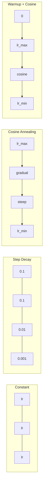
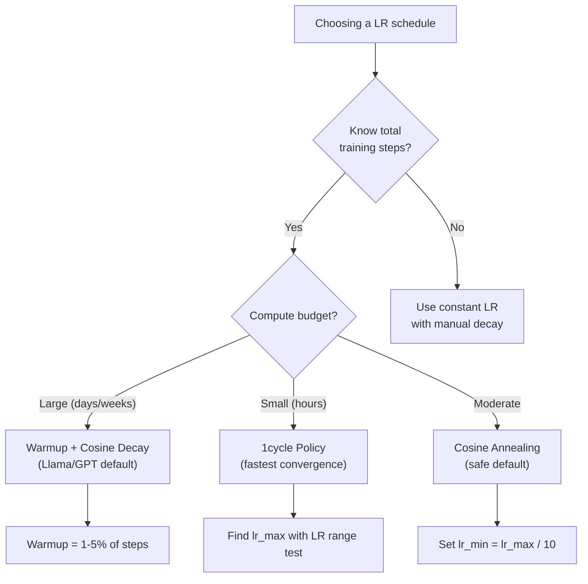
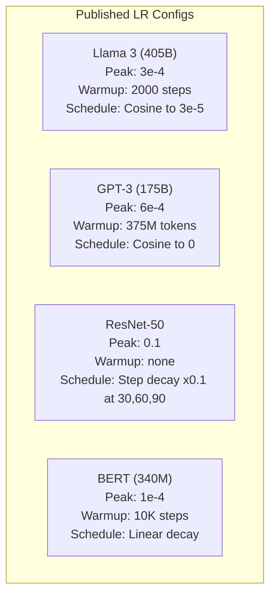

# Öğrenme Hızı Programları ve Isınma

> Öğrenme oranı en önemli hiper parametredir. Mimarlık değil. dataset boyutu değil. Etkinleştirme işlevi değil. Öğrenme oranı. Başka hiçbir şeyi ayarlamazsanız, bunu ayarlayın.

**Tür:** Yapım
**Diller:** Python
**Önkoşullar:** Ders 03.06 (Optimize Ediciler), Ders 03.08 (Ağırlık Başlatma)
**Süre:** ~90 dakika

## Öğrenme Hedefleri

- Sabit, adımlı bozulma, kosinüs tavlama, ısınma + kosinüs ve 1 döngülü öğrenme oranı programlarını sıfırdan uygulayın
- Öğrenme hızı seçiminin üç başarısızlık modunu gösterin: sapma (çok yüksek), durma (çok düşük) ve salınım (bozulma yok)
- Adam tabanlı optimize ediciler için ısınmanın neden gerekli olduğunu ve bunun erken eğitimi nasıl stabilize ettiğini açıklayın
- Aynı görevdeki beş programın tümündeki yakınsama hızını karşılaştırın ve belirli bir eğitim bütçesi için uygun olanı seçin

## Sorun

Öğrenme oranını 0,1'e ayarlayın. Eğitim birbirinden ayrılır; kayıp 3 adımda sonsuza sıçrar. 0,0001'e ayarlayın. Eğitim taramaları - 100 çağdan sonra model rastgeleden zar zor hareket etti. 0,01'e ayarlayın. Eğitim 50 dönem boyunca çalışır, ardından kayıp, adımlar çok büyük olduğundan asla ulaşamayacağı minimum düzeyde salınır.

Optimum öğrenme oranı sabit değildir. Antrenman sırasında değişir. Başlangıçta, büyük adımların hızla ilerlemesini istiyorsunuz. Antrenmanın sonlarında, küçük adımların keskin bir minimuma yerleşmesini istiyorsunuz. %90 doğru bir model ile %95 doğru bir model arasındaki fark genellikle sadece programdır.

Son üç yılda yayınlanan her ana model bir öğrenme oranı çizelgesi kullanıyor. Lama 3, 2000 ısınma adımı ve 3e-5'e kosinüs bozunması ile zirve lr=3e-4'ü kullandı. GPT-3, 375 milyondan fazla token ısınmayla lr=6e-4'ü kullandı. Bunlar keyfi tercihler değil. Milyonlarca dolara mal olan kapsamlı hiperparametre taramalarının sonucudurlar.

Varsayılanlar sorununuz için işe yaramayacağından programları anlamalısınız. Önceden eğitilmiş bir modele ince ayar yaptığınızda doğru zamanlama, sıfırdan eğitimden farklıdır. Parti boyutunu artırdığınızda ısınma süresinin değişmesi gerekir. Antrenman 10.000. adımda ara verdiğinde bunun bir program sorunu mu yoksa başka bir şey mi olduğunu bilmeniz gerekir.

## Konsept

### Sabit Öğrenme Oranı

En basit yaklaşım. Bir sayı seçin ve onu her adımda kullanın.

```
lr(t) = lr_0
```

Nadiren optimal. Eğitimin sonu için ya çok yüksek (minimum civarında salınım) ya da başlangıç ​​için çok düşük (küçük adımlarda boşa harcanan hesaplama). Küçük modeller ve hata ayıklama için iyi çalışır. Bir saatten fazla antrenman yapan herhangi bir şey için berbat bir seçim.

### Adım Azalması

ResNet döneminden kalma eski tarz yaklaşım. Sabit dönemlerde öğrenme oranını bir kat (genellikle 10 kat) azaltın.

```
lr(t) = lr_0 * gamma^(floor(epoch / step_size))
```

Gamma = 0,1 ve step_size = 30 şu anlama gelir: lr her 30 dönemde 10 kat düşer. ResNet-50 bunu kullandı - lr=0,1, 30, 60 ve 90. dönemlerde 10 kat düşüş.

Sorun: Optimum bozulma noktaları dataset'ye ve mimariye bağlıdır. Farklı bir soruna geçin ve ne zaman bırakacağınızı yeniden ayarlamanız gerekir. Geçişler ani olur; oran aniden değiştiğinde kayıplar artabilir.

### Kosinüs Tavlama

Kosinüs eğrisini takip ederek maksimum öğrenme oranından minimuma doğru yumuşak azalma:

```
lr(t) = lr_min + 0.5 * (lr_max - lr_min) * (1 + cos(pi * t / T))
```

Burada t mevcut adımdır ve T toplam adım sayısıdır.

t=0'da kosinüs terimi 1'dir, yani lr = lr_max. t=T'de kosinüs terimi -1'dir, yani lr = lr_min. Çürüme ilk başta hafiftir, ortalarda hızlanır ve sonlara doğru tekrar yumuşak hale gelir.

Bu, çoğu modern eğitim çalıştırması için varsayılandır. Lr_max ve lr_min'in ötesinde ayarlanacak hiperparametre yok. Kosinüs şekli, öğrenmenin çoğunun eğitimin ortasında gerçekleştiğine dair ampirik gözlemle eşleşir; bu kritik dönemde makul adım boyutları istersiniz.

### Isınma: Neden Küçük Başlamalısınız?

Adam ve diğer uyarlanabilir optimize ediciler, gradient ortalama ve varyansın çalışan tahminlerini korur. Adım 0'da bu tahminler sıfır olarak başlatılır. İlk birkaç gradient güncellemesi gereksiz istatistiklere dayanmaktadır. Bu dönemde öğrenme oranınız yüksekse model büyük, kötü yönlendirilmiş adımlar atar.

Isınma bunu düzeltir. Küçük bir öğrenme oranıyla başlayın (çoğunlukla lr_max / Warmup_steps ve hatta sıfır) ve ilk N adımda doğrusal olarak lr_max'a kadar yükselin. Tam öğrenme oranına ulaştığınızda Adam'ın istatistikleri istikrara kavuşur.

```
lr(t) = lr_max * (t / warmup_steps)     for t < warmup_steps
```

Tipik ısınma: Toplam antrenman adımlarının %1-5'i. Lama 3 ~1,8 trilyon token antrenmanı yaptı ve 2000 adıma kadar ısındı. GPT-3, 375 milyondan fazla token'yi ısıttı.

### Doğrusal Isınma + Kosinüs Azalması

Modern varsayılan. Doğrusal olarak artırın, ardından kosinüs ile azalın:

```
if t < warmup_steps:
    lr(t) = lr_max * (t / warmup_steps)
else:
    progress = (t - warmup_steps) / (total_steps - warmup_steps)
    lr(t) = lr_min + 0.5 * (lr_max - lr_min) * (1 + cos(pi * progress))
```

Llama, GPT, PaLM ve çoğu modern transformer'nin kullandığı şey budur. Isınma erken dengesizliği önler. Kosinüs bozunması modeli iyi bir minimuma yerleştirir.

### 1döngülü Politikası

Leslie Smith'in keşfi (2018): eğitimin ilk yarısında öğrenme oranını düşük bir değerden yüksek bir değere yükseltin, ardından ikinci yarıda tekrar düşürün. Mantık dışı -- neden öğrenme oranını yarı yolda *artırırsınız*?

Teori: Yüksek öğrenme oranı, optimizasyon yörüngesine gürültü ekleyerek düzenlileştirme işlevi görür. Model, artış aşaması sırasında kayıp ortamının daha fazlasını araştırarak daha iyi havzalar buluyor. Azaltma aşaması daha sonra bulunan en iyi havzaya göre rafine edilir.

```
Phase 1 (0 to T/2):    lr ramps from lr_max/25 to lr_max
Phase 2 (T/2 to T):    lr ramps from lr_max to lr_max/10000
```

1cycle, sabit bir işlem bütçesi için genellikle kosinüs tavlamadan daha hızlı eğitim verir. Takas: toplam adım sayısını önceden bilmelisiniz.

### Şekilleri Zamanlama



### Karar Akış Şeması



### Yayınlanmış Modellerden Gerçek Sayılar



```figure
lr-schedule
```

## İnşa Et

### Adım 1: İşlevleri Zamanlama

Her fonksiyon geçerli adımı alır ve o adımdaki öğrenme oranını döndürür.

```python
import math


def constant_schedule(step, lr=0.01, **kwargs):
    return lr


def step_decay_schedule(step, lr=0.1, step_size=100, gamma=0.1, **kwargs):
    return lr * (gamma ** (step // step_size))


def cosine_schedule(step, lr=0.01, total_steps=1000, lr_min=1e-5, **kwargs):
    if step >= total_steps:
        return lr_min
    return lr_min + 0.5 * (lr - lr_min) * (1 + math.cos(math.pi * step / total_steps))


def warmup_cosine_schedule(step, lr=0.01, total_steps=1000, warmup_steps=100, lr_min=1e-5, **kwargs):
    if total_steps <= warmup_steps:
        return lr * (step / max(warmup_steps, 1))
    if step < warmup_steps:
        return lr * step / warmup_steps
    progress = (step - warmup_steps) / (total_steps - warmup_steps)
    return lr_min + 0.5 * (lr - lr_min) * (1 + math.cos(math.pi * progress))


def one_cycle_schedule(step, lr=0.01, total_steps=1000, **kwargs):
    mid = max(total_steps // 2, 1)
    if step < mid:
        return (lr / 25) + (lr - lr / 25) * step / mid
    else:
        progress = (step - mid) / max(total_steps - mid, 1)
        return lr * (1 - progress) + (lr / 10000) * progress
```

### Adım 2: Tüm Programları Görselleştirin

Her programın eğitim boyunca nasıl geliştiğini gösteren metin tabanlı bir grafik yazdırın.

```python
def visualize_schedule(name, schedule_fn, total_steps=500, **kwargs):
    steps = list(range(0, total_steps, total_steps // 20))
    if total_steps - 1 not in steps:
        steps.append(total_steps - 1)

    lrs = [schedule_fn(s, total_steps=total_steps, **kwargs) for s in steps]
    max_lr = max(lrs) if max(lrs) > 0 else 1.0

    print(f"\n{name}:")
    for s, lr_val in zip(steps, lrs):
        bar_len = int(lr_val / max_lr * 40)
        bar = "#" * bar_len
        print(f"  Step {s:4d}: lr={lr_val:.6f} {bar}")
```

### 3. Adım: Eğitim Ağı

Önceki derslerle aynı olan dataset çemberi üzerinde basit iki katmanlı bir ağ, ancak şimdi programı değiştiriyoruz.

```python
import random


def sigmoid(x):
    x = max(-500, min(500, x))
    return 1.0 / (1.0 + math.exp(-x))


def relu(x):
    return max(0.0, x)


def relu_deriv(x):
    return 1.0 if x > 0 else 0.0


def make_circle_data(n=200, seed=42):
    random.seed(seed)
    data = []
    for _ in range(n):
        x = random.uniform(-2, 2)
        y = random.uniform(-2, 2)
        label = 1.0 if x * x + y * y < 1.5 else 0.0
        data.append(([x, y], label))
    return data


def train_with_schedule(schedule_fn, schedule_name, data, epochs=300, base_lr=0.05, **kwargs):
    random.seed(0)
    hidden_size = 8
    total_steps = epochs * len(data)

    std = math.sqrt(2.0 / 2)
    w1 = [[random.gauss(0, std) for _ in range(2)] for _ in range(hidden_size)]
    b1 = [0.0] * hidden_size
    w2 = [random.gauss(0, std) for _ in range(hidden_size)]
    b2 = 0.0

    step = 0
    epoch_losses = []

    for epoch in range(epochs):
        total_loss = 0
        correct = 0

        for x, target in data:
            lr = schedule_fn(step, lr=base_lr, total_steps=total_steps, **kwargs)

            z1 = []
            h = []
            for i in range(hidden_size):
                z = w1[i][0] * x[0] + w1[i][1] * x[1] + b1[i]
                z1.append(z)
                h.append(relu(z))

            z2 = sum(w2[i] * h[i] for i in range(hidden_size)) + b2
            out = sigmoid(z2)

            error = out - target
            d_out = error * out * (1 - out)

            for i in range(hidden_size):
                d_h = d_out * w2[i] * relu_deriv(z1[i])
                w2[i] -= lr * d_out * h[i]
                for j in range(2):
                    w1[i][j] -= lr * d_h * x[j]
                b1[i] -= lr * d_h
            b2 -= lr * d_out

            total_loss += (out - target) ** 2
            if (out >= 0.5) == (target >= 0.5):
                correct += 1
            step += 1

        avg_loss = total_loss / len(data)
        accuracy = correct / len(data) * 100
        epoch_losses.append(avg_loss)

    return epoch_losses
```

### Adım 4: Tüm Programları Karşılaştırın

Her programla aynı ağı eğitin ve son kayıp ve yakınsama davranışını karşılaştırın.

```python
def compare_schedules(data):
    configs = [
        ("Constant", constant_schedule, {}),
        ("Step Decay", step_decay_schedule, {"step_size": 15000, "gamma": 0.1}),
        ("Cosine", cosine_schedule, {"lr_min": 1e-5}),
        ("Warmup+Cosine", warmup_cosine_schedule, {"warmup_steps": 3000, "lr_min": 1e-5}),
        ("1cycle", one_cycle_schedule, {}),
    ]

    print(f"\n{'Schedule':<20} {'Start Loss':>12} {'Mid Loss':>12} {'End Loss':>12} {'Best Loss':>12}")
    print("-" * 70)

    for name, schedule_fn, extra_kwargs in configs:
        losses = train_with_schedule(schedule_fn, name, data, epochs=300, base_lr=0.05, **extra_kwargs)
        mid_idx = len(losses) // 2
        best = min(losses)
        print(f"{name:<20} {losses[0]:>12.6f} {losses[mid_idx]:>12.6f} {losses[-1]:>12.6f} {best:>12.6f}")
```

### Adım 5: LR Çok Yüksek ve Çok Düşük

Üç başarısızlık modunu gösterin: çok yüksek (ıraksama), çok düşük (sürünme) ve tam doğru.

```python
def lr_sensitivity(data):
    learning_rates = [1.0, 0.1, 0.01, 0.001, 0.0001]

    print("\nLR Sensitivity (constant schedule, 100 epochs):")
    print(f"  {'LR':>10} {'Start Loss':>12} {'End Loss':>12} {'Status':>15}")
    print("  " + "-" * 52)

    for lr in learning_rates:
        losses = train_with_schedule(constant_schedule, f"lr={lr}", data, epochs=100, base_lr=lr)
        start = losses[0]
        end = losses[-1]

        if end > start or math.isnan(end) or end > 1.0:
            status = "DIVERGED"
        elif end > start * 0.9:
            status = "BARELY MOVED"
        elif end < 0.15:
            status = "CONVERGED"
        else:
            status = "LEARNING"

        end_str = f"{end:.6f}" if not math.isnan(end) else "NaN"
        print(f"  {lr:>10.4f} {start:>12.6f} {end_str:>12} {status:>15}")
```

## Kullan onu

PyTorch, `torch.optim.lr_scheduler`'de zamanlayıcılar sağlar:

```python
import torch
import torch.optim as optim
from torch.optim.lr_scheduler import CosineAnnealingLR, OneCycleLR, StepLR

model = nn.Sequential(nn.Linear(10, 64), nn.ReLU(), nn.Linear(64, 1))
optimizer = optim.Adam(model.parameters(), lr=3e-4)

scheduler = CosineAnnealingLR(optimizer, T_max=1000, eta_min=1e-5)

for step in range(1000):
    loss = train_step(model, optimizer)
    scheduler.step()
```

Isınma + kosinüs için bir lambda zamanlayıcı veya HuggingFace'in `get_cosine_schedule_with_warmup` ürününü kullanın:

```python
from transformers import get_cosine_schedule_with_warmup

scheduler = get_cosine_schedule_with_warmup(
    optimizer,
    num_warmup_steps=2000,
    num_training_steps=100000,
)
```

HuggingFace işlevi çoğu Llama ve GPT fine-tuning komut dosyasının kullandığı işlevdir. Şüphe duyduğunuzda, ısınma = toplam adımların %3-5'i olacak şekilde ısınma + kosinüs kullanın. Neredeyse her şey için işe yarıyor.

## Gönderin

Bu ders şunları üretir:
- `outputs/prompt-lr-schedule-advisor.md` -- eğitim kurulumunuz için doğru öğrenme hızı programını ve hiperparametreleri öneren bir prompt

## Egzersizler

1. Üstel azalmayı uygulayın: lr(t) = lr_0 * gamma^t burada gamma = 0,999. dataset çemberindeki kosinüs tavlaması ile karşılaştırın.

2. Öğrenme oranı aralığı testini uygulayın (Leslie Smith): LR'yi katlanarak 1e-7'den 1'e çıkarırken birkaç yüz adım eğitin. Grafik kaybı ve LR. Optimum maksimum LR, kaybın artmaya başlamasından hemen önceki zamandır.

3. Isınma + kosinüs ile antrenman yapın ancak ısınma uzunluğunu değiştirin: toplam adımların %0, %1, %5, %10, %20'si. Eğitimin en istikrarlı olduğu tatlı noktayı bulun.

4. Sıcak yeniden başlatmalarla (SGDR) kosinüs tavlamayı uygulayın: öğrenme oranını her T adımında lr_max'a sıfırlayın ve tekrar bozun. Daha uzun bir eğitim çalıştırmasında standart kosinüs ile karşılaştırın.

5. Eğitim kaybını izleyen ve kayıp stabil hale geldiğinde otomatik olarak ısınma modundan kosinüse geçiş yapan ve kayıp çok uzun süre sabit kalırsa lr'yi azaltan bir "program cerrahı" oluşturun.

## Anahtar Terimler

| Dönem | İnsanlar ne diyor | Aslında ne anlama geliyor |
|------|----------------|----------------------|
| Öğrenme oranı | "Model ne kadar hızlı öğreniyor" | Parametre güncelleme boyutunu belirlemek için gradient ile çarpan skaler |
| Program | "LR'yi zamanla değiştirin" | Yakınsamayı optimize etmek için tasarlanmış, eğitim adımını öğrenme hızıyla eşleştiren bir işlev |
| Isınma | "Küçük bir LR ile başlayın" | Optimize edici istatistiklerini stabilize etmek için LR'yi ilk N adım boyunca sıfıra yakın bir değerden hedef değere doğrusal olarak yükseltme |
| Kosinüs tavlama | "Düzgün LR bozulması" | Eğitim boyunca kosinüs eğrisini takip ederek LR'yi lr_max'tan lr_min'e düşürmek |
| Adım çürümesi | "Dönüm noktalarında LR'yi bırakın" | LR'yi sabit dönem aralıklarında bir faktörle (genellikle 0,1) çarpmak |
| 1döngü politikası | "Yukarı, sonra aşağı" | Leslie Smith'in daha hızlı yakınsama için LR'yi tek bir döngüde yukarı ve aşağı artırma yöntemi |
| LR aralık testi | "En iyi öğrenme oranını bulun" | Kaybın ayrışmaya başladığı değeri bulmak için LR'yi artırırken kısa bir eğitim |
| Sıcak yeniden başlatmalı kosinüs | "Sıfırla ve tekrarla" | LR'nin periyodik olarak lr_max'a sıfırlanması ve tekrar azalması (SGDR) |
| Eta dk | "LR'nin zemini" | Zamanlamanın azalacağı minimum öğrenme oranı |
| En yüksek öğrenme oranı | "Maksimum LR" | Antrenman sırasında, genellikle ısınma sonrasında ulaşılan en yüksek LR |

## Daha Fazla Okuma

- Loshchilov & Hutter, "SGDR: Sıcak Yeniden Başlatmalarla Stokastik Gradient İniş" (2017) -- kosinüs tavlamayı ve sıcak yeniden başlatmaları tanıttı
- Smith, "Süper Yakınsama: Büyük Öğrenme Oranlarını Kullanarak Neural Network'lerin Çok Hızlı Eğitimi" (2018) -- 1 döngü politika belgesi
- Touvron ve diğerleri, "Llama 2: Açık Temel ve İnce Ayarlı Sohbet Modelleri" (2023) -- geniş ölçekte kullanılan ısınma + kosinüs programını belgeliyor
- Goyal ve diğerleri, "Doğru, Büyük Minibatch SGD: ImageNet'i 1 Saatte Eğitim" (2017) -- büyük toplu eğitim için doğrusal ölçeklendirme kuralı ve ısınma
